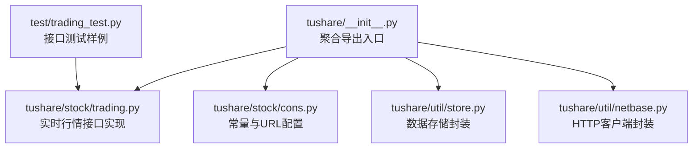
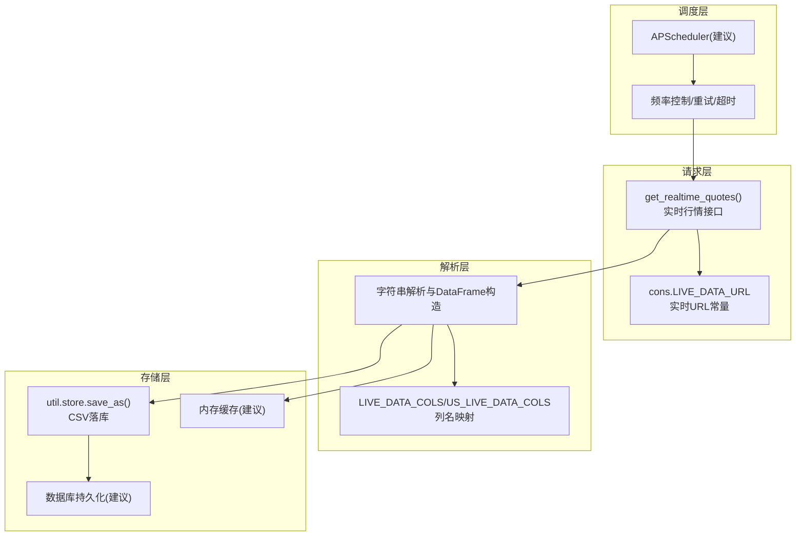
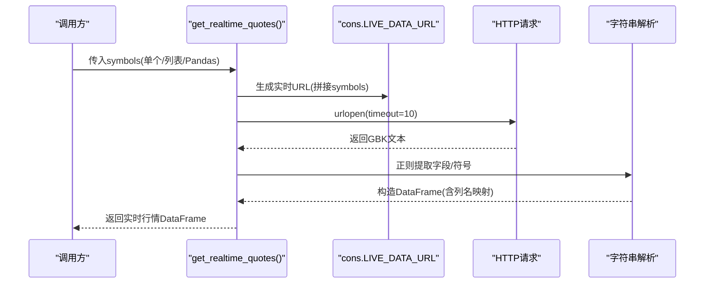
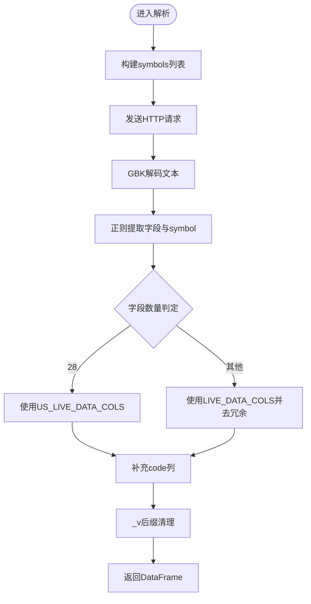
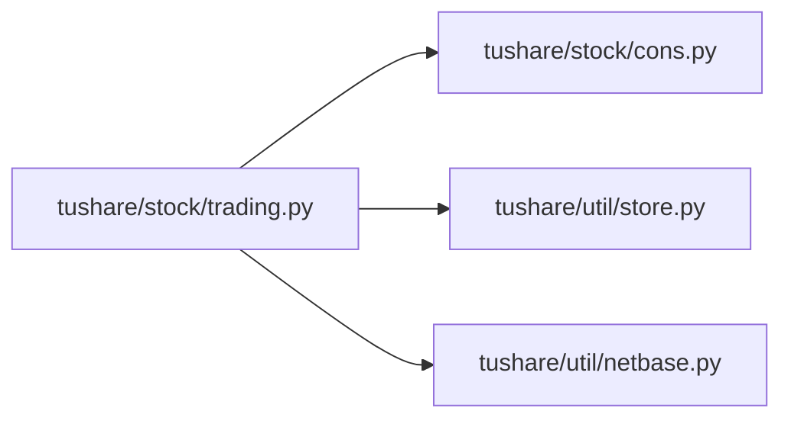

# 实时数据订阅

<cite>
**本文引用的文件**
- [tushare/__init__.py](file://tushare/__init__.py)
- [README.md](file://README.md)
- [tushare/stock/trading.py](file://tushare/stock/trading.py)
- [tushare/stock/cons.py](file://tushare/stock/cons.py)
- [tushare/util/store.py](file://tushare/util/store.py)
- [tushare/util/netbase.py](file://tushare/util/netbase.py)
- [test/trading_test.py](file://test/trading_test.py)
</cite>

## 目录
1. [简介](#简介)
2. [项目结构](#项目结构)
3. [核心组件](#核心组件)
4. [架构总览](#架构总览)
5. [详细组件分析](#详细组件分析)
6. [依赖分析](#依赖分析)
7. [性能考量](#性能考量)
8. [故障排查指南](#故障排查指南)
9. [结论](#结论)
10. [附录](#附录)

## 简介
本技术文档围绕 TuShare 的实时数据订阅能力展开，重点讲解如何使用 get_realtime_quotes() 接口实现股票数据的自动订阅与更新，涵盖数据格式解析、批量订阅、请求频率控制、超时与重试、定时任务调度建议、以及 CSV/数据库/内存缓存等存储方案。文档以仓库现有实现为依据，提供可操作的实践建议与可视化图示，帮助开发者快速搭建稳定可靠的实时数据订阅系统。

## 项目结构
TuShare 采用按领域分层的组织方式：顶层导出入口负责聚合子模块；股票相关行情接口集中在 stock 子包；工具类如存储、网络基础封装位于 util 子包；测试样例位于 test 目录。

图表来源
- [tushare/__init__.py:11-18](file://tushare/__init__.py#L11-L18)
- [tushare/stock/trading.py:323-394](file://tushare/stock/trading.py#L323-L394)
- [tushare/stock/cons.py:87](file://tushare/stock/cons.py#L87)
- [tushare/util/store.py:14-44](file://tushare/util/store.py#L14-L44)
- [tushare/util/netbase.py:9-29](file://tushare/util/netbase.py#L9-L29)
- [test/trading_test.py:29-31](file://test/trading_test.py#L29-L31)

章节来源
- [tushare/__init__.py:11-18](file://tushare/__init__.py#L11-L18)
- [README.md:166-182](file://README.md#L166-L182)

## 核心组件
- 实时行情接口：get_realtime_quotes() 提供单只或多只股票的实时快照数据，解析来自 sina 的实时行情字符串，输出标准化 DataFrame。
- 常量与URL：cons.py 定义 LIVE_DATA_URL、LIVE_DATA_COLS 等常量，统一请求地址与列名映射。
- 存储封装：util/store.py 提供将 DataFrame 保存为 CSV 的通用方法，便于落地存储。
- 网络基础：util/netbase.py 封装 HTTP 请求头与超时设置，作为底层网络能力支撑。
- 测试样例：test/trading_test.py 展示 get_realtime_quotes 的基本调用方式。

章节来源
- [tushare/stock/trading.py:323-394](file://tushare/stock/trading.py#L323-L394)
- [tushare/stock/cons.py:67-70](file://tushare/stock/cons.py#L67-L70)
- [tushare/util/store.py:24-44](file://tushare/util/store.py#L24-L44)
- [tushare/util/netbase.py:26-28](file://tushare/util/netbase.py#L26-L28)
- [test/trading_test.py:29-31](file://test/trading_test.py#L29-L31)

## 架构总览
实时订阅系统由“请求层—解析层—存储层—调度层”构成。请求层通过 get_realtime_quotes() 与 sina 实时接口交互；解析层将原始字符串解析为结构化数据；存储层负责 CSV/数据库/内存缓存；调度层负责定时触发与频率控制。

图表来源
- [tushare/stock/trading.py:323-394](file://tushare/stock/trading.py#L323-L394)
- [tushare/stock/cons.py:67-70](file://tushare/stock/cons.py#L67-L70)
- [tushare/util/store.py:24-44](file://tushare/util/store.py#L24-L44)

## 详细组件分析

### 实时行情接口 get_realtime_quotes()
- 功能概述：支持单只或批量股票代码，返回包含名称、开盘、昨收、现价、最高、最低、买卖价、成交量、成交金额、买卖盘口、日期与时间等字段的 DataFrame。
- 输入处理：支持字符串、列表/元组/集合/Pandas Series，内部统一转换为 sina 兼容的 symbol 列表。
- 请求与解析：构造 LIVE_DATA_URL，发送 HTTP 请求，读取 GBK 编码文本，正则提取每只股票的字段，按列名映射构造 DataFrame。
- 输出规范：根据字段数量区分国内与美股数据列名，统一添加 code 字段与时间戳列。

图表来源
- [tushare/stock/trading.py:323-394](file://tushare/stock/trading.py#L323-L394)
- [tushare/stock/cons.py:87](file://tushare/stock/cons.py#L87)

章节来源
- [tushare/stock/trading.py:323-394](file://tushare/stock/trading.py#L323-L394)
- [README.md:166-182](file://README.md#L166-L182)

### 数据格式解析与列名映射
- 国内股票列名：LIVE_DATA_COLS，包含 name、open、pre_close、price、high、low、bid、ask、volume、amount、买卖盘口1-5档、date、time 等。
- 美股股票列名：US_LIVE_DATA_COLS，包含 name、price、change_percent、time、change、open、high、low、52周高低、volume、avg_volume、mktcap、eps、pe、extended_* 等。
- 解析逻辑：正则匹配每只股票字段，按字段数量判断是否为美股，分别映射到对应列名；统一去除冗余列并补全 code 字段。

图表来源
- [tushare/stock/trading.py:361-394](file://tushare/stock/trading.py#L361-L394)
- [tushare/stock/cons.py:67-70](file://tushare/stock/cons.py#L67-L70)

章节来源
- [tushare/stock/trading.py:361-394](file://tushare/stock/trading.py#L361-L394)
- [tushare/stock/cons.py:67-70](file://tushare/stock/cons.py#L67-L70)

### 批量订阅与请求频率控制
- 批量订阅：get_realtime_quotes() 支持列表/元组/集合/Pandas Series，内部统一拼接为 sina 兼容的 symbol 字符串。
- 频率控制建议：结合 pause 参数与外部调度器，避免请求过于频繁导致限流或失败；建议每次请求间加入毫秒级延迟。
- 超时与重试：requests 使用 timeout=10；可在上层封装统一的重试逻辑，设置最大重试次数与退避策略。

章节来源
- [tushare/stock/trading.py:361-371](file://tushare/stock/trading.py#L361-L371)
- [tushare/stock/trading.py:323-394](file://tushare/stock/trading.py#L323-L394)

### 容错机制与异常处理
- 空结果处理：当未解析到任何 symbol 时返回 None，调用方可据此进行降级或重试。
- 网络异常：统一捕获异常并抛出 NETWORK_URL_ERROR_MSG 对应的错误提示，便于上层统一处理。
- 超时控制：HTTP 请求设置 timeout=10，避免长时间阻塞。

章节来源
- [tushare/stock/trading.py:383-384](file://tushare/stock/trading.py#L383-L384)
- [tushare/stock/trading.py:371](file://tushare/stock/trading.py#L371)
- [tushare/stock/cons.py:195](file://tushare/stock/cons.py#L195)

### 定时任务调度最佳实践（APScheduler）
- 任务拆分：将“拉取—解析—入库—通知”拆分为独立任务，便于监控与重试。
- 任务队列：使用 APScheduler 的 jobstore 与 executor 管理任务生命周期，避免重复执行。
- 内存优化：定期清理过期数据，限制内存中缓存条目数量，必要时落库。
- 重试与退避：对网络异常与空结果设置指数退避重试，避免雪崩效应。

（本节为通用实践建议，不直接分析具体文件）

### 数据存储方案
- CSV 文件存储：使用 util/store.save_as() 将 DataFrame 保存为 CSV，适合小规模或离线分析场景。
- 数据库持久化：建议使用 SQLite/MySQL/PostgreSQL 等关系型数据库，按天分区或索引优化查询。
- 内存缓存：使用内存中的字典或 Pandas 缓存最新行情，注意容量与过期策略。

章节来源
- [tushare/util/store.py:24-44](file://tushare/util/store.py#L24-L44)

## 依赖分析
- get_realtime_quotes() 依赖 cons.LIVE_DATA_URL 与列名常量；内部使用正则与字符串处理完成解析；返回 DataFrame 供上层存储与调度使用。
- util/netbase.Client 提供统一的 HTTP 请求封装，可作为网络层抽象的基础。
- util/store.Store 提供 CSV 保存能力，便于落地存储。

图表来源
- [tushare/stock/trading.py:323-394](file://tushare/stock/trading.py#L323-L394)
- [tushare/stock/cons.py:87](file://tushare/stock/cons.py#L87)
- [tushare/util/store.py:24-44](file://tushare/util/store.py#L24-L44)
- [tushare/util/netbase.py:26-28](file://tushare/util/netbase.py#L26-L28)

章节来源
- [tushare/stock/trading.py:323-394](file://tushare/stock/trading.py#L323-L394)
- [tushare/stock/cons.py:87](file://tushare/stock/cons.py#L87)
- [tushare/util/store.py:24-44](file://tushare/util/store.py#L24-L44)
- [tushare/util/netbase.py:26-28](file://tushare/util/netbase.py#L26-L28)

## 性能考量
- 请求频率：合理设置 pause 与外部调度间隔，避免触发目标服务限流。
- 超时与重试：统一 timeout=10，结合指数退避减少抖动。
- 数据解析：正则与字符串处理在大批量时存在成本，建议批量化处理并缓存列名映射。
- 存储写入：批量写入数据库或合并写入 CSV，减少 IO 次数。

（本节为通用指导，不直接分析具体文件）

## 故障排查指南
- 现象：返回 None
  - 可能原因：未解析到任何 symbol 或接口返回为空。
  - 处理建议：检查 symbols 输入合法性与网络可达性，增加重试与告警。
- 现象：抛出网络错误
  - 可能原因：timeout 触发或网络异常。
  - 处理建议：增大超时或启用重试，检查代理与防火墙。
- 现象：列名不匹配
  - 可能原因：字段数量与预期不符（国内/美股差异）。
  - 处理建议：根据字段数量分支使用对应列名映射。

章节来源
- [tushare/stock/trading.py:383-384](file://tushare/stock/trading.py#L383-L384)
- [tushare/stock/trading.py:371](file://tushare/stock/trading.py#L371)
- [tushare/stock/cons.py:67-70](file://tushare/stock/cons.py#L67-L70)

## 结论
基于现有实现，get_realtime_quotes() 提供了简洁高效的实时行情拉取能力。结合统一的列名映射、CSV 存储封装与网络基础封装，开发者可以快速搭建订阅系统。建议在生产环境中引入 APScheduler 进行调度、完善重试与退避策略，并根据业务规模选择合适的数据库持久化方案，确保系统的稳定性与可维护性。

## 附录
- 快速开始（参考 README 示例）
  - 单只股票：传入字符串代码
  - 批量股票：传入列表/元组/集合/Pandas Series
- 测试参考
  - test/trading_test.py 展示了 get_realtime_quotes 的基本调用方式

章节来源
- [README.md:166-182](file://README.md#L166-L182)
- [test/trading_test.py:29-31](file://test/trading_test.py#L29-L31)