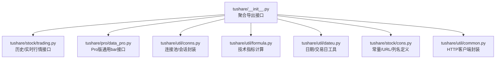
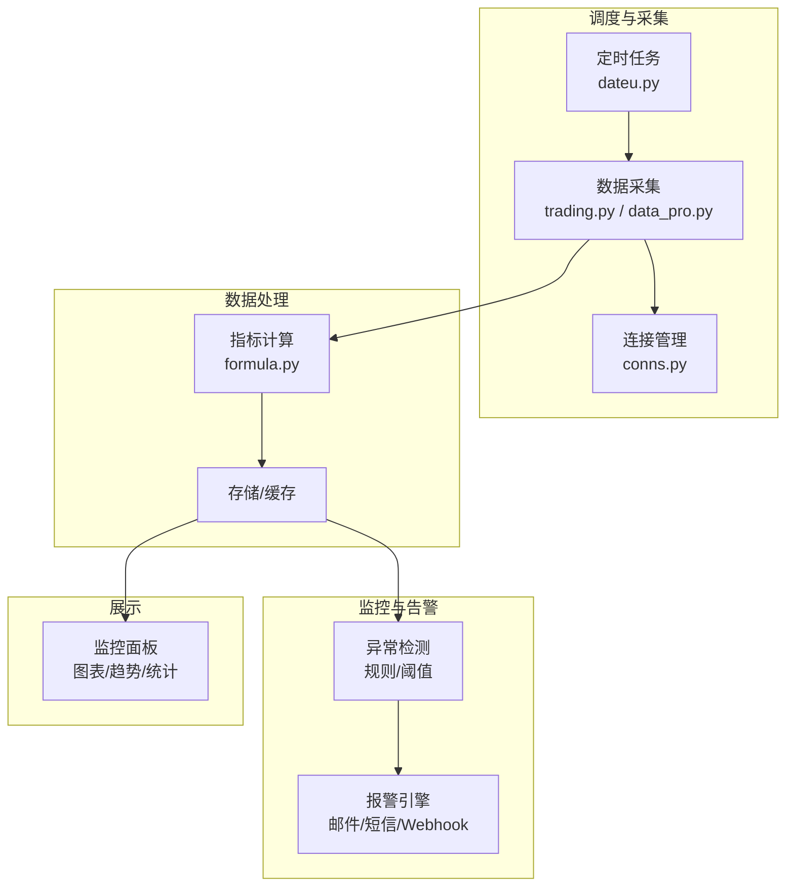
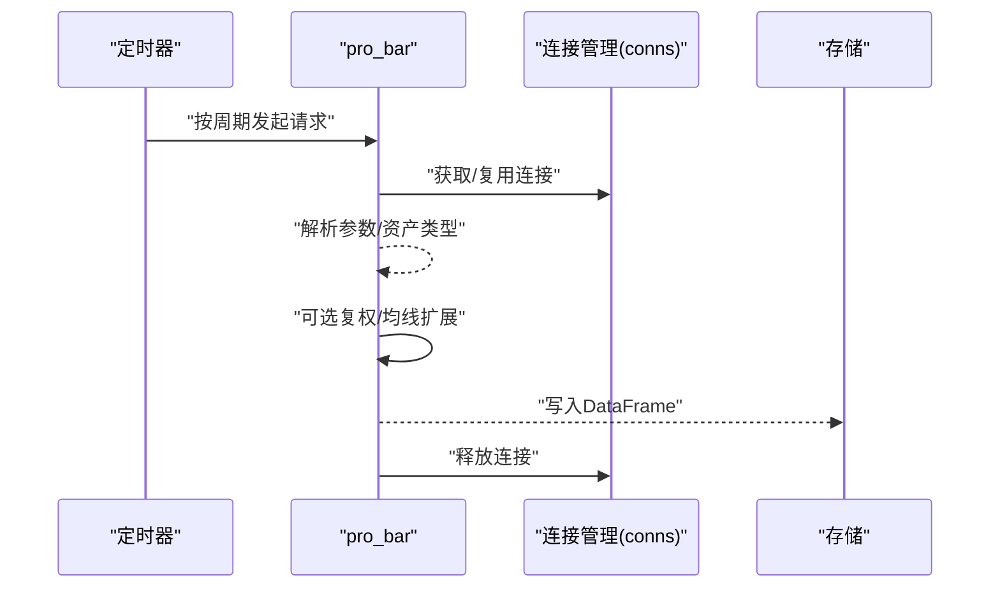
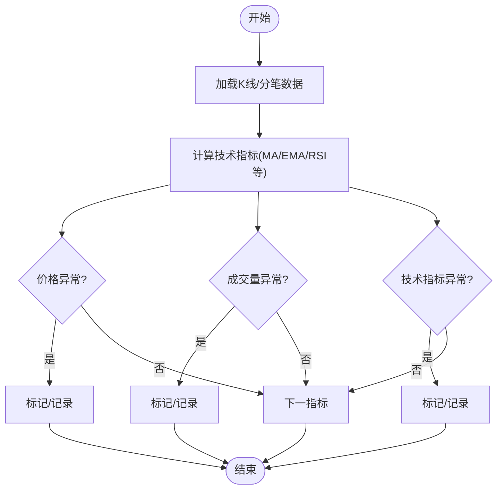
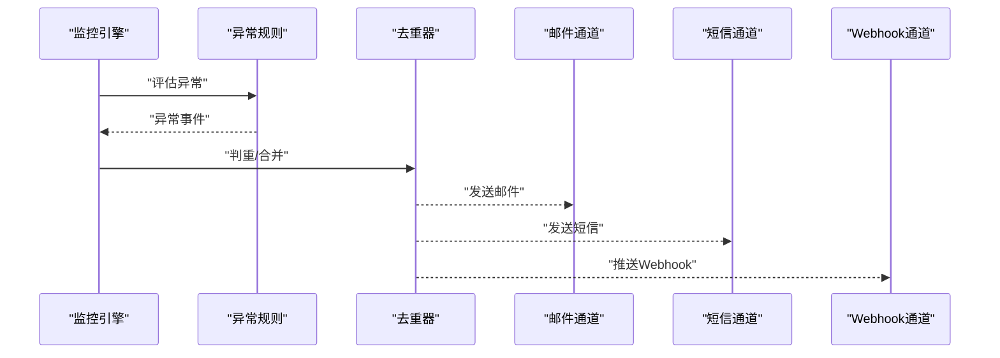
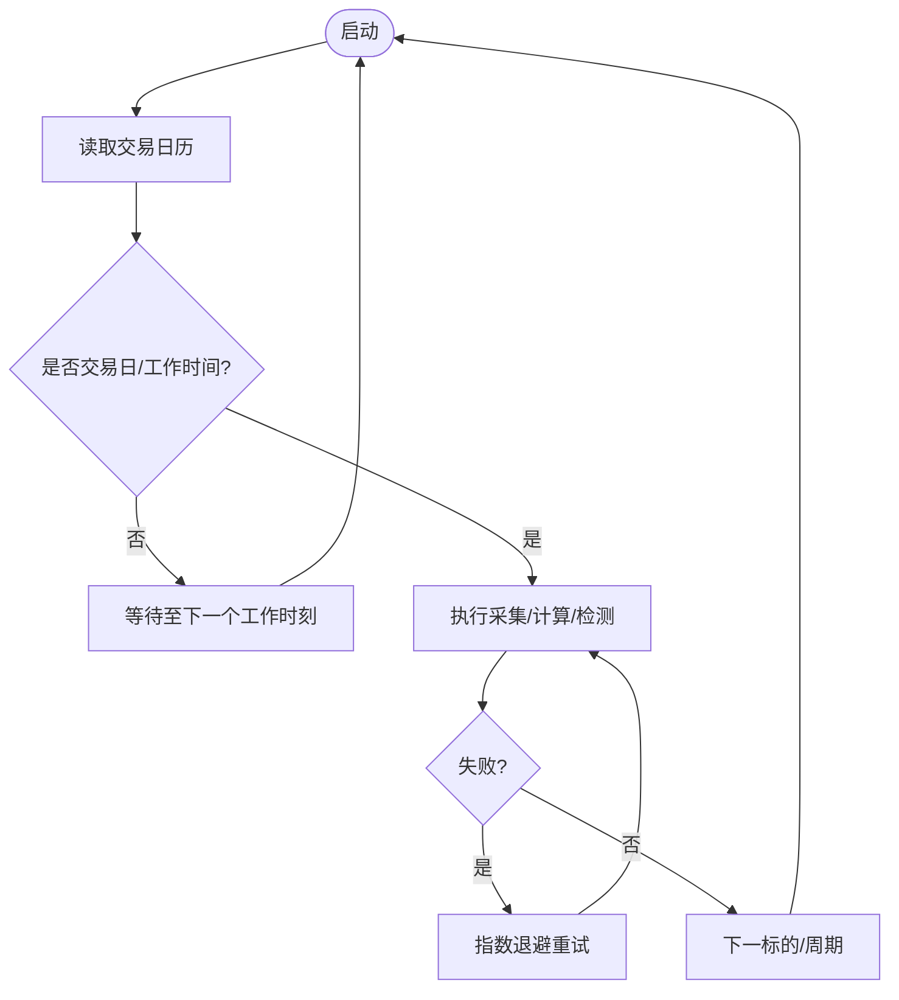
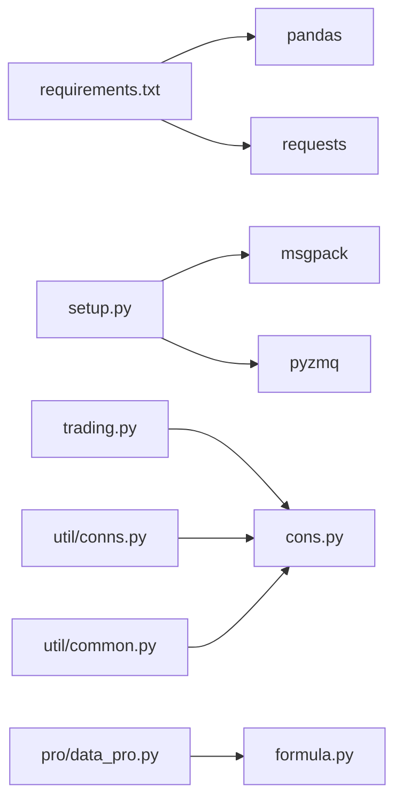

# 实时监控系统

<cite>
**本文引用的文件**
- [README.md](file://README.md)
- [requirements.txt](file://requirements.txt)
- [setup.py](file://setup.py)
- [tushare/__init__.py](file://tushare/__init__.py)
- [tushare/stock/trading.py](file://tushare/stock/trading.py)
- [tushare/pro/data_pro.py](file://tushare/pro/data_pro.py)
- [tushare/util/conns.py](file://tushare/util/conns.py)
- [tushare/util/common.py](file://tushare/util/common.py)
- [tushare/util/formula.py](file://tushare/util/formula.py)
- [tushare/util/dateu.py](file://tushare/util/dateu.py)
- [tushare/stock/cons.py](file://tushare/stock/cons.py)
</cite>

## 目录
1. [简介](#简介)
2. [项目结构](#项目结构)
3. [核心组件](#核心组件)
4. [架构总览](#架构总览)
5. [详细组件分析](#详细组件分析)
6. [依赖关系分析](#依赖关系分析)
7. [性能考量](#性能考量)
8. [故障排查指南](#故障排查指南)
9. [结论](#结论)
10. [附录](#附录)

## 简介
本指南面向希望基于 TuShare 构建“实时股票监控系统”的工程师与数据分析师，围绕以下目标展开：实时数据订阅、异常检测、报警机制、定时任务设置与管理、监控面板设计、系统性能优化与运维实践。文档以仓库现有代码为依据，结合接口能力与数据结构，给出可落地的实现路径与最佳实践。

## 项目结构
仓库采用按领域/模块划分的组织方式，核心入口位于 tushare 包的导出层，数据接口分布在 stock、pro、util 等子包中；测试与文档位于根目录。

图示来源
- [tushare/__init__.py:11-140](file://tushare/__init__.py#L11-L140)
- [tushare/stock/trading.py:1-200](file://tushare/stock/trading.py#L1-L200)
- [tushare/pro/data_pro.py:1-158](file://tushare/pro/data_pro.py#L1-L158)
- [tushare/util/conns.py:1-61](file://tushare/util/conns.py#L1-L61)
- [tushare/util/formula.py:1-262](file://tushare/util/formula.py#L1-L262)
- [tushare/util/dateu.py:1-129](file://tushare/util/dateu.py#L1-L129)
- [tushare/stock/cons.py:1-200](file://tushare/stock/cons.py#L1-L200)
- [tushare/util/common.py:18-86](file://tushare/util/common.py#L18-L86)

章节来源
- [tushare/__init__.py:11-140](file://tushare/__init__.py#L11-L140)

## 核心组件
- 接口入口与导出
  - 通过 tushare/__init__.py 聚合导出各类数据接口，便于统一调用。
- 实时行情与历史数据
  - tushare/stock/trading.py 提供历史K线、分笔、实时报价等接口，适合构建监控的数据源。
- Pro版通用bar接口
  - tushare/pro/data_pro.py 提供统一的 bar 接口，支持多资产、多周期、复权与均线扩展，便于集中化管理。
- 连接与会话
  - tushare/util/conns.py 封装 TDX 行情连接，提供 get_apis()/close_apis() 生命周期管理。
- 技术指标计算
  - tushare/util/formula.py 提供 MA、EMA、MACD、KDJ、RSI 等常用指标，用于异常检测与趋势分析。
- 日期与交易日
  - tushare/util/dateu.py 提供交易日历、节假日判断、时间窗口计算等，支撑定时任务与回测。
- 常量与配置
  - tushare/stock/cons.py 定义数据列名、URL、K线周期映射等，保证接口一致性。
- HTTP客户端
  - tushare/util/common.py 提供带授权头的 HTTPS 请求封装，便于扩展外部服务对接。

章节来源
- [tushare/__init__.py:11-140](file://tushare/__init__.py#L11-L140)
- [tushare/stock/trading.py:32-100](file://tushare/stock/trading.py#L32-L100)
- [tushare/pro/data_pro.py:34-140](file://tushare/pro/data_pro.py#L34-L140)
- [tushare/util/conns.py:14-61](file://tushare/util/conns.py#L14-L61)
- [tushare/util/formula.py:12-262](file://tushare/util/formula.py#L12-L262)
- [tushare/util/dateu.py:78-99](file://tushare/util/dateu.py#L78-L99)
- [tushare/stock/cons.py:63-120](file://tushare/stock/cons.py#L63-L120)
- [tushare/util/common.py:18-86](file://tushare/util/common.py#L18-L86)

## 架构总览
下图展示了监控系统的核心交互：定时任务驱动数据采集，数据经清洗与指标计算后进入存储；异常检测模块持续评估，触发报警；监控面板负责可视化与统计。

图示来源
- [tushare/util/dateu.py:78-99](file://tushare/util/dateu.py#L78-L99)
- [tushare/stock/trading.py:32-100](file://tushare/stock/trading.py#L32-L100)
- [tushare/pro/data_pro.py:34-140](file://tushare/pro/data_pro.py#L34-L140)
- [tushare/util/conns.py:14-61](file://tushare/util/conns.py#L14-L61)
- [tushare/util/formula.py:12-262](file://tushare/util/formula.py#L12-L262)

## 详细组件分析

### 组件A：实时数据订阅与采集
- 设计要点
  - 使用 trading.py 的实时报价接口作为“准实时”数据源；对于高频场景，结合 data_pro.py 的 pro_bar 接口按分钟级拉取。
  - 通过 conns.py 管理连接生命周期，避免频繁建立/断开连接带来的延迟与错误。
- 关键流程（以 pro_bar 为例）
  - 参数校验与资产类型识别 → 选择对应 API（日线/周线/月线/分钟线）→ 可选复权与均线扩展 → 返回标准化 DataFrame。
- 性能建议
  - 合理设置 retry_count 与 pause，避免触发风控。
  - 对于多标的并行采集，建议使用连接池与并发控制，结合队列削峰。

图示来源
- [tushare/pro/data_pro.py:34-140](file://tushare/pro/data_pro.py#L34-L140)
- [tushare/util/conns.py:14-61](file://tushare/util/conns.py#L14-L61)

章节来源
- [tushare/pro/data_pro.py:34-140](file://tushare/pro/data_pro.py#L34-L140)
- [tushare/stock/trading.py:32-100](file://tushare/stock/trading.py#L32-L100)
- [tushare/util/conns.py:14-61](file://tushare/util/conns.py#L14-L61)

### 组件B：异常检测算法实现
- 设计要点
  - 基于 formula.py 的指标体系，构建“价格异常、成交量异常、技术指标异常”三类检测规则。
  - 引入滑动窗口与统计阈值（如 Z-Score、分位数），并结合交易日历进行业务过滤。
- 检测维度
  - 价格异常：涨跌幅超阈值、跳空缺口、布林带突破。
  - 成交量异常：量比/换手率异常、放量/缩量突变。
  - 技术指标异常：MACD背离、KDJ超买超卖、RSI极端值。
- 复杂度与优化
  - 指标计算以 O(n) 线性遍历为主，注意窗口大小与重采样频率的平衡。
  - 对批量标的可采用向量化与缓存，减少重复计算。

图示来源
- [tushare/util/formula.py:12-262](file://tushare/util/formula.py#L12-L262)
- [tushare/util/dateu.py:78-99](file://tushare/util/dateu.py#L78-L99)

章节来源
- [tushare/util/formula.py:12-262](file://tushare/util/formula.py#L12-L262)
- [tushare/util/dateu.py:78-99](file://tushare/util/dateu.py#L78-L99)

### 组件C：报警机制设计与实现
- 设计要点
  - 报警通道解耦：邮件、短信、Webhook 分别由独立模块处理，统一通过事件总线触发。
  - 报警去重：同一周期内相同标的与同类型异常仅发送一次。
  - 报警分级：根据异常严重程度与影响面设置不同级别，匹配不同通道优先级。
- 扩展点
  - 邮件：可基于内置模板引擎生成报告（仓库提供邮件合并工具，可用于报告生成）。
  - 短信：对接第三方短信网关，统一鉴权与限流。
  - Webhook：支持回调地址配置与重试策略。

图示来源
- [tushare/util/mailmerge.py:22-219](file://tushare/util/mailmerge.py#L22-L219)

章节来源
- [tushare/util/mailmerge.py:22-219](file://tushare/util/mailmerge.py#L22-L219)

### 组件D：定时任务设置与管理
- 设计要点
  - 使用 dateu.py 的交易日历与时间工具，确保任务仅在交易时段运行。
  - 任务粒度：分钟级（高频）、小时级（中频）、日级（低频）。
  - 资源控制：最大并发数、队列长度、重试退避、熔断保护。
- 调度策略
  - 固定周期：每分钟/5分钟/15分钟拉取一次。
  - 自适应：根据接口限流与网络状况动态调整频率。
  - 容错：失败重试与降级策略，避免雪崩。

图示来源
- [tushare/util/dateu.py:78-99](file://tushare/util/dateu.py#L78-L99)

章节来源
- [tushare/util/dateu.py:78-99](file://tushare/util/dateu.py#L78-L99)

### 组件E：监控面板设计方案
- 设计要点
  - 数据展示：K线图、分时图、成交量柱状图、技术指标叠加。
  - 趋势分析：多周期对比、移动平均线、布林带、通道分析。
  - 统计图表：异常分布热力图、报警趋势、指标分布直方图。
- 交互与联动
  - 支持鼠标悬停显示详情、缩放与平移、多标的对比。
  - 报警弹窗与标记，点击跳转到异常详情。

（本节为概念性设计说明，无需代码引用）

### 组件F：系统性能优化
- 接口调优
  - 合理设置 retry_count 与 pause，避免触发风控。
  - 批量请求时分批与限速，结合连接池复用。
- 计算优化
  - 指标计算尽量向量化，避免逐行循环。
  - 缓存热点数据与中间结果，减少重复计算。
- 存储优化
  - 采用列式存储与压缩，降低 IO 压力。
  - 按天/周/月归档历史数据，清理过期数据。

（本节为通用优化建议，无需代码引用）

### 组件G：故障处理与日志记录
- 故障处理
  - 网络异常：指数退避重试、熔断保护、降级策略。
  - 接口限流：自动降速与排队，避免 429/5xx。
  - 数据异常：空结果与格式校验，记录并上报。
- 日志记录
  - 采集日志：时间戳、标的、周期、耗时、状态码。
  - 异常日志：堆栈、上下文、重试次数。
  - 报警日志：通道、内容、接收人、回执。

（本节为通用运维建议，无需代码引用）

## 依赖关系分析
- 外部依赖
  - pandas、requests、lxml、simplejson、beautifulsoup4 等，用于数据处理与网络请求。
  - setup.py 中还声明了 msgpack、pyzmq，便于高性能序列化与消息传输。
- 内部依赖
  - trading.py 依赖 cons.py 的列名与 URL 常量；pro/data_pro.py 依赖 formula.py 的 MA 等指标。
  - util/conns.py 依赖 stock/cons.py 的服务器地址与端口配置。

图示来源
- [requirements.txt:1-6](file://requirements.txt#L1-L6)
- [setup.py:65-74](file://setup.py#L65-L74)
- [tushare/stock/trading.py:18-25](file://tushare/stock/trading.py#L18-L25)
- [tushare/pro/data_pro.py:11-12](file://tushare/pro/data_pro.py#L11-L12)
- [tushare/util/conns.py:9-11](file://tushare/util/conns.py#L9-L11)
- [tushare/util/common.py:15-16](file://tushare/util/common.py#L15-L16)

章节来源
- [requirements.txt:1-6](file://requirements.txt#L1-L6)
- [setup.py:65-74](file://setup.py#L65-L74)
- [tushare/stock/trading.py:18-25](file://tushare/stock/trading.py#L18-L25)
- [tushare/pro/data_pro.py:11-12](file://tushare/pro/data_pro.py#L11-L12)
- [tushare/util/conns.py:9-11](file://tushare/util/conns.py#L9-L11)
- [tushare/util/common.py:15-16](file://tushare/util/common.py#L15-L16)

## 性能考量
- I/O 与网络
  - 控制请求并发与速率，避免被源站限流；合理设置超时与重试。
- 计算与内存
  - 使用向量化与分块处理，避免一次性加载全量历史数据。
- 存储与索引
  - 为时间列与标的列建立索引，加速查询与分组。
- 可观测性
  - 采集耗时、异常率、重试次数等指标，形成性能看板。

（本节为通用指导，无需代码引用）

## 故障排查指南
- 常见问题定位
  - 网络错误：检查代理、DNS、防火墙；确认 retry_count 与 pause 设置。
  - 数据为空：核对日期区间、标的代码、接口权限。
  - 指标异常：检查缺失值填充、窗口大小、复权因子。
- 工具与接口
  - 使用 dateu.py 的 is_holiday 判断是否为交易日。
  - 使用 util/common.py 的 HTTPS 客户端进行外部服务联调。

章节来源
- [tushare/util/dateu.py:87-99](file://tushare/util/dateu.py#L87-L99)
- [tushare/util/common.py:18-86](file://tushare/util/common.py#L18-L86)

## 结论
基于 TuShare 的实时监控系统应以“接口稳定、计算高效、规则清晰、通道解耦”为核心原则。通过统一的 pro_bar 接口与连接管理、完善的指标体系与异常检测规则、灵活的报警通道与定时任务调度，以及可观测与可维护的监控面板，可构建一套高可用、易扩展的实时监控平台。

## 附录
- 快速开始与安装
  - 参考 README 的安装与升级说明，确保依赖版本满足要求。
- 接口能力概览
  - 历史/实时行情、分笔、指数、复权、均线、因子等，详见各模块导出与实现。

章节来源
- [README.md:30-42](file://README.md#L30-L42)
- [tushare/__init__.py:11-140](file://tushare/__init__.py#L11-L140)