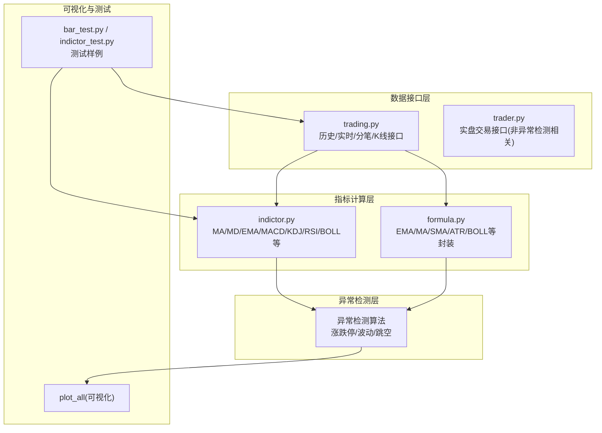
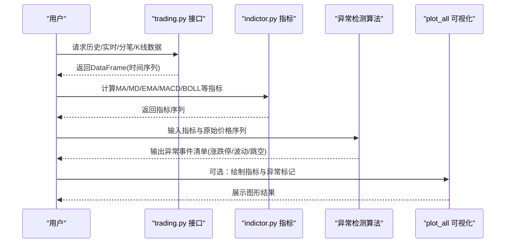
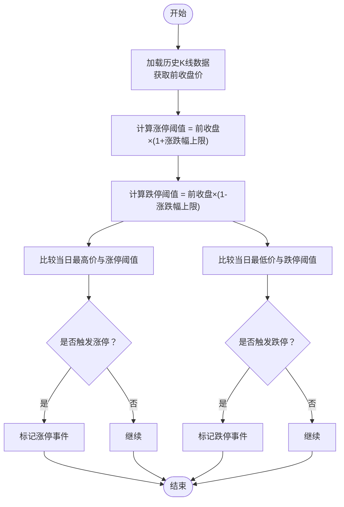
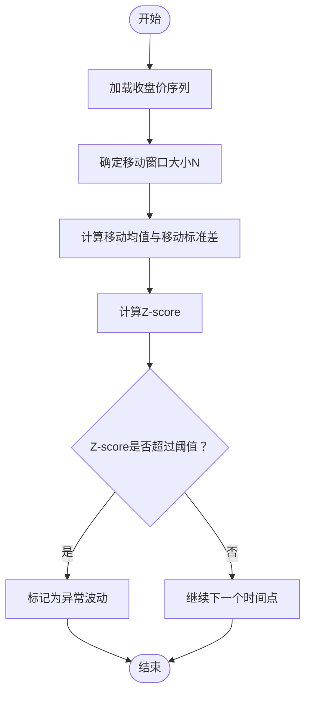
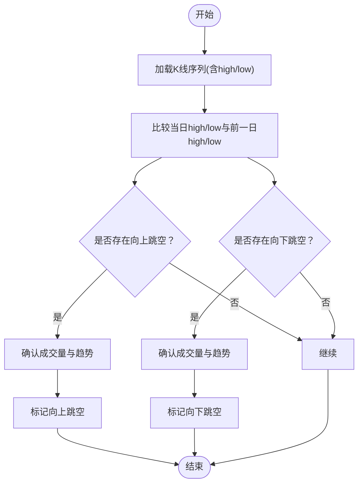
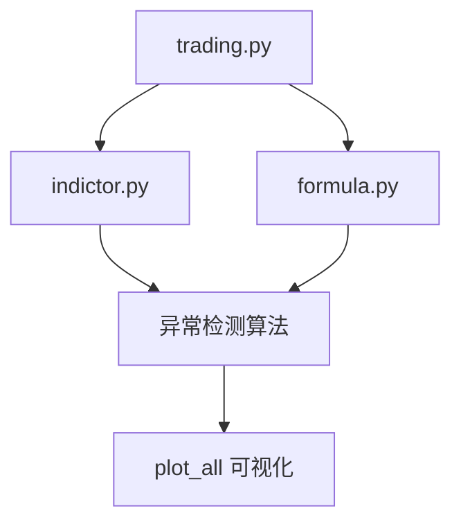

# 价格异常检测

<cite>
**本文引用的文件**
- [README.md](file://README.md)
- [trading.py](file://tushare/stock/trading.py)
- [indictor.py](file://tushare/stock/indictor.py)
- [formula.py](file://tushare/util/formula.py)
- [trader.py](file://tushare/trader/trader.py)
- [utils.py](file://tushare/trader/utils.py)
- [vars.py](file://tushare/trader/vars.py)
- [bar_test.py](file://test/bar_test.py)
- [indictor_test.py](file://test/indictor_test.py)
</cite>

## 目录
1. [引言](#引言)
2. [项目结构](#项目结构)
3. [核心组件](#核心组件)
4. [架构总览](#架构总览)
5. [详细组件分析](#详细组件分析)
6. [依赖分析](#依赖分析)
7. [性能考量](#性能考量)
8. [故障排查指南](#故障排查指南)
9. [结论](#结论)
10. [附录](#附录)

## 引言
本技术文档围绕基于 TuShare 的价格异常检测算法展开，聚焦于以下三大类异常检测能力：
- 涨跌停检测：基于前收盘价的涨停/跌停阈值计算与触发判断。
- 异常波动检测：基于移动窗口的标准差、Z-score 等统计指标进行异常识别。
- 价格跳空检测：基于相邻 K 线的最高/最低价序列，识别向上/向下跳空并给出处理建议。

文档将结合仓库中的数据接口与技术指标实现，系统阐述数据获取、处理流程、算法原理、参数配置与实践建议，并提供可视化与测试参考路径，帮助读者快速落地与扩展。

## 项目结构
项目采用模块化组织，围绕“数据获取—指标计算—异常检测—输出/可视化”的主线展开：
- 数据接口层：提供历史/实时行情、K 线、分笔等数据获取能力。
- 指标计算层：提供移动平均、移动标准差、MACD、布林带等常用技术指标。
- 异常检测层：基于上述指标与规则，实现涨跌停、异常波动、跳空检测。
- 可视化与测试：提供绘图与单元测试样例，便于验证与演示。

图表来源
- [trading.py](file://tushare/stock/trading.py)
- [indictor.py](file://tushare/stock/indictor.py)
- [formula.py](file://tushare/util/formula.py)
- [trader.py](file://tushare/trader/trader.py)
- [bar_test.py](file://test/bar_test.py)
- [indictor_test.py](file://test/indictor_test.py)

章节来源
- [README.md](file://README.md)
- [trading.py](file://tushare/stock/trading.py)
- [indictor.py](file://tushare/stock/indictor.py)
- [formula.py](file://tushare/util/formula.py)
- [trader.py](file://tushare/trader/trader.py)
- [bar_test.py](file://test/bar_test.py)
- [indictor_test.py](file://test/indictor_test.py)

## 核心组件
- 数据获取与清洗
  - 历史/实时行情、K 线、分笔数据接口，统一返回 DataFrame，便于后续指标计算与异常检测。
- 技术指标
  - 移动平均（MA）、移动标准差（MD）、指数平滑（EMA）、MACD、KDJ、RSI、布林带（BOLL）等，为异常检测提供基础统计特征。
- 异常检测算法
  - 涨跌停检测：以“前收盘价”为基准，计算涨停/跌停阈值，比较当日最高/最低价触发条件。
  - 异常波动检测：基于移动窗口的均值与标准差，采用 Z-score 或阈值法识别异常波动。
  - 价格跳空检测：比较相邻 K 线最高/最低价序列，识别向上/向下跳空并给出处理策略。

章节来源
- [trading.py](file://tushare/stock/trading.py)
- [indictor.py](file://tushare/stock/indictor.py)
- [formula.py](file://tushare/util/formula.py)

## 架构总览
下图展示了从数据获取到异常检测的关键交互路径，以及与可视化/测试的衔接：

图表来源
- [trading.py](file://tushare/stock/trading.py)
- [indictor.py](file://tushare/stock/indictor.py)
- [formula.py](file://tushare/util/formula.py)
- [indictor_test.py](file://test/indictor_test.py)

## 详细组件分析

### 涨跌停检测算法
- 计算逻辑
  - 涨停阈值 = 前收盘价 × (1 + 涨停幅度)
  - 跌停阈值 = 前收盘价 × (1 - 跌停幅度)
  - 触发条件：
    - 若当日最高价 ≥ 涨停阈值，则判定为“涨停”。
    - 若当日最低价 ≤ 跌停阈值，则判定为“跌停”。
- 参数配置
  - 涨停/跌停幅度：不同市场/产品类型不同，需按规则配置。
  - 前收盘价来源：通常取上一交易日的收盘价。
- 处理策略
  - 标记异常事件并输出时间点、价格、幅度等信息，便于进一步风控或回测。

图表来源
- [trading.py](file://tushare/stock/trading.py)

章节来源
- [trading.py](file://tushare/stock/trading.py)

### 异常波动检测
- 方法一：移动窗口标准差检测
  - 在固定窗口内计算收盘价的移动标准差，若某时刻偏离均值超过阈值（如 N 倍标准差），则标记为异常波动。
- 方法二：Z-score 检测
  - 计算 Z-score = (当日收盘 - 移动均值) / 移动标准差，超过阈值（如 ±3）视为异常。
- 方法三：移动窗口检测
  - 使用 MA/EMA 等趋势指标，结合价格偏离程度与成交量变化，综合判断异常波动。

图表来源
- [indictor.py](file://tushare/stock/indictor.py)
- [formula.py](file://tushare/util/formula.py)

章节来源
- [indictor.py](file://tushare/stock/indictor.py)
- [formula.py](file://tushare/util/formula.py)

### 价格跳空检测
- 向上跳空
  - 定义：当日最低价显著高于前一日最高价，形成缺口。
  - 识别：当日 low[t] > 前一日 high[t-1]，并结合成交量与趋势确认。
- 向下跳空
  - 定义：当日最高价显著低于前一日最低价，形成缺口。
  - 识别：当日 high[t] < 前一日 low[t-1]，并结合成交量与趋势确认。
- 处理策略
  - 标记跳空位置与缺口幅度，结合趋势与成交量进行确认，避免假跳空。
  - 可结合布林带或通道突破辅助判断跳空的有效性。

图表来源
- [trading.py](file://tushare/stock/trading.py)
- [indictor.py](file://tushare/stock/indictor.py)

章节来源
- [trading.py](file://tushare/stock/trading.py)
- [indictor.py](file://tushare/stock/indictor.py)

### 可视化与测试
- 可视化
  - 提供 plot_all 函数，可绘制收盘价、MA、MD、EMA、MACD、KDJ、RSI、BOLL 等指标，便于直观观察异常点位。
- 测试
  - 提供单元测试样例，演示如何获取 K 线数据并调用 plot_all 进行可视化验证。

章节来源
- [indictor.py](file://tushare/stock/indictor.py)
- [indictor_test.py](file://test/indictor_test.py)
- [bar_test.py](file://test/bar_test.py)

## 依赖分析
- 模块耦合
  - 数据接口层与指标层解耦，通过 DataFrame 传递数据，便于替换数据源或扩展指标。
  - 指标层内部相互独立，可按需组合使用（如 MA + MD 用于波动检测）。
- 外部依赖
  - pandas/numpy：数据结构与数值计算。
  - matplotlib（可视化）：绘图展示。
- 潜在风险
  - 数据源稳定性与延迟：异常检测对实时性敏感，需关注网络与接口可用性。
  - 参数敏感性：阈值、窗口大小、幅度限制等参数需结合历史数据校准。

图表来源
- [trading.py](file://tushare/stock/trading.py)
- [indictor.py](file://tushare/stock/indictor.py)
- [formula.py](file://tushare/util/formula.py)

章节来源
- [trading.py](file://tushare/stock/trading.py)
- [indictor.py](file://tushare/stock/indictor.py)
- [formula.py](file://tushare/util/formula.py)

## 性能考量
- 数据规模
  - 大量历史数据的移动窗口计算可能带来内存与时间开销，建议分批处理或使用高效索引。
- 计算复杂度
  - 移动窗口指标（MA/MD/EMA）通常为 O(N) 遍历，复杂度可控；但叠加多指标与多标的时需注意整体开销。
- 实时场景
  - 实时流式检测建议采用滑动窗口与增量更新策略，减少重复计算。

## 故障排查指南
- 数据获取失败
  - 检查网络与接口可用性，必要时增加重试与超时控制。
- 指标计算异常
  - 确认数据类型与缺失值处理，确保数值稳定。
- 可视化显示问题
  - 检查 matplotlib 环境与依赖版本，确保 plot_all 正常运行。
- 测试用例
  - 使用单元测试样例验证数据获取与绘图流程，定位问题范围。

章节来源
- [trader.py](file://tushare/trader/trader.py)
- [utils.py](file://tushare/trader/utils.py)
- [vars.py](file://tushare/trader/vars.py)
- [bar_test.py](file://test/bar_test.py)
- [indictor_test.py](file://test/indictor_test.py)

## 结论
本项目提供了从数据获取到异常检测的完整链路：基于 TuShare 的数据接口与技术指标库，能够便捷实现涨跌停、异常波动与跳空检测。通过合理的参数配置与可视化验证，可在实际交易风控与回测中发挥重要作用。建议结合业务场景持续优化阈值与窗口参数，并在生产环境中加入监控与告警机制。

## 附录
- 关键实现参考路径
  - 数据接口：[trading.py](file://tushare/stock/trading.py)
  - 技术指标：[indictor.py](file://tushare/stock/indictor.py)、[formula.py](file://tushare/util/formula.py)
  - 可视化与测试：[indictor_test.py](file://test/indictor_test.py)、[bar_test.py](file://test/bar_test.py)
- 实盘交易接口（非异常检测相关）
  - [trader.py](file://tushare/trader/trader.py)、[utils.py](file://tushare/trader/utils.py)、[vars.py](file://tushare/trader/vars.py)