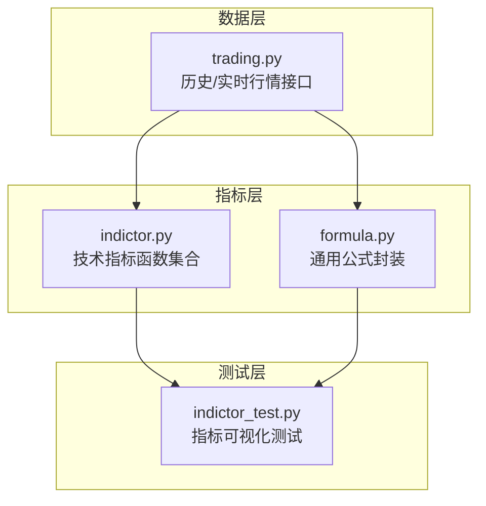
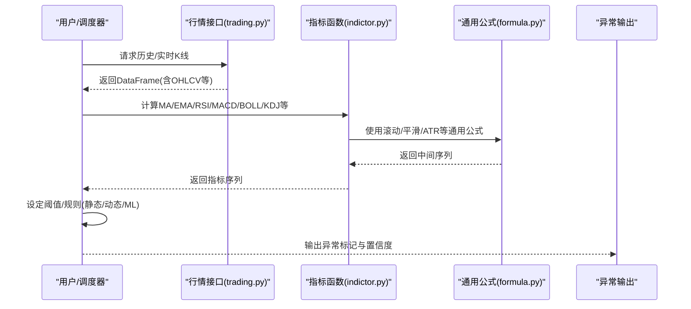
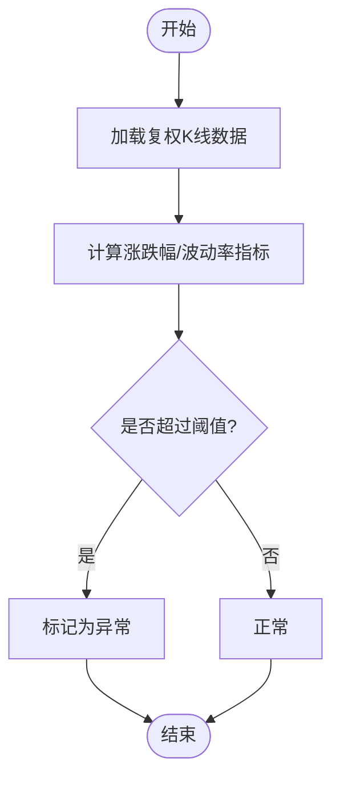
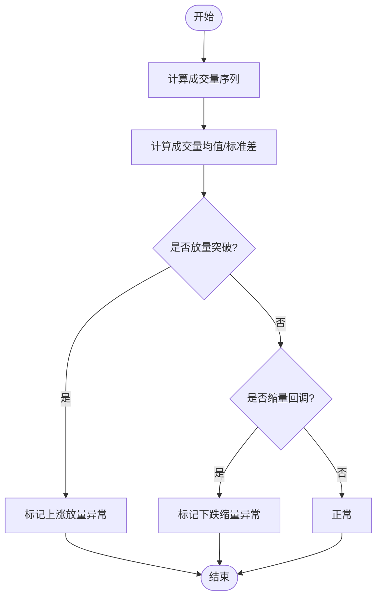
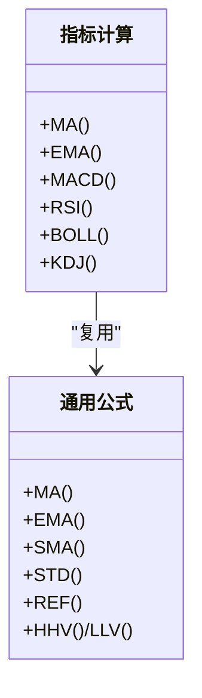
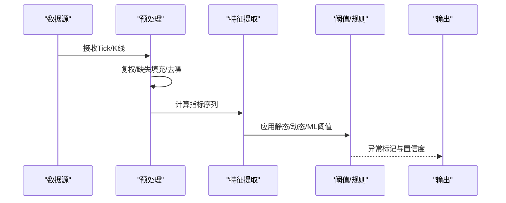
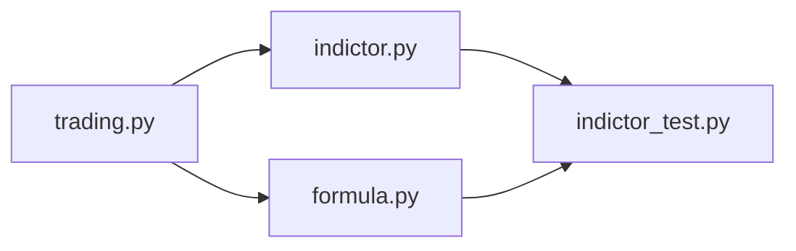

# 异常检测算法

<cite>
**本文引用的文件**   
- [README.md](file://README.md)
- [indictor.py](file://tushare/stock/indictor.py)
- [formula.py](file://tushare/util/formula.py)
- [trading.py](file://tushare/stock/trading.py)
- [indictor_test.py](file://test/indictor_test.py)
</cite>

## 目录
1. [引言](#引言)
2. [项目结构](#项目结构)
3. [核心组件](#核心组件)
4. [架构总览](#架构总览)
5. [详细组件分析](#详细组件分析)
6. [依赖分析](#依赖分析)
7. [性能考量](#性能考量)
8. [故障排查指南](#故障排查指南)
9. [结论](#结论)
10. [附录](#附录)

## 引言
本技术指南围绕基于 TuShare 数据的异常检测算法展开，目标是帮助开发者在实际交易场景中构建稳定、可扩展且高效的异常检测系统。内容涵盖价格异常（涨跌停、异常波动）、成交量异常（放量突破、缩量回调）、技术指标异常（背离、超买超卖）等核心主题，并结合移动平均线、布林带、MACD、RSI 等指标在异常检测中的应用原理与计算方法，给出阈值设定策略（静态、动态、机器学习）与实时处理流程（数据预处理、特征提取、异常判定、结果输出），最后提供参数调优建议与常见问题排查。

## 项目结构
该仓库提供了获取金融行情与技术指标计算的基础能力：
- 数据层：通过交易接口获取历史/实时行情（K线、分笔、复权等）
- 指标层：提供多种技术指标计算函数（MA、EMA、MACD、RSI、布林带、KDJ 等）
- 工具层：提供通用公式封装（滚动窗口、EMA、SMA、ATR 等）
- 测试层：提供指标可视化测试样例

图表来源
- [trading.py:32-100](file://tushare/stock/trading.py#L32-L100)
- [indictor.py:12-43](file://tushare/stock/indictor.py#L12-L43)
- [formula.py:8-26](file://tushare/util/formula.py#L8-L26)
- [indictor_test.py:13-18](file://test/indictor_test.py#L13-L18)

章节来源
- [README.md:43-105](file://README.md#L43-L105)
- [trading.py:32-100](file://tushare/stock/trading.py#L32-L100)
- [indictor.py:12-43](file://tushare/stock/indictor.py#L12-L43)
- [formula.py:8-26](file://tushare/util/formula.py#L8-L26)
- [indictor_test.py:13-18](file://test/indictor_test.py#L13-L18)

## 核心组件
- 行情数据接口：提供历史 K 线、复权数据、实时报价等基础数据，支撑后续指标计算与异常检测。
- 技术指标函数：包含移动平均、指数平滑、MACD、RSI、布林带、KDJ 等常用指标，用于特征提取与异常识别。
- 通用公式封装：提供滚动窗口、EMA/SMA、ATR、MAX/MIN/REF 等通用运算，便于构建复杂指标与衍生特征。
- 可视化测试：通过 plot_all 对指标进行可视化验证，辅助阈值设定与参数调试。

章节来源
- [trading.py:32-100](file://tushare/stock/trading.py#L32-L100)
- [indictor.py:12-43](file://tushare/stock/indictor.py#L12-L43)
- [formula.py:8-26](file://tushare/util/formula.py#L8-L26)
- [indictor_test.py:13-18](file://test/indictor_test.py#L13-L18)

## 架构总览
异常检测系统以“数据 → 特征 → 规则/模型 → 输出”的流水线为核心，结合指标层提供的多维特征，形成可配置的阈值策略与动态规则。

图表来源
- [trading.py:32-100](file://tushare/stock/trading.py#L32-L100)
- [indictor.py:12-43](file://tushare/stock/indictor.py#L12-L43)
- [formula.py:8-26](file://tushare/util/formula.py#L8-L26)

## 详细组件分析

### 1) 价格异常检测
- 涨跌停检测：基于复权后的价格序列，结合涨跌幅与涨停板限制，识别极端跳空或异常封板。
- 异常波动检测：利用滚动标准差、ATR 或真实波幅，衡量日内/跨日波动偏离，结合阈值触发异常。

图表来源
- [trading.py:397-510](file://tushare/stock/trading.py#L397-L510)
- [formula.py:28-34](file://tushare/util/formula.py#L28-L34)

章节来源
- [trading.py:397-510](file://tushare/stock/trading.py#L397-L510)
- [formula.py:28-34](file://tushare/util/formula.py#L28-L34)

### 2) 成交量异常检测
- 放量突破：比较当日成交量与 N 日均量，结合涨跌幅确认突破有效性。
- 缩量回调：比较回调阶段成交量与前期放量阶段的相对水平，识别无量回调风险。

图表来源
- [indictor.py:517-563](file://tushare/stock/indictor.py#L517-L563)
- [formula.py:12-13](file://tushare/util/formula.py#L12-L13)

章节来源
- [indictor.py:517-563](file://tushare/stock/indictor.py#L517-L563)
- [formula.py:12-13](file://tushare/util/formula.py#L12-L13)

### 3) 技术指标异常检测
- 移动平均线（MA/EMA）：用于趋势识别与支撑阻力判断，异常表现为价格与均线的乖离过大或死叉/金叉异常。
- 布林带（BOLL）：价格突破上下轨或轨道收窄/扩张状态异常。
- MACD：快慢线与柱状图的背离、零轴穿越、顶背离/底背离。
- RSI：超买/超卖区域反复穿越与背离。
- KDJ：随机摆动区间的极端位置与死叉/金叉。

图表来源
- [indictor.py:12-43](file://tushare/stock/indictor.py#L12-L43)
- [formula.py:8-26](file://tushare/util/formula.py#L8-L26)

章节来源
- [indictor.py:12-43](file://tushare/stock/indictor.py#L12-L43)
- [formula.py:8-26](file://tushare/util/formula.py#L8-L26)

### 4) 阈值设定策略
- 静态阈值：基于历史统计（均值±K倍标准差）或固定百分比设置，适用于稳定市场环境。
- 动态阈值：随时间窗内波动率自适应调整，适合震荡/趋势切换频繁的市场。
- 机器学习阈值：使用孤立森林、One-Class SVM 或VAE等无监督/半监督模型，自动学习正常区间。

章节来源
- [indictor.py:12-43](file://tushare/stock/indictor.py#L12-L43)
- [formula.py:76-77](file://tushare/util/formula.py#L76-L77)

### 5) 实时处理流程

图表来源
- [trading.py:32-100](file://tushare/stock/trading.py#L32-L100)
- [indictor.py:12-43](file://tushare/stock/indictor.py#L12-L43)
- [formula.py:8-26](file://tushare/util/formula.py#L8-L26)

章节来源
- [trading.py:32-100](file://tushare/stock/trading.py#L32-L100)
- [indictor.py:12-43](file://tushare/stock/indictor.py#L12-L43)
- [formula.py:8-26](file://tushare/util/formula.py#L8-L26)

### 6) 算法实现与参数调优
- 移动平均：窗口长度 N 的选择需平衡灵敏度与噪声，短期 N 建议 5–20，长期 20–60。
- 布林带：窗口 N 一般取 20，倍数 K 取 2，用于衡量价格偏离中枢程度。
- MACD：经典参数 12/26/9，可按波动率动态调整快慢周期。
- RSI：窗口 N 常用 14，超买/超卖阈值 70/30，震荡市可下调至 80/20。
- KDJ：窗口 N 通常 9，参数平滑 m/n 建议 3。
- 成交量：放量/缩量阈值可用“当日量/均量”的倍数，典型阈值 1.5–2.5。

章节来源
- [indictor.py:12-43](file://tushare/stock/indictor.py#L12-L43)
- [indictor.py:250-277](file://tushare/stock/indictor.py#L250-L277)
- [indictor.py:203-247](file://tushare/stock/indictor.py#L203-L247)
- [indictor.py:161-200](file://tushare/stock/indictor.py#L161-L200)
- [indictor.py:517-563](file://tushare/stock/indictor.py#L517-L563)

## 依赖分析
- 指标函数依赖通用公式库，统一使用滚动窗口、平滑与统计函数，保证计算一致性。
- 可视化测试依赖指标函数与行情数据，验证指标稳定性与阈值合理性。

图表来源
- [trading.py:32-100](file://tushare/stock/trading.py#L32-L100)
- [indictor.py:12-43](file://tushare/stock/indictor.py#L12-L43)
- [formula.py:8-26](file://tushare/util/formula.py#L8-L26)
- [indictor_test.py:13-18](file://test/indictor_test.py#L13-L18)

章节来源
- [trading.py:32-100](file://tushare/stock/trading.py#L32-L100)
- [indictor.py:12-43](file://tushare/stock/indictor.py#L12-L43)
- [formula.py:8-26](file://tushare/util/formula.py#L8-L26)
- [indictor_test.py:13-18](file://test/indictor_test.py#L13-L18)

## 性能考量
- 计算复杂度：滚动窗口与指数平滑的线性复杂度，建议在批处理中缓存中间结果，避免重复计算。
- 内存占用：对长时间序列进行指标计算时，注意分段处理与内存回收。
- 实时性：在高频场景下，优先使用增量/滑动窗口实现，减少全量重算成本。
- 网络与数据质量：行情接口存在网络抖动，应加入重试与断点续跑机制。

## 故障排查指南
- 数据为空或字段缺失：检查行情接口返回与日期范围，确保复权参数与起止日期正确。
- 指标异常尖刺：检查是否存在未复权数据、异常涨跌停或极值，必要时进行前后向填充或中位数替换。
- 阈值误报/漏报：调整时间窗与阈值比例，结合历史回测与交叉验证优化参数。

章节来源
- [trading.py:67-100](file://tushare/stock/trading.py#L67-L100)
- [trading.py:397-510](file://tushare/stock/trading.py#L397-L510)
- [indictor_test.py:13-18](file://test/indictor_test.py#L13-L18)

## 结论
通过整合 TuShare 的行情数据与指标计算能力，可以快速搭建覆盖价格、成交量与技术指标的异常检测体系。建议采用“静态阈值 + 动态自适应 + 机器学习”的混合策略，并结合可视化与回测持续优化参数，以提升检测精度与鲁棒性。

## 附录
- 快速开始：参考 README 中的示例，获取历史/复权数据并调用指标函数生成特征序列。
- 可视化验证：使用测试脚本对指标序列进行绘图，辅助阈值设定与规则校准。

章节来源
- [README.md:43-105](file://README.md#L43-L105)
- [indictor_test.py:13-18](file://test/indictor_test.py#L13-L18)