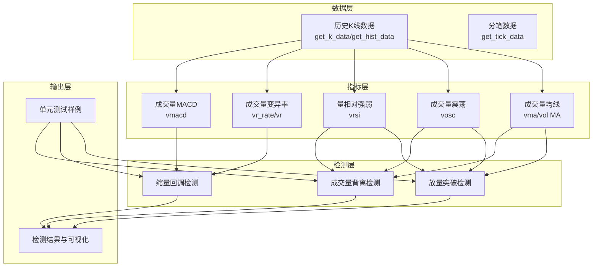
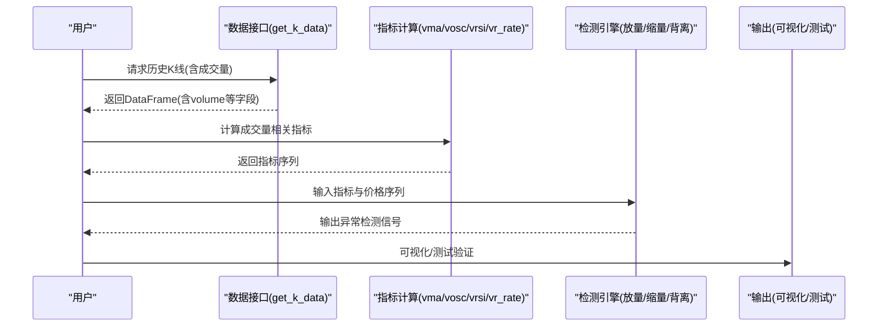
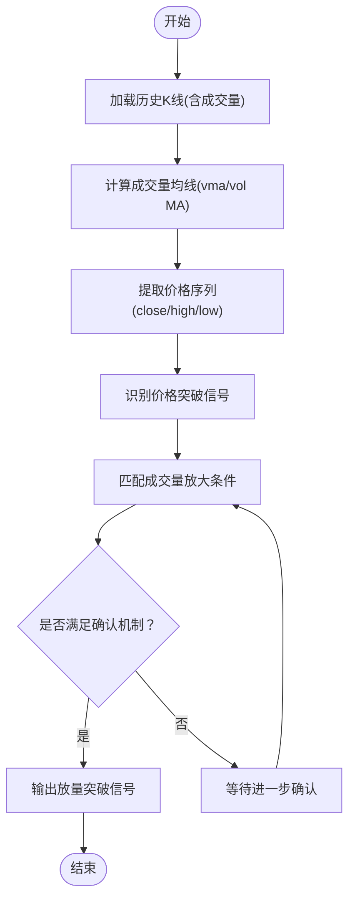
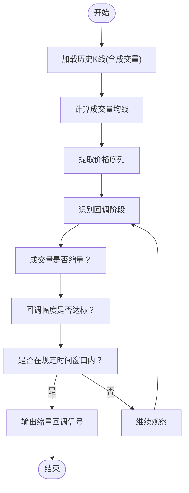
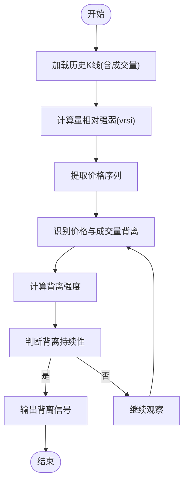
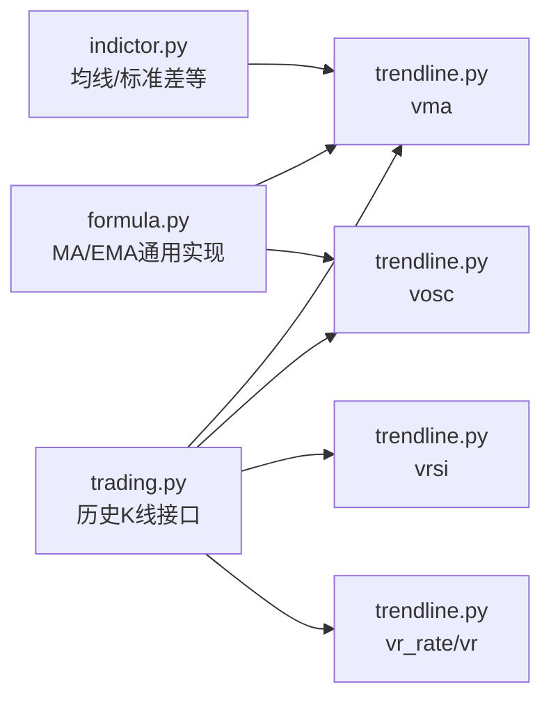

# 成交量异常检测

<cite>
**本文引用的文件**
- [README.md](file://README.md)
- [trading.py](file://tushare/stock/trading.py)
- [indictor.py](file://tushare/stock/indictor.py)
- [formula.py](file://tushare/util/formula.py)
- [trendline.py](file://tushare/stock/trendline.py)
- [cons.py](file://tushare/stock/cons.py)
- [bar_test.py](file://test/bar_test.py)
</cite>

## 目录
1. [简介](#简介)
2. [项目结构](#项目结构)
3. [核心组件](#核心组件)
4. [架构总览](#架构总览)
5. [详细组件分析](#详细组件分析)
6. [依赖关系分析](#依赖关系分析)
7. [性能考量](#性能考量)
8. [故障排查指南](#故障排查指南)
9. [结论](#结论)
10. [附录](#附录)

## 简介
本技术指南围绕基于TuShare成交量数据的异常检测展开，系统讲解以下三大类检测能力：
- 放量突破检测：基于成交量均线与价格突破的协同确认，识别放量向上突破信号。
- 缩量回调检测：基于成交量缩量标准、回调幅度阈值与持续时间的综合判断，识别缩量回调信号。
- 成交量背离检测：基于价格与成交量的背离强度与持续性，识别潜在反转风险。

文档将结合项目中的成交量相关指标与均线实现，给出算法原理、实现思路、参数调优与工程实践建议，帮助读者快速落地。

## 项目结构
本项目围绕“数据获取—指标计算—异常检测—可视化输出”的主线组织，成交量异常检测主要依赖于以下模块：
- 数据获取层：提供历史K线与分笔数据接口，输出包含成交量字段的DataFrame。
- 指标计算层：提供成交量均线、成交量震荡、量变异率、量相对强弱等成交量相关指标。
- 检测逻辑层：基于上述指标构建放量突破、缩量回调、成交量背离的检测规则与确认机制。
- 可视化与测试：提供绘图与单元测试样例，便于验证与演示。

**图表来源**
- [trading.py:624-707](file://tushare/stock/trading.py#L624-L707)
- [trendline.py:628-663](file://tushare/stock/trendline.py#L628-L663)
- [indictor.py:12-42](file://tushare/stock/indictor.py#L12-L42)
- [formula.py:12-25](file://tushare/util/formula.py#L12-L25)

**章节来源**
- [README.md:43-105](file://README.md#L43-L105)
- [trading.py:624-707](file://tushare/stock/trading.py#L624-L707)
- [trendline.py:628-663](file://tushare/stock/trendline.py#L628-L663)
- [indictor.py:12-42](file://tushare/stock/indictor.py#L12-L42)
- [formula.py:12-25](file://tushare/util/formula.py#L12-L25)

## 核心组件
- 历史K线与成交量数据：通过统一接口获取包含成交量字段的DataFrame，作为后续指标与检测的基础。
- 成交量均线与震荡：提供成交量的简单/指数均线与震荡指标，用于识别成交量的趋势与短期波动。
- 成交量变异与相对强弱：通过量变异率与量相对强弱指标，衡量成交量的结构性变化与动量。
- 检测规则引擎：以成交量指标为核心，结合价格走势与时间窗口，形成放量突破、缩量回调、成交量背离的判定逻辑。

**章节来源**
- [trading.py:624-707](file://tushare/stock/trading.py#L624-L707)
- [trendline.py:628-663](file://tushare/stock/trendline.py#L628-L663)
- [indictor.py:12-42](file://tushare/stock/indictor.py#L12-L42)
- [formula.py:12-25](file://tushare/util/formula.py#L12-L25)

## 架构总览
成交量异常检测的整体流程如下：
- 数据准备：调用历史K线接口，确保返回包含成交量字段。
- 指标计算：按需计算成交量均线、震荡、变异率与相对强弱等指标。
- 规则判定：依据放量突破、缩量回调、背离的规则，结合确认机制与过滤条件，输出检测结果。
- 结果输出：支持可视化与测试样例，便于验证策略效果。

**图表来源**
- [trading.py:624-707](file://tushare/stock/trading.py#L624-L707)
- [trendline.py:628-663](file://tushare/stock/trendline.py#L628-L663)
- [indictor.py:12-42](file://tushare/stock/indictor.py#L12-L42)

## 详细组件分析

### 放量突破检测
放量突破检测的核心在于“量价配合”：价格突破关键阻力位的同时，成交量显著放大。实现要点包括：
- 成交量均线计算：使用成交量的简单/指数均线，识别成交量的中长期趋势。
- 突破信号识别：以价格突破前高/阻力位为触发条件，叠加成交量均线上穿或超短期放量。
- 确认机制：采用多周期确认（如日线突破、60分钟放量）与过滤条件（如换手率、量比）提升信号质量。

**图表来源**
- [trendline.py:628-636](file://tushare/stock/trendline.py#L628-L636)
- [formula.py:12-25](file://tushare/util/formula.py#L12-L25)
- [trading.py:624-707](file://tushare/stock/trading.py#L624-L707)

**章节来源**
- [trendline.py:628-636](file://tushare/stock/trendline.py#L628-L636)
- [formula.py:12-25](file://tushare/util/formula.py#L12-L25)
- [trading.py:624-707](file://tushare/stock/trading.py#L624-L707)

### 缩量回调检测
缩量回调检测关注回调过程中的成交量萎缩，通常出现在上涨后的技术性回调阶段。实现要点包括：
- 缩量标准设定：以成交量均值或前N日均值为基准，设定缩量阈值（如低于均值的某个比例）。
- 回调幅度判断：结合价格回调幅度阈值（如回撤超过某百分比）与成交量缩量共同确认。
- 持续时间分析：限定回调的持续时间窗口，避免假突破或震荡反复。

**图表来源**
- [trendline.py:628-636](file://tushare/stock/trendline.py#L628-L636)
- [indictor.py:516-563](file://tushare/stock/indictor.py#L516-L563)
- [trading.py:624-707](file://tushare/stock/trading.py#L624-L707)

**章节来源**
- [trendline.py:628-636](file://tushare/stock/trendline.py#L628-L636)
- [indictor.py:516-563](file://tushare/stock/indictor.py#L516-L563)
- [trading.py:624-707](file://tushare/stock/trading.py#L624-L707)

### 成交量背离检测
成交量背离检测通过比较价格与成交量的背离强度与持续性，识别潜在反转风险。实现要点包括：
- 背离识别：当价格创新高但成交量未同步放大，或价格创新低但成交量未同步萎缩，形成背离。
- 背离强度计算：基于成交量相对强弱（如量相对强弱指标）与价格动量指标的差异，量化背离程度。
- 背离持续性判断：设定背离持续的最小周期，避免短期噪音干扰。

**图表来源**
- [trendline.py:129-140](file://tushare/stock/trendline.py#L129-L140)
- [indictor.py:516-563](file://tushare/stock/indictor.py#L516-L563)
- [formula.py:12-25](file://tushare/util/formula.py#L12-L25)

**章节来源**
- [trendline.py:129-140](file://tushare/stock/trendline.py#L129-L140)
- [indictor.py:516-563](file://tushare/stock/indictor.py#L516-L563)
- [formula.py:12-25](file://tushare/util/formula.py#L12-L25)

## 依赖关系分析
成交量异常检测依赖的关键模块与函数如下：
- 数据接口：历史K线与成交量字段的获取。
- 指标函数：成交量均线、震荡、变异率、相对强弱等。
- 工具函数：均线与指数均线的通用实现。

**图表来源**
- [trading.py:624-707](file://tushare/stock/trading.py#L624-L707)
- [trendline.py:628-663](file://tushare/stock/trendline.py#L628-L663)
- [formula.py:12-25](file://tushare/util/formula.py#L12-L25)
- [indictor.py:12-42](file://tushare/stock/indictor.py#L12-L42)

**章节来源**
- [trading.py:624-707](file://tushare/stock/trading.py#L624-L707)
- [trendline.py:628-663](file://tushare/stock/trendline.py#L628-L663)
- [formula.py:12-25](file://tushare/util/formula.py#L12-L25)
- [indictor.py:12-42](file://tushare/stock/indictor.py#L12-L42)

## 性能考量
- 数据规模与计算复杂度：成交量指标多为滚动窗口计算，时间复杂度与窗口长度呈线性关系。建议合理设置窗口大小，平衡灵敏度与稳定性。
- I/O与网络：历史K线接口存在网络请求与解析成本，建议缓存近期数据并批量请求，减少重复调用。
- 内存占用：指标计算与检测逻辑应尽量使用向量化操作，避免逐行迭代，降低内存峰值。
- 实时性：对于实时监控场景，建议采用增量更新策略，仅对新增K线进行指标重算与检测。

## 故障排查指南
- 数据缺失或字段不全：确认历史K线接口返回包含成交量字段；若缺失，需调整接口参数或补全数据。
- 指标计算异常：检查滚动窗口长度是否合理，避免过小窗口导致的噪声；确认数据类型转换与缺失值处理。
- 检测误报与漏报：通过调整阈值与确认机制（如多周期确认、过滤条件）优化策略；结合可视化核验关键信号点。
- 单元测试验证：参考单元测试样例，对关键函数与检测逻辑进行回归测试，确保策略稳定性。

**章节来源**
- [bar_test.py:16-18](file://test/bar_test.py#L16-L18)
- [trading.py:624-707](file://tushare/stock/trading.py#L624-L707)

## 结论
基于TuShare的成交量异常检测可通过“数据—指标—规则—验证”的闭环实现。放量突破、缩量回调与成交量背离三大检测方向分别对应不同的市场阶段与信号特征。通过合理设置参数、引入确认机制与过滤条件，可在保证灵敏度的同时提升信号质量。建议在生产环境中结合缓存、向量化与增量更新等手段，持续优化性能与稳定性。

## 附录
- 参数调优建议
  - 成交量均线：根据周期长度选择（如5日、10日、20日），结合价格波动率调整。
  - 放量阈值：以成交量均值倍数或前N日分位数设定，结合换手率过滤。
  - 缩量阈值：以回调期间成交量与前N日均值的比值设定，结合回调幅度阈值。
  - 背离强度：以量相对强弱与价格动量指标的差异阈值设定，结合持续周期。
- 时间周期选择
  - 日线为主，辅以60分钟/15分钟等高频K线进行确认。
- 过滤条件配置
  - 换手率、量比、涨跌幅等过滤条件可有效降低噪音，提升信号质量。