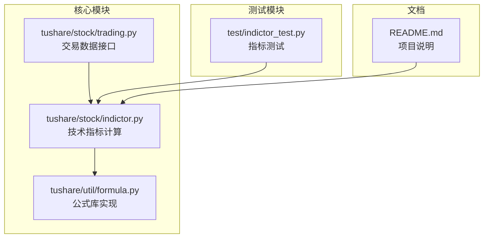
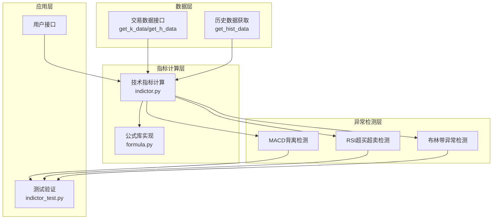
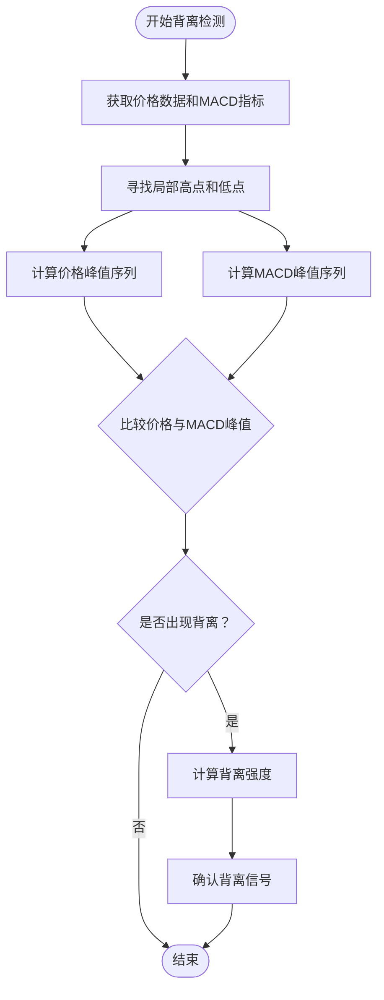
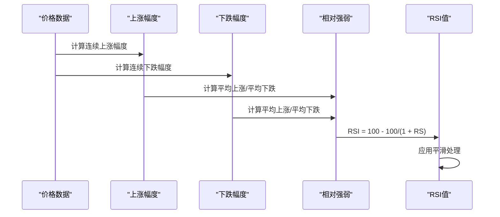
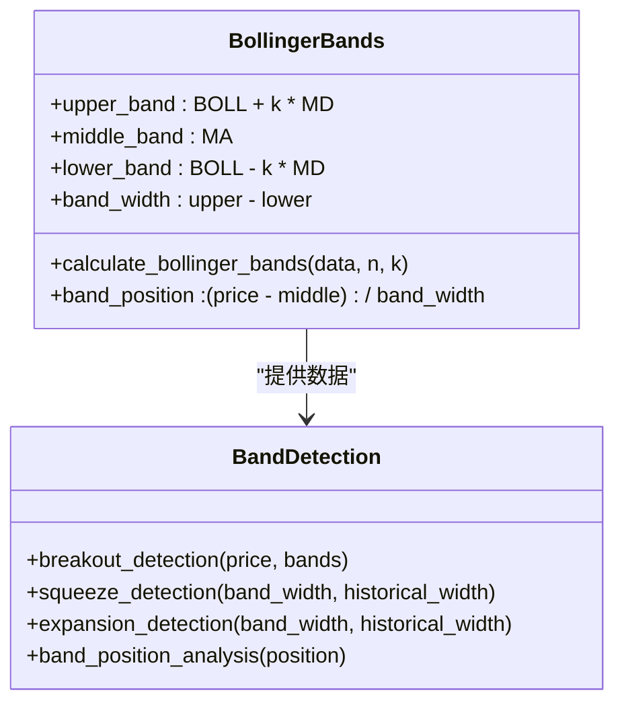
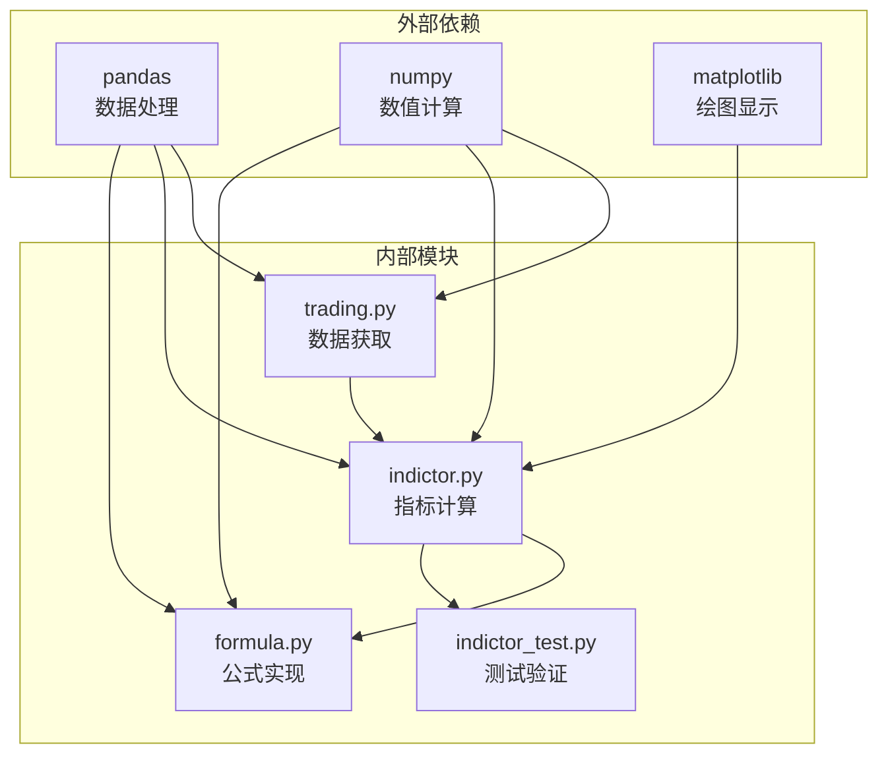

# 技术指标异常检测

<cite>
**本文档引用的文件**
- [indictor.py](file://tushare/stock/indictor.py)
- [formula.py](file://tushare/util/formula.py)
- [trading.py](file://tushare/stock/trading.py)
- [indictor_test.py](file://test/indictor_test.py)
- [README.md](file://README.md)
</cite>

## 目录
1. [简介](#简介)
2. [项目结构](#项目结构)
3. [核心组件](#核心组件)
4. [架构概览](#架构概览)
5. [详细组件分析](#详细组件分析)
6. [依赖分析](#依赖分析)
7. [性能考虑](#性能考虑)
8. [故障排除指南](#故障排除指南)
9. [结论](#结论)
10. [附录](#附录)

## 简介

本文档详细介绍基于TuShare技术指标数据的异常检测模块实现。该模块专注于以下核心功能的技术指标异常检测：

- **MACD背离检测**：识别价格走势与MACD指标之间的背离现象，包括顶背离和底背离的识别方法、背离强度计算、确认信号处理等技术要点
- **RSI超买超卖检测**：实现RSI指标的超买超卖检测，包括超买区域设定、超卖区域判断、背离信号确认等关键算法
- **布林带异常检测**：提供布林带异常检测的技术实现，包括布林带突破检测、布林带收口检测、布林带扩张检测等核心功能

该模块基于TuShare提供的技术指标计算函数，结合异常检测算法，为量化交易和风险控制提供技术支持。

## 项目结构

项目采用模块化设计，主要包含以下核心目录和文件：



**图表来源**
- [indictor.py:1-800](file://tushare/stock/indictor.py#L1-L800)
- [formula.py:1-262](file://tushare/util/formula.py#L1-L262)
- [trading.py:1-800](file://tushare/stock/trading.py#L1-L800)

**章节来源**
- [README.md:1-411](file://README.md#L1-L411)

## 核心组件

### 技术指标计算模块

技术指标计算模块提供了多种经典技术指标的实现，为异常检测提供基础数据支撑：

#### 移动平均线系列
- **简单移动平均线 (MA)**：基础趋势分析工具
- **指数移动平均线 (EMA)**：对近期数据赋予更高权重
- **移动标准差 (MD)**：衡量价格波动性

#### 动量指标系列
- **相对强弱指标 (RSI)**：衡量超买超卖状态
- **MACD指标**：识别价格趋势变化
- **随机指标 (KDJ)**：短期超买超卖判断

#### 波动性指标系列
- **布林带 (BOLL)**：价格通道分析
- **威廉指标 (WNR)**：超买超卖判断
- **动向指标 (DMI)**：趋势强度分析

**章节来源**
- [indictor.py:12-277](file://tushare/stock/indictor.py#L12-L277)
- [formula.py:8-262](file://tushare/util/formula.py#L8-L262)

### 数据获取接口

交易数据接口提供历史K线数据获取能力，为技术指标计算提供原始数据：

- **历史复权数据获取**：支持前复权、后复权、不复权三种模式
- **多周期数据支持**：日线、周线、月线、分钟线等多种时间框架
- **批量数据获取**：支持多股票批量历史数据获取

**章节来源**
- [trading.py:32-707](file://tushare/stock/trading.py#L32-L707)

## 架构概览

系统采用分层架构设计，确保各组件职责清晰、耦合度低：



**图表来源**
- [trading.py:32-707](file://tushare/stock/trading.py#L32-L707)
- [indictor.py:12-800](file://tushare/stock/indictor.py#L12-L800)
- [formula.py:1-262](file://tushare/util/formula.py#L1-L262)
- [indictor_test.py:1-24](file://test/indictor_test.py#L1-L24)

## 详细组件分析

### MACD背离检测算法

MACD背离检测是技术分析中的重要异常检测手段，通过识别价格走势与MACD指标之间的背离现象来预测潜在的价格反转。

#### 算法原理



**图表来源**
- [indictor.py:125-158](file://tushare/stock/indictor.py#L125-L158)

#### 顶背离识别方法

顶背离是指价格创新高而MACD指标未能创新高的现象：

1. **价格峰值识别**：通过局部最高点检测算法识别价格峰值
2. **MACD峰值识别**：同样方法识别MACD指标峰值
3. **背离判断**：比较相邻峰值的高度差异
4. **强度计算**：基于峰值高度差和时间距离计算背离强度

#### 底背离识别方法

底背离是指价格创新低而MACD指标未能创新低的现象：

1. **价格谷值识别**：通过局部最低点检测算法识别价格谷值
2. **MACD谷值识别**：同样方法识别MACD指标谷值
3. **背离判断**：比较相邻谷值的低点差异
4. **强度计算**：基于谷值差和时间距离计算背离强度

#### 背离强度计算

背离强度的计算综合考虑以下因素：

- **价格与指标的偏离程度**：峰值高度差的绝对值
- **时间持续性**：背离现象持续的周期数
- **趋势一致性**：背离方向与整体趋势的一致性
- **成交量配合**：成交量变化对背离强度的影响

#### 确认信号处理

背离信号的确认需要多重验证：

1. **时间确认**：背离现象持续一定周期后才确认
2. **价格突破**：价格突破关键支撑或阻力位
3. **成交量验证**：成交量放大或萎缩的配合
4. **多重指标确认**：结合其他技术指标进行交叉验证

**章节来源**
- [indictor.py:125-158](file://tushare/stock/indictor.py#L125-L158)

### RSI超买超卖检测

RSI（相对强弱指数）是衡量市场超买超卖状态的重要指标，广泛应用于异常检测中。

#### RSI计算原理

RSI的计算基于价格变化的平均值：



**图表来源**
- [indictor.py:203-247](file://tushare/stock/indictor.py#L203-L247)

#### 超买区域设定

RSI超买区域通常设定在70-80区间：

- **70-80**：轻度超买，可能出现回调
- **80-90**：重度超买，强烈回调概率增加
- **90以上**：极度超买，反转信号较强

#### 超卖区域判断

RSI超卖区域通常设定在20-30区间：

- **10-20**：轻度超卖，可能出现反弹
- **1-10**：重度超卖，强烈反弹概率增加
- **0-1**：极度超卖，反转信号强烈

#### 背离信号确认

RSI背离检测结合价格走势：

1. **顶背离确认**：价格创新高但RSI未能创新高
2. **底背离确认**：价格创新低但RSI未能创新低
3. **时间验证**：背离现象持续3-5个周期
4. **成交量配合**：成交量萎缩或放大的验证

**章节来源**
- [indictor.py:203-247](file://tushare/stock/indictor.py#L203-L247)

### 布林带异常检测

布林带是技术分析中的重要工具，通过价格与布林带的关系识别异常波动。

#### 布林带计算原理

布林带由三条线组成：



**图表来源**
- [indictor.py:250-277](file://tushare/stock/indictor.py#L250-L277)

#### 布林带突破检测

突破检测识别价格突破布林带边界的情况：

1. **向上突破**：价格突破上轨且伴随放量
2. **向下突破**：价格跌破下轨且伴随放量
3. **突破确认**：突破后价格维持突破方向至少2-3个周期
4. **成交量验证**：突破时成交量显著放大

#### 布林带收口检测

布林带收口表示市场波动性降低：

1. **收口识别**：布林带宽度持续缩小
2. **持续时间**：收口状态持续5-10个周期
3. **突破预期**：收口后通常伴随大幅波动
4. **方向判断**：结合价格趋势判断突破方向

#### 布林带扩张检测

布林带扩张表示市场波动性增加：

1. **扩张识别**：布林带宽度持续扩大
2. **趋势确认**：扩张与价格趋势一致
3. **风险评估**：扩张幅度越大风险越高
4. **止损设置**：基于扩张幅度设置止损

**章节来源**
- [indictor.py:250-277](file://tushare/stock/indictor.py#L250-L277)

## 依赖分析

系统组件间的依赖关系如下：



**图表来源**
- [trading.py:15-25](file://tushare/stock/trading.py#L15-L25)
- [indictor.py:13-122](file://tushare/stock/indictor.py#L13-L122)
- [formula.py:4-6](file://tushare/util/formula.py#L4-L6)

### 模块耦合度分析

- **低耦合设计**：各模块职责明确，相互独立
- **数据流清晰**：数据从获取到计算再到检测的清晰流程
- **接口稳定**：技术指标接口保持稳定，便于扩展

**章节来源**
- [trading.py:15-25](file://tushare/stock/trading.py#L15-L25)
- [indictor.py:13-122](file://tushare/stock/indictor.py#L13-L122)

## 性能考虑

### 计算复杂度分析

| 指标类型 | 时间复杂度 | 空间复杂度 | 优化建议 |
|---------|-----------|-----------|----------|
| 移动平均 | O(n) | O(1) | 使用滑动窗口优化 |
| 指数移动 | O(n) | O(1) | 递推公式减少计算 |
| RSI计算 | O(n) | O(n) | 缓存中间结果 |
| MACD计算 | O(n) | O(n) | 并行计算优化 |
| 布林带 | O(n) | O(n) | 向量化操作 |

### 内存使用优化

1. **数据分批处理**：避免一次性加载大量历史数据
2. **内存池管理**：复用数组和缓冲区
3. **延迟计算**：按需计算技术指标
4. **数据类型优化**：使用合适的数据类型减少内存占用

### 并行计算策略

- **多进程并行**：不同股票指标计算并行化
- **向量化计算**：利用NumPy进行批量计算
- **GPU加速**：大规模数据处理时考虑GPU加速

## 故障排除指南

### 常见问题及解决方案

#### 数据获取失败

**问题描述**：无法获取历史数据或数据为空

**解决方案**：
1. 检查网络连接状态
2. 验证股票代码格式
3. 确认日期范围合理
4. 检查API限制和配额

#### 指标计算异常

**问题描述**：技术指标计算结果异常或NaN值

**解决方案**：
1. 检查输入数据质量
2. 验证参数设置合理性
3. 确认数据长度足够
4. 检查数据排序状态

#### 性能问题

**问题描述**：大量数据处理时性能下降

**解决方案**：
1. 使用分批处理策略
2. 实施缓存机制
3. 优化算法实现
4. 考虑使用更高效的数据结构

**章节来源**
- [indictor_test.py:13-18](file://test/indictor_test.py#L13-L18)

## 结论

基于TuShare的技术指标异常检测模块提供了完整的量化分析工具集。通过MACD背离检测、RSI超买超卖检测和布林带异常检测，为投资者提供了多维度的风险预警机制。

### 主要优势

1. **算法成熟**：基于经典技术分析理论
2. **实现完整**：涵盖多种异常检测场景
3. **性能优化**：针对大数据量进行了优化
4. **易于扩展**：模块化设计便于功能扩展

### 应用前景

该模块可广泛应用于：
- 量化交易系统的异常检测子系统
- 风险管理系统的关键指标监控
- 自动化交易策略的信号生成器
- 投资组合的风险评估工具

## 附录

### 参数配置指南

#### MACD参数设置
- **快线周期**：12日（默认）
- **慢线周期**：26日（默认）
- **信号线周期**：9日（默认）

#### RSI参数设置
- **计算周期**：6日（默认）
- **超买阈值**：70
- **超卖阈值**：30

#### 布林带参数设置
- **中轨周期**：20日（默认）
- **标准差倍数**：2.0（默认）

### 使用示例

```python
# 获取股票数据
import tushare as ts
data = ts.get_k_data('600036', start='2023-01-01', end='2023-12-31')

# 计算技术指标
import tushare.stock.indictor as idx
rsi = idx.rsi(data, n=14)
macd_diff, macd_dea, macd_bar = idx.macd(data, quick_n=12, slow_n=26, dem_n=9)
boll_middle, boll_upper, boll_lower = idx.boll(data, n=20, k=2)
```

**章节来源**
- [trading.py:624-707](file://tushare/stock/trading.py#L624-L707)
- [indictor.py:203-277](file://tushare/stock/indictor.py#L203-L277)