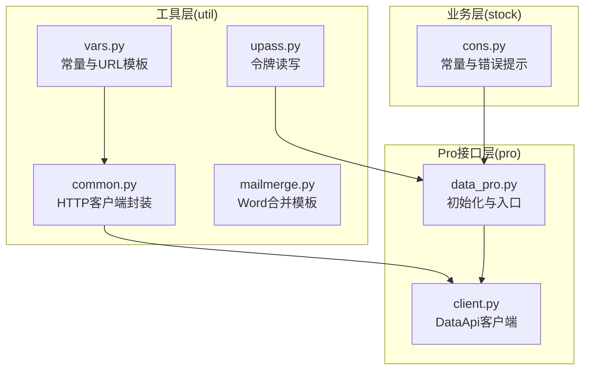
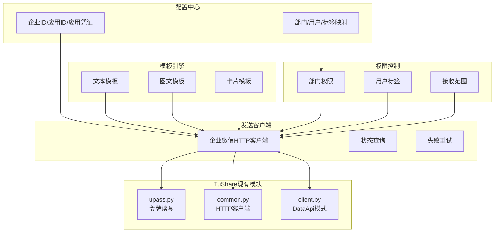
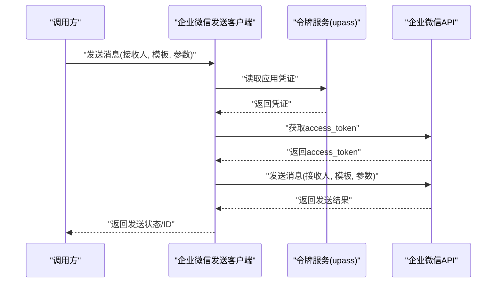
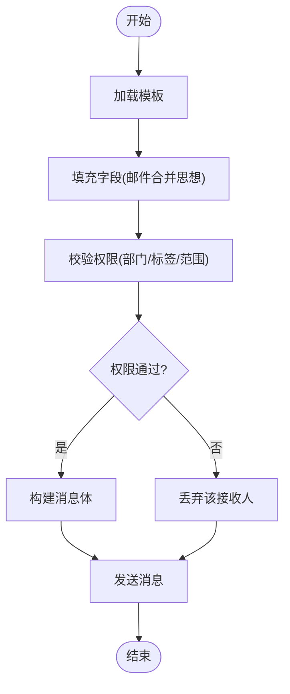
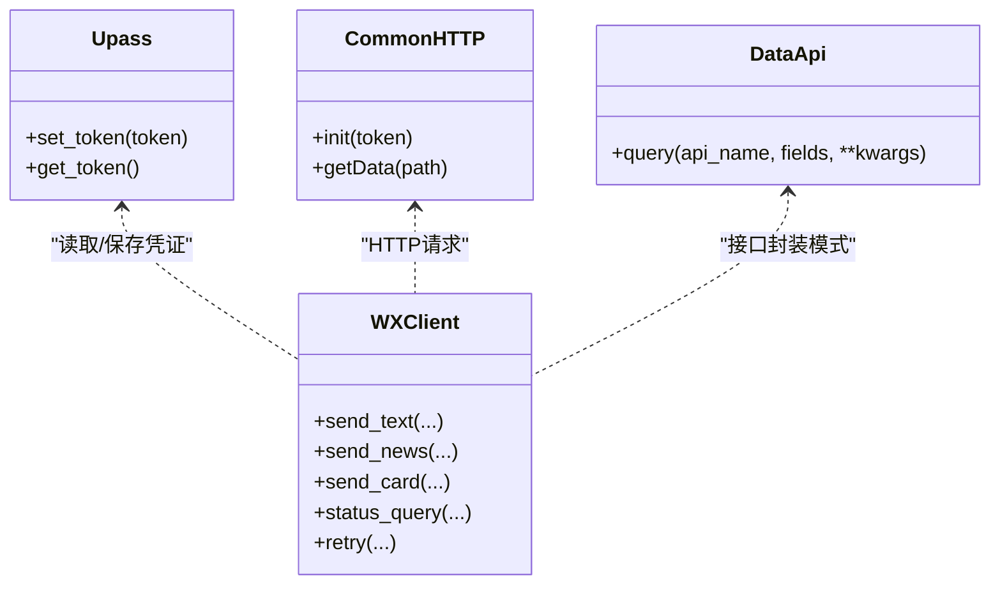
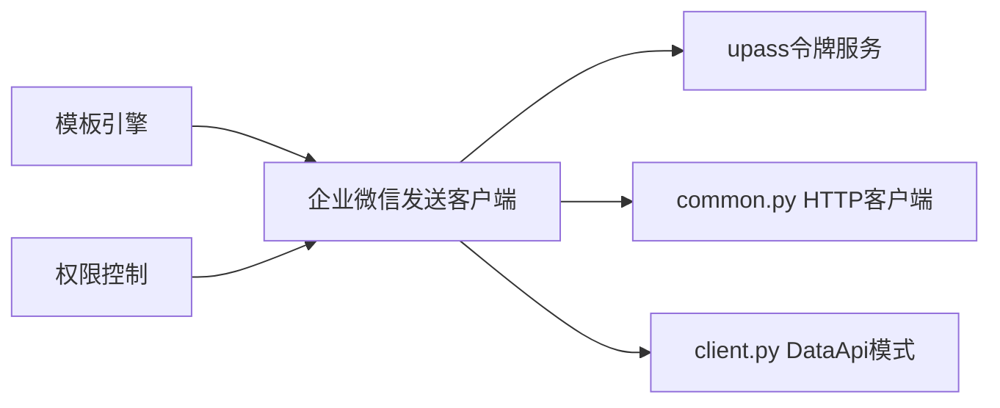

# 企业微信通知

<cite>
**本文引用的文件**
- [README.md](file://README.md)
- [common.py](file://tushare/util/common.py)
- [vars.py](file://tushare/util/vars.py)
- [mailmerge.py](file://tushare/util/mailmerge.py)
- [client.py](file://tushare/pro/client.py)
- [data_pro.py](file://tushare/pro/data_pro.py)
- [upass.py](file://tushare/util/upass.py)
</cite>

## 目录
1. [简介](#简介)
2. [项目结构](#项目结构)
3. [核心组件](#核心组件)
4. [架构总览](#架构总览)
5. [详细组件分析](#详细组件分析)
6. [依赖分析](#依赖分析)
7. [性能考量](#性能考量)
8. [故障排查指南](#故障排查指南)
9. [结论](#结论)
10. [附录](#附录)

## 简介
本技术指南面向需要在TuShare报警系统中集成企业微信通知能力的开发者，围绕企业微信企业号通知的实现进行系统化说明。文档涵盖企业ID配置、应用管理、消息模板、用户权限控制等企业级功能，并结合TuShare现有模块（如Pro接口、令牌管理、网络请求封装等），给出可落地的配置示例与集成步骤，帮助快速搭建企业级微信通知系统。

## 项目结构
TuShare仓库包含数据采集、处理与存储的完整链路，其中与企业微信通知相关的关键模块如下：
- util：通用网络请求封装、邮件合并模板处理、变量常量定义
- pro：Tushare Pro接口客户端与数据访问层
- stock：股票相关常量与错误提示
- 其他子模块：债券、期货、宏观等业务模块（与通知集成无直接关系）

图表来源
- [common.py:18-86](file://tushare/util/common.py#L18-L86)
- [vars.py:1-598](file://tushare/util/vars.py#L1-L598)
- [mailmerge.py:1-219](file://tushare/util/mailmerge.py#L1-L219)
- [client.py:17-52](file://tushare/pro/client.py#L17-L52)
- [data_pro.py:20-28](file://tushare/pro/data_pro.py#L20-L28)
- [upass.py:15-31](file://tushare/util/upass.py#L15-L31)

章节来源
- [README.md:1-411](file://README.md#L1-L411)
- [common.py:18-86](file://tushare/util/common.py#L18-L86)
- [vars.py:1-598](file://tushare/util/vars.py#L1-L598)
- [mailmerge.py:1-219](file://tushare/util/mailmerge.py#L1-L219)
- [client.py:17-52](file://tushare/pro/client.py#L17-L52)
- [data_pro.py:20-28](file://tushare/pro/data_pro.py#L20-L28)
- [upass.py:15-31](file://tushare/util/upass.py#L15-L31)

## 核心组件
- 企业微信通知实现要点
  - 企业ID配置：在企业微信管理后台获取企业ID，并在系统配置中集中管理
  - 应用管理：创建应用并获取应用ID与应用凭证，用于API鉴权
  - 消息模板：设计文本、图文、卡片等模板，结合邮件合并思想实现字段替换
  - 用户权限：通过部门权限、用户标签、接收范围控制实现精细化权限管理
  - 消息发送：构造消息内容、管理接收人列表、查询发送状态、失败重试
- 与TuShare现有模块的结合点
  - 令牌管理：使用upass.py提供的set_token/get_token保存与读取Pro令牌，可类比用于企业微信应用凭证
  - 网络请求：common.py中的HTTPS客户端封装可作为企业微信HTTP请求的基础
  - 接口封装：client.py的DataApi模式可迁移为企业微信消息发送API客户端
  - 常量与URL模板：vars.py中的URL模板可借鉴为消息模板与接口地址的集中管理

章节来源
- [upass.py:15-31](file://tushare/util/upass.py#L15-L31)
- [common.py:18-86](file://tushare/util/common.py#L18-L86)
- [client.py:17-52](file://tushare/pro/client.py#L17-L52)
- [vars.py:1-598](file://tushare/util/vars.py#L1-L598)

## 架构总览
企业微信通知系统建议采用“配置中心 + 模板引擎 + 权限控制 + 发送客户端”的分层架构。下图展示了与TuShare现有模块的对接关系：

图表来源
- [upass.py:15-31](file://tushare/util/upass.py#L15-L31)
- [common.py:18-86](file://tushare/util/common.py#L18-L86)
- [client.py:17-52](file://tushare/pro/client.py#L17-L52)

## 详细组件分析

### 组件A：企业微信消息发送客户端
- 设计思路
  - 参考DataApi模式，封装企业微信消息发送接口，统一处理鉴权、请求体构造、响应解析
  - 将企业ID、应用ID、应用凭证作为配置项，优先从环境变量或upass读取
- 关键流程
  - 获取access_token（应用凭证换取）
  - 构造消息体（文本/图文/卡片）
  - 发送消息（支持批量接收人）
  - 查询发送状态
  - 失败重试与退避策略

图表来源
- [client.py:17-52](file://tushare/pro/client.py#L17-L52)
- [upass.py:15-31](file://tushare/util/upass.py#L15-L31)

章节来源
- [client.py:17-52](file://tushare/pro/client.py#L17-L52)
- [upass.py:15-31](file://tushare/util/upass.py#L15-L31)

### 组件B：消息模板与权限控制
- 模板设计
  - 文本模板：纯文本，适合简短报警
  - 图文模板：标题+摘要+跳转链接，适合事件详情
  - 卡片模板：结构化卡片，适合多字段展示
- 权限控制
  - 部门权限：按部门限制消息可见范围
  - 用户标签：按标签过滤接收人
  - 接收范围：根据业务域选择接收人集合

图表来源
- [mailmerge.py:112-193](file://tushare/util/mailmerge.py#L112-L193)

章节来源
- [mailmerge.py:112-193](file://tushare/util/mailmerge.py#L112-L193)

### 组件C：与TuShare现有模块的对接
- 令牌管理对接：使用upass的set_token/get_token保存企业微信应用凭证，避免硬编码
- 网络请求对接：复用common.py的HTTPS客户端，确保统一的证书与超时处理
- 接口封装对接：参考client.py的DataApi模式，抽象企业微信消息发送API

图表来源
- [upass.py:15-31](file://tushare/util/upass.py#L15-L31)
- [common.py:18-86](file://tushare/util/common.py#L18-L86)
- [client.py:17-52](file://tushare/pro/client.py#L17-L52)

章节来源
- [upass.py:15-31](file://tushare/util/upass.py#L15-L31)
- [common.py:18-86](file://tushare/util/common.py#L18-L86)
- [client.py:17-52](file://tushare/pro/client.py#L17-L52)

## 依赖分析
- 组件耦合
  - 企业微信发送客户端依赖令牌服务与HTTP客户端
  - 模板引擎与权限控制相互独立，通过消息体构建阶段协作
- 外部依赖
  - 企业微信API（需HTTPS、access_token鉴权）
  - 环境变量/配置文件（企业ID、应用ID、应用凭证）
- 潜在风险
  - 令牌过期与刷新
  - 接收人列表过大导致的限流
  - 模板字段缺失导致的消息发送失败

图表来源
- [upass.py:15-31](file://tushare/util/upass.py#L15-L31)
- [common.py:18-86](file://tushare/util/common.py#L18-L86)
- [client.py:17-52](file://tushare/pro/client.py#L17-L52)

章节来源
- [upass.py:15-31](file://tushare/util/upass.py#L15-L31)
- [common.py:18-86](file://tushare/util/common.py#L18-L86)
- [client.py:17-52](file://tushare/pro/client.py#L17-L52)

## 性能考量
- 批量发送与限流
  - 控制单次发送人数上限，避免触发企业微信限流
  - 对失败批次进行分批重试
- 模板渲染性能
  - 使用缓存机制复用常用模板
  - 字段替换采用高效字符串拼接或模板引擎
- 网络请求优化
  - 复用HTTPS连接，减少握手开销
  - 设置合理的超时与重试间隔

## 故障排查指南
- 常见问题
  - 令牌无效/过期：检查upass中保存的凭证是否正确，必要时重新设置
  - 企业微信API返回错误：核对企业ID、应用ID与应用凭证
  - 接收人为空：检查权限过滤逻辑与用户标签映射
- 排查步骤
  - 打印请求参数与返回状态码
  - 分别验证access_token获取与消息发送接口
  - 对失败批次进行最小化复现

章节来源
- [upass.py:15-31](file://tushare/util/upass.py#L15-L31)
- [client.py:32-48](file://tushare/pro/client.py#L32-L48)

## 结论
通过借鉴TuShare现有模块（令牌管理、网络请求封装、接口封装模式），可以快速在TuShare报警系统中集成企业微信通知能力。建议以“配置中心 + 模板引擎 + 权限控制 + 发送客户端”为核心架构，结合失败重试与限流策略，确保系统稳定与可维护性。

## 附录
- 配置示例（步骤说明）
  - 在企业微信管理端获取企业ID、创建应用并获取应用ID与应用凭证
  - 使用upass保存应用凭证，供发送客户端读取
  - 设计文本/图文/卡片模板，结合权限规则生成接收人列表
  - 调用发送客户端，完成消息发送与状态查询
- 集成步骤（操作指引）
  - 在项目中新增企业微信发送客户端模块，复用common.py的HTTP客户端
  - 抽象企业微信消息发送API，参考client.py的DataApi模式
  - 在报警触发处调用发送客户端，传入模板与接收人列表
  - 记录发送状态与失败重试，完善监控与告警