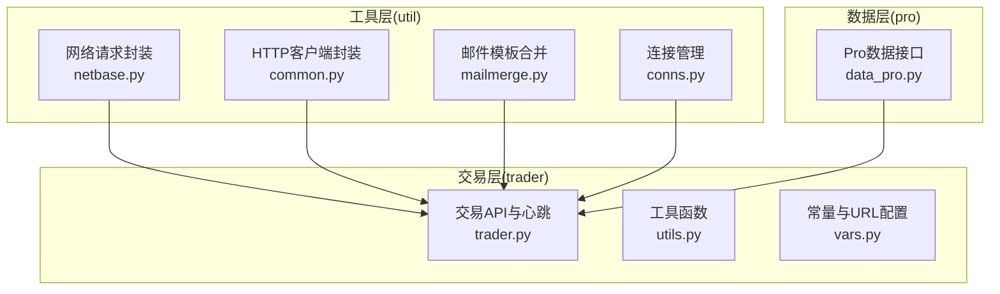
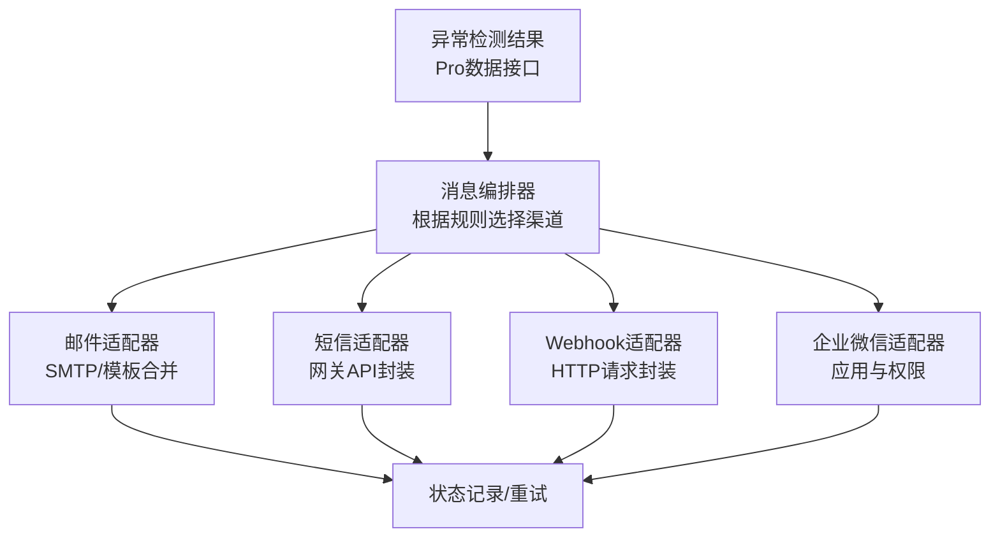
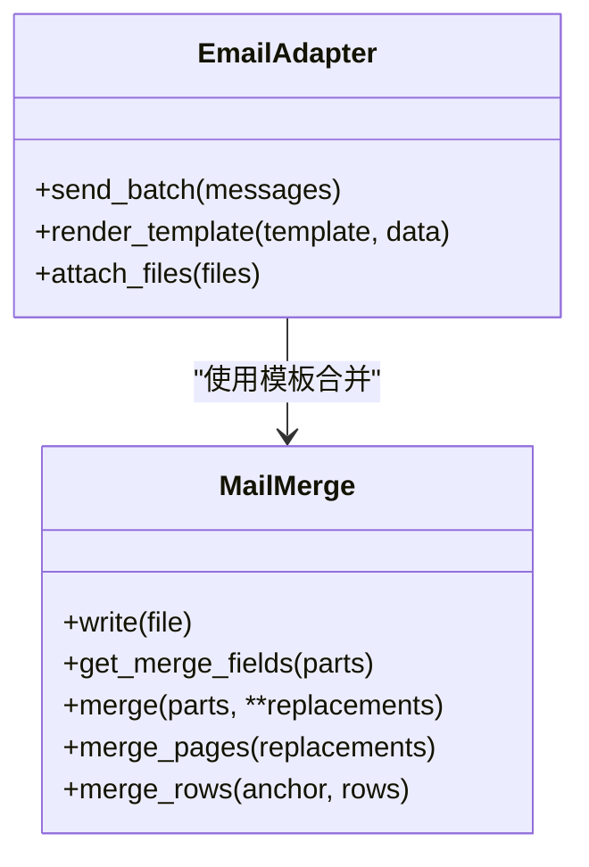
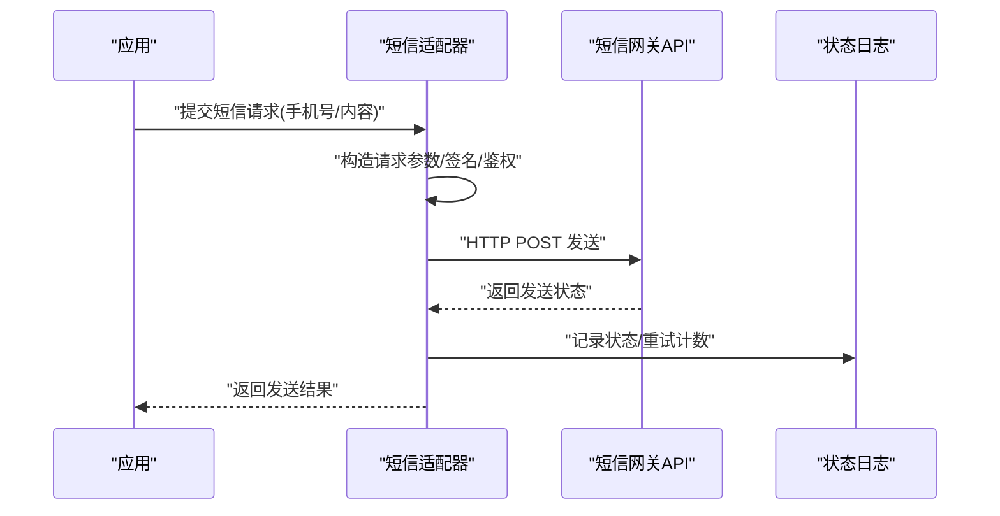
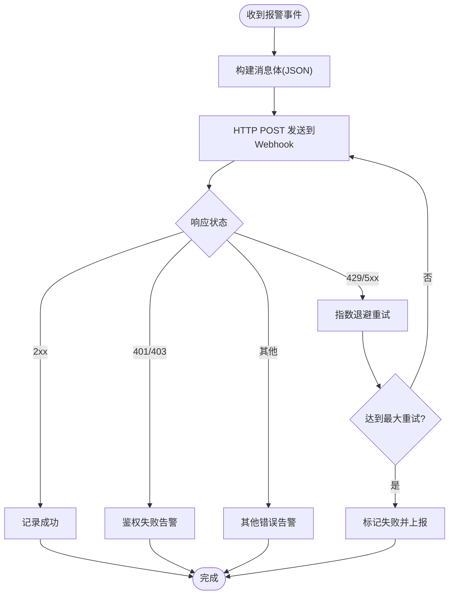
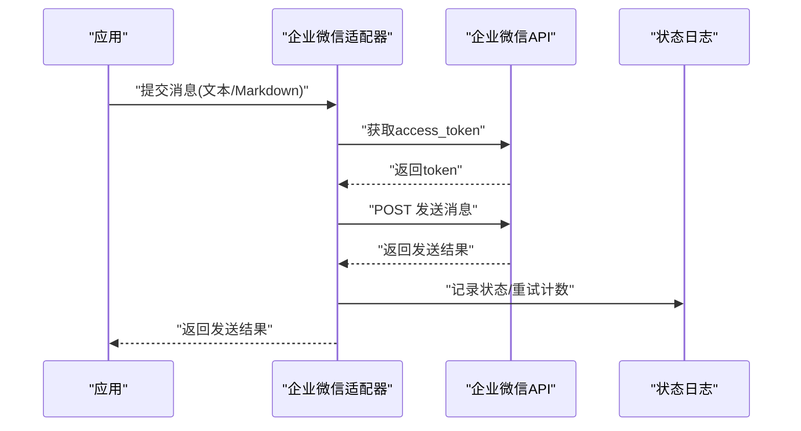
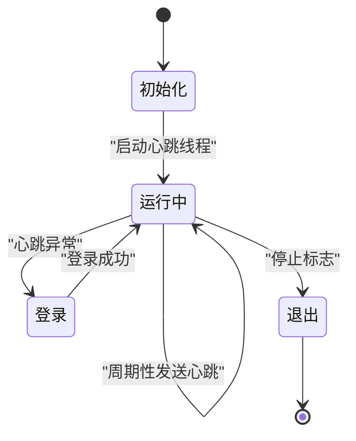
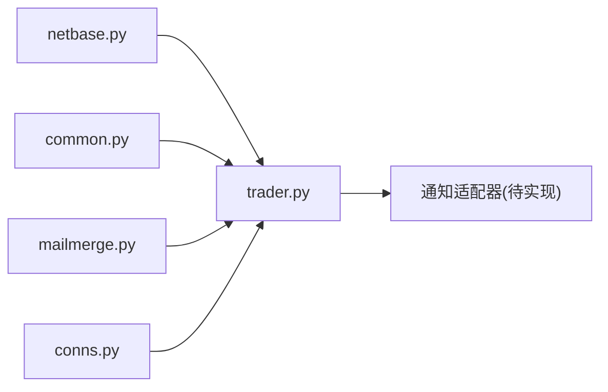

# 报警通知系统

<cite>
**本文引用的文件**
- [README.md](file://README.md)
- [mailmerge.py](file://tushare/util/mailmerge.py)
- [common.py](file://tushare/util/common.py)
- [netbase.py](file://tushare/util/netbase.py)
- [conns.py](file://tushare/util/conns.py)
- [trader.py](file://tushare/trader/trader.py)
- [utils.py](file://tushare/trader/utils.py)
- [vars.py](file://tushare/trader/vars.py)
</cite>

## 目录
1. [简介](#简介)
2. [项目结构](#项目结构)
3. [核心组件](#核心组件)
4. [架构总览](#架构总览)
5. [详细组件分析](#详细组件分析)
6. [依赖分析](#依赖分析)
7. [性能考虑](#性能考虑)
8. [故障排查指南](#故障排查指南)
9. [结论](#结论)
10. [附录](#附录)

## 简介
本技术指南围绕基于 TuShare 异常检测结果的多渠道报警通知系统展开，目标是帮助开发者在现有代码基础上扩展实现邮件通知、短信提醒、Webhook 推送、企业微信通知等能力。当前仓库中已具备网络请求封装、邮件模板合并、交易接口心跳保活等基础能力，可作为报警通知系统的基础构件。

## 项目结构
仓库采用按功能域划分的组织方式，与报警通知相关的关键模块如下：
- util：网络与通用工具（HTTP 请求、邮件模板合并、连接管理）
- trader：交易接口与心跳保活（可借鉴心跳与重试机制用于通知系统健康检查）
- pro：Pro 数据接口（可用于异常检测的数据源）

图表来源
- [netbase.py:1-29](file://tushare/util/netbase.py#L1-L29)
- [common.py:18-86](file://tushare/util/common.py#L18-L86)
- [mailmerge.py:22-219](file://tushare/util/mailmerge.py#L22-L219)
- [conns.py:14-61](file://tushare/util/conns.py#L14-L61)
- [trader.py:20-329](file://tushare/trader/trader.py#L20-L329)
- [utils.py:16-37](file://tushare/trader/utils.py#L16-L37)
- [vars.py:9-42](file://tushare/trader/vars.py#L9-L42)

章节来源
- [README.md:1-411](file://README.md#L1-L411)

## 核心组件
- 网络请求封装：提供统一的 HTTP 请求与超时设置，便于后续 Webhook 推送与短信网关调用。
- 邮件模板合并：支持 DOCX 模板字段替换与表格复制，可直接用于邮件正文生成与批量发送。
- 连接管理：提供连接池与重试逻辑，可借鉴其健壮性设计用于通知系统的外部服务调用。
- 交易心跳保活：通过定时线程维持会话活跃，可迁移为通知系统的健康检查与重试策略。

章节来源
- [netbase.py:9-29](file://tushare/util/netbase.py#L9-L29)
- [mailmerge.py:22-219](file://tushare/util/mailmerge.py#L22-L219)
- [conns.py:14-61](file://tushare/util/conns.py#L14-L61)
- [trader.py:85-96](file://tushare/trader/trader.py#L85-L96)

## 架构总览
报警通知系统建议采用“事件触发 -> 消息编排 -> 渠道分发 -> 状态回写”的架构。异常检测结果作为输入，经由消息编排模块生成不同渠道的消息体，再通过各渠道适配器进行发送，并记录发送状态与重试策略。

说明
- 当前仓库未包含短信网关、Webhook、企业微信的具体实现，但已具备网络请求与模板合并的基础能力，可在此基础上扩展。
- 交易心跳保活机制可作为通知系统的健康检查与重试策略参考。

## 详细组件分析

### 组件A：邮件通知系统
- 功能要点
  - SMTP 配置：可结合现有网络请求封装与模板合并模块，实现邮件正文生成与附件处理。
  - 邮件模板设计：利用模板字段替换与表格复制能力，支持批量生成个性化邮件。
  - 附件处理：通过模板合并输出 DOCX 并导出为 PDF 或直接作为附件发送。
  - 批量发送：结合模板复制与字段替换，实现同一模板多条记录的批量渲染与发送。

图表来源
- [mailmerge.py:22-219](file://tushare/util/mailmerge.py#L22-L219)

章节来源
- [mailmerge.py:22-219](file://tushare/util/mailmerge.py#L22-L219)

### 组件B：短信通知集成方案
- 功能要点
  - 短信网关接入：基于网络请求封装模块，构造短信网关 API 的 HTTP 请求。
  - API 调用封装：统一参数签名、鉴权头、超时与重试策略。
  - 发送状态监控：记录每条短信的发送状态与回执，支持失败重试与告警。
  - 费用控制：对接口调用次数与费用阈值进行限制与告警。

说明
- 可复用网络请求封装模块的超时与头部设置能力。
- 发送状态与重试策略可参考交易心跳保活的线程与循环机制。

章节来源
- [netbase.py:16-28](file://tushare/util/netbase.py#L16-L28)
- [trader.py:85-96](file://tushare/trader/trader.py#L85-L96)

### 组件C：Webhook 推送
- 功能要点
  - HTTP 请求封装：基于现有网络请求模块，统一请求头、超时与代理设置。
  - 消息格式定义：约定 JSON 结构，包含报警级别、指标、时间戳、上下文链接等。
  - 重试机制：指数退避与最大重试次数，避免雪崩效应。
  - 错误处理：区分网络错误、业务错误与超时，分别采取不同策略。

章节来源
- [netbase.py:16-28](file://tushare/util/netbase.py#L16-L28)

### 组件D：企业微信通知
- 功能要点
  - 企业ID与应用配置：定义企业ID、应用Secret、接收人/部门等配置项。
  - 消息模板：支持文本、Markdown、图文卡片等消息类型。
  - 用户权限：校验接收人权限与部门有效性，避免越权发送。
  - 发送与回执：记录发送状态、失败原因与重试策略。

说明
- 可复用网络请求封装模块与交易心跳保活的重试策略。

章节来源
- [netbase.py:16-28](file://tushare/util/netbase.py#L16-L28)
- [trader.py:85-96](file://tushare/trader/trader.py#L85-L96)

### 组件E：交易心跳保活（可迁移至通知系统）
- 功能要点
  - 定时线程：周期性发送心跳请求，维持会话活跃。
  - 健康检查：异常时自动重登或切换节点。
  - 线程安全：通过标志位控制线程生命周期。

图表来源
- [trader.py:85-96](file://tushare/trader/trader.py#L85-L96)

章节来源
- [trader.py:85-96](file://tushare/trader/trader.py#L85-L96)

## 依赖分析
- 组件耦合
  - 网络请求封装模块被交易与通知适配器共同依赖，建议将其抽象为通用 HTTP 客户端。
  - 模板合并模块独立性强，可直接复用于邮件通知。
  - 心跳保活模块体现了线程与循环控制，可迁移为通知系统的健康检查与重试策略。
- 外部依赖
  - requests、urllib、lxml 等第三方库用于 HTTP 与 XML 处理。
  - pytdx 用于行情连接（与通知系统解耦，但可借鉴其连接管理与重试策略）。

图表来源
- [netbase.py:9-29](file://tushare/util/netbase.py#L9-L29)
- [common.py:18-86](file://tushare/util/common.py#L18-L86)
- [mailmerge.py:22-219](file://tushare/util/mailmerge.py#L22-L219)
- [conns.py:14-61](file://tushare/util/conns.py#L14-L61)
- [trader.py:20-329](file://tushare/trader/trader.py#L20-L329)

章节来源
- [netbase.py:9-29](file://tushare/util/netbase.py#L9-L29)
- [common.py:18-86](file://tushare/util/common.py#L18-L86)
- [mailmerge.py:22-219](file://tushare/util/mailmerge.py#L22-L219)
- [conns.py:14-61](file://tushare/util/conns.py#L14-L61)
- [trader.py:20-329](file://tushare/trader/trader.py#L20-L329)

## 性能考虑
- 网络请求
  - 设置合理的超时与并发上限，避免阻塞通知线程。
  - 对外部服务采用连接池与重试策略，降低抖动影响。
- 模板渲染
  - 批量渲染时优先使用表格复制与字段替换，减少重复解析。
- 心跳与重试
  - 使用指数退避与最大重试次数，避免雪崩效应。
  - 将重试与告警解耦，确保失败不会阻塞主流程。

## 故障排查指南
- 网络请求异常
  - 检查超时设置与代理配置，确认 DNS 与防火墙策略。
  - 记录请求与响应详情，定位服务端错误码。
- 模板渲染失败
  - 校验模板字段与数据一致性，避免空值导致渲染异常。
  - 分批渲染与回滚，定位具体字段问题。
- 心跳与重试
  - 观察心跳线程状态与异常日志，必要时切换备用节点。
  - 对高频失败的渠道进行熔断与降级处理。

章节来源
- [netbase.py:16-28](file://tushare/util/netbase.py#L16-L28)
- [mailmerge.py:95-111](file://tushare/util/mailmerge.py#L95-L111)
- [trader.py:85-96](file://tushare/trader/trader.py#L85-L96)

## 结论
本指南基于 TuShare 仓库中的网络请求、模板合并与心跳保活能力，提出了报警通知系统的扩展路径。建议以网络请求封装为基础，结合模板合并实现邮件通知；以心跳保活机制为参考，完善短信、Webhook、企业微信等渠道的重试与健康检查策略。通过模块化设计与统一的错误处理，可构建稳定可靠的多渠道报警通知系统。

## 附录
- 配置示例（概念性描述）
  - 邮件：SMTP 地址、端口、用户名、密码、发件人、收件人列表、附件路径。
  - 短信：网关地址、AppKey、AppSecret、签名、模板ID、回调地址。
  - Webhook：目标URL、鉴权头、消息体格式、重试间隔与最大次数。
  - 企业微信：企业ID、应用Secret、接收人、部门、消息类型与模板。
- 错误处理策略（概念性描述）
  - 网络错误：指数退避重试，超过阈值后告警。
  - 业务错误：记录原因并停止重试，人工介入。
  - 超时错误：缩短超时或切换备用节点，避免连锁反应。