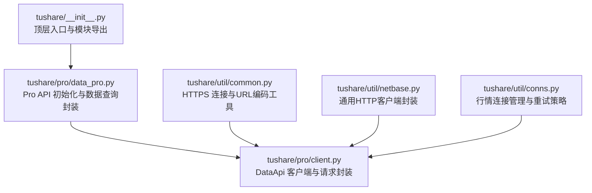
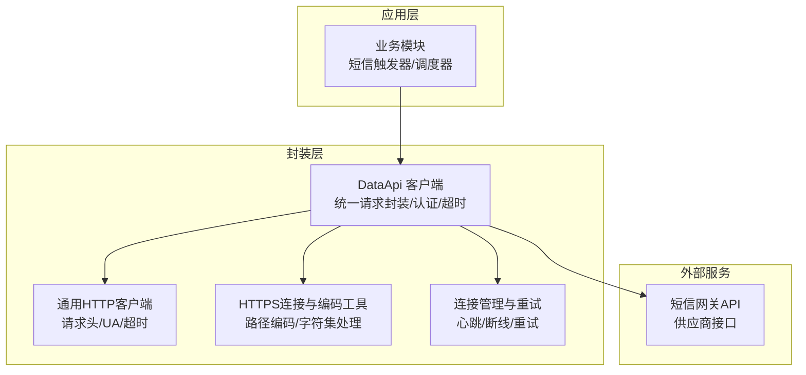
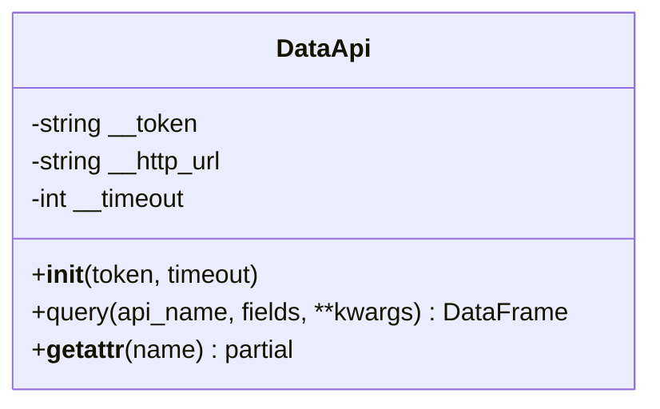
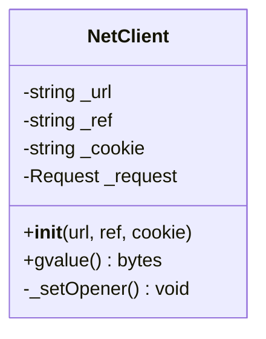
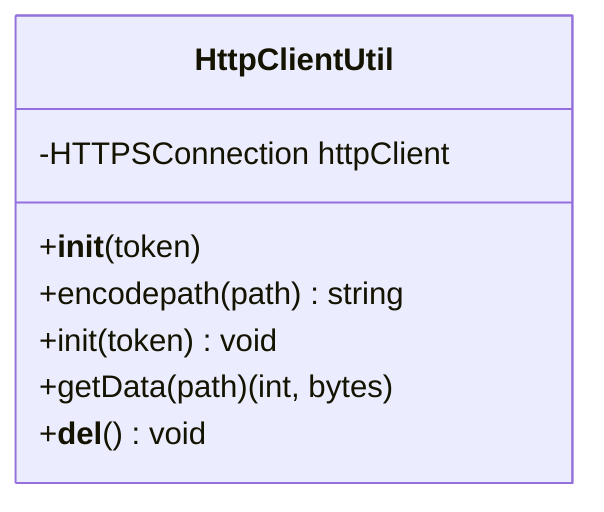
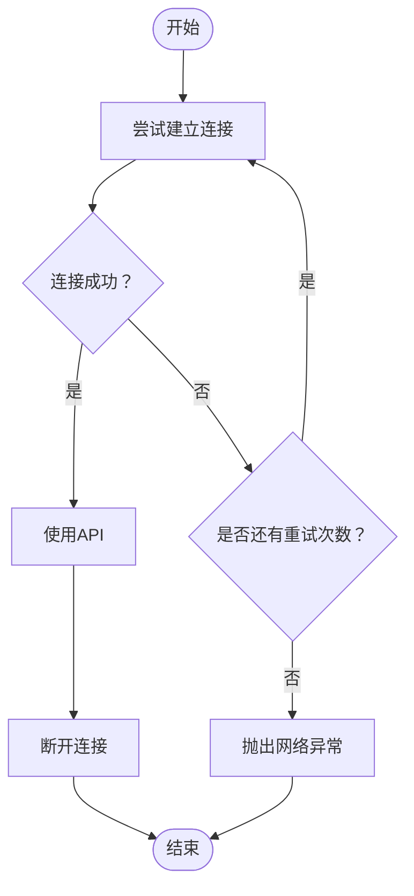
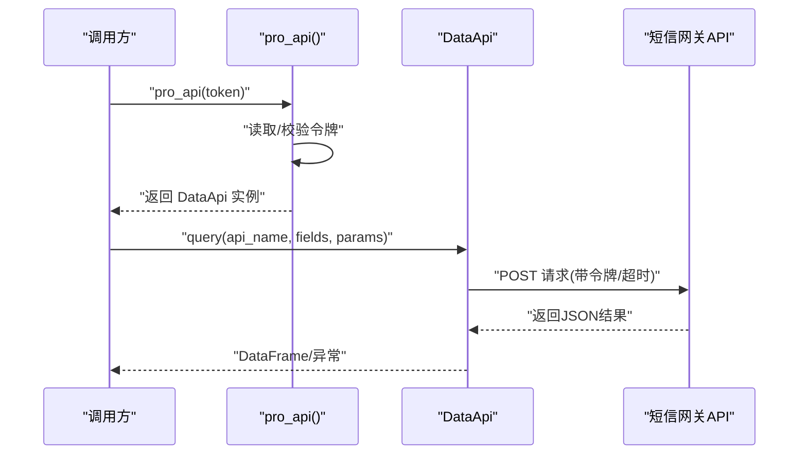
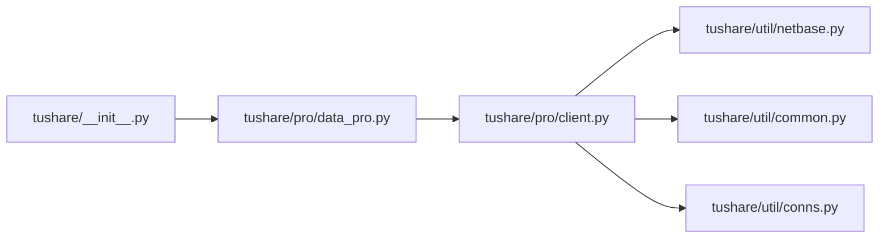

# 短信通知

<cite>
**本文引用的文件**
- [README.md](file://README.md)
- [tushare/__init__.py](file://tushare/__init__.py)
- [tushare/pro/client.py](file://tushare/pro/client.py)
- [tushare/pro/data_pro.py](file://tushare/pro/data_pro.py)
- [tushare/util/common.py](file://tushare/util/common.py)
- [tushare/util/netbase.py](file://tushare/util/netbase.py)
- [tushare/util/conns.py](file://tushare/util/conns.py)
</cite>

## 目录
1. [简介](#简介)
2. [项目结构](#项目结构)
3. [核心组件](#核心组件)
4. [架构总览](#架构总览)
5. [详细组件分析](#详细组件分析)
6. [依赖分析](#依赖分析)
7. [性能考量](#性能考量)
8. [故障排查指南](#故障排查指南)
9. [结论](#结论)
10. [附录](#附录)

## 简介
本技术文档围绕基于 TuShare 的短信通知能力进行系统化说明。通过对现有代码库的分析，我们梳理了与短信通知相关的关键路径与组件，并结合实际代码中的 HTTP 请求封装、令牌管理、API 查询封装等机制，给出短信网关接入、API 调用封装、发送状态监控与费用控制的实现思路与最佳实践。需要特别说明的是：当前仓库中并未直接提供短信网关的具体实现代码；本文所涉及的短信通知实现方案为面向真实业务场景的工程化建议，旨在帮助开发者在现有基础设施之上快速构建稳定可靠的短信通知系统。

## 项目结构
TuShare 项目采用模块化组织方式，核心入口通过顶层包导出各类数据接口；Pro 版本提供了统一的数据访问客户端；工具模块则包含通用网络请求、连接管理与基础网络封装。下图展示了与短信通知相关的关键文件及其职责定位：

图表来源
- [tushare/__init__.py:1-140](file://tushare/__init__.py#L1-L140)
- [tushare/pro/data_pro.py:1-158](file://tushare/pro/data_pro.py#L1-L158)
- [tushare/pro/client.py:1-52](file://tushare/pro/client.py#L1-L52)
- [tushare/util/common.py:1-86](file://tushare/util/common.py#L1-L86)
- [tushare/util/netbase.py:1-29](file://tushare/util/netbase.py#L1-L29)
- [tushare/util/conns.py:1-61](file://tushare/util/conns.py#L1-L61)

章节来源
- [tushare/__init__.py:1-140](file://tushare/__init__.py#L1-L140)
- [README.md:1-411](file://README.md#L1-L411)

## 核心组件
- Pro 数据客户端（DataApi）
  - 提供统一的请求封装与认证机制，支持以 JSON 形式向服务端发起 POST 请求，并解析返回结果。
  - 关键点：令牌注入、超时控制、错误码校验、DataFrame 结果转换。
- 通用网络客户端（Client）
  - 提供基于 urllib 的 HTTP 请求封装，支持自定义请求头、Cookie、超时等。
  - 关键点：请求头设置、UA 设置、超时控制、读取响应体。
- HTTPS 连接与 URL 编码工具
  - 封装 HTTPS 连接与路径编码逻辑，支持多语言字符的安全传输。
  - 关键点：路径编码、字符集处理、响应状态判断。
- 行情连接管理
  - 提供行情服务器连接与断开、心跳检测与重试策略，体现稳健的网络交互设计。
  - 关键点：重试循环、异常捕获、断线清理。

章节来源
- [tushare/pro/client.py:17-52](file://tushare/pro/client.py#L17-L52)
- [tushare/util/netbase.py:9-29](file://tushare/util/netbase.py#L9-L29)
- [tushare/util/common.py:18-86](file://tushare/util/common.py#L18-L86)
- [tushare/util/conns.py:14-61](file://tushare/util/conns.py#L14-L61)

## 架构总览
下图展示了短信通知系统在现有代码基础上的可落地架构：以 Pro 客户端为核心，结合通用网络封装与令牌管理，形成“请求封装—认证—响应解析”的闭环；同时，通过连接管理与重试策略保障稳定性。

图表来源
- [tushare/pro/client.py:17-52](file://tushare/pro/client.py#L17-L52)
- [tushare/util/netbase.py:9-29](file://tushare/util/netbase.py#L9-L29)
- [tushare/util/common.py:18-86](file://tushare/util/common.py#L18-L86)
- [tushare/util/conns.py:14-61](file://tushare/util/conns.py#L14-L61)

## 详细组件分析

### 组件A：Pro 数据客户端（DataApi）
- 角色与职责
  - 作为统一的数据访问入口，负责将业务参数序列化为请求负载，附加认证令牌后发送至服务端，并将返回的 JSON 解析为结构化数据。
- 关键实现要点
  - 认证：在初始化时接收令牌并在请求头中携带。
  - 超时：通过请求参数设置超时，避免阻塞。
  - 错误处理：根据返回码抛出异常，便于上层统一处理。
  - 结果转换：将字段与条目映射为 DataFrame，便于后续处理。
- 适用场景
  - 可直接复用该客户端进行短信网关的 HTTP 请求封装，或作为短信发送状态查询的参考实现。

图表来源
- [tushare/pro/client.py:17-52](file://tushare/pro/client.py#L17-L52)

章节来源
- [tushare/pro/client.py:17-52](file://tushare/pro/client.py#L17-L52)

### 组件B：通用网络客户端（Client）
- 角色与职责
  - 提供基于 urllib 的 HTTP 请求封装，支持设置请求头、Cookie、User-Agent 等，适用于通用的 HTTP GET/POST 场景。
- 关键实现要点
  - 请求头：自动添加 Accept-Language、Connection、User-Agent 等常用头。
  - Cookie：可选注入 Cookie，满足会话保持需求。
  - 超时：通过超时参数限制等待时间。
  - 响应读取：统一读取响应体并返回字节数据。
- 适用场景
  - 可作为短信网关 HTTP 请求的基础封装，配合令牌与签名参数进行调用。

图表来源
- [tushare/util/netbase.py:9-29](file://tushare/util/netbase.py#L9-L29)

章节来源
- [tushare/util/netbase.py:9-29](file://tushare/util/netbase.py#L9-L29)

### 组件C：HTTPS 连接与 URL 编码工具
- 角色与职责
  - 封装 HTTPS 连接与路径编码逻辑，确保特殊字符安全传输；同时处理不同 Python 版本的兼容性。
- 关键实现要点
  - 路径编码：遍历键值对，对非 ASCII 字符进行编码，保证 URL 合法性。
  - 字符集处理：针对 CSV 类响应进行编码转换，避免乱码。
  - 异常处理：捕获网络异常并抛出，便于上层统一处理。
- 适用场景
  - 可作为短信网关请求参数编码与传输的参考实现。

图表来源
- [tushare/util/common.py:18-86](file://tushare/util/common.py#L18-L86)

章节来源
- [tushare/util/common.py:18-86](file://tushare/util/common.py#L18-L86)

### 组件D：行情连接管理（连接/断开/重试）
- 角色与职责
  - 提供行情服务器连接与断开、心跳检测与重试策略，体现稳健的网络交互设计。
- 关键实现要点
  - 重试循环：在连接失败时进行多次尝试，提升成功率。
  - 异常捕获：捕获连接异常并输出提示，避免中断。
  - 断线清理：断开连接时进行资源回收。
- 适用场景
  - 可借鉴其重试与异常处理策略，用于短信网关的请求稳定性保障。

图表来源
- [tushare/util/conns.py:14-61](file://tushare/util/conns.py#L14-L61)

章节来源
- [tushare/util/conns.py:14-61](file://tushare/util/conns.py#L14-L61)

### 组件E：Pro API 初始化与数据查询封装
- 角色与职责
  - 提供 Pro API 的初始化入口，支持从持久化令牌或临时参数中获取令牌；封装多类数据查询逻辑。
- 关键实现要点
  - 令牌获取：优先从持久化存储中读取，否则使用传入参数。
  - 参数预处理：对输入参数进行标准化处理（大小写、去空白等）。
  - 错误处理：统一捕获异常并返回空值或抛出异常。
- 适用场景
  - 可作为短信网关调用的参考模式：初始化令牌、构造请求参数、执行调用、解析结果。

图表来源
- [tushare/pro/data_pro.py:21-32](file://tushare/pro/data_pro.py#L21-L32)
- [tushare/pro/client.py:32-48](file://tushare/pro/client.py#L32-L48)

章节来源
- [tushare/pro/data_pro.py:21-32](file://tushare/pro/data_pro.py#L21-L32)
- [tushare/pro/client.py:32-48](file://tushare/pro/client.py#L32-L48)

## 依赖分析
- 模块耦合
  - 顶层入口导出各模块接口，Pro 初始化模块依赖令牌管理模块；Pro 客户端依赖网络封装模块。
- 外部依赖
  - 使用 requests、pandas、simplejson 等第三方库进行 HTTP 请求、数据结构化与 JSON 解析。
- 潜在风险
  - 若令牌缺失或网络异常，将导致初始化失败或请求异常；需完善异常处理与重试策略。

图表来源
- [tushare/__init__.py:1-140](file://tushare/__init__.py#L1-L140)
- [tushare/pro/data_pro.py:9-11](file://tushare/pro/data_pro.py#L9-L11)
- [tushare/pro/client.py:14-14](file://tushare/pro/client.py#L14-L14)

章节来源
- [tushare/__init__.py:1-140](file://tushare/__init__.py#L1-L140)
- [tushare/pro/data_pro.py:9-11](file://tushare/pro/data_pro.py#L9-L11)
- [tushare/pro/client.py:14-14](file://tushare/pro/client.py#L14-L14)

## 性能考量
- 超时控制
  - 在请求封装中设置合理的超时时间，避免长时间阻塞影响整体吞吐。
- 重试策略
  - 对瞬时网络抖动采用指数退避或固定间隔重试，降低失败率。
- 连接复用
  - 在支持长连接的场景下复用连接，减少握手开销。
- 批量处理
  - 对短信发送进行批量聚合，降低请求次数与网络开销。
- 日志与监控
  - 记录请求耗时、成功率、错误码分布，支撑容量规划与性能优化。

## 故障排查指南
- 常见问题与处理
  - 令牌无效/缺失：检查令牌获取流程与存储；必要时重新设置令牌。
  - 网络超时：调整超时参数；检查网络连通性与代理设置。
  - 服务端错误：根据返回码定位具体错误；结合日志与回调进行排查。
  - 编码问题：确保路径编码与字符集转换正确；对 CSV 类响应进行编码适配。
- 建议的日志记录
  - 请求参数、响应状态码、异常堆栈、耗时统计、重试次数等。
- 回调与状态监控
  - 对于异步发送场景，建议实现回调接口与轮询查询，确保最终一致性。

## 结论
尽管当前代码库未直接提供短信网关的具体实现，但通过 Pro 客户端、通用网络封装与连接管理等模块，可以清晰地构建出一套稳定、可扩展的短信通知系统。建议在现有基础设施上，遵循“请求封装—认证—状态监控—费用控制”的工程化路径，结合令牌管理、重试与日志体系，实现高质量的短信通知能力。

## 附录
- 配置示例（概念性说明）
  - 令牌配置：通过持久化存储或环境变量注入令牌，初始化时读取。
  - 网关地址：在客户端中配置短信网关的 HTTP 地址与端口。
  - 请求参数：按供应商要求构造参数（手机号、签名、模板ID、变量等），并对特殊字符进行编码。
  - 超时与重试：设置合理超时与重试次数，避免阻塞与失败放大。
- 费用控制（概念性说明）
  - 单价计算：根据模板与运营商计费规则计算单价。
  - 余额监控：定期查询账户余额，低于阈值时触发告警。
  - 成本统计：按模板/时间段统计发送量与费用，生成报表。
  - 阈值告警：当发送量或费用接近阈值时，推送告警通知。