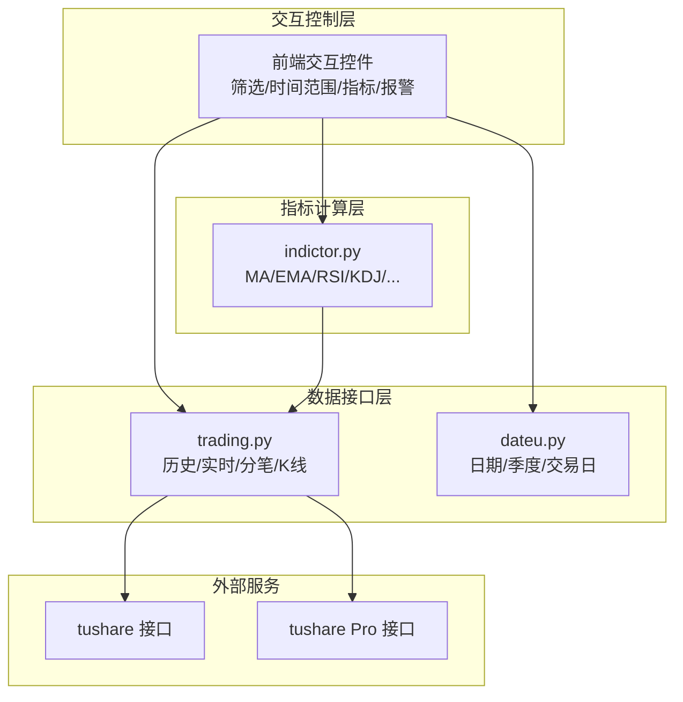
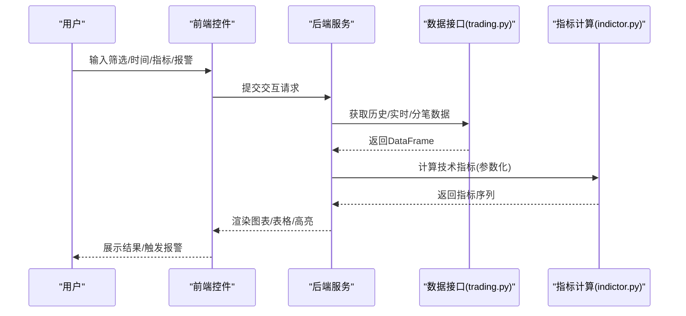
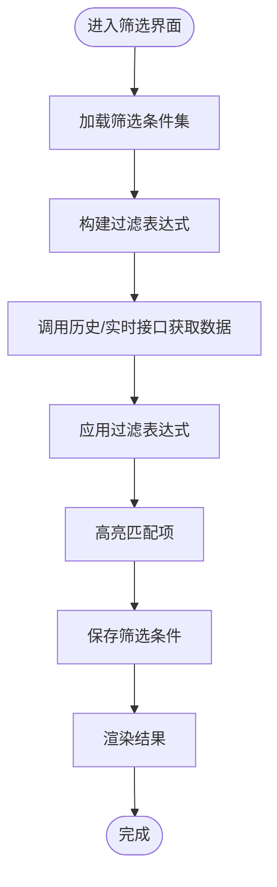
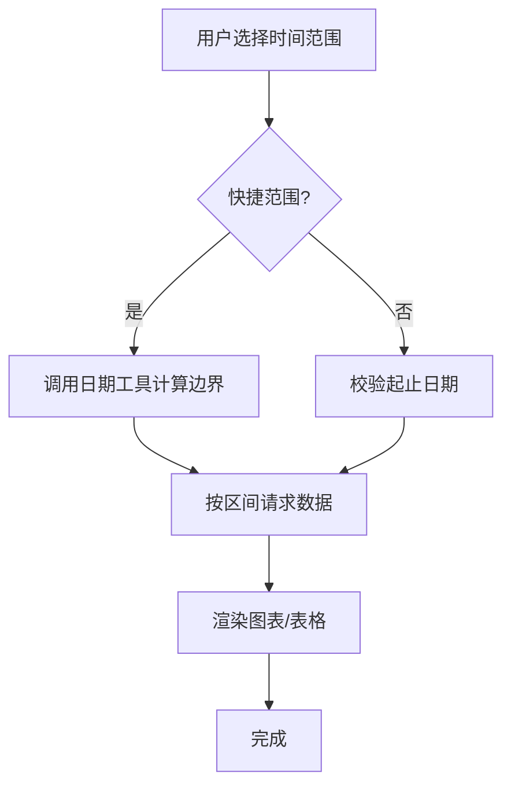
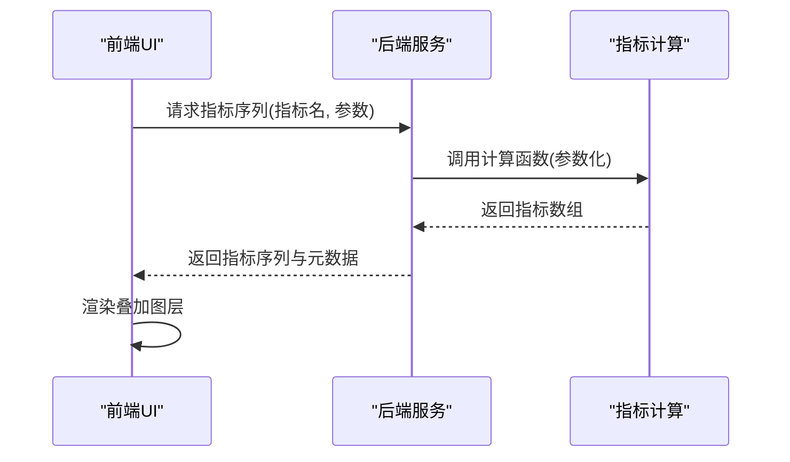
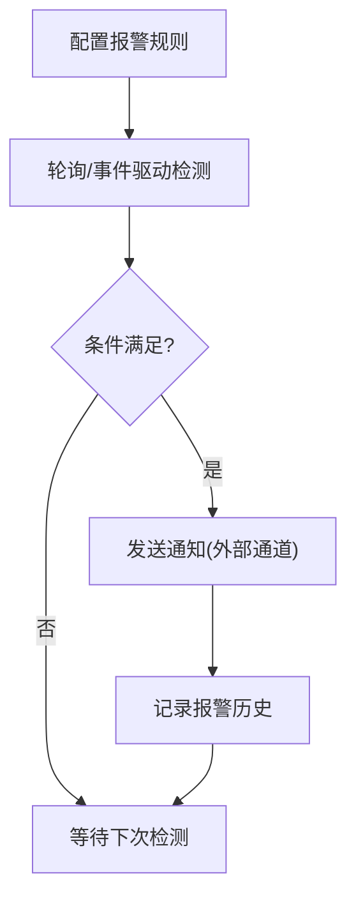
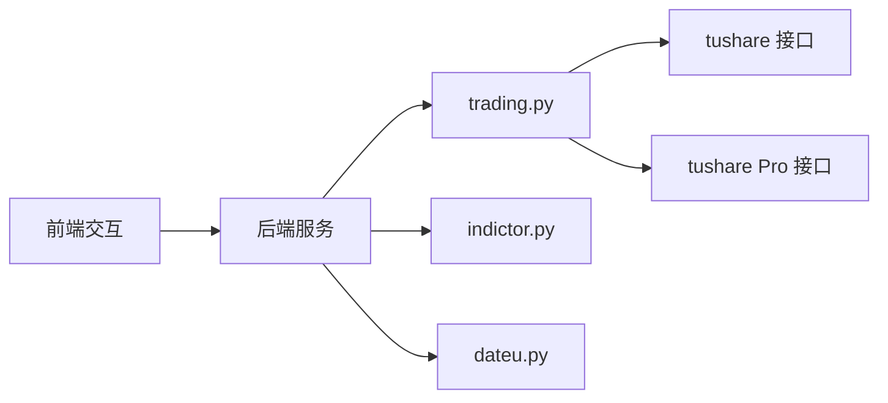

# 交互控制

<cite>
**本文引用的文件**
- [README.md](file://README.md)
- [indictor.py](file://tushare/stock/indictor.py)
- [trading.py](file://tushare/stock/trading.py)
- [dateu.py](file://tushare/util/dateu.py)
- [common.py](file://tushare/util/common.py)
- [client.py](file://tushare/pro/client.py)
</cite>

## 目录
1. [简介](#简介)
2. [项目结构](#项目结构)
3. [核心组件](#核心组件)
4. [架构总览](#架构总览)
5. [详细组件分析](#详细组件分析)
6. [依赖分析](#依赖分析)
7. [性能考量](#性能考量)
8. [故障排查指南](#故障排查指南)
9. [结论](#结论)
10. [附录](#附录)

## 简介
本技术指南围绕交互控制功能展开，聚焦于监控面板的用户交互实现，涵盖股票筛选、时间范围选择、指标切换、报警设置等核心控制能力。结合仓库中的数据接口与指标计算模块，给出从前端交互到后端状态管理的完整实现思路与可视化流程，帮助开发者构建直观易用的交互控制系统。

## 项目结构
仓库以模块化组织，涉及数据采集、清洗、存储与指标计算等环节。与交互控制直接相关的模块包括：
- 股票行情与K线数据接口：trading.py
- 技术指标计算：indictor.py
- 日期与时间辅助：dateu.py
- 通用客户端封装：common.py
- Pro数据接口客户端：client.py

图表来源
- [trading.py:32-100](file://tushare/stock/trading.py#L32-L100)
- [dateu.py:78-100](file://tushare/util/dateu.py#L78-L100)
- [indictor.py:12-42](file://tushare/stock/indictor.py#L12-L42)
- [client.py:17-52](file://tushare/pro/client.py#L17-L52)

章节来源
- [README.md:1-411](file://README.md#L1-L411)
- [trading.py:32-100](file://tushare/stock/trading.py#L32-L100)
- [dateu.py:78-100](file://tushare/util/dateu.py#L78-L100)
- [indictor.py:12-42](file://tushare/stock/indictor.py#L12-L42)
- [client.py:17-52](file://tushare/pro/client.py#L17-L52)

## 核心组件
- 股票筛选与数据获取
  - 历史行情批量获取：支持按时间范围过滤与字段类型转换，便于前端筛选结果呈现与高亮。
  - 实时行情与分笔：提供实时价格与逐笔明细，支撑筛选条件的动态验证与报警触发。
- 时间范围选择
  - 日期工具：提供季度拆分、交易日判断、自然周/年的便捷计算，支撑快速时间范围与自定义时间段。
- 指标切换
  - 指标计算：提供多类技术指标（MA、EMA、MACD、KDJ、RSI、布林带等），支持参数化与叠加显示。
- 报警设置
  - 条件配置：基于实时/历史数据与指标阈值，结合时间窗口与触发策略，形成报警规则。
  - 通知机制：建议通过外部通道（邮件/短信/IM）推送，仓库未内置通知实现。
  - 历史记录：建议在应用侧持久化报警事件，仓库未提供专门模块。

章节来源
- [trading.py:32-100](file://tushare/stock/trading.py#L32-L100)
- [trading.py:324-394](file://tushare/stock/trading.py#L324-L394)
- [trading.py:135-187](file://tushare/stock/trading.py#L135-L187)
- [dateu.py:78-100](file://tushare/util/dateu.py#L78-L100)
- [indictor.py:125-158](file://tushare/stock/indictor.py#L125-L158)
- [indictor.py:161-200](file://tushare/stock/indictor.py#L161-L200)
- [indictor.py:203-247](file://tushare/stock/indictor.py#L203-L247)

## 架构总览
交互控制的典型工作流如下：前端控件收集用户输入（筛选条件、时间范围、指标参数、报警规则），后端通过数据接口获取数据与指标，再将结果回传给前端进行渲染与高亮；同时，报警规则在后台轮询或事件驱动下触发并记录。

图表来源
- [trading.py:324-394](file://tushare/stock/trading.py#L324-L394)
- [trading.py:135-187](file://tushare/stock/trading.py#L135-L187)
- [indictor.py:125-158](file://tushare/stock/indictor.py#L125-L158)

## 详细组件分析

### 股票筛选与条件高亮
- 多条件筛选
  - 基于历史行情接口的日期过滤与数值字段转换，可在后端按条件聚合与排序，减少前端负担。
  - 建议在应用层维护筛选条件集合（名称、字段、比较符、阈值、布尔组合），统一生成SQL/过滤表达式。
- 模糊搜索
  - 对股票名称/代码进行模糊匹配，结合后端接口返回的DataFrame进行筛选。
- 筛选结果高亮
  - 在前端渲染时，依据当前筛选条件对匹配行进行视觉高亮（颜色/样式）。
- 筛选条件保存
  - 将筛选条件序列化为JSON，存储于本地或服务端，支持下次加载与编辑。

图表来源
- [trading.py:32-100](file://tushare/stock/trading.py#L32-L100)
- [trading.py:324-394](file://tushare/stock/trading.py#L324-L394)

章节来源
- [trading.py:32-100](file://tushare/stock/trading.py#L32-L100)
- [trading.py:324-394](file://tushare/stock/trading.py#L324-L394)

### 时间范围选择
- 日期选择器
  - 使用浏览器原生控件或第三方组件，传递起止日期字符串。
- 快速时间范围
  - 提供“近X日/周/月/年”等快捷选项，由后端根据日期工具计算边界。
- 自定义时间段
  - 用户输入起止日期，后端进行合法性校验与边界调整。
- 时间轴拖拽
  - 建议在前端实现时间轴拖拽选择，后端按拖拽区间请求数据并返回指标序列。

图表来源
- [dateu.py:78-100](file://tushare/util/dateu.py#L78-L100)
- [trading.py:624-707](file://tushare/stock/trading.py#L624-L707)

章节来源
- [dateu.py:78-100](file://tushare/util/dateu.py#L78-L100)
- [trading.py:624-707](file://tushare/stock/trading.py#L624-L707)

### 指标切换与叠加显示
- 指标选择
  - 前端提供指标清单（MA/EMA/MACD/KDJ/RSI/BOLL等），后端按需调用对应计算函数。
- 参数配置
  - 为不同指标提供参数输入（如周期、权重、上下轨倍数），后端按参数计算并返回序列。
- 叠加显示
  - 将多个指标序列合并到同一图表坐标系，注意量纲差异时的双轴或多轴处理。
- 删除指标
  - 前端移除对应图层，后端不再返回该指标序列。

图表来源
- [indictor.py:125-158](file://tushare/stock/indictor.py#L125-L158)
- [indictor.py:161-200](file://tushare/stock/indictor.py#L161-L200)
- [indictor.py:203-247](file://tushare/stock/indictor.py#L203-L247)

章节来源
- [indictor.py:125-158](file://tushare/stock/indictor.py#L125-L158)
- [indictor.py:161-200](file://tushare/stock/indictor.py#L161-L200)
- [indictor.py:203-247](file://tushare/stock/indictor.py#L203-L247)

### 报警设置与历史记录
- 报警条件配置
  - 支持价格/成交量/指标阈值、时间窗口、比较关系（大于/小于/等于）、触发频率等。
- 报警方式选择
  - 建议通过外部通道（邮件/短信/IM）推送，仓库未提供通知实现。
- 报警通知机制
  - 后台定时任务或事件驱动检测条件，满足则触发通知并记录事件。
- 报警历史记录
  - 建议在应用侧持久化报警事件（时间、股票、指标、阈值、触发值、处理状态），仓库未提供专门模块。

图表来源
- [trading.py:324-394](file://tushare/stock/trading.py#L324-L394)
- [indictor.py:125-158](file://tushare/stock/indictor.py#L125-L158)

章节来源
- [trading.py:324-394](file://tushare/stock/trading.py#L324-L394)
- [indictor.py:125-158](file://tushare/stock/indictor.py#L125-L158)

## 依赖分析
- 组件耦合
  - 指标计算依赖数据接口提供的DataFrame；前端交互依赖后端返回的标准化数据结构。
- 外部依赖
  - 数据接口依赖tushare官方HTTP服务；Pro接口依赖独立的API网关。
- 循环依赖
  - 当前模块间无明显循环依赖，职责清晰。

图表来源
- [trading.py:32-100](file://tushare/stock/trading.py#L32-L100)
- [indictor.py:125-158](file://tushare/stock/indictor.py#L125-L158)
- [dateu.py:78-100](file://tushare/util/dateu.py#L78-L100)
- [client.py:17-52](file://tushare/pro/client.py#L17-L52)

章节来源
- [trading.py:32-100](file://tushare/stock/trading.py#L32-L100)
- [indictor.py:125-158](file://tushare/stock/indictor.py#L125-L158)
- [dateu.py:78-100](file://tushare/util/dateu.py#L78-L100)
- [client.py:17-52](file://tushare/pro/client.py#L17-L52)

## 性能考量
- 数据请求
  - 合理设置重试次数与请求间隔，避免频繁请求导致限流。
  - 对批量数据采用分页/分段拉取，并在前端做虚拟滚动。
- 指标计算
  - 对长序列指标（如MACD、布林带）采用向量化计算，减少Python循环。
  - 缓存常用指标序列，避免重复计算。
- 图表渲染
  - 限制同时叠加的指标数量，必要时启用双轴或多轴。
  - 对高频数据（分钟级）采用降采样或滑动窗口聚合。

## 故障排查指南
- 网络错误
  - 观察历史/实时接口的异常抛出与重试逻辑，确认超时与重试参数设置。
- 数据为空
  - 检查时间范围是否合法、节假日/休市日期、接口返回为空的处理分支。
- 指标异常
  - 核对输入参数（周期、权重）是否合理，检查序列长度与缺失值处理。
- Pro接口认证
  - 确认Token有效性与权限范围，检查请求头与超时设置。

章节来源
- [trading.py:67-100](file://tushare/stock/trading.py#L67-L100)
- [trading.py:169-187](file://tushare/stock/trading.py#L169-L187)
- [client.py:32-48](file://tushare/pro/client.py#L32-L48)

## 结论
通过将前端交互控件与后端数据接口、指标计算模块有机结合，可以构建一套完整的监控面板交互控制系统。建议在应用层补充报警通知与历史记录能力，并持续优化数据请求与指标计算的性能，以提升用户体验与系统稳定性。

## 附录
- 关键接口路径
  - 历史/实时/分笔/K线接口：[trading.py:32-100](file://tushare/stock/trading.py#L32-L100)、[trading.py:324-394](file://tushare/stock/trading.py#L324-L394)、[trading.py:135-187](file://tushare/stock/trading.py#L135-L187)、[trading.py:624-707](file://tushare/stock/trading.py#L624-L707)
  - 指标计算接口：[indictor.py:125-158](file://tushare/stock/indictor.py#L125-L158)、[indictor.py:161-200](file://tushare/stock/indictor.py#L161-L200)、[indictor.py:203-247](file://tushare/stock/indictor.py#L203-L247)
  - 日期工具：[dateu.py:78-100](file://tushare/util/dateu.py#L78-L100)
  - Pro客户端：[client.py:17-52](file://tushare/pro/client.py#L17-L52)
  - 通用客户端封装：[common.py:18-86](file://tushare/util/common.py#L18-L86)