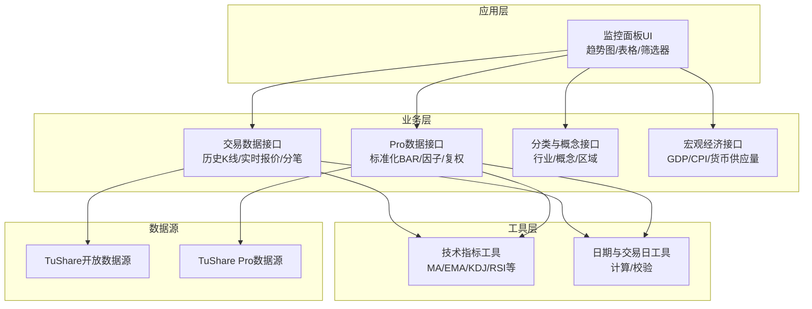
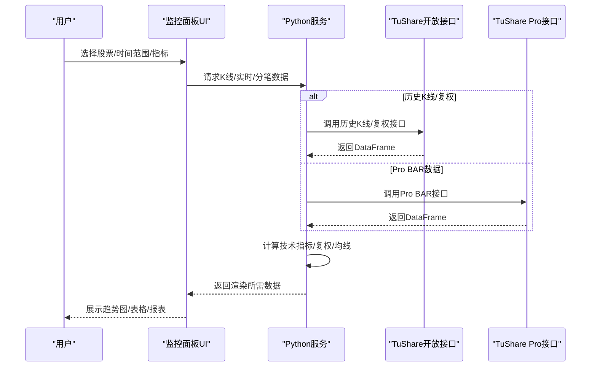
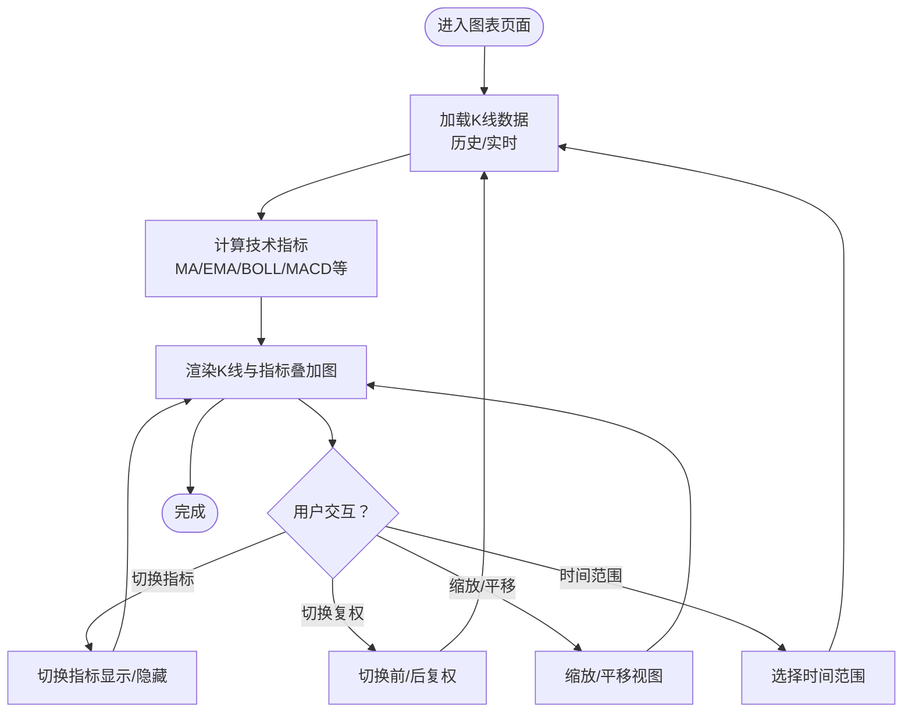
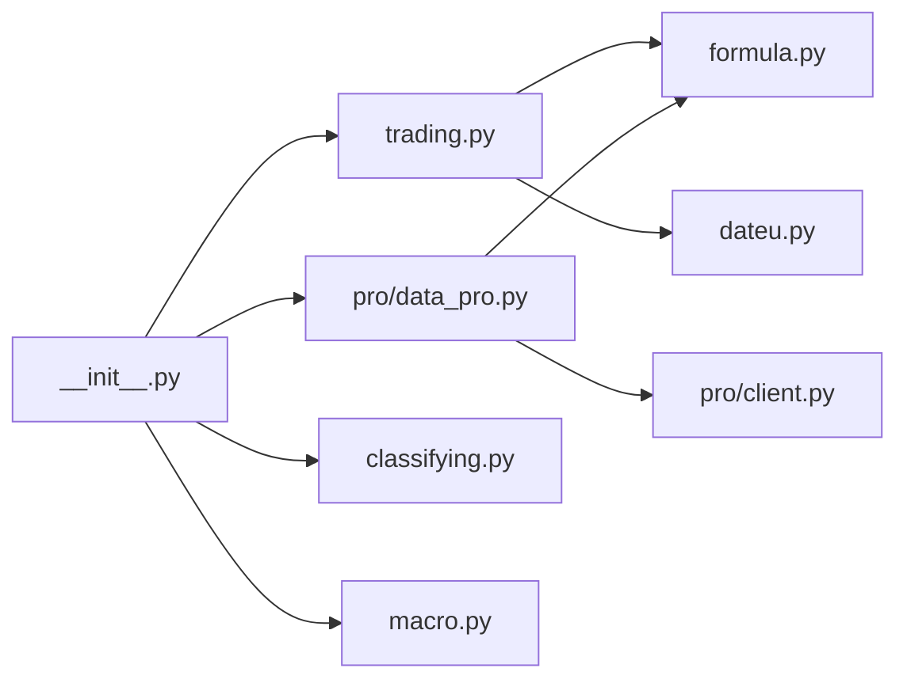

# 监控面板设计

<cite>
**本文引用的文件**   
- [README.md](file://README.md)
- [requirements.txt](file://requirements.txt)
- [setup.py](file://setup.py)
- [tushare/__init__.py](file://tushare/__init__.py)
- [tushare/pro/client.py](file://tushare/pro/client.py)
- [tushare/pro/data_pro.py](file://tushare/pro/data_pro.py)
- [tushare/stock/trading.py](file://tushare/stock/trading.py)
- [tushare/stock/cons.py](file://tushare/stock/cons.py)
- [tushare/util/formula.py](file://tushare/util/formula.py)
- [tushare/util/dateu.py](file://tushare/util/dateu.py)
- [tushare/stock/billboard.py](file://tushare/stock/billboard.py)
- [tushare/stock/classifying.py](file://tushare/stock/classifying.py)
- [test/trading_test.py](file://test/trading_test.py)
</cite>

## 目录
1. [简介](#简介)
2. [项目结构](#项目结构)
3. [核心组件](#核心组件)
4. [架构总览](#架构总览)
5. [详细组件分析](#详细组件分析)
6. [依赖关系分析](#依赖关系分析)
7. [性能考量](#性能考量)
8. [故障排查指南](#故障排查指南)
9. [结论](#结论)
10. [附录](#附录)

## 简介
本技术指南围绕基于 TuShare 数据的实时监控面板进行系统化设计，涵盖数据展示界面、趋势分析图表、统计报表与交互控制四大核心模块。文档以仓库现有接口与数据处理能力为基础，结合金融数据特点，给出前端技术栈选型建议与后端数据对接方案，帮助开发者快速构建直观、易用且高性能的监控面板系统。

## 项目结构
该仓库采用按领域分层的组织方式：
- 接口入口与聚合：tushare/__init__.py 将各类数据接口统一导出，便于上层调用。
- 交易数据接口：tushare/stock/trading.py 提供历史K线、实时报价、分笔等基础数据。
- Pro 数据接口：tushare/pro/data_pro.py 与 tushare/pro/client.py 提供 Tushare Pro 的标准化数据服务。
- 工具与公式：tushare/util/formula.py 提供常用技术指标计算，tushare/util/dateu.py 提供日期与交易日辅助。
- 分类与概念：tushare/stock/classifying.py 提供行业、概念、区域等分类数据，便于筛选与报表。
- 宏观经济：tushare/stock/macro.py 提供宏观经济指标，可用于宏观背景分析。
- 测试：test/trading_test.py 展示典型调用方式与数据形态。

**图示来源**
- [tushare/__init__.py:11-140](file://tushare/__init__.py#L11-L140)
- [tushare/stock/trading.py:32-800](file://tushare/stock/trading.py#L32-L800)
- [tushare/pro/data_pro.py:21-158](file://tushare/pro/data_pro.py#L21-L158)
- [tushare/pro/client.py:17-52](file://tushare/pro/client.py#L17-L52)
- [tushare/util/formula.py:1-262](file://tushare/util/formula.py#L1-L262)
- [tushare/util/dateu.py:1-129](file://tushare/util/dateu.py#L1-L129)

**章节来源**
- [README.md:1-411](file://README.md#L1-L411)
- [tushare/__init__.py:11-140](file://tushare/__init__.py#L11-L140)

## 核心组件
- 数据获取与清洗
  - 历史K线与复权：get_hist_data、get_k_data、get_h_data，支持日/周/月/分钟级K线与前/后复权。
  - 实时行情：get_realtime_quotes，支持批量实时报价。
  - 分笔与大单：get_tick_data、get_today_ticks、get_sina_dd。
  - Pro BAR数据：pro_bar，支持多资产类型、频率、复权与均线叠加。
- 技术指标与计算
  - MA/EMA/ATR/BOLL/RSI/KDJ/MACD等常用指标，便于趋势与超买超卖判断。
- 分类与筛选
  - 行业/概念/区域/创业板/中小板/ST等分类，支撑股票池筛选与统计报表。
- 宏观背景
  - GDP、CPI、货币供应量等，辅助宏观环境分析。

**章节来源**
- [tushare/stock/trading.py:32-800](file://tushare/stock/trading.py#L32-L800)
- [tushare/pro/data_pro.py:34-140](file://tushare/pro/data_pro.py#L34-L140)
- [tushare/util/formula.py:12-262](file://tushare/util/formula.py#L12-L262)
- [tushare/stock/classifying.py:27-359](file://tushare/stock/classifying.py#L27-L359)

## 架构总览
监控面板的前后端协作建议如下：
- 前端（推荐）
  - 框架：React/Vue（组件化、状态管理、路由清晰）
  - 图表：ECharts/AntV G2（支持K线、蜡烛图、技术指标叠加、缩放与交互）
  - 表格：Ant Design Table（排序、筛选、分页、导出）
  - 状态：Redux/Vuex（集中管理股票代码、时间范围、指标、报警规则）
  - 通信：Axios/Fetch + WebSocket（轮询/推送）
- 后端（Python）
  - Web框架：FastAPI/Django（RESTful接口，易于扩展Pro接口）
  - 缓存：Redis（高频K线与实时行情缓存）
  - 数据：pandas（数据清洗、复权、技术指标计算）
  - 并发：异步任务队列（Celery/异步IO）处理批量数据拉取
  - 安全：Token鉴权、接口限流、跨域配置

**图示来源**
- [tushare/stock/trading.py:32-800](file://tushare/stock/trading.py#L32-L800)
- [tushare/pro/data_pro.py:34-140](file://tushare/pro/data_pro.py#L34-L140)
- [tushare/pro/client.py:32-52](file://tushare/pro/client.py#L32-L52)

## 详细组件分析

### 数据展示界面设计
- 布局原则
  - 分屏布局：左侧为筛选器（股票池/分类/时间），右侧为主图区（K线/指标叠加），底部为明细表格。
  - 留白与网格：统一留白间距与栅格系统，确保在不同分辨率下一致体验。
- 颜色编码
  - 上涨/下跌：红涨绿跌，K线实体与柱状图采用一致色系。
  - 指标线：均线/MACD/RSI等采用不同色系，避免视觉冲突。
- 字体字号
  - 标题：16–18px，正文：14px，标注与坐标轴：12px，确保可读性与层级感。
- 响应式
  - 移动端优先：断点适配，小屏隐藏次要信息，保留核心K线与关键指标。

**章节来源**
- [tushare/stock/trading.py:32-800](file://tushare/stock/trading.py#L32-L800)

### 趋势分析图表实现
- K线图绘制
  - 数据源：历史K线（日/周/月/分钟），支持前/后复权。
  - 绘制：蜡烛图实体与影线，成交量柱状图，均线叠加。
- 技术指标叠加
  - 常用指标：MA、EMA、BOLL、MACD、KDJ、RSI、WR等，支持动态开关。
  - 计算：利用公式库（MA/EMA/ATR/BOLL/RSI/KDJ/MACD等）进行平滑与延迟处理。
- 动态更新与缩放
  - 实时刷新：WebSocket或定时轮询，增量更新最后一根K线。
  - 缩放与平移：支持X轴时间窗口缩放、Y轴价格缩放，保持指标与K线同步。
- 交互控制
  - 指标切换：勾选/取消叠加不同指标。
  - 复权切换：前复权/后复权/不复权即时切换。
  - 时间范围：日/周/月/自定义区间切换。

**图示来源**
- [tushare/util/formula.py:12-262](file://tushare/util/formula.py#L12-L262)
- [tushare/pro/data_pro.py:127-134](file://tushare/pro/data_pro.py#L127-L134)

**章节来源**
- [tushare/util/formula.py:12-262](file://tushare/util/formula.py#L12-L262)
- [tushare/pro/data_pro.py:127-134](file://tushare/pro/data_pro.py#L127-L134)

### 统计报表设计
- 实时数据表格
  - 字段：代码/名称、当前价、涨跌幅、成交量、成交额、买卖盘等。
  - 功能：排序、筛选、分页、搜索。
- 历史数据查询
  - 查询条件：股票代码、起止日期、周期（日/周/月）、复权方式。
  - 导出：CSV/Excel，支持选择字段与时间范围。
- 打印预览
  - 适配A4纸张，去除无关元素，突出K线与关键指标。

**章节来源**
- [tushare/stock/trading.py:305-394](file://tushare/stock/trading.py#L305-L394)
- [tushare/pro/data_pro.py:34-140](file://tushare/pro/data_pro.py#L34-L140)

### 交互控制实现
- 股票筛选
  - 行业/概念/区域/创业板/中小板/ST等多维筛选，支持多选与组合过滤。
- 时间范围选择
  - 快捷按钮（近1月/3月/半年/1年）与自定义区间。
- 指标切换
  - 多指标面板，支持叠加与独立显示。
- 报警设置
  - 价格阈值、涨跌幅、成交量异常、技术指标突破等报警规则，支持邮件/短信通知。

**章节来源**
- [tushare/stock/classifying.py:27-359](file://tushare/stock/classifying.py#L27-L359)
- [tushare/util/dateu.py:78-129](file://tushare/util/dateu.py#L78-L129)

## 依赖关系分析
- 外部依赖
  - pandas：数据结构与计算核心。
  - requests/lxml/simplejson/beautifulsoup4：HTTP请求与HTML/XML解析。
  - msgpack/pyzmq：Pro接口通信（setup中声明）。
- 内部依赖
  - trading.py 依赖 util/formula.py 与 util/dateu.py。
  - pro/data_pro.py 依赖 pro/client.py 与 util/formula.py。
  - __init__.py 聚合导出各模块接口。

**图示来源**
- [tushare/stock/trading.py:11-30](file://tushare/stock/trading.py#L11-L30)
- [tushare/pro/data_pro.py:9-11](file://tushare/pro/data_pro.py#L9-L11)
- [tushare/pro/client.py:11-14](file://tushare/pro/client.py#L11-L14)
- [tushare/__init__.py:11-140](file://tushare/__init__.py#L11-L140)

**章节来源**
- [requirements.txt:1-6](file://requirements.txt#L1-L6)
- [setup.py:65-74](file://setup.py#L65-L74)
- [tushare/__init__.py:11-140](file://tushare/__init__.py#L11-L140)

## 性能考量
- 数据缓存
  - Redis缓存高频K线与实时报价，降低重复请求压力。
- 批量与并发
  - 使用异步任务队列处理多股票/多周期数据拉取，避免阻塞主线程。
- 渲染优化
  - 图表仅更新最后数据点，减少DOM重绘；指标计算采用向量化与平滑策略。
- 网络与限流
  - 对外部接口设置超时与重试，配合后端限流与熔断，保障稳定性。

## 故障排查指南
- 网络与超时
  - 现象：接口调用失败或超时。
  - 排查：检查网络连通性、代理设置、超时参数；对历史数据接口增加重试逻辑。
- 数据为空
  - 现象：返回空DataFrame或None。
  - 排查：确认股票代码、日期范围、复权参数；检查节假日与停牌日。
- 复权因子缺失
  - 现象：复权后价格异常。
  - 排查：确认因子数据可用性与合并逻辑；必要时回退到未复权数据。
- 指标计算异常
  - 现象：指标序列出现NaN或突变。
  - 排查：检查数据顺序与缺失值处理；确认指标平滑参数与长度。

**章节来源**
- [tushare/stock/trading.py:67-100](file://tushare/stock/trading.py#L67-L100)
- [tushare/pro/data_pro.py:92-107](file://tushare/pro/data_pro.py#L92-L107)
- [tushare/util/formula.py:12-262](file://tushare/util/formula.py#L12-L262)

## 结论
本指南基于 TuShare 现有接口能力，给出了监控面板的完整实现路径：从前端交互到后端数据处理与缓存，再到技术指标与报表输出。通过合理的组件划分、数据流设计与性能优化策略，可在保证实时性的前提下，构建直观、稳定、可扩展的金融监控系统。

## 附录
- 快速验证
  - 使用测试文件中的示例调用，验证接口返回数据形态与字段含义。
- 接口清单（节选）
  - 历史K线：get_hist_data、get_k_data、get_h_data
  - 实时报价：get_realtime_quotes
  - 分笔与大单：get_tick_data、get_today_ticks、get_sina_dd
  - Pro BAR：pro_bar
  - 分类筛选：get_industry_classified、get_concept_classified、get_area_classified、get_gem_classified、get_sme_classified、get_st_classified
  - 宏观指标：get_gdp_year、get_gdp_quarter、get_cpi、get_money_supply 等

**章节来源**
- [test/trading_test.py:18-43](file://test/trading_test.py#L18-L43)
- [tushare/stock/trading.py:32-800](file://tushare/stock/trading.py#L32-L800)
- [tushare/pro/data_pro.py:21-158](file://tushare/pro/data_pro.py#L21-L158)
- [tushare/stock/classifying.py:27-359](file://tushare/stock/classifying.py#L27-L359)
- [tushare/stock/macro.py:23-422](file://tushare/stock/macro.py#L23-L422)