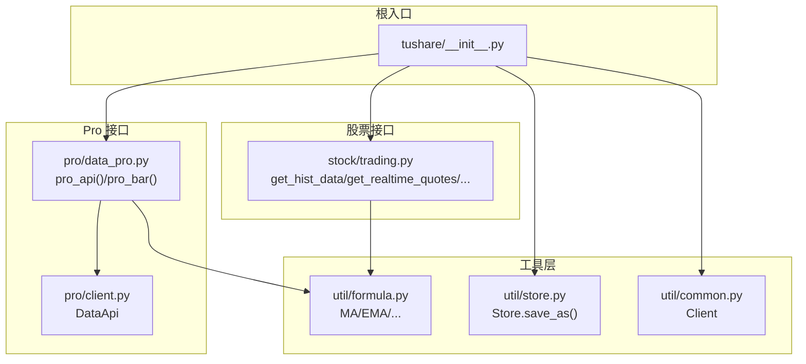
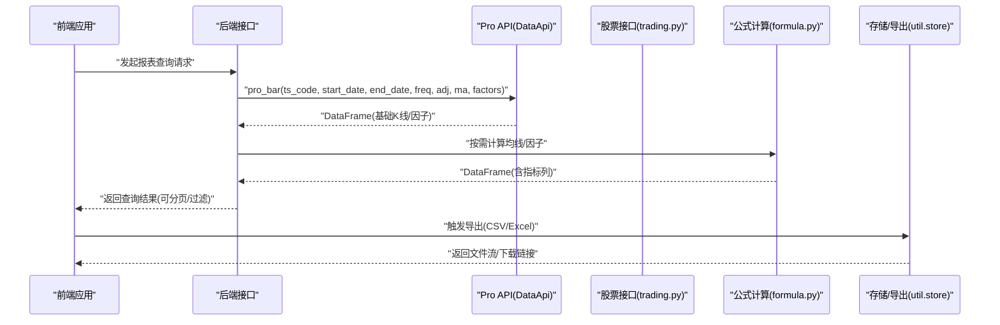
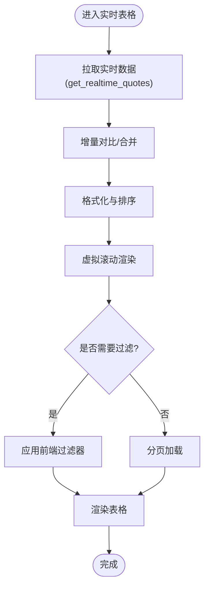
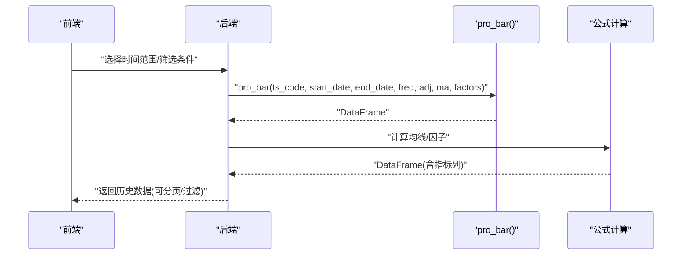
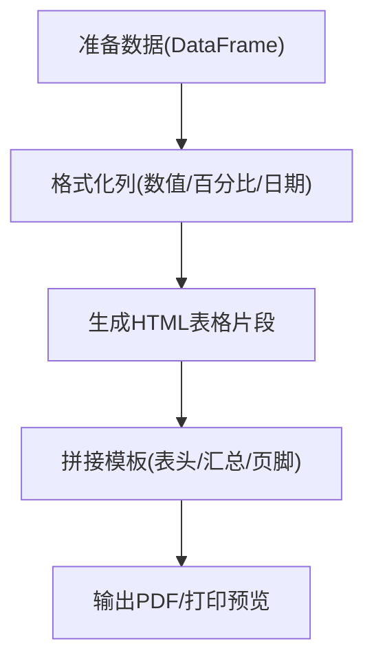
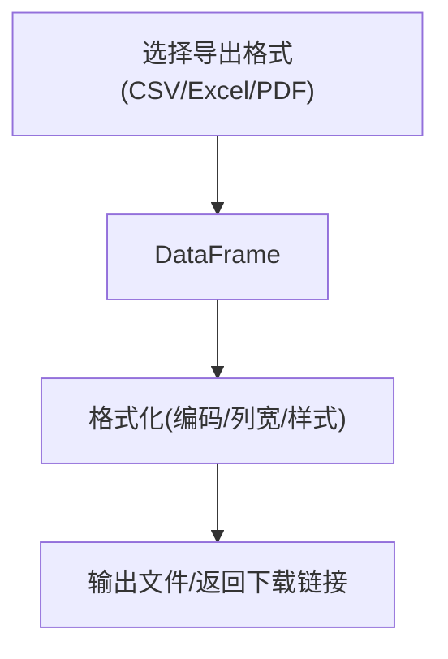
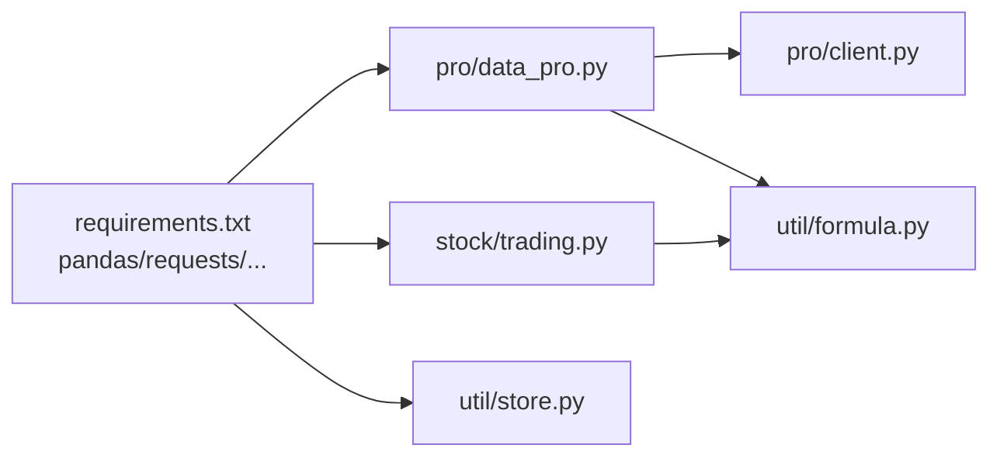

# 统计报表

<cite>
**本文引用的文件**
- [README.md](file://README.md)
- [__init__.py](file://tushare/__init__.py)
- [requirements.txt](file://requirements.txt)
- [common.py](file://tushare/util/common.py)
- [store.py](file://tushare/util/store.py)
- [formula.py](file://tushare/util/formula.py)
- [client.py](file://tushare/pro/client.py)
- [data_pro.py](file://tushare/pro/data_pro.py)
- [trading.py](file://tushare/stock/trading.py)
</cite>

## 目录
1. [简介](#简介)
2. [项目结构](#项目结构)
3. [核心组件](#核心组件)
4. [架构总览](#架构总览)
5. [详细组件分析](#详细组件分析)
6. [依赖关系分析](#依赖关系分析)
7. [性能考量](#性能考量)
8. [故障排查指南](#故障排查指南)
9. [结论](#结论)
10. [附录](#附录)

## 简介
本技术文档围绕基于 TuShare 的统计报表能力进行系统化梳理，聚焦于以下目标：
- 实时数据表格：数据刷新机制、表格渲染优化、分页加载、数据过滤
- 历史数据查询：时间范围选择、筛选条件、结果展示、查询历史记录
- 报表生成：模板设计、数据填充算法、格式化输出、打印预览
- 数据导出：CSV 导出、Excel 格式、PDF 生成、批量导出
- 前端实现思路与后端数据处理逻辑结合，帮助开发者构建完善的统计报表系统

说明：仓库中未发现直接的前端页面或报表渲染代码，因此本文件以“前端实现思路 + 后端数据处理逻辑”的方式给出可落地的实现建议与参考路径。

## 项目结构
该仓库采用按领域/模块划分的组织方式，核心与统计报表相关的能力主要分布在如下模块：
- pro 接口层：提供统一的 Pro API 认证与数据查询封装
- stock 接口层：提供历史行情、实时行情、复权数据等基础数据接口
- util 工具层：提供公式计算、数据存储、通用网络客户端等支撑能力
- 根级入口：聚合导出常用接口，便于上层业务按需调用

图表来源
- [__init__.py:11-140](file://tushare/__init__.py#L11-L140)
- [data_pro.py:21-158](file://tushare/pro/data_pro.py#L21-L158)
- [client.py:17-52](file://tushare/pro/client.py#L17-L52)
- [trading.py:32-800](file://tushare/stock/trading.py#L32-L800)
- [formula.py:1-262](file://tushare/util/formula.py#L1-L262)
- [store.py:14-44](file://tushare/util/store.py#L14-L44)
- [common.py:18-86](file://tushare/util/common.py#L18-L86)

章节来源
- [__init__.py:11-140](file://tushare/__init__.py#L11-L140)
- [README.md:1-411](file://README.md#L1-L411)

## 核心组件
- Pro API 封装：提供统一的认证与查询接口，支持多资产类别（股票、指数、期货、期权、基金、数字货币）与多周期（日/周/月/季/年、分钟级）
- 历史与实时行情：提供历史 K 线、分笔、实时报价等基础数据，支持复权与均线扩展
- 公式计算：提供常用技术指标（MA、EMA、MACD、KDJ、布林带等），便于报表中直接填充指标列
- 存储与导出：提供 CSV/Excel 保存能力，为报表导出提供基础

章节来源
- [data_pro.py:21-158](file://tushare/pro/data_pro.py#L21-L158)
- [trading.py:32-800](file://tushare/stock/trading.py#L32-L800)
- [formula.py:1-262](file://tushare/util/formula.py#L1-L262)
- [store.py:14-44](file://tushare/util/store.py#L14-L44)

## 架构总览
下图展示了“前端请求 -> 后端接口 -> 数据处理 -> 报表生成/导出”的整体流程：

图表来源
- [data_pro.py:21-158](file://tushare/pro/data_pro.py#L21-L158)
- [client.py:17-52](file://tushare/pro/client.py#L17-L52)
- [trading.py:32-800](file://tushare/stock/trading.py#L32-L800)
- [formula.py:1-262](file://tushare/util/formula.py#L1-L262)
- [store.py:14-44](file://tushare/util/store.py#L14-L44)

## 详细组件分析

### 实时数据表格（实时行情与分页/过滤）
- 数据来源
  - 实时行情：通过实时接口获取最新快照，适合构建“实时数据表格”
  - 分笔明细：用于补充逐笔成交信息，适合深度分析场景
- 刷新机制
  - 前端轮询策略：设置固定间隔（如 3-5 秒）拉取最新数据，避免过于频繁导致接口限流
  - 增量更新：对比上次返回的主键集合，仅更新变化行，减少渲染压力
- 表格渲染优化
  - 虚拟滚动：大数据量时启用虚拟滚动，仅渲染可视区域
  - 列宽自适应：根据内容长度自动调整列宽，避免文本截断
  - 单元格格式化：数字保留小数位、百分比显示、颜色标识涨跌
- 分页加载
  - 后端分页：按页大小与页码返回子集，前端只加载可见页
  - 前端分页：一次性拉取全量数据，前端侧分页展示，适合数据量较小场景
- 数据过滤
  - 前端过滤：支持按字段（名称、涨跌幅、成交量等）进行多条件筛选
  - 后端过滤：在接口层加入筛选参数，减少传输与渲染负担

图表来源
- [trading.py:324-394](file://tushare/stock/trading.py#L324-L394)

章节来源
- [trading.py:324-394](file://tushare/stock/trading.py#L324-L394)

### 历史数据查询（时间范围、筛选、结果展示、查询历史）
- 时间范围选择
  - 前端提供日期选择器，支持起止日期与快捷区间（近一周/一月/三月/一年）
  - 后端校验日期合法性与区间上限，避免超大范围请求
- 筛选条件
  - 复权类型：前复权/后复权/不复权
  - 周期频率：日/周/月/季/年、分钟级
  - 技术指标：可选添加均线/换手率/量比等因子列
- 查询结果展示
  - 表格列包含：日期、开盘/最高/最低/收盘、成交量、涨跌幅、均线等
  - 支持列隐藏/排序/拖拽调整顺序
- 查询历史记录
  - 前端缓存最近若干次查询条件，支持一键重放
  - 后端可记录查询日志（脱敏后的参数），便于审计与回溯

图表来源
- [data_pro.py:34-134](file://tushare/pro/data_pro.py#L34-L134)
- [formula.py:12-13](file://tushare/util/formula.py#L12-L13)

章节来源
- [data_pro.py:34-134](file://tushare/pro/data_pro.py#L34-L134)
- [formula.py:12-13](file://tushare/util/formula.py#L12-L13)

### 报表生成（模板设计、数据填充、格式化输出、打印预览）
- 模板设计
  - 使用 HTML/CSS 模板，定义表头、数据区、汇总区、页脚
  - 支持多工作表（不同指标组合）与多资产类别
- 数据填充
  - 将 DataFrame 转换为 HTML 表格片段，或导出为 Excel/CSV
  - 对数值列进行千分位、小数位、百分比等格式化
- 格式化输出
  - 表头加粗、居中；奇偶行着色；涨跌列使用颜色标识
  - 关键指标列添加合计/平均值行
- 打印预览
  - 提供打印样式（去除背景、调整边距、分页符）
  - 支持横向/纵向布局切换

图表来源
- [store.py:24-44](file://tushare/util/store.py#L24-L44)

章节来源
- [store.py:24-44](file://tushare/util/store.py#L24-L44)

### 数据导出（CSV/Excel/PDF/批量导出）
- CSV 导出
  - 使用存储类的保存方法，将 DataFrame 写入 CSV 文件
  - 注意编码（UTF-8/GB18030）与分隔符（逗号/分号）
- Excel 导出
  - 使用 ExcelWriter 输出多工作表（日线、周线、指标等）
  - 设置列宽、冻结窗格、条件格式
- PDF 生成
  - 将 HTML 表格转换为 PDF（如使用 WeasyPrint 或 pdfkit）
  - 适配 A4 页面尺寸与页眉页脚
- 批量导出
  - 支持多股票/多周期/多指标组合的批量导出
  - 后台任务队列异步生成，完成后通知下载

图表来源
- [store.py:24-44](file://tushare/util/store.py#L24-L44)

章节来源
- [store.py:24-44](file://tushare/util/store.py#L24-L44)

## 依赖关系分析
- 外部依赖
  - pandas：数据结构与计算核心
  - requests/simplejson/lxml/beautifulsoup4：HTTP 请求与解析
- 内部依赖
  - pro/data_pro.py 依赖 pro/client.py 进行认证与查询
  - stock/trading.py 提供历史/实时数据，可被报表层复用
  - util/formula.py 提供技术指标计算，支撑报表中的指标列
  - util/store.py 提供 CSV/Excel 保存能力

图表来源
- [requirements.txt:1-6](file://requirements.txt#L1-L6)
- [data_pro.py:1-158](file://tushare/pro/data_pro.py#L1-L158)
- [client.py:1-52](file://tushare/pro/client.py#L1-L52)
- [trading.py:1-800](file://tushare/stock/trading.py#L1-L800)
- [formula.py:1-262](file://tushare/util/formula.py#L1-L262)
- [store.py:1-44](file://tushare/util/store.py#L1-L44)

章节来源
- [requirements.txt:1-6](file://requirements.txt#L1-L6)

## 性能考量
- 网络请求
  - 合理设置超时与重试次数，避免阻塞主线程
  - 对高频查询实施节流/去抖，降低接口压力
- 数据处理
  - 在服务端进行必要的聚合与裁剪，减少前端传输与渲染成本
  - 对大表采用分页/懒加载策略
- 渲染优化
  - 使用虚拟滚动与列宽自适应，避免 DOM 过多导致卡顿
  - 对热点数据建立内存缓存，减少重复计算
- 存储与导出
  - 导出任务异步化，支持断点续传与并发控制
  - 对大文件采用流式写入，避免内存峰值

## 故障排查指南
- 认证失败
  - 检查 Token 是否正确设置与有效
  - 确认网络可达性与超时配置
- 查询异常
  - 校验参数合法性（时间范围、周期、资产类型）
  - 查看接口返回状态码与错误信息
- 数据缺失
  - 确认目标日期是否为交易日
  - 检查复权因子与均线计算是否正确
- 导出失败
  - 检查文件路径权限与磁盘空间
  - 确认编码与分隔符设置是否符合预期

章节来源
- [client.py:32-48](file://tushare/pro/client.py#L32-L48)
- [data_pro.py:135-140](file://tushare/pro/data_pro.py#L135-L140)
- [store.py:24-44](file://tushare/util/store.py#L24-L44)

## 结论
本仓库提供了构建统计报表系统的坚实基础：统一的 Pro API、丰富的历史与实时数据接口、完善的技术指标计算与导出能力。结合本文提出的前端实现思路与后端处理逻辑，开发者可以快速搭建具备实时刷新、历史查询、报表生成与多格式导出的完整统计报表系统。

## 附录
- 快速开始
  - 安装依赖：参见依赖清单
  - 初始化 Pro API：设置 Token 并初始化客户端
  - 获取数据：调用历史/实时接口，按需计算指标
  - 导出报表：将结果保存为 CSV/Excel/PDF

章节来源
- [README.md:30-42](file://README.md#L30-L42)
- [requirements.txt:1-6](file://requirements.txt#L1-L6)
- [client.py:22-31](file://tushare/pro/client.py#L22-L31)
- [data_pro.py:21-32](file://tushare/pro/data_pro.py#L21-L32)