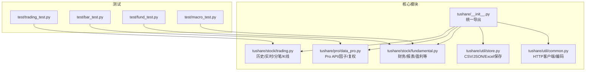
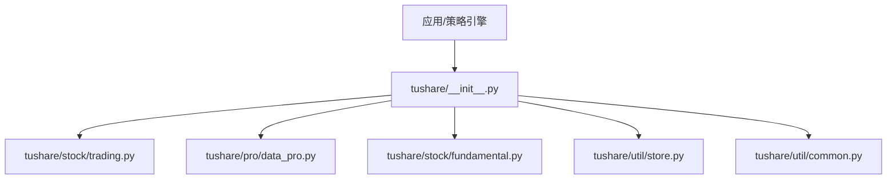
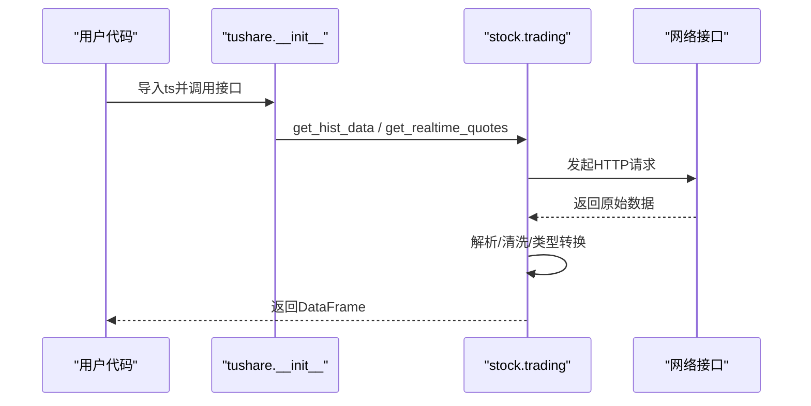
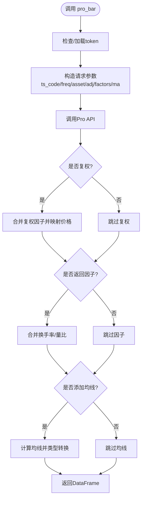
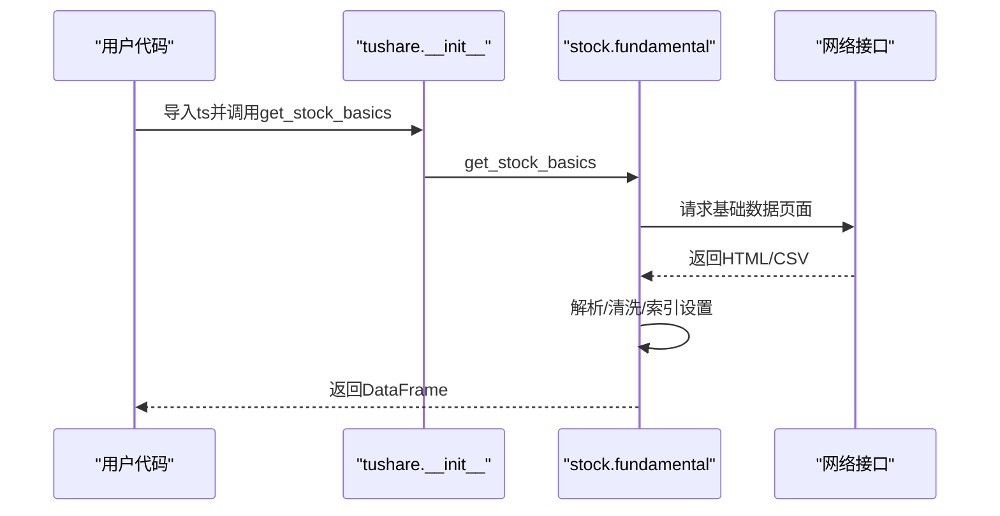
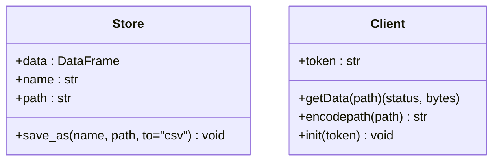
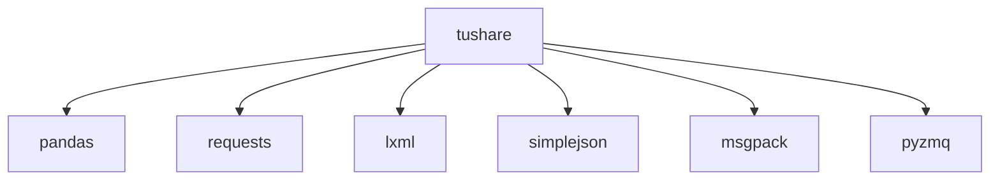

# 实际应用案例

<cite>
**本文引用的文件**
- [README.md](file://README.md)
- [setup.py](file://setup.py)
- [requirements.txt](file://requirements.txt)
- [tushare/__init__.py](file://tushare/__init__.py)
- [tushare/pro/data_pro.py](file://tushare/pro/data_pro.py)
- [tushare/stock/trading.py](file://tushare/stock/trading.py)
- [tushare/stock/fundamental.py](file://tushare/stock/fundamental.py)
- [tushare/util/store.py](file://tushare/util/store.py)
- [tushare/util/common.py](file://tushare/util/common.py)
- [test/trading_test.py](file://test/trading_test.py)
- [test/bar_test.py](file://test/bar_test.py)
- [test/fund_test.py](file://test/fund_test.py)
- [test/macro_test.py](file://test/macro_test.py)
</cite>

## 目录
1. [简介](#简介)
2. [项目结构](#项目结构)
3. [核心组件](#核心组件)
4. [架构总览](#架构总览)
5. [详细组件分析](#详细组件分析)
6. [依赖分析](#依赖分析)
7. [性能考量](#性能考量)
8. [故障排查指南](#故障排查指南)
9. [结论](#结论)
10. [附录](#附录)

## 简介
本文件面向量化投资与金融数据应用开发者，基于TuShare仓库提供的接口与工具，系统化梳理从“数据获取—清洗加工—存储—回测—风控—监控—可视化”的完整落地路径，并给出可直接参考的代码片段路径与最佳实践建议。内容涵盖：
- 数据获取最佳实践：历史K线、实时行情、分笔、复权、因子扩展等
- 回测框架集成：以pandas为基础的策略回测流程
- 风险控制：基于阈值与风控指标的自动化拦截
- 实时监控：订阅与轮询、异常检测、报警机制
- 可视化集成：Matplotlib/Plotly/交互式仪表板思路
- 性能优化与并发：重试、限流、缓存、批处理
- 不同场景模板：日频策略、高频事件驱动、宏观因子研究

## 项目结构
TuShare采用按领域划分的模块化组织方式，核心入口通过包级导出统一对外暴露。主要目录与职责如下：
- tushare/stock：交易行情、复权、K线、分笔、指数、实时行情等
- tushare/pro：Pro版API封装（token、bar、因子等）
- tushare/util：通用工具（存储、日期、公式、连接等）
- tushare/fund：财务与基本面数据接口
- test：单元测试样例，便于理解接口用法与边界条件

**图示来源**
- [tushare/__init__.py:11-140](file://tushare/__init__.py#L11-L140)
- [tushare/stock/trading.py:32-800](file://tushare/stock/trading.py#L32-L800)
- [tushare/pro/data_pro.py:21-158](file://tushare/pro/data_pro.py#L21-L158)
- [tushare/stock/fundamental.py:22-200](file://tushare/stock/fundamental.py#L22-L200)
- [tushare/util/store.py:14-44](file://tushare/util/store.py#L14-L44)
- [tushare/util/common.py:18-86](file://tushare/util/common.py#L18-L86)
- [test/trading_test.py:18-43](file://test/trading_test.py#L18-L43)
- [test/bar_test.py:16-23](file://test/bar_test.py#L16-L23)
- [test/fund_test.py:15-43](file://test/fund_test.py#L15-L43)
- [test/macro_test.py:11-50](file://test/macro_test.py#L11-L50)

**章节来源**
- [README.md:43-188](file://README.md#L43-L188)
- [setup.py:77-100](file://setup.py#L77-L100)
- [requirements.txt:1-6](file://requirements.txt#L1-L6)

## 核心组件
- 历史与实时行情：提供日线、分钟线、指数、实时快照等接口，适合回测与信号生成
- Pro版Bar与因子：支持多周期、复权、换手率/量比等因子拼接，适配高频与因子研究
- 财务与基本面：提供基础财务表与关键指标，支撑因子工程与选股
- 存储工具：统一DataFrame落盘为CSV/JSON/Excel，便于离线分析与归档
- 通用HTTP客户端：封装编码与鉴权，便于扩展外部服务对接

**章节来源**
- [tushare/stock/trading.py:32-800](file://tushare/stock/trading.py#L32-L800)
- [tushare/pro/data_pro.py:21-158](file://tushare/pro/data_pro.py#L21-L158)
- [tushare/stock/fundamental.py:22-200](file://tushare/stock/fundamental.py#L22-L200)
- [tushare/util/store.py:14-44](file://tushare/util/store.py#L14-L44)
- [tushare/util/common.py:18-86](file://tushare/util/common.py#L18-L86)

## 架构总览
TuShare通过包级导出统一对外暴露，内部按功能域拆分模块，形成清晰的“接口层—业务层—工具层”分层。Pro版API与传统接口并存，既满足入门需求，也支持专业研究与生产环境。

**图示来源**
- [tushare/__init__.py:11-140](file://tushare/__init__.py#L11-L140)

## 详细组件分析

### 历史与实时行情组件（trading）
- 历史K线：支持日/周/月/分钟线，自动清洗与类型转换，支持区间过滤
- 实时行情：批量获取多标的快照，字段丰富，适合信号触发
- 分笔与大单：支持当日分笔明细与大单追踪
- 复权与K线重构：提供前复权/后复权与统一K线格式

**图示来源**
- [tushare/__init__.py:11-18](file://tushare/__init__.py#L11-L18)
- [tushare/stock/trading.py:32-100](file://tushare/stock/trading.py#L32-L100)
- [tushare/stock/trading.py:324-394](file://tushare/stock/trading.py#L324-L394)
- [tushare/stock/trading.py:135-187](file://tushare/stock/trading.py#L135-L187)

**章节来源**
- [tushare/stock/trading.py:32-800](file://tushare/stock/trading.py#L32-L800)
- [test/trading_test.py:18-43](file://test/trading_test.py#L18-L43)

### Pro版Bar与因子组件（pro.data_pro）
- 初始化：支持持久token与临时token两种模式
- Bar数据：统一支持股票/指数/期货/基金/数字货币等多资产多周期
- 复权：内置前复权/后复权计算与合并
- 因子：可选返回换手率/量比等常用因子
- 均线：支持多周期均线叠加

**图示来源**
- [tushare/pro/data_pro.py:21-158](file://tushare/pro/data_pro.py#L21-L158)

**章节来源**
- [tushare/pro/data_pro.py:21-158](file://tushare/pro/data_pro.py#L21-L158)
- [test/bar_test.py:16-23](file://test/bar_test.py#L16-L23)

### 财务与基本面组件（stock.fundamental）
- 基础资料：公司基本情况（总股本、市盈率、市净率、上市日期等）
- 报表与盈利：利润表、资产负债表、现金流等关键指标
- 页面解析与分页：基于HTML解析与分页逻辑

**图示来源**
- [tushare/__init__.py:23-27](file://tushare/__init__.py#L23-L27)
- [tushare/stock/fundamental.py:22-59](file://tushare/stock/fundamental.py#L22-L59)

**章节来源**
- [tushare/stock/fundamental.py:22-200](file://tushare/stock/fundamental.py#L22-L200)
- [test/fund_test.py:15-43](file://test/fund_test.py#L15-L43)

### 存储与通用工具（util.store/common）
- Store类：统一保存DataFrame为CSV/JSON/Excel，支持路径与命名规范
- Client类：封装HTTP连接、URL编码与鉴权头，便于扩展外部数据源

**图示来源**
- [tushare/util/store.py:14-44](file://tushare/util/store.py#L14-L44)
- [tushare/util/common.py:18-86](file://tushare/util/common.py#L18-L86)

**章节来源**
- [tushare/util/store.py:14-44](file://tushare/util/store.py#L14-L44)
- [tushare/util/common.py:18-86](file://tushare/util/common.py#L18-L86)

## 依赖分析
- 安装依赖：pandas、requests、lxml、simplejson、msgpack、pyzmq等
- 运行时依赖：pandas作为数据结构核心，requests负责HTTP请求，lxml/BeautifulSoup用于网页解析

**图示来源**
- [setup.py:65-74](file://setup.py#L65-L74)
- [requirements.txt:1-6](file://requirements.txt#L1-L6)

**章节来源**
- [setup.py:65-74](file://setup.py#L65-L74)
- [requirements.txt:1-6](file://requirements.txt#L1-L6)

## 性能考量
- 重试与退避：接口普遍支持retry_count与pause参数，避免瞬时网络抖动导致失败
- 批量与分页：历史数据常采用分页或分季度抓取，注意控制并发与速率
- 数据类型与索引：统一转换为数值类型并设置索引，有利于后续向量化运算
- 复权与因子：在Pro版中可一次性合并复权因子与常用因子，减少二次处理成本
- 存储与压缩：优先使用高效格式（如Parquet），或启用压缩选项，降低IO成本
- 缓存策略：对静态/低频数据建立本地缓存，结合ETag/Last-Modified进行增量更新
- 并发与限流：使用线程池/进程池拉取多标的，配合令牌桶/漏桶限流，避免触发风控

[本节为通用指导，无需列出具体文件来源]

## 故障排查指南
- 网络错误：检查retry_count与pause配置，确认代理/防火墙设置
- 解析异常：关注HTML结构变化导致的解析失败，必要时切换数据源或升级库版本
- 数据为空：确认时间区间、代码格式、节假日与交易日设置
- 权限与Token：Pro版需正确设置token，避免401/403
- 字段缺失：不同接口字段存在差异，注意兼容性处理

**章节来源**
- [tushare/stock/trading.py:67-100](file://tushare/stock/trading.py#L67-L100)
- [tushare/pro/data_pro.py:135-140](file://tushare/pro/data_pro.py#L135-L140)

## 结论
TuShare提供了从基础行情到Pro版因子、从财务数据到通用工具的完整能力矩阵。结合本文的最佳实践与流程图，可在保证稳定性的同时，快速搭建从数据获取到分析决策的全链路方案，并在此基础上扩展实时监控与可视化能力。

[本节为总结性内容，无需列出具体文件来源]

## 附录

### 量化策略完整实现案例（全流程模板）
- 数据获取
  - 日线/分钟线：参考 [tushare/stock/trading.py:32-100](file://tushare/stock/trading.py#L32-L100) 与 [tushare/stock/trading.py:624-707](file://tushare/stock/trading.py#L624-L707)
  - Pro版Bar与因子：参考 [tushare/pro/data_pro.py:34-134](file://tushare/pro/data_pro.py#L34-L134)
- 清洗与特征工程
  - 复权与因子拼接：参考 [tushare/pro/data_pro.py:76-107](file://tushare/pro/data_pro.py#L76-L107)
  - K线特征：开盘/收盘/最高/最低/成交量等字段处理
- 回测框架集成
  - 使用pandas进行信号生成与收益计算，参考 [tushare/stock/trading.py:32-100](file://tushare/stock/trading.py#L32-L100)
- 风险控制
  - 设置最大回撤、换手率上限、个股/行业集中度阈值
- 实时监控
  - 订阅与轮询：参考 [tushare/stock/trading.py:324-394](file://tushare/stock/trading.py#L324-L394)
  - 异常检测：基于阈值与分布统计
  - 报警机制：邮件/IM推送
- 可视化
  - Matplotlib/Plotly：绘制K线、指标、收益曲线
  - 交互式仪表板：Dash/Streamlit（概念性方案）

### 实时监控系统构建方法
- 实时数据订阅/轮询：参考 [tushare/stock/trading.py:324-394](file://tushare/stock/trading.py#L324-L394)
- 异常检测：基于滑动窗口统计（均值/标准差/分位数）
- 报警机制：统一告警中心，支持分级与抑制

### 数据可视化集成方案
- Matplotlib：绘制K线、指标叠加、收益曲线
- Plotly：交互式K线图与多子图
- 仪表板：Dash/Streamlit，接入Pro版因子与回测结果

### 性能优化与并发处理
- 重试与退避：参考各接口的retry_count/pause参数
- 批处理与分页：按时间/代码分片并行拉取
- 缓存与归档：本地缓存+压缩存储
- 并发：线程池/进程池，配合限流器

### 不同应用场景模板
- 日频策略：以日线为主，结合财务因子
- 高频事件驱动：以实时/分笔为主，结合异常检测
- 宏观因子研究：结合宏观数据与行业/概念分类

**章节来源**
- [README.md:43-188](file://README.md#L43-L188)
- [tushare/stock/trading.py:32-800](file://tushare/stock/trading.py#L32-L800)
- [tushare/pro/data_pro.py:21-158](file://tushare/pro/data_pro.py#L21-L158)
- [tushare/stock/fundamental.py:22-200](file://tushare/stock/fundamental.py#L22-L200)
- [tushare/util/store.py:14-44](file://tushare/util/store.py#L14-L44)
- [tushare/util/common.py:18-86](file://tushare/util/common.py#L18-L86)
- [test/trading_test.py:18-43](file://test/trading_test.py#L18-L43)
- [test/bar_test.py:16-23](file://test/bar_test.py#L16-L23)
- [test/fund_test.py:15-43](file://test/fund_test.py#L15-L43)
- [test/macro_test.py:11-50](file://test/macro_test.py#L11-L50)