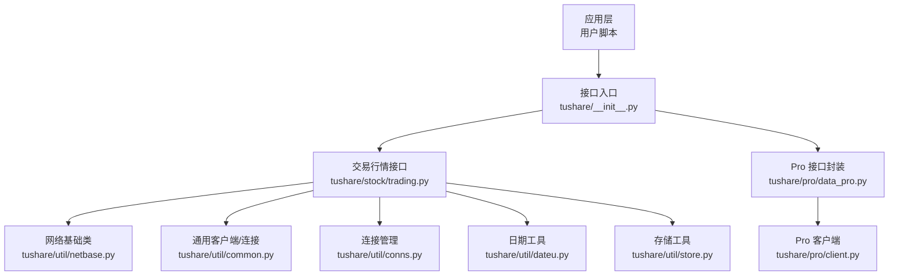
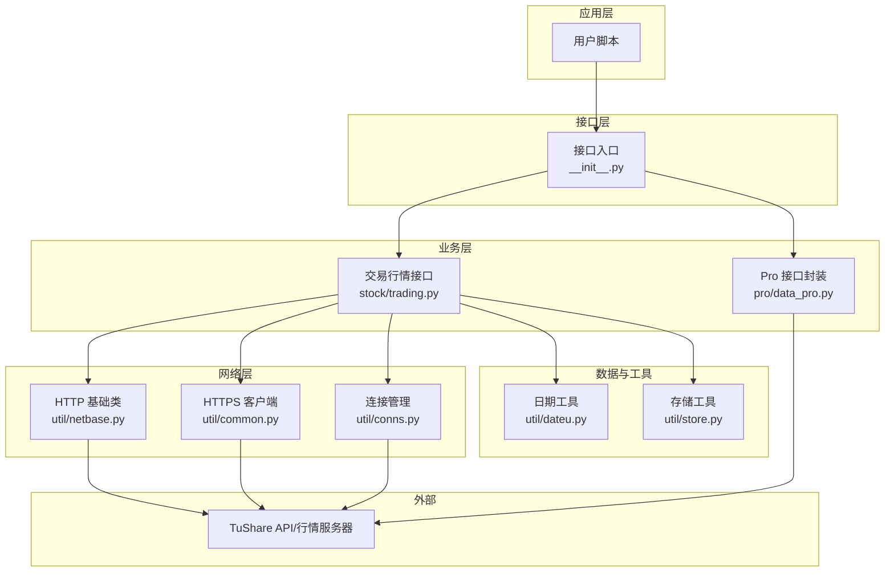
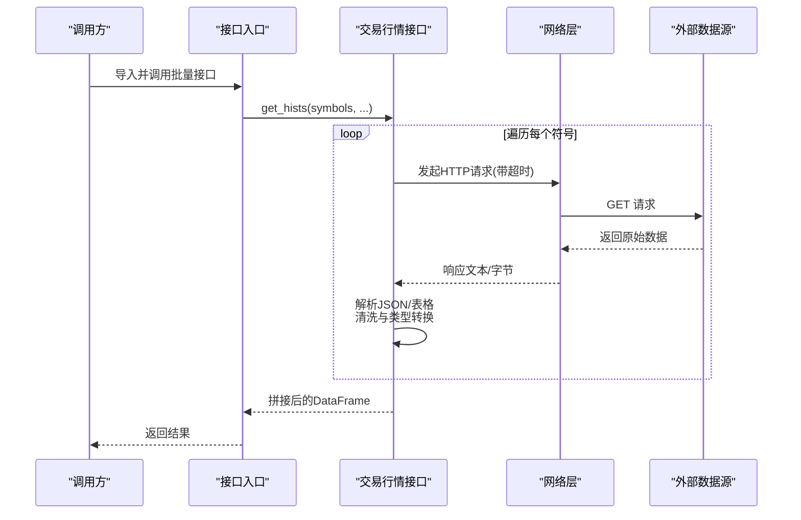
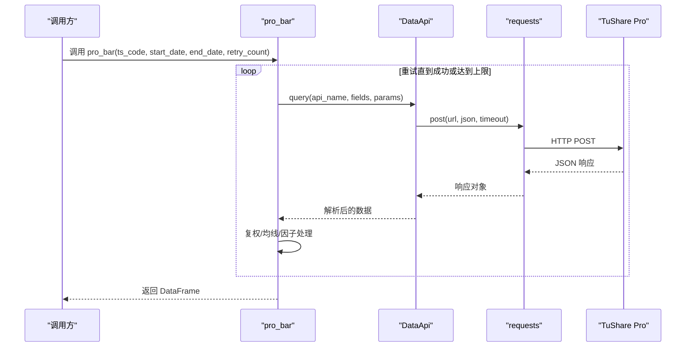
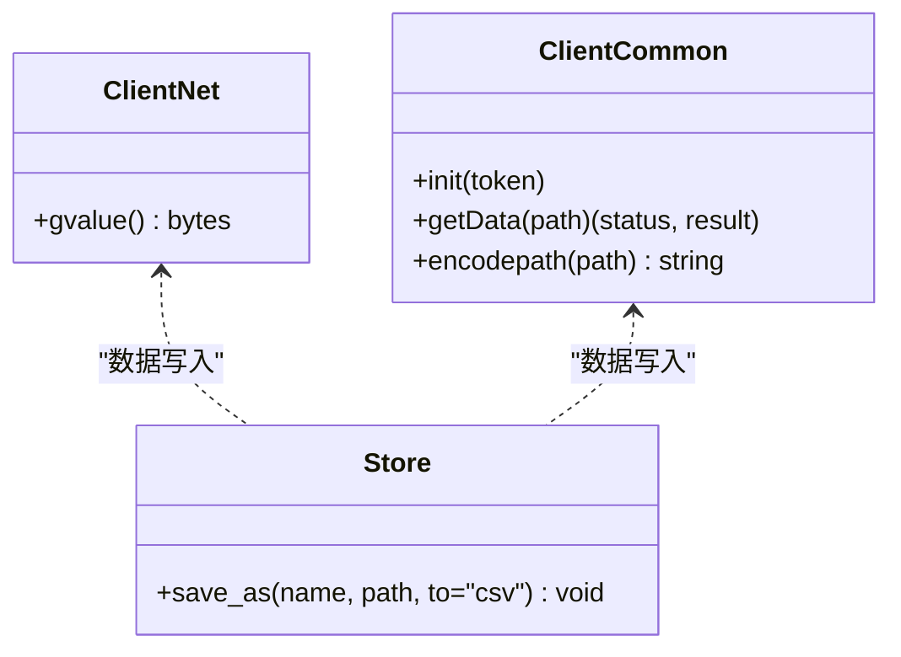
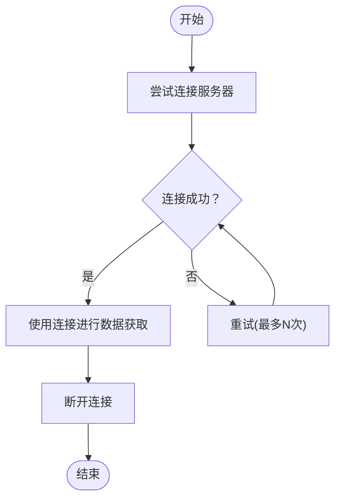
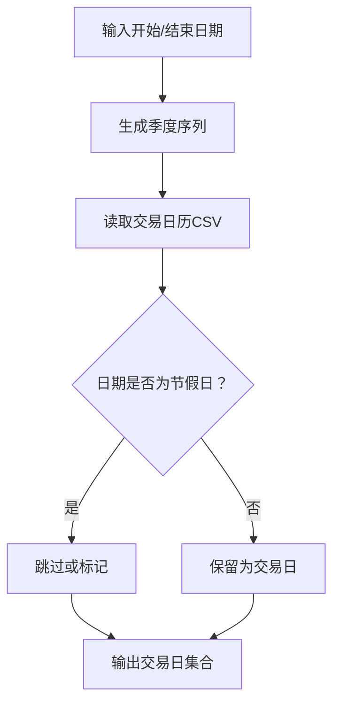
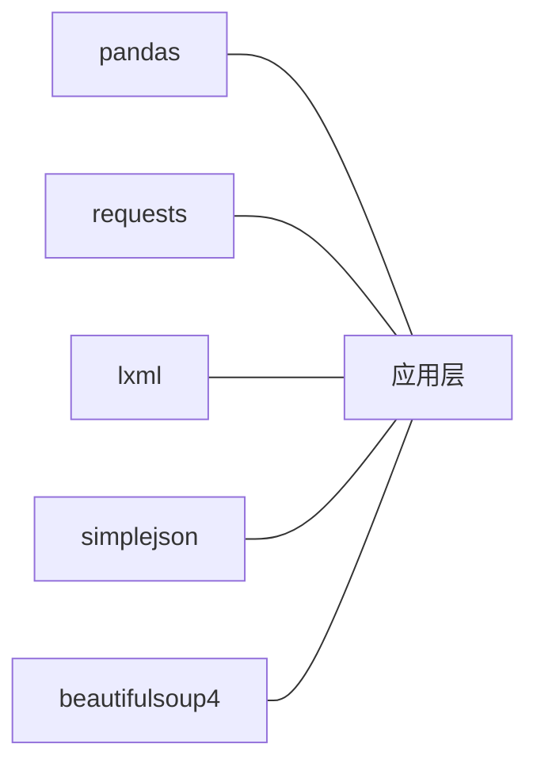

# 性能优化实践

<cite>
**本文引用的文件**
- [README.md](file://README.md)
- [tushare/__init__.py](file://tushare/__init__.py)
- [tushare/util/common.py](file://tushare/util/common.py)
- [tushare/util/netbase.py](file://tushare/util/netbase.py)
- [tushare/util/store.py](file://tushare/util/store.py)
- [tushare/pro/client.py](file://tushare/pro/client.py)
- [tushare/pro/data_pro.py](file://tushare/pro/data_pro.py)
- [tushare/util/conns.py](file://tushare/util/conns.py)
- [tushare/util/dateu.py](file://tushare/util/dateu.py)
- [tushare/stock/trading.py](file://tushare/stock/trading.py)
- [requirements.txt](file://requirements.txt)
</cite>

## 目录
1. [简介](#简介)
2. [项目结构](#项目结构)
3. [核心组件](#核心组件)
4. [架构总览](#架构总览)
5. [详细组件分析](#详细组件分析)
6. [依赖分析](#依赖分析)
7. [性能考量](#性能考量)
8. [故障排查指南](#故障排查指南)
9. [结论](#结论)
10. [附录](#附录)

## 简介
本文件面向使用 TuShare 进行大规模金融数据处理的工程团队，系统化总结性能优化实践，涵盖内存管理、并发处理、缓存策略、数据批量处理、网络请求优化、数据库存储优化、多级缓存架构、性能监控与分析以及完整的性能测试与基准测试方案。内容基于仓库现有实现进行提炼，并提供可操作的改进建议与最佳实践。

## 项目结构
TuShare 采用按领域/模块划分的组织方式，核心模块包括：
- 接口入口与导出：tushare/__init__.py
- 交易行情接口：tushare/stock/trading.py
- Pro 数据接口：tushare/pro/client.py、tushare/pro/data_pro.py
- 网络与存储工具：tushare/util/netbase.py、tushare/util/common.py、tushare/util/store.py
- 连接与会话：tushare/util/conns.py
- 日期与工具：tushare/util/dateu.py
- 依赖声明：requirements.txt

图表来源
- [tushare/__init__.py:1-140](file://tushare/__init__.py#L1-L140)
- [tushare/stock/trading.py:1-800](file://tushare/stock/trading.py#L1-L800)
- [tushare/pro/data_pro.py:1-158](file://tushare/pro/data_pro.py#L1-L158)
- [tushare/pro/client.py:1-52](file://tushare/pro/client.py#L1-L52)
- [tushare/util/netbase.py:1-29](file://tushare/util/netbase.py#L1-L29)
- [tushare/util/common.py:1-86](file://tushare/util/common.py#L1-L86)
- [tushare/util/conns.py:1-61](file://tushare/util/conns.py#L1-L61)
- [tushare/util/dateu.py:1-129](file://tushare/util/dateu.py#L1-L129)
- [tushare/util/store.py:1-44](file://tushare/util/store.py#L1-L44)

章节来源
- [README.md:1-411](file://README.md#L1-L411)
- [tushare/__init__.py:1-140](file://tushare/__init__.py#L1-L140)

## 核心组件
- 接口入口与导出：统一暴露常用接口，便于按需导入，减少不必要的模块加载。
- 交易行情接口：提供历史行情、实时行情、分笔、K线、复权等数据获取，内置重试与暂停控制。
- Pro 接口：通过 DataApi 封装请求，支持超时配置与 JSON 解析，返回 DataFrame。
- 网络与存储：提供基础 HTTP 请求封装、通用 HTTPS 客户端、CSV 存储能力。
- 连接管理：维护行情服务器连接，支持重试与断开。
- 日期工具：提供交易日历、节假日判断、时间差计算等辅助能力。
- 依赖声明：明确 pandas、requests、lxml、simplejson 等关键依赖版本要求。

章节来源
- [tushare/__init__.py:1-140](file://tushare/__init__.py#L1-L140)
- [tushare/stock/trading.py:1-800](file://tushare/stock/trading.py#L1-L800)
- [tushare/pro/client.py:1-52](file://tushare/pro/client.py#L1-L52)
- [tushare/pro/data_pro.py:1-158](file://tushare/pro/data_pro.py#L1-L158)
- [tushare/util/netbase.py:1-29](file://tushare/util/netbase.py#L1-L29)
- [tushare/util/common.py:1-86](file://tushare/util/common.py#L1-L86)
- [tushare/util/conns.py:1-61](file://tushare/util/conns.py#L1-L61)
- [tushare/util/dateu.py:1-129](file://tushare/util/dateu.py#L1-L129)
- [tushare/util/store.py:1-44](file://tushare/util/store.py#L1-L44)
- [requirements.txt:1-6](file://requirements.txt#L1-L6)

## 架构总览
TuShare 的数据流从用户脚本出发，经由接口入口进入具体业务模块，网络层负责与外部数据源交互，结果以 DataFrame 形式返回，可进一步落库或持久化。

图表来源
- [tushare/__init__.py:1-140](file://tushare/__init__.py#L1-L140)
- [tushare/stock/trading.py:1-800](file://tushare/stock/trading.py#L1-L800)
- [tushare/pro/data_pro.py:1-158](file://tushare/pro/data_pro.py#L1-L158)
- [tushare/util/netbase.py:1-29](file://tushare/util/netbase.py#L1-L29)
- [tushare/util/common.py:1-86](file://tushare/util/common.py#L1-L86)
- [tushare/util/conns.py:1-61](file://tushare/util/conns.py#L1-L61)
- [tushare/util/dateu.py:1-129](file://tushare/util/dateu.py#L1-L129)
- [tushare/util/store.py:1-44](file://tushare/util/store.py#L1-L44)

## 详细组件分析

### 交易行情接口（批量与重试）
- 批量获取：提供批量历史行情接口，内部遍历符号列表逐个抓取并拼接结果。
- 重试与暂停：每个接口均支持 retry_count 与 pause 参数，避免请求过于频繁导致限流或失败。
- 数据清洗：统一列名、类型转换、过滤无效值、排序与索引设置。
- 复权处理：支持前复权/后复权，涉及因子表合并与数值映射。

图表来源
- [tushare/stock/trading.py:750-767](file://tushare/stock/trading.py#L750-L767)
- [tushare/stock/trading.py:32-100](file://tushare/stock/trading.py#L32-L100)
- [tushare/stock/trading.py:135-187](file://tushare/stock/trading.py#L135-L187)
- [tushare/util/netbase.py:26-29](file://tushare/util/netbase.py#L26-L29)

章节来源
- [tushare/stock/trading.py:32-100](file://tushare/stock/trading.py#L32-L100)
- [tushare/stock/trading.py:135-187](file://tushare/stock/trading.py#L135-L187)
- [tushare/stock/trading.py:750-767](file://tushare/stock/trading.py#L750-L767)

### Pro 接口（超时与重试）
- 超时控制：DataApi 在构造时接收 timeout 参数，请求阶段传入 requests.post。
- 重试机制：pro_bar 对异常进行捕获并按 retry_count 重试，最终抛出错误。
- 数据帧构建：解析返回 JSON，提取字段与条目，构造 DataFrame 并进行复权/均线等后处理。

图表来源
- [tushare/pro/client.py:32-48](file://tushare/pro/client.py#L32-L48)
- [tushare/pro/data_pro.py:70-140](file://tushare/pro/data_pro.py#L70-L140)

章节来源
- [tushare/pro/client.py:22-48](file://tushare/pro/client.py#L22-L48)
- [tushare/pro/data_pro.py:40-140](file://tushare/pro/data_pro.py#L40-L140)

### 网络与存储工具
- HTTP 基础类：封装 Request、超时设置与 UA 设置，适合简单直连场景。
- 通用 HTTPS 客户端：支持路径编码、Authorization 头、状态码处理与字符集转换。
- 存储工具：提供 DataFrame 保存为 CSV 的能力，支持目录创建与文件路径拼接。

图表来源
- [tushare/util/netbase.py:9-29](file://tushare/util/netbase.py#L9-L29)
- [tushare/util/common.py:18-86](file://tushare/util/common.py#L18-L86)
- [tushare/util/store.py:14-44](file://tushare/util/store.py#L14-L44)

章节来源
- [tushare/util/netbase.py:1-29](file://tushare/util/netbase.py#L1-L29)
- [tushare/util/common.py:1-86](file://tushare/util/common.py#L1-L86)
- [tushare/util/store.py:1-44](file://tushare/util/store.py#L1-L44)

### 连接管理与会话
- 连接池与心跳：通过 pytdx 的 API 对象维持长连接，启用 heartbeat。
- 重试与断开：提供连接建立与断开的重试封装，失败时抛出网络错误提示。

图表来源
- [tushare/util/conns.py:14-35](file://tushare/util/conns.py#L14-L35)
- [tushare/util/conns.py:54-61](file://tushare/util/conns.py#L54-L61)

章节来源
- [tushare/util/conns.py:1-61](file://tushare/util/conns.py#L1-L61)

### 日期与工具
- 交易日历：读取本地 CSV 文件，提供 isOpen 字段判断节假日。
- 时间计算：支持年季拆分、日期差、随机字符串生成等辅助能力。

图表来源
- [tushare/util/dateu.py:78-99](file://tushare/util/dateu.py#L78-L99)
- [tushare/util/dateu.py:72-76](file://tushare/util/dateu.py#L72-L76)

章节来源
- [tushare/util/dateu.py:1-129](file://tushare/util/dateu.py#L1-L129)

## 依赖分析
- pandas：数据结构与 IO、类型转换、合并与重采样。
- requests：HTTP 客户端，支持超时与 JSON 解析。
- lxml：HTML/XML 解析，用于网页数据抽取。
- simplejson：高性能 JSON 解析，配合 requests 使用。
- bs4/beautifulsoup4：HTML 解析与表格抽取。

图表来源
- [requirements.txt:1-6](file://requirements.txt#L1-L6)

章节来源
- [requirements.txt:1-6](file://requirements.txt#L1-L6)

## 性能考量

### 内存管理
- 避免在循环中累积大型中间结果：批量接口内部使用 append 拼接，建议在上层控制批次大小，降低峰值内存占用。
- 及时释放资源：网络请求完成后尽快释放对象引用，必要时显式删除中间变量。
- 类型转换与列裁剪：仅保留必要列，将字符串列转换为 category 类型以节省内存。

章节来源
- [tushare/stock/trading.py:756-766](file://tushare/stock/trading.py#L756-L766)

### 并发处理
- 批量接口的串行循环：当前实现逐个符号请求，建议结合线程池/进程池对独立符号并行拉取，注意遵守目标站点速率限制与反爬策略。
- 重试与退避：在并发场景下，指数退避重试可降低雪崩风险。

章节来源
- [tushare/stock/trading.py:758-763](file://tushare/stock/trading.py#L758-L763)

### 缓存策略
- 内存缓存：对热点数据（如交易日历、因子表）进行内存缓存，设置 TTL 或 LRU。
- 磁盘缓存：利用 DataFrame 持久化为 CSV/Parquet，按日期/符号命名，支持增量更新。
- 分布式缓存：Redis/Memcached 存放高频查询结果，键设计包含维度（ts_code、freq、date_range）。

章节来源
- [tushare/util/store.py:24-44](file://tushare/util/store.py#L24-L44)
- [tushare/util/dateu.py:83-84](file://tushare/util/dateu.py#L83-L84)

### 数据批量处理最佳实践
- 分批获取：按日期区间或符号分组分批请求，避免单次请求过大。
- 异步处理：结合 aiohttp/aiostream 在 IO 密集场景提升吞吐。
- 数据压缩：保存 CSV 前进行数值压缩（如 float32/int32），或直接使用 Parquet 列式存储。

章节来源
- [tushare/pro/data_pro.py:70-140](file://tushare/pro/data_pro.py#L70-L140)

### 网络请求优化
- 连接池管理：requests.Session 复用 TCP 连接，减少握手开销。
- 超时设置：合理设置 connect/read 超时，避免阻塞。
- 重试机制：指数退避 + jitter，避免集中重试。
- 代理与限速：根据目标站点规则配置代理与 QPS。

章节来源
- [tushare/pro/client.py:22-30](file://tushare/pro/client.py#L22-L30)
- [tushare/util/netbase.py:26-29](file://tushare/util/netbase.py#L26-L29)

### 数据库存储优化
- 索引设计：按 ts_code、trade_date/frequency 等组合建立索引。
- 查询优化：使用分区表（按日期）与物化视图加速常见聚合。
- 批量插入：使用 pandas 的批量写入或数据库原生批量 API，减少往返。

章节来源
- [tushare/pro/data_pro.py:91-107](file://tushare/pro/data_pro.py#L91-L107)

### 多级缓存架构
- L1：进程内缓存（字典/WeakValueDictionary）
- L2：本地文件缓存（CSV/Parquet）
- L3：分布式缓存（Redis，键包含维度与校验和）

章节来源
- [tushare/util/store.py:24-44](file://tushare/util/store.py#L24-L44)

### 性能监控与分析
- 指标采集：请求耗时、重试次数、失败率、内存占用、CPU 使用率。
- 工具建议：cProfile、py-spy、psutil、Prometheus + Grafana。
- 基准测试：固定数据规模与环境，对比不同批次/并发/缓存策略下的吞吐与延迟。

章节来源
- [README.md:6-6](file://README.md#L6)

### 性能测试与基准测试方案
- 基准场景
  - 单接口：固定日期范围与单一符号，测量端到端耗时与内存峰值。
  - 批量接口：按符号数量递增，观察吞吐与内存变化。
  - 并发接口：线程/进程数从 1 增至 N，评估扩展性与稳定性。
- 指标定义
  - 响应时间（P50/P95/P99）、吞吐（条/秒）、内存（RSS/峰值）、错误率。
- 工具与脚本
  - pytest-benchmark、locust、自定义计时器与内存监控装饰器。

章节来源
- [tushare/stock/trading.py:750-767](file://tushare/stock/trading.py#L750-L767)
- [tushare/pro/data_pro.py:70-140](file://tushare/pro/data_pro.py#L70-L140)

## 故障排查指南
- 网络错误与超时
  - 现象：请求抛出网络异常或返回空数据。
  - 排查：检查超时设置、重试次数、目标站点可用性与限流策略。
- 数据为空
  - 现象：返回空 DataFrame 或长度为 0。
  - 排查：确认日期范围、符号有效性、目标接口是否支持该粒度。
- 复权因子缺失
  - 现象：复权后数据异常或因子列为空。
  - 排查：检查因子表获取逻辑与合并策略，确认日期对齐。
- 连接失败
  - 现象：连接建立失败或断开异常。
  - 排查：检查服务器地址与端口、防火墙、重试次数与心跳配置。

章节来源
- [tushare/stock/trading.py:72-100](file://tushare/stock/trading.py#L72-L100)
- [tushare/pro/data_pro.py:135-140](file://tushare/pro/data_pro.py#L135-L140)
- [tushare/util/conns.py:14-35](file://tushare/util/conns.py#L14-L35)

## 结论
通过对 TuShare 现有实现的分析，我们总结了在大规模金融数据处理中的性能优化路径：以合理的重试与超时为基础，结合分批/并发策略、多级缓存与数据库索引优化，辅以完善的监控与基准测试体系，可在保证稳定性的同时显著提升吞吐与降低延迟。建议在生产环境中逐步引入这些实践，并持续迭代以适配不断变化的数据规模与外部约束。

## 附录
- 快速定位实现位置
  - 批量接口：[tushare/stock/trading.py:750-767](file://tushare/stock/trading.py#L750-L767)
  - Pro 接口：[tushare/pro/data_pro.py:40-140](file://tushare/pro/data_pro.py#L40-L140)
  - 网络基础：[tushare/util/netbase.py:26-29](file://tushare/util/netbase.py#L26-L29)
  - 通用 HTTPS 客户端：[tushare/util/common.py:68-86](file://tushare/util/common.py#L68-L86)
  - 存储工具：[tushare/util/store.py:24-44](file://tushare/util/store.py#L24-L44)
  - 连接管理：[tushare/util/conns.py:14-35](file://tushare/util/conns.py#L14-L35)
  - 日期工具：[tushare/util/dateu.py:83-99](file://tushare/util/dateu.py#L83-L99)