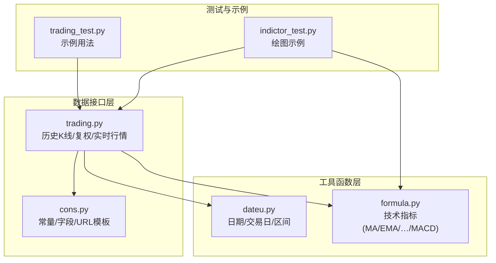
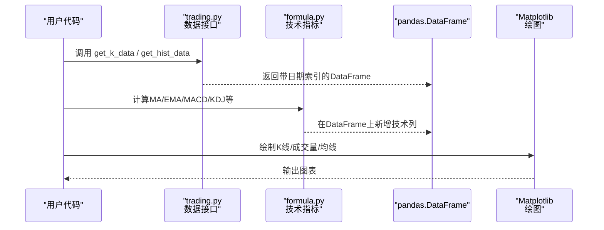
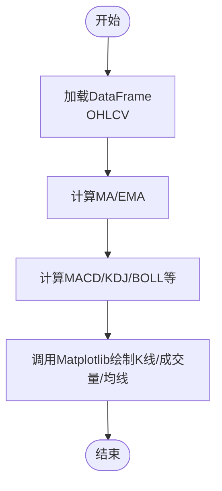
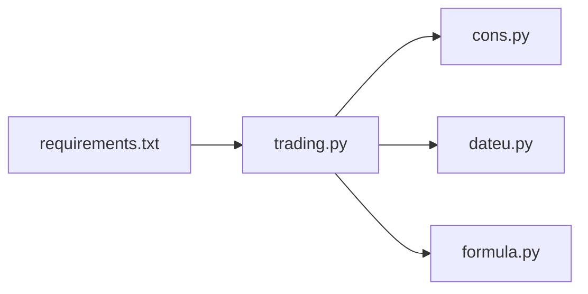

# Matplotlib集成

<cite>
**本文引用的文件**
- [README.md](file://README.md)
- [requirements.txt](file://requirements.txt)
- [setup.py](file://setup.py)
- [tushare/stock/trading.py](file://tushare/stock/trading.py)
- [tushare/stock/cons.py](file://tushare/stock/cons.py)
- [tushare/util/dateu.py](file://tushare/util/dateu.py)
- [tushare/util/formula.py](file://tushare/util/formula.py)
- [test/trading_test.py](file://test/trading_test.py)
- [test/indictor_test.py](file://test/indictor_test.py)
</cite>

## 目录
1. [简介](#简介)
2. [项目结构](#项目结构)
3. [核心组件](#核心组件)
4. [架构总览](#架构总览)
5. [详细组件分析](#详细组件分析)
6. [依赖关系分析](#依赖关系分析)
7. [性能考量](#性能考量)
8. [故障排查指南](#故障排查指南)
9. [结论](#结论)
10. [附录](#附录)

## 简介
本指南围绕“Matplotlib集成”主题，结合仓库中的数据获取与技术分析能力，系统讲解如何使用Matplotlib绘制股票价格图表（K线图、成交量图、移动平均线等），以及如何将pandas DataFrame与Matplotlib高效对接。内容涵盖数据预处理、图表样式设置、坐标轴配置、多子图布局、时间序列处理、常见问题排查与优化建议，并提供从数据获取到图表绘制的完整流程指引。

## 项目结构
该仓库以模块化方式组织，核心与绘图相关的能力主要集中在以下模块：
- 数据接口层：tushare/stock/trading.py 提供历史K线、实时行情、复权数据等接口，返回pandas DataFrame
- 常量与URL配置：tushare/stock/cons.py 定义K线类型、字段名、URL模板等
- 工具函数：tushare/util/dateu.py 提供日期工具；tushare/util/formula.py 提供技术指标计算（如MA、EMA、MACD等）
- 测试样例：test/trading_test.py、test/indictor_test.py 展示典型用法

**图表来源**
- [tushare/stock/trading.py](file://tushare/stock/trading.py)
- [tushare/stock/cons.py](file://tushare/stock/cons.py)
- [tushare/util/dateu.py](file://tushare/util/dateu.py)
- [tushare/util/formula.py](file://tushare/util/formula.py)
- [test/trading_test.py](file://test/trading_test.py)
- [test/indictor_test.py](file://test/indictor_test.py)

**章节来源**
- [README.md](file://README.md)
- [requirements.txt](file://requirements.txt)
- [setup.py](file://setup.py)

## 核心组件
- 数据接口与DataFrame输出
  - get_hist_data：获取日线/周线/月线历史行情，返回包含日期索引与OHLCV等列的DataFrame
  - get_k_data：统一K线接口，支持前复权/后复权，返回带日期索引的DataFrame
  - get_realtime_quotes：获取实时行情，返回包含多列的DataFrame
  - get_h_data：获取历史复权数据，返回带日期索引的DataFrame
- 技术指标计算
  - MA、EMA、SMA、MACD、KDJ、BOLL等，便于在DataFrame上直接扩展列
- 日期与交易日工具
  - 交易日历、节假日判断、日期区间构造等，支撑时间序列对齐与筛选

**章节来源**
- [tushare/stock/trading.py](file://tushare/stock/trading.py)
- [tushare/util/formula.py](file://tushare/util/formula.py)
- [tushare/util/dateu.py](file://tushare/util/dateu.py)

## 架构总览
下图展示了从数据获取到图表绘制的关键流程：数据接口返回DataFrame，技术指标模块在DataFrame上计算扩展列，Matplotlib负责渲染K线、成交量与均线等图形元素。

**图表来源**
- [tushare/stock/trading.py](file://tushare/stock/trading.py)
- [tushare/util/formula.py](file://tushare/util/formula.py)

## 详细组件分析

### 数据接口与DataFrame对接
- 接口职责
  - get_hist_data：按日/周/月/分钟级别返回OHLCV等列，日期作为索引，便于时间序列处理
  - get_k_data：统一K线入口，支持前复权/后复权，返回带日期索引的DataFrame
  - get_realtime_quotes：返回实时行情，可用于追加最新K线
  - get_h_data：返回复权后的OHLCV，便于长期趋势分析
- DataFrame特性
  - 日期索引：便于重采样、滚动窗口、对齐与切片
  - 字段命名：遵循cons.py中的列名定义，确保一致性
- 使用要点
  - 对于K线图，通常使用“date”作为x轴，OHLC列用于蜡烛实体与影线
  - 成交量使用独立子图，y轴与主图错位显示
  - 移动平均线可直接基于close列计算并叠加

**章节来源**
- [tushare/stock/trading.py](file://tushare/stock/trading.py)
- [tushare/stock/cons.py](file://tushare/stock/cons.py)

### 技术指标与均线叠加
- 指标计算
  - MA/EMA：滚动/指数加权平均，适合趋势跟踪
  - MACD：快慢线与柱状图，适合动量与背离分析
  - KDJ：随机震荡，适合超买超卖判断
  - BOLL：布林带，适合波动率与通道分析
- 在DataFrame上的应用
  - 将计算结果作为新列写回DataFrame，随后直接传入Matplotlib进行绘制
  - 注意缺失值处理与列名规范，避免绘图时出现异常

**图表来源**
- [tushare/util/formula.py](file://tushare/util/formula.py)

**章节来源**
- [tushare/util/formula.py](file://tushare/util/formula.py)

### 日期与时间序列处理
- 交易日与节假日
  - 通过交易日历与节假日判断，过滤非交易日，保证时间序列连续性
- 日期对齐与排序
  - DataFrame按日期升序/降序排列，确保绘图顺序正确
- 时间切片与重采样
  - 支持按周/月等频率重采样，生成周K/月K

**章节来源**
- [tushare/util/dateu.py](file://tushare/util/dateu.py)

### 图表样式与坐标轴配置
- K线图
  - 使用蜡烛图或线段绘制实体与影线，区分涨跌颜色
  - x轴使用日期索引，y轴为主图价格
- 成交量图
  - 使用柱状图叠加在主图下方，或独立子图显示
  - 颜色需与涨跌一致，提升可读性
- 坐标轴与标签
  - 设置x/y轴刻度、旋转角度、字体大小
  - 主副坐标轴用于不同量级的叠加显示
- 多子图布局
  - 主图（K线+均线）+ 子图（成交量/MACD/KDJ等）
  - 使用共享x轴，保持对齐与交互体验

[本节为通用绘图实践说明，不直接分析具体文件]

### 从数据获取到图表绘制的完整流程
- 步骤
  1) 获取数据：调用get_k_data或get_hist_data
  2) 数据预处理：排序、筛选、重采样、缺失值处理
  3) 技术指标：计算MA/EMA/MACD/KDJ/BOLL等
  4) 绘图：K线+成交量+均线，设置样式与坐标轴
  5) 导出：保存图片或在Jupyter中展示
- 示例参考
  - 测试用例展示了plot_all的调用方式，可作为绘图流程的参考路径

**章节来源**
- [test/indictor_test.py](file://test/indictor_test.py)
- [test/trading_test.py](file://test/trading_test.py)

## 依赖关系分析
- 外部依赖
  - pandas：数据结构与时间序列处理
  - requests/lxml/soup：网络请求与HTML解析
- 内部模块耦合
  - trading.py依赖cons.py的常量与URL模板
  - formula.py与dateu.py为trading.py提供指标与日期工具支持
- 潜在风险
  - 网络不稳定导致数据拉取失败
  - 复权因子与实时数据的时间戳差异导致对齐问题

**图表来源**
- [tushare/stock/trading.py](file://tushare/stock/trading.py)
- [tushare/stock/cons.py](file://tushare/stock/cons.py)
- [tushare/util/dateu.py](file://tushare/util/dateu.py)
- [tushare/util/formula.py](file://tushare/util/formula.py)
- [requirements.txt](file://requirements.txt)

**章节来源**
- [requirements.txt](file://requirements.txt)
- [setup.py](file://setup.py)

## 性能考量
- 数据规模
  - 大时间跨度数据建议分段拉取与缓存，避免重复网络请求
- 计算复杂度
  - 滚动窗口与指数加权平均的计算成本与窗口长度成正比，合理设置窗口
- 渲染效率
  - 大量点位时优先使用矢量图，必要时降低采样密度
- I/O与内存
  - 避免频繁读写磁盘，使用DataFrame就地修改减少副本

[本节提供通用指导，不直接分析具体文件]

## 故障排查指南
- 常见问题
  - 日期格式不一致：确保使用统一的日期索引与格式
  - 数据对齐：复权数据与实时数据可能存在时间戳差异，需统一到同一基准
  - 颜色搭配：涨跌颜色应清晰区分，避免混淆
  - 缺失值：滚动窗口起始阶段存在NaN，需在绘图前处理或忽略
- 定位方法
  - 检查DataFrame的列名与数据类型，确认与cons.py定义一致
  - 使用describe/head/tail观察数据分布，定位异常区间
  - 分步执行指标计算，逐步缩小问题范围

**章节来源**
- [tushare/stock/cons.py](file://tushare/stock/cons.py)
- [tushare/util/formula.py](file://tushare/util/formula.py)

## 结论
通过本仓库提供的数据接口与技术指标工具，可以高效完成从数据获取到图表绘制的全流程。结合pandas的DataFrame与Matplotlib的绘图能力，能够灵活实现K线图、成交量图与各类技术指标的可视化。建议在工程实践中注重数据对齐、样式一致性与性能优化，以获得稳定可靠的可视化效果。

## 附录
- 快速开始
  - 安装依赖：pip install -r requirements.txt
  - 获取数据：调用get_k_data或get_hist_data
  - 计算指标：使用formula.py中的函数
  - 绘制图表：将DataFrame传入Matplotlib进行渲染
- 参考示例
  - 测试用例展示了典型调用路径，可作为实现参考

**章节来源**
- [README.md](file://README.md)
- [requirements.txt](file://requirements.txt)
- [test/trading_test.py](file://test/trading_test.py)
- [test/indictor_test.py](file://test/indictor_test.py)