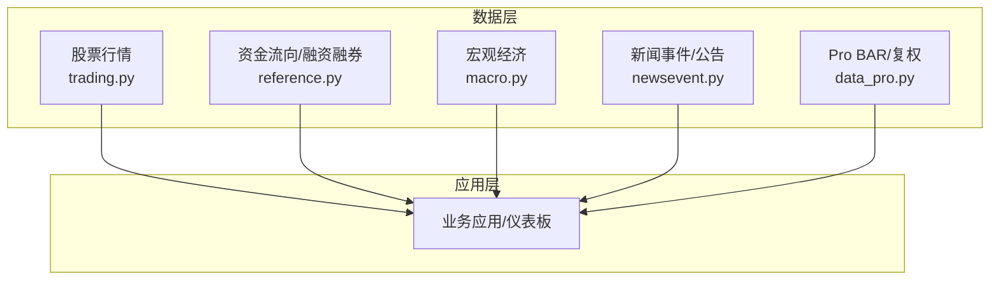
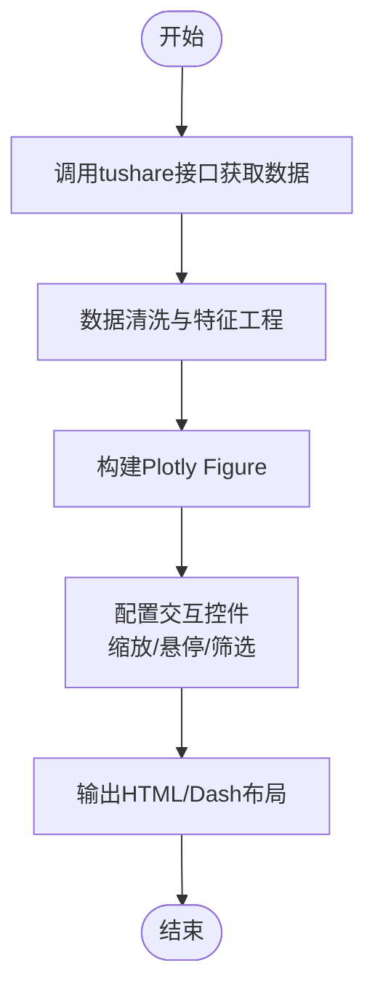
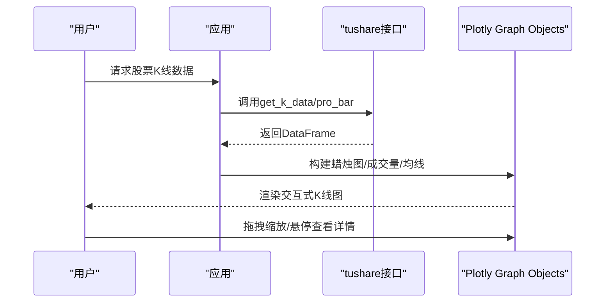
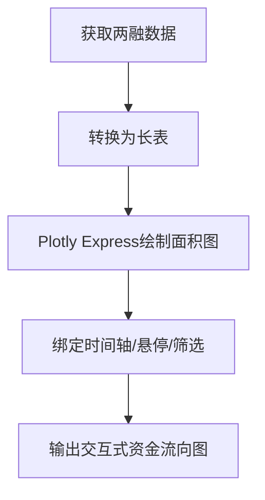
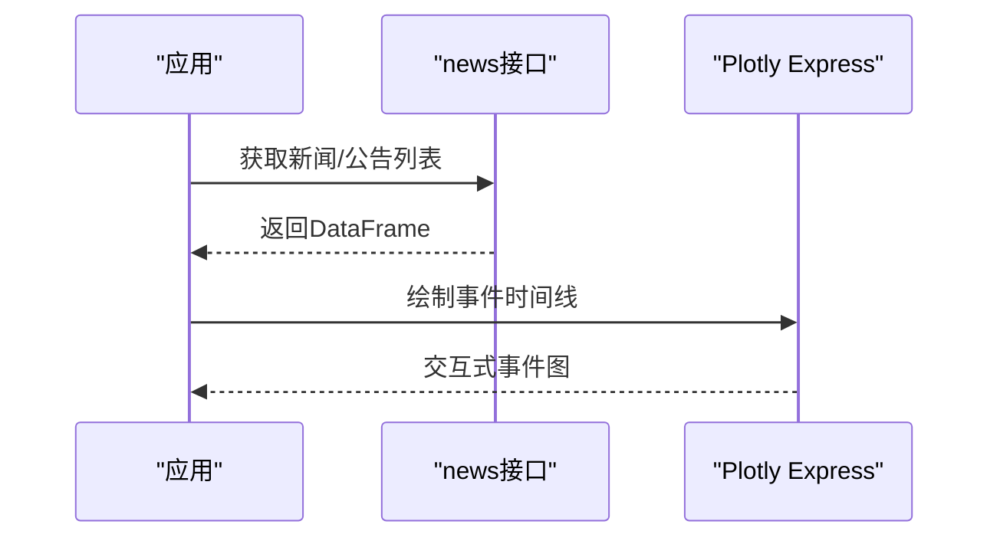
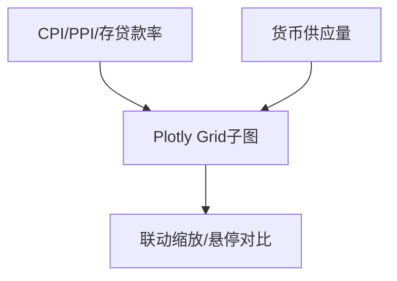
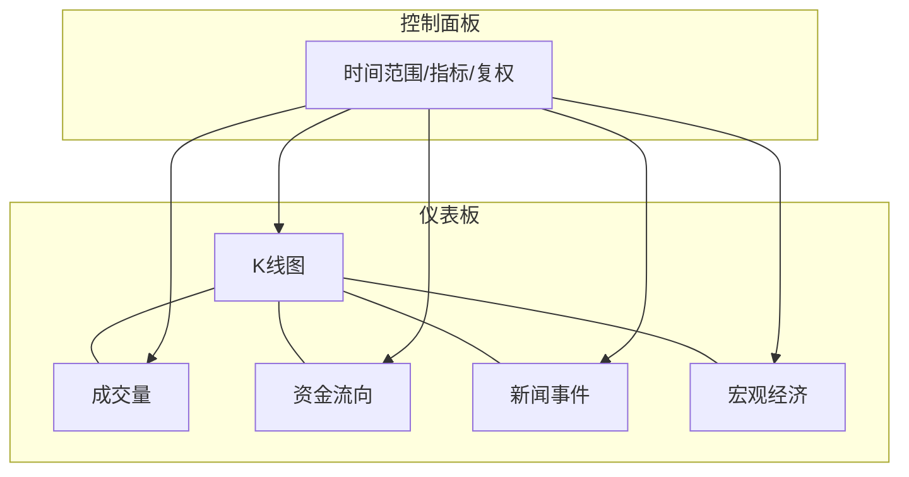
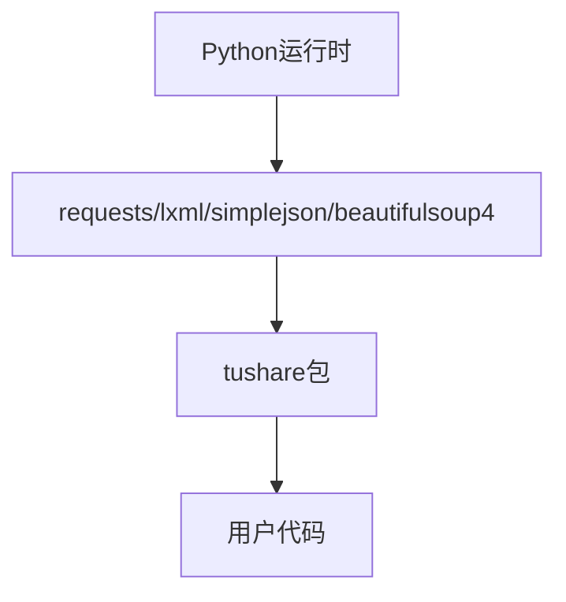

# Plotly交互式图表

<cite>
**本文引用的文件**
- [README.md](file://README.md)
- [requirements.txt](file://requirements.txt)
- [setup.py](file://setup.py)
- [tushare/__init__.py](file://tushare/__init__.py)
- [tushare/stock/trading.py](file://tushare/stock/trading.py)
- [tushare/stock/reference.py](file://tushare/stock/reference.py)
- [tushare/stock/macro.py](file://tushare/stock/macro.py)
- [tushare/stock/newsevent.py](file://tushare/stock/newsevent.py)
- [tushare/pro/data_pro.py](file://tushare/pro/data_pro.py)
- [tushare/util/common.py](file://tushare/util/common.py)
- [test/trading_test.py](file://test/trading_test.py)
</cite>

## 目录
1. [简介](#简介)
2. [项目结构](#项目结构)
3. [核心组件](#核心组件)
4. [架构总览](#架构总览)
5. [详细组件分析](#详细组件分析)
6. [依赖分析](#依赖分析)
7. [性能考量](#性能考量)
8. [故障排查指南](#故障排查指南)
9. [结论](#结论)
10. [附录](#附录)

## 简介
本指南围绕“Plotly交互式图表”的实践展开，结合仓库中的金融数据接口，系统讲解如何使用Plotly创建交互式股票可视化，涵盖动态缩放、悬停信息、数据筛选、新闻事件与资金流向等金融场景，并给出仪表板联动、实时更新与用户自定义视图的思路与流程。文档强调从数据准备到交互界面构建的完整路径，同时提供性能优化、响应式与移动端适配的技术要点。

## 项目结构
该仓库为金融数据采集与处理工具，提供股票、宏观、资金流向、新闻事件等数据接口，输出结构化DataFrame，可直接作为Plotly图表的数据源。核心模块与入口如下：
- 入口聚合：tushare/__init__.py 导出各类数据接口
- 股票行情与K线：tushare/stock/trading.py
- 资金流向与融资融券：tushare/stock/reference.py
- 宏观经济指标：tushare/stock/macro.py
- 新闻事件与公告：tushare/stock/newsevent.py
- Pro版BAR数据与复权因子：tushare/pro/data_pro.py
- 工具与网络客户端：tushare/util/common.py
- 示例与测试：test/trading_test.py

**图表来源**
- [tushare/__init__.py:11-139](file://tushare/__init__.py#L11-L139)
- [tushare/stock/trading.py:32-707](file://tushare/stock/trading.py#L32-L707)
- [tushare/stock/reference.py:538-800](file://tushare/stock/reference.py#L538-L800)
- [tushare/stock/macro.py:23-422](file://tushare/stock/macro.py#L23-L422)
- [tushare/stock/newsevent.py:26-221](file://tushare/stock/newsevent.py#L26-L221)
- [tushare/pro/data_pro.py:34-139](file://tushare/pro/data_pro.py#L34-L139)

**章节来源**
- [README.md:1-411](file://README.md#L1-L411)
- [tushare/__init__.py:11-139](file://tushare/__init__.py#L11-L139)

## 核心组件
- 股票行情与K线数据：提供日线、分钟线、复权等，适合绘制K线图、成交量柱状图、均线叠加等
- 资金流向与融资融券：提供两融余额、买入/卖出明细等，适合绘制资金流入流出趋势与结构
- 宏观经济指标：CPI、PPI、存贷款基准、货币供应量等，适合时间序列对比与相关性分析
- 新闻事件与公告：提供即时新闻、个股公告、股吧热点，适合标注事件时间线与情绪分析
- Pro BAR数据与复权因子：提供高频数据与复权因子，便于回测与对比分析

**章节来源**
- [tushare/stock/trading.py:32-707](file://tushare/stock/trading.py#L32-L707)
- [tushare/stock/reference.py:538-800](file://tushare/stock/reference.py#L538-L800)
- [tushare/stock/macro.py:23-422](file://tushare/stock/macro.py#L23-L422)
- [tushare/stock/newsevent.py:26-221](file://tushare/stock/newsevent.py#L26-L221)
- [tushare/pro/data_pro.py:34-139](file://tushare/pro/data_pro.py#L34-L139)

## 架构总览
Plotly交互式图表的典型数据流：从tushare接口获取DataFrame → 清洗与特征工程 → 构建Plotly Figure → 交互控件绑定（缩放、筛选、悬停）→ 输出HTML/Dash布局。

[此图为概念性流程示意，无需图表来源]

## 详细组件分析

### 股票K线与成交量（Plotly Graph Objects）
- 数据源：trading.get_k_data / pro_bar
- 图表类型：蜡烛图（OHLC）、成交量柱状图、均线叠加
- 交互特性：缩放（x轴时间范围）、悬停（日期、开盘/最高/最低/收盘、成交量）、数据筛选（通过时间范围）

**图表来源**
- [tushare/stock/trading.py:624-707](file://tushare/stock/trading.py#L624-L707)
- [tushare/pro/data_pro.py:34-139](file://tushare/pro/data_pro.py#L34-L139)

**章节来源**
- [tushare/stock/trading.py:32-707](file://tushare/stock/trading.py#L32-L707)
- [tushare/pro/data_pro.py:34-139](file://tushare/pro/data_pro.py#L34-L139)

### 资金流向（Plotly Express）
- 数据源：reference.sh_margins/sz_margins / reference.xsg_data
- 图表类型：面积图/折线图（两融余额、买入/卖出）、柱状图（解禁股数量）
- 交互特性：时间轴缩放、悬停显示数值、筛选标的/日期区间

**图表来源**
- [tushare/stock/reference.py:538-800](file://tushare/stock/reference.py#L538-L800)

**章节来源**
- [tushare/stock/reference.py:538-800](file://tushare/stock/reference.py#L538-L800)

### 新闻事件时间线（标注与悬停）
- 数据源：newsevent.get_latest_news / get_notices
- 图表类型：时间轴散点/折线，标注重要事件
- 交互特性：悬停显示标题/时间/摘要；点击跳转至原文链接

**图表来源**
- [tushare/stock/newsevent.py:26-221](file://tushare/stock/newsevent.py#L26-L221)

**章节来源**
- [tushare/stock/newsevent.py:26-221](file://tushare/stock/newsevent.py#L26-L221)

### 宏观经济指标对比（多子图联动）
- 数据源：macro.get_cpi/get_ppi/get_money_supply等
- 图表类型：多指标折线/柱状组合，支持同步缩放
- 交互特性：联动缩放、悬停对比、筛选指标/时间窗口

**图表来源**
- [tushare/stock/macro.py:179-422](file://tushare/stock/macro.py#L179-L422)

**章节来源**
- [tushare/stock/macro.py:179-422](file://tushare/stock/macro.py#L179-L422)

### 仪表板：多图表联动、实时更新、自定义视图
- 多图表联动：共享x轴范围，点击一个图表同步其他图表
- 实时更新：定时任务拉取最新行情，增量刷新图表
- 自定义视图：通过下拉框/滑块切换指标、周期、复权方式

[此图为概念性架构示意，无需图表来源]

## 依赖分析
- Python运行时与第三方库：pandas、requests、lxml、simplejson、beautifulsoup4
- 项目安装与升级：pip install tushare 或 pip install tushare --upgrade
- Pro版初始化：通过token初始化pro_api，再调用pro_bar获取高质量BAR数据

**图表来源**
- [requirements.txt:1-6](file://requirements.txt#L1-L6)
- [setup.py:65-74](file://setup.py#L65-L74)

**章节来源**
- [requirements.txt:1-6](file://requirements.txt#L1-L6)
- [setup.py:65-74](file://setup.py#L65-L74)
- [README.md:30-42](file://README.md#L30-L42)

## 性能考量
- 数据规模与内存：优先按需加载与筛选，避免一次性加载过长序列
- 网络请求：合理设置重试次数与延时，避免触发风控
- 图表渲染：对高频数据采用降采样或聚合，减少DOM节点数量
- 缓存策略：对静态或变化缓慢的数据进行缓存，提升交互响应
- 响应式与移动端：限制单屏元素数量，优先使用轻量级交互控件，确保触摸友好

[本节为通用指导，无需章节来源]

## 故障排查指南
- 网络错误与超时：检查重试参数与延时设置，确认代理与防火墙
- 数据为空：核对时间范围、代码格式、接口可用性
- 字段缺失：注意不同接口字段差异（如复权因子、换手率等），必要时二次拼接
- Pro版权限：确认token有效与额度状态

**章节来源**
- [tushare/stock/trading.py:67-100](file://tushare/stock/trading.py#L67-L100)
- [tushare/pro/data_pro.py:21-32](file://tushare/pro/data_pro.py#L21-L32)

## 结论
通过tushare提供的丰富金融数据接口，结合Plotly强大的交互能力，可以快速构建覆盖股票行情、资金流向、新闻事件与宏观经济的综合可视化平台。建议以“数据-清洗-图表-交互-仪表板”为主线，逐步迭代完善，兼顾性能与用户体验。

[本节为总结性内容，无需章节来源]

## 附录

### 快速开始：从数据到图表
- 安装与初始化
  - pip install tushare
  - 若使用Pro版：设置token并初始化pro_api
- 获取数据
  - 股票K线：trading.get_k_data 或 pro_bar
  - 资金流向：reference.sh_margins / sz_margins
  - 宏观指标：macro.get_cpi / get_ppi / get_money_supply
  - 新闻事件：newsevent.get_latest_news / get_notices
- 构建图表
  - 使用Graph Objects绘制K线/成交量/均线
  - 使用Plotly Express绘制资金流向/事件时间线
- 仪表板
  - 多图表共享x轴范围，实现联动
  - 添加时间选择器、指标切换器等控件
  - 定时刷新与缓存策略

**章节来源**
- [README.md:30-42](file://README.md#L30-L42)
- [tushare/stock/trading.py:624-707](file://tushare/stock/trading.py#L624-L707)
- [tushare/pro/data_pro.py:21-32](file://tushare/pro/data_pro.py#L21-L32)
- [tushare/stock/reference.py:538-800](file://tushare/stock/reference.py#L538-L800)
- [tushare/stock/macro.py:179-422](file://tushare/stock/macro.py#L179-L422)
- [tushare/stock/newsevent.py:26-221](file://tushare/stock/newsevent.py#L26-L221)