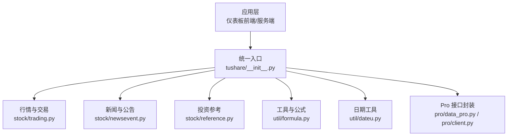
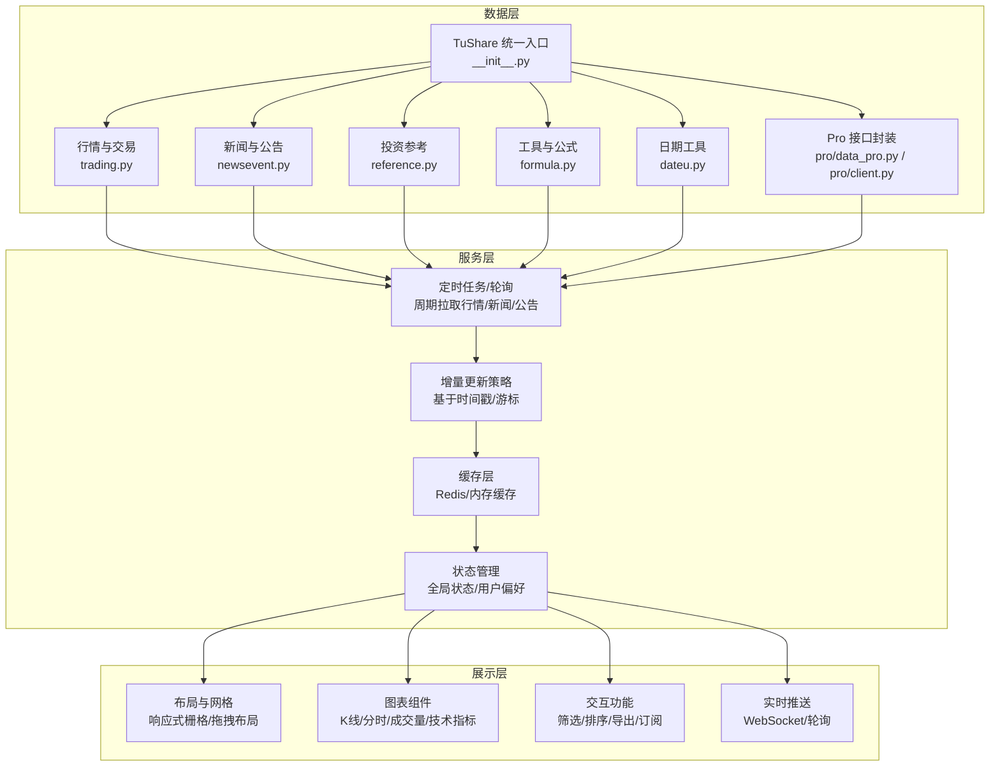
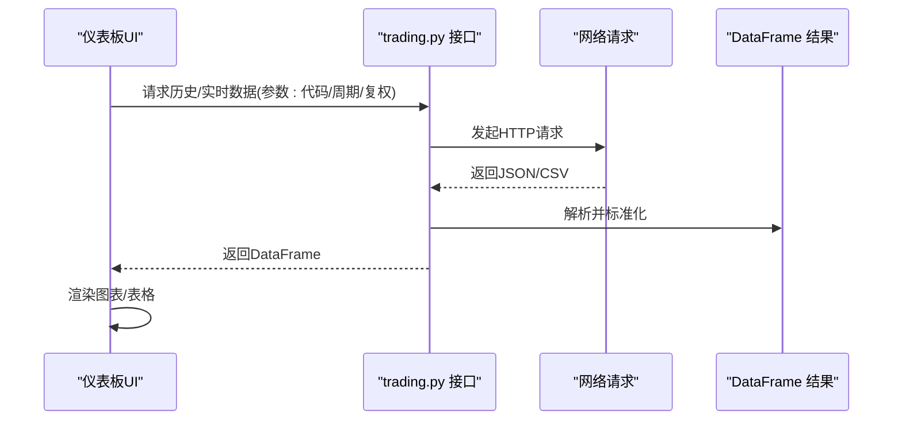
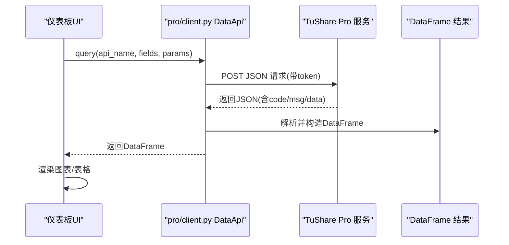
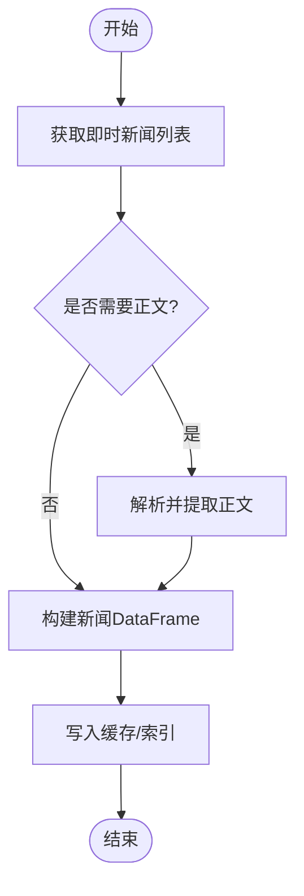
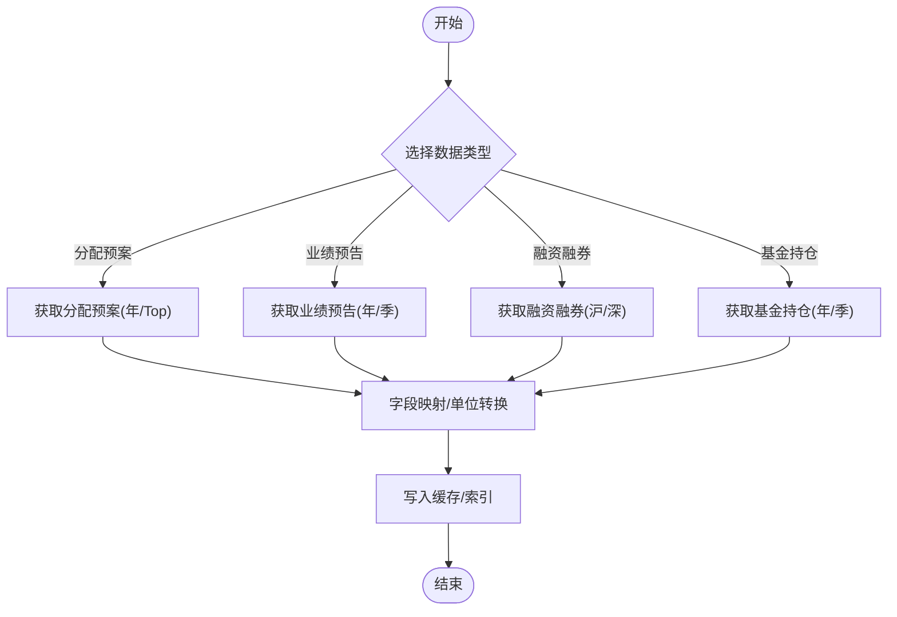
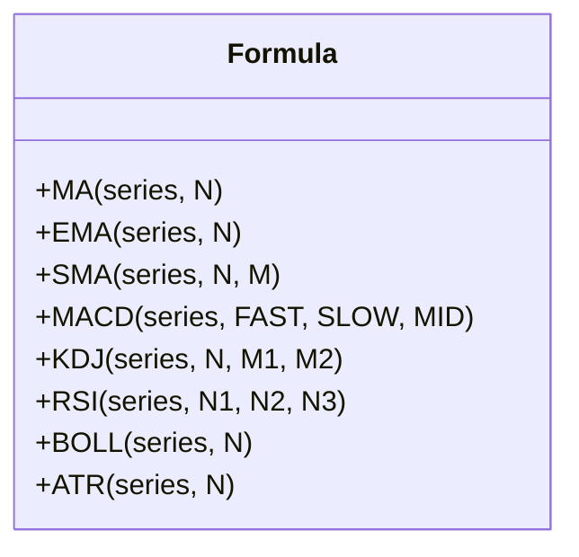
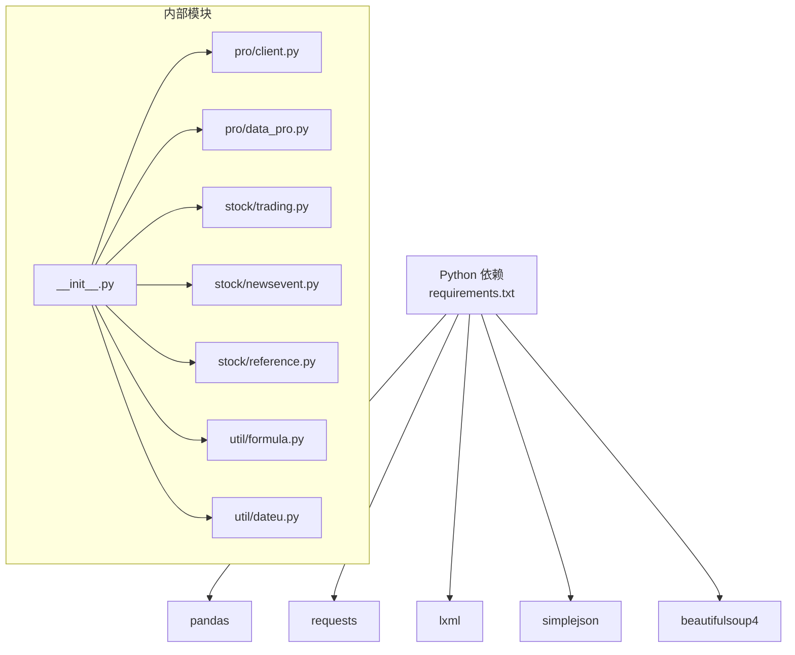

# 仪表板设计

<cite>
**本文引用的文件**
- [README.md](file://README.md)
- [__init__.py](file://tushare/__init__.py)
- [client.py](file://tushare/pro/client.py)
- [data_pro.py](file://tushare/pro/data_pro.py)
- [trading.py](file://tushare/stock/trading.py)
- [news_vars.py](file://tushare/stock/news_vars.py)
- [newsevent.py](file://tushare/stock/newsevent.py)
- [reference.py](file://tushare/stock/reference.py)
- [formula.py](file://tushare/util/formula.py)
- [dateu.py](file://tushare/util/dateu.py)
- [requirements.txt](file://requirements.txt)
</cite>

## 目录
1. [引言](#引言)
2. [项目结构](#项目结构)
3. [核心组件](#核心组件)
4. [架构总览](#架构总览)
5. [详细组件分析](#详细组件分析)
6. [依赖分析](#依赖分析)
7. [性能考量](#性能考量)
8. [故障排查指南](#故障排查指南)
9. [结论](#结论)
10. [附录](#附录)

## 引言
本指南面向希望基于 TuShare 构建专业金融数据仪表板的工程师与产品团队。文档围绕多维度数据展示、实时数据更新、用户交互、布局与响应式设计、状态管理、数据源整合、性能与可靠性等方面，提供从架构到落地的完整实现路径，并给出可复用的组件模板与最佳实践。

## 项目结构
TuShare 提供统一入口模块，按“领域/业务”组织子模块，核心能力包括：
- 行情与交易数据：股票日线/分钟线、实时报价、指数行情、历史复权等
- 新闻与公告：即时新闻、个股公告、股吧热点
- 投资参考：分配预案、业绩预告、融资融券、基金持仓等
- 工具与公式：技术指标计算（MA、EMA、MACD、KDJ 等）
- Pro 数据接口：统一的 Pro API 认证与查询封装

**图示来源**
- [__init__.py:11-140](file://tushare/__init__.py#L11-L140)
- [trading.py:32-100](file://tushare/stock/trading.py#L32-L100)
- [newsevent.py:26-69](file://tushare/stock/newsevent.py#L26-L69)
- [reference.py:28-153](file://tushare/stock/reference.py#L28-L153)
- [formula.py:12-151](file://tushare/util/formula.py#L12-L151)
- [dateu.py:27-129](file://tushare/util/dateu.py#L27-L129)
- [data_pro.py:21-141](file://tushare/pro/data_pro.py#L21-L141)
- [client.py:17-52](file://tushare/pro/client.py#L17-L52)

**章节来源**
- [README.md:1-411](file://README.md#L1-L411)
- [__init__.py:11-140](file://tushare/__init__.py#L11-L140)

## 核心组件
- 数据获取与转换
  - 行情数据：历史日线/分钟线、实时报价、指数行情、历史复权
  - 新闻与公告：即时新闻、个股公告、公告内容、股吧热点
  - 投资参考：分配预案、业绩预告、融资融券、基金持仓
  - 技术指标：通用公式库（MA、EMA、MACD、KDJ 等）
- Pro 数据接口
  - 统一认证与查询封装，支持多资产类型（股票/指数/期货/期权/基金/数字货币）
  - 支持复权、周期、均线、因子等参数化扩展
- 工具与日期
  - 交易日历、节假日判断、时间窗口计算

**章节来源**
- [trading.py:32-100](file://tushare/stock/trading.py#L32-L100)
- [newsevent.py:26-69](file://tushare/stock/newsevent.py#L26-L69)
- [reference.py:28-153](file://tushare/stock/reference.py#L28-L153)
- [formula.py:12-151](file://tushare/util/formula.py#L12-L151)
- [dateu.py:78-129](file://tushare/util/dateu.py#L78-L129)
- [data_pro.py:21-141](file://tushare/pro/data_pro.py#L21-L141)
- [client.py:17-52](file://tushare/pro/client.py#L17-L52)

## 架构总览
仪表板整体建议采用“数据层-服务层-展示层”的分层架构，结合 TuShare 的模块化能力，形成可扩展、可维护的金融数据仪表板。

**图示来源**
- [__init__.py:11-140](file://tushare/__init__.py#L11-L140)
- [trading.py:32-100](file://tushare/stock/trading.py#L32-L100)
- [newsevent.py:26-69](file://tushare/stock/newsevent.py#L26-L69)
- [reference.py:28-153](file://tushare/stock/reference.py#L28-L153)
- [formula.py:12-151](file://tushare/util/formula.py#L12-L151)
- [dateu.py:78-129](file://tushare/util/dateu.py#L78-L129)
- [data_pro.py:21-141](file://tushare/pro/data_pro.py#L21-L141)
- [client.py:17-52](file://tushare/pro/client.py#L17-L52)

## 详细组件分析

### 组件一：行情与交易数据（股票/指数/复权）
- 关键能力
  - 历史日线/分钟线：支持多周期、复权类型（前复权/后复权/不复权）
  - 实时报价：批量获取多只股票的实时行情
  - 指数行情：大盘指数的实时与历史行情
  - 历史复权：按复权因子进行价格调整
- 设计要点
  - 参数化：周期、复权、均线、因子（换手率、量比）等
  - 错误重试与超时控制
  - 输出标准化：统一字段命名与数据类型
- 适用场景
  - K 线图、分时图、成交量图、复权对比、技术指标叠加

**图示来源**
- [trading.py:32-100](file://tushare/stock/trading.py#L32-L100)
- [trading.py:324-394](file://tushare/stock/trading.py#L324-L394)
- [trading.py:578-611](file://tushare/stock/trading.py#L578-L611)
- [trading.py:397-509](file://tushare/stock/trading.py#L397-L509)

**章节来源**
- [trading.py:32-100](file://tushare/stock/trading.py#L32-L100)
- [trading.py:324-394](file://tushare/stock/trading.py#L324-L394)
- [trading.py:578-611](file://tushare/stock/trading.py#L578-L611)
- [trading.py:397-509](file://tushare/stock/trading.py#L397-L509)

### 组件二：Pro 数据接口（多资产/多周期/复权/因子）
- 关键能力
  - 统一认证：通过 token 初始化 DataApi
  - 多资产支持：股票/指数/期货/期权/基金/数字货币
  - 多周期支持：日/周/月/年及分钟级
  - 复权与因子：复权因子合并、换手率/量比等因子拼接
  - 均线：按指定周期生成均线列
- 设计要点
  - 参数校验与默认值
  - 错误码解析与异常抛出
  - 重试机制与超时控制
- 适用场景
  - 专业回测/策略研究、跨资产对比、因子研究

**图示来源**
- [client.py:17-52](file://tushare/pro/client.py#L17-L52)
- [data_pro.py:21-141](file://tushare/pro/data_pro.py#L21-L141)

**章节来源**
- [client.py:17-52](file://tushare/pro/client.py#L17-L52)
- [data_pro.py:21-141](file://tushare/pro/data_pro.py#L21-L141)

### 组件三：新闻与公告（即时新闻/个股公告/股吧热点）
- 关键能力
  - 即时新闻：分页获取新闻列表，可选加载正文
  - 个股公告：按股票代码与日期获取公告列表
  - 股吧热点：抓取 sina 股吧首页重点消息
- 设计要点
  - 分页抓取与去重
  - 正文解析与清洗
  - 缓存与增量更新

**图示来源**
- [newsevent.py:26-69](file://tushare/stock/newsevent.py#L26-L69)
- [newsevent.py:97-129](file://tushare/stock/newsevent.py#L97-L129)
- [newsevent.py:151-193](file://tushare/stock/newsevent.py#L151-L193)

**章节来源**
- [newsevent.py:26-69](file://tushare/stock/newsevent.py#L26-L69)
- [newsevent.py:97-129](file://tushare/stock/newsevent.py#L97-L129)
- [newsevent.py:151-193](file://tushare/stock/newsevent.py#L151-L193)
- [news_vars.py:3-9](file://tushare/stock/news_vars.py#L3-L9)

### 组件四：投资参考（分配预案/业绩预告/融资融券/基金持仓）
- 关键能力
  - 分配预案：按年份/条数获取分红送转数据
  - 业绩预告：按年/季度获取业绩预告
  - 融资融券：沪/深两市融资融券交易数据与明细
  - 基金持仓：按季度获取基金重仓股
- 设计要点
  - 分页抓取与合并
  - 字段映射与单位转换
  - 日期格式化与一致性

**图示来源**
- [reference.py:28-153](file://tushare/stock/reference.py#L28-L153)
- [reference.py:205-231](file://tushare/stock/reference.py#L205-L231)
- [reference.py:538-617](file://tushare/stock/reference.py#L538-L617)
- [reference.py:779-799](file://tushare/stock/reference.py#L779-L799)

**章节来源**
- [reference.py:28-153](file://tushare/stock/reference.py#L28-L153)
- [reference.py:205-231](file://tushare/stock/reference.py#L205-L231)
- [reference.py:538-617](file://tushare/stock/reference.py#L538-L617)
- [reference.py:779-799](file://tushare/stock/reference.py#L779-L799)

### 组件五：技术指标与公式（通用指标库）
- 关键能力
  - 常用指标：MA、EMA、SMA、MACD、KDJ、RSI、BOLL、ATR 等
  - 向量化与批处理：基于 pandas/numpy 的高效计算
- 设计要点
  - 指标参数化与默认值
  - 输出列命名规范
  - 与行情数据的无缝拼接

**图示来源**
- [formula.py:12-151](file://tushare/util/formula.py#L12-L151)

**章节来源**
- [formula.py:12-151](file://tushare/util/formula.py#L12-L151)

### 组件六：日期与交易日历（时间窗口与节假日）
- 关键能力
  - 交易日历：判断某日是否为交易日
  - 时间窗口：计算最近交易日、上周同日、季度末日等
  - 随机数辅助：请求防抖与反爬
- 设计要点
  - 与行情/公告等模块联动
  - 缓存交易日历以减少 IO

**章节来源**
- [dateu.py:78-129](file://tushare/util/dateu.py#L78-L129)

## 依赖分析
- Python 依赖
  - pandas、requests、lxml、simplejson、beautifulsoup4 等
- 模块耦合
  - 统一入口模块聚合各领域接口，降低上层耦合
  - Pro 接口独立封装，便于替换与扩展
- 外部依赖
  - TuShare 官方数据源（HTTP/HTTPS）

**图示来源**
- [requirements.txt:1-6](file://requirements.txt#L1-L6)
- [__init__.py:11-140](file://tushare/__init__.py#L11-L140)
- [client.py:17-52](file://tushare/pro/client.py#L17-L52)
- [data_pro.py:21-141](file://tushare/pro/data_pro.py#L21-L141)
- [trading.py:32-100](file://tushare/stock/trading.py#L32-L100)
- [newsevent.py:26-69](file://tushare/stock/newsevent.py#L26-L69)
- [reference.py:28-153](file://tushare/stock/reference.py#L28-L153)
- [formula.py:12-151](file://tushare/util/formula.py#L12-L151)
- [dateu.py:78-129](file://tushare/util/dateu.py#L78-L129)

**章节来源**
- [requirements.txt:1-6](file://requirements.txt#L1-L6)
- [__init__.py:11-140](file://tushare/__init__.py#L11-L140)

## 性能考量
- 数据拉取
  - 批量请求限制：实时报价一次不超过 30 个代码
  - 重试与退避：网络异常时指数退避重试
  - 超时设置：合理设置请求超时，避免阻塞
- 计算与渲染
  - 指标计算尽量向量化，避免逐行循环
  - 大数据集分页/分批处理，避免内存峰值
- 缓存与索引
  - 交易日历、新闻列表、公告列表建立缓存
  - 按日期/代码建立二级索引，加速查询
- 实时更新
  - WebSocket 或短轮询结合增量更新策略
  - 优先更新活跃标的与用户关注标的

[本节为通用指导，无需特定文件引用]

## 故障排查指南
- 网络与超时
  - 现象：请求超时/返回空
  - 排查：检查代理/防火墙、重试次数、超时阈值
- 认证失败
  - 现象：Pro 接口返回错误码
  - 排查：确认 token 是否正确、是否过期
- 数据为空
  - 现象：历史/实时数据为空
  - 排查：检查日期区间、节假日、代码有效性
- 字段缺失/类型异常
  - 现象：列名不一致或类型不符
  - 排查：对照接口文档字段清单，统一映射

**章节来源**
- [client.py:32-48](file://tushare/pro/client.py#L32-L48)
- [trading.py:67-100](file://tushare/stock/trading.py#L67-L100)
- [trading.py:169-187](file://tushare/stock/trading.py#L169-L187)

## 结论
通过 TuShare 的模块化能力与统一入口，可以高效构建覆盖多资产、多维度的金融数据仪表板。建议在工程实践中坚持“分层清晰、参数化配置、缓存优先、异常可控”的原则，结合可视化组件与交互设计，持续提升用户体验与系统稳定性。

[本节为总结，无需特定文件引用]

## 附录

### 仪表板布局与响应式设计（实践建议）
- 网格系统
  - 使用 12 列栅格，按区域划分：顶部导航/搜索、左侧筛选、中部主图、右侧指标/新闻
  - 区域尺寸：主图占 70%，右侧指标占 20%，新闻占 10%
- 响应式
  - 移动端优先：窄屏下折叠侧栏，主图堆叠
  - 自适应缩放：图表随容器尺寸变化
- 视觉层次
  - 色彩：涨红跌绿，强调关键指标
  - 字体：标题/正文/标注分级，字号与行距明确

[本节为概念性建议，无需特定文件引用]

### 用户交互与状态管理（实践建议）
- 交互功能
  - 筛选器：板块/行业/自定义池
  - 排序：按涨跌幅/成交量/换手率
  - 导出：CSV/PNG
  - 订阅：关注标的/消息提醒
- 状态管理
  - 全局状态：当前代码、周期、复权、指标开关
  - 用户偏好：主题、图表样式、默认筛选
  - 本地持久化：localStorage/sessionStorage

[本节为概念性建议，无需特定文件引用]

### 可复用组件模板（清单）
- 图表组件
  - K 线图：蜡烛图 + 成交量 + 均线
  - 分时图：分时折线 + 委买委卖
  - 技术指标：MACD/KDJ/布林带
- 数据面板
  - 实时行情卡片：价格/涨跌幅/成交量
  - 新闻列表：标题/时间/摘要
  - 公告列表：标题/类型/日期
- 控件
  - 日期选择器：起止日期/快捷选项
  - 下拉选择：周期/复权/资产类型
  - 搜索框：模糊匹配代码/名称

[本节为概念性建议，无需特定文件引用]