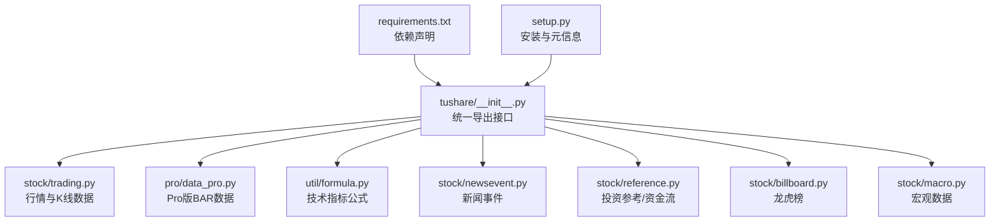
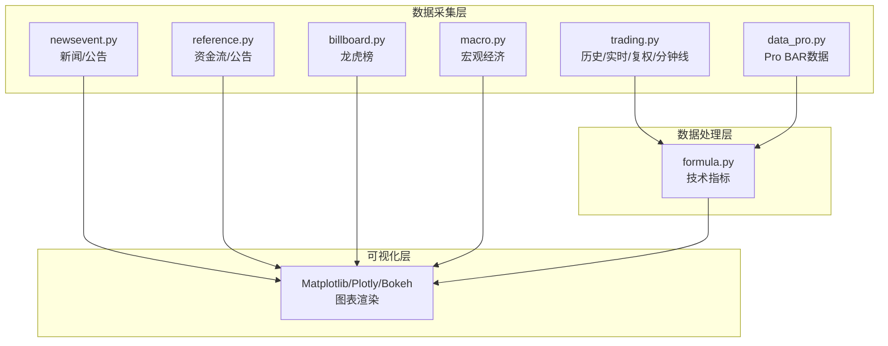
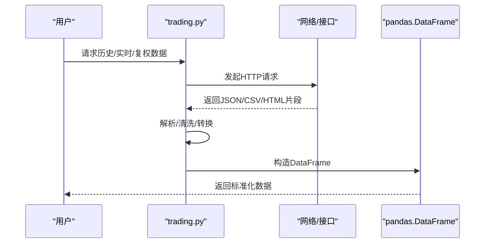
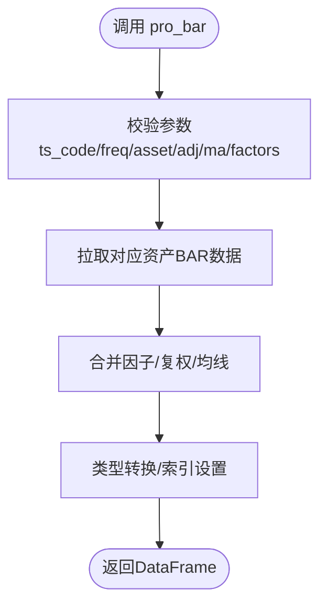
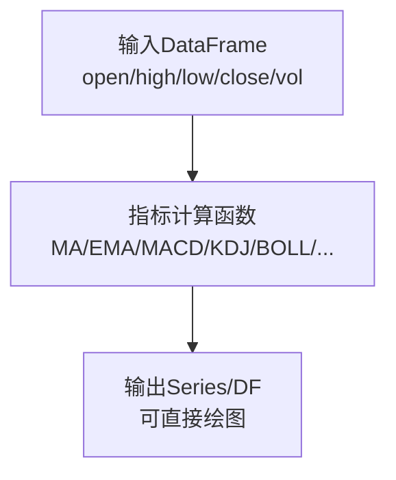
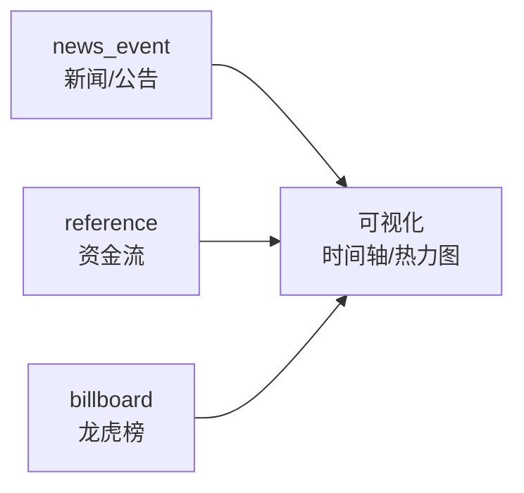
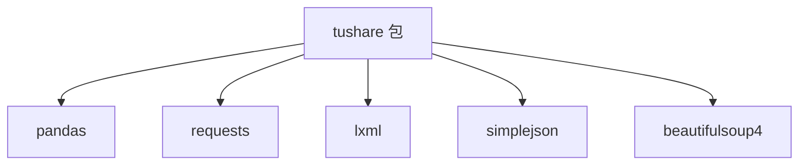

# 数据可视化集成

<cite>
**本文引用的文件**
- [README.md](file://README.md)
- [requirements.txt](file://requirements.txt)
- [setup.py](file://setup.py)
- [tushare/__init__.py](file://tushare/__init__.py)
- [tushare/stock/trading.py](file://tushare/stock/trading.py)
- [tushare/pro/data_pro.py](file://tushare/pro/data_pro.py)
- [tushare/util/formula.py](file://tushare/util/formula.py)
- [tushare/stock/newsevent.py](file://tushare/stock/newsevent.py)
- [tushare/stock/reference.py](file://tushare/stock/reference.py)
- [tushare/stock/billboard.py](file://tushare/stock/billboard.py)
- [tushare/stock/macro.py](file://tushare/stock/macro.py)
- [test/trading_test.py](file://test/trading_test.py)
- [test/bar_test.py](file://test/bar_test.py)
- [test/news_test.py](file://test/news_test.py)
- [whats_new.md](file://whats_new.md)
</cite>

## 目录
1. [简介](#简介)
2. [项目结构](#项目结构)
3. [核心组件](#核心组件)
4. [架构总览](#架构总览)
5. [详细组件分析](#详细组件分析)
6. [依赖分析](#依赖分析)
7. [性能考量](#性能考量)
8. [故障排查指南](#故障排查指南)
9. [结论](#结论)
10. [附录](#附录)

## 简介
本指南面向希望将 TuShare 获取的金融数据与各类可视化工具（Matplotlib、Plotly、Bokeh 等）进行集成的工程师与分析师，系统讲解如何从数据采集、清洗、存储到图表呈现的完整流程。文档聚焦于：
- 股票价格与成交量的专业图表绘制（K 线、成交量、技术指标叠加）
- 交互式仪表板设计（动态数据更新、多维分析、用户交互）
- 新闻事件与资金流向的可视化（热力图、流向图、时间轴）
- 响应式设计、性能优化与跨浏览器兼容建议
- 提供从数据准备到图表展示的端到端示例路径

## 项目结构
TuShare 以模块化方式组织，围绕“数据采集—清洗—存储—呈现”的主线展开。核心入口通过包导出统一接口，底层模块按业务域划分，便于扩展与维护。

**图示来源**
- [tushare/__init__.py:11-140](file://tushare/__init__.py#L11-L140)
- [tushare/stock/trading.py:32-100](file://tushare/stock/trading.py#L32-L100)
- [tushare/pro/data_pro.py:21-158](file://tushare/pro/data_pro.py#L21-L158)
- [tushare/util/formula.py:8-262](file://tushare/util/formula.py#L8-L262)
- [tushare/stock/newsevent.py:26-95](file://tushare/stock/newsevent.py#L26-L95)
- [tushare/stock/reference.py:28-153](file://tushare/stock/reference.py#L28-L153)
- [tushare/stock/billboard.py:28-95](file://tushare/stock/billboard.py#L28-L95)
- [tushare/stock/macro.py:23-55](file://tushare/stock/macro.py#L23-L55)
- [requirements.txt:1-6](file://requirements.txt#L1-L6)
- [setup.py:65-74](file://setup.py#L65-L74)

**章节来源**
- [README.md:43-182](file://README.md#L43-L182)
- [tushare/__init__.py:11-140](file://tushare/__init__.py#L11-L140)
- [requirements.txt:1-6](file://requirements.txt#L1-L6)
- [setup.py:65-74](file://setup.py#L65-L74)

## 核心组件
- 行情与K线数据：提供历史日线、分钟线、复权处理、批量行情等能力，返回 pandas DataFrame，适配各类可视化库。
- Pro BAR 数据：支持股票/指数/期货/基金/数字货币等多资产多周期BAR数据，内置复权与均线计算。
- 技术指标：提供常用技术指标（MA、EMA、MACD、KDJ、BOLL、RSI、WR、MFI 等），便于叠加到价格图层。
- 新闻事件与资金流：新闻列表、公告、融资融券、龙虎榜等，支撑事件驱动与资金流向可视化。
- 宏观经济：GDP、CPI、PPI、存贷款基准、货币供应量等，用于宏观背景分析。

**章节来源**
- [tushare/stock/trading.py:32-100](file://tushare/stock/trading.py#L32-L100)
- [tushare/pro/data_pro.py:34-134](file://tushare/pro/data_pro.py#L34-L134)
- [tushare/util/formula.py:80-262](file://tushare/util/formula.py#L80-L262)
- [tushare/stock/newsevent.py:26-95](file://tushare/stock/newsevent.py#L26-L95)
- [tushare/stock/reference.py:538-776](file://tushare/stock/reference.py#L538-L776)
- [tushare/stock/billboard.py:28-95](file://tushare/stock/billboard.py#L28-L95)
- [tushare/stock/macro.py:23-55](file://tushare/stock/macro.py#L23-L55)

## 架构总览
下图展示了从数据采集到图表呈现的关键路径与模块协作关系。

**图示来源**
- [tushare/stock/trading.py:32-100](file://tushare/stock/trading.py#L32-L100)
- [tushare/pro/data_pro.py:34-134](file://tushare/pro/data_pro.py#L34-L134)
- [tushare/util/formula.py:80-262](file://tushare/util/formula.py#L80-L262)
- [tushare/stock/newsevent.py:26-95](file://tushare/stock/newsevent.py#L26-L95)
- [tushare/stock/reference.py:538-776](file://tushare/stock/reference.py#L538-L776)
- [tushare/stock/billboard.py:28-95](file://tushare/stock/billboard.py#L28-L95)
- [tushare/stock/macro.py:23-55](file://tushare/stock/macro.py#L23-L55)

## 详细组件分析

### 组件A：行情与K线数据（trading.py）
- 主要职责：获取历史日线/分钟线、实时行情、复权数据、指数行情、批量行情等。
- 输出格式：pandas DataFrame，列名标准化，便于后续绘图与分析。
- 关键能力：支持起止日期过滤、复权类型（前复权/后复权/不复权）、分钟级K线、指数行情等。
- 使用建议：优先使用 get_k_data 或 get_hist_data 获取标准化时间序列，再结合技术指标与成交量进行图表绘制。

**图示来源**
- [tushare/stock/trading.py:32-100](file://tushare/stock/trading.py#L32-L100)
- [tushare/stock/trading.py:324-394](file://tushare/stock/trading.py#L324-L394)
- [tushare/stock/trading.py:397-510](file://tushare/stock/trading.py#L397-L510)

**章节来源**
- [tushare/stock/trading.py:32-100](file://tushare/stock/trading.py#L32-L100)
- [tushare/stock/trading.py:324-394](file://tushare/stock/trading.py#L324-L394)
- [tushare/stock/trading.py:397-510](file://tushare/stock/trading.py#L397-L510)

### 组件B：Pro BAR 数据（data_pro.py）
- 主要职责：统一获取多资产多周期BAR数据，支持复权与均线计算。
- 输出格式：DataFrame，包含 open/close/high/low/pre_close/volume/amount 等字段，以及可选均线与因子列。
- 关键能力：资产类型（股票/指数/期货/基金/数字货币）、频率（日/周/月/季/年/分钟）、复权（None/qfq/hfq）、均线（ma5/ma10/…）、因子（换手率/量比）。
- 使用建议：在需要高质量、标准化BAR数据时优先使用，便于与技术指标无缝对接。

**图示来源**
- [tushare/pro/data_pro.py:34-134](file://tushare/pro/data_pro.py#L34-L134)

**章节来源**
- [tushare/pro/data_pro.py:34-134](file://tushare/pro/data_pro.py#L34-L134)

### 组件C：技术指标（formula.py）
- 主要职责：提供常用技术指标计算函数，如 MA、EMA、MACD、KDJ、BOLL、RSI、WR、MFI、ROC、MTM、SKDJ、BIAS、BBI、BBIBOLL、PBX、ATR 等。
- 输出格式：Series 或 DataFrame，可直接叠加到价格图层。
- 使用建议：在K线图基础上叠加指标，注意指标平滑与滞后性，合理设置窗口长度。

**图示来源**
- [tushare/util/formula.py:80-262](file://tushare/util/formula.py#L80-L262)

**章节来源**
- [tushare/util/formula.py:80-262](file://tushare/util/formula.py#L80-L262)

### 组件D：新闻事件与资金流向（newsevent.py、reference.py、billboard.py）
- 新闻事件：获取即时新闻、公告信息、股吧热点等，适合构建时间轴与热力图。
- 资金流向：融资融券、沪深港通资金流向、龙虎榜等，适合流向图与热力图。
- 使用建议：将时间戳规范化为统一格式，结合词云/主题分布进行事件影响分析。

**图示来源**
- [tushare/stock/newsevent.py:26-95](file://tushare/stock/newsevent.py#L26-L95)
- [tushare/stock/reference.py:538-776](file://tushare/stock/reference.py#L538-L776)
- [tushare/stock/billboard.py:28-95](file://tushare/stock/billboard.py#L28-L95)

**章节来源**
- [tushare/stock/newsevent.py:26-95](file://tushare/stock/newsevent.py#L26-L95)
- [tushare/stock/reference.py:538-776](file://tushare/stock/reference.py#L538-L776)
- [tushare/stock/billboard.py:28-95](file://tushare/stock/billboard.py#L28-L95)

### 组件E：宏观经济（macro.py）
- 主要职责：提供 GDP、CPI、PPI、存贷款基准、货币供应量、黄金与外汇储备等。
- 使用建议：与股价/指数进行对比分析，构建多维面板图或时间序列对比图。

**章节来源**
- [tushare/stock/macro.py:23-55](file://tushare/stock/macro.py#L23-L55)

## 依赖分析
- 核心依赖：pandas、requests、lxml、simplejson、beautifulsoup4。
- 安装与升级：通过 pip 安装或升级，setup.py 中声明了安装依赖与版本要求。
- 依赖关系示意：

**图示来源**
- [requirements.txt:1-6](file://requirements.txt#L1-L6)
- [setup.py:65-74](file://setup.py#L65-L74)

**章节来源**
- [requirements.txt:1-6](file://requirements.txt#L1-L6)
- [setup.py:65-74](file://setup.py#L65-L74)

## 性能考量
- 数据规模与内存：批量获取行情数据时，建议分批拉取并及时落库，避免一次性加载过多数据导致内存压力。
- 网络稳定性：接口调用具备重试机制，建议在应用层设置合理的超时与重试策略。
- 计算复杂度：技术指标计算通常为 O(n) 级别，注意窗口大小对性能的影响；可采用缓存中间结果减少重复计算。
- 图表渲染：对于大规模时间序列，建议采用分页/抽样/降采样的策略，提升交互体验。

[本节为通用指导，无需特定文件引用]

## 故障排查指南
- 网络错误：接口抛出网络异常时，检查网络连通性与代理设置，适当增加重试次数与延时。
- 数据为空：当返回空DataFrame时，确认时间区间、代码格式与接口限制；必要时缩小时间范围或切换数据源。
- 编码问题：历史数据解析可能出现编码差异，确保统一编码处理。
- 版本兼容：注意 Python 2/3 的兼容性差异，优先使用 Python 3 环境。

**章节来源**
- [tushare/stock/trading.py:67-100](file://tushare/stock/trading.py#L67-L100)
- [tushare/pro/data_pro.py:135-140](file://tushare/pro/data_pro.py#L135-L140)

## 结论
通过 TuShare 的标准化数据接口与 pandas DataFrame 输出，可以高效地与 Matplotlib、Plotly、Bokeh 等可视化库对接，完成从基础 K 线到技术指标叠加、从新闻事件到资金流向的多维度可视化。建议在工程实践中遵循“数据采集—清洗—存储—渲染—交互”的流水线模式，并结合性能优化与故障排查策略，构建稳定、可扩展的可视化系统。

[本节为总结性内容，无需特定文件引用]

## 附录

### A. 使用示例路径（从数据准备到图表展示）
- 获取历史日线数据：参考 [tushare/stock/trading.py:32-100](file://tushare/stock/trading.py#L32-L100)
- 获取分钟线数据：参考 [tushare/stock/trading.py:624-707](file://tushare/stock/trading.py#L624-L707)
- 获取复权数据：参考 [tushare/stock/trading.py:397-510](file://tushare/stock/trading.py#L397-L510)
- 获取 Pro BAR 数据：参考 [tushare/pro/data_pro.py:34-134](file://tushare/pro/data_pro.py#L34-L134)
- 计算技术指标：参考 [tushare/util/formula.py:80-262](file://tushare/util/formula.py#L80-L262)
- 新闻事件与公告：参考 [tushare/stock/newsevent.py:26-95](file://tushare/stock/newsevent.py#L26-L95)
- 融资融券与资金流向：参考 [tushare/stock/reference.py:538-776](file://tushare/stock/reference.py#L538-L776)
- 龙虎榜数据：参考 [tushare/stock/billboard.py:28-95](file://tushare/stock/billboard.py#L28-L95)
- 宏观经济数据：参考 [tushare/stock/macro.py:23-55](file://tushare/stock/macro.py#L23-L55)

### B. 测试与验证
- 行情测试：参考 [test/trading_test.py:18-39](file://test/trading_test.py#L18-L39)
- BAR 数据测试：参考 [test/bar_test.py:16-18](file://test/bar_test.py#L16-L18)
- 新闻测试：参考 [test/news_test.py:21-34](file://test/news_test.py#L21-L34)

### C. 变更与演进
- 版本变更记录与新增模块（如新闻事件、龙虎榜、宏观数据等）可参考 [whats_new.md:1-162](file://whats_new.md#L1-L162)

**章节来源**
- [test/trading_test.py:18-39](file://test/trading_test.py#L18-L39)
- [test/bar_test.py:16-18](file://test/bar_test.py#L16-L18)
- [test/news_test.py:21-34](file://test/news_test.py#L21-L34)
- [whats_new.md:1-162](file://whats_new.md#L1-L162)