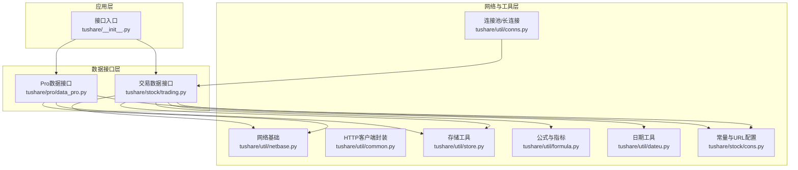
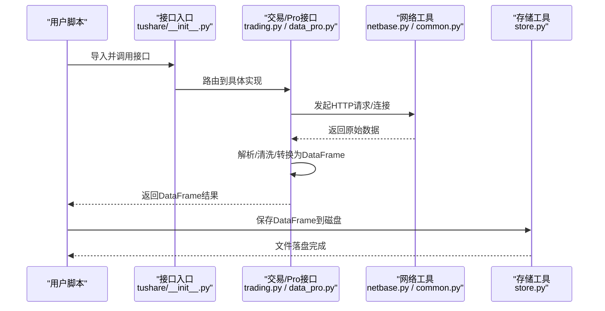
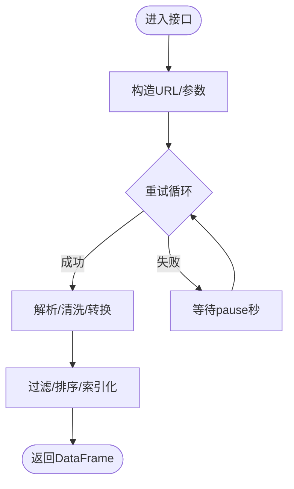
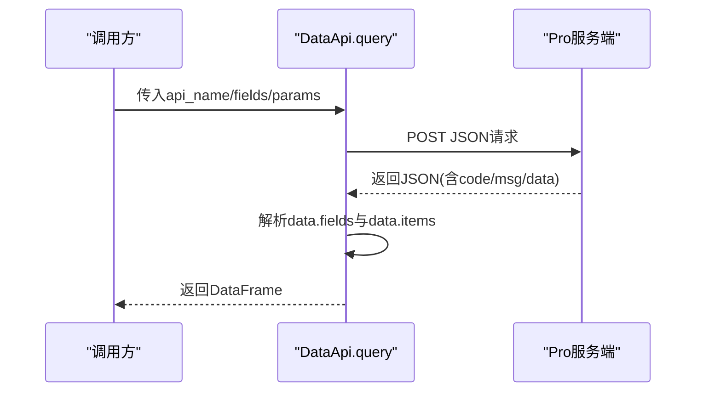
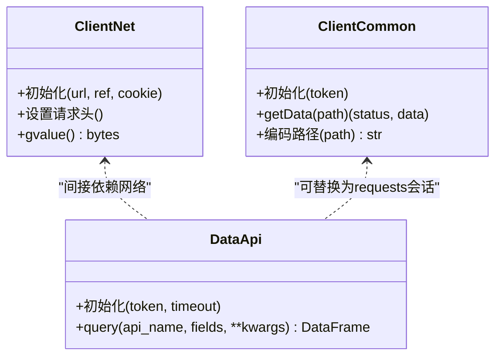
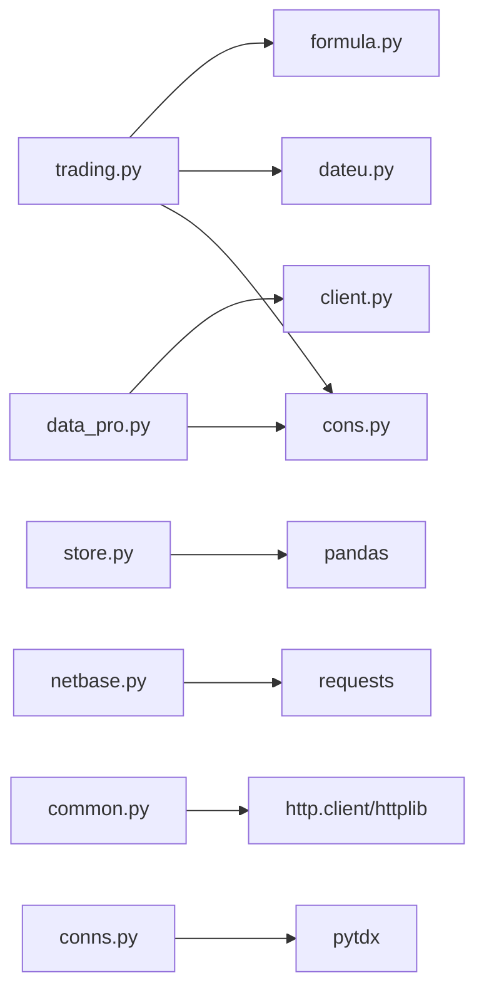

# 性能优化最佳实践

<cite>
**本文引用的文件**
- [README.md](file://README.md)
- [requirements.txt](file://requirements.txt)
- [setup.py](file://setup.py)
- [tushare/__init__.py](file://tushare/__init__.py)
- [tushare/util/common.py](file://tushare/util/common.py)
- [tushare/util/netbase.py](file://tushare/util/netbase.py)
- [tushare/util/store.py](file://tushare/util/store.py)
- [tushare/pro/client.py](file://tushare/pro/client.py)
- [tushare/pro/data_pro.py](file://tushare/pro/data_pro.py)
- [tushare/util/conns.py](file://tushare/util/conns.py)
- [tushare/util/formula.py](file://tushare/util/formula.py)
- [tushare/stock/trading.py](file://tushare/stock/trading.py)
- [tushare/util/dateu.py](file://tushare/util/dateu.py)
- [tushare/stock/cons.py](file://tushare/stock/cons.py)
</cite>

## 目录
1. [简介](#简介)
2. [项目结构](#项目结构)
3. [核心组件](#核心组件)
4. [架构总览](#架构总览)
5. [详细组件分析](#详细组件分析)
6. [依赖分析](#依赖分析)
7. [性能考量](#性能考量)
8. [故障排查指南](#故障排查指南)
9. [结论](#结论)
10. [附录](#附录)

## 简介
本指南围绕量化策略开发中的性能优化实践展开，结合仓库中实际实现，系统梳理数据处理、内存管理、并发与网络优化、存储与查询优化、以及性能监控与调试方法。内容以“从理论到实践”的方式组织，既适合初学者理解关键概念，也便于有经验的开发者直接定位优化点与改进方向。

## 项目结构
该仓库采用按领域/功能模块划分的组织方式，核心模块包括：
- 接口入口与导出：tushare/__init__.py
- 交易数据接口：tushare/stock/trading.py
- Pro数据接口：tushare/pro/client.py、tushare/pro/data_pro.py
- 工具与网络：tushare/util/netbase.py、tushare/util/common.py、tushare/util/conns.py
- 存储与保存：tushare/util/store.py
- 公式与指标：tushare/util/formula.py
- 日期与常量：tushare/util/dateu.py、tushare/stock/cons.py

图表来源
- [tushare/__init__.py:11-140](file://tushare/__init__.py#L11-L140)
- [tushare/stock/trading.py:1-120](file://tushare/stock/trading.py#L1-L120)
- [tushare/pro/data_pro.py:21-158](file://tushare/pro/data_pro.py#L21-L158)
- [tushare/util/netbase.py:1-29](file://tushare/util/netbase.py#L1-L29)
- [tushare/util/common.py:18-86](file://tushare/util/common.py#L18-L86)
- [tushare/util/conns.py:14-61](file://tushare/util/conns.py#L14-L61)
- [tushare/util/store.py:14-44](file://tushare/util/store.py#L14-L44)
- [tushare/util/formula.py:1-262](file://tushare/util/formula.py#L1-L262)
- [tushare/util/dateu.py:1-129](file://tushare/util/dateu.py#L1-L129)
- [tushare/stock/cons.py:1-453](file://tushare/stock/cons.py#L1-L453)

章节来源
- [README.md:1-411](file://README.md#L1-L411)
- [tushare/__init__.py:11-140](file://tushare/__init__.py#L11-L140)

## 核心组件
- 接口入口与导出：集中暴露各类数据接口，便于上层策略直接调用。
- 交易数据接口：提供历史行情、实时行情、分笔、复权等数据抓取与清洗。
- Pro数据接口：基于HTTP POST的统一查询接口，返回DataFrame，便于后续向量化处理。
- 网络与工具：封装HTTP请求、保持连接、超时控制、重试机制；提供连接池与长连接管理。
- 存储与保存：DataFrame持久化为CSV/JSON等格式，支持路径与命名规范。
- 公式与指标：提供EMA、MA、MACD、KDJ等常用技术指标，底层基于pandas/numpy。
- 日期与常量：提供交易日历、日期计算、URL与字段常量，支撑数据获取与清洗。

章节来源
- [tushare/__init__.py:11-140](file://tushare/__init__.py#L11-L140)
- [tushare/stock/trading.py:32-100](file://tushare/stock/trading.py#L32-L100)
- [tushare/pro/client.py:17-52](file://tushare/pro/client.py#L17-L52)
- [tushare/pro/data_pro.py:21-158](file://tushare/pro/data_pro.py#L21-L158)
- [tushare/util/netbase.py:9-29](file://tushare/util/netbase.py#L9-L29)
- [tushare/util/common.py:18-86](file://tushare/util/common.py#L18-L86)
- [tushare/util/conns.py:14-61](file://tushare/util/conns.py#L14-L61)
- [tushare/util/store.py:14-44](file://tushare/util/store.py#L14-L44)
- [tushare/util/formula.py:8-262](file://tushare/util/formula.py#L8-L262)
- [tushare/util/dateu.py:78-129](file://tushare/util/dateu.py#L78-L129)
- [tushare/stock/cons.py:1-453](file://tushare/stock/cons.py#L1-L453)

## 架构总览
整体架构由“接口层—数据层—网络层—存储层”构成，接口层负责对外暴露统一API；数据层负责数据抓取、清洗与转换；网络层负责HTTP请求与连接管理；存储层负责数据落地与读取。

图表来源
- [tushare/__init__.py:11-140](file://tushare/__init__.py#L11-L140)
- [tushare/stock/trading.py:32-100](file://tushare/stock/trading.py#L32-L100)
- [tushare/pro/data_pro.py:32-48](file://tushare/pro/data_pro.py#L32-L48)
- [tushare/util/netbase.py:9-29](file://tushare/util/netbase.py#L9-L29)
- [tushare/util/common.py:18-86](file://tushare/util/common.py#L18-L86)
- [tushare/util/store.py:24-44](file://tushare/util/store.py#L24-L44)

## 详细组件分析

### 交易数据接口（历史/实时/分笔）
- 关键点
  - 请求重试与超时：统一使用超时参数与重试次数，避免瞬时网络抖动导致失败。
  - 数据清洗：去除空值、格式化数值、过滤列、排序索引，保证下游分析一致性。
  - 分页与批量：对当日行情进行多页解析，支持批量获取。
  - 复权处理：提供前复权/后复权逻辑，涉及因子表合并与数值映射。
- 性能优化建议
  - 合理设置pause参数，避免请求过于密集触发风控或被限流。
  - 对于大批量历史数据，建议按时间区间分段拉取，减少单次请求体积。
  - 使用pandas向量化操作替代逐行循环，提升清洗效率。

图表来源
- [tushare/stock/trading.py:32-100](file://tushare/stock/trading.py#L32-L100)
- [tushare/stock/trading.py:305-321](file://tushare/stock/trading.py#L305-L321)
- [tushare/stock/trading.py:397-510](file://tushare/stock/trading.py#L397-L510)

章节来源
- [tushare/stock/trading.py:32-100](file://tushare/stock/trading.py#L32-L100)
- [tushare/stock/trading.py:305-321](file://tushare/stock/trading.py#L305-L321)
- [tushare/stock/trading.py:397-510](file://tushare/stock/trading.py#L397-L510)

### Pro数据接口（统一查询）
- 关键点
  - 统一POST接口：以JSON形式传递参数，返回标准化字段与数据项。
  - DataFrame构建：直接从返回的字段与数据项构造DataFrame，便于后续分析。
  - 复权与均线：支持按需返回换手率/量比等因子，并可叠加均线计算。
- 性能优化建议
  - 控制fields与params规模，仅请求必要字段，降低网络与解析成本。
  - 对返回的DataFrame进行按需列选择与类型转换，减少内存占用。

图表来源
- [tushare/pro/client.py:32-48](file://tushare/pro/client.py#L32-L48)
- [tushare/pro/data_pro.py:68-134](file://tushare/pro/data_pro.py#L68-L134)

章节来源
- [tushare/pro/client.py:17-52](file://tushare/pro/client.py#L17-L52)
- [tushare/pro/data_pro.py:21-158](file://tushare/pro/data_pro.py#L21-L158)

### 网络与连接管理
- 关键点
  - keep-alive与超时：设置Connection为keep-alive，合理timeout，减少握手开销。
  - 重试与异常：统一捕获异常并重试，避免单点失败影响整体流程。
  - 长连接/连接池：通过连接对象复用，降低频繁建立连接的成本。
- 性能优化建议
  - 在高频请求场景下，优先使用连接池或长连接封装，减少TCP三次握手与TLS握手。
  - 对外部API设置合理的超时与重试上限，避免阻塞线程。

图表来源
- [tushare/util/netbase.py:9-29](file://tushare/util/netbase.py#L9-L29)
- [tushare/util/common.py:18-86](file://tushare/util/common.py#L18-L86)
- [tushare/pro/client.py:17-52](file://tushare/pro/client.py#L17-L52)

章节来源
- [tushare/util/netbase.py:9-29](file://tushare/util/netbase.py#L9-L29)
- [tushare/util/common.py:18-86](file://tushare/util/common.py#L18-L86)
- [tushare/util/conns.py:14-61](file://tushare/util/conns.py#L14-L61)

### 存储与持久化
- 关键点
  - DataFrame保存：支持CSV/JSON等格式，自动创建目录并输出文件。
  - 路径与命名：根据name与path组合生成最终文件名，避免覆盖。
- 性能优化建议
  - 对大文件建议使用压缩格式或分区写入，降低I/O压力。
  - 写入前进行类型收敛与列裁剪，减少存储空间与读取成本。

章节来源
- [tushare/util/store.py:14-44](file://tushare/util/store.py#L14-L44)

### 技术指标与向量化计算
- 关键点
  - 指标实现：EMA、SMA、MACD、KDJ、RSI等，底层基于pandas与numpy。
  - 向量化操作：优先使用pandas内置滚动窗口与ewm等向量化函数。
- 性能优化建议
  - 使用pandas的rolling/ewm等原生函数，避免显式循环。
  - 对大序列分块计算或使用numba/Cython加速（需额外工程化）。

章节来源
- [tushare/util/formula.py:8-262](file://tushare/util/formula.py#L8-L262)

### 日期与常量
- 关键点
  - 交易日历：提供isOpen判断，支持节假日与周末识别。
  - 常量与URL：集中管理字段、URL模板、K线类型等，便于维护与扩展。
- 性能优化建议
  - 将静态常量置于模块级，避免重复构造。
  - 对日期计算尽量使用pandas PeriodRange等高效工具。

章节来源
- [tushare/util/dateu.py:78-129](file://tushare/util/dateu.py#L78-L129)
- [tushare/stock/cons.py:1-453](file://tushare/stock/cons.py#L1-L453)

## 依赖分析
- 外部依赖
  - pandas：数据结构与向量化计算核心。
  - requests/lxml/simplejson/beautifulsoup4：网络请求与HTML/XML解析。
  - pytdx：长连接行情数据获取（连接池/心跳）。
- 内部依赖
  - trading依赖cons常量、dateu日期工具、formula公式。
  - pro依赖client封装与cons常量。
  - store依赖pandas与os。

图表来源
- [requirements.txt:1-6](file://requirements.txt#L1-L6)
- [setup.py:65-74](file://setup.py#L65-L74)
- [tushare/stock/trading.py:18-25](file://tushare/stock/trading.py#L18-L25)
- [tushare/pro/data_pro.py:9-11](file://tushare/pro/data_pro.py#L9-L11)
- [tushare/util/conns.py:9-11](file://tushare/util/conns.py#L9-L11)

章节来源
- [requirements.txt:1-6](file://requirements.txt#L1-L6)
- [setup.py:65-74](file://setup.py#L65-L74)

## 性能考量
- 数据处理优化
  - 使用pandas向量化与内置函数替代Python循环，减少解释器开销。
  - 对字符串与数值列分别进行类型收敛，降低内存与计算成本。
  - 合理使用索引与排序，避免重复排序与多次筛选。
- 内存管理
  - 及时释放不再使用的中间变量与DataFrame副本。
  - 对大文件采用分块读取与延迟计算策略。
  - 使用合适的数据类型（如category/uint8等）降低内存占用。
- 并发处理
  - 对独立任务使用进程池/线程池并行拉取，注意外部API限流阈值。
  - 使用连接池/长连接减少TCP/TLS握手成本。
- 网络请求优化
  - 设置合理timeout与重试上限，避免长时间阻塞。
  - 合并小请求，减少HTTP往返次数（如批量参数聚合）。
  - 使用keep-alive与HTTP/2（若服务端支持）。
- 存储优化
  - 选择合适的存储格式（Parquet/Feather）以获得更高吞吐。
  - 对热点列建立索引，加速查询与过滤。
  - 分区存储与列裁剪，减少I/O与内存拷贝。
- 监控与调试
  - 使用内存分析工具（如memory_profiler）定位泄漏。
  - CPU热点分析（cProfile/Py-Spy）识别慢函数。
  - I/O瓶颈识别（strace/iostat）定位慢文件系统或网络。

## 故障排查指南
- 网络异常与超时
  - 现象：请求失败或超时。
  - 排查：检查timeout设置、重试次数、代理与防火墙。
  - 参考实现：统一的超时与重试逻辑。
- 数据为空或字段缺失
  - 现象：返回空DataFrame或列不全。
  - 排查：确认URL模板、字段映射、编码转换。
  - 参考实现：字段常量与URL模板集中管理。
- 复权因子不一致
  - 现象：复权后价格跳变或异常。
  - 排查：核对因子表合并逻辑与填充策略。
  - 参考实现：因子表与价格列的映射与填充。
- 连接池/长连接问题
  - 现象：连接断开或句柄泄露。
  - 排查：确保正确关闭连接，设置心跳与重连。
  - 参考实现：连接封装与关闭逻辑。

章节来源
- [tushare/stock/trading.py:32-100](file://tushare/stock/trading.py#L32-L100)
- [tushare/stock/trading.py:397-510](file://tushare/stock/trading.py#L397-L510)
- [tushare/util/conns.py:54-61](file://tushare/util/conns.py#L54-L61)
- [tushare/stock/cons.py:116-120](file://tushare/stock/cons.py#L116-L120)

## 结论
本指南基于仓库现有实现总结了量化策略开发中的性能优化路径：以pandas/numpy为核心的数据处理、以连接池/keep-alive为基础的网络优化、以DataFrame持久化与索引优化为核心的存储策略，辅以重试与超时控制、内存与I/O监控，形成从接口到落地的全链路性能保障体系。对于更大规模数据与更高并发需求，建议引入分布式计算框架与异步I/O模型，并结合专业监控平台持续迭代。

## 附录
- 快速定位优化点
  - 数据接口：trading.py、data_pro.py
  - 网络与连接：netbase.py、common.py、conns.py
  - 存储：store.py
  - 指标：formula.py
  - 日期与常量：dateu.py、cons.py