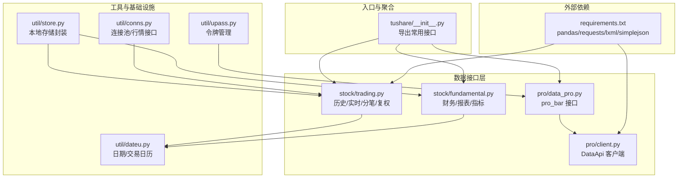
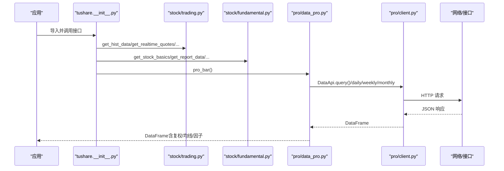
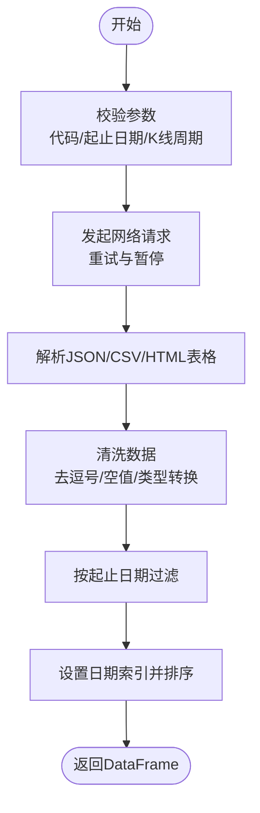
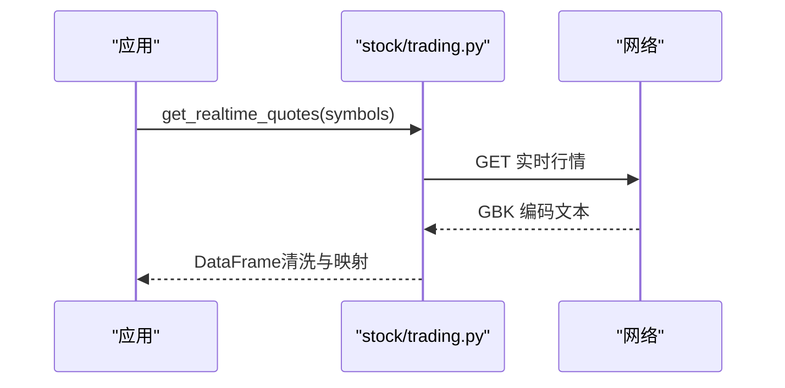
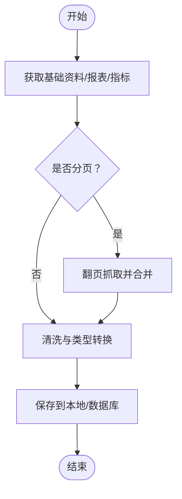
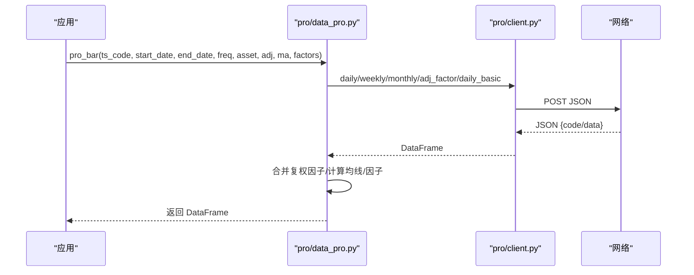
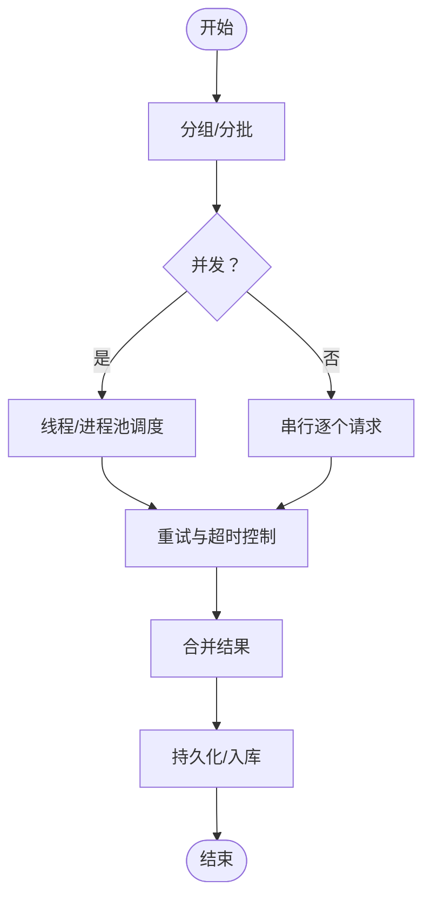
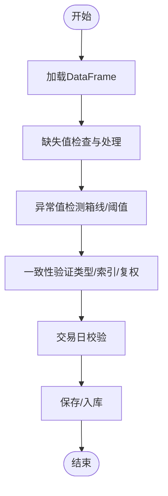
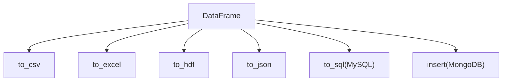
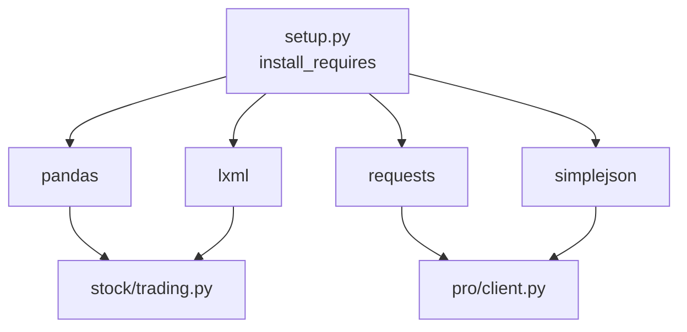

# 数据获取最佳实践

<cite>
**本文引用的文件**
- [README.md](file://README.md)
- [__init__.py](file://tushare/__init__.py)
- [client.py](file://tushare/pro/client.py)
- [data_pro.py](file://tushare/pro/data_pro.py)
- [trading.py](file://tushare/stock/trading.py)
- [fundamental.py](file://tushare/stock/fundamental.py)
- [dateu.py](file://tushare/util/dateu.py)
- [store.py](file://tushare/util/store.py)
- [conns.py](file://tushare/util/conns.py)
- [upass.py](file://tushare/util/upass.py)
- [requirements.txt](file://requirements.txt)
- [storing_test.py](file://test/storing_test.py)
- [bar_test.py](file://test/bar_test.py)
- [setup.py](file://setup.py)
</cite>

## 目录
1. [简介](#简介)
2. [项目结构](#项目结构)
3. [核心组件](#核心组件)
4. [架构总览](#架构总览)
5. [详细组件分析](#详细组件分析)
6. [依赖分析](#依赖分析)
7. [性能考量](#性能考量)
8. [故障排查指南](#故障排查指南)
9. [结论](#结论)
10. [附录](#附录)

## 简介
本指南围绕使用 TuShare 获取高质量的股票历史数据、财务数据与基本面数据，系统梳理从参数配置、时间范围选择、数据格式转换到质量检查、批量获取策略、存储与缓存的最佳实践，并提供从单一股票到多股票数据获取的完整实现路径。内容基于仓库中的接口实现与测试样例，确保可操作性与可追溯性。

## 项目结构
TuShare 通过模块化组织数据接口，主要模块包括：
- 股票行情与历史数据：tushare.stock.trading
- 财务与基本面数据：tushare.stock.fundamental
- Pro 数据接口与客户端封装：tushare.pro.data_pro 与 tushare.pro.client
- 工具与实用模块：tushare.util.*（日期工具、连接池、存储、令牌管理）
- 快速入口：tushare.__init__.py 将常用接口导出至包级命名空间
- 测试与示例：test/* 提供典型使用场景

图表来源
- [__init__.py:11-140](file://tushare/__init__.py#L11-L140)
- [trading.py:32-100](file://tushare/stock/trading.py#L32-L100)
- [fundamental.py:22-59](file://tushare/stock/fundamental.py#L22-L59)
- [data_pro.py:21-32](file://tushare/pro/data_pro.py#L21-L32)
- [client.py:17-52](file://tushare/pro/client.py#L17-L52)
- [dateu.py:78-84](file://tushare/util/dateu.py#L78-L84)
- [store.py:14-44](file://tushare/util/store.py#L14-L44)
- [conns.py:14-61](file://tushare/util/conns.py#L14-L61)
- [upass.py:16-31](file://tushare/util/upass.py#L16-L31)
- [requirements.txt:1-6](file://requirements.txt#L1-L6)

章节来源
- [__init__.py:11-140](file://tushare/__init__.py#L11-L140)
- [README.md:43-189](file://README.md#L43-L189)

## 核心组件
- 历史与实时行情接口：提供日线、分钟线、复权、实时报价、当日分笔等能力，支持重试与暂停参数，便于控制网络压力与稳定性。
- 财务与基本面接口：提供基础资料、利润表、资产负债表、现金流量表以及各类财务指标，适合构建因子与基本面研究。
- Pro 数据接口：统一的 pro_bar 接口，支持股票/指数/期货/基金/数字货币等多资产类别，支持复权、均线、因子（换手率、量比）等增强字段。
- 工具与基础设施：日期工具、连接池、令牌管理、本地存储封装，支撑批量获取与长期维护。

章节来源
- [trading.py:32-100](file://tushare/stock/trading.py#L32-L100)
- [trading.py:324-394](file://tushare/stock/trading.py#L324-L394)
- [trading.py:397-510](file://tushare/stock/trading.py#L397-L510)
- [trading.py:624-707](file://tushare/stock/trading.py#L624-L707)
- [fundamental.py:22-59](file://tushare/stock/fundamental.py#L22-L59)
- [fundamental.py:456-496](file://tushare/stock/fundamental.py#L456-L496)
- [data_pro.py:21-32](file://tushare/pro/data_pro.py#L21-L32)
- [data_pro.py:34-140](file://tushare/pro/data_pro.py#L34-L140)
- [client.py:17-52](file://tushare/pro/client.py#L17-L52)
- [dateu.py:78-84](file://tushare/util/dateu.py#L78-L84)
- [store.py:14-44](file://tushare/util/store.py#L14-L44)
- [conns.py:14-61](file://tushare/util/conns.py#L14-L61)
- [upass.py:16-31](file://tushare/util/upass.py#L16-L31)

## 架构总览
下图展示了从应用到数据源的调用链路与关键组件交互：

图表来源
- [__init__.py:11-140](file://tushare/__init__.py#L11-L140)
- [trading.py:32-100](file://tushare/stock/trading.py#L32-L100)
- [fundamental.py:22-59](file://tushare/stock/fundamental.py#L22-L59)
- [data_pro.py:34-140](file://tushare/pro/data_pro.py#L34-L140)
- [client.py:32-48](file://tushare/pro/client.py#L32-L48)

## 详细组件分析

### 历史与复权数据获取（get_hist_data / get_h_data / get_k_data）
- 关键点
  - 参数：股票代码、起止日期、K线周期、复权类型、重试次数、请求暂停间隔。
  - 数据清洗：去除逗号、空值填充、数值类型转换、按日期过滤与排序。
  - 复权：支持前复权、后复权与不复权；复权因子缺失时采用回填策略。
- 使用建议
  - 对于历史日线：优先使用 get_hist_data 或 get_k_data；若需复权，使用 get_h_data 或在 pro_bar 中启用 adj。
  - 控制请求频率：合理设置 pause，避免触发限流。
  - 时间范围：建议限定在一年以内以提升性能与稳定性。

图表来源
- [trading.py:32-100](file://tushare/stock/trading.py#L32-L100)
- [trading.py:397-510](file://tushare/stock/trading.py#L397-L510)
- [trading.py:624-707](file://tushare/stock/trading.py#L624-L707)

章节来源
- [trading.py:32-100](file://tushare/stock/trading.py#L32-L100)
- [trading.py:397-510](file://tushare/stock/trading.py#L397-L510)
- [trading.py:624-707](file://tushare/stock/trading.py#L624-L707)

### 实时行情与分笔数据（get_realtime_quotes / get_tick_data）
- 关键点
  - 实时行情：支持单只或批量，注意一次批量数量限制与字符编码处理。
  - 分笔数据：支持多数据源（新浪/腾讯/网易），自动处理编码与表头映射。
- 使用建议
  - 批量实时行情建议分批请求，避免超时。
  - 分笔数据量较大，建议按日期与股票维度落盘或入库。

图表来源
- [trading.py:324-394](file://tushare/stock/trading.py#L324-L394)

章节来源
- [trading.py:324-394](file://tushare/stock/trading.py#L324-L394)
- [trading.py:135-187](file://tushare/stock/trading.py#L135-L187)

### 财务与基本面数据（get_stock_basics / 报表/指标）
- 关键点
  - 基础资料：按交易日拉取，注意日期边界。
  - 报表与指标：分页抓取，统一清洗与列名映射。
  - 资产负债/利润/现金流：按股票代码拉取，注意编码与列类型。
- 使用建议
  - 财务数据通常按季度/年度发布，建议按报告期聚合。
  - 保存前进行缺失值与异常值检查。

图表来源
- [fundamental.py:22-59](file://tushare/stock/fundamental.py#L22-L59)
- [fundamental.py:62-126](file://tushare/stock/fundamental.py#L62-L126)
- [fundamental.py:456-496](file://tushare/stock/fundamental.py#L456-L496)

章节来源
- [fundamental.py:22-59](file://tushare/stock/fundamental.py#L22-L59)
- [fundamental.py:62-126](file://tushare/stock/fundamental.py#L62-L126)
- [fundamental.py:456-496](file://tushare/stock/fundamental.py#L456-L496)

### Pro 数据接口（pro_bar）
- 关键点
  - 支持多资产类别（E/I/FT/FD/C），多周期（D/W/M 及分钟级）。
  - 复权：通过 adj_factor 合并并计算前/后复权价格。
  - 增强字段：支持换手率、量比等因子字段。
  - 均线：可按 ma 参数动态计算并附加。
  - 错误重试：内置 retry_count 机制。
- 使用建议
  - 首次初始化：通过 upass.set_token 设置令牌，或在 pro_api 中传入 token。
  - 多资产与多周期组合：根据 asset/freq/exchange 等参数组合调用。
  - 复权与因子：在高频场景下谨慎启用 adj 与 factors，避免额外计算成本。

图表来源
- [data_pro.py:21-32](file://tushare/pro/data_pro.py#L21-L32)
- [data_pro.py:34-140](file://tushare/pro/data_pro.py#L34-L140)
- [client.py:32-48](file://tushare/pro/client.py#L32-L48)

章节来源
- [data_pro.py:21-32](file://tushare/pro/data_pro.py#L21-L32)
- [data_pro.py:34-140](file://tushare/pro/data_pro.py#L34-L140)
- [client.py:17-52](file://tushare/pro/client.py#L17-L52)

### 批量数据获取策略
- 单次批量：get_hists 支持对一组股票进行历史行情批量拉取。
- 连接池：利用 util/conns 的 get_apis/close_apis 管理行情连接，减少重复握手成本。
- 并发与重试：在应用层结合线程/进程池与指数回测框架，对失败任务进行重试；合理设置 pause 与 retry_count。
- 超时控制：统一设置请求超时，避免阻塞；对分页/分组任务设置阶段性超时阈值。

图表来源
- [trading.py:750-766](file://tushare/stock/trading.py#L750-L766)
- [conns.py:50-61](file://tushare/util/conns.py#L50-L61)

章节来源
- [trading.py:750-766](file://tushare/stock/trading.py#L750-L766)
- [conns.py:14-61](file://tushare/util/conns.py#L14-L61)

### 数据质量检查与清洗
- 缺失值处理：对 numeric 列进行空值填充或删除；复权因子缺失时采用回填策略。
- 异常值检测：对价格/成交量等字段设置上下界，识别极端波动或零值。
- 一致性验证：校验日期索引连续性、字段类型一致性、复权因子与价格的逻辑关系。
- 日期与交易日：使用 util/dateu 的交易日历与节假日判断，避免非交易日数据污染。

图表来源
- [dateu.py:78-99](file://tushare/util/dateu.py#L78-L99)
- [data_pro.py:92-107](file://tushare/pro/data_pro.py#L92-L107)

章节来源
- [dateu.py:78-99](file://tushare/util/dateu.py#L78-L99)
- [data_pro.py:92-107](file://tushare/pro/data_pro.py#L92-L107)

### 存储与缓存最佳实践
- 本地存储格式
  - CSV：轻量易用，适合快速导入/导出。
  - Excel：适合人工审阅与小规模共享。
  - HDF5：适合大规模时间序列存储与高效读写。
  - JSON：适合跨语言/跨系统传输。
- 索引与查询优化
  - 以日期为主索引，必要时建立复合索引（日期+代码）。
  - 对高频字段（如 close/open/high/low/volume）建立数值索引。
- 入库策略
  - MySQL：使用 to_sql，设置 if_exists='append' 与合适的分片。
  - MongoDB：适合非结构化/半结构化数据，注意字段类型与索引。
- 示例参考
  - CSV/XLS/HDF/JSON/SQL/NOSQL 的多种落地方式见测试样例。

图表来源
- [store.py:24-44](file://tushare/util/store.py#L24-L44)
- [storing_test.py:8-61](file://test/storing_test.py#L8-L61)

章节来源
- [store.py:14-44](file://tushare/util/store.py#L14-L44)
- [storing_test.py:8-61](file://test/storing_test.py#L8-L61)

## 依赖分析
- 核心依赖：pandas、requests、lxml、simplejson 等，保证数据处理、HTTP 请求与解析能力。
- 安装与升级：通过 pip 安装与升级，满足不同环境需求。
- 包导出：__init__.py 将常用接口集中导出，便于直接调用。

图表来源
- [requirements.txt:1-6](file://requirements.txt#L1-L6)
- [setup.py:65-74](file://setup.py#L65-L74)
- [client.py:11-14](file://tushare/pro/client.py#L11-L14)
- [trading.py:15-25](file://tushare/stock/trading.py#L15-L25)

章节来源
- [requirements.txt:1-6](file://requirements.txt#L1-L6)
- [setup.py:65-74](file://setup.py#L65-L74)
- [client.py:11-14](file://tushare/pro/client.py#L11-L14)
- [trading.py:15-25](file://tushare/stock/trading.py#L15-L25)

## 性能考量
- 请求节流：合理设置 pause，避免频繁请求导致限流或失败。
- 批量分片：对大批量任务进行分片与分批，降低单次请求规模。
- 复用连接：使用连接池（如 get_apis）减少握手开销。
- 数据缓存：对高频访问的静态数据（如基础资料、交易日历）进行本地缓存。
- 计算优化：在 pro_bar 中按需启用均线与因子，避免不必要的计算。

## 故障排查指南
- 网络错误与超时
  - 现象：抛出网络相关异常或返回空数据。
  - 处理：增加 retry_count，延长超时时间，检查代理与防火墙。
- 编码问题
  - 现象：中文乱码或解析失败。
  - 处理：统一使用 GBK/utf-8 解码，确保 headers 与编码一致。
- 复权因子缺失
  - 现象：复权价格异常或 NaN。
  - 处理：采用回填策略（bfill）补全 adj_factor，再进行复权计算。
- 令牌与权限
  - 现象：Pro 接口返回权限错误。
  - 处理：通过 upass.set_token 设置有效 token，或在 pro_api 中传入。

章节来源
- [trading.py:67-100](file://tushare/stock/trading.py#L67-L100)
- [data_pro.py:92-107](file://tushare/pro/data_pro.py#L92-L107)
- [upass.py:16-31](file://tushare/util/upass.py#L16-L31)

## 结论
通过合理配置参数、控制请求节奏、进行数据质量检查与持久化存储，结合批量与并发策略，可以稳定高效地获取高质量的股票历史、财务与基本面数据。Pro 接口提供了更强的扩展性与复权/因子能力，建议在需要多资产与多周期场景下优先使用；对于历史与实时行情，传统接口仍具备良好的易用性与兼容性。

## 附录
- 快速开始与示例
  - 历史数据：参见 README 的示例与说明。
  - Pro 初始化与调用：参见 pro_api 与 pro_bar 的实现与注释。
- 测试参考
  - 批量与存储：参考 bar_test 与 storing_test 的实现思路。

章节来源
- [README.md:43-189](file://README.md#L43-L189)
- [bar_test.py:16-18](file://test/bar_test.py#L16-L18)
- [storing_test.py:8-61](file://test/storing_test.py#L8-L61)