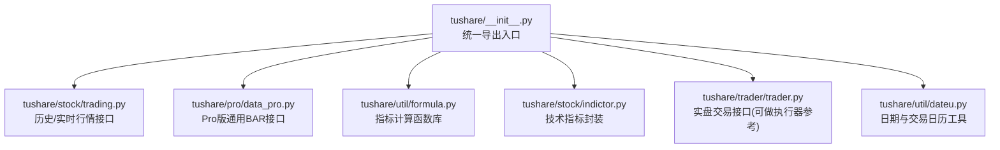
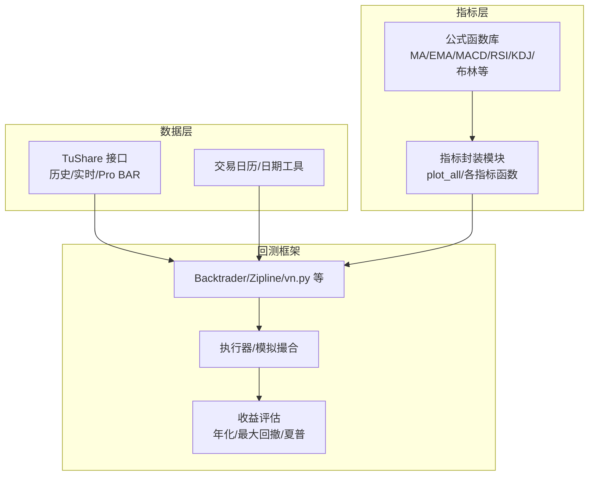
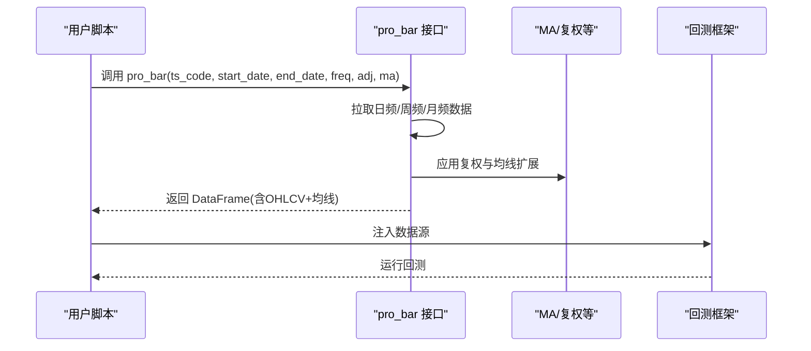
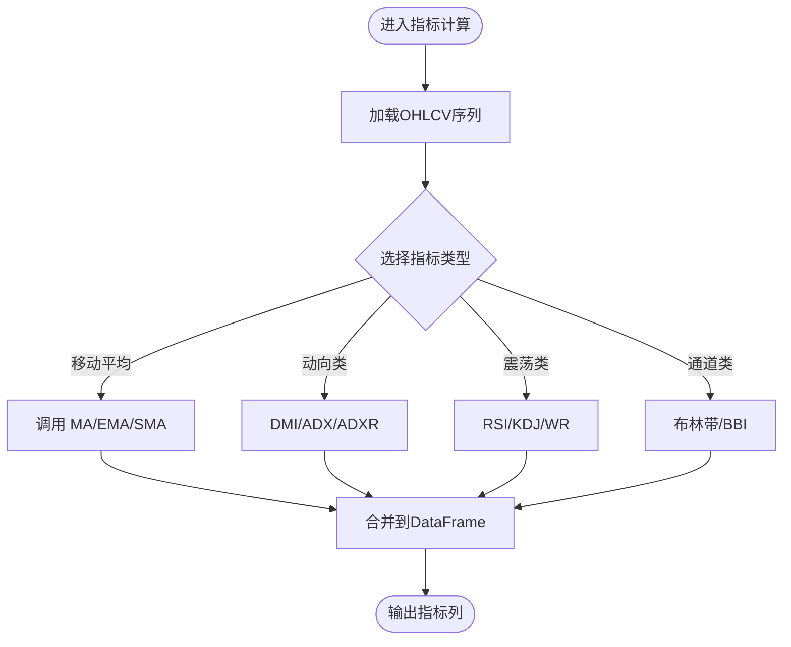
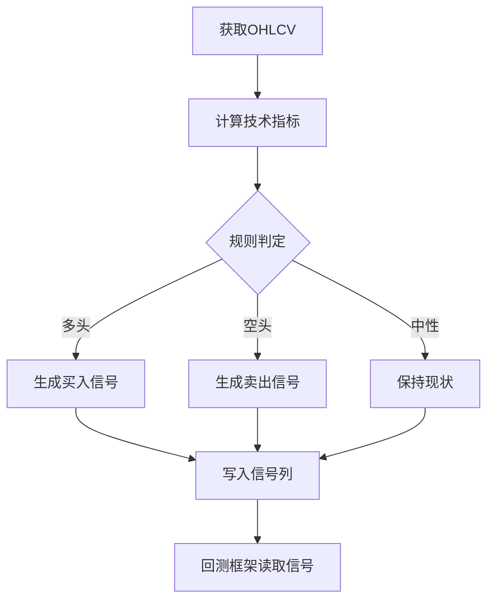
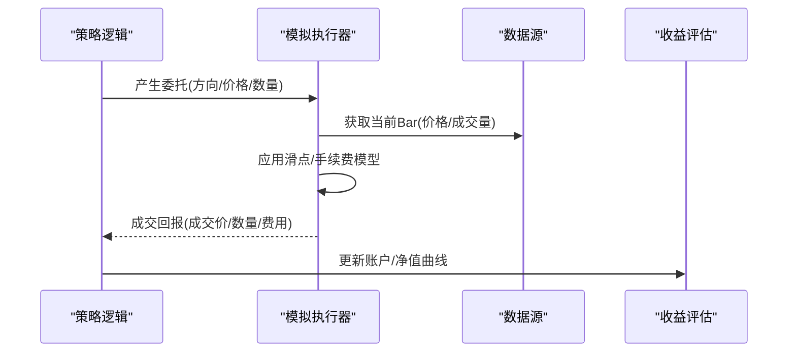
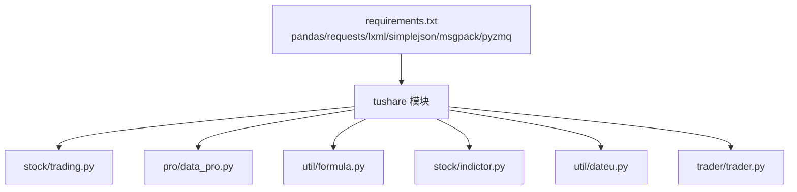

# 策略回测框架集成

<cite>
**本文引用的文件**
- [README.md](file://README.md)
- [setup.py](file://setup.py)
- [requirements.txt](file://requirements.txt)
- [tushare/__init__.py](file://tushare/__init__.py)
- [tushare/pro/data_pro.py](file://tushare/pro/data_pro.py)
- [tushare/util/formula.py](file://tushare/util/formula.py)
- [tushare/stock/trading.py](file://tushare/stock/trading.py)
- [tushare/stock/indictor.py](file://tushare/stock/indictor.py)
- [tushare/trader/trader.py](file://tushare/trader/trader.py)
- [tushare/util/dateu.py](file://tushare/util/dateu.py)
- [test/indictor_test.py](file://test/indictor_test.py)
- [test/bar_test.py](file://test/bar_test.py)
</cite>

## 目录
1. [简介](#简介)
2. [项目结构](#项目结构)
3. [核心组件](#核心组件)
4. [架构总览](#架构总览)
5. [详细组件分析](#详细组件分析)
6. [依赖分析](#依赖分析)
7. [性能考量](#性能考量)
8. [故障排查指南](#故障排查指南)
9. [结论](#结论)
10. [附录](#附录)

## 简介
本文件面向策略回测框架集成，系统性说明如何将 TuShare 获取的金融数据与主流量化回测框架（如 Backtrader、Zipline、vn.py 等）对接，涵盖数据准备、技术指标计算、信号生成、交易执行模拟、收益评估等全流程。文档基于仓库内现有模块与接口，提供可操作的集成路径与最佳实践，帮助读者快速完成从数据到回测再到结果分析的闭环。

## 项目结构
该项目采用按领域/模块划分的组织方式，核心入口位于根包导出，数据接口分布在 stock、pro、util 等子包中；回测相关能力主要体现在指标计算与数据准备两部分，交易执行接口用于实盘场景，亦可作为回测中“执行器”的参考模型。

**图表来源**
- [tushare/__init__.py:11-140](file://tushare/__init__.py#L11-L140)
- [tushare/stock/trading.py:32-100](file://tushare/stock/trading.py#L32-L100)
- [tushare/pro/data_pro.py:34-141](file://tushare/pro/data_pro.py#L34-L141)
- [tushare/util/formula.py:8-262](file://tushare/util/formula.py#L8-L262)
- [tushare/stock/indictor.py:12-800](file://tushare/stock/indictor.py#L12-L800)
- [tushare/trader/trader.py:20-329](file://tushare/trader/trader.py#L20-L329)
- [tushare/util/dateu.py:78-129](file://tushare/util/dateu.py#L78-L129)

**章节来源**
- [tushare/__init__.py:11-140](file://tushare/__init__.py#L11-L140)
- [README.md:43-189](file://README.md#L43-L189)

## 核心组件
- 数据获取层
  - 历史/实时行情：提供日线、分钟线、指数、复权等多类数据，适合回测基础数据源。
  - Pro BAR 接口：支持股票/指数/期货/基金/数字货币等多资产类别，可选复权与均线扩展。
- 指标计算层
  - 公式库：提供 MA、EMA、MACD、RSI、KDJ、布林带、威廉指标等常用技术指标。
  - 封装模块：提供简洁的函数接口，便于直接在回测管线中调用。
- 执行与评估层
  - 实盘交易接口：包含下单、撤单、持仓、成交等流程，可作为回测“执行器”的参考实现。
  - 日期工具：提供交易日历与节假日判断，有助于回测中的时间控制与风控。

**章节来源**
- [tushare/stock/trading.py:32-100](file://tushare/stock/trading.py#L32-L100)
- [tushare/pro/data_pro.py:34-141](file://tushare/pro/data_pro.py#L34-L141)
- [tushare/util/formula.py:80-262](file://tushare/util/formula.py#L80-L262)
- [tushare/stock/indictor.py:12-800](file://tushare/stock/indictor.py#L12-L800)
- [tushare/trader/trader.py:20-329](file://tushare/trader/trader.py#L20-L329)
- [tushare/util/dateu.py:78-129](file://tushare/util/dateu.py#L78-L129)

## 架构总览
下图展示了从数据获取到指标计算、信号生成与执行模拟的关键交互路径，以及与回测框架的对接建议。

**图表来源**
- [tushare/pro/data_pro.py:34-141](file://tushare/pro/data_pro.py#L34-L141)
- [tushare/util/formula.py:80-262](file://tushare/util/formula.py#L80-L262)
- [tushare/stock/indictor.py:779-800](file://tushare/stock/indictor.py#L779-L800)
- [tushare/util/dateu.py:78-129](file://tushare/util/dateu.py#L78-L129)

## 详细组件分析

### 数据获取与准备
- 历史行情接口
  - 支持日线、周线、月线、分钟线，可按起止日期过滤，返回 DataFrame，适合作为回测的基础 OHLCV 数据源。
  - 可结合复权选项与均线扩展，满足不同回测需求。
- Pro BAR 接口
  - 支持多资产类别与多周期，可选复权与均线扩展，适合跨市场、跨周期的统一数据准备。
  - 因其返回 DataFrame 的特性，可直接接入回测框架的数据管线。

**图表来源**
- [tushare/pro/data_pro.py:34-141](file://tushare/pro/data_pro.py#L34-L141)

**章节来源**
- [tushare/pro/data_pro.py:34-141](file://tushare/pro/data_pro.py#L34-L141)
- [tushare/stock/trading.py:32-100](file://tushare/stock/trading.py#L32-L100)

### 技术指标计算
- 公式函数库
  - 提供 MA、EMA、SMA、ATR、BOLL、RSI、KDJ、MACD、WR、BIAS、MFI 等指标，便于直接在回测中调用。
  - 函数返回序列或字典，易于拼接到 DataFrame 中供策略使用。
- 指标封装模块
  - 提供 plot_all 等可视化辅助函数，便于调试与验证指标有效性。
  - 指标函数与公式库一致，便于统一替换与扩展。

**图表来源**
- [tushare/util/formula.py:80-262](file://tushare/util/formula.py#L80-L262)
- [tushare/stock/indictor.py:12-800](file://tushare/stock/indictor.py#L12-L800)

**章节来源**
- [tushare/util/formula.py:80-262](file://tushare/util/formula.py#L80-L262)
- [tushare/stock/indictor.py:12-800](file://tushare/stock/indictor.py#L12-L800)

### 信号生成流程
- 通用步骤
  - 数据准备：使用 pro_bar 或历史行情接口获取 OHLCV。
  - 指标计算：调用公式函数库或指标封装模块生成信号所需的技术指标。
  - 规则定义：基于指标阈值、交叉、形态等规则生成买卖信号。
  - 时间约束：结合交易日历与节假日判断，避免非交易时段信号。
- 示例路径
  - 使用 pro_bar 获取复权后的日线数据。
  - 使用 RSI、MACD、布林带等指标生成多空信号。
  - 使用交易日历过滤无效日期，确保信号仅在交易日生效。

**图表来源**
- [tushare/pro/data_pro.py:34-141](file://tushare/pro/data_pro.py#L34-L141)
- [tushare/util/formula.py:80-262](file://tushare/util/formula.py#L80-L262)
- [tushare/util/dateu.py:78-129](file://tushare/util/dateu.py#L78-L129)

**章节来源**
- [tushare/pro/data_pro.py:34-141](file://tushare/pro/data_pro.py#L34-L141)
- [tushare/util/formula.py:80-262](file://tushare/util/formula.py#L80-L262)
- [tushare/util/dateu.py:78-129](file://tushare/util/dateu.py#L78-L129)

### 交易执行模拟
- 模拟要点
  - 委托与成交：参考实盘交易接口的下单/撤单/成交流程，抽象为回测中的“模拟撮合”。
  - 滑点与手续费：在执行器中加入滑点与手续费模型，提升回测真实性。
  - 资金管理：在回测框架中设置初始资金、仓位控制与风控阈值。
- 参考实现
  - 实盘交易接口提供了下单、撤单、持仓、成交等流程，可作为“执行器”的参考模型。

**图表来源**
- [tushare/trader/trader.py:106-174](file://tushare/trader/trader.py#L106-L174)
- [tushare/trader/trader.py:202-264](file://tushare/trader/trader.py#L202-L264)

**章节来源**
- [tushare/trader/trader.py:106-174](file://tushare/trader/trader.py#L106-L174)
- [tushare/trader/trader.py:202-264](file://tushare/trader/trader.py#L202-L264)

### 收益评估
- 关键指标
  - 年化收益率、最大回撤、夏普比率等，可在回测完成后统一计算。
  - 交易日历与节假日判断有助于准确计算交易天数与有效回测区间。
- 实施建议
  - 在回测框架中输出净值序列与交易清单，再统一计算各类指标。

**章节来源**
- [tushare/util/dateu.py:78-129](file://tushare/util/dateu.py#L78-L129)

## 依赖分析
- 外部依赖
  - pandas、requests、lxml、simplejson、msgpack、pyzmq 等，满足数据处理、网络请求与解析需求。
- 内部模块耦合
  - 指标模块依赖公式函数库；Pro BAR 接口依赖公式函数库与日期工具；回测框架通过 DataFrame 与这些模块解耦对接。

**图表来源**
- [requirements.txt:1-6](file://requirements.txt#L1-L6)
- [tushare/stock/trading.py:15-25](file://tushare/stock/trading.py#L15-L25)
- [tushare/pro/data_pro.py:9-11](file://tushare/pro/data_pro.py#L9-L11)
- [tushare/util/formula.py:4-6](file://tushare/util/formula.py#L4-L6)
- [tushare/stock/indictor.py:22-25](file://tushare/stock/indictor.py#L22-L25)
- [tushare/util/dateu.py:3-6](file://tushare/util/dateu.py#L3-L6)
- [tushare/trader/trader.py:10-18](file://tushare/trader/trader.py#L10-L18)

**章节来源**
- [requirements.txt:1-6](file://requirements.txt#L1-L6)
- [setup.py:65-74](file://setup.py#L65-L74)

## 性能考量
- 数据规模与频率
  - 日线回测通常性能压力较小；分钟级/Tick 数据会显著增加内存与计算开销，建议按需采样或分批处理。
- 指标计算
  - 公式函数库与指标封装模块均基于向量化操作，适合大规模回测；注意避免重复计算相同窗口的指标。
- I/O 与网络
  - Pro BAR 接口在网络不稳定时具备重试机制；在回测中建议离线缓存数据，减少重复拉取。

[本节为通用指导，无需特定文件引用]

## 故障排查指南
- 网络与权限
  - Pro BAR 接口需要有效的 token；若初始化失败，检查 token 设置与网络连通性。
- 数据缺失
  - 历史行情接口在无数据时返回空值；检查起止日期与代码是否正确。
- 指标异常
  - 指标计算依赖连续序列；若出现 NaN，检查数据去重与排序是否正确。
- 日期问题
  - 使用交易日历工具判断节假日与交易日，避免在非交易时段生成信号。

**章节来源**
- [tushare/pro/data_pro.py:21-32](file://tushare/pro/data_pro.py#L21-L32)
- [tushare/stock/trading.py:67-100](file://tushare/stock/trading.py#L67-L100)
- [tushare/util/dateu.py:78-129](file://tushare/util/dateu.py#L78-L129)

## 结论
通过 TuShare 的统一接口与丰富的指标函数库，可以高效完成策略回测的数据准备与信号生成；结合回测框架的执行与评估模块，即可形成从数据到结果的完整闭环。建议优先使用 Pro BAR 接口统一多资产与多周期数据，配合公式函数库与指标封装模块，快速搭建可扩展的回测体系。

[本节为总结性内容，无需特定文件引用]

## 附录

### 回测集成步骤清单
- 数据准备
  - 使用 pro_bar 获取目标资产的 OHLCV，必要时启用复权与均线扩展。
- 指标计算
  - 选择并调用相应指标函数，将结果列合并到数据框。
- 信号生成
  - 基于指标规则生成买卖信号，结合交易日历过滤非交易日。
- 执行模拟
  - 在回测框架中注入信号与数据，配置滑点与手续费模型。
- 收益评估
  - 输出净值曲线与交易清单，计算年化、最大回撤、夏普等指标。

**章节来源**
- [tushare/pro/data_pro.py:34-141](file://tushare/pro/data_pro.py#L34-L141)
- [tushare/util/formula.py:80-262](file://tushare/util/formula.py#L80-L262)
- [tushare/util/dateu.py:78-129](file://tushare/util/dateu.py#L78-L129)

### 测试参考
- 指标可视化测试
  - 使用指标封装模块的 plot_all 辅助函数验证指标有效性。
- BAR 数据测试
  - 使用测试用例调用 bar 接口，验证数据返回格式与字段完整性。

**章节来源**
- [test/indictor_test.py:13-18](file://test/indictor_test.py#L13-L18)
- [test/bar_test.py:16-18](file://test/bar_test.py#L16-L18)