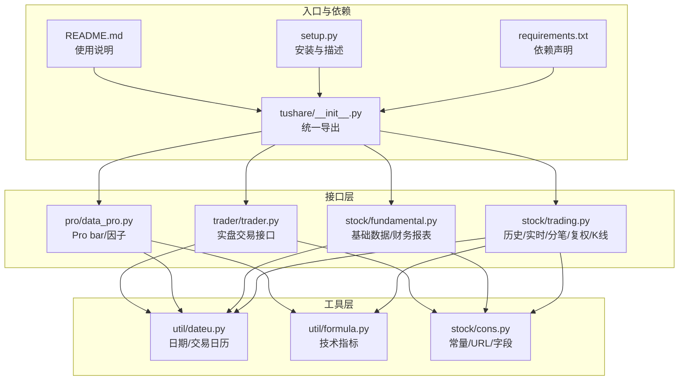
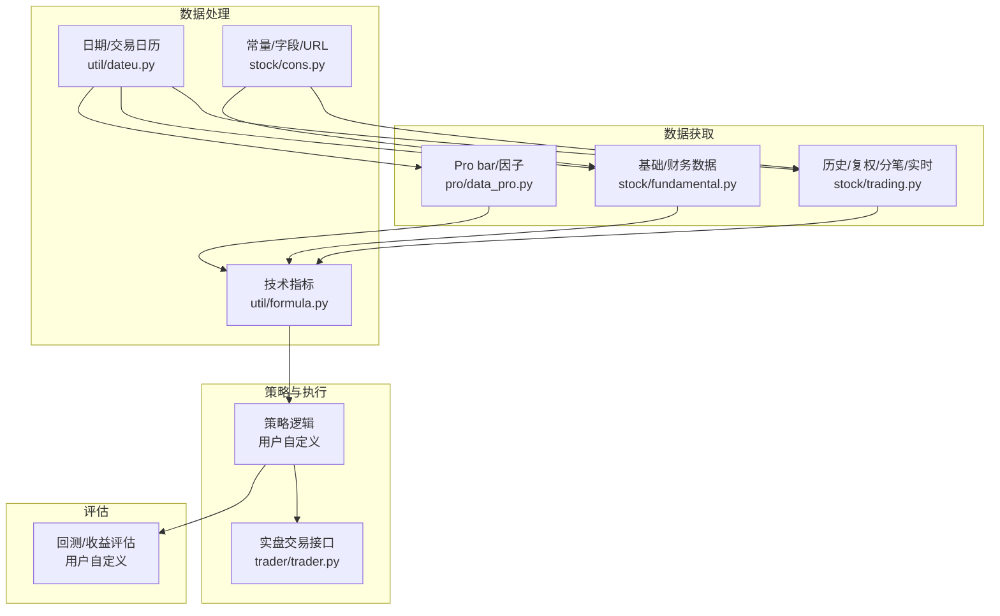
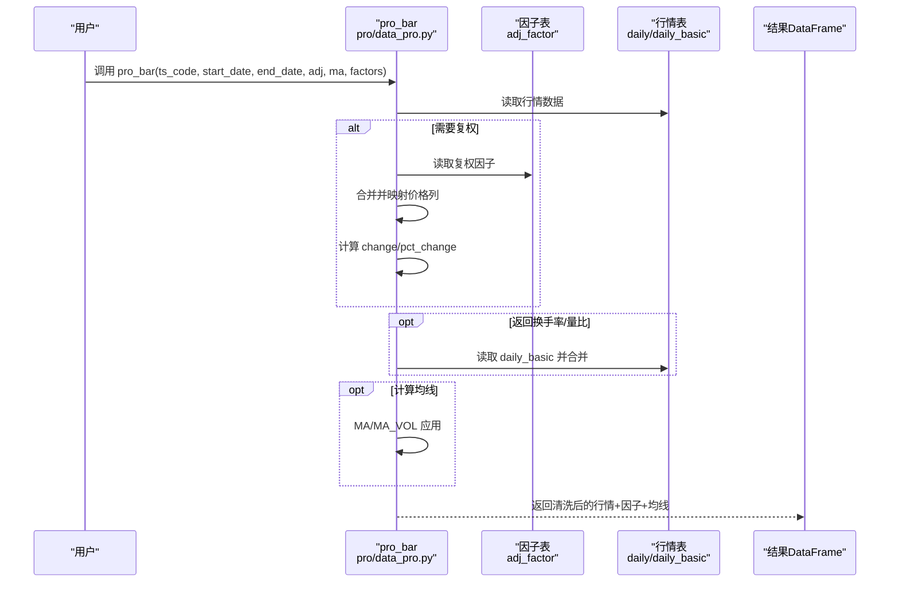
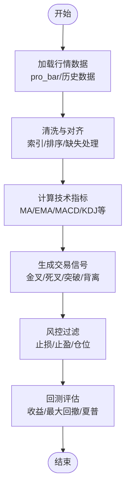
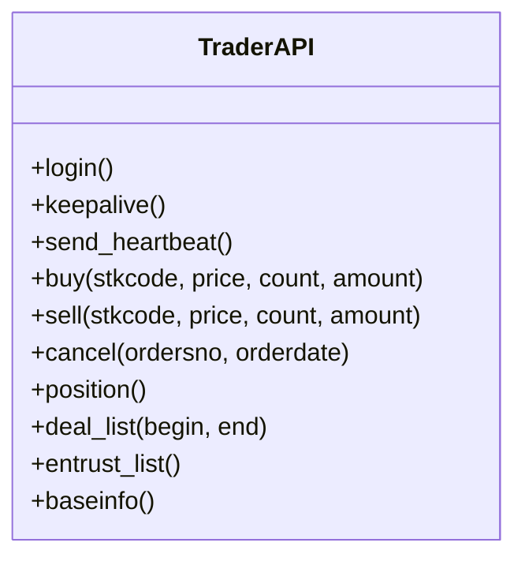
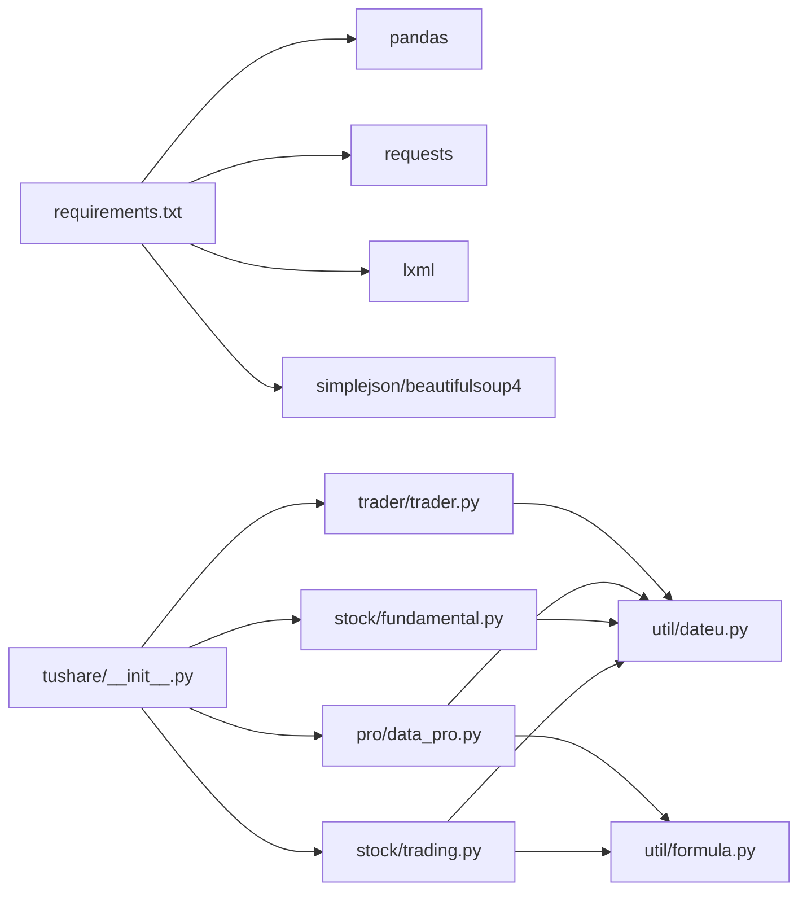

# 量化投资策略

<cite>
**本文引用的文件**
- [README.md](file://README.md)
- [requirements.txt](file://requirements.txt)
- [setup.py](file://setup.py)
- [tushare/__init__.py](file://tushare/__init__.py)
- [tushare/pro/data_pro.py](file://tushare/pro/data_pro.py)
- [tushare/stock/trading.py](file://tushare/stock/trading.py)
- [tushare/stock/fundamental.py](file://tushare/stock/fundamental.py)
- [tushare/util/dateu.py](file://tushare/util/dateu.py)
- [tushare/util/formula.py](file://tushare/util/formula.py)
- [tushare/stock/cons.py](file://tushare/stock/cons.py)
- [tushare/trader/trader.py](file://tushare/trader/trader.py)
- [test/trading_test.py](file://test/trading_test.py)
- [test/fund_test.py](file://test/fund_test.py)
- [test/bar_test.py](file://test/bar_test.py)
</cite>

## 目录
1. [引言](#引言)
2. [项目结构](#项目结构)
3. [核心组件](#核心组件)
4. [架构总览](#架构总览)
5. [详细组件分析](#详细组件分析)
6. [依赖关系分析](#依赖关系分析)
7. [性能考量](#性能考量)
8. [故障排查指南](#故障排查指南)
9. [结论](#结论)
10. [附录](#附录)

## 引言
本文件面向量化投资策略开发者，基于仓库中的TuShare工具，系统化梳理从数据采集、清洗、指标计算、信号生成、交易执行到回测评估的完整流程，并提供最佳实践与性能优化建议。读者无需深入编程背景，也可通过本文掌握策略落地的关键步骤与注意事项。

## 项目结构
该仓库采用按领域分层的组织方式：
- 接口入口与导出：tushare/__init__.py 将交易、基本面、宏观、分类、新闻、参考、Shibor、Pro API、LHB、工具等模块统一导出，便于用户按需导入。
- 数据接口层：stock/trading.py 提供历史行情、实时行情、分笔、复权、K线等数据接口；stock/fundamental.py 提供股票基础数据与财务报表数据接口；pro/data_pro.py 提供Tushare Pro的bar与因子接口。
- 工具与公式：util/dateu.py 提供日期与交易日历工具；util/formula.py 提供常用技术指标（MA、EMA、MACD、KDJ、RSI、布林带等）。
- 常量与配置：stock/cons.py 定义URL、字段、常量、K线类型等。
- 实盘交易：trader/trader.py 提供与券商系统的交互封装（注意：仅供研究与学习用途）。
- 测试用例：test/* 提供典型接口的使用示例与断言样例。

图表来源
- [tushare/__init__.py:11-140](file://tushare/__init__.py#L11-L140)
- [tushare/stock/trading.py:32-100](file://tushare/stock/trading.py#L32-L100)
- [tushare/stock/fundamental.py:22-59](file://tushare/stock/fundamental.py#L22-L59)
- [tushare/pro/data_pro.py:21-158](file://tushare/pro/data_pro.py#L21-L158)
- [tushare/util/dateu.py:78-129](file://tushare/util/dateu.py#L78-L129)
- [tushare/util/formula.py:8-262](file://tushare/util/formula.py#L8-L262)
- [tushare/stock/cons.py:9-453](file://tushare/stock/cons.py#L9-L453)
- [tushare/trader/trader.py:20-329](file://tushare/trader/trader.py#L20-L329)
- [requirements.txt:1-6](file://requirements.txt#L1-L6)
- [setup.py:65-100](file://setup.py#L65-L100)
- [README.md:43-188](file://README.md#L43-L188)

章节来源
- [tushare/__init__.py:11-140](file://tushare/__init__.py#L11-L140)
- [README.md:43-188](file://README.md#L43-L188)

## 核心组件
- 数据采集接口
  - 历史行情与复权：get_hist_data、get_h_data、get_k_data、get_day_all
  - 实时行情：get_realtime_quotes
  - 分笔与大单：get_tick_data、get_today_ticks、get_sina_dd
  - Pro bar与因子：pro_bar（支持日/周/月、复权、均线、换手率/量比）
- 基础与财务数据
  - get_stock_basics、报告/盈利/营运/成长/偿债/现金流等季度报表
  - 资产负债表、利润表、现金流量表
- 技术指标与公式
  - MA、EMA、SMA、MACD、KDJ、RSI、布林带、ATR、ROC、MFI、BIAS等
- 日期与交易日历
  - trade_cal、is_holiday、last_tddate、diff_day等
- 实盘交易（研究用途）
  - 登录、心跳、委托、撤单、成交、持仓、资金查询等

章节来源
- [tushare/stock/trading.py:32-100](file://tushare/stock/trading.py#L32-L100)
- [tushare/stock/trading.py:397-510](file://tushare/stock/trading.py#L397-L510)
- [tushare/stock/trading.py:624-707](file://tushare/stock/trading.py#L624-L707)
- [tushare/stock/trading.py:135-187](file://tushare/stock/trading.py#L135-L187)
- [tushare/stock/trading.py:232-275](file://tushare/stock/trading.py#L232-L275)
- [tushare/pro/data_pro.py:34-140](file://tushare/pro/data_pro.py#L34-L140)
- [tushare/stock/fundamental.py:22-59](file://tushare/stock/fundamental.py#L22-L59)
- [tushare/stock/fundamental.py:62-191](file://tushare/stock/fundamental.py#L62-L191)
- [tushare/stock/fundamental.py:456-518](file://tushare/stock/fundamental.py#L456-L518)
- [tushare/util/formula.py:8-262](file://tushare/util/formula.py#L8-L262)
- [tushare/util/dateu.py:78-129](file://tushare/util/dateu.py#L78-L129)
- [tushare/trader/trader.py:20-329](file://tushare/trader/trader.py#L20-L329)

## 架构总览
下图展示了从数据获取到策略执行的端到端流程：数据接口层负责采集历史/实时/财务数据；工具层提供日期与技术指标；策略层基于指标生成信号并驱动交易；回测与评估模块对策略进行收益与风险评估。

图表来源
- [tushare/stock/trading.py:32-100](file://tushare/stock/trading.py#L32-L100)
- [tushare/stock/fundamental.py:22-59](file://tushare/stock/fundamental.py#L22-L59)
- [tushare/pro/data_pro.py:34-140](file://tushare/pro/data_pro.py#L34-L140)
- [tushare/util/dateu.py:78-129](file://tushare/util/dateu.py#L78-L129)
- [tushare/util/formula.py:8-262](file://tushare/util/formula.py#L8-L262)
- [tushare/stock/cons.py:9-453](file://tushare/stock/cons.py#L9-L453)
- [tushare/trader/trader.py:20-329](file://tushare/trader/trader.py#L20-L329)

## 详细组件分析

### 数据获取与最佳实践
- 历史与复权数据
  - 使用 get_hist_data、get_h_data、get_k_data 获取日线、复权、分钟线等；注意起止日期与复权类型（qfq/hfq/None）。
  - 复权因子处理：get_h_data 内部解析复权因子并按类型转换；Pro接口通过 adj 参数与因子表合并实现复权。
- 实时行情与分笔
  - get_realtime_quotes 支持批量获取；get_tick_data、get_today_ticks 获取逐笔明细；get_sina_dd 获取大单明细。
- Pro bar与因子
  - pro_bar 支持多资产类型（股票/指数/期货/期权/基金/数字货币），可选复权、均线、换手率/量比等因子；内部通过因子表与行情表合并，保证字段一致性。
- 最佳实践
  - 明确时间窗口：使用 util/dateu 的 trade_cal、is_holiday、last_tddate 等辅助判断交易日与跨年区间。
  - 控制请求频率：接口普遍支持 retry_count 与 pause，避免触发限流。
  - 数据清洗：统一索引、排序、缺失值处理、异常值剔除、字段类型转换（数值/时间）。

图表来源
- [tushare/pro/data_pro.py:34-140](file://tushare/pro/data_pro.py#L34-L140)

章节来源
- [tushare/stock/trading.py:32-100](file://tushare/stock/trading.py#L32-L100)
- [tushare/stock/trading.py:397-510](file://tushare/stock/trading.py#L397-L510)
- [tushare/stock/trading.py:624-707](file://tushare/stock/trading.py#L624-L707)
- [tushare/pro/data_pro.py:34-140](file://tushare/pro/data_pro.py#L34-L140)
- [tushare/util/dateu.py:78-129](file://tushare/util/dateu.py#L78-L129)

### 技术指标与信号生成
- 指标库
  - 移动平均类：MA、EMA、SMA
  - 动量类：ROC、MTM、OSC
  - 波动类：ATR、BOLL
  - 趋势类：MACD、BBI、BBIBOLL
  - 超买超卖：KDJ、SKDJ、RSI、WR、MFI
  - 其他：BIAS、ADTM、DDI 等
- 使用建议
  - 在 pro_bar 返回的DataFrame上直接应用指标函数，注意缺失值与滚动窗口边界。
  - 对多周期（日/周/月）策略，建议在不同频率上分别计算指标并做合成。

图表来源
- [tushare/util/formula.py:8-262](file://tushare/util/formula.py#L8-L262)
- [tushare/pro/data_pro.py:34-140](file://tushare/pro/data_pro.py#L34-L140)

章节来源
- [tushare/util/formula.py:8-262](file://tushare/util/formula.py#L8-L262)

### 财务与基本面数据
- 基础数据：get_stock_basics 提供市盈率、市净率、总股本、流通股本、每股收益、每股净资产等。
- 季度报表：报告/盈利/营运/成长/偿债/现金流等，支持按年份与季度筛选。
- 财务报表：资产负债表、利润表、现金流量表。
- 使用建议
  - 以季度为单位聚合财务数据，结合股价走势进行估值与质量筛选。
  - 注意数据时效性与缺失项，必要时以最近报告期填充。

章节来源
- [tushare/stock/fundamental.py:22-59](file://tushare/stock/fundamental.py#L22-L59)
- [tushare/stock/fundamental.py:62-191](file://tushare/stock/fundamental.py#L62-L191)
- [tushare/stock/fundamental.py:456-518](file://tushare/stock/fundamental.py#L456-L518)

### 交易执行与风控
- 实盘交易接口（研究用途）
  - 登录、心跳保活、委托买入/卖出、撤单、查询持仓/成交/委托单、账户资金。
  - 注意：该模块为研究用途，实际下单存在风险，需严格遵守合规要求。
- 风控要点
  - 仓位控制：按账户可用资金与保证金比例设定最大头寸。
  - 止损止盈：基于ATR或固定百分比设置动态/静态止损。
  - 分散投资：按行业/风格/集中度限制分散，避免过度集中。
  - 撮合与滑点：考虑流动性与滑点对收益的影响。

图表来源
- [tushare/trader/trader.py:20-329](file://tushare/trader/trader.py#L20-L329)

章节来源
- [tushare/trader/trader.py:20-329](file://tushare/trader/trader.py#L20-L329)

### 回测框架集成方案
- 数据准备
  - 使用 pro_bar 或历史接口获取统一格式的行情数据，确保日期连续与对齐。
- 指标与信号
  - 在行情数据上计算所需指标，生成买卖信号（如穿越、突破、形态）。
- 交易执行
  - 信号→下单（实盘或模拟）→成交回报→持仓更新→资金变化。
- 收益评估
  - 计算净值曲线、年化收益、最大回撤、夏普比率、胜率、盈亏比等。
- 风险管理
  - 严格控制单/组合风险敞口，设置止损止盈与分散度阈值。

章节来源
- [tushare/pro/data_pro.py:34-140](file://tushare/pro/data_pro.py#L34-L140)
- [tushare/util/formula.py:8-262](file://tushare/util/formula.py#L8-L262)
- [tushare/trader/trader.py:20-329](file://tushare/trader/trader.py#L20-L329)

### 完整策略代码示例（路径指引）
以下为从数据获取到策略执行的全流程路径指引（不直接展示代码内容）：
- 获取历史/复权数据
  - [tushare/stock/trading.py:get_hist_data:32-100](file://tushare/stock/trading.py#L32-L100)
  - [tushare/stock/trading.py:get_h_data:397-510](file://tushare/stock/trading.py#L397-L510)
  - [tushare/pro/data_pro.py:pro_bar:34-140](file://tushare/pro/data_pro.py#L34-L140)
- 计算技术指标
  - [tushare/util/formula.py:MA/EMA/MACD/KDJ/RSI/BOLL等:8-262](file://tushare/util/formula.py#L8-L262)
- 生成信号与回测
  - 用户策略逻辑（在上述数据与指标基础上编写）
- 实盘交易（研究用途）
  - [tushare/trader/trader.py:TraderAPI:20-329](file://tushare/trader/trader.py#L20-L329)

章节来源
- [tushare/stock/trading.py:32-100](file://tushare/stock/trading.py#L32-L100)
- [tushare/stock/trading.py:397-510](file://tushare/stock/trading.py#L397-L510)
- [tushare/pro/data_pro.py:34-140](file://tushare/pro/data_pro.py#L34-L140)
- [tushare/util/formula.py:8-262](file://tushare/util/formula.py#L8-L262)
- [tushare/trader/trader.py:20-329](file://tushare/trader/trader.py#L20-L329)

## 依赖关系分析
- 外部依赖
  - pandas、requests、lxml、simplejson、beautifulsoup4 等，用于数据结构、HTTP请求与解析。
- 内部依赖
  - trading/fundamental/pro/data_pro 依赖 util/dateu 与 util/formula；trader 依赖 util/upass 与内部变量模块。
- 导出与入口
  - tushare/__init__.py 将各模块统一导出，便于用户按需导入。

图表来源
- [requirements.txt:1-6](file://requirements.txt#L1-L6)
- [tushare/__init__.py:11-140](file://tushare/__init__.py#L11-L140)
- [tushare/stock/trading.py:11-25](file://tushare/stock/trading.py#L11-L25)
- [tushare/stock/fundamental.py:9-16](file://tushare/stock/fundamental.py#L9-L16)
- [tushare/pro/data_pro.py:9-11](file://tushare/pro/data_pro.py#L9-L11)
- [tushare/trader/trader.py:10-18](file://tushare/trader/trader.py#L10-L18)

章节来源
- [requirements.txt:1-6](file://requirements.txt#L1-L6)
- [tushare/__init__.py:11-140](file://tushare/__init__.py#L11-L140)

## 性能考量
- 数据获取
  - 合理设置 retry_count 与 pause，避免频繁请求导致限流。
  - 对历史数据分段拉取（按季度/年份），减少单次请求规模。
- 数据处理
  - 使用pandas的向量化操作与内置滚动函数，避免显式循环。
  - 对长序列滚动指标，优先使用EMA/滑动窗口的高效实现。
- 指标计算
  - 将指标计算集中在DataFrame上，减少多次遍历。
  - 对高频数据（分钟级）建议缓存中间结果，避免重复计算。
- 并发与异步
  - 多标的并行拉取建议使用线程池/进程池，但需注意接口限流与反爬策略。
  - 对实时行情，建议使用事件驱动或定时器，避免阻塞主线程。
- 存储与内存
  - 使用分块写入与压缩存储，降低磁盘占用。
  - 及时释放不再使用的中间变量，避免内存泄漏。

## 故障排查指南
- 网络与超时
  - 若出现网络错误提示，检查 retry_count 与 pause 设置，确认代理与防火墙策略。
  - 关键接口抛出网络异常时，建议重试并记录错误日志。
- 数据为空或字段缺失
  - 检查起止日期是否跨越非交易日，使用 trade_cal 与 is_holiday 辅助校验。
  - 复权数据缺失时，确认因子表是否存在以及合并逻辑是否正确。
- 指标异常
  - 滚动窗口过长导致首N行缺失属正常现象，需在信号生成阶段忽略无效窗口。
  - 对缺失值进行插值或剔除，避免影响后续信号。
- 实盘交易
  - 心跳失效或登录失败时，检查登录流程与验证码处理；必要时重新登录。
  - 撤单/成交查询需核对委托单号与日期格式。

章节来源
- [tushare/stock/trading.py:67-100](file://tushare/stock/trading.py#L67-L100)
- [tushare/util/dateu.py:87-99](file://tushare/util/dateu.py#L87-L99)
- [tushare/pro/data_pro.py:135-140](file://tushare/pro/data_pro.py#L135-L140)
- [tushare/trader/trader.py:44-75](file://tushare/trader/trader.py#L44-L75)

## 结论
本项目提供了从数据采集、清洗、指标计算到交易执行与回测评估的完整工具链。通过合理运用历史/实时/财务数据接口、技术指标库与风控模块，可以快速搭建并验证量化策略。建议在实盘前充分进行回测与压力测试，并严格遵守合规与风控要求。

## 附录
- 快速开始与示例
  - 参考 README 的示例与安装说明，了解基本用法与接口能力。
- 测试用例参考
  - trading_test、fund_test、bar_test 提供典型接口调用示例，可作为策略脚本模板。

章节来源
- [README.md:43-188](file://README.md#L43-L188)
- [test/trading_test.py:18-43](file://test/trading_test.py#L18-L43)
- [test/fund_test.py:15-43](file://test/fund_test.py#L15-L43)
- [test/bar_test.py:16-23](file://test/bar_test.py#L16-L23)