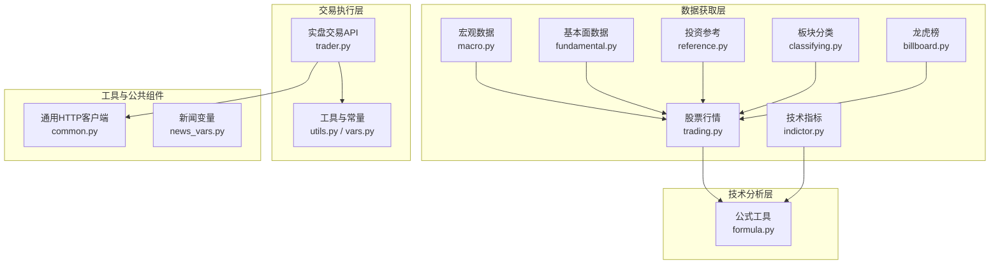
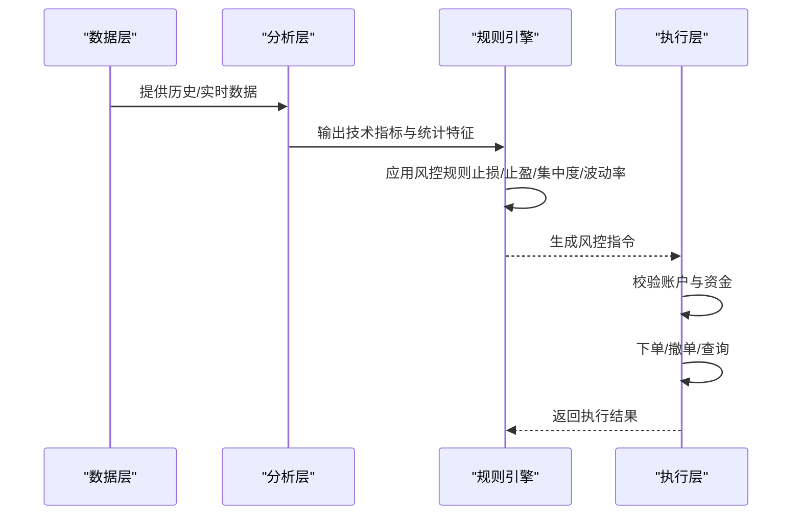
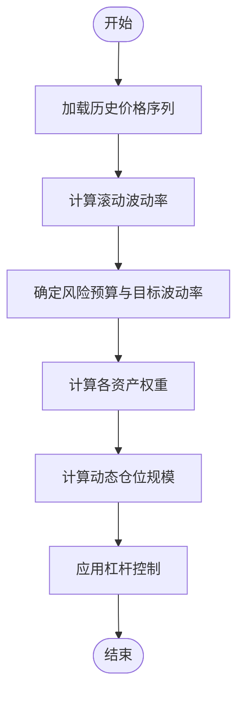
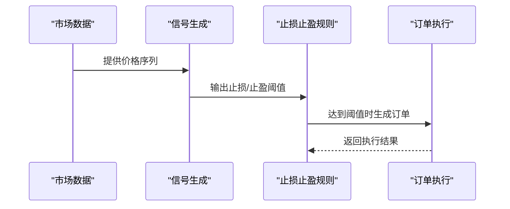
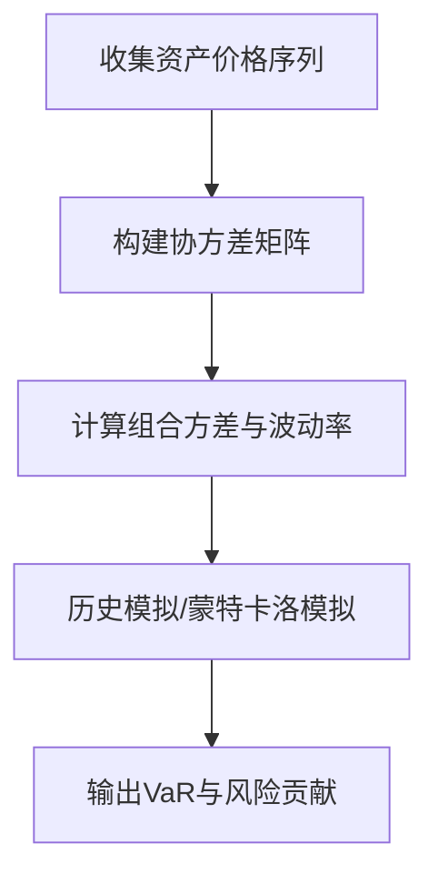
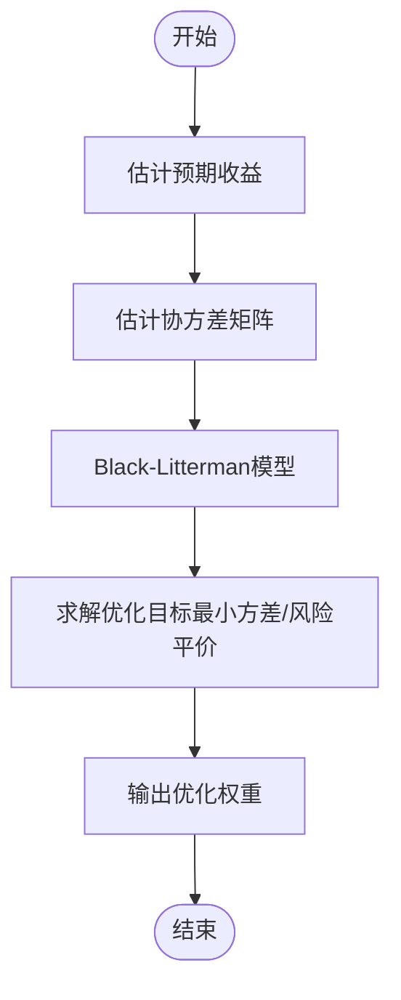
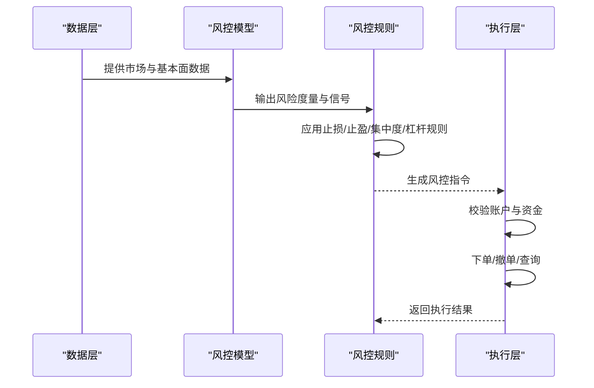
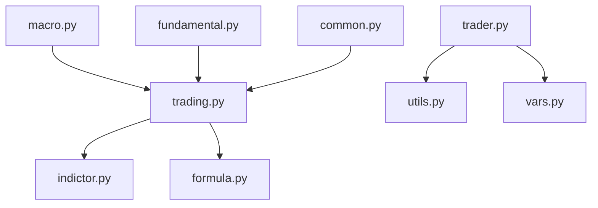

# 风险管理实现方案

<cite>
**本文档引用的文件**
- [README.md](file://README.md)
- [trader.py](file://tushare/trader/trader.py)
- [utils.py](file://tushare/trader/utils.py)
- [vars.py](file://tushare/trader/vars.py)
- [common.py](file://tushare/util/common.py)
- [formula.py](file://tushare/util/formula.py)
- [indictor.py](file://tushare/stock/indictor.py)
- [trading.py](file://tushare/stock/trading.py)
- [macro.py](file://tushare/stock/macro.py)
- [macro_vars.py](file://tushare/stock/macro_vars.py)
- [fundamental.py](file://tushare/stock/fundamental.py)
- [reference.py](file://tushare/stock/reference.py)
- [classifying.py](file://tushare/stock/classifying.py)
- [billboard.py](file://tushare/stock/billboard.py)
- [news_vars.py](file://tushare/stock/news_vars.py)
</cite>

## 目录
1. [引言](#引言)
2. [项目结构](#项目结构)
3. [核心组件](#核心组件)
4. [架构概览](#架构概览)
5. [详细组件分析](#详细组件分析)
6. [依赖关系分析](#依赖关系分析)
7. [性能考量](#性能考量)
8. [故障排除指南](#故障排除指南)
9. [结论](#结论)
10. [附录](#附录)

## 引言
本技术指南围绕量化投资中的风险管理实现展开，结合仓库中现有的数据获取与交易接口能力，系统阐述风险控制策略的设计与落地方法。内容涵盖：
- 仓位控制模型与动态调整
- 止损止盈机制
- 分散投资原则
- 基于波动率的资金分配与杠杆控制
- 风险度量与监控（VaR、压力测试）
- 交易成本控制（滑点、频率、佣金）
- 组合优化（有效前沿、Black-Litterman、风险平价）
- 从风险识别到控制执行的全流程实现路径

本指南既面向有一定编程基础的开发者，也兼顾非技术读者的理解需求。

## 项目结构
该仓库主要由以下模块构成：
- 数据获取层：提供股票、指数、宏观、基本面、融资融券、龙虎榜等多维度数据接口
- 技术分析层：提供常用技术指标与公式封装
- 交易执行层：提供实盘交易接口（模拟风控执行环境）
- 工具与公共组件：提供通用HTTP客户端、公式工具等

**图表来源**
- [trading.py:32-100](file://tushare/stock/trading.py#L32-L100)
- [indictor.py:12-42](file://tushare/stock/indictor.py#L12-L42)
- [macro.py:23-55](file://tushare/stock/macro.py#L23-L55)
- [fundamental.py:22-59](file://tushare/stock/fundamental.py#L22-L59)
- [reference.py:28-75](file://tushare/stock/reference.py#L28-L75)
- [classifying.py:27-59](file://tushare/stock/classifying.py#L27-L59)
- [billboard.py:28-95](file://tushare/stock/billboard.py#L28-L95)
- [formula.py:8-26](file://tushare/util/formula.py#L8-L26)
- [trader.py:20-329](file://tushare/trader/trader.py#L20-L329)
- [utils.py:16-37](file://tushare/trader/utils.py#L16-L37)
- [vars.py:9-42](file://tushare/trader/vars.py#L9-L42)
- [common.py:18-86](file://tushare/util/common.py#L18-L86)
- [news_vars.py:1-10](file://tushare/stock/news_vars.py#L1-L10)

**章节来源**
- [README.md:1-411](file://README.md#L1-L411)
- [trading.py:32-100](file://tushare/stock/trading.py#L32-L100)
- [indictor.py:12-42](file://tushare/stock/indictor.py#L12-L42)
- [macro.py:23-55](file://tushare/stock/macro.py#L23-L55)
- [fundamental.py:22-59](file://tushare/stock/fundamental.py#L22-L59)
- [reference.py:28-75](file://tushare/stock/reference.py#L28-L75)
- [classifying.py:27-59](file://tushare/stock/classifying.py#L27-L59)
- [billboard.py:28-95](file://tushare/stock/billboard.py#L28-L95)
- [formula.py:8-26](file://tushare/util/formula.py#L8-L26)
- [trader.py:20-329](file://tushare/trader/trader.py#L20-L329)
- [utils.py:16-37](file://tushare/trader/utils.py#L16-L37)
- [vars.py:9-42](file://tushare/trader/vars.py#L9-L42)
- [common.py:18-86](file://tushare/util/common.py#L18-L86)
- [news_vars.py:1-10](file://tushare/stock/news_vars.py#L1-L10)

## 核心组件
- 数据获取组件：提供历史行情、实时行情、复权数据、分笔数据、指数行情等，支撑风险建模与回测
- 技术分析组件：提供移动平均、指数平滑、布林带、MACD、RSI等指标，用于信号生成与风险过滤
- 宏观与基本面组件：提供GDP、CPI、PPI、货币供应量、公司财务数据等，辅助系统性风险判断
- 交易执行组件：提供下单、撤单、持仓、成交查询等接口，支撑风控规则的自动化执行
- 工具组件：提供HTTP客户端、JSON解析、验证码识别等基础设施

**章节来源**
- [trading.py:32-100](file://tushare/stock/trading.py#L32-L100)
- [indictor.py:12-42](file://tushare/stock/indictor.py#L12-L42)
- [macro.py:179-201](file://tushare/stock/macro.py#L179-L201)
- [fundamental.py:22-59](file://tushare/stock/fundamental.py#L22-L59)
- [trader.py:106-174](file://tushare/trader/trader.py#L106-L174)
- [common.py:18-86](file://tushare/util/common.py#L18-L86)

## 架构概览
整体架构采用“数据驱动 + 规则引擎”的模式：
- 数据层：通过trading.py、macro.py、fundamental.py等模块获取市场与基本面数据
- 分析层：利用formula.py与indictor.py进行技术分析与统计指标计算
- 决策层：基于规则（如波动率阈值、止损止盈、集中度限制）生成交易指令
- 执行层：通过trader.py对接券商接口，完成下单、撤单、查询等操作

**图表来源**
- [trading.py:32-100](file://tushare/stock/trading.py#L32-L100)
- [formula.py:8-26](file://tushare/util/formula.py#L8-L26)
- [indictor.py:12-42](file://tushare/stock/indictor.py#L12-L42)
- [trader.py:106-174](file://tushare/trader/trader.py#L106-L174)

## 详细组件分析

### 仓位控制模型与动态调整
- 基于波动率的动态仓位：利用历史价格序列计算滚动波动率，将波动率与目标风险预算结合，得到动态仓位系数
- 资金分配策略：按各资产预期收益与波动率进行配比，避免过度集中在高波动资产
- 杠杆控制：在系统性风险上升时降低杠杆倍数，维持固定的风险敞口

**图表来源**
- [trading.py:32-100](file://tushare/stock/trading.py#L32-L100)
- [formula.py:76-77](file://tushare/util/formula.py#L76-L77)
- [indictor.py:45-75](file://tushare/stock/indictor.py#L45-L75)

**章节来源**
- [trading.py:32-100](file://tushare/stock/trading.py#L32-L100)
- [formula.py:76-77](file://tushare/util/formula.py#L76-L77)
- [indictor.py:45-75](file://tushare/stock/indictor.py#L45-L75)

### 止损止盈机制
- 止损：基于ATR或滚动标准差设置动态止损位，结合趋势指标过滤假突破
- 止盈：采用移动止盈或百分比回撤止盈，避免利润回吐
- 触发条件：价格触及阈值后自动触发订单，执行止损或止盈

**图表来源**
- [formula.py:28-34](file://tushare/util/formula.py#L28-L34)
- [indictor.py:250-277](file://tushare/stock/indictor.py#L250-L277)
- [trader.py:106-174](file://tushare/trader/trader.py#L106-L174)

**章节来源**
- [formula.py:28-34](file://tushare/util/formula.py#L28-L34)
- [indictor.py:250-277](file://tushare/stock/indictor.py#L250-L277)
- [trader.py:106-174](file://tushare/trader/trader.py#L106-L174)

### 分散投资原则
- 行业/概念/地域分散：通过classifying.py获取行业、概念、地域分类，避免过度集中
- 个股集中度控制：对单一股票设置最大头寸比例
- 跨市场分散：结合指数与商品数据，平衡不同市场间的相关性

**章节来源**
- [classifying.py:27-59](file://tushare/stock/classifying.py#L27-L59)
- [classifying.py:118-132](file://tushare/stock/classifying.py#L118-L132)

### 风险度量与监控
- VaR计算：基于历史模拟法或蒙特卡洛模拟，计算在给定置信水平下的最大潜在损失
- 压力测试：模拟极端市场情景（如黑天鹅事件），评估组合在压力下的表现
- 风险价值评估：结合波动率、相关性矩阵与投资组合权重，计算组合风险贡献

**图表来源**
- [trading.py:32-100](file://tushare/stock/trading.py#L32-L100)
- [macro.py:179-201](file://tushare/stock/macro.py#L179-L201)

**章节来源**
- [trading.py:32-100](file://tushare/stock/trading.py#L32-L100)
- [macro.py:179-201](file://tushare/stock/macro.py#L179-L201)

### 交易成本控制
- 滑点建模：基于Tick数据与买卖价差，估算滑点对收益的影响
- 交易频率优化：通过indictor中的趋势与震荡指标，减少噪声交易
- 佣金最小化：结合交易量与手续费结构，选择最优交易时机与批量下单策略

**章节来源**
- [trading.py:135-187](file://tushare/stock/trading.py#L135-L187)
- [indictor.py:125-158](file://tushare/stock/indictor.py#L125-L158)

### 组合优化
- 有效前沿：在给定预期收益目标下，求解最小方差组合
- Black-Litterman：引入投资者观点与市场均衡收益，修正贝叶斯估计
- 风险平价：按风险贡献相等的原则分配权重，提升组合稳定性

**图表来源**
- [trading.py:32-100](file://tushare/stock/trading.py#L32-L100)
- [fundamental.py:22-59](file://tushare/stock/fundamental.py#L22-L59)

**章节来源**
- [trading.py:32-100](file://tushare/stock/trading.py#L32-L100)
- [fundamental.py:22-59](file://tushare/stock/fundamental.py#L22-L59)

### 从风险识别到控制执行的全流程

**图表来源**
- [trading.py:32-100](file://tushare/stock/trading.py#L32-L100)
- [trader.py:106-174](file://tushare/trader/trader.py#L106-L174)

**章节来源**
- [trading.py:32-100](file://tushare/stock/trading.py#L32-L100)
- [trader.py:106-174](file://tushare/trader/trader.py#L106-L174)

## 依赖关系分析
- 数据依赖：trading.py依赖indictor.py与formula.py提供的技术分析与统计函数
- 交易依赖：trader.py依赖utils.py与vars.py中的URL与字段定义
- 宏观与基本面：macro.py、fundamental.py为风控模型提供外部冲击与公司层面的信息
- 工具依赖：common.py提供HTTP客户端，支撑数据抓取与API访问

**图表来源**
- [trading.py:32-100](file://tushare/stock/trading.py#L32-L100)
- [indictor.py:12-42](file://tushare/stock/indictor.py#L12-L42)
- [formula.py:8-26](file://tushare/util/formula.py#L8-L26)
- [trader.py:20-329](file://tushare/trader/trader.py#L20-L329)
- [utils.py:16-37](file://tushare/trader/utils.py#L16-L37)
- [vars.py:9-42](file://tushare/trader/vars.py#L9-L42)
- [macro.py:23-55](file://tushare/stock/macro.py#L23-L55)
- [fundamental.py:22-59](file://tushare/stock/fundamental.py#L22-L59)
- [common.py:18-86](file://tushare/util/common.py#L18-L86)

**章节来源**
- [trading.py:32-100](file://tushare/stock/trading.py#L32-L100)
- [trader.py:20-329](file://tushare/trader/trader.py#L20-L329)

## 性能考量
- 数据抓取与解析：合理设置重试次数与请求间隔，避免触发反爬机制
- 指标计算：优先使用向量化计算（如pandas/numpy），减少循环开销
- 实盘执行：心跳保活与异常恢复，确保交易通道稳定
- 风控模型：在高频场景下，简化模型复杂度或采用缓存策略

## 故障排除指南
- 登录与心跳：若心跳失败，检查登录状态与代理设置，必要时重新登录
- 数据异常：当接口返回空数据或格式异常时，检查网络状态与URL参数
- 交易失败：核对下单参数（价格、数量、金额）、账户余额与可用额度

**章节来源**
- [trader.py:85-104](file://tushare/trader/trader.py#L85-L104)
- [trader.py:106-174](file://tushare/trader/trader.py#L106-L174)
- [trader.py:318-329](file://tushare/trader/trader.py#L318-L329)

## 结论
本方案以仓库现有数据与交易接口为基础，构建了从数据获取、技术分析、风控建模到执行控制的完整闭环。通过动态仓位、止损止盈、分散投资、成本控制与组合优化等手段，可有效提升投资组合的稳健性与收益风险比。建议在实际部署中结合业务场景进一步完善模型参数与执行策略。

## 附录
- 快速开始：参考README中的安装与示例，获取历史行情与实时数据
- 接口扩展：可在trading.py基础上扩展更多数据源与API接入
- 规则引擎：可将风控规则抽象为配置文件，便于动态调整与灰度发布

**章节来源**
- [README.md:30-50](file://README.md#L30-L50)
- [trading.py:32-100](file://tushare/stock/trading.py#L32-L100)