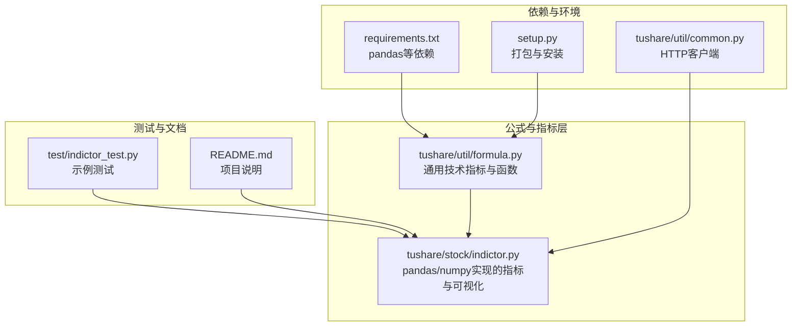
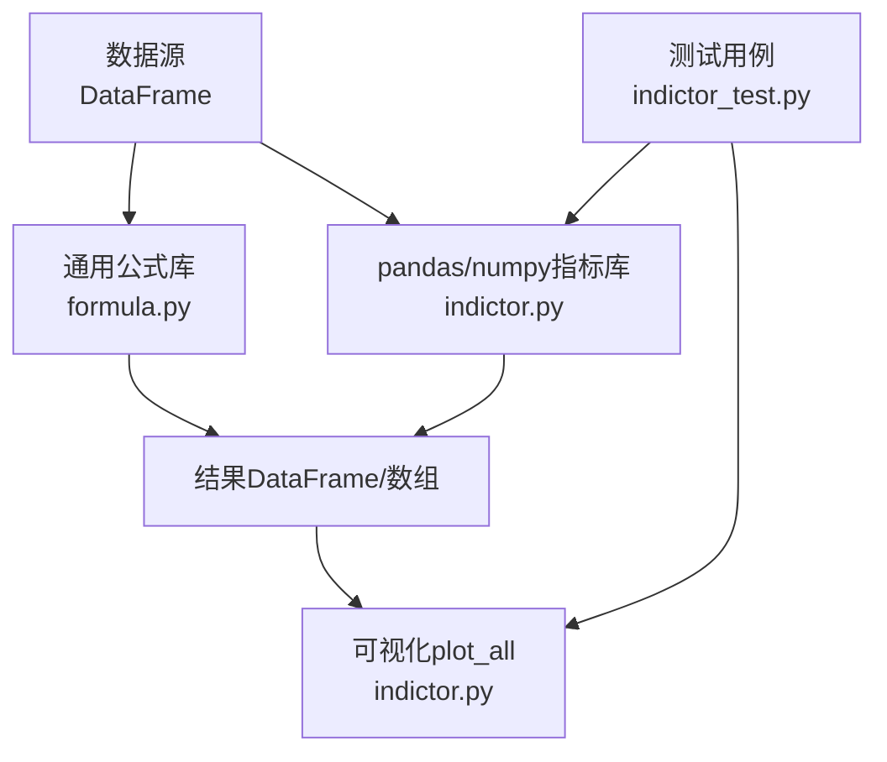
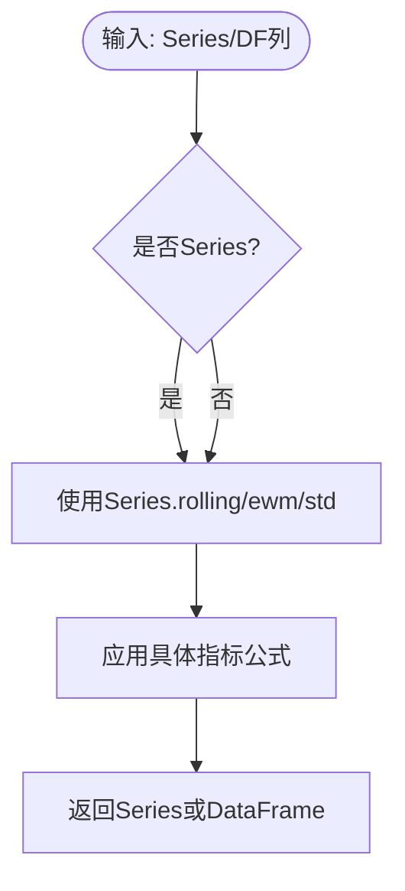
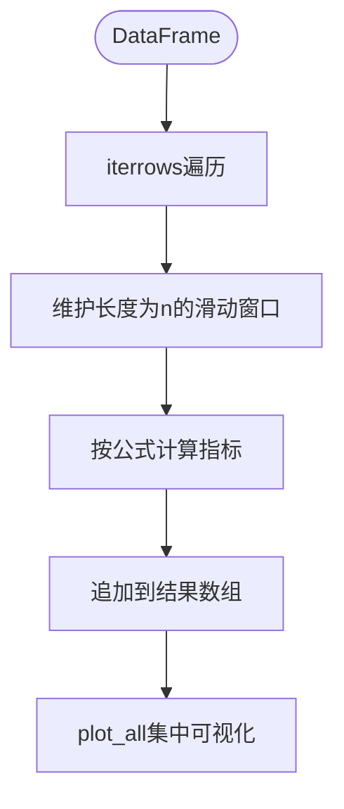
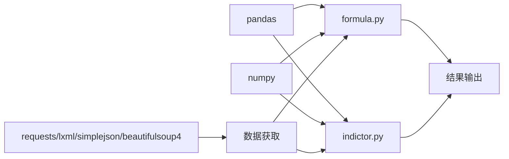

# 公式计算工具

<cite>
**本文引用的文件**
- [formula.py](file://tushare/util/formula.py)
- [indictor.py](file://tushare/stock/indictor.py)
- [indictor_test.py](file://test/indictor_test.py)
- [README.md](file://README.md)
- [requirements.txt](file://requirements.txt)
- [setup.py](file://setup.py)
- [common.py](file://tushare/util/common.py)
</cite>

## 目录
1. [简介](#简介)
2. [项目结构](#项目结构)
3. [核心组件](#核心组件)
4. [架构总览](#架构总览)
5. [详细组件分析](#详细组件分析)
6. [依赖分析](#依赖分析)
7. [性能考量](#性能考量)
8. [故障排查指南](#故障排查指南)
9. [结论](#结论)
10. [附录](#附录)

## 简介
本文件面向TuShare公式计算工具，系统化梳理其技术指标计算、数据处理函数与数学公式实现，覆盖移动平均线、相对强弱指数、MACD、布林带等常用技术指标，并给出向量化计算、循环优化、精度控制等实践建议，以及自定义指标开发与验证机制、调试与优化指导。

## 项目结构
该项目围绕“数据获取—指标计算—可视化输出”的主线组织，其中与公式计算直接相关的核心模块如下：
- tushare/util/formula.py：提供基础技术指标与通用函数（EMA、MA、SMA、ATR、KDJ、MACD、RSI、BOLL、WR、BIAS、MFI、SKDJ、ROC、MTM、DDI、ADTM等），以pandas/numpy向量化为主。
- tushare/stock/indictor.py：提供基于pandas迭代与numpy数组的指标实现（如ma、md、ema、macd、rsi、boll、kdj、wnr、dmi、bias、asi、vr、arbr、dpo、trix、bbi、mtm、obv等），并包含plot_all可视化。
- test/indictor_test.py：单元测试样例，演示如何加载数据并调用plot_all进行可视化。
- README.md：项目概述、安装与快速开始示例。
- requirements.txt/setup.py：依赖声明与打包配置。
- tushare/util/common.py：HTTP客户端封装，用于数据获取（与公式计算间接相关）。

**图表来源**
- [formula.py:1-262](file://tushare/util/formula.py#L1-L262)
- [indictor.py:1-999](file://tushare/stock/indictor.py#L1-L999)
- [indictor_test.py:1-24](file://test/indictor_test.py#L1-L24)
- [README.md:1-411](file://README.md#L1-L411)
- [requirements.txt:1-6](file://requirements.txt#L1-L6)
- [setup.py:1-100](file://setup.py#L1-L100)
- [common.py:1-86](file://tushare/util/common.py#L1-L86)

**章节来源**
- [README.md:1-411](file://README.md#L1-L411)
- [requirements.txt:1-6](file://requirements.txt#L1-L6)
- [setup.py:1-100](file://setup.py#L1-L100)

## 核心组件
- 通用公式与指标库（formula.py）
  - 提供EMA、MA、SMA、ATR、HHV、LLV、SUM、ABS、MAX、MIN、IF、REF、STD、MACD、KDJ、OSC、BBI、BBIBOLL、PBX、BOLL、ROC、MTM、MFI、SKDJ、WR、BIAS、RSI、ADTM、DDI等。
  - 采用pandas Series.rolling与ewm、numpy数组与循环相结合的方式，兼顾易读性与性能。
- pandas/numpy指标库（indictor.py）
  - 提供ma、md、ema、macd、rsi、boll、kdj、wnr、dmi、bias、asi、vr、arbr、dpo、trix、bbi、mtm、obv等。
  - 大多使用iterrows遍历与numpy数组累积，部分函数提供plot_all进行批量可视化。
- 测试与示例（indictor_test.py）
  - 展示如何通过tushare接口获取数据并调用plot_all进行可视化。

**章节来源**
- [formula.py:1-262](file://tushare/util/formula.py#L1-L262)
- [indictor.py:1-999](file://tushare/stock/indictor.py#L1-L999)
- [indictor_test.py:1-24](file://test/indictor_test.py#L1-L24)

## 架构总览
公式计算工具采用“函数库 + 可视化 + 测试”的分层架构：
- 函数库层：提供通用技术指标与数据处理函数，统一输入输出格式（pandas DataFrame列）。
- 计算层：以pandas/numpy为核心，结合rolling、ewm、std等内置函数与自定义循环，实现各类指标。
- 可视化层：plot_all集中展示多指标结果，便于对比分析。
- 测试层：通过单元测试验证指标调用链路与输出形态。

**图表来源**
- [formula.py:1-262](file://tushare/util/formula.py#L1-L262)
- [indictor.py:1-999](file://tushare/stock/indictor.py#L1-L999)
- [indictor_test.py:1-24](file://test/indictor_test.py#L1-L24)

## 详细组件分析

### 通用公式与指标库（formula.py）
- 设计要点
  - 输入统一为pandas Series或DataFrame列，便于与pandas内置函数组合。
  - 使用Series.rolling、ewm、std等实现移动平均、指数平滑、标准差等。
  - 对于需要条件判断与向量化赋值的场景，采用np.where与循环回写，确保兼容性。
- 关键函数与实现思路
  - EMA：基于pandas ewm实现指数移动平均。
  - MA/SMA：MA使用rolling mean；SMA采用显式循环递推，体现权重平滑。
  - ATR：计算真实波幅TR并取MA，作为波动率指标。
  - HHV/LLV：滚动最大/最小值。
  - SUM/ABS/MIN/MAX/IF/REF：滚动求和、绝对值、比较、条件赋值、滞后引用。
  - MACD/KDJ/RSI/BOLL/WR/BIAS/MFI/SKDJ/ROC/MTM/DDI/ADTM：按技术分析定义实现，多数返回DataFrame便于后续拼接与可视化。
- 性能特征
  - 优先使用pandas/numpy内置函数，减少纯Python循环。
  - 对于必须的循环（如SMA），尽量在数组上进行，避免逐行Series操作。

**图表来源**
- [formula.py:8-262](file://tushare/util/formula.py#L8-L262)

**章节来源**
- [formula.py:1-262](file://tushare/util/formula.py#L1-L262)

### pandas/numpy指标库（indictor.py）
- 设计要点
  - 大多通过iterrows遍历DataFrame，累积窗口内数组，再计算指标。
  - 部分函数（如ma、md、ema、macd、rsi、boll、kdj、wnr、dmi、bias、asi、vr、arbr、dpo、trix、bbi、mtm、obv）提供明确的参数与返回值约定。
  - plot_all集中展示多指标，便于对比分析。
- 关键函数与实现思路
  - ma/md：维护长度为n的滑动窗口，计算均值/标准差。
  - ema：使用指数平滑递推公式，首点初始化为首个值。
  - macd：先计算快慢EMA，再求差值与信号线。
  - rsi：分别累计上涨/下跌幅度，按周期计算RSI。
  - boll：中轨为MA，上下轨为中轨±k倍MD。
  - kdj：按经典公式迭代计算K、D、J。
  - wnr：计算最高价、最低价窗口内的威廉指标。
  - dmi：计算+DM、-DM、TR、DI、DX、ADX、ADXR。
  - bias：计算收盘价偏离MA的百分比。
  - asi：按规则累加SI并滚动平均。
  - vr：按收盘价与开盘价关系划分AV/BV/CV三类成交量并计算比率。
  - arbr：按统计窗口计算AR、BR。
  - dpo：窗口中心法计算DPO并滚动平均。
  - trix：三重指数平滑，计算TR与TRMA。
  - bbi：多周期MA加权平均。
  - mtm：N周期价格动量。
  - obv：按价格与区间关系计算OBV。
  - plot_all：批量绘制多指标曲线。
- 性能特征
  - 多数函数使用iterrows与numpy数组，适合中小规模数据。
  - 对于大规模数据，建议优先使用formula.py中的pandas/numpy向量化实现。

**图表来源**
- [indictor.py:12-999](file://tushare/stock/indictor.py#L12-L999)

**章节来源**
- [indictor.py:1-999](file://tushare/stock/indictor.py#L1-L999)

### 可视化与测试（indictor_test.py）
- 通过tushare接口获取K线数据，排序后调用plot_all进行多指标可视化。
- 测试用例展示了典型的数据准备与调用流程，便于二次开发时复用。

**章节来源**
- [indictor_test.py:1-24](file://test/indictor_test.py#L1-L24)

## 依赖分析
- 外部依赖
  - pandas：提供Series/DataFrame与rolling、ewm、std等核心计算能力。
  - requests/lxml/simplejson/beautifulsoup4：网络与解析依赖（与公式计算间接相关）。
- 内部依赖
  - formula.py与indictor.py相互独立，但均可被上层调用者（如plot_all）统一使用。
  - common.py提供HTTP客户端，用于数据获取，与公式计算解耦。

**图表来源**
- [requirements.txt:1-6](file://requirements.txt#L1-L6)
- [formula.py:1-262](file://tushare/util/formula.py#L1-L262)
- [indictor.py:1-999](file://tushare/stock/indictor.py#L1-L999)
- [common.py:1-86](file://tushare/util/common.py#L1-L86)

**章节来源**
- [requirements.txt:1-6](file://requirements.txt#L1-L6)
- [setup.py:65-74](file://setup.py#L65-L74)
- [common.py:1-86](file://tushare/util/common.py#L1-L86)

## 性能考量
- 向量化优先
  - 优先使用pandas Series.rolling、ewm、std等内置函数，避免逐行循环。
  - 对于必须的循环（如SMA），尽量在numpy数组上进行，减少Series对象开销。
- 窗口管理
  - 控制滑动窗口大小，避免过大的N导致内存与计算压力。
  - 对于长序列，可考虑分块处理或使用pandas内置函数的min_periods参数。
- 数据类型与缺失值
  - 在涉及SUM/IF等函数前，必要时进行fillna处理，确保计算稳定。
- I/O与缓存
  - 将中间结果缓存至DataFrame列，减少重复计算。
- 可视化成本
  - plot_all会生成大量子图，建议在大批量数据时降低子图数量或仅输出关键指标。

[本节为通用性能建议，无需特定文件引用]

## 故障排查指南
- 输入格式错误
  - 确保传入的是pandas Series或DataFrame列，且列名与函数期望一致（如close、high、low、vol等）。
- 窗口过小或过大
  - 某些函数对min_periods有要求，需保证足够的有效样本。
- 循环与索引越界
  - 自定义循环时注意边界条件，避免访问不存在的滞后值。
- 缺失值处理
  - 对于SUM/IF等可能涉及除法或分母为零的函数，提前检查并处理NaN/无穷值。
- 可视化异常
  - plot_all依赖matplotlib，确保运行环境具备显示能力或正确设置输出路径。

**章节来源**
- [formula.py:16-25](file://tushare/util/formula.py#L16-L25)
- [indictor.py:12-42](file://tushare/stock/indictor.py#L12-L42)

## 结论
TuShare公式计算工具提供了两类技术指标实现路径：以pandas/numpy向量化为主的formula.py与以iterrows+numpy数组为主的indictor.py。前者更适合大规模数据与高性能场景，后者更直观易懂，便于教学与调试。结合plot_all与测试用例，开发者可以快速构建、验证与可视化自己的技术指标。

[本节为总结性内容，无需特定文件引用]

## 附录

### 常用技术指标实现要点
- 移动平均线（MA/EMA/SMA）
  - MA：pandas rolling mean；EMA：ewm；SMA：显式递推。
- 相对强弱指数（RSI）
  - 分别统计上涨/下跌幅度，按周期计算RSI。
- MACD
  - 快慢EMA差值与信号线，再计算柱状图。
- 布林带（BOLL）
  - 中轨MA，上下轨±2倍标准差。
- 随机指标（KDJ/STOCH）
  - 基于最高/最低与收盘价的关系，结合平滑。
- 动量类（ROC/MTM）
  - 价格变化率与N周期动量。
- 资金流量（MFI）
  - 基于价格与成交量的正负流计算。
- 方向类（DMI/DDI/ADTM）
  - 动向与动量指标，结合DX/ADX/ADXR。

**章节来源**
- [formula.py:80-262](file://tushare/util/formula.py#L80-L262)
- [indictor.py:125-436](file://tushare/stock/indictor.py#L125-L436)

### 使用示例与最佳实践
- 示例路径
  - 数据准备与可视化：[indictor_test.py:13-18](file://test/indictor_test.py#L13-L18)
  - 指标调用与结果拼接：参考formula.py中各函数返回值（Series或DataFrame）。
- 最佳实践
  - 优先使用formula.py中的向量化实现，必要时在indictor.py基础上扩展。
  - 对于自定义指标，先在小数据集验证，再逐步扩大规模。
  - 注意缺失值与边界条件，确保输出稳定性。

**章节来源**
- [indictor_test.py:1-24](file://test/indictor_test.py#L1-L24)
- [formula.py:1-262](file://tushare/util/formula.py#L1-L262)
- [indictor.py:1-999](file://tushare/stock/indictor.py#L1-L999)