# 工具函数模块

<cite>
**本文引用的文件**
- [dateu.py](file://tushare/util/dateu.py)
- [conns.py](file://tushare/util/conns.py)
- [store.py](file://tushare/util/store.py)
- [formula.py](file://tushare/util/formula.py)
- [netbase.py](file://tushare/util/netbase.py)
- [common.py](file://tushare/util/common.py)
- [mailmerge.py](file://tushare/util/mailmerge.py)
- [upass.py](file://tushare/util/upass.py)
- [vars.py](file://tushare/util/vars.py)
- [cons.py](file://tushare/stock/cons.py)
- [dateu_test.py](file://test/dateu_test.py)
- [storing_test.py](file://test/storing_test.py)
- [ref_test.py](file://test/ref_test.py)
</cite>

## 目录
1. [简介](#简介)
2. [项目结构](#项目结构)
3. [核心组件](#核心组件)
4. [架构总览](#架构总览)
5. [详细组件分析](#详细组件分析)
6. [依赖分析](#依赖分析)
7. [性能考虑](#性能考虑)
8. [故障排查指南](#故障排查指南)
9. [结论](#结论)
10. [附录](#附录)

## 简介
本文件面向TuShare工具函数模块，系统性梳理与说明以下核心能力：
- 日期处理工具：年季拆分、交易日历、节假日判断、相对日期计算等
- 网络连接管理：对接行情服务器的连接建立、重试与关闭
- 数据存储工具：通用DataFrame持久化封装（CSV/Excel/HDF/JSON/数据库）
- 公式计算工具：技术指标与统计函数（EMA、SMA、MACD、KDJ、布林带、RSI等）
- 网络请求基类：HTTP客户端封装与请求头设置
- 文档邮件合并：基于Word模板的字段替换与表格复制
- 认证与凭证：令牌与券商信息的本地读写
- 常量与路径：各类API接口路径常量集合

文档同时给出各工具函数的参数、返回值、典型使用场景、最佳实践与组合使用方式，并提供扩展与自定义指导。

## 项目结构
工具函数模块位于tushare/util目录下，围绕“日期、网络、存储、公式”四大主题组织，配合tushare/stock/cons.py中的常量与路径，形成统一的基础设施层。

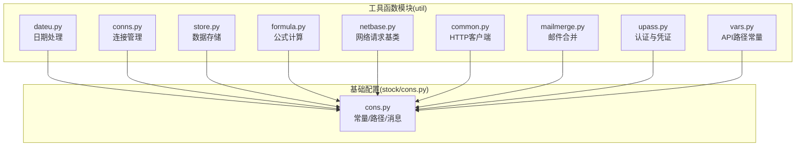

图表来源
- [dateu.py:1-129](file://tushare/util/dateu.py#L1-L129)
- [conns.py:1-61](file://tushare/util/conns.py#L1-L61)
- [store.py:1-44](file://tushare/util/store.py#L1-L44)
- [formula.py:1-262](file://tushare/util/formula.py#L1-L262)
- [netbase.py:1-29](file://tushare/util/netbase.py#L1-L29)
- [common.py:1-86](file://tushare/util/common.py#L1-L86)
- [mailmerge.py:1-219](file://tushare/util/mailmerge.py#L1-L219)
- [upass.py:1-62](file://tushare/util/upass.py#L1-L62)
- [vars.py:1-598](file://tushare/util/vars.py#L1-L598)
- [cons.py:1-200](file://tushare/stock/cons.py#L1-L200)

章节来源
- [dateu.py:1-129](file://tushare/util/dateu.py#L1-L129)
- [conns.py:1-61](file://tushare/util/conns.py#L1-L61)
- [store.py:1-44](file://tushare/util/store.py#L1-L44)
- [formula.py:1-262](file://tushare/util/formula.py#L1-L262)
- [netbase.py:1-29](file://tushare/util/netbase.py#L1-L29)
- [common.py:1-86](file://tushare/util/common.py#L1-L86)
- [mailmerge.py:1-219](file://tushare/util/mailmerge.py#L1-L219)
- [upass.py:1-62](file://tushare/util/upass.py#L1-L62)
- [vars.py:1-598](file://tushare/util/vars.py#L1-L598)
- [cons.py:1-200](file://tushare/stock/cons.py#L1-L200)

## 核心组件
- 日期处理(dateu.py)
  - 年季拆分、季度序列生成、交易日历读取、节假日判断、相对日期计算、随机时间戳转换等
- 连接管理(conns.py)
  - TDX行情API连接、扩展市场连接、连接池获取与关闭、重试机制
- 数据存储(store.py)
  - DataFrame持久化封装，支持CSV/Excel/HDF/JSON/数据库等多种输出
- 公式计算(formula.py)
  - 技术指标与统计函数：EMA、SMA、MACD、KDJ、布林带、RSI、ROC、MTM、MFI、WR、BIAS、ADTM、DDI等
- 网络请求(netbase.py)
  - HTTP请求基类，设置请求头与超时，读取响应
- HTTP客户端(common.py)
  - Bearer Token鉴权的HTTPS客户端，路径编码与响应状态处理
- 邮件合并(mailmerge.py)
  - Word模板字段替换、表格复制、页面分隔、设置清理
- 认证与凭证(upass.py)
  - 令牌写入/读取、券商账户信息写入/读取/删除
- API路径常量(vars.py)
  - 各类数据接口路径模板，便于统一管理

章节来源
- [dateu.py:1-129](file://tushare/util/dateu.py#L1-L129)
- [conns.py:1-61](file://tushare/util/conns.py#L1-L61)
- [store.py:1-44](file://tushare/util/store.py#L1-L44)
- [formula.py:1-262](file://tushare/util/formula.py#L1-L262)
- [netbase.py:1-29](file://tushare/util/netbase.py#L1-L29)
- [common.py:1-86](file://tushare/util/common.py#L1-L86)
- [mailmerge.py:1-219](file://tushare/util/mailmerge.py#L1-L219)
- [upass.py:1-62](file://tushare/util/upass.py#L1-L62)
- [vars.py:1-598](file://tushare/util/vars.py#L1-L598)

## 架构总览
工具函数模块以“配置常量”为核心，围绕“日期/网络/存储/公式”四条主线提供可复用能力；对外通过测试用例与业务模块调用验证其可用性。

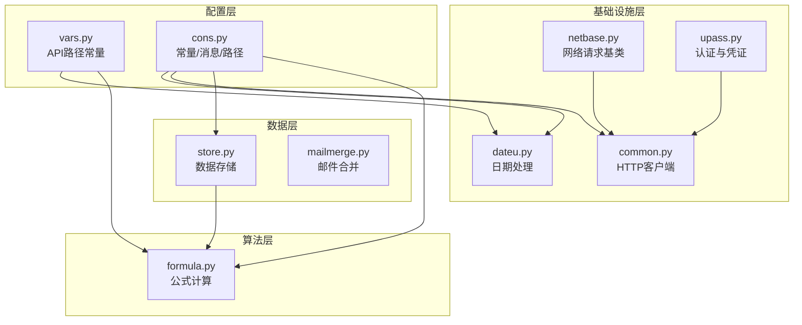

图表来源
- [vars.py:1-598](file://tushare/util/vars.py#L1-L598)
- [cons.py:1-200](file://tushare/stock/cons.py#L1-L200)
- [dateu.py:1-129](file://tushare/util/dateu.py#L1-L129)
- [netbase.py:1-29](file://tushare/util/netbase.py#L1-L29)
- [common.py:1-86](file://tushare/util/common.py#L1-L86)
- [upass.py:1-62](file://tushare/util/upass.py#L1-L62)
- [store.py:1-44](file://tushare/util/store.py#L1-L44)
- [mailmerge.py:1-219](file://tushare/util/mailmerge.py#L1-L219)
- [formula.py:1-262](file://tushare/util/formula.py#L1-L262)

## 详细组件分析

### 日期处理(dateu.py)
- 主要功能
  - 年季拆分与季度序列生成
  - 交易日历读取与节假日判断
  - 相对日期计算（上周、上一年等）
  - 时间戳与字符串互转
  - 当前日期、小时、年、月等便捷查询
- 关键函数与说明
  - year_qua(date)：将日期解析为[年, 季度]列表
  - get_quarts(start, end)：生成年季区间列表
  - trade_cal()：读取交易日历
  - is_holiday(date)：判断是否为节假日或周末
  - day_last_week(days=-7)：相对上周某日
  - today_last_year()：一年前今日
  - get_now()/today()/get_hour()/get_month()/get_year()
  - int2time(timestamp)：时间戳转字符串
  - diff_day(start, end)：两日期相差天数
  - last_tddate()：最近交易日
  - tt_dates(start, end)：按2年步长生成年份列表
  - get_q_date(year, quarter)：根据年季生成季度末日期
- 使用场景
  - 回测/策略周期构建（年季序列、相对日期）
  - 交易日过滤（节假日判断）
  - 数据清洗与标注（时间戳转换）
- 最佳实践
  - 统一使用标准化日期格式（'YYYY-MM-DD'）
  - 在跨时区场景下注意时间戳转换
  - 结合交易日历进行回测日期筛选
- 扩展建议
  - 支持更多国家/地区节假日
  - 提供工作日计数与批量日期生成

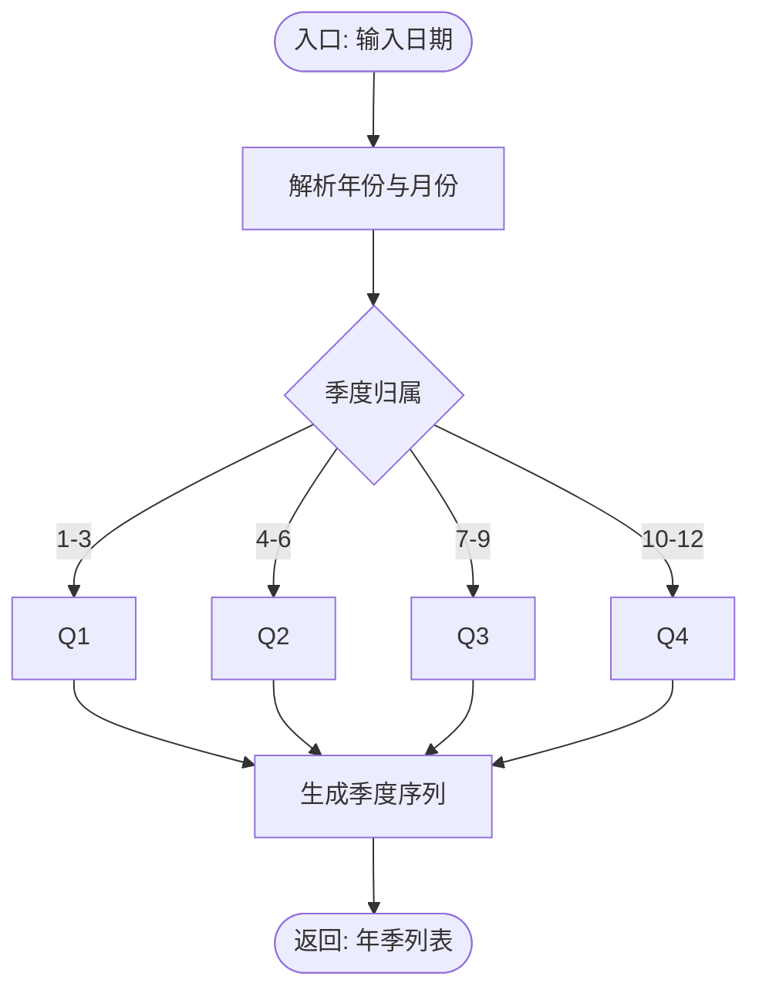

图表来源
- [dateu.py:8-76](file://tushare/util/dateu.py#L8-L76)

章节来源
- [dateu.py:1-129](file://tushare/util/dateu.py#L1-L129)
- [dateu_test.py:1-20](file://test/dateu_test.py#L1-L20)

### 连接管理(conns.py)
- 主要功能
  - 获取TDX行情API连接（主市场与扩展市场）
  - 连接池获取与关闭
  - 连接失败重试与异常处理
- 关键函数与说明
  - api(retry_count=3)：连接主市场API
  - xapi(retry_count=3)：连接扩展市场API
  - xapi_x(retry_count=3)：备用扩展市场API
  - get_apis()：返回主/扩展API元组
  - close_apis(conn)：断开连接
- 使用场景
  - 行情数据拉取前的连接准备
  - 批量任务中的连接复用
- 最佳实践
  - 明确重试次数与异常分支
  - 成功后及时关闭连接释放资源
- 扩展建议
  - 支持连接池与并发控制
  - 增加心跳检测与自动重连

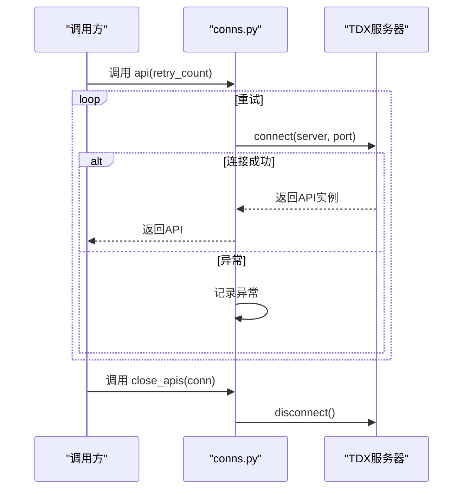

图表来源
- [conns.py:14-61](file://tushare/util/conns.py#L14-L61)

章节来源
- [conns.py:1-61](file://tushare/util/conns.py#L1-L61)

### 数据存储(store.py)
- 主要功能
  - 将DataFrame保存为多种格式（CSV/Excel/HDF/JSON）
  - 自动创建目录、拼接文件路径
- 关键类与说明
  - Store(data, name, path)：构造器校验DataFrame类型
  - save_as(name, path, to='csv')：保存为指定格式
- 使用场景
  - 历史行情落地、回测结果导出
  - 中间产物缓存（HDF/CSV）
- 最佳实践
  - 指定明确的文件名与路径
  - 注意磁盘空间与IO性能
- 扩展建议
  - 支持多表写入与分区存储
  - 增加压缩与增量写入

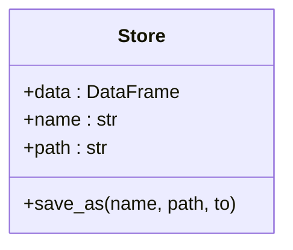

图表来源
- [store.py:14-44](file://tushare/util/store.py#L14-L44)

章节来源
- [store.py:1-44](file://tushare/util/store.py#L1-L44)
- [storing_test.py:1-61](file://test/storing_test.py#L1-L61)

### 公式计算(formula.py)
- 主要功能
  - 技术指标与统计函数：EMA、SMA、MACD、KDJ、布林带、RSI、ROC、MTM、MFI、WR、BIAS、ADTM、DDI等
  - 基础运算：MAX、MIN、IF、REF、STD、SUM、ABS等
- 设计要点
  - 基于pandas/numpy，保证向量化性能
  - 函数命名与公式风格一致，便于阅读与维护
- 使用场景
  - 技术分析与信号生成
  - 指标组合与交叉验证
- 最佳实践
  - 对缺失值进行填充或截断处理
  - 合理选择参数窗口长度，避免过拟合
- 扩展建议
  - 支持多标的批量计算
  - 提供指标工厂与参数扫描

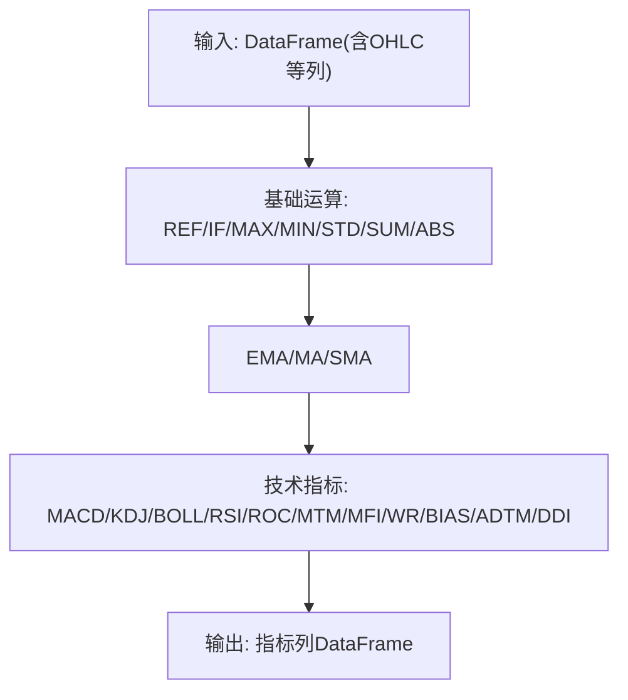

图表来源
- [formula.py:8-262](file://tushare/util/formula.py#L8-L262)

章节来源
- [formula.py:1-262](file://tushare/util/formula.py#L1-L262)

### 网络请求基类(netbase.py)
- 主要功能
  - 设置请求头（User-Agent、Cookie、Referer等）
  - 发起HTTP请求并读取响应
- 关键类与说明
  - Client(url, ref, cookie)：初始化请求头
  - gvalue()：发起请求并返回响应内容
- 使用场景
  - 简单HTTP抓取与数据获取
- 最佳实践
  - 明确超时与异常处理
  - 合理设置请求头避免反爬
- 扩展建议
  - 支持POST/JSON/分页
  - 增加重试与限速

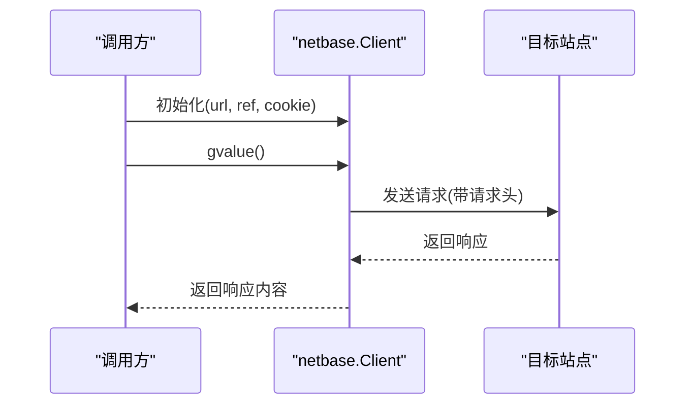

图表来源
- [netbase.py:9-29](file://tushare/util/netbase.py#L9-L29)

章节来源
- [netbase.py:1-29](file://tushare/util/netbase.py#L1-L29)

### HTTP客户端(common.py)
- 主要功能
  - Bearer Token鉴权的HTTPS客户端
  - 路径编码与响应状态处理
- 关键类与说明
  - Client(token)：初始化连接与令牌
  - encodepath(path)：对路径进行编码
  - getData(path)：发起GET请求并返回状态与结果
- 使用场景
  - 官方数据服务访问
- 最佳实践
  - 保持连接复用，减少握手开销
  - 正确处理非200状态码
- 扩展建议
  - 支持会话与Cookie管理
  - 增加日志与监控

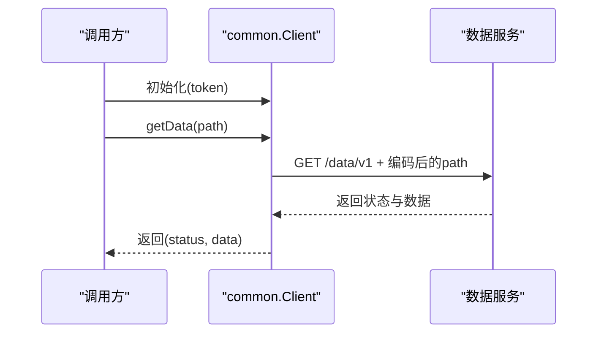

图表来源
- [common.py:18-86](file://tushare/util/common.py#L18-L86)

章节来源
- [common.py:1-86](file://tushare/util/common.py#L1-L86)

### 邮件合并(mailmerge.py)
- 主要功能
  - 解析Word模板，提取并替换MERGEFIELD
  - 表格行复制与页面分隔
  - 清理邮件合并设置
- 关键类与说明
  - MailMerge(file, remove_empty_tables=False)：初始化与解析
  - get_merge_fields(parts)：获取待替换字段
  - merge(parts, **replacements)：字段替换
  - merge_rows(anchor, rows)：表格行批量替换
  - merge_pages(replacements)：按列表复制模板页
  - write(file)：写回新文档
- 使用场景
  - 自动生成报告与报表
- 最佳实践
  - 字段命名规范，避免冲突
  - 处理换行与空值
- 扩展建议
  - 支持图片/图表插入
  - 增加样式与格式化选项

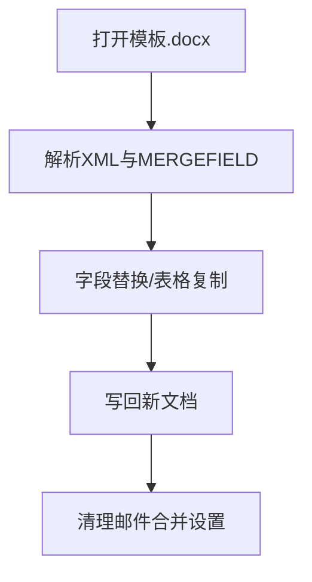

图表来源
- [mailmerge.py:22-219](file://tushare/util/mailmerge.py#L22-L219)

章节来源
- [mailmerge.py:1-219](file://tushare/util/mailmerge.py#L1-L219)

### 认证与凭证(upass.py)
- 主要功能
  - 令牌写入/读取（用户目录）
  - 券商账户信息写入/读取/删除（本地CSV）
- 关键函数与说明
  - set_token(token)：写入令牌
  - get_token()：读取令牌
  - set_broker(broker, user, passwd)：写入券商信息
  - get_broker(broker='')：读取券商信息
  - remove_broker()：删除券商信息文件
- 使用场景
  - 本地安全存储与快速读取
- 最佳实践
  - 令牌与敏感信息加密存储
  - 文件权限最小化
- 扩展建议
  - 支持多用户与多环境
  - 与密钥管理服务集成

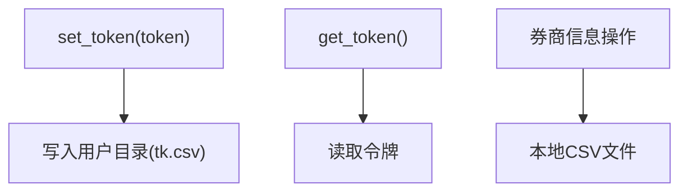

图表来源
- [upass.py:16-62](file://tushare/util/upass.py#L16-L62)

章节来源
- [upass.py:1-62](file://tushare/util/upass.py#L1-L62)

### API路径常量(vars.py)
- 主要功能
  - 统一管理各类数据接口路径模板
  - 提供常量与路径映射，便于集中维护
- 使用场景
  - 与HTTP客户端配合，拼装最终URL
- 最佳实践
  - 保持路径模板一致性
  - 与cons.py中的消息常量协同

章节来源
- [vars.py:1-598](file://tushare/util/vars.py#L1-L598)
- [cons.py:1-200](file://tushare/stock/cons.py#L1-L200)

## 依赖分析
- 内部依赖
  - dateu.py依赖cons.py中的交易日历文件路径
  - conns.py依赖cons.py中的服务器地址与端口常量
  - store.py依赖pandas与os，用于DataFrame与文件系统
  - formula.py依赖pandas与numpy，用于向量化计算
  - common.py依赖cons.py中的HTTP常量
  - mailmerge.py依赖lxml与zipfile，用于Word模板解析
  - upass.py依赖pandas与os，用于CSV读写
  - vars.py为API路径常量集合，被多个模块间接使用
- 外部依赖
  - pytdx：行情API连接
  - pandas/numpy：数据结构与计算
  - lxml/zipfile：Word模板解析
  - http.client/urllib：HTTP请求
  - sqlalchemy/pymongo：数据库/NoSQL存储（测试示例）

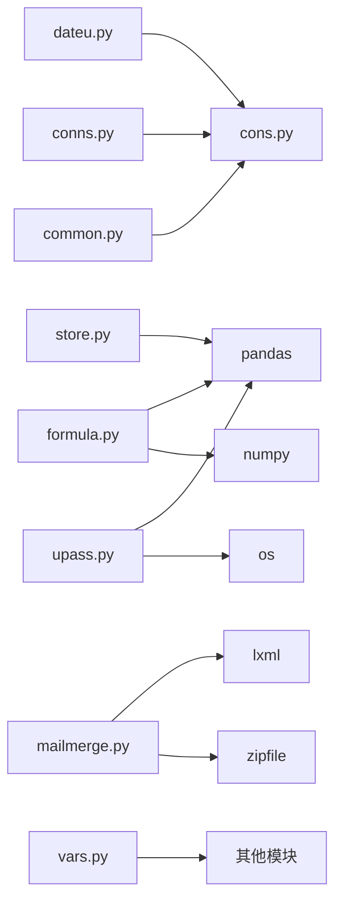

图表来源
- [dateu.py:1-129](file://tushare/util/dateu.py#L1-L129)
- [conns.py:1-61](file://tushare/util/conns.py#L1-L61)
- [store.py:1-44](file://tushare/util/store.py#L1-L44)
- [formula.py:1-262](file://tushare/util/formula.py#L1-L262)
- [common.py:1-86](file://tushare/util/common.py#L1-L86)
- [mailmerge.py:1-219](file://tushare/util/mailmerge.py#L1-L219)
- [upass.py:1-62](file://tushare/util/upass.py#L1-L62)
- [vars.py:1-598](file://tushare/util/vars.py#L1-L598)
- [cons.py:1-200](file://tushare/stock/cons.py#L1-L200)

章节来源
- [cons.py:1-200](file://tushare/stock/cons.py#L1-L200)

## 性能考虑
- 向量化优先：formula.py大量使用pandas/numpy，避免显式循环
- I/O优化：store.py支持HDF/CSV等高效格式；建议按需选择
- 连接复用：conns.py与common.py应尽量复用连接，减少握手成本
- 超时与重试：netbase.py与conns.py设置合理超时与重试，提升稳定性
- 内存管理：大数据处理时注意分块与延迟计算，避免内存峰值

## 故障排查指南
- 连接失败
  - 检查网络与代理设置
  - 查看重试次数与异常日志
  - 确认服务器地址与端口（cons.py）
- 日期/节假日判断异常
  - 确认交易日历文件路径与格式
  - 校验输入日期格式（'YYYY-MM-DD'）
- 存储失败
  - 检查磁盘空间与权限
  - 确认文件路径与格式支持
- 技术指标异常
  - 检查窗口参数与缺失值处理
  - 核对输入列名与数据类型
- HTTP请求问题
  - 检查User-Agent与Cookie设置
  - 关注状态码与响应体

章节来源
- [conns.py:14-61](file://tushare/util/conns.py#L14-L61)
- [dateu.py:78-100](file://tushare/util/dateu.py#L78-L100)
- [store.py:24-44](file://tushare/util/store.py#L24-L44)
- [formula.py:8-262](file://tushare/util/formula.py#L8-L262)
- [netbase.py:16-29](file://tushare/util/netbase.py#L16-L29)

## 结论
工具函数模块以简洁、稳健为核心设计原则，覆盖了金融数据处理的关键基础设施。通过统一的日期、网络、存储与公式计算能力，开发者可以快速搭建数据采集、清洗、分析与报告自动化流程。建议在实际项目中结合测试用例与最佳实践，持续完善与扩展。

## 附录

### 实际项目使用示例（路径指引）
- 日期处理
  - 年季序列生成与交易日过滤：参考测试用例
    - [dateu_test.py:12-19](file://test/dateu_test.py#L12-L19)
- 连接管理
  - 获取API连接与关闭：参考连接函数
    - [conns.py:50-61](file://tushare/util/conns.py#L50-L61)
- 数据存储
  - CSV/Excel/HDF/JSON/数据库落盘：参考测试用例
    - [storing_test.py:8-61](file://test/storing_test.py#L8-L61)
- 公式计算
  - 技术指标计算：参考公式函数
    - [formula.py:80-101](file://tushare/util/formula.py#L80-L101)
- 网络请求
  - HTTP请求与响应：参考基类
    - [netbase.py:26-29](file://tushare/util/netbase.py#L26-L29)
- HTTP客户端
  - Bearer Token鉴权：参考客户端
    - [common.py:68-86](file://tushare/util/common.py#L68-L86)
- 邮件合并
  - Word模板字段替换：参考类方法
    - [mailmerge.py:152-219](file://tushare/util/mailmerge.py#L152-L219)
- 认证与凭证
  - 令牌与券商信息：参考函数
    - [upass.py:16-62](file://tushare/util/upass.py#L16-L62)

### 扩展与自定义指导
- 新增日期函数
  - 建议遵循现有命名与返回格式
  - 在dateu.py中新增并补充单元测试
- 新增网络请求
  - 在netbase.py基础上封装，确保超时与异常处理
  - 如需鉴权，参考common.py的Bearer Token模式
- 新增存储格式
  - 在store.py中扩展save_as逻辑，确保路径与权限
- 新增技术指标
  - 在formula.py中新增函数，遵循pandas/numpy向量化风格
  - 提供参数默认值与边界条件处理
- 新增邮件合并功能
  - 在mailmerge.py中扩展解析与写回逻辑
- 新增认证方式
  - 在upass.py中扩展读写逻辑，确保安全存储