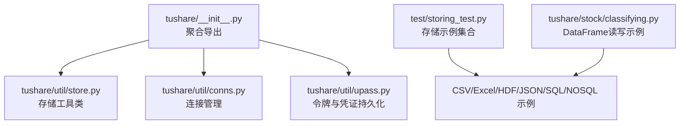
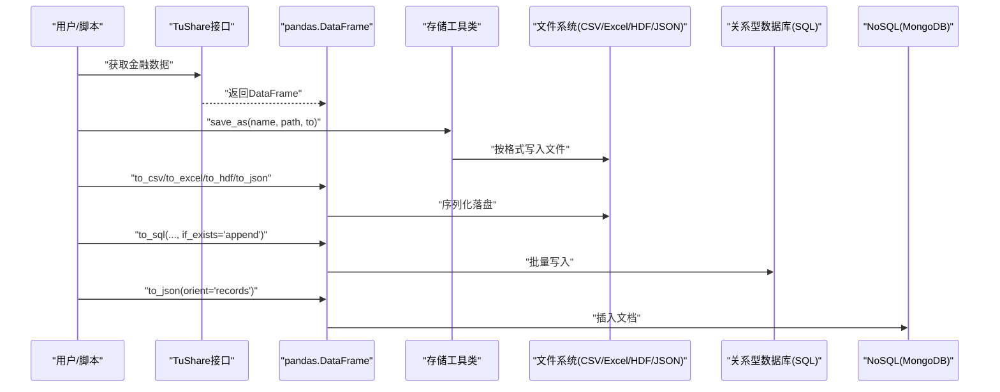
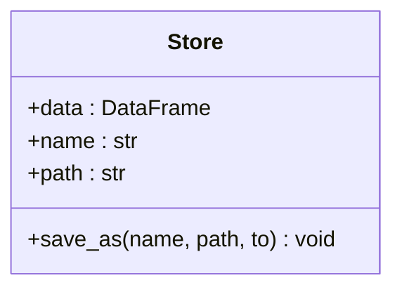
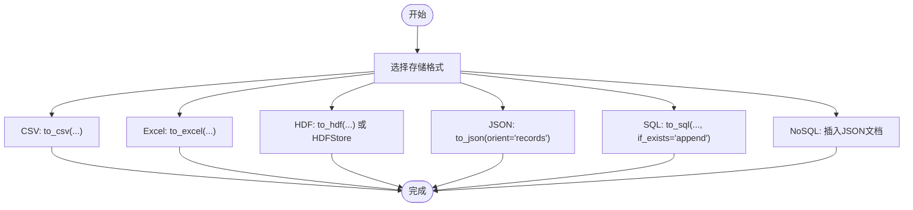
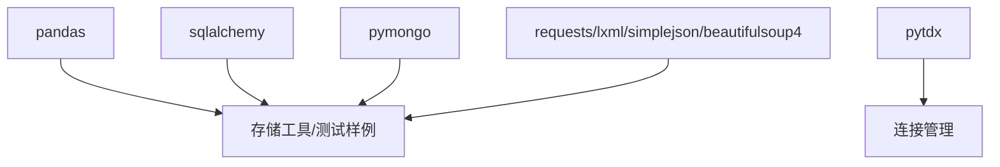

# 数据存储工具

<cite>
**本文引用的文件**
- [tushare/util/store.py](file://tushare/util/store.py)
- [test/storing_test.py](file://test/storing_test.py)
- [tushare/util/conns.py](file://tushare/util/conns.py)
- [tushare/util/upass.py](file://tushare/util/upass.py)
- [tushare/stock/classifying.py](file://tushare/stock/classifying.py)
- [tushare/__init__.py](file://tushare/__init__.py)
- [README.md](file://README.md)
- [requirements.txt](file://requirements.txt)
</cite>

## 目录
1. [简介](#简介)
2. [项目结构](#项目结构)
3. [核心组件](#核心组件)
4. [架构总览](#架构总览)
5. [详细组件分析](#详细组件分析)
6. [依赖分析](#依赖分析)
7. [性能考量](#性能考量)
8. [故障排查指南](#故障排查指南)
9. [结论](#结论)
10. [附录](#附录)

## 简介
本文件面向开发者与数据工程师，系统化梳理 TuShare 的数据存储能力与实践建议，涵盖 CSV 文件读写、Excel 文件处理、数据库连接与数据持久化、pandas DataFrame 的序列化与反序列化、批量数据处理与内存优化策略、大文件处理与增量更新、数据压缩、存储后端选择与性能对比、备份与恢复策略、一致性保障机制，以及扩展与自定义存储后端的指导。

## 项目结构
TuShare 在工具层提供了统一的入口导出，存储相关能力主要通过 util 子包中的工具类与测试样例体现；同时，部分业务模块展示了 DataFrame 的读写与持久化实践。

图表来源
- [tushare/__init__.py:11-140](file://tushare/__init__.py#L11-L140)
- [tushare/util/store.py:14-44](file://tushare/util/store.py#L14-L44)
- [tushare/util/conns.py:14-61](file://tushare/util/conns.py#L14-L61)
- [tushare/util/upass.py:16-61](file://tushare/util/upass.py#L16-L61)
- [test/storing_test.py:8-61](file://test/storing_test.py#L8-L61)
- [tushare/stock/classifying.py:88-89](file://tushare/stock/classifying.py#L88-L89)

章节来源
- [tushare/__init__.py:11-140](file://tushare/__init__.py#L11-L140)
- [README.md:1-411](file://README.md#L1-L411)

## 核心组件
- 存储工具类：封装 DataFrame 的文件落盘与路径管理，支持 CSV 等格式输出。
- 连接管理：提供行情 API 的连接与断开，便于稳定的数据采集与入库流程。
- 凭证持久化：以 CSV 形式保存令牌与券商账户信息，便于跨会话复用。
- 测试样例：集中演示多种存储介质与模式（CSV、Excel、HDF、JSON、SQL、NoSQL），并包含批量追加与数据库写入示例。

章节来源
- [tushare/util/store.py:14-44](file://tushare/util/store.py#L14-L44)
- [tushare/util/conns.py:14-61](file://tushare/util/conns.py#L14-L61)
- [tushare/util/upass.py:16-61](file://tushare/util/upass.py#L16-L61)
- [test/storing_test.py:8-61](file://test/storing_test.py#L8-L61)

## 架构总览
下图展示从数据采集到多后端存储的整体流程，强调 DataFrame 的序列化与落盘路径，以及数据库与 NoSQL 的写入通道。

图表来源
- [tushare/util/store.py:24-44](file://tushare/util/store.py#L24-L44)
- [test/storing_test.py:8-61](file://test/storing_test.py#L8-L61)

## 详细组件分析

### 存储工具类（Store）
- 职责：接收 pandas DataFrame，负责根据传入参数生成文件名与路径，并按目标格式进行落盘。
- 关键点：
  - 类型校验：仅接受 DataFrame，否则抛出错误。
  - 路径与目录：若目标目录不存在则尝试创建；支持相对/绝对路径组合。
  - 格式选择：通过 to 参数控制输出格式（如 CSV）。
- 扩展建议：可增加 Excel、HDF、Parquet、Feather 等格式支持；加入压缩参数与分块写入策略；提供进度回调与重试机制。

图表来源
- [tushare/util/store.py:14-44](file://tushare/util/store.py#L14-L44)

章节来源
- [tushare/util/store.py:14-44](file://tushare/util/store.py#L14-L44)

### DataFrame 序列化与反序列化（CSV/Excel/HDF/JSON/SQL）
- CSV：适合结构化日线/分钟线等宽表，读写快、兼容性好；支持列筛选与追加模式。
- Excel：适合人工审阅与报表场景；注意列宽、日期格式与数值精度。
- HDF：适合大规模时间序列的高效读写与索引；支持表式存储。
- JSON：适合轻量传输与前端对接；记录式 JSON 便于 NoSQL 导入。
- SQL：适合关系型数据库持久化；支持追加写入与主键/唯一约束。
- NoSQL：适合非结构化或半结构化数据；适合事件流与日志型数据。

图表来源
- [test/storing_test.py:8-61](file://test/storing_test.py#L8-L61)

章节来源
- [test/storing_test.py:8-61](file://test/storing_test.py#L8-L61)

### 批量数据处理与内存优化
- 批量写入：通过追加模式将多标的或多周期数据合并落盘，避免单次大对象内存峰值。
- 分块策略：对超大文件采用分块读取与分块写入，结合进度条与断点续传。
- 内存优化：使用 dtype 指定、列选择、类型转换（如字符串标准化）、及时释放中间变量。
- 压缩：在 CSV/Excel/HDF/JSON 上启用压缩可显著降低存储体积与 IO 时间。

章节来源
- [test/storing_test.py:32-40](file://test/storing_test.py#L32-L40)

### 大文件处理与增量更新
- 增量更新：基于日期/时间戳字段判断是否已存在，仅写入新增记录；SQL 可配合 ON DUPLICATE KEY UPDATE 或 UPSERT。
- 断点续传：记录已处理的游标/偏移，失败后从断点继续。
- 并发安全：文件落盘时加锁或使用临时文件+原子替换，确保一致性。

章节来源
- [test/storing_test.py:41-47](file://test/storing_test.py#L41-L47)

### 数据库连接与一致性保障
- 连接管理：提供行情 API 的连接与断开封装，保证资源回收与异常处理。
- 事务与回滚：数据库写入建议使用事务包裹，失败时回滚；批量写入时控制批次大小。
- 锁与并发：使用文件锁或数据库排他锁，避免并发写入冲突。

章节来源
- [tushare/util/conns.py:14-61](file://tushare/util/conns.py#L14-L61)

### 凭证与配置持久化
- 令牌持久化：将 token 写入用户目录下的 CSV 文件，读取时进行存在性检查与错误提示。
- 券商账户：支持多账户管理与覆盖写入，便于自动化交易与多账户策略。

章节来源
- [tushare/util/upass.py:16-61](file://tushare/util/upass.py#L16-L61)

### 业务模块中的读写示例
- 板块分类数据导出：将聚合后的 DataFrame 直接写入 CSV，便于离线分析与报表。
- Excel 读取：从外部 Excel 源读取权重与成分股信息，进行清洗与映射后再入库。

章节来源
- [tushare/stock/classifying.py:88-89](file://tushare/stock/classifying.py#L88-L89)
- [tushare/stock/classifying.py:244-249](file://tushare/stock/classifying.py#L244-L249)

## 依赖分析
- pandas：DataFrame 的核心依赖，用于读写与计算。
- SQLAlchemy：关系型数据库写入与连接管理。
- Pytdx：行情 API 连接（用于行情数据采集，间接影响存储流程）。
- PyMongo：NoSQL 写入（MongoDB）。
- lxml/simplejson/beautifulsoup4：网络数据解析与 JSON 处理。

图表来源
- [requirements.txt:1-6](file://requirements.txt#L1-L6)
- [tushare/util/conns.py:9-11](file://tushare/util/conns.py#L9-L11)
- [test/storing_test.py:4-6](file://test/storing_test.py#L4-L6)

章节来源
- [requirements.txt:1-6](file://requirements.txt#L1-L6)
- [tushare/util/conns.py:9-11](file://tushare/util/conns.py#L9-L11)
- [test/storing_test.py:4-6](file://test/storing_test.py#L4-L6)

## 性能考量
- IO 优化：优先使用二进制格式（如 HDF、Parquet）进行大规模时间序列存储；CSV 适合小规模与人工审阅。
- 压缩：启用压缩可显著降低磁盘占用与网络传输成本，但会增加 CPU 开销。
- 并行：多进程/多线程并行写入需谨慎处理锁与原子替换，避免竞态。
- 索引与分区：数据库侧建立合适索引与按日期分区，提升查询与写入效率。
- 缓冲与批处理：批量写入与缓冲池可减少系统调用次数，提高吞吐。

## 故障排查指南
- 文件路径与权限：确认目标目录存在且具备写权限；必要时自动创建目录。
- 编码与格式：CSV/Excel 读写注意编码（UTF-8/GB18030）与列类型；Excel 注意日期与数字格式。
- 网络与超时：API 连接与数据抓取可能受网络影响，设置合理重试与超时。
- 数据库连接：检查连接串、字符集与事务隔离级别；批量写入时控制批次大小与超时。
- NoSQL 写入：确认集合/索引存在，JSON 文档结构与类型匹配。

章节来源
- [tushare/util/store.py:34-39](file://tushare/util/store.py#L34-L39)
- [tushare/util/conns.py:14-23](file://tushare/util/conns.py#L14-L23)
- [test/storing_test.py:41-56](file://test/storing_test.py#L41-L56)

## 结论
TuShare 的存储工具以 pandas DataFrame 为中心，围绕 CSV/Excel/HDF/JSON/SQL/NOSQL 提供了完整的读写链路与示例。通过合理的格式选择、批量与压缩策略、连接管理与一致性保障，可在本地文件系统、关系型数据库与 NoSQL 之间灵活切换，满足从个人研究到生产环境的多样化需求。建议在实际工程中结合业务场景补充断点续传、并发控制与监控告警，形成稳健的数据流水线。

## 附录

### 存储后端选择与性能对比（建议）
- 本地文件系统（CSV/Excel/HDF/JSON）
  - 优点：易用、兼容性好、便于归档与迁移。
  - 适用：中小规模数据、人工审阅、离线分析。
  - 注意：大文件建议压缩与分区；CSV 不适合频繁随机写入。
- 关系型数据库（MySQL/PostgreSQL）
  - 优点：强一致、事务支持、索引完善、生态成熟。
  - 适用：结构化强、需要复杂查询与事务的场景。
  - 注意：批量写入时控制批次与超时；合理设计主键与索引。
- NoSQL（MongoDB）
  - 优点：灵活文档模型、高写入吞吐、易于扩展。
  - 适用：事件流、日志、非结构化数据。
  - 注意：集合设计与索引规划；批量写入时使用批量命令。
- 云存储（对象存储）
  - 优点：弹性扩展、成本低、可与大数据平台集成。
  - 适用：海量归档、跨区域共享、与分析平台联动。
  - 注意：网络延迟与带宽；分片与压缩策略。

### 备份与恢复策略
- 定期全量备份：对关键数据进行周期性全量导出与归档。
- 增量备份：基于时间戳或变更日志进行增量同步。
- 快照与版本：数据库与对象存储支持快照与版本控制。
- 恢复演练：定期进行恢复演练，验证备份完整性与恢复时效。

### 一致性保障机制
- 文件落盘：使用临时文件+原子替换，避免部分写入。
- 数据库：事务包裹批量写入，失败回滚；必要时使用幂等写入。
- NoSQL：使用批量写入 API 与错误重试；文档 ID 唯一性控制。

### 扩展与自定义存储后端指导
- 接口设计：围绕 DataFrame 的序列化/反序列化抽象统一接口，屏蔽具体后端差异。
- 配置中心：集中管理后端连接参数、压缩策略与批大小。
- 监控与日志：埋点记录写入耗时、失败率与重试次数，便于优化。
- 测试矩阵：覆盖不同格式、不同规模与不同并发场景的回归测试。