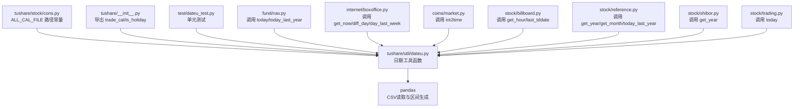
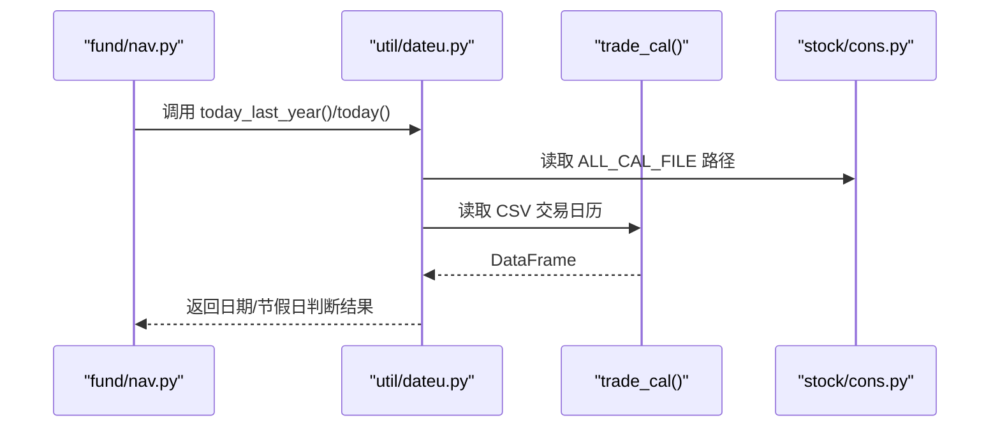
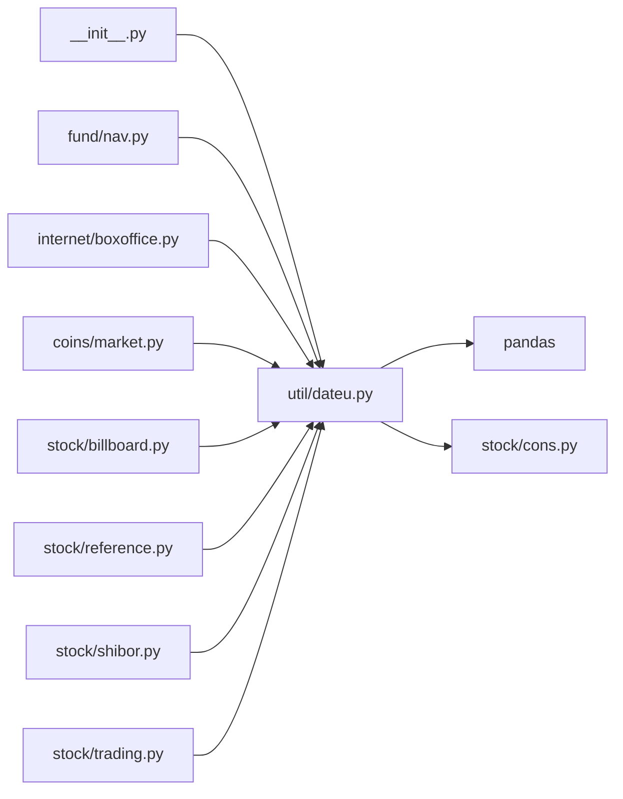

# 日期处理工具

<cite>
**本文引用的文件**
- [dateu.py](file://tushare/util/dateu.py)
- [cons.py](file://tushare/stock/cons.py)
- [dateu_test.py](file://test/dateu_test.py)
- [__init__.py](file://tushare/__init__.py)
- [nav.py](file://tushare/fund/nav.py)
- [boxoffice.py](file://tushare/internet/boxoffice.py)
- [market.py](file://tushare/coins/market.py)
- [billboard.py](file://tushare/stock/billboard.py)
- [reference.py](file://tushare/stock/reference.py)
- [shibor.py](file://tushare/stock/shibor.py)
- [trading.py](file://tushare/stock/trading.py)
</cite>

## 目录
1. [简介](#简介)
2. [项目结构](#项目结构)
3. [核心组件](#核心组件)
4. [架构总览](#架构总览)
5. [详细组件分析](#详细组件分析)
6. [依赖关系分析](#依赖关系分析)
7. [性能考量](#性能考量)
8. [故障排查指南](#故障排查指南)
9. [结论](#结论)
10. [附录](#附录)

## 简介
本文档系统化梳理 TuShare 的日期处理工具，围绕以下核心函数展开：year_qua、today、get_year、get_month、get_hour、today_last_year、day_last_week、get_now、int2time、diff_day、get_quarts、trade_cal、is_holiday、last_tddate、tt_dates、get_q_date。文档不仅说明每个函数的参数、返回值、典型使用场景与实现原理，还结合实际业务模块（如基金净值、电影票房、加密货币行情、股票公告与参考数据、Shibor 利率等）给出具体调用路径与最佳实践，帮助开发者在金融数据获取与处理中正确使用日期工具，避免常见陷阱。

## 项目结构
日期处理工具位于 tushare/util/dateu.py，主要依赖 pandas 进行交易日历读取与区间生成；交易日历文件路径由 tushare/stock/cons.py 提供常量定义。该工具被主包入口导出，供各子模块按需调用。

图表来源
- [dateu.py:1-129](file://tushare/util/dateu.py#L1-L129)
- [cons.py:102-103](file://tushare/stock/cons.py#L102-L103)
- [__init__.py:94-94](file://tushare/__init__.py#L94-L94)
- [nav.py:217-218](file://tushare/fund/nav.py#L217-L218)
- [boxoffice.py:53-88](file://tushare/internet/boxoffice.py#L53-L88)
- [market.py:174-247](file://tushare/coins/market.py#L174-L247)
- [billboard.py:54-57](file://tushare/stock/billboard.py#L54-L57)
- [reference.py:284-285](file://tushare/stock/reference.py#L284-L285)
- [shibor.py:34-34](file://tushare/stock/shibor.py#L34-L34)
- [trading.py:250-250](file://tushare/stock/trading.py#L250-L250)

章节来源
- [dateu.py:1-129](file://tushare/util/dateu.py#L1-L129)
- [cons.py:102-103](file://tushare/stock/cons.py#L102-L103)
- [__init__.py:94-94](file://tushare/__init__.py#L94-L94)

## 核心组件
- year_qua(date): 将日期字符串解析为“年+季度”的二维数组，用于季度维度的数据组织。
- today(): 返回当前日期字符串（YYYY-MM-DD）。
- get_year()/get_month()/get_hour(): 获取当前年、月、小时。
- today_last_year(): 计算一年前的日期字符串。
- day_last_week(days=-7): 计算相对偏移的日期字符串，默认上周同日。
- get_now(): 返回当前时间字符串（YYYY-MM-DD HH:MM:SS）。
- int2time(timestamp): 将时间戳转换为标准时间字符串。
- diff_day(start, end): 计算两个日期间的天数差。
- get_quarts(start, end): 生成指定起止日期之间的季度序列。
- trade_cal(): 读取交易日历 CSV 文件，返回 DataFrame。
- is_holiday(date): 判断某日期是否为节假日或周末。
- last_tddate(): 计算最近交易日（考虑周日回溯）。
- tt_dates(start, end): 生成偶数年份的日期列表（用于特定业务）。
- get_q_date(year, quarter): 将年+季映射为季度末日期字符串。

章节来源
- [dateu.py:8-129](file://tushare/util/dateu.py#L8-L129)

## 架构总览
日期工具作为底层支撑模块，被多个业务模块调用：
- 基金净值模块：使用 today/today_last_year 限定查询窗口。
- 电影票房模块：使用 get_now/diff_day/day_last_week 生成时间参数。
- 加密货币行情模块：使用 int2time 统一时间格式。
- 股票公告与参考数据：使用 get_year/get_month/last_tddate 等进行时间筛选。
- Shibor 利率模块：使用 get_year 进行年份筛选。
- 交易模块：使用 today 作为默认日期。

图表来源
- [nav.py:217-218](file://tushare/fund/nav.py#L217-L218)
- [dateu.py:78-84](file://tushare/util/dateu.py#L78-L84)
- [cons.py:102-103](file://tushare/stock/cons.py#L102-L103)

## 详细组件分析

### year_qua(date)
- 参数
  - date: 字符串，形如 "YYYY-MM-DD"
- 返回值
  - 列表，形如 ["YYYY", "Q"]
- 使用场景
  - 生成季度维度索引，配合 get_quarts 使用
- 实现要点
  - 解析月份，映射到 1-4 季度
- 典型调用
  - get_quarts(start, end) 内部使用 year_qua 生成季度边界

章节来源
- [dateu.py:8-24](file://tushare/util/dateu.py#L8-L24)
- [dateu.py:72-75](file://tushare/util/dateu.py#L72-L75)

### today()
- 参数
  - 无
- 返回值
  - 字符串，当前日期 "YYYY-MM-DD"
- 使用场景
  - 作为默认结束日期或当前日期标记
- 典型调用
  - fund/nav.py、stock/reference.py、stock/trading.py

章节来源
- [dateu.py:27-29](file://tushare/util/dateu.py#L27-L29)
- [nav.py:218-218](file://tushare/fund/nav.py#L218-L218)
- [reference.py:562-563](file://tushare/stock/reference.py#L562-L563)
- [trading.py:250-250](file://tushare/stock/trading.py#L250-L250)

### get_year()/get_month()/get_hour()
- 参数
  - 无
- 返回值
  - 整数（年/月/小时）
- 使用场景
  - 年度/月份筛选、时段控制
- 典型调用
  - stock/reference.py、stock/shibor.py

章节来源
- [dateu.py:32-42](file://tushare/util/dateu.py#L32-L42)
- [reference.py:284-285](file://tushare/stock/reference.py#L284-L285)
- [shibor.py:34-34](file://tushare/stock/shibor.py#L34-L34)

### today_last_year()
- 参数
  - 无
- 返回值
  - 字符串，一年前日期 "YYYY-MM-DD"
- 使用场景
  - 限定一年内的历史数据范围
- 典型调用
  - fund/nav.py

章节来源
- [dateu.py:45-47](file://tushare/util/dateu.py#L45-L47)
- [nav.py:217-218](file://tushare/fund/nav.py#L217-L218)

### day_last_week(days=-7)
- 参数
  - days: 整数，默认 -7 表示上周同日
- 返回值
  - 字符串，偏移后的日期 "YYYY-MM-DD"
- 使用场景
  - 生成近几周的日期窗口
- 典型调用
  - internet/boxoffice.py

章节来源
- [dateu.py:50-52](file://tushare/util/dateu.py#L50-L52)
- [boxoffice.py:128-128](file://tushare/internet/boxoffice.py#L128-L128)
- [boxoffice.py:174-174](file://tushare/internet/boxoffice.py#L174-L174)

### get_now()
- 参数
  - 无
- 返回值
  - 字符串，当前时间 "YYYY-MM-DD HH:MM:SS"
- 使用场景
  - 记录数据抓取时间戳
- 典型调用
  - internet/boxoffice.py

章节来源
- [dateu.py:55-56](file://tushare/util/dateu.py#L55-L56)
- [boxoffice.py:53-53](file://tushare/internet/boxoffice.py#L53-L53)

### int2time(timestamp)
- 参数
  - timestamp: 数值型时间戳（秒）
- 返回值
  - 字符串，标准时间 "YYYY-MM-DD HH:MM:SS"
- 使用场景
  - 将时间戳统一转换为人类可读格式
- 典型调用
  - coins/market.py

章节来源
- [dateu.py:59-62](file://tushare/util/dateu.py#L59-L62)
- [market.py:174-247](file://tushare/coins/market.py#L174-L247)

### diff_day(start, end)
- 参数
  - start/end: 字符串，形如 "YYYY-MM-DD"
- 返回值
  - 整数，end - start 的天数差
- 使用场景
  - 计算相对日期差，用于时间窗口校验
- 典型调用
  - internet/boxoffice.py

章节来源
- [dateu.py:65-69](file://tushare/util/dateu.py#L65-L69)
- [boxoffice.py:87-87](file://tushare/internet/boxoffice.py#L87-L87)

### get_quarts(start, end)
- 参数
  - start/end: 字符串，形如 "YYYY-MM-DD"
- 返回值
  - 列表，季度序列（逆序）
- 使用场景
  - 生成季度维度的迭代区间
- 典型调用
  - get_quarts(start, end)

章节来源
- [dateu.py:72-75](file://tushare/util/dateu.py#L72-L75)

### trade_cal()
- 参数
  - 无
- 返回值
  - pandas DataFrame，包含交易日历字段
- 使用场景
  - 读取交易日历，供 is_holiday 判断使用
- 实现要点
  - 从常量 ALL_CAL_FILE 读取 CSV
- 典型调用
  - is_holiday(date)

章节来源
- [dateu.py:78-84](file://tushare/util/dateu.py#L78-L84)
- [cons.py:102-103](file://tushare/stock/cons.py#L102-L103)

### is_holiday(date)
- 参数
  - date: 字符串，形如 "YYYY-MM-DD"
- 返回值
  - 布尔值，True 表示节假日或周末
- 使用场景
  - 金融数据获取时跳过非交易日
- 实现要点
  - 读取交易日历，若 isOpen==0 或为周末则判定为节假日
- 典型调用
  - stock/billboard.py、stock/trading.py

章节来源
- [dateu.py:87-99](file://tushare/util/dateu.py#L87-L99)
- [billboard.py:54-57](file://tushare/stock/billboard.py#L54-L57)
- [trading.py:480-480](file://tushare/stock/trading.py#L480-L480)

### last_tddate()
- 参数
  - 无
- 返回值
  - 字符串，最近交易日 "YYYY-MM-DD"
- 使用场景
  - 获取上一个交易日，用于公告、交易等业务
- 典型调用
  - stock/billboard.py

章节来源
- [dateu.py:102-108](file://tushare/util/dateu.py#L102-L108)
- [billboard.py:54-57](file://tushare/stock/billboard.py#L54-L57)

### tt_dates(start, end)
- 参数
  - start/end: 字符串，形如 "YYYY-MM-DD"
- 返回值
  - 列表，偶数年份的年份列表
- 使用场景
  - 生成特定业务所需的偶数年份序列
- 典型调用
  - tt_dates(start, end)

章节来源
- [dateu.py:111-115](file://tushare/util/dateu.py#L111-L115)

### get_q_date(year, quarter)
- 参数
  - year: 整数
  - quarter: 整数，1-4
- 返回值
  - 字符串，季度末日期 "YYYY-MM-DD"
- 使用场景
  - 将年+季映射为季度末日期，便于报表/财务数据匹配
- 典型调用
  - stock/reference.py

章节来源
- [dateu.py:124-126](file://tushare/util/dateu.py#L124-L126)
- [reference.py:831-831](file://tushare/stock/reference.py#L831-L831)

## 依赖关系分析
- 外部依赖
  - pandas：用于读取 CSV 交易日历与生成季度区间
  - 时间库：datetime、time
- 内部依赖
  - tushare/stock/cons.py：提供 ALL_CAL_FILE 路径常量
  - 主包导出：tushare/__init__.py 导出 trade_cal/is_holiday
- 调用链
  - is_holiday -> trade_cal -> pandas.read_csv -> DataFrame
  - get_quarts -> year_qua -> pandas.period_range

图表来源
- [dateu.py:1-129](file://tushare/util/dateu.py#L1-L129)
- [cons.py:102-103](file://tushare/stock/cons.py#L102-L103)
- [__init__.py:94-94](file://tushare/__init__.py#L94-L94)
- [nav.py:217-218](file://tushare/fund/nav.py#L217-L218)
- [boxoffice.py:53-88](file://tushare/internet/boxoffice.py#L53-L88)
- [market.py:174-247](file://tushare/coins/market.py#L174-L247)
- [billboard.py:54-57](file://tushare/stock/billboard.py#L54-L57)
- [reference.py:284-285](file://tushare/stock/reference.py#L284-L285)
- [shibor.py:34-34](file://tushare/stock/shibor.py#L34-L34)
- [trading.py:250-250](file://tushare/stock/trading.py#L250-L250)

## 性能考量
- 交易日历读取
  - trade_cal 每次调用都会读取 CSV 文件，建议在批量判断节假日时缓存结果，减少 IO 开销。
- 季节区间生成
  - get_quarts 使用 pandas.period_range，对于大量日期区间的场景，建议复用生成器或缓存中间结果。
- 时间戳转换
  - int2time 在高频转换场景下可考虑批量向量化处理，减少逐条转换的开销。
- 日期差计算
  - diff_day 仅做字符串解析与差值计算，复杂度低，但注意输入格式一致性。

## 故障排查指南
- 输入格式错误
  - 所有涉及日期字符串的函数要求 "YYYY-MM-DD" 格式，否则会抛出异常或返回意外结果。
- 交易日历缺失
  - 若 ALL_CAL_FILE 无法访问，trade_cal 将抛出异常。请确认网络与路径配置。
- 周末与节假日判断
  - is_holiday 同时考虑 isOpen==0 与周末，若业务只关心工作日，应额外过滤周末。
- 时间戳精度
  - int2time 以秒为单位，若传入毫秒需先除以 1000。
- 日期窗口重叠
  - diff_day(start, end) 为正表示 end 在 start 之后，若出现负值，需检查输入顺序。

章节来源
- [dateu.py:65-69](file://tushare/util/dateu.py#L65-L69)
- [dateu.py:87-99](file://tushare/util/dateu.py#L87-L99)
- [market.py:174-247](file://tushare/coins/market.py#L174-L247)

## 结论
TuShare 的日期处理工具以简洁实用为核心，覆盖了金融数据获取中最常见的日期计算与节假日判断需求。通过 year_qua、get_quarts、trade_cal、is_holiday 等函数，开发者可以高效构建时间维度的数据筛选与报表生成流程。建议在生产环境中结合缓存与批量处理策略，进一步提升性能与稳定性。

## 附录

### 函数一览与典型调用路径
- year_qua
  - 调用：get_quarts 内部使用
  - 参考：[dateu.py:8-24](file://tushare/util/dateu.py#L8-L24)、[dateu.py:72-75](file://tushare/util/dateu.py#L72-L75)
- today
  - 调用：fund/nav.py、stock/reference.py、stock/trading.py
  - 参考：[nav.py:217-218](file://tushare/fund/nav.py#L217-L218)、[reference.py:562-563](file://tushare/stock/reference.py#L562-L563)、[trading.py:250-250](file://tushare/stock/trading.py#L250-L250)
- get_year/get_month/get_hour
  - 调用：stock/reference.py、stock/shibor.py
  - 参考：[reference.py:284-285](file://tushare/stock/reference.py#L284-L285)、[shibor.py:34-34](file://tushare/stock/shibor.py#L34-L34)
- today_last_year
  - 调用：fund/nav.py
  - 参考：[nav.py:217-218](file://tushare/fund/nav.py#L217-L218)
- day_last_week
  - 调用：internet/boxoffice.py
  - 参考：[boxoffice.py:128-128](file://tushare/internet/boxoffice.py#L128-L128)、[boxoffice.py:174-174](file://tushare/internet/boxoffice.py#L174-L174)
- get_now
  - 调用：internet/boxoffice.py
  - 参考：[boxoffice.py:53-53](file://tushare/internet/boxoffice.py#L53-L53)
- int2time
  - 调用：coins/market.py
  - 参考：[market.py:174-247](file://tushare/coins/market.py#L174-L247)
- diff_day
  - 调用：internet/boxoffice.py
  - 参考：[boxoffice.py:87-87](file://tushare/internet/boxoffice.py#L87-L87)
- get_quarts
  - 调用：内部使用
  - 参考：[dateu.py:72-75](file://tushare/util/dateu.py#L72-L75)
- trade_cal
  - 调用：is_holiday
  - 参考：[dateu.py:78-84](file://tushare/util/dateu.py#L78-L84)、[cons.py:102-103](file://tushare/stock/cons.py#L102-L103)
- is_holiday
  - 调用：stock/billboard.py、stock/trading.py
  - 参考：[dateu.py:87-99](file://tushare/util/dateu.py#L87-L99)、[billboard.py:54-57](file://tushare/stock/billboard.py#L54-L57)、[trading.py:480-480](file://tushare/stock/trading.py#L480-L480)
- last_tddate
  - 调用：stock/billboard.py
  - 参考：[dateu.py:102-108](file://tushare/util/dateu.py#L102-L108)、[billboard.py:54-57](file://tushare/stock/billboard.py#L54-L57)
- tt_dates
  - 调用：内部使用
  - 参考：[dateu.py:111-115](file://tushare/util/dateu.py#L111-L115)
- get_q_date
  - 调用：stock/reference.py
  - 参考：[dateu.py:124-126](file://tushare/util/dateu.py#L124-L126)、[reference.py:831-831](file://tushare/stock/reference.py#L831-L831)

### 中国股市交易日历与节假日判断机制
- 交易日历来源
  - 通过 ALL_CAL_FILE 读取 CSV，包含 calendarDate、isOpen 等字段
- 判断规则
  - isOpen==0 为休市（节假日）
  - 周六、周日为休市
- 使用建议
  - 对于高频判断，建议缓存 trade_cal 的结果
  - 在业务层区分“节假日”与“周末”，根据需求决定是否合并判断

章节来源
- [dateu.py:78-99](file://tushare/util/dateu.py#L78-L99)
- [cons.py:102-103](file://tushare/stock/cons.py#L102-L103)

### 日期格式转换最佳实践与常见陷阱
- 最佳实践
  - 统一使用 "YYYY-MM-DD" 作为日期字符串格式
  - 时间戳转换统一使用 int2time，确保时区一致
  - 季度计算使用 get_quarts/year_qua，避免手动拼接
- 常见陷阱
  - 传入毫秒时间戳给 int2time：需先除以 1000
  - 日期差方向：diff_day(start, end) 为正表示 end 在 start 之后
  - 交易日历缺失：确保 ALL_CAL_FILE 可访问
  - 周末与节假日混用：根据业务需求选择是否将周末纳入节假日判断

章节来源
- [dateu.py:59-62](file://tushare/util/dateu.py#L59-L62)
- [dateu.py:65-69](file://tushare/util/dateu.py#L65-L69)
- [dateu.py:87-99](file://tushare/util/dateu.py#L87-L99)
- [market.py:174-247](file://tushare/coins/market.py#L174-L247)

### 扩展日期处理功能的指导
- 缓存策略
  - 对 trade_cal 的结果进行进程级缓存，避免重复 IO
- 区间生成
  - 对 get_quarts 的起止日期进行预校验，减少无效区间
- 时区处理
  - 明确业务使用的时区，必要时在转换后进行时区对齐
- 错误处理
  - 在调用层捕获异常并记录上下文，便于定位问题