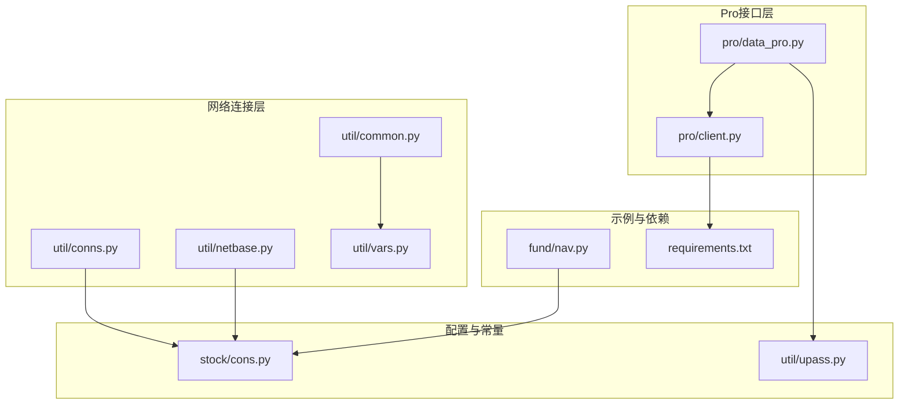
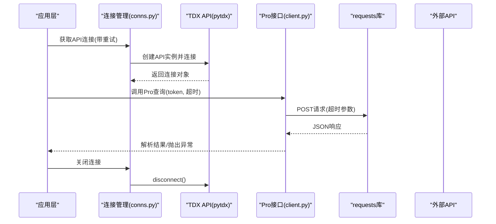
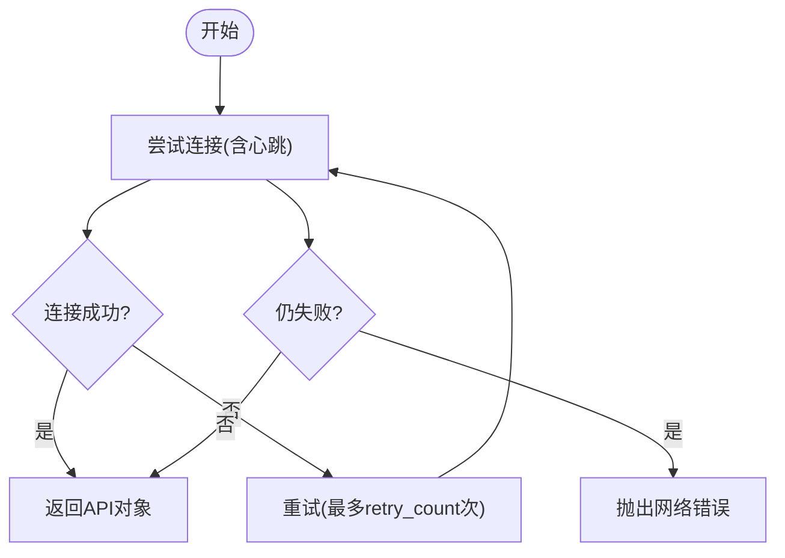
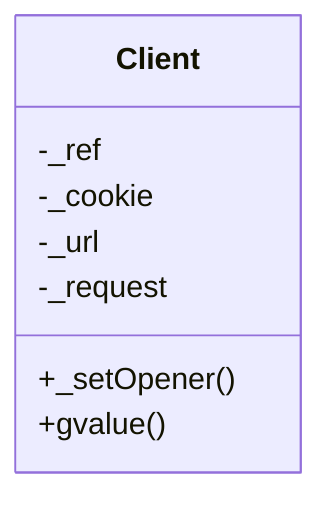
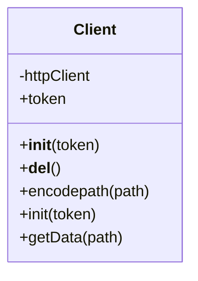
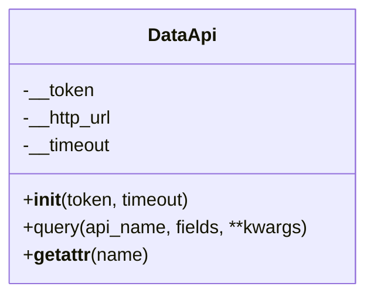
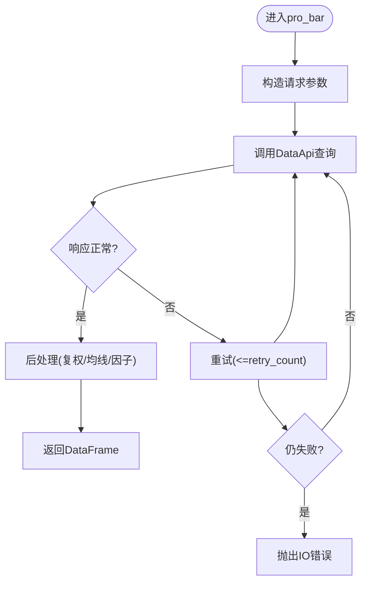
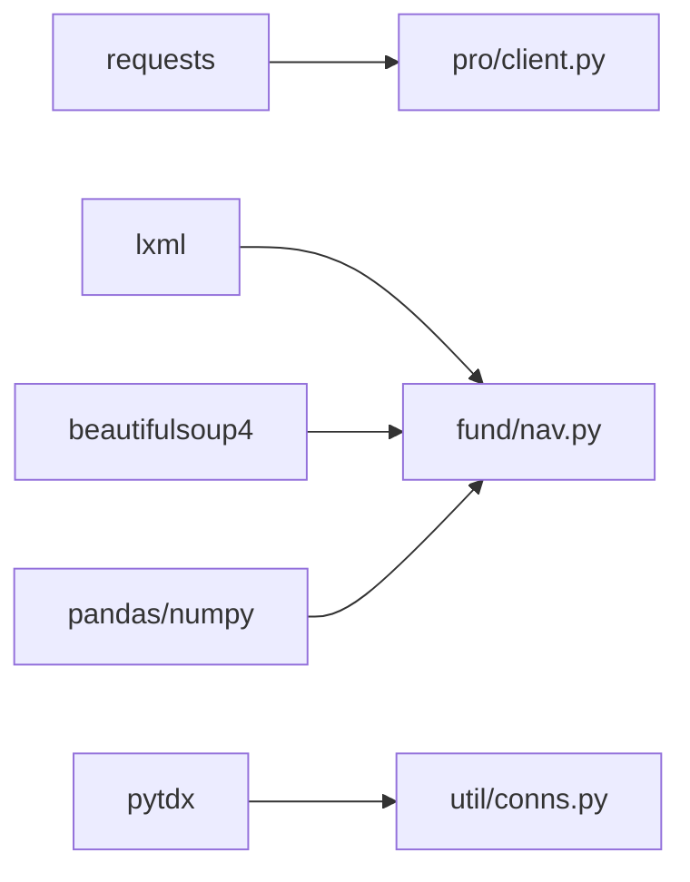

# 网络连接管理

<cite>
**本文引用的文件**
- [conns.py](file://tushare/util/conns.py)
- [netbase.py](file://tushare/util/netbase.py)
- [client.py](file://tushare/pro/client.py)
- [data_pro.py](file://tushare/pro/data_pro.py)
- [common.py](file://tushare/util/common.py)
- [cons.py](file://tushare/stock/cons.py)
- [vars.py](file://tushare/util/vars.py)
- [upass.py](file://tushare/util/upass.py)
- [nav.py](file://tushare/fund/nav.py)
- [requirements.txt](file://requirements.txt)
</cite>

## 目录
1. [简介](#简介)
2. [项目结构](#项目结构)
3. [核心组件](#核心组件)
4. [架构总览](#架构总览)
5. [详细组件分析](#详细组件分析)
6. [依赖分析](#依赖分析)
7. [性能考虑](#性能考虑)
8. [故障排查指南](#故障排查指南)
9. [结论](#结论)
10. [附录](#附录)

## 简介
本文件面向TuShare网络连接管理模块，系统化梳理HTTP请求封装、代理设置、超时处理、连接池管理、连接重试与错误处理、性能优化与调试监控等关键技术点。文档以代码级分析为基础，结合流程图与类图，帮助开发者快速理解并正确使用网络连接工具，同时给出与第三方API集成的最佳实践与排障建议。

## 项目结构
围绕网络连接管理的关键文件分布如下：
- util层：conns.py（连接池/心跳管理）、netbase.py（基础HTTP客户端）、common.py（HTTPS连接封装）、vars.py（API路径与端口常量）
- pro层：client.py（Pro数据接口封装）、data_pro.py（Pro业务调用入口与重试）
- stock/cons.py：网络常量与服务器地址选择逻辑
- fund/nav.py：基于urllib的HTTP请求与超时控制示例
- util/upass.py：令牌持久化与读取
- requirements.txt：网络相关依赖（requests等）

**图表来源**
- [conns.py:14-61](file://tushare/util/conns.py#L14-L61)
- [netbase.py:9-29](file://tushare/util/netbase.py#L9-L29)
- [common.py:18-86](file://tushare/util/common.py#L18-L86)
- [vars.py:1-598](file://tushare/util/vars.py#L1-L598)
- [client.py:17-52](file://tushare/pro/client.py#L17-L52)
- [data_pro.py:21-158](file://tushare/pro/data_pro.py#L21-L158)
- [cons.py:437-453](file://tushare/stock/cons.py#L437-L453)
- [upass.py:16-31](file://tushare/util/upass.py#L16-L31)
- [nav.py:193-420](file://tushare/fund/nav.py#L193-L420)
- [requirements.txt:1-6](file://requirements.txt#L1-L6)

**章节来源**
- [conns.py:14-61](file://tushare/util/conns.py#L14-L61)
- [netbase.py:9-29](file://tushare/util/netbase.py#L9-L29)
- [common.py:18-86](file://tushare/util/common.py#L18-L86)
- [vars.py:1-598](file://tushare/util/vars.py#L1-L598)
- [client.py:17-52](file://tushare/pro/client.py#L17-L52)
- [data_pro.py:21-158](file://tushare/pro/data_pro.py#L21-L158)
- [cons.py:437-453](file://tushare/stock/cons.py#L437-L453)
- [upass.py:16-31](file://tushare/util/upass.py#L16-L31)
- [nav.py:193-420](file://tushare/fund/nav.py#L193-L420)
- [requirements.txt:1-6](file://requirements.txt#L1-L6)

## 核心组件
- 连接池与心跳管理：通过pytdx库的API对象进行连接与断开，支持心跳保活与多服务器IP轮选。
- 基础HTTP客户端：封装Request与urlopen，统一请求头、超时与响应读取。
- Pro数据接口：基于requests的POST请求，内置超时与错误码校验。
- HTTPS连接封装：基于http.client/httplib的显式连接与关闭，便于资源回收。
- 配置与常量：服务器地址列表、端口、URL模板、错误提示信息。
- 令牌管理：本地CSV存储与读取，保障Pro接口认证。
- 示例与依赖：基于urllib的超时控制与重试模式，requests作为网络栈依赖。

**章节来源**
- [conns.py:14-61](file://tushare/util/conns.py#L14-L61)
- [netbase.py:9-29](file://tushare/util/netbase.py#L9-L29)
- [client.py:17-52](file://tushare/pro/client.py#L17-L52)
- [common.py:18-86](file://tushare/util/common.py#L18-L86)
- [cons.py:437-453](file://tushare/stock/cons.py#L437-L453)
- [upass.py:16-31](file://tushare/util/upass.py#L16-L31)
- [nav.py:193-420](file://tushare/fund/nav.py#L193-L420)
- [requirements.txt:1-6](file://requirements.txt#L1-L6)

## 架构总览
下图展示了从应用到外部服务的网络交互路径，涵盖连接建立、请求发送、响应解析与错误处理：

**图表来源**
- [conns.py:14-61](file://tushare/util/conns.py#L14-L61)
- [client.py:32-48](file://tushare/pro/client.py#L32-L48)
- [data_pro.py:69-140](file://tushare/pro/data_pro.py#L69-L140)

## 详细组件分析

### 组件A：连接池与心跳管理（pytdx）
- 功能要点
  - 提供api/xapi/xapi_x三类连接，分别对应不同行情服务器。
  - 支持心跳保活（heartbeat=True）。
  - 多IP轮选与重试机制，失败自动重试至成功或抛出网络错误。
  - 提供连接关闭函数，确保资源释放。
- 数据结构与复杂度
  - 连接对象为pytdx API实例，操作复杂度主要受网络延迟影响。
  - 重试循环为O(k)，k为retry_count。
- 错误处理
  - 异常捕获并打印，最终失败抛出统一网络错误消息。
- 性能与优化
  - 心跳保活减少断线重连成本。
  - 多IP轮选提升可用性与稳定性。

**图表来源**
- [conns.py:14-35](file://tushare/util/conns.py#L14-L35)

**章节来源**
- [conns.py:14-61](file://tushare/util/conns.py#L14-L61)
- [cons.py:437-453](file://tushare/stock/cons.py#L437-L453)

### 组件B：基础HTTP客户端（netbase.py）
- 功能要点
  - 统一设置请求头（Accept-Language、Connection、User-Agent、Cookie等）。
  - 使用urlopen发起请求并设置超时。
- 数据流
  - 构造Request -> 设置头部 -> 发起请求 -> 读取响应 -> 返回数据。
- 错误处理
  - 超时与网络异常在上层捕获，此处保持最小异常传播。

**图表来源**
- [netbase.py:9-29](file://tushare/util/netbase.py#L9-L29)

**章节来源**
- [netbase.py:9-29](file://tushare/util/netbase.py#L9-L29)

### 组件C：HTTPS连接封装（common.py）
- 功能要点
  - 基于HTTPSConnection建立持久连接，支持手动close。
  - GET请求携带Authorization头，统一编码路径。
  - 对响应状态码进行判定与处理。
- 资源管理
  - 析构函数中主动关闭连接，避免资源泄露。

**图表来源**
- [common.py:18-86](file://tushare/util/common.py#L18-L86)
- [vars.py:4-7](file://tushare/util/vars.py#L4-L7)

**章节来源**
- [common.py:18-86](file://tushare/util/common.py#L18-L86)
- [vars.py:4-7](file://tushare/util/vars.py#L4-L7)

### 组件D：Pro数据接口（client.py）
- 功能要点
  - DataApi封装token与超时，统一POST请求。
  - 对响应JSON进行解析，校验code字段，非0则抛出异常。
- 可扩展性
  - 通过动态属性转发到query，便于按API名调用。

**图表来源**
- [client.py:17-52](file://tushare/pro/client.py#L17-L52)

**章节来源**
- [client.py:17-52](file://tushare/pro/client.py#L17-L52)

### 组件E：Pro业务调用与重试（data_pro.py）
- 功能要点
  - pro_bar对不同资产类型与频率进行分支处理。
  - 内置retry_count重试机制，异常时打印并返回None或抛出IO错误。
- 参数与行为
  - 支持复权、均线、因子等增强输出。

**图表来源**
- [data_pro.py:34-140](file://tushare/pro/data_pro.py#L34-L140)

**章节来源**
- [data_pro.py:34-140](file://tushare/pro/data_pro.py#L34-L140)

### 组件F：令牌管理（upass.py）
- 功能要点
  - set_token写入用户主目录下的CSV文件。
  - get_token读取并返回token，不存在时打印错误提示。
- 安全与可靠性
  - 本地存储便于自动化脚本使用，注意权限与备份。

**章节来源**
- [upass.py:16-31](file://tushare/util/upass.py#L16-L31)

### 组件G：超时与重试示例（fund/nav.py）
- 功能要点
  - 基于urllib的urlopen设置timeout。
  - 历史净值接口支持retry_count/pause/timeout参数，内部循环重试。
- 适用场景
  - 大量数据拉取时的稳健性保障。

**章节来源**
- [nav.py:193-420](file://tushare/fund/nav.py#L193-L420)

## 依赖分析
- requests：Pro接口POST请求与JSON解析依赖。
- lxml、beautifulsoup4：通用解析与HTML/XML处理依赖。
- pandas、numpy：数据结构与数值计算依赖。
- pytdx：行情连接与心跳管理依赖。

**图表来源**
- [requirements.txt:1-6](file://requirements.txt#L1-L6)
- [client.py:14-14](file://tushare/pro/client.py#L14-L14)
- [nav.py:11-17](file://tushare/fund/nav.py#L11-L17)
- [conns.py:9-11](file://tushare/util/conns.py#L9-L11)

**章节来源**
- [requirements.txt:1-6](file://requirements.txt#L1-L6)
- [client.py:14-14](file://tushare/pro/client.py#L14-L14)
- [nav.py:11-17](file://tushare/fund/nav.py#L11-L17)
- [conns.py:9-11](file://tushare/util/conns.py#L9-L11)

## 性能考虑
- 连接复用
  - 使用HTTPSConnection或requests会话可降低握手开销；当前common.py显式连接，建议在高频调用场景引入会话复用。
- 超时与并发
  - 合理设置timeout，避免阻塞；在批量请求时考虑并发与限速，防止触发外部限流。
- 重试策略
  - 指数退避与抖动可进一步降低热点时段冲突概率（当前为固定重试次数）。
- 缓存与去重
  - 对相同参数的请求进行缓存，减少重复网络开销。
- 心跳与断线恢复
  - 保持心跳可显著降低断线重连成本；失败后快速切换备用IP。

[本节为通用指导，无需特定文件引用]

## 故障排查指南
- 网络错误
  - 统一错误消息：检查网络连通性、DNS解析与防火墙策略。
  - 连接失败：确认服务器IP列表是否可用，重试次数是否足够。
- 认证失败
  - Pro接口：确认token是否正确且已持久化；检查upass读取逻辑。
- 超时问题
  - 调整timeout参数；对大体量数据分页或限速。
- SSL/TLS问题
  - 当前HTTP客户端未显式配置SSL参数；如遇证书校验问题，可在环境层面调整或使用代理。
- 日志与调试
  - 在异常捕获处增加日志记录，定位具体请求与响应上下文。

**章节来源**
- [cons.py:195-195](file://tushare/stock/cons.py#L195-L195)
- [upass.py:23-31](file://tushare/util/upass.py#L23-L31)
- [client.py:42-44](file://tushare/pro/client.py#L42-L44)
- [nav.py:370-419](file://tushare/fund/nav.py#L370-L419)

## 结论
TuShare网络连接管理模块通过多层封装实现了连接生命周期管理、超时控制、重试与错误处理。建议在生产环境中引入会话复用、指数退避重试、请求缓存与更细粒度的日志监控，以进一步提升稳定性与性能。对于第三方API集成，遵循统一的超时与重试策略，并做好认证与证书校验的配置与审计。

[本节为总结性内容，无需特定文件引用]

## 附录

### A. 配置与使用示例（路径指引）
- 设置Pro token并读取
  - [set_token:16-20](file://tushare/util/upass.py#L16-L20)
  - [get_token:23-31](file://tushare/util/upass.py#L23-L31)
- 获取API连接并关闭
  - [get_apis:50-51](file://tushare/util/conns.py#L50-L51)
  - [close_apis:54-61](file://tushare/util/conns.py#L54-L61)
- 调用Pro接口（带重试）
  - [pro_bar:34-140](file://tushare/pro/data_pro.py#L34-L140)
- 基础HTTP请求（超时控制）
  - [Client.gvalue:26-29](file://tushare/util/netbase.py#L26-L29)
  - [get_nav_history:193-233](file://tushare/fund/nav.py#L193-L233)

**章节来源**
- [upass.py:16-31](file://tushare/util/upass.py#L16-L31)
- [conns.py:50-61](file://tushare/util/conns.py#L50-L61)
- [data_pro.py:34-140](file://tushare/pro/data_pro.py#L34-L140)
- [netbase.py:26-29](file://tushare/util/netbase.py#L26-L29)
- [nav.py:193-233](file://tushare/fund/nav.py#L193-L233)

### B. 常量与服务器地址
- 服务器IP列表与端口
  - [SLIST/XLIST/XXLIST/T_PORT/X_PORT:349-356](file://tushare/stock/cons.py#L349-L356)
- URL模板与端口
  - [HTTP_URL/HTTP_PORT:6-7](file://tushare/util/vars.py#L6-L7)

**章节来源**
- [cons.py:349-356](file://tushare/stock/cons.py#L349-L356)
- [vars.py:6-7](file://tushare/util/vars.py#L6-L7)