# 通用工具函数

<cite>
**本文档引用的文件**
- [common.py](file://tushare/util/common.py)
- [mailmerge.py](file://tushare/util/mailmerge.py)
- [upass.py](file://tushare/util/upass.py)
- [dateu.py](file://tushare/util/dateu.py)
- [formula.py](file://tushare/util/formula.py)
- [store.py](file://tushare/util/store.py)
- [conns.py](file://tushare/util/conns.py)
- [netbase.py](file://tushare/util/netbase.py)
- [vars.py](file://tushare/util/vars.py)
- [cons.py](file://tushare/stock/cons.py)
</cite>

## 目录
1. [简介](#简介)
2. [项目结构](#项目结构)
3. [核心组件](#核心组件)
4. [架构总览](#架构总览)
5. [详细组件分析](#详细组件分析)
6. [依赖关系分析](#依赖关系分析)
7. [性能考量](#性能考量)
8. [故障排查指南](#故障排查指南)
9. [结论](#结论)
10. [附录](#附录)

## 简介
本文件系统化梳理 TuShare 的通用工具函数体系，涵盖公共函数、认证工具、邮件合并、日期与公式计算、数据存储与网络连接等模块。文档以代码级分析为基础，结合类图、时序图与流程图，帮助开发者理解设计原则、实现机制与扩展方法，并提供常见问题的排查建议与最佳实践。

## 项目结构
通用工具函数主要位于 tushare/util 目录，配合 tushare/stock/cons 提供常量与配置，形成“工具函数 + 配置常量”的协作模式。

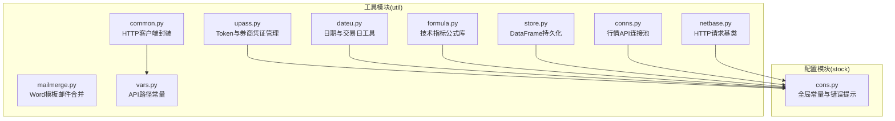

图表来源
- [common.py:1-86](file://tushare/util/common.py#L1-L86)
- [mailmerge.py:1-219](file://tushare/util/mailmerge.py#L1-L219)
- [upass.py:1-62](file://tushare/util/upass.py#L1-L62)
- [dateu.py:1-129](file://tushare/util/dateu.py#L1-L129)
- [formula.py:1-262](file://tushare/util/formula.py#L1-L262)
- [store.py:1-44](file://tushare/util/store.py#L1-L44)
- [conns.py:1-61](file://tushare/util/conns.py#L1-L61)
- [netbase.py:1-29](file://tushare/util/netbase.py#L1-L29)
- [vars.py:1-598](file://tushare/util/vars.py#L1-L598)
- [cons.py:1-453](file://tushare/stock/cons.py#L1-L453)

章节来源
- [common.py:1-86](file://tushare/util/common.py#L1-L86)
- [mailmerge.py:1-219](file://tushare/util/mailmerge.py#L1-L219)
- [upass.py:1-62](file://tushare/util/upass.py#L1-L62)
- [dateu.py:1-129](file://tushare/util/dateu.py#L1-L129)
- [formula.py:1-262](file://tushare/util/formula.py#L1-L262)
- [store.py:1-44](file://tushare/util/store.py#L1-L44)
- [conns.py:1-61](file://tushare/util/conns.py#L1-L61)
- [netbase.py:1-29](file://tushare/util/netbase.py#L1-L29)
- [vars.py:1-598](file://tushare/util/vars.py#L1-L598)
- [cons.py:1-453](file://tushare/stock/cons.py#L1-L453)

## 核心组件
- HTTP 客户端封装：统一 Token 认证、URL 编码、响应处理与异常抛出。
- 邮件合并：解析 Word 文档中的 MERGEFIELD，批量替换文本与表格行。
- 认证工具：Token 存取、Broker 凭证管理，配合全局常量进行错误提示。
- 日期工具：日期区间、交易日判断、季度转换、随机数生成等。
- 技术指标公式库：基于 pandas/numpy 的常用技术指标实现。
- 数据存储：DataFrame 保存为 CSV 文件，支持目录创建与默认命名。
- 行情连接：基于 pytdx 的行情 API 连接与断开管理。
- 网络请求基类：统一 UA、Cookie、Referer 设置与超时控制。
- API 路径常量：集中管理各接口路径模板，便于维护与扩展。

章节来源
- [common.py:18-86](file://tushare/util/common.py#L18-L86)
- [mailmerge.py:22-219](file://tushare/util/mailmerge.py#L22-L219)
- [upass.py:16-62](file://tushare/util/upass.py#L16-L62)
- [dateu.py:8-129](file://tushare/util/dateu.py#L8-L129)
- [formula.py:8-262](file://tushare/util/formula.py#L8-L262)
- [store.py:14-44](file://tushare/util/store.py#L14-L44)
- [conns.py:14-61](file://tushare/util/conns.py#L14-L61)
- [netbase.py:9-29](file://tushare/util/netbase.py#L9-L29)
- [vars.py:1-598](file://tushare/util/vars.py#L1-L598)
- [cons.py:190-202](file://tushare/stock/cons.py#L190-L202)

## 架构总览
通用工具函数围绕“配置常量 + 工具类 + 业务适配器”的分层设计：
- 配置层：vars.py 统一存放 API 路径模板；cons.py 提供全局常量与错误提示。
- 工具层：common、mailmerge、upass、dateu、formula、store、conns、netbase 提供基础能力。
- 适配层：业务模块通过工具层提供的类与函数完成具体任务。

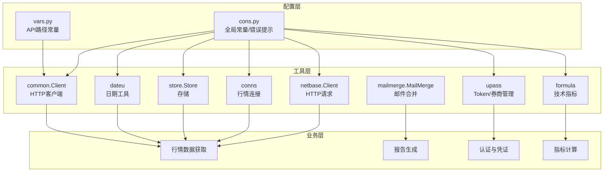

图表来源
- [vars.py:1-598](file://tushare/util/vars.py#L1-L598)
- [cons.py:1-453](file://tushare/stock/cons.py#L1-L453)
- [common.py:18-86](file://tushare/util/common.py#L18-L86)
- [mailmerge.py:22-219](file://tushare/util/mailmerge.py#L22-L219)
- [upass.py:16-62](file://tushare/util/upass.py#L16-L62)
- [dateu.py:8-129](file://tushare/util/dateu.py#L8-L129)
- [formula.py:8-262](file://tushare/util/formula.py#L8-L262)
- [store.py:14-44](file://tushare/util/store.py#L14-L44)
- [conns.py:14-61](file://tushare/util/conns.py#L14-L61)
- [netbase.py:9-29](file://tushare/util/netbase.py#L9-L29)

## 详细组件分析

### HTTP 客户端封装（common.Client）
- 设计目标：统一 Token 认证、URL 路径编码、响应状态处理与异常抛出。
- 关键点：
  - 使用 HTTPSConnection 进行请求，headers 中携带 Authorization: Bearer token。
  - encodepath 对路径中的非 ASCII 字符进行编码，确保中文等字符安全传输。
  - 支持 CSV 返回的 GBK 解码与 UTF-8 编码转换。
  - 异常直接抛出，便于上层捕获与重试。

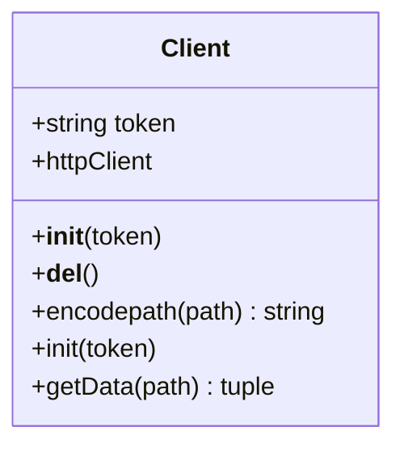

图表来源
- [common.py:18-86](file://tushare/util/common.py#L18-L86)

章节来源
- [common.py:18-86](file://tushare/util/common.py#L18-L86)
- [vars.py:4-7](file://tushare/util/vars.py#L4-L7)

### 邮件合并（mailmerge.MailMerge）
- 设计目标：解析并替换 Word 文档中的 MERGEFIELD，支持文本替换与表格行复制。
- 关键点：
  - 解析 [Content_Types].xml 识别正文、页眉、页脚与设置节点。
  - 使用正则匹配 MERGEFIELD 指令，构建 MergeField/MergeText 节点树。
  - 支持 merge_pages 批量复制模板页面并在每组间插入分页符。
  - 支持 merge_rows 在锚点处插入多行数据，空数据时可选择删除整张表。
  - write 将未匹配字段替换为空，输出新文档并清理临时节点。

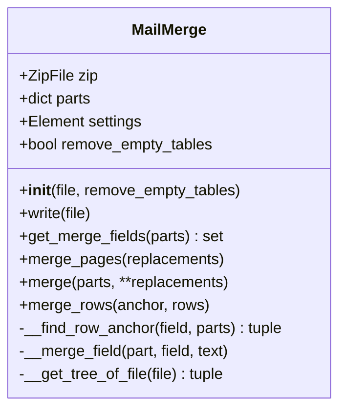

图表来源
- [mailmerge.py:22-219](file://tushare/util/mailmerge.py#L22-L219)

章节来源
- [mailmerge.py:22-219](file://tushare/util/mailmerge.py#L22-L219)

### 认证工具（upass）
- 设计目标：提供 Token 与 Broker 凭证的读写与管理。
- 关键点：
  - set_token 将 token 写入用户主目录下的 tk.csv。
  - get_token 从 tk.csv 读取 token，不存在时打印错误提示并返回 None。
  - set_broker/get_broker/remove_broker 提供券商信息的增删改查，支持重复覆盖与文件存在性判断。

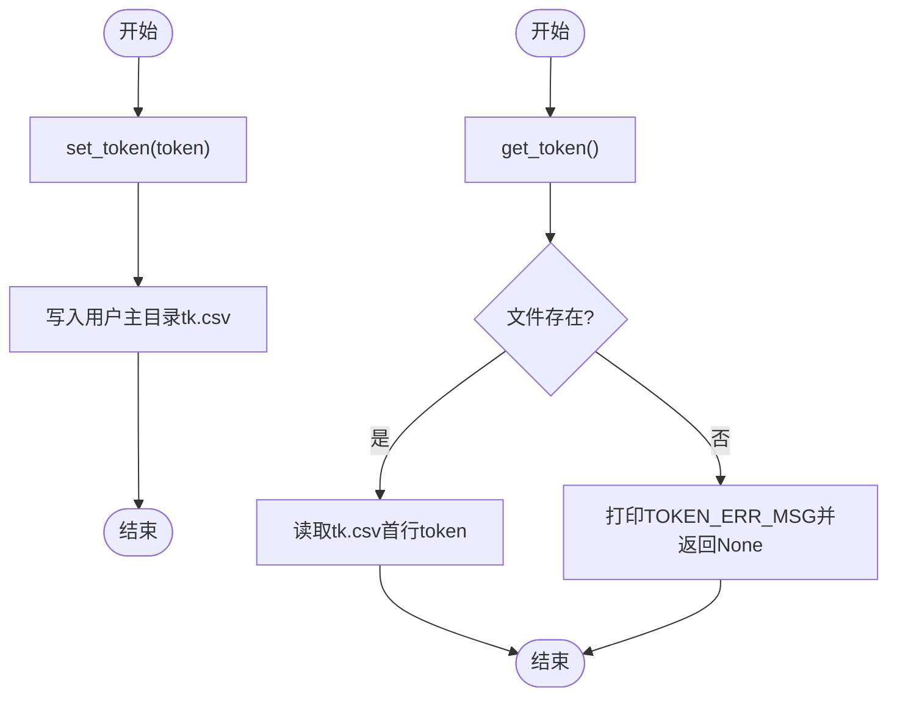

图表来源
- [upass.py:16-31](file://tushare/util/upass.py#L16-L31)
- [cons.py:200-201](file://tushare/stock/cons.py#L200-L201)

章节来源
- [upass.py:16-62](file://tushare/util/upass.py#L16-L62)
- [cons.py:190-202](file://tushare/stock/cons.py#L190-L202)

### 日期工具（dateu）
- 设计目标：提供日期计算、交易日判断、季度转换、随机数生成等基础能力。
- 关键点：
  - year_qua 与 _quar 将月份映射到季度。
  - today/get_year/get_month/get_hour 提供当前时间片段。
  - diff_day 计算两个日期相差天数。
  - get_quarts 生成季度序列。
  - trade_cal 读取交易日历，is_holiday 判断是否为节假日。
  - last_tddate 根据周几推导最近交易日。
  - _random 生成固定长度随机数字符串。

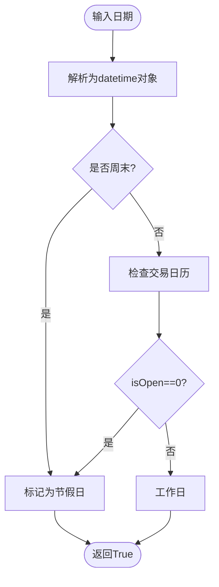

图表来源
- [dateu.py:87-99](file://tushare/util/dateu.py#L87-L99)
- [cons.py:103](file://tushare/stock/cons.py#L103)

章节来源
- [dateu.py:8-129](file://tushare/util/dateu.py#L8-L129)
- [cons.py:103](file://tushare/stock/cons.py#L103)

### 技术指标公式库（formula）
- 设计目标：提供常用技术指标的向量化实现，便于与 pandas DataFrame 结合使用。
- 关键点：
  - EMA/MA/SMA/ATR/HHV/LLV/SUM/ABS/MAX/MIN/IF/REF/STD 等基础函数。
  - MACD/KDJ/OSC/BBI/BBIBOLL/PBX/BOLL/ROC/MTM/MFI/SKDJ/WR/BIAS/RSI/DDI/ADTM 等复合指标。
  - 所有函数以 pandas/numpy 为基础，返回 Series 或 DataFrame，保持索引一致性。

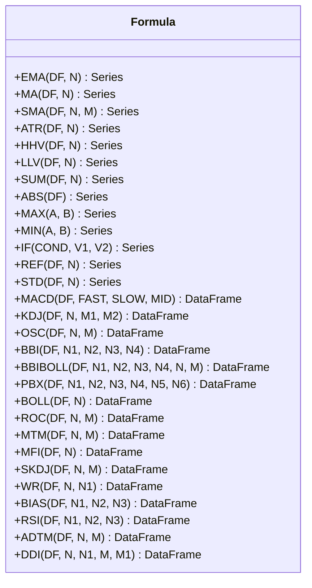

图表来源
- [formula.py:8-262](file://tushare/util/formula.py#L8-L262)

章节来源
- [formula.py:8-262](file://tushare/util/formula.py#L8-L262)

### 数据存储（store.Store）
- 设计目标：将 pandas DataFrame 保存为 CSV 文件，支持自定义文件名与路径。
- 关键点：
  - 构造函数校验 data 类型为 DataFrame，否则抛出运行时错误。
  - save_as 支持 name/path/to 默认值，自动创建目录并拼接文件路径。
  - 输入校验与错误提示，避免无效参数导致异常。

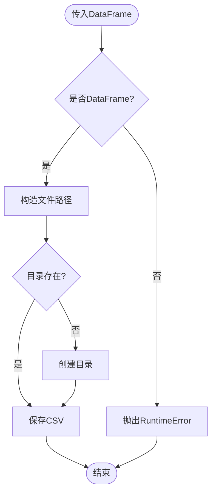

图表来源
- [store.py:14-44](file://tushare/util/store.py#L14-L44)

章节来源
- [store.py:14-44](file://tushare/util/store.py#L14-L44)

### 行情连接（conns）
- 设计目标：提供稳定可靠的行情 API 连接与断开管理。
- 关键点：
  - api/xapi/xapi_x 通过 TdxHq_API/TdxExHq_API 连接不同服务器与端口。
  - 重试机制与统一错误提示，失败时抛出网络异常。
  - close_apis 统一断开连接，避免资源泄漏。

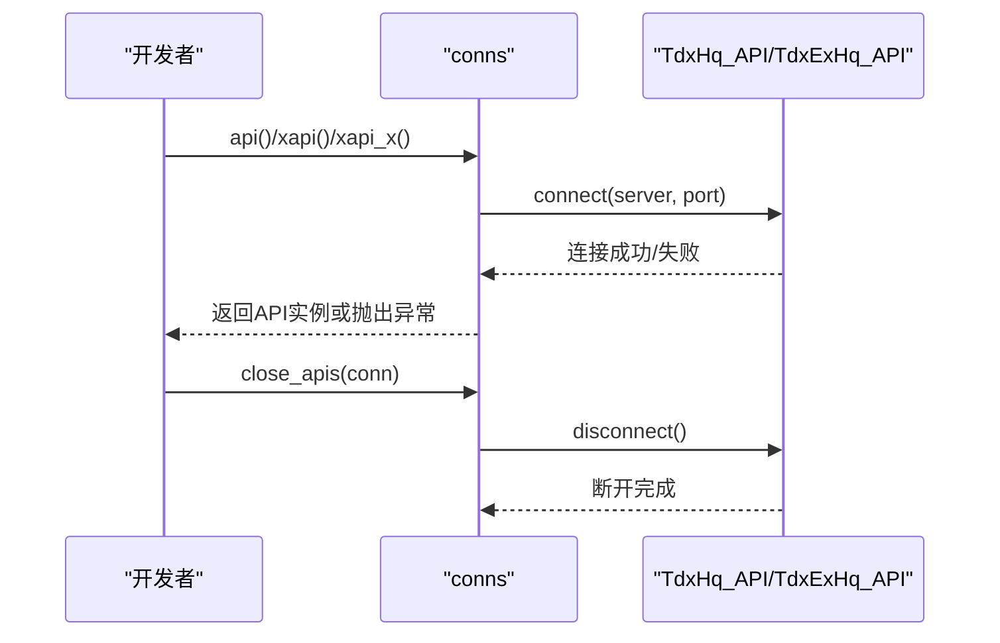

图表来源
- [conns.py:14-61](file://tushare/util/conns.py#L14-L61)
- [cons.py:354-355](file://tushare/stock/cons.py#L354-L355)

章节来源
- [conns.py:14-61](file://tushare/util/conns.py#L14-L61)
- [cons.py:354-355](file://tushare/stock/cons.py#L354-L355)

### 网络请求基类（netbase.Client）
- 设计目标：统一 HTTP 请求头设置、Cookie 与 Referer 控制、超时处理。
- 关键点：
  - 初始化时设置 Accept-Language、Connection、User-Agent 等头部。
  - gvalue 执行请求并返回响应内容，支持超时控制。

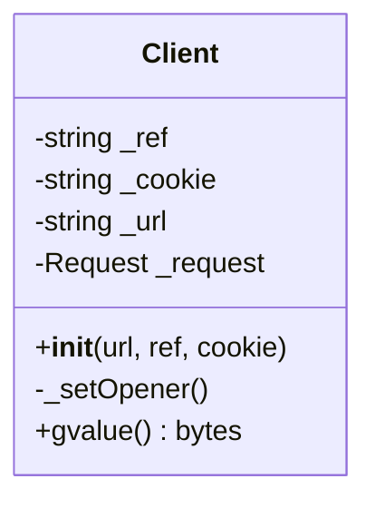

图表来源
- [netbase.py:9-29](file://tushare/util/netbase.py#L9-L29)

章节来源
- [netbase.py:9-29](file://tushare/util/netbase.py#L9-L29)

### API 路径常量（vars）
- 设计目标：集中管理各接口路径模板，便于维护与扩展。
- 关键点：
  - 按模块分类（债券、权益、指数、市场、基金、宏观等）定义路径模板。
  - 支持字段参数化，便于按需选择返回字段。

章节来源
- [vars.py:1-598](file://tushare/util/vars.py#L1-L598)

## 依赖关系分析
- common.Client 依赖 vars.py 中的 HTTP_URL/HTTP_PORT/HTTP_OK 常量。
- upass 依赖 cons.py 中 TOKEN_F_P 与 TOKEN_ERR_MSG。
- dateu 依赖 cons.py 中 ALL_CAL_FILE。
- formula 与 store 无外部依赖，仅依赖 pandas/numpy。
- conns 依赖 pytdx 与 cons.py 中服务器与端口常量。
- netbase 依赖 urllib/urllib2（Python2/3 兼容）。
- mailmerge 依赖 lxml 与 zipfile。

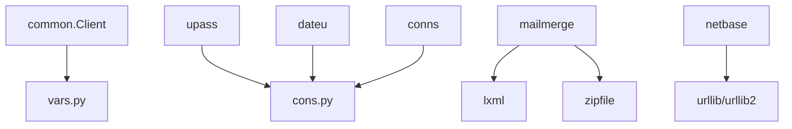

图表来源
- [common.py:15-16](file://tushare/util/common.py#L15-L16)
- [vars.py:6-7](file://tushare/util/vars.py#L6-L7)
- [upass.py:12](file://tushare/util/upass.py#L12)
- [cons.py:200-201](file://tushare/stock/cons.py#L200-L201)
- [dateu.py:83](file://tushare/util/dateu.py#L83)
- [cons.py:103](file://tushare/stock/cons.py#L103)
- [conns.py:9-11](file://tushare/util/conns.py#L9-L11)
- [cons.py:354-355](file://tushare/stock/cons.py#L354-L355)
- [mailmerge.py:1-6](file://tushare/util/mailmerge.py#L1-L6)
- [netbase.py:3-6](file://tushare/util/netbase.py#L3-L6)

章节来源
- [common.py:15-16](file://tushare/util/common.py#L15-L16)
- [vars.py:6-7](file://tushare/util/vars.py#L6-L7)
- [upass.py:12](file://tushare/util/upass.py#L12)
- [cons.py:200-201](file://tushare/stock/cons.py#L200-L201)
- [dateu.py:83](file://tushare/util/dateu.py#L83)
- [cons.py:103](file://tushare/stock/cons.py#L103)
- [conns.py:9-11](file://tushare/util/conns.py#L9-L11)
- [cons.py:354-355](file://tushare/stock/cons.py#L354-L355)
- [mailmerge.py:1-6](file://tushare/util/mailmerge.py#L1-L6)
- [netbase.py:3-6](file://tushare/util/netbase.py#L3-L6)

## 性能考量
- HTTP 客户端：HTTPSConnection 为长连接，适合多次请求；注意在异常时及时关闭连接，避免资源泄漏。
- 邮件合并：大量 MERGEFIELD 与表格行替换会增加内存与 CPU 开销，建议分批处理与合理缓存。
- 技术指标：基于 pandas/numpy 的向量化计算通常性能优异，但要注意大数据集的内存占用与分块处理。
- 存储：save_as 自动创建目录，避免频繁 IO 操作；建议批量写入与异步处理。
- 行情连接：重试机制与断开管理有助于提升稳定性，但应限制重试次数与超时时间。

## 故障排查指南
- Token 未设置：调用 get_token() 返回 None 并打印错误提示，需先 set_token()。
- 网络连接失败：conns 模块在多次重试后仍失败会抛出网络异常，检查网络与服务器地址。
- 日期格式错误：dateu 中输入校验会抛出类型错误，确保传入合法日期字符串。
- DataFrame 类型错误：store.Store 构造函数会抛出运行时错误，确保传入 pandas DataFrame。
- HTTP 响应异常：common.Client 在非 200 状态时返回状态码与响应体，需根据状态码处理。

章节来源
- [cons.py:190-202](file://tushare/stock/cons.py#L190-L202)
- [conns.py:23](file://tushare/util/conns.py#L23)
- [dateu.py:375-381](file://tushare/util/dateu.py#L375-L381)
- [store.py:20](file://tushare/util/store.py#L20)
- [common.py:72-84](file://tushare/util/common.py#L72-L84)

## 结论
TuShare 的通用工具函数以“配置常量 + 工具类 + 业务适配器”的方式组织，具备良好的内聚性与低耦合性。通过统一的认证、日期、存储、网络与连接管理，为上层业务提供了稳定可靠的基础能力。建议在实际使用中遵循错误处理与资源管理的最佳实践，并结合性能考量进行分批处理与缓存优化。

## 附录
- 扩展建议：
  - 新增工具函数时，优先在 util 下新增模块并集中于 vars.py/cons.py 维护常量。
  - 对外暴露的函数应提供明确的参数校验与异常提示。
  - 对于耗时操作，提供进度反馈与中断机制。
- 最佳实践：
  - 使用 with 上下文管理器确保资源释放（如连接、文件）。
  - 对外部依赖（lxml、pytdx、pandas）进行版本兼容性测试。
  - 对关键路径（HTTP、文件 IO、数据库）进行超时与重试策略配置。