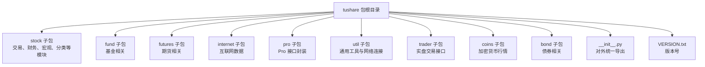
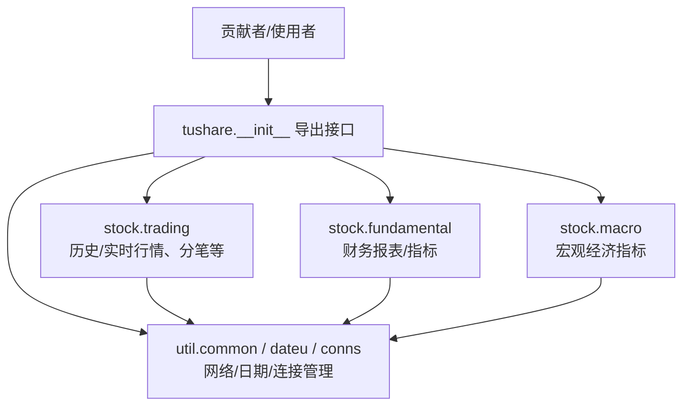
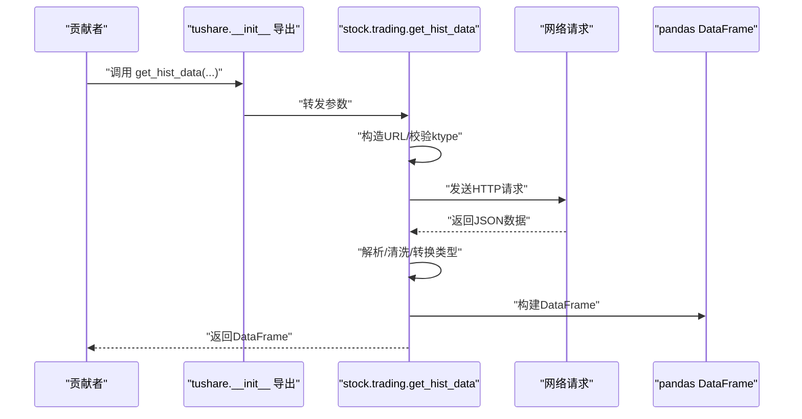
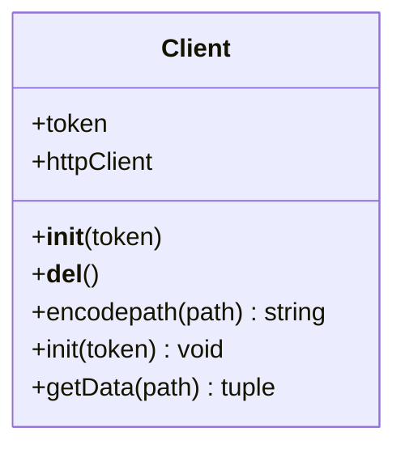
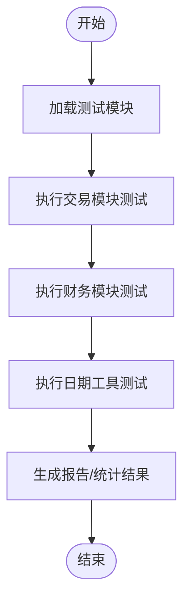
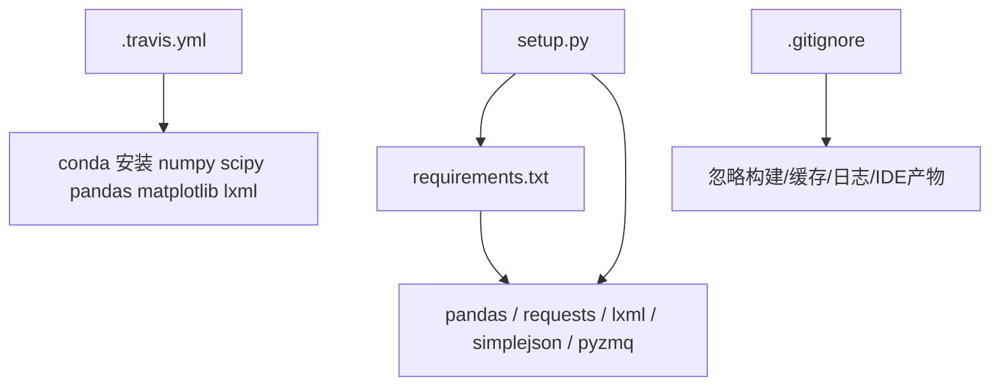

# 代码贡献

<cite>
**本文引用的文件**
- [README.md](file://README.md)
- [setup.py](file://setup.py)
- [requirements.txt](file://requirements.txt)
- [.travis.yml](file://.travis.yml)
- [test_unittest.py](file://test_unittest.py)
- [test/trading_test.py](file://test/trading_test.py)
- [test/fund_test.py](file://test/fund_test.py)
- [test/dateu_test.py](file://test/dateu_test.py)
- [.gitignore](file://.gitignore)
- [tushare/__init__.py](file://tushare/__init__.py)
- [tushare/util/common.py](file://tushare/util/common.py)
- [tushare/VERSION.txt](file://tushare/VERSION.txt)
- [whats_new.md](file://whats_new.md)
</cite>

## 目录
1. [简介](#简介)
2. [项目结构](#项目结构)
3. [核心组件](#核心组件)
4. [架构总览](#架构总览)
5. [详细组件分析](#详细组件分析)
6. [依赖分析](#依赖分析)
7. [性能考量](#性能考量)
8. [故障排查指南](#故障排查指南)
9. [结论](#结论)
10. [附录](#附录)

## 简介
本指南面向希望为 TuShare 项目贡献代码的开发者，系统阐述贡献流程与规范要求，涵盖提交前准备（代码风格、单元测试）、Pull Request 创建流程（分支命名、提交信息格式、代码审查）、代码规范（PEP8、变量命名、函数注释）、测试要求（覆盖率、用例规范、环境配置）、文档更新（API 文档、README 更新），以及贡献者行为准则与社区交流方式。

## 项目结构
TuShare 是一个金融数据采集、清洗与存储工具，提供股票/期货等行情与基本面数据接口，并以 pandas DataFrame 作为主要输出格式。项目采用按功能域划分的模块化组织方式，核心入口通过包级导出统一对外暴露。

图表来源
- [tushare/__init__.py:1-140](file://tushare/__init__.py#L1-L140)
- [tushare/VERSION.txt:1-1](file://tushare/VERSION.txt#L1-L1)

章节来源
- [tushare/__init__.py:1-140](file://tushare/__init__.py#L1-L140)
- [README.md:1-411](file://README.md#L1-L411)

## 核心组件
- 统一入口导出：通过包级 __init__.py 将各子模块接口集中导出，便于外部按需导入。
- 数据接口层：如交易数据、财务数据、宏观数据等，均以函数形式提供，返回 pandas DataFrame。
- 工具与网络层：util 提供日期工具、网络连接、通用客户端等能力。
- 测试体系：既有独立的单元测试脚本，也有按模块划分的测试文件，覆盖交易、财务、日期工具等。

章节来源
- [tushare/__init__.py:1-140](file://tushare/__init__.py#L1-L140)
- [tushare/util/common.py:1-86](file://tushare/util/common.py#L1-L86)
- [test_unittest.py:1-25](file://test_unittest.py#L1-L25)
- [test/trading_test.py:1-43](file://test/trading_test.py#L1-L43)
- [test/fund_test.py:1-43](file://test/fund_test.py#L1-L43)
- [test/dateu_test.py:1-20](file://test/dateu_test.py#L1-L20)

## 架构总览
下图展示从客户端调用到数据接口与工具层的整体交互关系。

图表来源
- [tushare/__init__.py:1-140](file://tushare/__init__.py#L1-L140)
- [tushare/util/common.py:1-86](file://tushare/util/common.py#L1-L86)
- [tushare/stock/trading.py:1-200](file://tushare/stock/trading.py#L1-L200)

## 详细组件分析

### 组件A：交易数据接口（示例：历史行情）
该组件负责获取个股历史交易数据，包含参数校验、URL 构造、重试机制、数据清洗与排序等逻辑。

图表来源
- [tushare/stock/trading.py:32-100](file://tushare/stock/trading.py#L32-L100)
- [tushare/__init__.py:11-18](file://tushare/__init__.py#L11-L18)

章节来源
- [tushare/stock/trading.py:1-200](file://tushare/stock/trading.py#L1-L200)
- [tushare/__init__.py:1-140](file://tushare/__init__.py#L1-L140)

### 组件B：通用客户端（网络请求）
通用客户端封装了 HTTP 请求、路径编码与响应处理，具备基本的错误处理与状态判断。

图表来源
- [tushare/util/common.py:18-86](file://tushare/util/common.py#L18-L86)

章节来源
- [tushare/util/common.py:1-86](file://tushare/util/common.py#L1-L86)

### 组件C：测试用例（交易/财务/日期工具）
现有测试覆盖了交易数据、财务数据与日期工具的基本断言，建议在新增或修改功能时同步完善测试。

图表来源
- [test/trading_test.py:1-43](file://test/trading_test.py#L1-L43)
- [test/fund_test.py:1-43](file://test/fund_test.py#L1-L43)
- [test/dateu_test.py:1-20](file://test/dateu_test.py#L1-L20)

章节来源
- [test/trading_test.py:1-43](file://test/trading_test.py#L1-L43)
- [test/fund_test.py:1-43](file://test/fund_test.py#L1-L43)
- [test/dateu_test.py:1-20](file://test/dateu_test.py#L1-L20)

## 依赖分析
- 安装依赖：项目通过 setup.py 和 requirements.txt 声明核心依赖（pandas、requests、lxml、simplejson、beautifulsoup4 等）。
- CI 依赖：Travis CI 使用 conda 安装 Python、numpy、scipy、pandas、matplotlib、lxml 等用于测试运行。
- 忽略项：.gitignore 中定义了构建产物、缓存、日志、IDE 文件等，避免纳入版本控制。

图表来源
- [setup.py:65-74](file://setup.py#L65-L74)
- [requirements.txt:1-6](file://requirements.txt#L1-L6)
- [.travis.yml:26-31](file://.travis.yml#L26-L31)
- [.gitignore:1-78](file://.gitignore#L1-L78)

章节来源
- [setup.py:1-100](file://setup.py#L1-L100)
- [requirements.txt:1-6](file://requirements.txt#L1-L6)
- [.travis.yml:1-33](file://.travis.yml#L1-L33)
- [.gitignore:1-78](file://.gitignore#L1-L78)

## 性能考量
- 网络请求与重试：接口普遍内置 retry_count 与 pause 参数，避免频繁请求导致的网络压力与风控风险。
- 数据类型转换：历史数据在清洗阶段进行类型转换，确保数值列一致性与后续计算效率。
- 输出格式：统一返回 pandas DataFrame，便于进一步处理与序列化。

章节来源
- [tushare/stock/trading.py:32-100](file://tushare/stock/trading.py#L32-L100)

## 故障排查指南
- 网络错误：若出现网络超时或返回空数据，检查 retry_count 与 pause 设置，确认目标站点可用性。
- 编码问题：不同数据源可能采用 GBK/UTF-8 等编码，注意读取与转换。
- 依赖缺失：确保安装 requirements.txt 与 setup.py 中声明的依赖版本满足要求。
- CI 失败：根据 .travis.yml 的安装与脚本步骤逐项核对本地环境差异。

章节来源
- [tushare/stock/trading.py:67-100](file://tushare/stock/trading.py#L67-L100)
- [requirements.txt:1-6](file://requirements.txt#L1-L6)
- [.travis.yml:9-31](file://.travis.yml#L9-L31)

## 结论
本指南基于现有仓库内容，总结了贡献流程、规范与测试要求。建议在提交 PR 前完成代码风格检查、补充单元测试并确保 CI 通过；同时保持与社区沟通渠道畅通，遵循行为准则共同维护项目质量。

## 附录

### 贡献流程与规范要求
- 提交前准备
  - 代码风格：遵循 PEP8 基本规范，保持缩进一致、命名清晰、注释完整。
  - 单元测试：为新增/修改功能编写测试用例，覆盖正常路径与边界条件；确保测试可稳定运行。
  - 本地验证：在本地运行测试脚本，确保无异常；必要时在多 Python 版本下验证兼容性。
- Pull Request 创建
  - 分支命名：建议采用 feature/功能描述、fix/问题描述、docs/文档更新等语义化前缀。
  - 提交信息：采用动宾结构，简要描述变更目的与影响范围，必要时附带 Issue 编号。
  - 代码审查：至少一名维护者审查通过后方可合并；审查要点包括正确性、可读性、性能与安全性。
- 代码规范
  - 变量命名：使用小写与下划线组合，避免缩写；常量使用全大写。
  - 函数注释：使用三引号 docstring，明确参数类型、返回值与异常；复杂逻辑补充说明。
  - 导入顺序：标准库、第三方库、项目内模块分组导入，保持整洁。
- 测试要求
  - 覆盖率：尽量提升关键路径覆盖率，至少保证主流程与异常路径被覆盖。
  - 用例规范：每个测试函数聚焦单一场景；使用 setUp/tearDown 组织公共数据。
  - 环境配置：遵循 .travis.yml 的依赖安装步骤，确保 CI 与本地一致。
- 文档更新
  - API 文档：新增或变更接口需同步更新 README 或新增说明段落。
  - README 更新：在“快速开始”或“变更日志”中补充相关内容。
- 行为准则与社区交流
  - 社区：通过 README 中提供的 QQ 群等渠道进行交流；保持友善与尊重。
  - 行为准则：遵守开源社区礼仪，避免敏感话题；尊重维护者意见。

章节来源
- [README.md:14-20](file://README.md#L14-L20)
- [test_unittest.py:1-25](file://test_unittest.py#L1-L25)
- [.travis.yml:9-31](file://.travis.yml#L9-L31)
- [whats_new.md:1-162](file://whats_new.md#L1-L162)