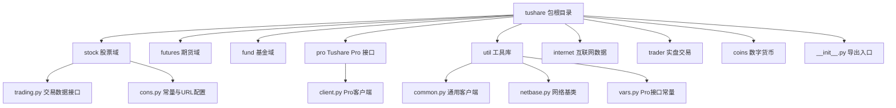
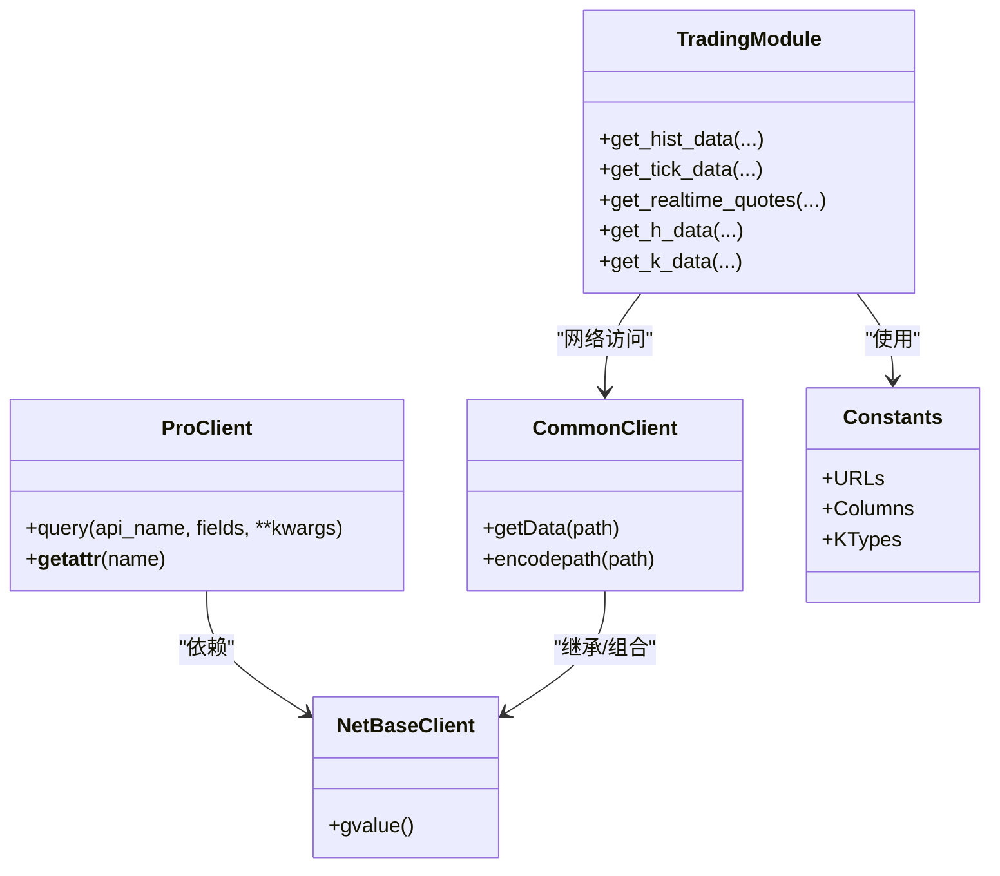
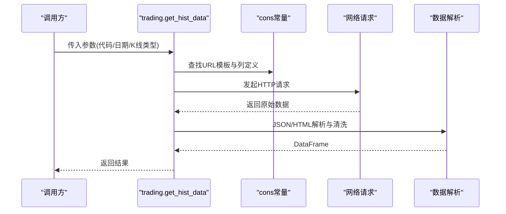
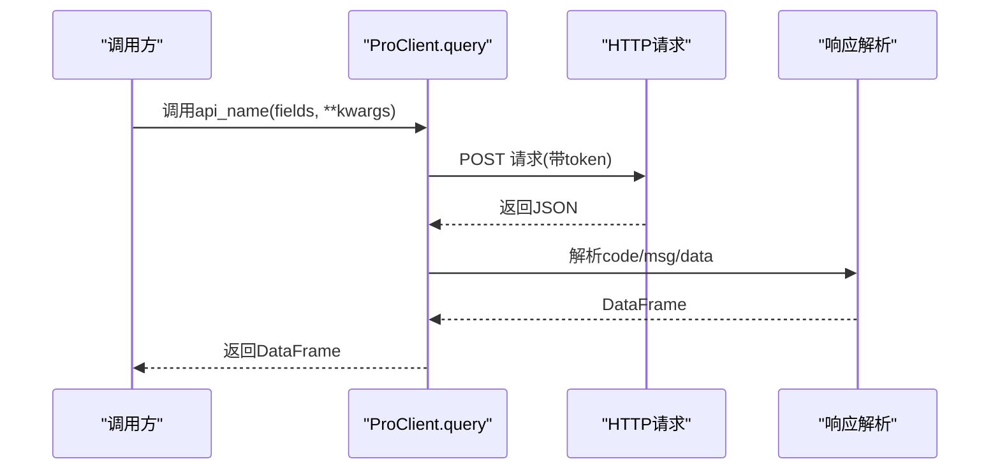
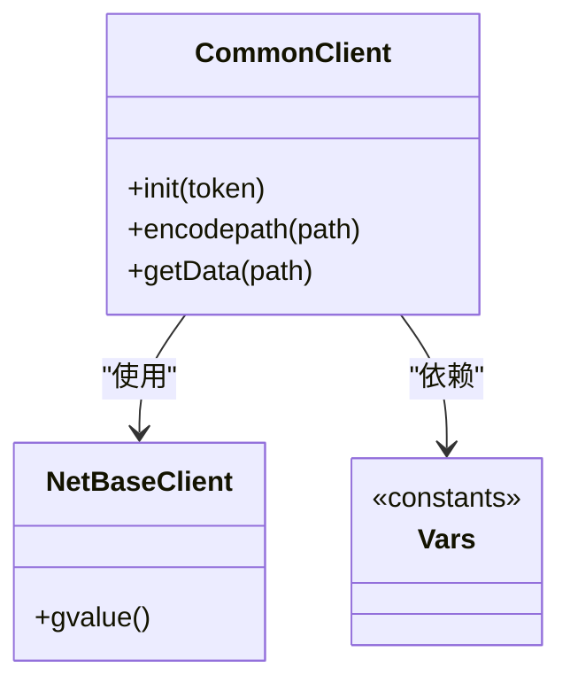
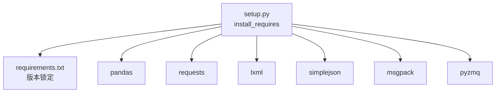

# 开发者指南

<cite>
**本文引用的文件**
- [README.md](file://README.md)
- [setup.py](file://setup.py)
- [requirements.txt](file://requirements.txt)
- [test_unittest.py](file://test_unittest.py)
- [whats_new.md](file://whats_new.md)
- [tushare/__init__.py](file://tushare/__init__.py)
- [tushare/util/common.py](file://tushare/util/common.py)
- [tushare/pro/client.py](file://tushare/pro/client.py)
- [tushare/stock/trading.py](file://tushare/stock/trading.py)
- [tushare/stock/cons.py](file://tushare/stock/cons.py)
- [tushare/util/netbase.py](file://tushare/util/netbase.py)
- [tushare/util/vars.py](file://tushare/util/vars.py)
- [test/bar_test.py](file://test/bar_test.py)
- [test/fund_test.py](file://test/fund_test.py)
</cite>

## 目录
1. [简介](#简介)
2. [项目结构](#项目结构)
3. [核心组件](#核心组件)
4. [架构总览](#架构总览)
5. [详细组件分析](#详细组件分析)
6. [依赖分析](#依赖分析)
7. [性能考量](#性能考量)
8. [故障排查指南](#故障排查指南)
9. [结论](#结论)
10. [附录](#附录)

## 简介
本指南面向TuShare项目的贡献者与扩展开发者，目标是帮助你快速理解并高效参与项目开发。内容涵盖：
- 开发环境搭建（Python环境、IDE建议、依赖安装）
- 代码贡献流程（代码规范、测试要求、Pull Request流程）
- 扩展开发指导（新增数据源、插件化思路、API扩展）
- 架构设计原则与设计模式（模块化、接口抽象、数据层分离）
- 调试与测试方法（单元测试、集成测试、性能测试）
- 社区参与方式（联系方式、交流渠道）

## 项目结构
TuShare采用按领域分层的模块化组织方式，核心入口位于包级导出，各业务域（股票、期货、基金、宏观等）独立子包，工具类集中在util目录，测试分布在根目录与test目录。

图表来源
- [tushare/__init__.py:1-140](file://tushare/__init__.py#L1-L140)
- [tushare/stock/trading.py:1-800](file://tushare/stock/trading.py#L1-L800)
- [tushare/stock/cons.py:1-453](file://tushare/stock/cons.py#L1-L453)
- [tushare/util/common.py:1-86](file://tushare/util/common.py#L1-L86)
- [tushare/util/netbase.py:1-29](file://tushare/util/netbase.py#L1-L29)
- [tushare/util/vars.py:1-598](file://tushare/util/vars.py#L1-L598)
- [tushare/pro/client.py:1-52](file://tushare/pro/client.py#L1-L52)

章节来源
- [tushare/__init__.py:1-140](file://tushare/__init__.py#L1-L140)
- [README.md:1-411](file://README.md#L1-L411)

## 核心组件
- 包导出与统一入口：通过包级__init__.py集中导出各类API，便于用户按需导入。
- 交易数据接口：提供历史行情、实时行情、分笔、复权、K线等接口，封装网络请求与数据解析。
- Pro客户端：提供基于HTTP的Pro数据查询接口，支持token认证与超时控制。
- 工具库：通用HTTP客户端、网络请求基类、常量与URL配置，支撑各模块稳定运行。
- 测试体系：包含单元测试与模块测试样例，覆盖典型接口行为。

章节来源
- [tushare/__init__.py:1-140](file://tushare/__init__.py#L1-L140)
- [tushare/stock/trading.py:1-800](file://tushare/stock/trading.py#L1-L800)
- [tushare/pro/client.py:1-52](file://tushare/pro/client.py#L1-L52)
- [tushare/util/common.py:1-86](file://tushare/util/common.py#L1-L86)
- [tushare/util/netbase.py:1-29](file://tushare/util/netbase.py#L1-L29)
- [tushare/util/vars.py:1-598](file://tushare/util/vars.py#L1-L598)
- [test_unittest.py:1-25](file://test_unittest.py#L1-L25)
- [test/bar_test.py:1-23](file://test/bar_test.py#L1-L23)
- [test/fund_test.py:1-43](file://test/fund_test.py#L1-L43)

## 架构总览
TuShare采用“包级统一导出 + 子模块职责清晰 + 工具库复用”的分层架构。核心要点：
- 入口聚合：__init__.py将各子模块API统一导出，简化用户使用。
- 数据访问层：trading.py封装网络请求、HTML/JSON解析、数据清洗与转换。
- 配置与常量：cons.py集中管理URL、字段、分页、市场代码等常量。
- Pro接口：pro/client.py提供Pro数据查询能力，支持token与超时。
- 工具复用：util/common.py与util/netbase.py提供HTTP客户端与请求基类，降低重复实现。

图表来源
- [tushare/stock/trading.py:1-800](file://tushare/stock/trading.py#L1-L800)
- [tushare/pro/client.py:1-52](file://tushare/pro/client.py#L1-L52)
- [tushare/util/common.py:1-86](file://tushare/util/common.py#L1-L86)
- [tushare/util/netbase.py:1-29](file://tushare/util/netbase.py#L1-L29)
- [tushare/stock/cons.py:1-453](file://tushare/stock/cons.py#L1-L453)

## 详细组件分析

### 交易数据接口（trading.py）
- 职责：提供股票/指数/期货等行情数据的采集与处理，包括历史日线、分钟线、实时行情、分笔、复权等。
- 关键点：
  - 参数校验与重试机制：支持retry_count与pause，提升网络不稳定场景下的鲁棒性。
  - 数据清洗与类型转换：统一列名、去除逗号、数值类型转换、索引排序等。
  - 多数据源适配：支持Sina、Tencent、NetEase等不同源，通过src参数切换。
  - 复权逻辑：前复权/后复权/不复权，结合因子表进行计算。
- 典型流程：构造URL → 发起请求 → 解析JSON/HTML → 构造DataFrame → 返回结果。

图表来源
- [tushare/stock/trading.py:32-100](file://tushare/stock/trading.py#L32-L100)
- [tushare/stock/cons.py:86-130](file://tushare/stock/cons.py#L86-L130)

章节来源
- [tushare/stock/trading.py:1-800](file://tushare/stock/trading.py#L1-L800)
- [tushare/stock/cons.py:1-453](file://tushare/stock/cons.py#L1-L453)

### Pro客户端（pro/client.py）
- 职责：封装Pro数据接口的HTTP调用，支持token认证与超时控制。
- 关键点：
  - 动态属性：通过__getattr__实现按API名动态调用。
  - 错误处理：根据返回码抛出异常，确保调用方感知错误。
  - 结果转换：将返回的JSON转换为pandas DataFrame。
- 典型流程：拼装请求参数 → POST请求 → 解析JSON → 构造DataFrame → 返回。

图表来源
- [tushare/pro/client.py:32-48](file://tushare/pro/client.py#L32-L48)

章节来源
- [tushare/pro/client.py:1-52](file://tushare/pro/client.py#L1-L52)

### 工具库（util/common.py、util/netbase.py、util/vars.py）
- common.py：通用HTTPS客户端，负责路径编码、请求头设置、状态码处理与字符集转换。
- netbase.py：网络请求基类，封装Request与urlopen，提供gvalue方法获取响应。
- vars.py：Pro接口常量与URL模板集合，集中管理多类数据接口的REST风格路径。

图表来源
- [tushare/util/common.py:18-86](file://tushare/util/common.py#L18-L86)
- [tushare/util/netbase.py:9-29](file://tushare/util/netbase.py#L9-L29)
- [tushare/util/vars.py:1-598](file://tushare/util/vars.py#L1-L598)

章节来源
- [tushare/util/common.py:1-86](file://tushare/util/common.py#L1-L86)
- [tushare/util/netbase.py:1-29](file://tushare/util/netbase.py#L1-L29)
- [tushare/util/vars.py:1-598](file://tushare/util/vars.py#L1-L598)

### 包导出入口（tushare/__init__.py）
- 职责：集中导出各子模块API，形成统一的对外接口。
- 设计：按功能域分组导入，避免循环依赖，便于维护。

章节来源
- [tushare/__init__.py:1-140](file://tushare/__init__.py#L1-L140)

## 依赖分析
- 安装依赖：setup.py与requirements.txt共同定义运行时依赖，包括pandas、requests、lxml、simplejson、msgpack、pyzmq等。
- 依赖一致性：建议使用requirements.txt锁定版本，setup.py中install_requires作为最小版本约束。
- 平台兼容：README声明支持Python 2.x/3.x，代码中通过兼容导入与字符串处理保障跨版本可用。

图表来源
- [setup.py:65-74](file://setup.py#L65-L74)
- [requirements.txt:1-6](file://requirements.txt#L1-L6)

章节来源
- [setup.py:1-100](file://setup.py#L1-L100)
- [requirements.txt:1-6](file://requirements.txt#L1-L6)
- [README.md:23-30](file://README.md#L23-L30)

## 性能考量
- 网络请求优化：合理设置retry_count与pause，避免频繁请求触发风控；对批量数据采用分页/分段拉取。
- 数据处理优化：优先使用向量化操作与pandas内置函数，减少循环；必要时进行内存映射与分块处理。
- 缓存策略：对高频查询结果进行本地缓存（注意时效性），减少重复网络请求。
- 并发与限流：在外部接口允许范围内并发请求，但需遵守对方速率限制，避免封禁。
- I/O优化：CSV/Excel/JSON写入时尽量使用缓冲与批处理，避免逐行写入。

## 故障排查指南
- 网络错误：检查网络连通性与代理设置；确认URL与参数正确；适当增大超时与重试次数。
- 字符集问题：常见于GBK/UTF-8混用，统一在请求与解析环节指定编码；util/common.py中对CSV输出做了编码转换示例。
- 数据为空：确认目标日期区间内是否存在数据；检查数据源是否支持该类型；对空结果进行显式判断与提示。
- 认证失败：Pro接口需正确设置token；检查token有效期与权限范围。
- 版本兼容：Python 2/3差异通过兼容导入解决；pandas版本升级可能导致列名或类型变化，需同步更新字段映射。

章节来源
- [tushare/util/common.py:70-85](file://tushare/util/common.py#L70-L85)
- [tushare/stock/trading.py:67-100](file://tushare/stock/trading.py#L67-L100)
- [README.md:23-30](file://README.md#L23-L30)

## 结论
TuShare通过清晰的模块划分与统一的导出入口，提供了简洁易用的金融数据接口。贡献者应重点关注：
- 保持接口稳定性与向后兼容
- 严格遵循测试与文档规范
- 在工具库层面复用通用能力，避免重复造轮子
- 对外接口（Pro）注重安全与错误处理
- 在扩展新数据源时，遵循现有常量与URL模板约定

## 附录

### 开发环境搭建
- Python版本：参考README声明的Python 2.x/3.x支持。
- 依赖安装：使用pip安装requirements.txt中的依赖，或通过setup.py安装。
- IDE建议：推荐使用VS Code或PyCharm，启用Python解释器与lint/格式化插件。
- 虚拟环境：建议使用venv或conda创建隔离环境，避免全局污染。

章节来源
- [README.md:23-30](file://README.md#L23-L30)
- [requirements.txt:1-6](file://requirements.txt#L1-L6)
- [setup.py:65-74](file://setup.py#L65-L74)

### 代码贡献流程
- 提交规范：遵循PEP8风格；函数/类/模块注释完整；变更需附带测试。
- 测试要求：新增接口需补充单元测试；涉及网络请求的接口需模拟或提供可重复的测试数据。
- Pull Request：分支命名清晰；描述详尽说明变更动机、影响范围与测试结果；等待Review与合并。

章节来源
- [test_unittest.py:1-25](file://test_unittest.py#L1-L25)
- [test/bar_test.py:1-23](file://test/bar_test.py#L1-L23)
- [test/fund_test.py:1-43](file://test/fund_test.py#L1-L43)

### 扩展开发指导
- 新增数据源：在对应子包下新增模块，遵循现有常量与URL模板约定；在__init__.py中注册导出。
- 插件化思路：利用__getattr__或工厂模式动态加载模块；对外暴露统一接口。
- API扩展：保持参数与返回值一致；对历史接口保留兼容；新增接口提供明确文档与示例。

章节来源
- [tushare/__init__.py:1-140](file://tushare/__init__.py#L1-L140)
- [tushare/pro/client.py:50-52](file://tushare/pro/client.py#L50-L52)
- [tushare/stock/cons.py:1-453](file://tushare/stock/cons.py#L1-L453)

### 调试与测试方法
- 单元测试：使用unittest框架，覆盖关键接口与边界条件。
- 集成测试：模拟真实调用链路，验证数据端到端流转。
- 性能测试：对批量数据与高频接口进行压测，评估吞吐与延迟。

章节来源
- [test_unittest.py:1-25](file://test_unittest.py#L1-L25)
- [test/bar_test.py:1-23](file://test/bar_test.py#L1-L23)
- [test/fund_test.py:1-43](file://test/fund_test.py#L1-L43)

### 社区参与
- 官方文档与Pro版：参阅README中的官方链接与Pro站点。
- 交流渠道：README列出QQ群，可用于技术交流与问题反馈。
- 变更记录：whats_new.md记录版本迭代与功能变更，便于了解演进方向。

章节来源
- [README.md:1-411](file://README.md#L1-L411)
- [whats_new.md:1-162](file://whats_new.md#L1-L162)