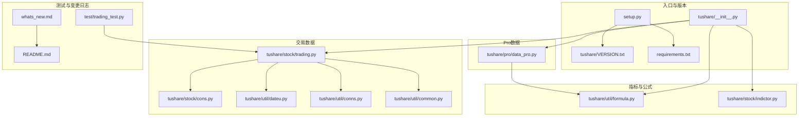
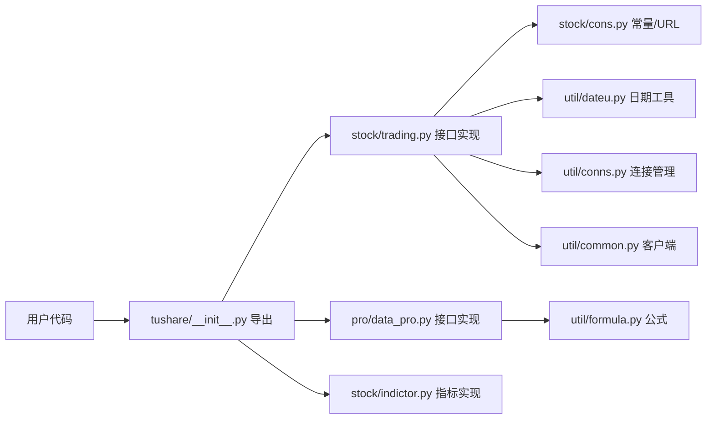
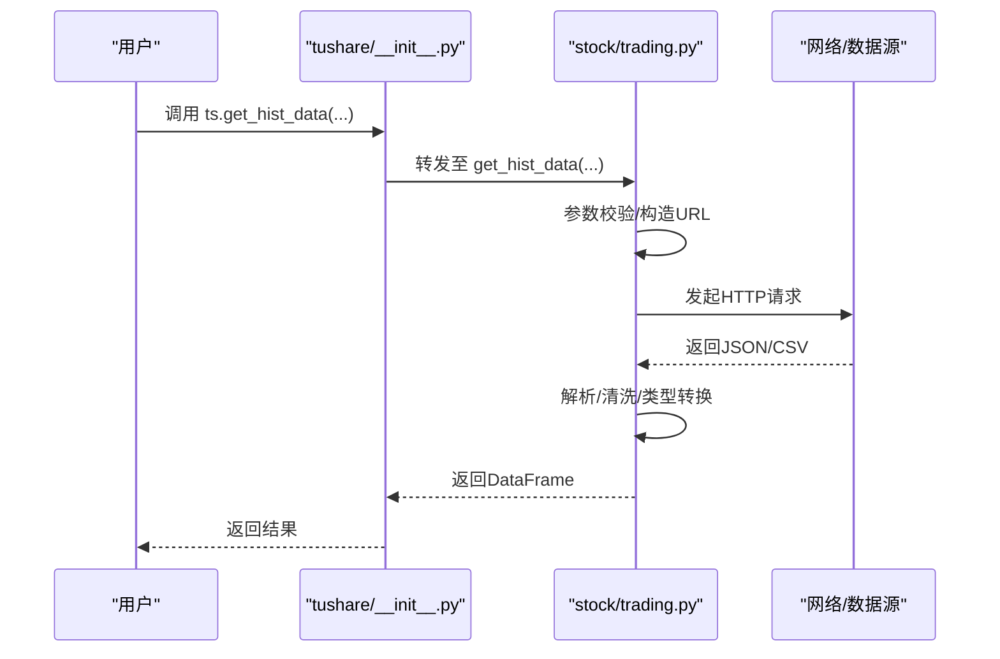
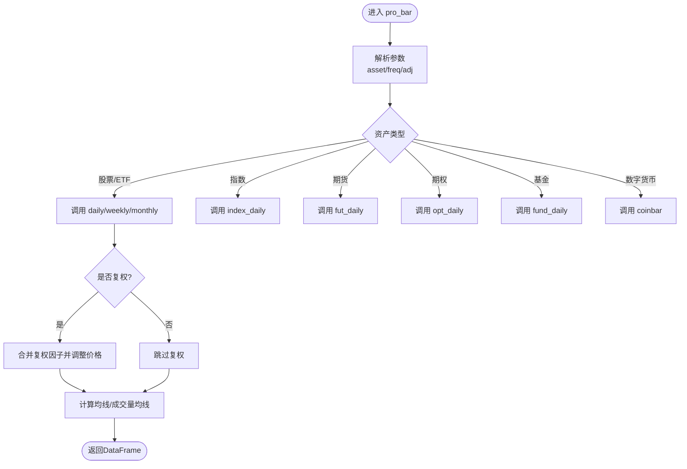
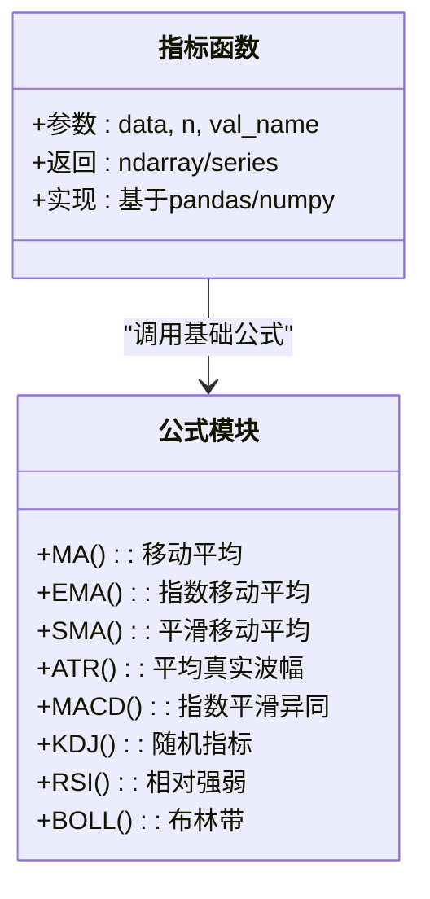
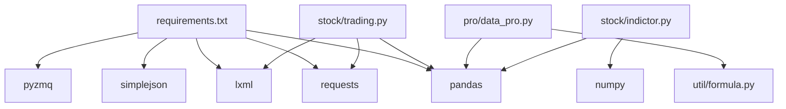

# API扩展

<cite>
**本文引用的文件**   
- [README.md](file://README.md)
- [setup.py](file://setup.py)
- [VERSION.txt](file://tushare/VERSION.txt)
- [requirements.txt](file://requirements.txt)
- [tushare/__init__.py](file://tushare/__init__.py)
- [tushare/util/common.py](file://tushare/util/common.py)
- [tushare/util/conns.py](file://tushare/util/conns.py)
- [tushare/util/dateu.py](file://tushare/util/dateu.py)
- [tushare/util/formula.py](file://tushare/util/formula.py)
- [tushare/stock/trading.py](file://tushare/stock/trading.py)
- [tushare/stock/cons.py](file://tushare/stock/cons.py)
- [tushare/stock/indictor.py](file://tushare/stock/indictor.py)
- [tushare/pro/data_pro.py](file://tushare/pro/data_pro.py)
- [test/trading_test.py](file://test/trading_test.py)
- [whats_new.md](file://whats_new.md)
</cite>

## 目录
1. [引言](#引言)
2. [项目结构](#项目结构)
3. [核心组件](#核心组件)
4. [架构总览](#架构总览)
5. [详细组件分析](#详细组件分析)
6. [依赖关系分析](#依赖关系分析)
7. [性能考量](#性能考量)
8. [故障排查指南](#故障排查指南)
9. [结论](#结论)
10. [附录](#附录)

## 引言
本指南面向希望在TuShare基础上进行API扩展与演进的开发者，系统阐述如何安全地新增函数、改进既有接口、扩展参数、设计技术指标计算函数，并建立版本管理与文档维护流程。内容兼顾工程实践与可读性，帮助不同背景的读者高效完成扩展工作。

## 项目结构
TuShare采用按领域划分的模块化组织方式，核心入口通过包级导出统一暴露给用户。主要模块包括：
- 股票交易数据接口：历史K线、实时行情、分笔、复权等
- Pro数据接口：新版专业版数据服务封装
- 技术指标：基于pandas/numpy的指标计算函数
- 工具与常量：日期工具、网络连接、常量与URL配置
- 测试：针对交易相关接口的单元测试样例

**图表来源** 
- [tushare/__init__.py:1-140](file://tushare/__init__.py#L1-L140)
- [tushare/stock/trading.py:1-1282](file://tushare/stock/trading.py#L1-L1282)
- [tushare/pro/data_pro.py:1-158](file://tushare/pro/data_pro.py#L1-L158)
- [tushare/util/formula.py:1-262](file://tushare/util/formula.py#L1-L262)
- [tushare/stock/indictor.py:1-999](file://tushare/stock/indictor.py#L1-L999)
- [tushare/util/dateu.py:1-129](file://tushare/util/dateu.py#L1-L129)
- [tushare/util/conns.py:1-61](file://tushare/util/conns.py#L1-L61)
- [tushare/util/common.py:1-86](file://tushare/util/common.py#L1-L86)
- [setup.py:1-100](file://setup.py#L1-L100)
- [VERSION.txt:1-1](file://tushare/VERSION.txt#L1-L1)
- [requirements.txt:1-6](file://requirements.txt#L1-L6)
- [test/trading_test.py:1-43](file://test/trading_test.py#L1-L43)
- [whats_new.md:1-162](file://whats_new.md#L1-L162)
- [README.md:1-411](file://README.md#L1-L411)

**章节来源**
- [tushare/__init__.py:1-140](file://tushare/__init__.py#L1-L140)
- [setup.py:1-100](file://setup.py#L1-L100)
- [VERSION.txt:1-1](file://tushare/VERSION.txt#L1-L1)
- [requirements.txt:1-6](file://requirements.txt#L1-L6)

## 核心组件
- 接口导出层：通过包级导入统一暴露API，便于用户以ts.前缀调用
- 交易数据层：提供历史K线、实时行情、分笔、复权、指数等接口
- Pro数据层：封装专业版数据服务，支持多资产类别与复权处理
- 指标与公式层：提供常用技术指标与基础公式，支持扩展
- 工具与常量层：日期工具、连接管理、常量与URL配置
- 测试与文档：单元测试样例与变更日志，辅助API演进与维护

**章节来源**
- [tushare/__init__.py:1-140](file://tushare/__init__.py#L1-L140)
- [tushare/stock/trading.py:1-1282](file://tushare/stock/trading.py#L1-L1282)
- [tushare/pro/data_pro.py:1-158](file://tushare/pro/data_pro.py#L1-L158)
- [tushare/util/formula.py:1-262](file://tushare/util/formula.py#L1-L262)
- [tushare/stock/indictor.py:1-999](file://tushare/stock/indictor.py#L1-L999)
- [tushare/util/dateu.py:1-129](file://tushare/util/dateu.py#L1-L129)
- [tushare/util/conns.py:1-61](file://tushare/util/conns.py#L1-L61)

## 架构总览
TuShare的API扩展遵循“入口导出—业务实现—工具支撑”的分层架构。扩展点主要集中在：
- 在模块内新增函数或增强既有函数
- 在常量与URL配置中补充新接口
- 在指标模块中新增或优化技术指标
- 在入口导出处统一对外暴露

**图表来源** 
- [tushare/__init__.py:1-140](file://tushare/__init__.py#L1-L140)
- [tushare/stock/trading.py:1-1282](file://tushare/stock/trading.py#L1-L1282)
- [tushare/pro/data_pro.py:1-158](file://tushare/pro/data_pro.py#L1-L158)
- [tushare/stock/indictor.py:1-999](file://tushare/stock/indictor.py#L1-L999)
- [tushare/util/formula.py:1-262](file://tushare/util/formula.py#L1-L262)
- [tushare/stock/cons.py:1-453](file://tushare/stock/cons.py#L1-L453)
- [tushare/util/dateu.py:1-129](file://tushare/util/dateu.py#L1-L129)
- [tushare/util/conns.py:1-61](file://tushare/util/conns.py#L1-L61)
- [tushare/util/common.py:1-86](file://tushare/util/common.py#L1-L86)

## 详细组件分析

### 交易数据接口扩展（新增/改进/参数扩展）
- 新增函数建议
  - 在对应模块中新增函数，保持与既有函数一致的参数命名风格与返回DataFrame结构
  - 对外暴露：在包级导出中加入新函数，确保用户可通过ts.前缀直接调用
  - 参数校验：对关键参数（如日期、代码、频率）进行输入校验，必要时抛出明确异常
  - 错误处理：在网络请求失败时返回None或抛出IOError，避免静默失败
- 改进既有函数
  - 增加参数（如新增字段、过滤条件），保持默认值以保证向后兼容
  - 优化数据清洗与类型转换逻辑，提升稳定性
- 示例参考
  - 历史K线接口：[get_hist_data:32-100](file://tushare/stock/trading.py#L32-L100)
  - 实时行情接口：[get_realtime_quotes:324-394](file://tushare/stock/trading.py#L324-L394)
  - 分笔数据接口：[get_tick_data:135-187](file://tushare/stock/trading.py#L135-L187)

**图表来源** 
- [tushare/__init__.py:11-18](file://tushare/__init__.py#L11-L18)
- [tushare/stock/trading.py:32-100](file://tushare/stock/trading.py#L32-L100)

**章节来源**
- [tushare/stock/trading.py:32-100](file://tushare/stock/trading.py#L32-L100)
- [tushare/stock/trading.py:324-394](file://tushare/stock/trading.py#L324-L394)
- [tushare/stock/trading.py:135-187](file://tushare/stock/trading.py#L135-L187)
- [tushare/__init__.py:11-18](file://tushare/__init__.py#L11-L18)

### Pro数据接口扩展（新增资产/频率/复权）
- 扩展点
  - 新增资产类别：在资产枚举与URL映射中增加新资产类型
  - 新增频率：在频率映射中补充新频率标识
  - 复权处理：在复权因子合并与价格调整逻辑中扩展
- 示例参考
  - Pro初始化与bar接口：[pro_api/pro_bar:21-140](file://tushare/pro/data_pro.py#L21-L140)
  - 常量与频率映射：[FREQS/PRICE_COLS:13-18](file://tushare/pro/data_pro.py#L13-L18)

**图表来源** 
- [tushare/pro/data_pro.py:34-134](file://tushare/pro/data_pro.py#L34-L134)

**章节来源**
- [tushare/pro/data_pro.py:21-140](file://tushare/pro/data_pro.py#L21-L140)
- [tushare/pro/data_pro.py:13-18](file://tushare/pro/data_pro.py#L13-L18)

### 技术指标计算函数扩展（新增指标/优化实现）
- 设计原则
  - 输入输出：接收pandas DataFrame，返回Series或DataFrame，列名语义清晰
  - 参数化：支持窗口大小、权重等参数，提供合理默认值
  - 性能：优先使用pandas/numpy向量化操作，减少显式循环
  - 可读性：注释完整，参数与返回值说明清晰
- 扩展步骤
  - 在指标模块新增函数，或在公式模块新增基础公式
  - 在入口导出中统一暴露
  - 编写单元测试，覆盖边界与异常场景
- 示例参考
  - 指标函数模板与已有指标：[ma/ema/macd/rsi/boll等:12-777](file://tushare/stock/indictor.py#L12-L777)
  - 公式模块（基础公式）：[MA/EMA/SMA/ATR等:8-262](file://tushare/util/formula.py#L8-L262)

**图表来源** 
- [tushare/stock/indictor.py:12-777](file://tushare/stock/indictor.py#L12-L777)
- [tushare/util/formula.py:8-262](file://tushare/util/formula.py#L8-L262)

**章节来源**
- [tushare/stock/indictor.py:12-777](file://tushare/stock/indictor.py#L12-L777)
- [tushare/util/formula.py:8-262](file://tushare/util/formula.py#L8-L262)

### 参数验证与错误处理最佳实践
- 参数验证
  - 使用常量与校验函数统一处理日期、频率、代码等输入
  - 对非法输入抛出明确异常，避免静默失败
- 错误处理
  - 网络异常统一捕获并返回None或抛出IOError
  - 对解析异常进行类型转换与空值处理
- 示例参考
  - 输入校验与提示：[_check_input/_check_lhb_input:375-387](file://tushare/stock/cons.py#L375-L387)
  - 网络错误提示：[NETWORK_URL_ERROR_MSG:195-195](file://tushare/stock/cons.py#L195-L195)
  - 交易数据异常处理：[get_hist_data/get_tick_data:67-100](file://tushare/stock/trading.py#L67-L100)

**章节来源**
- [tushare/stock/cons.py:375-387](file://tushare/stock/cons.py#L375-L387)
- [tushare/stock/cons.py:195-195](file://tushare/stock/cons.py#L195-L195)
- [tushare/stock/trading.py:67-100](file://tushare/stock/trading.py#L67-L100)

### API版本管理与升级指南
- 版本号规则
  - 使用语义化版本（主.次.补丁），在包级VERSION与setup中同步
  - 变更日志whats_new.md记录每次改动，便于回溯
- 兼容性检查
  - 保持默认参数不变，新增参数需提供默认值
  - 对废弃接口提供过渡期与迁移指引
- 升级指南
  - 通过pip升级：pip install tushare --upgrade
  - 变更日志对照：对比whats_new.md与README变更记录
- 示例参考
  - 版本号：[VERSION.txt:1-1](file://tushare/VERSION.txt#L1-L1)
  - 安装与升级：[README安装与升级:30-42](file://README.md#L30-L42)
  - 变更记录：[whats_new.md:1-162](file://whats_new.md#L1-L162)

**章节来源**
- [VERSION.txt:1-1](file://tushare/VERSION.txt#L1-L1)
- [README.md:30-42](file://README.md#L30-L42)
- [whats_new.md:1-162](file://whats_new.md#L1-L162)

### API文档的自动生成与维护
- 文档生成
  - 使用函数注释规范（参数、返回值、异常）作为自动生成的基础
  - 结合测试用例与示例，形成最小可运行文档片段
- 维护策略
  - 将示例与测试用例纳入CI，确保文档与代码一致性
  - 变更时同步更新注释与示例，避免文档漂移
- 示例参考
  - 接口注释风格：[get_hist_data注释:32-55](file://tushare/stock/trading.py#L32-L55)
  - 测试用例：[trading_test.py:18-39](file://test/trading_test.py#L18-L39)

**章节来源**
- [tushare/stock/trading.py:32-55](file://tushare/stock/trading.py#L32-L55)
- [test/trading_test.py:18-39](file://test/trading_test.py#L18-L39)

## 依赖关系分析
- 外部依赖
  - pandas、requests、lxml、simplejson、pyzmq等，版本要求在setup中声明
- 内部依赖
  - 交易数据接口依赖常量与日期工具
  - Pro数据接口依赖公式模块与连接管理
  - 指标模块依赖公式模块与pandas/numpy

**图表来源** 
- [requirements.txt:1-6](file://requirements.txt#L1-L6)
- [tushare/stock/trading.py:1-1282](file://tushare/stock/trading.py#L1-L1282)
- [tushare/pro/data_pro.py:1-158](file://tushare/pro/data_pro.py#L1-L158)
- [tushare/stock/indictor.py:1-999](file://tushare/stock/indictor.py#L1-L999)
- [tushare/util/formula.py:1-262](file://tushare/util/formula.py#L1-L262)

**章节来源**
- [requirements.txt:1-6](file://requirements.txt#L1-L6)
- [tushare/stock/trading.py:1-1282](file://tushare/stock/trading.py#L1-L1282)
- [tushare/pro/data_pro.py:1-158](file://tushare/pro/data_pro.py#L1-L158)
- [tushare/stock/indictor.py:1-999](file://tushare/stock/indictor.py#L1-L999)
- [tushare/util/formula.py:1-262](file://tushare/util/formula.py#L1-L262)

## 性能考量
- 向量化优先：尽量使用pandas/numpy的向量化操作替代显式循环
- 数据类型与索引：合理设置索引与列类型，减少类型转换成本
- 网络请求：控制重试次数与请求间隔，避免触发风控
- 复权与合并：在Pro接口中注意因子合并与填充策略，避免重复计算

## 故障排查指南
- 常见问题
  - 网络超时/连接失败：检查重试参数与网络状态
  - 数据为空：确认日期范围、代码格式与数据源可用性
  - 类型转换异常：检查列类型与缺失值处理
- 排查步骤
  - 查看错误提示与异常栈
  - 核对参数与URL构造
  - 对照测试用例定位问题
- 示例参考
  - 网络错误处理：[get_hist_data异常路径:67-100](file://tushare/stock/trading.py#L67-L100)
  - 输入校验异常：[日期/季度校验:375-387](file://tushare/stock/cons.py#L375-L387)

**章节来源**
- [tushare/stock/trading.py:67-100](file://tushare/stock/trading.py#L67-L100)
- [tushare/stock/cons.py:375-387](file://tushare/stock/cons.py#L375-L387)

## 结论
通过遵循本文的扩展指南，开发者可以在保持向后兼容的前提下，安全地新增API、改进既有接口、扩展参数与技术指标，并建立完善的版本管理与文档维护流程。建议在每次扩展后补充测试用例与变更记录，确保API的稳定性与可维护性。

## 附录
- 快速开始与示例：参阅README中的示例与安装说明
- 测试样例：参考trading_test.py中的接口调用示例
- 变更记录：whats_new.md与README的变更日志

**章节来源**
- [README.md:44-188](file://README.md#L44-L188)
- [test/trading_test.py:18-39](file://test/trading_test.py#L18-L39)
- [whats_new.md:1-162](file://whats_new.md#L1-L162)