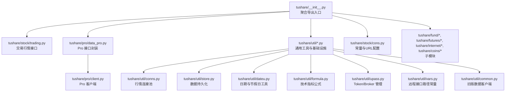
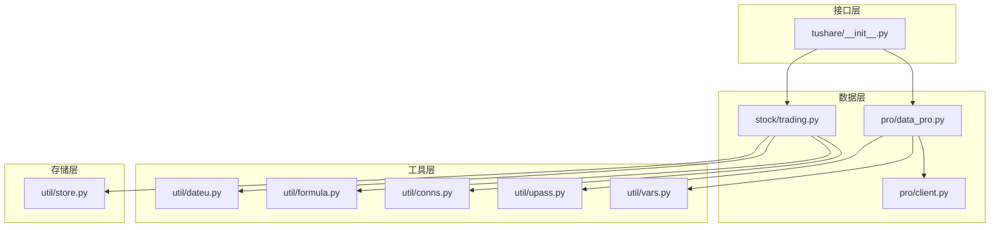
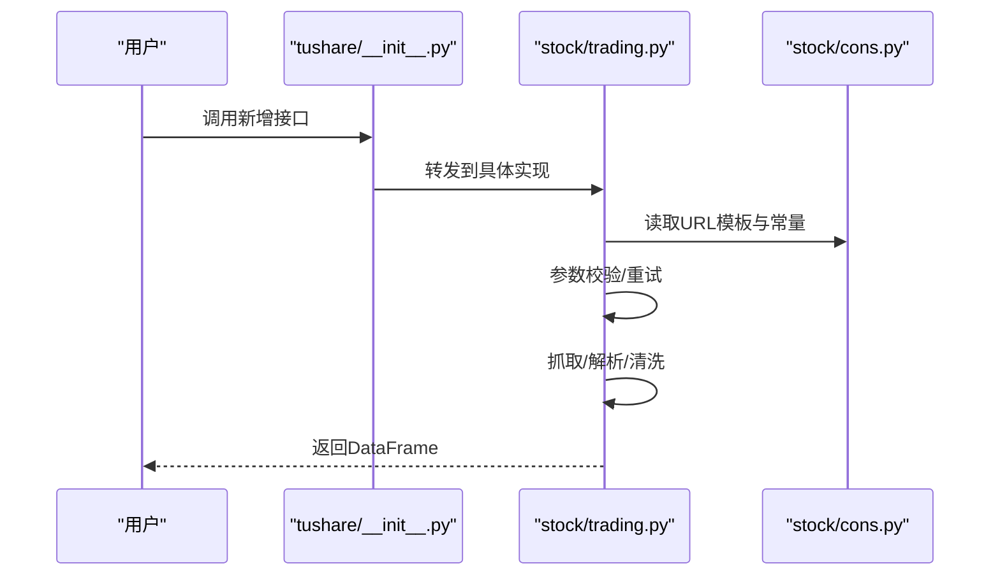
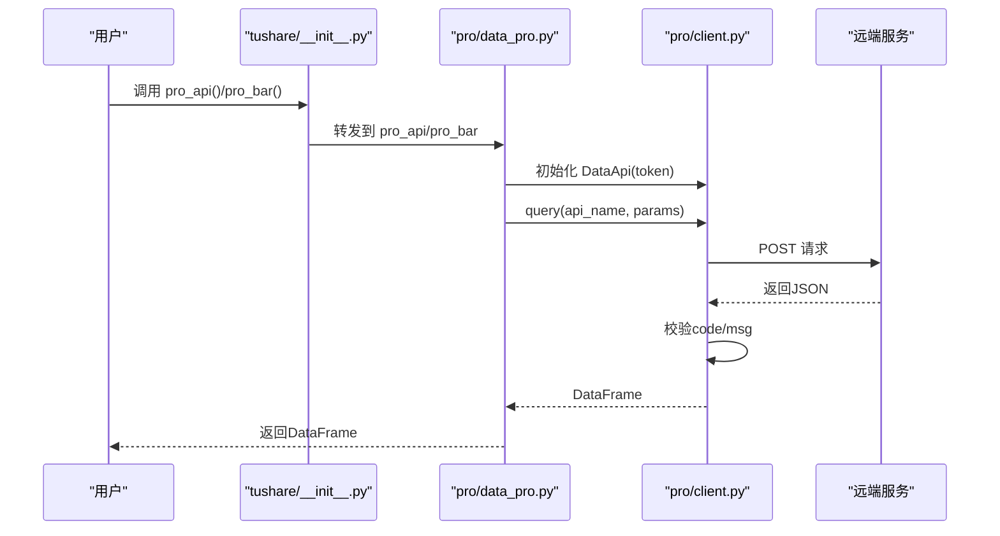
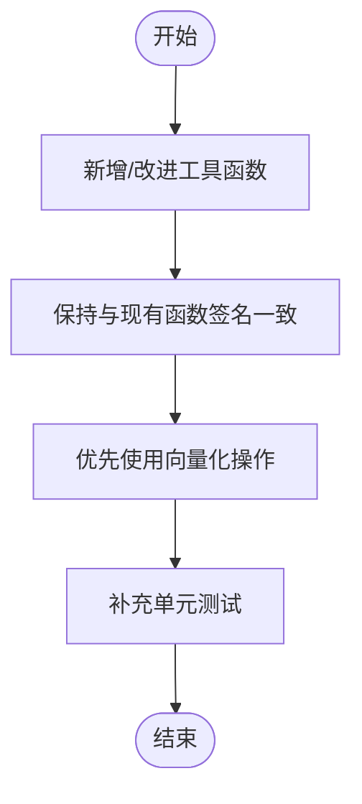
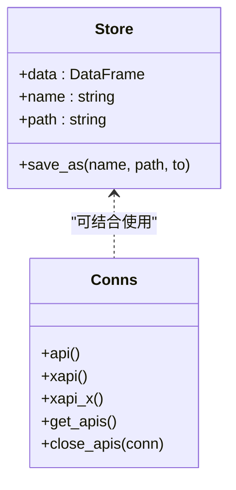
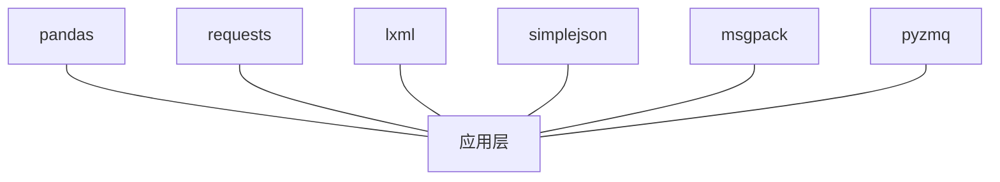

# 扩展开发

<cite>
**本文引用的文件**
- [README.md](file://README.md)
- [setup.py](file://setup.py)
- [requirements.txt](file://requirements.txt)
- [tushare/__init__.py](file://tushare/__init__.py)
- [tushare/pro/client.py](file://tushare/pro/client.py)
- [tushare/pro/data_pro.py](file://tushare/pro/data_pro.py)
- [tushare/util/common.py](file://tushare/util/common.py)
- [tushare/util/store.py](file://tushare/util/store.py)
- [tushare/util/conns.py](file://tushare/util/conns.py)
- [tushare/util/dateu.py](file://tushare/util/dateu.py)
- [tushare/util/formula.py](file://tushare/util/formula.py)
- [tushare/util/upass.py](file://tushare/util/upass.py)
- [tushare/util/vars.py](file://tushare/util/vars.py)
- [tushare/stock/cons.py](file://tushare/stock/cons.py)
- [tushare/stock/trading.py](file://tushare/stock/trading.py)
- [test_unittest.py](file://test_unittest.py)
</cite>

## 目录
1. [简介](#简介)
2. [项目结构](#项目结构)
3. [核心组件](#核心组件)
4. [架构总览](#架构总览)
5. [详细组件分析](#详细组件分析)
6. [依赖分析](#依赖分析)
7. [性能考量](#性能考量)
8. [故障排查指南](#故障排查指南)
9. [结论](#结论)
10. [附录](#附录)

## 简介
本指南面向希望为 TuShare 添加新功能模块与数据源的开发者，涵盖以下主题：
- 新增数据接口：API 函数编写、参数校验、数据处理流程
- 工具函数模块扩展：新增工具函数与既有工具的改进
- 插件化扩展：数据源适配器与存储后端扩展思路
- API 扩展最佳实践：向后兼容、错误处理、性能优化
- 第三方数据源集成：数据格式转换、认证机制、数据同步策略
- 测试与质量保障：单元测试、回归测试与质量控制

## 项目结构
TuShare 采用按领域划分的模块化组织方式，主要模块如下：
- tushare.stock：股票行情、财务、公告、新闻等基础数据接口
- tushare.pro：Pro 数据接口封装与统一认证
- tushare.util：通用工具、日期与公式、连接管理、存储、认证等
- tushare.fund、tushare.futures、tushare.internet、tushare.coins：细分领域数据
- test：单元测试样例

图表来源
- [tushare/__init__.py:11-140](file://tushare/__init__.py#L11-L140)
- [tushare/pro/data_pro.py:21-158](file://tushare/pro/data_pro.py#L21-L158)
- [tushare/pro/client.py:17-52](file://tushare/pro/client.py#L17-L52)
- [tushare/util/conns.py:14-61](file://tushare/util/conns.py#L14-L61)
- [tushare/util/store.py:14-44](file://tushare/util/store.py#L14-L44)
- [tushare/util/dateu.py:78-129](file://tushare/util/dateu.py#L78-L129)
- [tushare/util/formula.py:8-262](file://tushare/util/formula.py#L8-L262)
- [tushare/util/upass.py:16-62](file://tushare/util/upass.py#L16-L62)
- [tushare/util/vars.py:1-598](file://tushare/util/vars.py#L1-L598)
- [tushare/util/common.py:18-86](file://tushare/util/common.py#L18-L86)
- [tushare/stock/cons.py:1-453](file://tushare/stock/cons.py#L1-L453)

章节来源
- [tushare/__init__.py:11-140](file://tushare/__init__.py#L11-L140)
- [README.md:1-411](file://README.md#L1-L411)
- [setup.py:65-99](file://setup.py#L65-L99)
- [requirements.txt:1-6](file://requirements.txt#L1-L6)

## 核心组件
- 接口聚合入口：tushare/__init__.py 将各模块 API 聚合导出，便于用户统一调用
- 交易行情模块：stock/trading.py 提供历史行情、实时行情、分笔、复权等接口
- Pro 数据接口：pro/data_pro.py 提供统一的 pro_api 与 pro_bar，内部通过 pro/client.py 访问远端服务
- 工具与基础设施：util 下的 dateu、formula、conns、store、upass、vars、common 等模块
- 常量与配置：stock/cons.py 定义数据源 URL、字段名、K线类型、错误提示等

章节来源
- [tushare/__init__.py:11-140](file://tushare/__init__.py#L11-L140)
- [tushare/stock/trading.py:32-100](file://tushare/stock/trading.py#L32-L100)
- [tushare/pro/data_pro.py:21-158](file://tushare/pro/data_pro.py#L21-L158)
- [tushare/pro/client.py:17-52](file://tushare/pro/client.py#L17-L52)
- [tushare/util/dateu.py:78-129](file://tushare/util/dateu.py#L78-L129)
- [tushare/util/formula.py:8-262](file://tushare/util/formula.py#L8-L262)
- [tushare/util/conns.py:14-61](file://tushare/util/conns.py#L14-L61)
- [tushare/util/store.py:14-44](file://tushare/util/store.py#L14-L44)
- [tushare/util/upass.py:16-62](file://tushare/util/upass.py#L16-L62)
- [tushare/util/vars.py:1-598](file://tushare/util/vars.py#L1-L598)
- [tushare/util/common.py:18-86](file://tushare/util/common.py#L18-L86)
- [tushare/stock/cons.py:1-453](file://tushare/stock/cons.py#L1-L453)

## 架构总览
TuShare 的扩展开发应遵循“接口层-数据层-工具层-存储层”的分层思想：
- 接口层：在 tushare/__init__.py 中聚合导出，对外暴露统一 API
- 数据层：通过 stock/trading.py、pro/data_pro.py 或子模块实现数据抓取与转换
- 工具层：利用 util/dateu、formula、conns 等模块完成日期计算、技术指标、连接管理
- 存储层：通过 util/store 与外部存储系统对接，支持 CSV/数据库等

图表来源
- [tushare/__init__.py:11-140](file://tushare/__init__.py#L11-L140)
- [tushare/stock/trading.py:32-100](file://tushare/stock/trading.py#L32-L100)
- [tushare/pro/data_pro.py:21-158](file://tushare/pro/data_pro.py#L21-L158)
- [tushare/pro/client.py:17-52](file://tushare/pro/client.py#L17-L52)
- [tushare/util/dateu.py:78-129](file://tushare/util/dateu.py#L78-L129)
- [tushare/util/formula.py:8-262](file://tushare/util/formula.py#L8-L262)
- [tushare/util/conns.py:14-61](file://tushare/util/conns.py#L14-L61)
- [tushare/util/upass.py:16-62](file://tushare/util/upass.py#L16-L62)
- [tushare/util/vars.py:1-598](file://tushare/util/vars.py#L1-L598)
- [tushare/util/store.py:14-44](file://tushare/util/store.py#L14-L44)

## 详细组件分析

### 交易行情接口（新增/扩展）
- 新增接口建议：
  - 在 stock/trading.py 中新增函数，遵循现有参数命名与返回 DataFrame 的约定
  - 使用 stock/cons.py 中的常量与 URL 模板，避免硬编码
  - 对输入参数进行校验（如日期格式、K线类型），并在异常时抛出清晰的错误信息
  - 对返回数据进行清洗与类型转换，确保数值列为浮点型，索引为日期
- 参数校验与错误处理：
  - 可参考 get_hist_data 的参数校验与重试逻辑
  - 对网络异常与空数据进行捕获与提示
- 数据处理：
  - 使用 pandas 进行数据清洗与列映射
  - 可选加入技术指标（如 MA、EMA 等）以提升接口附加值

图表来源
- [tushare/__init__.py:11-140](file://tushare/__init__.py#L11-L140)
- [tushare/stock/trading.py:32-100](file://tushare/stock/trading.py#L32-L100)
- [tushare/stock/cons.py:86-130](file://tushare/stock/cons.py#L86-L130)

章节来源
- [tushare/stock/trading.py:32-100](file://tushare/stock/trading.py#L32-L100)
- [tushare/stock/cons.py:86-130](file://tushare/stock/cons.py#L86-L130)

### Pro 数据接口（新增/扩展）
- 新增 Pro 接口：
  - 在 pro/data_pro.py 中新增函数，或扩展 pro_bar 的能力
  - 通过 pro/client.py 的 DataApi 访问远端服务，统一处理 token 与错误
- 认证与错误处理：
  - 使用 util/upass.get_token 获取 token，若缺失则提示注册申请
  - 对远端返回的错误码进行捕获并抛出异常
- 数据处理：
  - 将远端 JSON 转为 DataFrame，并根据资产类型（股票/指数/期货/基金/数字货币）进行字段映射与复权处理

图表来源
- [tushare/pro/data_pro.py:21-158](file://tushare/pro/data_pro.py#L21-L158)
- [tushare/pro/client.py:17-52](file://tushare/pro/client.py#L17-L52)
- [tushare/util/upass.py:16-31](file://tushare/util/upass.py#L16-L31)

章节来源
- [tushare/pro/data_pro.py:21-158](file://tushare/pro/data_pro.py#L21-L158)
- [tushare/pro/client.py:17-52](file://tushare/pro/client.py#L17-L52)
- [tushare/util/upass.py:16-31](file://tushare/util/upass.py#L16-L31)

### 工具函数模块（新增/改进）
- 新增工具函数：
  - 在 tushare/util/formula.py 中新增技术指标或统计函数，保持与现有函数一致的签名与返回结构
  - 在 tushare/util/dateu.py 中新增日期与节假日相关工具
- 改进既有工具：
  - 对现有函数进行性能优化（如使用 pandas/numpy 向量化）
  - 增加边界条件处理与异常提示

图表来源
- [tushare/util/formula.py:8-262](file://tushare/util/formula.py#L8-L262)
- [tushare/util/dateu.py:78-129](file://tushare/util/dateu.py#L78-L129)

章节来源
- [tushare/util/formula.py:8-262](file://tushare/util/formula.py#L8-L262)
- [tushare/util/dateu.py:78-129](file://tushare/util/dateu.py#L78-L129)

### 存储与连接管理（扩展）
- 存储后端扩展：
  - 在 util/store.py 基础上，新增对数据库（MySQL/MongoDB）的保存逻辑
  - 保持与 pandas DataFrame 的兼容，支持 CSV/Excel/JSON 等多格式
- 连接管理扩展：
  - 在 util/conns.py 中新增连接池或长连接管理，支持重连与超时控制
  - 对外提供 get_apis/close_apis 的统一接口

图表来源
- [tushare/util/store.py:14-44](file://tushare/util/store.py#L14-L44)
- [tushare/util/conns.py:14-61](file://tushare/util/conns.py#L14-L61)

章节来源
- [tushare/util/store.py:14-44](file://tushare/util/store.py#L14-L44)
- [tushare/util/conns.py:14-61](file://tushare/util/conns.py#L14-L61)

### 第三方数据源集成（适配器模式）
- 适配器实现思路：
  - 定义统一接口（如 fetch(ts_code, start, end, fields) -> DataFrame）
  - 在适配器中完成认证（token/签名）、请求构造、响应解析与字段映射
  - 将结果标准化为与现有接口一致的 DataFrame 结构
- 认证机制：
  - 使用 util/upass 管理 token 与 broker 信息
  - 对于需要签名的场景，可在适配器内实现签名逻辑
- 数据同步：
  - 基于日期范围增量拉取，避免全量重复导入
  - 对异常重试与断点续传进行控制

[本节为概念性内容，无需代码来源]

## 依赖分析
- 安装依赖：pandas、requests、lxml、simplejson、msgpack、pyzmq 等
- 运行时依赖：Python 2.6–3.5（兼容性考虑）

图表来源
- [setup.py:65-74](file://setup.py#L65-L74)
- [requirements.txt:1-6](file://requirements.txt#L1-L6)

章节来源
- [setup.py:65-74](file://setup.py#L65-L74)
- [requirements.txt:1-6](file://requirements.txt#L1-L6)

## 性能考量
- 向量化优先：尽量使用 pandas/numpy 的向量化操作替代循环
- 缓存与去重：对重复请求进行缓存，避免重复抓取
- 分批处理：大数据集分页/分段处理，降低内存峰值
- 连接复用：使用连接池减少握手开销
- I/O 优化：批量写入磁盘或数据库，减少系统调用次数

[本节为通用指导，无需代码来源]

## 故障排查指南
- 常见错误与定位：
  - 网络错误：检查网络状态与超时设置，参考 NETWORK_URL_ERROR_MSG
  - 认证失败：确认 token 是否正确，util/upass 提供 set_token/get_token
  - 数据为空：检查日期范围与数据源可用性
- 日志与提示：
  - 使用 util/dateu 的日期工具辅助定位时间维度问题
  - 在接口层打印关键参数与返回形状，便于调试

章节来源
- [tushare/stock/cons.py:195-201](file://tushare/stock/cons.py#L195-L201)
- [tushare/util/upass.py:16-31](file://tushare/util/upass.py#L16-L31)
- [tushare/util/dateu.py:78-129](file://tushare/util/dateu.py#L78-L129)

## 结论
通过遵循本文档的扩展开发指南，开发者可以：
- 快速新增数据接口并保持与现有体系的一致性
- 在工具层持续增强分析能力
- 以适配器模式扩展第三方数据源
- 在保证向后兼容的前提下提升性能与稳定性
- 通过完善的测试与质量控制保障扩展质量

[本节为总结，无需代码来源]

## 附录

### API 扩展最佳实践清单
- 输入参数校验：类型、范围、必填项
- 错误处理：明确异常类型与提示信息
- 向后兼容：保留旧参数别名与默认值
- 性能优化：向量化、缓存、分批
- 文档与注释：接口签名、参数说明、返回结构
- 测试覆盖：单元测试、边界测试、回归测试

[本节为通用指导，无需代码来源]

### 测试方法与质量保证
- 单元测试：参考 test_unittest.py，针对关键接口编写最小可运行用例
- 回归测试：对历史数据与典型场景进行回归验证
- 质量门禁：在 CI 中执行安装、导入与关键接口测试

章节来源
- [test_unittest.py:8-25](file://test_unittest.py#L8-L25)