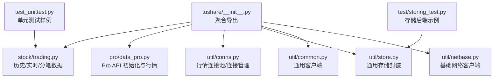
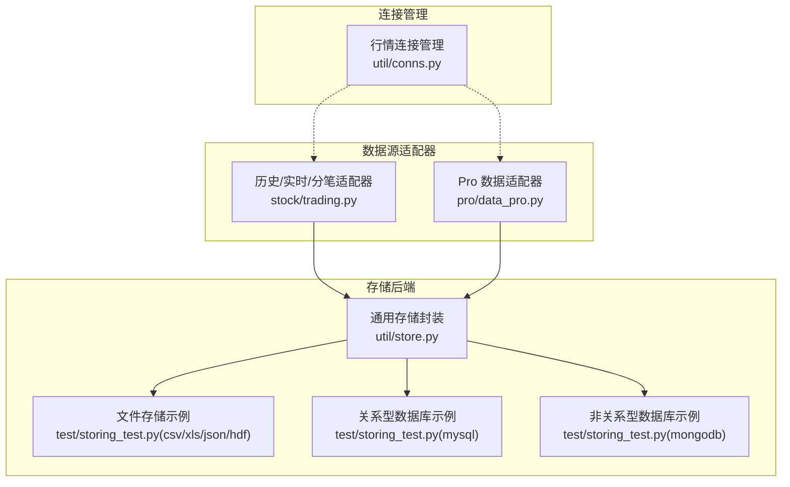
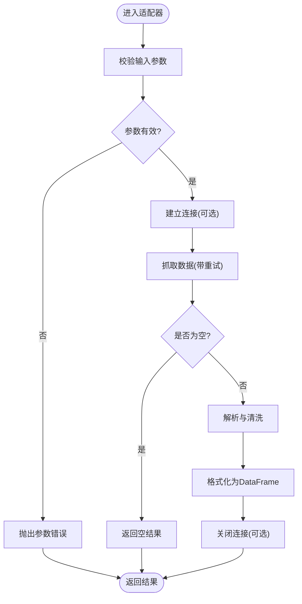
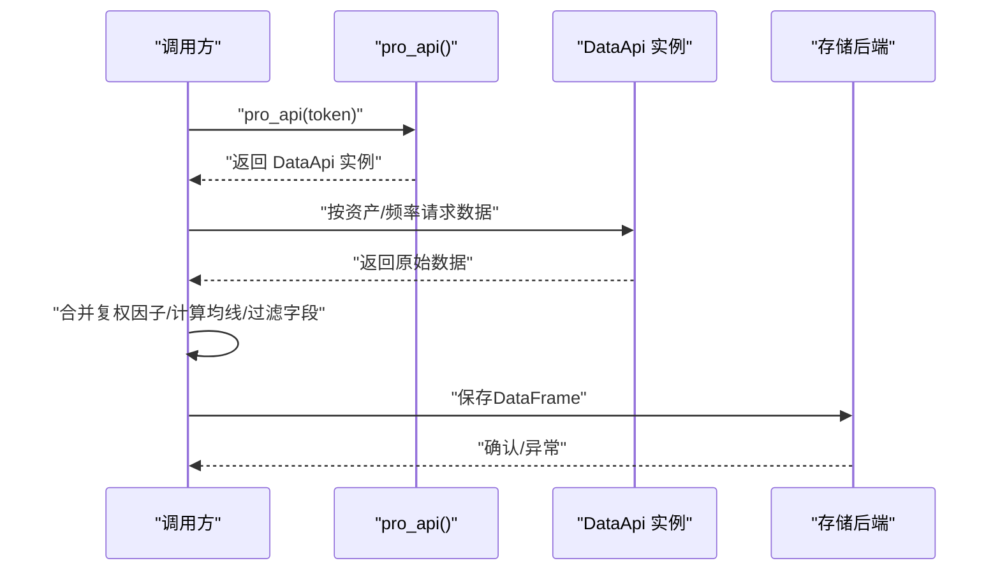
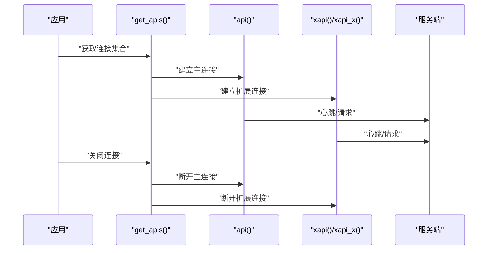
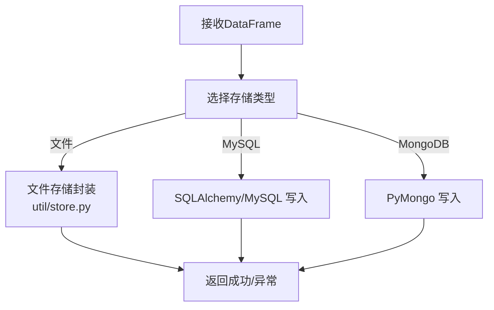
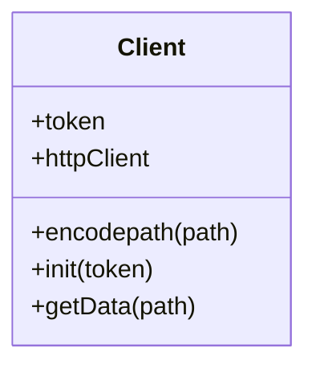
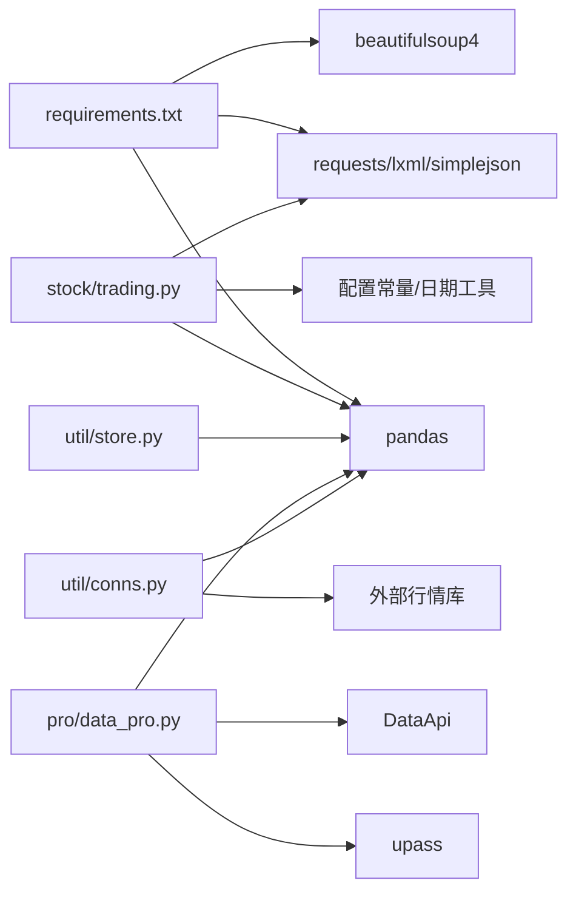

# 插件开发

<cite>
**本文引用的文件**
- [tushare/__init__.py](file://tushare/__init__.py)
- [setup.py](file://setup.py)
- [README.md](file://README.md)
- [tushare/util/store.py](file://tushare/util/store.py)
- [tushare/util/conns.py](file://tushare/util/conns.py)
- [tushare/pro/data_pro.py](file://tushare/pro/data_pro.py)
- [tushare/util/common.py](file://tushare/util/common.py)
- [tushare/util/netbase.py](file://tushare/util/netbase.py)
- [tushare/stock/trading.py](file://tushare/stock/trading.py)
- [requirements.txt](file://requirements.txt)
- [test/storing_test.py](file://test/storing_test.py)
- [test_unittest.py](file://test_unittest.py)
</cite>

## 目录
1. [简介](#简介)
2. [项目结构](#项目结构)
3. [核心组件](#核心组件)
4. [架构总览](#架构总览)
5. [详细组件分析](#详细组件分析)
6. [依赖分析](#依赖分析)
7. [性能考量](#性能考量)
8. [故障排查指南](#故障排查指南)
9. [结论](#结论)
10. [附录](#附录)

## 简介
本指南面向希望为 TuShare 扩展插件能力的开发者，围绕可扩展的数据源适配器与存储后端插件展开，涵盖插件接口设计、注册机制、动态加载、生命周期管理、错误处理与性能优化，并提供测试与打包分发建议。当前仓库未内置通用插件框架或标准插件接口，但通过现有模块（如数据获取、连接管理、存储封装、Pro 接口）可抽象出适配器与存储插件的开发范式。

## 项目结构
TuShare 采用按领域划分的包结构，核心入口聚合导出各子模块接口；工具层提供网络、连接、存储等通用能力；Pro 版本提供统一的 API 初始化与多资产行情接口；测试用例演示了多种存储后端的使用方式。

图表来源
- [tushare/__init__.py:11-140](file://tushare/__init__.py#L11-L140)
- [tushare/stock/trading.py:32-101](file://tushare/stock/trading.py#L32-L101)
- [tushare/pro/data_pro.py:21-32](file://tushare/pro/data_pro.py#L21-L32)
- [tushare/util/conns.py:14-61](file://tushare/util/conns.py#L14-L61)
- [tushare/util/store.py:14-44](file://tushare/util/store.py#L14-L44)
- [tushare/util/common.py:18-86](file://tushare/util/common.py#L18-L86)
- [tushare/util/netbase.py:9-29](file://tushare/util/netbase.py#L9-L29)
- [test/storing_test.py:8-61](file://test/storing_test.py#L8-L61)
- [test_unittest.py:8-25](file://test_unittest.py#L8-L25)

章节来源
- [tushare/__init__.py:11-140](file://tushare/__init__.py#L11-L140)
- [README.md:1-411](file://README.md#L1-L411)

## 核心组件
- 数据获取层
  - 历史/实时/分笔数据接口位于股票模块，具备重试、超时、数据清洗与索引排序等通用逻辑。
  - Pro 版本提供统一初始化与多资产（股票/指数/期货/期权/基金/数字货币）行情接口，支持复权、均线、因子等扩展。
- 连接管理层
  - 提供行情连接的建立、心跳、关闭流程，支持多实例连接与重试策略。
- 存储封装层
  - 提供通用的 DataFrame 存储封装，支持路径与文件名参数化，具备目录创建与格式选择能力。
- 网络与通用客户端
  - 提供基于 HTTP 的通用客户端与基础网络请求封装，便于扩展第三方数据源。

章节来源
- [tushare/stock/trading.py:32-101](file://tushare/stock/trading.py#L32-L101)
- [tushare/pro/data_pro.py:21-141](file://tushare/pro/data_pro.py#L21-L141)
- [tushare/util/conns.py:14-61](file://tushare/util/conns.py#L14-L61)
- [tushare/util/store.py:14-44](file://tushare/util/store.py#L14-L44)
- [tushare/util/common.py:18-86](file://tushare/util/common.py#L18-L86)
- [tushare/util/netbase.py:9-29](file://tushare/util/netbase.py#L9-L29)

## 架构总览
下图展示了数据从“数据源适配器”到“存储后端”的典型流转路径，以及与现有模块的对应关系。

图表来源
- [tushare/stock/trading.py:32-101](file://tushare/stock/trading.py#L32-L101)
- [tushare/pro/data_pro.py:21-141](file://tushare/pro/data_pro.py#L21-L141)
- [tushare/util/conns.py:14-61](file://tushare/util/conns.py#L14-L61)
- [tushare/util/store.py:14-44](file://tushare/util/store.py#L14-L44)
- [test/storing_test.py:8-61](file://test/storing_test.py#L8-L61)

## 详细组件分析

### 组件A：数据源适配器插件（以历史/实时/分笔为例）
- 设计要点
  - 输入参数标准化：代码、日期区间、频率、重试次数、暂停间隔等。
  - 输出格式统一：返回 pandas DataFrame，列名与类型规范化。
  - 错误处理：网络异常、空数据、解析失败等场景的降级与抛错。
  - 可扩展性：通过配置参数控制数据源（如不同网站/接口）、字段映射、清洗规则。
- 生命周期
  - 初始化：参数校验、连接准备（如需要）。
  - 数据获取：重试循环、超时控制、数据解析。
  - 清理：释放资源（连接/句柄），记录日志。
- 性能优化
  - 合理设置 pause 与 retry_count，避免频繁请求。
  - 对大数据集分批处理，减少内存峰值。
  - 使用缓存与增量更新策略（可选）。

图表来源
- [tushare/stock/trading.py:32-101](file://tushare/stock/trading.py#L32-L101)

章节来源
- [tushare/stock/trading.py:32-101](file://tushare/stock/trading.py#L32-L101)

### 组件B：Pro 数据适配器插件
- 设计要点
  - 初始化：支持持久 token 与临时 token，失败时抛出异常。
  - 资产与频率：根据资产类型（股票/指数/期货/期权/基金/数字货币）与 K 线频率选择对应接口。
  - 复权与指标：支持复权因子合并、均线计算、因子字段选择。
  - 错误处理：异常捕获与重试控制，最终抛出网络错误。
- 生命周期
  - 初始化：获取/校验 token，构造客户端。
  - 请求：按资产与频率调用相应接口。
  - 后处理：合并复权因子、计算均线、过滤字段。
  - 清理：保持无状态，避免资源泄漏。

图表来源
- [tushare/pro/data_pro.py:21-32](file://tushare/pro/data_pro.py#L21-L32)
- [tushare/pro/data_pro.py:34-141](file://tushare/pro/data_pro.py#L34-L141)

章节来源
- [tushare/pro/data_pro.py:21-32](file://tushare/pro/data_pro.py#L21-L32)
- [tushare/pro/data_pro.py:34-141](file://tushare/pro/data_pro.py#L34-L141)

### 组件C：连接管理插件
- 设计要点
  - 连接工厂：提供连接构建、心跳、重试策略。
  - 连接池/多实例：支持多连接并行与统一关闭。
  - 异常处理：连接失败时抛出网络错误消息。
- 生命周期
  - 初始化：选择服务器与端口，建立连接。
  - 使用：心跳维持，请求发送。
  - 关闭：断开连接，释放资源。

图表来源
- [tushare/util/conns.py:14-61](file://tushare/util/conns.py#L14-L61)

章节来源
- [tushare/util/conns.py:14-61](file://tushare/util/conns.py#L14-L61)

### 组件D：存储后端插件（文件/数据库）
- 文件存储
  - CSV/XLS/JSON/HDF：通过 pandas 提供的 to_* 方法实现。
  - 通用封装：路径与文件名参数化，自动创建目录。
- 关系型数据库
  - 使用 SQLAlchemy/MySQLdb 将 DataFrame 写入表，支持追加写入。
- 非关系型数据库
  - 使用 PyMongo 将 JSON 文本写入集合。
- 生命周期
  - 初始化：建立引擎/连接。
  - 写入：批量/逐条写入，注意事务与回滚。
  - 关闭：释放连接/引擎。

图表来源
- [tushare/util/store.py:14-44](file://tushare/util/store.py#L14-L44)
- [test/storing_test.py:8-61](file://test/storing_test.py#L8-L61)

章节来源
- [tushare/util/store.py:14-44](file://tushare/util/store.py#L14-L44)
- [test/storing_test.py:8-61](file://test/storing_test.py#L8-L61)

### 组件E：通用网络客户端与适配器
- 通用客户端
  - 提供 HTTP 连接、URL 编码、请求头设置、响应读取与状态判断。
- 适配器对接
  - 可作为第三方数据源适配器的基础网络层，统一鉴权、编码与错误处理。

图表来源
- [tushare/util/common.py:18-86](file://tushare/util/common.py#L18-L86)

章节来源
- [tushare/util/common.py:18-86](file://tushare/util/common.py#L18-L86)
- [tushare/util/netbase.py:9-29](file://tushare/util/netbase.py#L9-L29)

## 依赖分析
- 外部依赖
  - pandas、requests、lxml、simplejson、beautifulsoup4 等用于数据处理与网络请求。
- 内部模块耦合
  - 数据获取模块依赖配置常量与工具模块（日期、公式、连接）。
  - 存储模块依赖 pandas 与外部存储驱动。
  - Pro 适配器依赖 upass 与 DataApi 客户端。

图表来源
- [requirements.txt:1-6](file://requirements.txt#L1-L6)
- [tushare/stock/trading.py:1-30](file://tushare/stock/trading.py#L1-L30)
- [tushare/util/store.py:8-12](file://tushare/util/store.py#L8-L12)
- [tushare/pro/data_pro.py:9-11](file://tushare/pro/data_pro.py#L9-L11)
- [tushare/util/conns.py:9-11](file://tushare/util/conns.py#L9-L11)

章节来源
- [requirements.txt:1-6](file://requirements.txt#L1-L6)
- [tushare/stock/trading.py:1-30](file://tushare/stock/trading.py#L1-L30)
- [tushare/util/store.py:8-12](file://tushare/util/store.py#L8-L12)
- [tushare/pro/data_pro.py:9-11](file://tushare/pro/data_pro.py#L9-L11)
- [tushare/util/conns.py:9-11](file://tushare/util/conns.py#L9-L11)

## 性能考量
- 网络与重试
  - 控制重试次数与暂停间隔，避免触发目标限流。
  - 使用连接复用与心跳维持，降低握手成本。
- 数据处理
  - 分批读取与写入，避免一次性加载过大数据集。
  - 使用合适的数据类型与列裁剪，减少内存占用。
- 存储优化
  - 文件存储优先使用高效格式（如 parquet/HDF5）。
  - 关系型数据库写入使用批量插入与索引优化。
  - 非关系型数据库写入使用批量文档插入。

## 故障排查指南
- 网络与连接
  - 连接失败：检查服务器地址、端口与网络状态；查看异常日志；必要时增加重试。
  - 超时与空数据：调整超时阈值与重试策略；确认目标接口可用性。
- 数据解析
  - 字段缺失或类型异常：检查数据源返回结构变化；补充字段映射与类型转换。
- 存储异常
  - 文件写入失败：检查路径权限与磁盘空间；确认文件格式兼容。
  - 数据库写入失败：检查连接字符串、表结构与字符集；启用事务回滚。

章节来源
- [tushare/util/conns.py:14-61](file://tushare/util/conns.py#L14-L61)
- [tushare/stock/trading.py:67-100](file://tushare/stock/trading.py#L67-L100)
- [test/storing_test.py:41-61](file://test/storing_test.py#L41-L61)

## 结论
通过对现有模块的抽象与扩展，TuShare 可以形成一套可插拔的数据源适配器与存储后端体系：适配器负责数据获取与清洗，连接管理负责稳定连接，存储后端负责多样化落地。遵循参数标准化、错误处理与生命周期管理，可在保证稳定性的同时提升性能与可维护性。

## 附录

### 插件开发最佳实践
- 接口设计
  - 明确定义输入参数与输出格式，提供默认值与校验。
  - 支持扩展字段与可选功能（如复权、均线、因子）。
- 注册与动态加载
  - 通过配置文件或环境变量声明插件清单，运行时动态导入与实例化。
  - 提供插件发现与版本兼容检查。
- 生命周期管理
  - 初始化阶段完成参数校验与资源准备；使用阶段执行业务逻辑；清理阶段释放资源。
- 错误处理
  - 区分可恢复与不可恢复错误；提供重试与降级策略。
- 性能优化
  - 合理并发与限流；缓存热点数据；批处理与异步写入。
- 测试与调试
  - 单元测试覆盖关键分支与边界条件；集成测试验证端到端流程；日志与监控辅助定位问题。
- 打包与分发
  - 使用标准 Python 包格式；在安装脚本中声明依赖；提供最小可运行示例与文档。

### 测试与调试示例
- 单元测试
  - 使用 unittest 对关键接口进行断言，覆盖正常与异常路径。
- 存储后端测试
  - 通过测试用例演示 CSV/XLS/JSON/HDF、MySQL、MongoDB 的写入流程。

章节来源
- [test_unittest.py:8-25](file://test_unittest.py#L8-L25)
- [test/storing_test.py:8-61](file://test/storing_test.py#L8-L61)

### 打包与分发
- 安装与升级
  - 使用 pip 安装与升级；通过 setup.py 配置元数据与依赖。
- 依赖声明
  - 在 requirements.txt 中声明运行时依赖，确保环境一致性。

章节来源
- [setup.py:65-100](file://setup.py#L65-L100)
- [requirements.txt:1-6](file://requirements.txt#L1-L6)
- [README.md:30-42](file://README.md#L30-L42)