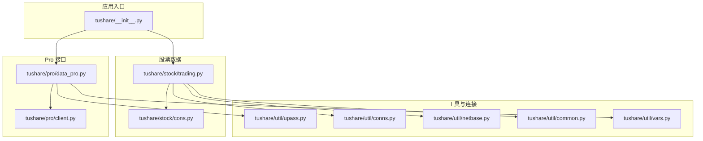
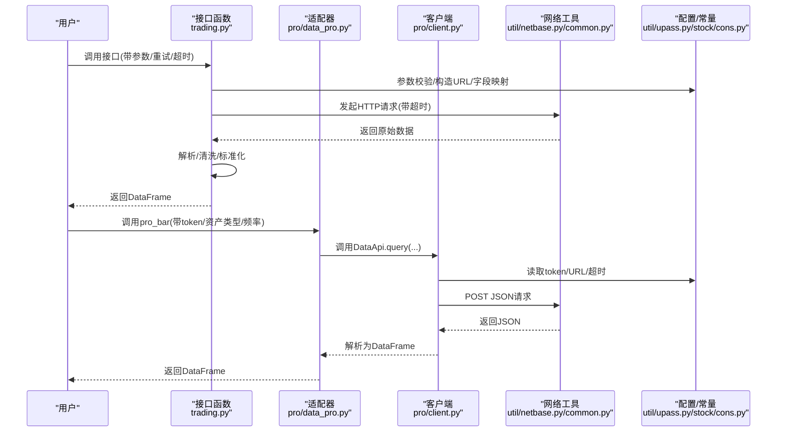
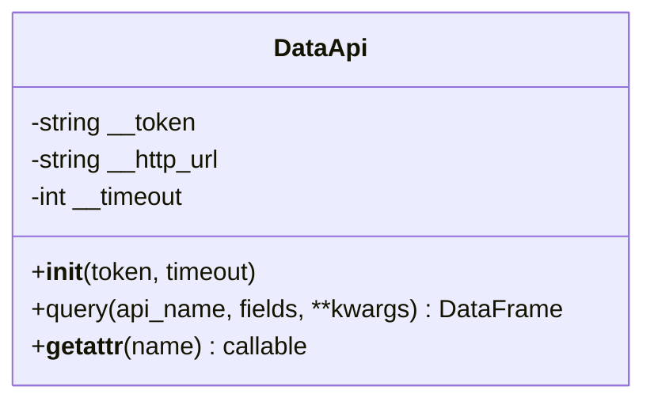
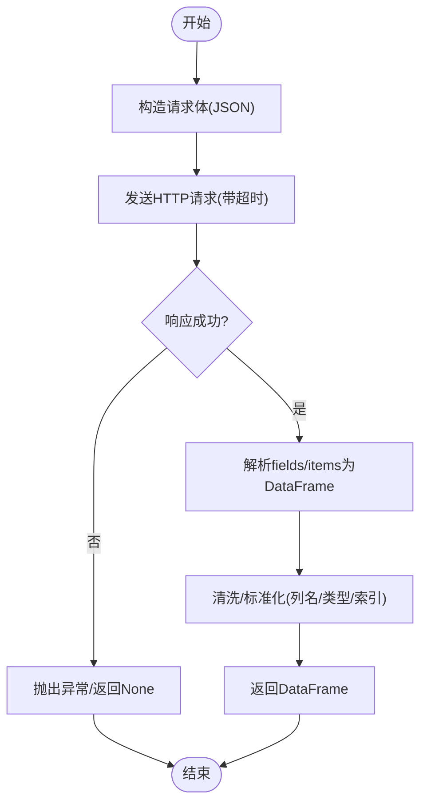
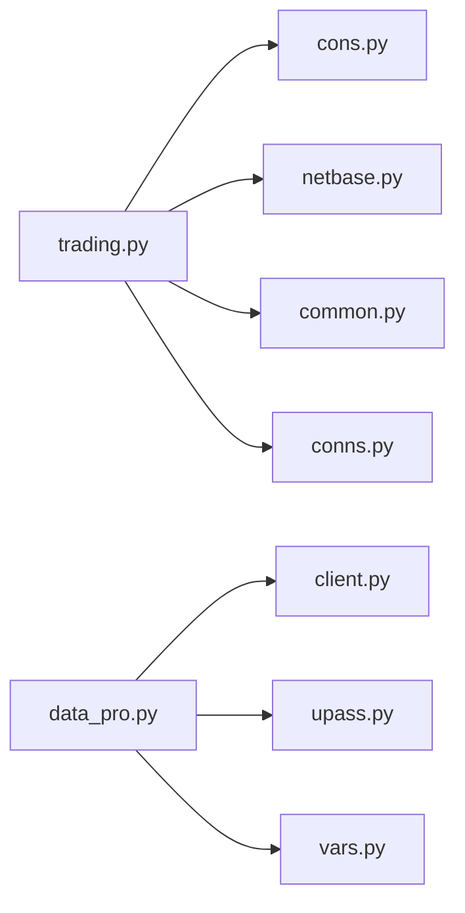

# 新数据源添加

<cite>
**本文档引用的文件**
- [README.md](file://README.md)
- [__init__.py](file://tushare/__init__.py)
- [trading.py](file://tushare/stock/trading.py)
- [cons.py](file://tushare/stock/cons.py)
- [data_pro.py](file://tushare/pro/data_pro.py)
- [client.py](file://tushare/pro/client.py)
- [upass.py](file://tushare/util/upass.py)
- [conns.py](file://tushare/util/conns.py)
- [netbase.py](file://tushare/util/netbase.py)
- [common.py](file://tushare/util/common.py)
- [vars.py](file://tushare/util/vars.py)
- [trading_test.py](file://test/trading_test.py)
</cite>

## 目录
1. [简介](#简介)
2. [项目结构](#项目结构)
3. [核心组件](#核心组件)
4. [架构总览](#架构总览)
5. [详细组件分析](#详细组件分析)
6. [依赖分析](#依赖分析)
7. [性能考量](#性能考量)
8. [故障排查指南](#故障排查指南)
9. [结论](#结论)
10. [附录](#附录)

## 简介
本指南面向希望为 TuShare 添加新金融数据源的开发者，系统讲解如何实现新的数据接口、编写 API 函数、参数校验、数据处理流程、错误与重试机制、超时控制等。文档以现有代码为依据，总结出一套可复用的“数据源适配器”设计模式，并给出从数据获取到结果返回的完整流程图解与最佳实践。

## 项目结构
TuShare 采用按领域分层的组织方式：
- tushare/stock：股票行情与基础数据接口
- tushare/pro：Pro 版统一 API 封装
- tushare/util：通用网络、连接、配置与工具
- test：单元测试样例

图表来源
- [__init__.py](file://tushare/__init__.py)
- [trading.py](file://tushare/stock/trading.py)
- [cons.py](file://tushare/stock/cons.py)
- [data_pro.py](file://tushare/pro/data_pro.py)
- [client.py](file://tushare/pro/client.py)
- [upass.py](file://tushare/util/upass.py)
- [conns.py](file://tushare/util/conns.py)
- [netbase.py](file://tushare/util/netbase.py)
- [common.py](file://tushare/util/common.py)
- [vars.py](file://tushare/util/vars.py)

章节来源
- [README.md](file://README.md)
- [__init__.py](file://tushare/__init__.py)

## 核心组件
- 数据接口层：对外暴露的 API 函数（如历史行情、实时行情、复权数据等）
- 数据适配器层：封装不同数据源的统一调用逻辑（Pro 版 DataApi）
- 工具与连接层：网络请求、重试、超时、Token 管理、连接池管理
- 配置与常量层：URL、字段、分页、错误提示等常量与工具函数

章节来源
- [trading.py](file://tushare/stock/trading.py)
- [data_pro.py](file://tushare/pro/data_pro.py)
- [client.py](file://tushare/pro/client.py)
- [upass.py](file://tushare/util/upass.py)
- [conns.py](file://tushare/util/conns.py)
- [netbase.py](file://tushare/util/netbase.py)
- [common.py](file://tushare/util/common.py)
- [cons.py](file://tushare/stock/cons.py)
- [vars.py](file://tushare/util/vars.py)

## 架构总览
TuShare 的数据获取遵循“接口层 -> 适配器层 -> 工具层”的分层设计。接口层负责参数校验与业务语义，适配器层负责统一调用底层数据源，工具层负责网络、连接与配置管理。

图表来源
- [trading.py](file://tushare/stock/trading.py)
- [data_pro.py](file://tushare/pro/data_pro.py)
- [client.py](file://tushare/pro/client.py)
- [netbase.py](file://tushare/util/netbase.py)
- [common.py](file://tushare/util/common.py)
- [upass.py](file://tushare/util/upass.py)
- [cons.py](file://tushare/stock/cons.py)

## 详细组件分析

### 1) 接口层：API 函数编写规范与参数校验
- 参数命名与默认值：明确必填/可选参数，提供合理默认值
- 输入校验：日期格式、K线类型、数据源标识等
- 错误处理：捕获网络异常、空数据、解析异常，抛出统一错误
- 重试与超时：统一的 retry_count 与 timeout 控制
- 输出标准化：统一列名、数据类型、索引顺序

示例参考路径
- [get_hist_data](file://tushare/stock/trading.py)
- [get_tick_data](file://tushare/stock/trading.py)
- [get_realtime_quotes](file://tushare/stock/trading.py)
- [get_h_data](file://tushare/stock/trading.py)
- [get_k_data](file://tushare/stock/trading.py)

章节来源
- [trading.py](file://tushare/stock/trading.py)
- [cons.py](file://tushare/stock/cons.py)

### 2) 数据适配器层：Pro 版 DataApi 设计模式
- 抽象基类思想：通过 DataApi 封装统一的 query 方法
- 动态属性：利用 __getattr__ 将任意 API 名映射为方法调用
- 请求与响应：POST JSON，解析返回的 fields/items 为 DataFrame
- Token 管理：通过 upass 模块读取/写入 token

图表来源
- [client.py](file://tushare/pro/client.py)

章节来源
- [client.py](file://tushare/pro/client.py)
- [data_pro.py](file://tushare/pro/data_pro.py)
- [upass.py](file://tushare/util/upass.py)

### 3) 数据处理流程：从获取到返回
- 请求阶段：构造请求体(JSON)，设置超时，发送请求
- 解析阶段：校验返回码，提取 fields 与 items，构建 DataFrame
- 标准化阶段：列名映射、数据类型转换、缺失值处理
- 返回阶段：按业务需求进行过滤、排序、索引设置

图表来源
- [client.py](file://tushare/pro/client.py)
- [data_pro.py](file://tushare/pro/data_pro.py)

章节来源
- [client.py](file://tushare/pro/client.py)
- [data_pro.py](file://tushare/pro/data_pro.py)

### 4) 不同数据格式的处理与解析
- JSON：直接解析 JSON，提取字段与条目，构造 DataFrame
- CSV/文本：读取文本，按分隔符解析，必要时进行编码转换
- XML/HTML：使用解析库提取表格或节点，转换为 DataFrame
- Excel：直接读取 Excel 表格，设置列名

示例参考路径
- [get_hist_data 使用 JSON](file://tushare/stock/trading.py)
- [get_tick_data 使用 Excel/文本](file://tushare/stock/trading.py)
- [get_today_all 使用 HTML 表格](file://tushare/stock/trading.py)

章节来源
- [trading.py](file://tushare/stock/trading.py)

### 5) 错误处理、重试机制与超时控制
- 重试策略：固定次数重试，指数退避可选
- 超时控制：请求级超时，避免阻塞
- 错误分类：网络错误、解析错误、空数据、认证失败
- 统一异常：抛出统一错误信息，便于上层处理

示例参考路径
- [get_hist_data 重试与超时](file://tushare/stock/trading.py)
- [pro_bar 重试与异常处理](file://tushare/pro/data_pro.py)

章节来源
- [trading.py](file://tushare/stock/trading.py)
- [data_pro.py](file://tushare/pro/data_pro.py)

### 6) Token 与认证管理
- Token 存储：用户目录下的 CSV 文件
- Token 读取：首次初始化时读取，后续复用
- 认证失败：抛出明确错误提示，引导用户注册/设置

示例参考路径
- [set_token/get_token](file://tushare/util/upass.py)
- [pro_api 初始化与校验](file://tushare/pro/data_pro.py)

章节来源
- [upass.py](file://tushare/util/upass.py)
- [data_pro.py](file://tushare/pro/data_pro.py)

### 7) 连接与网络工具
- HTTP 客户端：统一的请求头、Cookie、User-Agent
- 长连接：连接池管理，减少握手开销
- 编码与路径：URL 编码、路径拼接、字符集转换

示例参考路径
- [Client(HTTP 客户端)](file://tushare/util/common.py)
- [Client(网络请求)](file://tushare/util/netbase.py)
- [get_apis/close_apis](file://tushare/util/conns.py)

章节来源
- [common.py](file://tushare/util/common.py)
- [netbase.py](file://tushare/util/netbase.py)
- [conns.py](file://tushare/util/conns.py)

### 8) 常量与配置
- URL 与字段：集中定义各接口 URL、字段名、分页参数
- 错误提示：统一的错误消息，便于定位问题
- 数据格式：统一的格式化函数、列名映射

示例参考路径
- [常量与URL定义](file://tushare/stock/cons.py)
- [宏/指数/债券等接口路径](file://tushare/util/vars.py)

章节来源
- [cons.py](file://tushare/stock/cons.py)
- [vars.py](file://tushare/util/vars.py)

## 依赖分析
- 接口层依赖工具层与配置层，保证参数校验与 URL 构造的一致性
- 适配器层依赖网络工具与配置层，确保统一的请求与认证
- 测试层依赖接口层，验证典型场景与边界条件

图表来源
- [trading.py](file://tushare/stock/trading.py)
- [cons.py](file://tushare/stock/cons.py)
- [netbase.py](file://tushare/util/netbase.py)
- [common.py](file://tushare/util/common.py)
- [conns.py](file://tushare/util/conns.py)
- [data_pro.py](file://tushare/pro/data_pro.py)
- [client.py](file://tushare/pro/client.py)
- [upass.py](file://tushare/util/upass.py)
- [vars.py](file://tushare/util/vars.py)

章节来源
- [trading.py](file://tushare/stock/trading.py)
- [data_pro.py](file://tushare/pro/data_pro.py)
- [client.py](file://tushare/pro/client.py)
- [upass.py](file://tushare/util/upass.py)
- [conns.py](file://tushare/util/conns.py)
- [netbase.py](file://tushare/util/netbase.py)
- [common.py](file://tushare/util/common.py)
- [cons.py](file://tushare/stock/cons.py)
- [vars.py](file://tushare/util/vars.py)

## 性能考量
- 合理设置超时与重试次数，避免长时间阻塞
- 对批量数据分批请求，降低单次请求压力
- 使用连接池与长连接，减少握手成本
- 数据清洗尽量向量化，避免逐行处理
- 对高频接口缓存热点数据，减少重复请求

## 故障排查指南
- 网络错误：检查超时设置、代理、防火墙
- 认证失败：确认 token 是否存在、是否过期
- 解析异常：检查返回格式是否符合预期
- 空数据：确认参数是否正确、目标数据是否存在
- 重试无效：检查重试次数与间隔，必要时调整策略

章节来源
- [trading.py](file://tushare/stock/trading.py)
- [data_pro.py](file://tushare/pro/data_pro.py)
- [upass.py](file://tushare/util/upass.py)

## 结论
通过接口层、适配器层与工具层的清晰分工，TuShare 提供了可扩展的数据源接入框架。新增数据源时，建议遵循统一的参数校验、重试与超时、错误处理与输出标准化规范，并优先使用现有的工具与连接层能力，以确保一致性与稳定性。

## 附录
- 快速开始：参考 README 中的示例与安装说明
- 测试样例：参考 test 目录中的单元测试，验证新增接口行为

章节来源
- [README.md](file://README.md)
- [trading_test.py](file://test/trading_test.py)