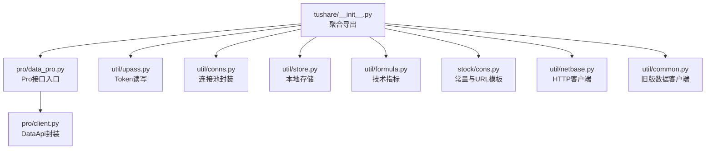
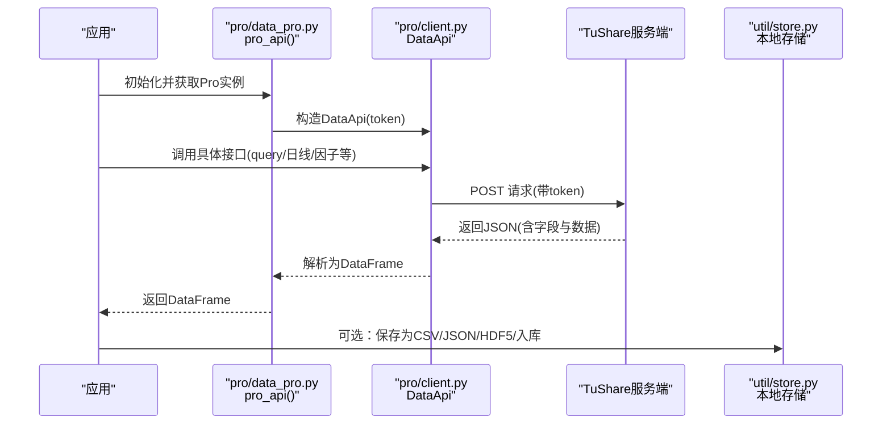
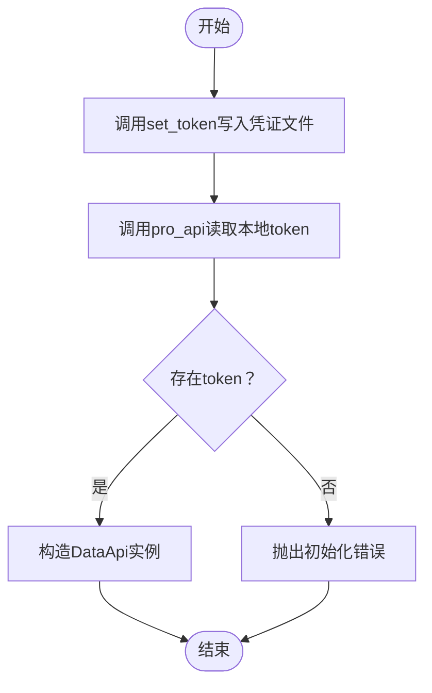
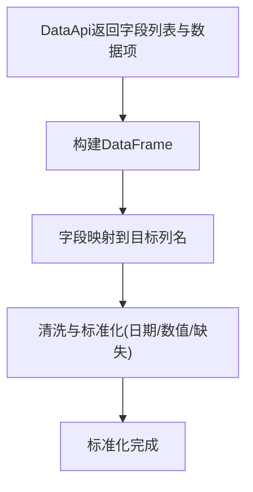
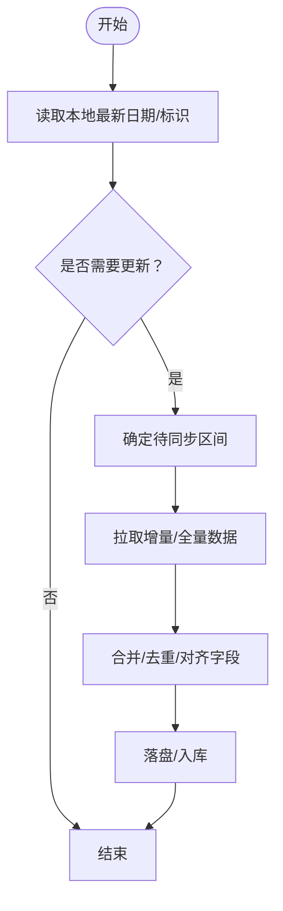
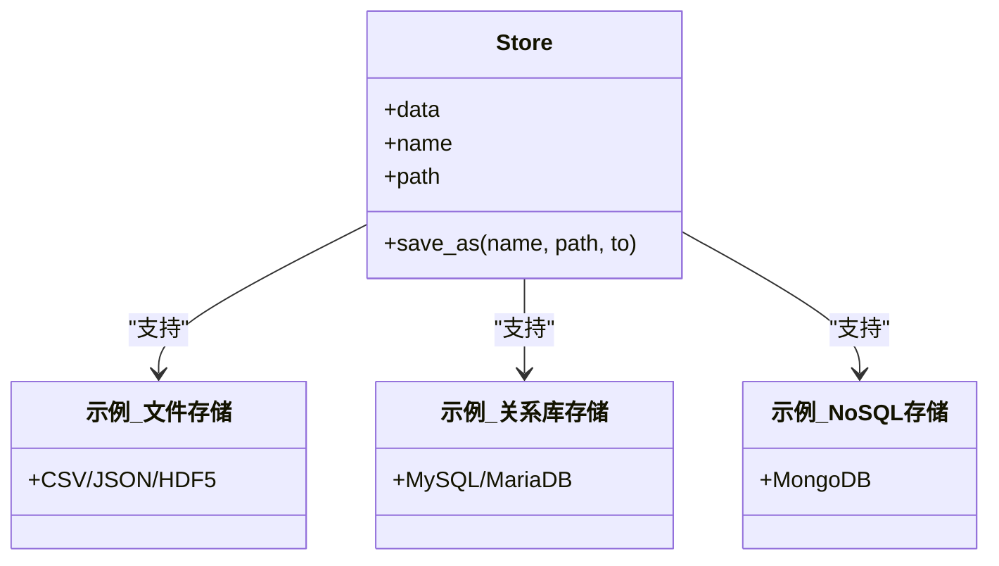
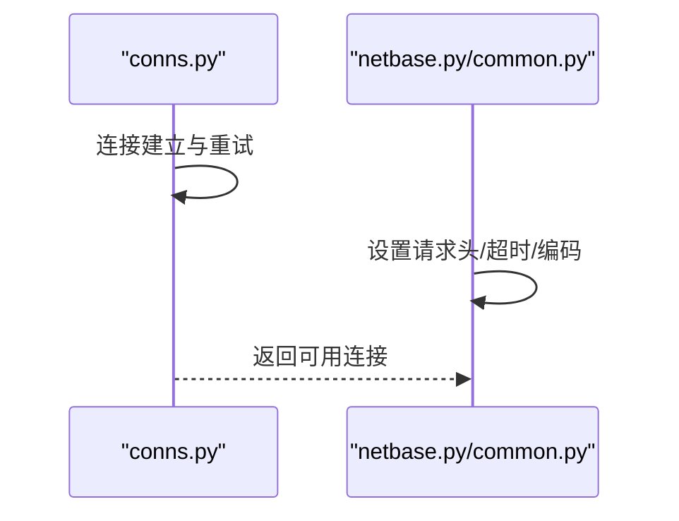
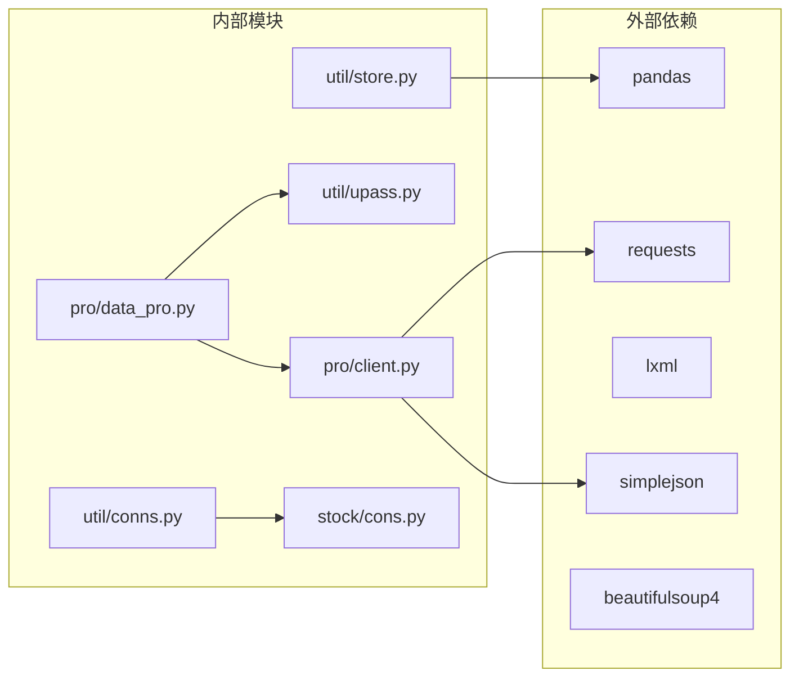

# 第三方集成

<cite>
**本文引用的文件**   
- [README.md](file://README.md)
- [setup.py](file://setup.py)
- [requirements.txt](file://requirements.txt)
- [tushare/__init__.py](file://tushare/__init__.py)
- [tushare/pro/client.py](file://tushare/pro/client.py)
- [tushare/pro/data_pro.py](file://tushare/pro/data_pro.py)
- [tushare/util/upass.py](file://tushare/util/upass.py)
- [tushare/util/conns.py](file://tushare/util/conns.py)
- [tushare/util/common.py](file://tushare/util/common.py)
- [tushare/util/netbase.py](file://tushare/util/netbase.py)
- [tushare/util/store.py](file://tushare/util/store.py)
- [tushare/util/formula.py](file://tushare/util/formula.py)
- [tushare/stock/cons.py](file://tushare/stock/cons.py)
- [test/storing_test.py](file://test/storing_test.py)
- [test/trading_test.py](file://test/trading_test.py)
</cite>

## 目录
1. [简介](#简介)
2. [项目结构](#项目结构)
3. [核心组件](#核心组件)
4. [架构总览](#架构总览)
5. [组件详解](#组件详解)
6. [依赖关系分析](#依赖关系分析)
7. [性能考量](#性能考量)
8. [故障排查指南](#故障排查指南)
9. [结论](#结论)
10. [附录](#附录)

## 简介
本指南面向希望在TuShare基础上接入第三方数据源的开发者，系统阐述如何实现外部数据提供商的对接，包括数据格式转换、认证机制、数据同步策略、缓存与本地存储、以及监控与日志记录。文档以TuShare现有模块为依据，结合其Pro接口、Token管理、连接池与存储能力，给出可落地的集成步骤与最佳实践。

## 项目结构
TuShare采用按功能域分层的组织方式：顶层入口导出各子模块；Pro版提供统一的远程接口封装；util目录提供通用工具（认证、连接、存储、公式计算等）；stock目录包含常量与URL模板；test目录提供使用示例与验证。

**图示来源**
- [tushare/__init__.py:11-139](file://tushare/__init__.py#L11-L139)
- [tushare/pro/data_pro.py:21-32](file://tushare/pro/data_pro.py#L21-L32)
- [tushare/pro/client.py:17-52](file://tushare/pro/client.py#L17-L52)
- [tushare/util/upass.py:16-31](file://tushare/util/upass.py#L16-L31)
- [tushare/util/conns.py:14-61](file://tushare/util/conns.py#L14-L61)
- [tushare/util/store.py:14-44](file://tushare/util/store.py#L14-L44)
- [tushare/util/formula.py:12-13](file://tushare/util/formula.py#L12-L13)
- [tushare/stock/cons.py:13, 163-168](file://tushare/stock/cons.py#L13,L163-L168)
- [tushare/util/netbase.py:9-29](file://tushare/util/netbase.py#L9-L29)
- [tushare/util/common.py:18-86](file://tushare/util/common.py#L18-L86)

**章节来源**
- [README.md:1-411](file://README.md#L1-L411)
- [tushare/__init__.py:11-139](file://tushare/__init__.py#L11-L139)

## 核心组件
- Pro接口封装：通过统一的DataApi类发起请求，解析返回并输出DataFrame，便于后续标准化处理。
- Token管理：提供set_token/get_token，将凭证持久化至用户主目录，供Pro接口使用。
- 连接池与网络：conns封装多路连接，common与netbase提供HTTP请求与编码处理。
- 存储与导出：store提供CSV/Excel/JSON/HDF5/数据库等多种落盘能力。
- 技术指标：formula提供常用技术指标计算，便于在接入新数据后进行二次加工。
- 常量与URL：cons集中管理各类接口URL、字段名、K线周期等常量，便于字段映射与格式标准化。

**章节来源**
- [tushare/pro/client.py:17-52](file://tushare/pro/client.py#L17-L52)
- [tushare/util/upass.py:16-31](file://tushare/util/upass.py#L16-L31)
- [tushare/util/conns.py:14-61](file://tushare/util/conns.py#L14-L61)
- [tushare/util/store.py:14-44](file://tushare/util/store.py#L14-L44)
- [tushare/util/formula.py:12-13](file://tushare/util/formula.py#L12-L13)
- [tushare/stock/cons.py:13, 163-168](file://tushare/stock/cons.py#L13,L163-L168)

## 架构总览
下图展示从应用到第三方数据源的典型调用链：应用通过Pro接口入口调用DataApi，DataApi负责认证与请求转发；返回数据经统一解析后形成DataFrame，随后进入数据清洗与标准化流程，并可选择落盘或进一步计算。

**图示来源**
- [tushare/pro/data_pro.py:21-32](file://tushare/pro/data_pro.py#L21-L32)
- [tushare/pro/client.py:32-48](file://tushare/pro/client.py#L32-L48)
- [tushare/util/store.py:24-44](file://tushare/util/store.py#L24-L44)

## 组件详解

### 认证与Token管理
- 设定与读取：通过set_token将凭证写入用户主目录下的固定文件；get_token从该文件读取，若不存在则提示注册申请。
- 使用场景：pro_api内部优先从本地读取token，若未设置则抛出初始化错误，避免空凭证导致的请求失败。
- 安全建议：凭证文件位于用户主目录，注意权限控制；生产环境建议配合环境变量或密钥管理服务。

**图示来源**
- [tushare/util/upass.py:16-31](file://tushare/util/upass.py#L16-L31)
- [tushare/pro/data_pro.py:21-32](file://tushare/pro/data_pro.py#L21-L32)

**章节来源**
- [tushare/util/upass.py:16-31](file://tushare/util/upass.py#L16-L31)
- [tushare/pro/data_pro.py:21-32](file://tushare/pro/data_pro.py#L21-L32)

### 数据格式转换与标准化
- 统一输出：DataApi将远端返回的字段与数据项映射为DataFrame，列名来自远端字段列表，便于后续处理。
- 字段映射：利用cons中的列名常量与业务字段清单，建立源字段到目标字段的映射表，完成字段对齐。
- 格式标准化：统一日期索引、数值精度、缺失值填充策略；对复权、因子等衍生字段进行一致性处理。

**图示来源**
- [tushare/pro/client.py:45-48](file://tushare/pro/client.py#L45-L48)
- [tushare/stock/cons.py:63-68](file://tushare/stock/cons.py#L63-L68)

**章节来源**
- [tushare/pro/client.py:45-48](file://tushare/pro/client.py#L45-L48)
- [tushare/stock/cons.py:63-68](file://tushare/stock/cons.py#L63-L68)

### 数据同步策略
- 增量更新：基于日期索引或唯一标识，比较本地最大日期与远端最新日期，仅拉取新增区间。
- 全量同步：首次或定期全量拉取，结合断点续传与重试机制，保证完整性。
- 冲突解决：当远端数据可回溯调整时，采用“保留远端最新”或“合并去重”的策略；对不可调整的历史数据，采用追加模式并标注来源。

[此图为概念性流程，无需图示来源]

### 缓存与本地存储
- 文件缓存：支持CSV/JSON/HDF5等格式，便于快速加载与跨语言共享。
- 关系数据库：通过SQLAlchemy将DataFrame写入MySQL/MariaDB等关系库，适合结构化查询与分析。
- NoSQL：将JSON写入MongoDB，适合半结构化与灵活schema场景。
- 存储工具：store模块提供统一的save_as接口，自动创建目录并执行保存。

**图示来源**
- [tushare/util/store.py:14-44](file://tushare/util/store.py#L14-L44)
- [test/storing_test.py:8-57](file://test/storing_test.py#L8-L57)

**章节来源**
- [tushare/util/store.py:14-44](file://tushare/util/store.py#L14-L44)
- [test/storing_test.py:8-57](file://test/storing_test.py#L8-L57)

### 连接与网络层
- 连接池：conns封装多路连接，提供重试与心跳，提升稳定性。
- HTTP客户端：common/netbase提供请求头、Cookie、超时等配置，适配不同数据源的鉴权与UA要求。
- 编码处理：对非ASCII字符进行URL编码，避免请求失败。

**图示来源**
- [tushare/util/conns.py:14-61](file://tushare/util/conns.py#L14-L61)
- [tushare/util/netbase.py:9-29](file://tushare/util/netbase.py#L9-L29)
- [tushare/util/common.py:30-61](file://tushare/util/common.py#L30-L61)

**章节来源**
- [tushare/util/conns.py:14-61](file://tushare/util/conns.py#L14-L61)
- [tushare/util/netbase.py:9-29](file://tushare/util/netbase.py#L9-L29)
- [tushare/util/common.py:30-61](file://tushare/util/common.py#L30-L61)

### 技术指标与二次加工
- 指标计算：formula提供移动平均、MACD、布林带等指标，可在接入新数据后快速生成衍生特征。
- 批处理：结合pandas的向量化操作，对多只股票批量计算，提升效率。

**章节来源**
- [tushare/util/formula.py:12-13](file://tushare/util/formula.py#L12-L13)

## 依赖关系分析
- 外部依赖：pandas、requests、lxml、simplejson、beautifulsoup4等，支撑数据处理、HTTP请求与解析。
- 内部依赖：pro/data_pro依赖pro/client与util/upass；util/store依赖pandas与文件系统；stock/cons提供常量与URL模板。

**图示来源**
- [requirements.txt:1-6](file://requirements.txt#L1-L6)
- [setup.py:65-74](file://setup.py#L65-L74)
- [tushare/pro/data_pro.py:9-11](file://tushare/pro/data_pro.py#L9-L11)
- [tushare/pro/client.py:11-14](file://tushare/pro/client.py#L11-L14)
- [tushare/util/store.py:8-11](file://tushare/util/store.py#L8-L11)
- [tushare/util/conns.py:9-11](file://tushare/util/conns.py#L9-L11)
- [tushare/stock/cons.py:1, 13](file://tushare/stock/cons.py#L1,L13)

**章节来源**
- [requirements.txt:1-6](file://requirements.txt#L1-L6)
- [setup.py:65-74](file://setup.py#L65-L74)

## 性能考量
- 批量请求与并发：合理设置重试次数与超时，避免阻塞；对高频接口采用限流与退避策略。
- 数据分片：按日期/代码分片存储，提升查询与更新效率。
- 内存与磁盘：对大表进行分块写入与压缩，减少内存峰值；选择合适的存储格式（如Parquet/HDF5）。
- 计算加速：利用pandas/numpy向量化与numba（如引入）加速指标计算。

[本节为通用指导，无需章节来源]

## 故障排查指南
- 认证失败：确认本地token文件是否存在且有效；若无则通过官方渠道申请并使用set_token写入。
- 网络异常：检查代理/防火墙设置；conns提供重试与错误提示，定位网络问题。
- 数据解析：DataApi对返回状态进行校验，非零状态会抛出异常；检查字段列表与数据项是否匹配。
- 存储异常：确认目标路径权限与磁盘空间；store在路径不存在时自动创建目录。

**章节来源**
- [tushare/util/upass.py:23-31](file://tushare/util/upass.py#L23-L31)
- [tushare/util/conns.py:14-23](file://tushare/util/conns.py#L14-L23)
- [tushare/pro/client.py:42-44](file://tushare/pro/client.py#L42-L44)
- [tushare/util/store.py:34-40](file://tushare/util/store.py#L34-L40)

## 结论
通过TuShare现有的Pro接口、Token管理、连接池与存储工具，可以高效地集成第三方数据源。建议遵循“统一认证、标准化格式、分层处理、缓存落盘、可观测性”的原则，结合增量同步与冲突策略，构建稳定可靠的数据管道。

[本节为总结，无需章节来源]

## 附录
- 快速开始：参考README中的示例与安装说明，先在本地验证数据获取与存储流程。
- 测试参考：trading_test与storing_test展示了典型用法，可作为集成测试的起点。

**章节来源**
- [README.md:30-411](file://README.md#L30-L411)
- [test/trading_test.py:18-35](file://test/trading_test.py#L18-L35)
- [test/storing_test.py:8-57](file://test/storing_test.py#L8-L57)