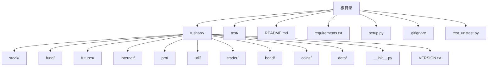
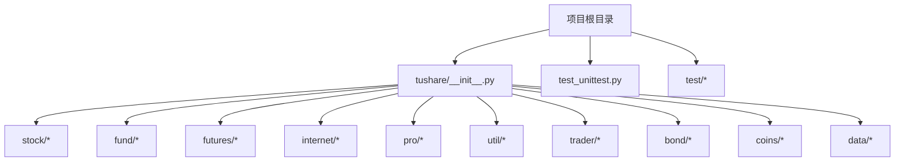
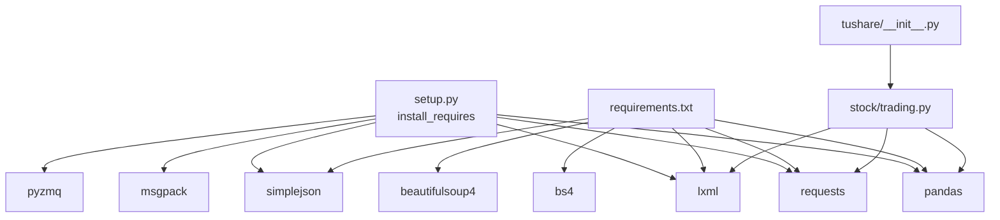

# 环境搭建

<cite>
**本文引用的文件**
- [setup.py](file://setup.py)
- [requirements.txt](file://requirements.txt)
- [README.md](file://README.md)
- [tushare/__init__.py](file://tushare/__init__.py)
- [tushare/VERSION.txt](file://tushare/VERSION.txt)
- [.gitignore](file://.gitignore)
- [test_unittest.py](file://test_unittest.py)
- [tushare/util/common.py](file://tushare/util/common.py)
- [tushare/stock/trading.py](file://tushare/stock/trading.py)
</cite>

## 目录
1. [简介](#简介)
2. [项目结构](#项目结构)
3. [核心组件](#核心组件)
4. [架构总览](#架构总览)
5. [详细组件分析](#详细组件分析)
6. [依赖分析](#依赖分析)
7. [性能考量](#性能考量)
8. [故障排查指南](#故障排查指南)
9. [结论](#结论)
10. [附录](#附录)

## 简介
本指南面向希望在本地搭建 TuShare 开发环境的开发者，涵盖 Python 版本要求、推荐开发环境、依赖库安装、IDE 配置、Git 使用以及常见问题排查。TuShare 是一个用于抓取中国股票/期货等金融数据的工具，强调数据采集、清洗与存储，适合金融量化分析师与学习者使用。

## 项目结构
仓库采用按功能域划分的包结构，主要模块集中在 tushare 包内，测试位于根目录的 test 与 test_unittest.py，核心入口通过 tushare/__init__.py 导出常用 API。

图表来源
- [tushare/__init__.py](file://tushare/__init__.py)
- [tushare/VERSION.txt](file://tushare/VERSION.txt)
- [setup.py](file://setup.py)

章节来源
- [tushare/__init__.py:1-140](file://tushare/__init__.py#L1-L140)
- [setup.py:77-100](file://setup.py#L77-L100)

## 核心组件
- 版本与作者信息：通过 tushare/VERSION.txt 提供版本号，__init__.py 导出大量 API 并聚合各子模块。
- 安装与依赖：setup.py 定义安装依赖与 Python 版本支持；requirements.txt 提供额外依赖清单。
- 测试：test_unittest.py 提供基础单元测试样例，test/ 下包含各类业务模块的测试文件。
- Git 忽略规则：.gitignore 规范了构建产物、缓存、IDE 文件等的忽略策略。

章节来源
- [tushare/VERSION.txt:1-1](file://tushare/VERSION.txt#L1-L1)
- [tushare/__init__.py:1-140](file://tushare/__init__.py#L1-L140)
- [setup.py:65-74](file://setup.py#L65-L74)
- [requirements.txt:1-6](file://requirements.txt#L1-L6)
- [test_unittest.py:1-25](file://test_unittest.py#L1-L25)
- [.gitignore:1-78](file://.gitignore#L1-L78)

## 架构总览
TuShare 的核心由以下层次构成：
- 入口层：tushare/__init__.py 将各子模块 API 聚合导出，便于用户直接 import tushare 使用。
- 功能层：stock/fund/futures/internet/pro/util/trader/bond/coins/data 等子包按业务域划分。
- 工具层：util 提供网络、日期、公式、存储、连接池等通用能力。
- 测试层：test_unittest.py 与 test/* 提供单元测试与集成测试样例。

图表来源
- [tushare/__init__.py:1-140](file://tushare/__init__.py#L1-L140)

## 详细组件分析

### Python 版本与安装要求
- Python 版本支持：setup.py 的 classifiers 显示支持 Python 2.6/2.7 与 3.2–3.5；README 文档声明支持 python 2.x/3.x。
- 推荐版本：建议使用 Python 3.6+ 以获得更好的生态兼容性与性能。

章节来源
- [setup.py:89-96](file://setup.py#L89-L96)
- [README.md:23-26](file://README.md#L23-L26)

### 依赖库安装
- 核心依赖（来自 setup.py）：pandas、requests、lxml、simplejson、msgpack、pyzmq。
- 额外依赖（来自 requirements.txt）：pandas、requests、lxml、simplejson、bs4、beautifulsoup4。
- 安装方式：
  - 使用 pip 安装：pip install -r requirements.txt
  - 或逐项安装：pip install pandas requests lxml simplejson beautifulsoup4
- 注意事项：
  - lxml 在 Windows 上可能需要预编译二进制或使用 wheel 安装。
  - 若网络受限，可使用国内镜像源加速安装。

章节来源
- [setup.py:65-74](file://setup.py#L65-L74)
- [requirements.txt:1-6](file://requirements.txt#L1-L6)

### 虚拟环境创建与激活
- 推荐使用 venv 或 conda 创建隔离环境，避免全局污染。
- 创建步骤（示例）：
  - python -m venv .venv
  - Windows: .venv\Scripts\activate
  - Linux/macOS: source .venv/bin/activate
- 激活后安装依赖：pip install -r requirements.txt

章节来源
- [requirements.txt:1-6](file://requirements.txt#L1-L6)

### IDE 配置建议
- PyCharm
  - 设置解释器为虚拟环境中的 Python 可执行文件。
  - 在项目设置中启用“在 VCS 中忽略”未跟踪文件，避免提交 .gitignore 之外的 IDE 文件。
- VS Code
  - 安装 Python 扩展，选择正确的 Python 解释器。
  - 配置任务与调试，运行测试文件 test_unittest.py。
- 通用建议
  - 配置代码格式化（如 black）、类型检查（如 mypy）与单元测试框架（unittest）。
  - 在 .gitignore 中确保 IDE 生成的缓存与日志文件被忽略。

章节来源
- [.gitignore:1-78](file://.gitignore#L1-L78)

### Git 版本控制使用
- Fork 与 Clone
  - 在 GitHub 上 Fork 仓库，然后 clone 到本地。
- 分支管理
  - 建议使用特性分支进行开发，完成后合并主干。
  - 使用 git status、add、commit、push、pull、merge 等命令管理变更。
- 提交规范
  - 保持提交信息清晰，遵循项目风格。
- 忽略文件
  - 项目已提供 .gitignore，确保不会将构建产物、缓存、IDE 文件提交到仓库。

章节来源
- [.gitignore:1-78](file://.gitignore#L1-L78)

### 目录结构与文件组织
- tushare 包
  - stock：交易数据、财务数据、宏观数据、分类数据、新闻事件、参考数据、Shibor 等。
  - fund：基金净值等。
  - futures：国内与国际期货数据。
  - internet：互联网相关数据。
  - pro：Pro 版接口封装。
  - util：通用工具（网络、日期、公式、存储、连接池、令牌等）。
  - trader：交易相关 API。
  - bond/coins/data：债券、加密货币、数据模块。
- 根目录
  - test：单元测试文件集合。
  - test_unittest.py：基础单元测试示例。
  - README.md：项目说明与安装使用指南。
  - requirements.txt/setup.py：依赖与安装配置。
  - .gitignore：版本控制忽略规则。

章节来源
- [tushare/__init__.py:1-140](file://tushare/__init__.py#L1-L140)
- [test_unittest.py:1-25](file://test_unittest.py#L1-L25)
- [README.md:1-411](file://README.md#L1-L411)

### 常见环境问题排查
- 依赖安装失败
  - lxml：Windows 建议使用 wheel 或安装 Microsoft Visual C++ Build Tools。
  - pandas/requests：确认网络与镜像源可用，必要时切换为国内镜像。
- 编码与字符集
  - 某些接口返回 GBK 编码，读取时需正确解码后再处理。
- 网络超时与重试
  - 代码中存在重试机制与暂停参数，可根据网络状况调整 retry_count 与 pause。
- 测试运行
  - 使用 unittest 运行 test_unittest.py，确保基本接口可用。

章节来源
- [tushare/util/common.py:10-86](file://tushare/util/common.py#L10-L86)
- [tushare/stock/trading.py:32-101](file://tushare/stock/trading.py#L32-L101)
- [test_unittest.py:1-25](file://test_unittest.py#L1-L25)

## 依赖分析
TuShare 的依赖关系主要体现在安装时的依赖声明与运行时的模块导入链路。

图表来源
- [setup.py:65-74](file://setup.py#L65-L74)
- [requirements.txt:1-6](file://requirements.txt#L1-L6)
- [tushare/__init__.py:1-140](file://tushare/__init__.py#L1-L140)
- [tushare/stock/trading.py:11-25](file://tushare/stock/trading.py#L11-L25)

章节来源
- [setup.py:65-74](file://setup.py#L65-L74)
- [requirements.txt:1-6](file://requirements.txt#L1-L6)
- [tushare/__init__.py:1-140](file://tushare/__init__.py#L1-L140)
- [tushare/stock/trading.py:11-25](file://tushare/stock/trading.py#L11-L25)

## 性能考量
- 网络请求与重试：接口内部包含重试与暂停逻辑，避免过于频繁的请求导致网络错误。
- 数据处理：返回值多为 pandas DataFrame，建议在本地缓存与批处理，减少重复网络请求。
- 依赖优化：优先使用二进制 wheel 安装 lxml 等二进制依赖，提升安装与运行效率。

章节来源
- [tushare/stock/trading.py:67-100](file://tushare/stock/trading.py#L67-L100)

## 故障排查指南
- 无法导入模块
  - 确认虚拟环境已激活且依赖已安装。
  - 检查 PYTHONPATH 是否包含项目根目录。
- 网络请求失败
  - 检查网络连通性与代理设置。
  - 调整 retry_count 与 pause 参数。
- 字符集问题
  - 对返回的 GBK 编码内容进行正确解码与转换。
- 测试失败
  - 使用 unittest 运行 test_unittest.py，定位失败用例并检查依赖与网络状态。

章节来源
- [tushare/util/common.py:10-86](file://tushare/util/common.py#L10-L86)
- [tushare/stock/trading.py:135-187](file://tushare/stock/trading.py#L135-L187)
- [test_unittest.py:1-25](file://test_unittest.py#L1-L25)

## 结论
通过本指南，您可以完成 TuShare 的开发环境搭建：选择合适的 Python 版本、创建并激活虚拟环境、安装核心与额外依赖、配置 IDE、使用 Git 管理代码，并掌握常见问题的排查方法。建议在本地先运行基础测试，确保网络与依赖正常后再进行二次开发。

## 附录
- 安装与升级
  - pip install tushare
  - pip install tushare --upgrade
- 快速开始
  - import tushare as ts
  - 获取历史数据：ts.get_hist_data('600848')
- 版本信息
  - 当前版本：参见 tushare/VERSION.txt

章节来源
- [README.md:30-42](file://README.md#L30-L42)
- [README.md:43-96](file://README.md#L43-L96)
- [tushare/VERSION.txt:1-1](file://tushare/VERSION.txt#L1-L1)