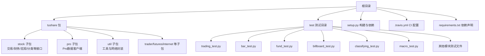
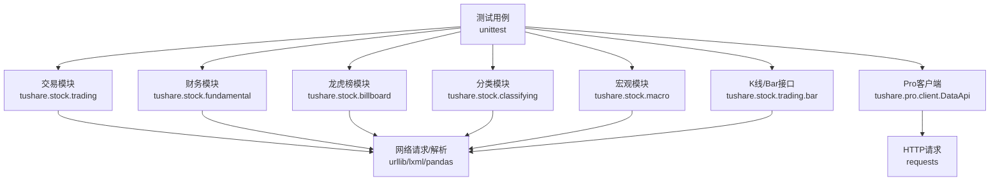
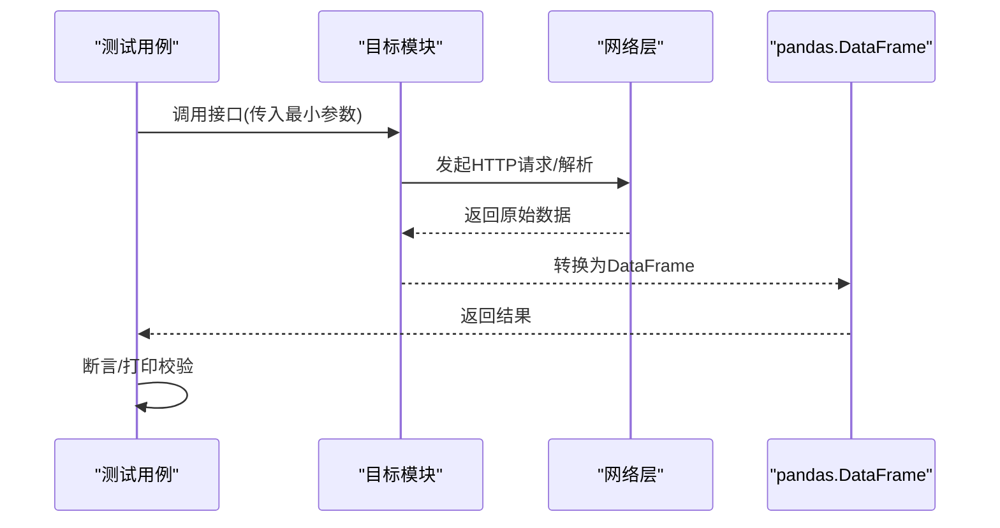
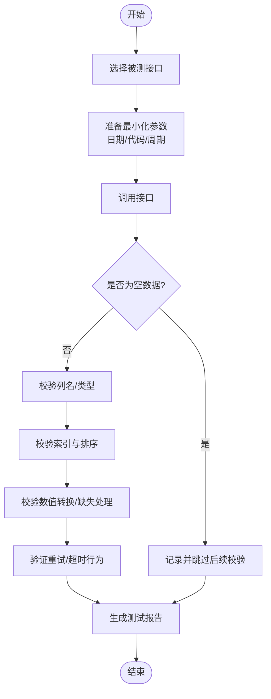
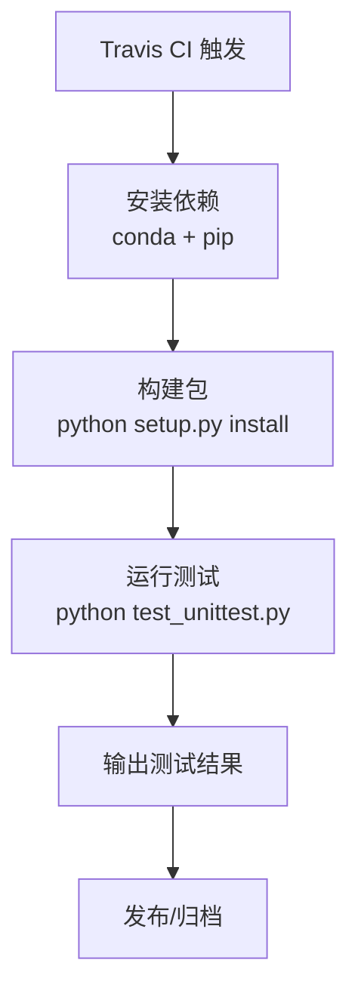
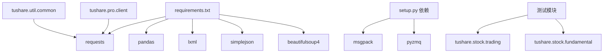

# 调试与测试

<cite>
**本文引用的文件**   
- [README.md](file://README.md)
- [setup.py](file://setup.py)
- [requirements.txt](file://requirements.txt)
- [.travis.yml](file://.travis.yml)
- [test_unittest.py](file://test_unittest.py)
- [test/trading_test.py](file://test/trading_test.py)
- [test/bar_test.py](file://test/bar_test.py)
- [test/fund_test.py](file://test/fund_test.py)
- [test/billboard_test.py](file://test/billboard_test.py)
- [test/classifying_test.py](file://test/classifying_test.py)
- [test/macro_test.py](file://test/macro_test.py)
- [tushare/__init__.py](file://tushare/__init__.py)
- [tushare/stock/trading.py](file://tushare/stock/trading.py)
- [tushare/pro/client.py](file://tushare/pro/client.py)
- [tushare/util/common.py](file://tushare/util/common.py)
- [tushare/stock/fundamental.py](file://tushare/stock/fundamental.py)
</cite>

## 目录
1. [简介](#简介)
2. [项目结构](#项目结构)
3. [核心组件](#核心组件)
4. [架构总览](#架构总览)
5. [详细组件分析](#详细组件分析)
6. [依赖分析](#依赖分析)
7. [性能考量](#性能考量)
8. [故障排查指南](#故障排查指南)
9. [结论](#结论)
10. [附录](#附录)

## 简介
本指南面向TuShare项目的开发者，聚焦于调试与测试实践，涵盖单元测试与集成测试的编写与运行、模拟数据与测试数据管理、持续集成配置以及常见问题的定位与解决。内容基于仓库现有测试脚本、构建与依赖配置，结合核心模块的实现特性，给出可操作的流程与图示。

## 项目结构
TuShare采用按功能域划分的模块化组织方式，测试目录按业务模块拆分，便于针对性验证。核心入口通过包级导出统一对外暴露API。

图表来源
- [tushare/__init__.py:11-140](file://tushare/__init__.py#L11-L140)
- [test/trading_test.py:1-43](file://test/trading_test.py#L1-L43)
- [test/bar_test.py:1-23](file://test/bar_test.py#L1-L23)
- [test/fund_test.py:1-43](file://test/fund_test.py#L1-L43)
- [test/billboard_test.py:1-35](file://test/billboard_test.py#L1-L35)
- [test/classifying_test.py:1-51](file://test/classifying_test.py#L1-L51)
- [test/macro_test.py:1-50](file://test/macro_test.py#L1-L50)

章节来源
- [README.md:1-411](file://README.md#L1-L411)
- [tushare/__init__.py:11-140](file://tushare/__init__.py#L11-L140)

## 核心组件
- 接口层：通过包级导出统一暴露交易、财务、宏观、分类、新闻、参考、Shibor、基金、期货、国际、全局行情等接口，便于测试直接导入对应模块进行调用。
- Pro数据客户端：提供基于HTTP的查询封装，支持字段过滤与DataFrame结果转换。
- 工具与网络：提供HTTPS连接封装、路径编码、重试与超时控制等基础设施，支撑接口稳定性。
- 测试体系：以unittest为主，按模块拆分测试文件，覆盖交易、K线、财务、龙虎榜、分类、宏观等场景。

章节来源
- [tushare/__init__.py:11-140](file://tushare/__init__.py#L11-L140)
- [tushare/pro/client.py:17-52](file://tushare/pro/client.py#L17-L52)
- [tushare/util/common.py:18-86](file://tushare/util/common.py#L18-L86)
- [test/trading_test.py:1-43](file://test/trading_test.py#L1-L43)
- [test/bar_test.py:1-23](file://test/bar_test.py#L1-L23)
- [test/fund_test.py:1-43](file://test/fund_test.py#L1-L43)
- [test/billboard_test.py:1-35](file://test/billboard_test.py#L1-L35)
- [test/classifying_test.py:1-51](file://test/classifying_test.py#L1-L51)
- [test/macro_test.py:1-50](file://test/macro_test.py#L1-L50)

## 架构总览
下图展示测试运行与核心模块交互关系，突出测试驱动的调用链与数据返回形态。

图表来源
- [test/trading_test.py:18-39](file://test/trading_test.py#L18-L39)
- [test/bar_test.py:16-18](file://test/bar_test.py#L16-L18)
- [test/fund_test.py:15-16](file://test/fund_test.py#L15-L16)
- [tushare/stock/trading.py:32-100](file://tushare/stock/trading.py#L32-L100)
- [tushare/stock/fundamental.py:22-59](file://tushare/stock/fundamental.py#L22-L59)
- [tushare/pro/client.py:32-48](file://tushare/pro/client.py#L32-L48)

## 详细组件分析

### 单元测试编写与运行
- 测试框架与入口
  - 使用标准库unittest，测试文件直接运行或由CI统一调度。
  - 示例入口参见测试文件头部注释与主函数调用位置。
- 测试用例设计要点
  - 参数最小化：仅设置必要参数（如股票代码、日期区间），避免跨网络不稳定因素。
  - 输出可验证：打印或断言返回值非空、列名正确、索引合理。
  - 异常边界：覆盖空数据、非法参数、网络异常等场景。
- 运行方式
  - 在项目根目录执行Python测试脚本，或通过CI配置统一运行。

图表来源
- [test/trading_test.py:18-39](file://test/trading_test.py#L18-L39)
- [tushare/stock/trading.py:32-100](file://tushare/stock/trading.py#L32-L100)

章节来源
- [test_unittest.py:8-25](file://test_unittest.py#L8-L25)
- [test/trading_test.py:18-39](file://test/trading_test.py#L18-L39)
- [test/bar_test.py:16-18](file://test/bar_test.py#L16-L18)
- [test/fund_test.py:15-16](file://test/fund_test.py#L15-L16)
- [test/billboard_test.py:15-29](file://test/billboard_test.py#L15-L29)
- [test/classifying_test.py:18-43](file://test/classifying_test.py#L18-L43)
- [test/macro_test.py:11-45](file://test/macro_test.py#L11-L45)

### 集成测试策略
- API接口测试
  - 交易类：历史K线、分笔、实时行情、复权数据、K线扩展等。
  - 财务类：基础资料、报表与盈利/营运/成长/偿债/现金流等指标。
  - 宏观类：GDP/CPI/PPi/存贷款基准/准备金率/货币供应量等。
  - 分类与公告：行业/概念/地域/创业板/中小板/ST等分类，以及公告与新闻。
  - 龙虎榜：上榜、龙虎榜机构等。
- 数据完整性验证
  - 列名一致性：依据接口文档定义的列名进行断言。
  - 索引与排序：日期索引、升序/降序规则。
  - 类型与缺失：数值列类型转换、空值处理。
- 性能测试
  - 批量接口：如批量历史K线、批量财务指标，评估耗时与并发。
  - 网络重试：验证重试次数与暂停间隔对成功率的影响。
- Pro接口测试
  - 使用Pro客户端发起POST请求，校验字段与items映射为DataFrame。

图表来源
- [tushare/stock/trading.py:32-100](file://tushare/stock/trading.py#L32-L100)
- [tushare/stock/fundamental.py:22-59](file://tushare/stock/fundamental.py#L22-L59)
- [tushare/pro/client.py:32-48](file://tushare/pro/client.py#L32-L48)

章节来源
- [test/trading_test.py:18-39](file://test/trading_test.py#L18-L39)
- [test/fund_test.py:15-16](file://test/fund_test.py#L15-L16)
- [test/billboard_test.py:15-29](file://test/billboard_test.py#L15-L29)
- [test/classifying_test.py:18-43](file://test/classifying_test.py#L18-L43)
- [test/macro_test.py:11-45](file://test/macro_test.py#L11-L45)
- [tushare/pro/client.py:32-48](file://tushare/pro/client.py#L32-L48)

### 调试技巧与工具
- 断点调试
  - 在测试用例中设置断点，逐步观察参数传递与中间结果。
- 日志分析
  - 关注接口内部打印与异常信息，定位网络请求失败或解析异常。
- 网络抓包
  - 使用抓包工具观察HTTP请求URL、参数与响应体，核对字段与分页逻辑。
- 重试与超时
  - 调整重试次数与暂停间隔，观察成功率变化；设置合理超时避免长时间阻塞。

章节来源
- [tushare/stock/trading.py:67-100](file://tushare/stock/trading.py#L67-L100)
- [tushare/stock/fundamental.py:96-126](file://tushare/stock/fundamental.py#L96-L126)

### 测试数据的获取与管理
- 测试数据准备
  - 使用固定样例数据（如指定股票代码与日期）确保可重复性。
  - 对于Pro接口，准备有效Token与合法字段列表。
- 清理与隔离
  - 测试间避免共享状态，必要时在setUp中初始化参数。
- 版本控制
  - 将测试脚本纳入版本控制，避免将敏感Token硬编码进仓库。
- 依赖与环境
  - 通过requirements.txt与setup.py声明依赖，确保测试环境一致。

章节来源
- [requirements.txt:1-6](file://requirements.txt#L1-L6)
- [setup.py:65-74](file://setup.py#L65-L74)
- [test_unittest.py:10-17](file://test_unittest.py#L10-L17)
- [test/trading_test.py:11-16](file://test/trading_test.py#L11-L16)

### 持续集成与自动化测试
- CI配置
  - 使用Travis CI，安装conda环境与Python依赖，执行测试脚本。
- 自动化步骤
  - 安装依赖 → 构建包 → 运行unittest测试 → 产出测试报告。
- 建议增强
  - 增加pytest支持与覆盖率统计；对Pro接口增加Token安全注入；对网络接口增加Mock策略以提升稳定性。

图表来源
- [.travis.yml:9-31](file://.travis.yml#L9-L31)

章节来源
- [.travis.yml:1-33](file://.travis.yml#L1-L33)

## 依赖分析
- 外部依赖
  - pandas、requests、lxml、simplejson、beautifulsoup4等，用于数据处理与网络请求。
- 内部模块耦合
  - 测试模块依赖各业务模块接口；Pro客户端依赖requests与JSON解析；工具模块提供底层网络封装。
- 循环依赖
  - 未发现明显循环导入；模块职责清晰，按功能域划分。

图表来源
- [requirements.txt:1-6](file://requirements.txt#L1-L6)
- [setup.py:65-74](file://setup.py#L65-L74)
- [test/trading_test.py](file://test/trading_test.py#L7)
- [test/fund_test.py](file://test/fund_test.py#L4)
- [tushare/pro/client.py:12-14](file://tushare/pro/client.py#L12-L14)
- [tushare/util/common.py:10-16](file://tushare/util/common.py#L10-L16)

章节来源
- [requirements.txt:1-6](file://requirements.txt#L1-L6)
- [setup.py:65-74](file://setup.py#L65-L74)

## 性能考量
- 网络请求
  - 合理设置重试次数与暂停间隔，避免触发目标站点限流。
  - 对批量接口分批请求，降低单次请求耗时。
- 数据处理
  - 使用pandas向量化操作，避免逐行迭代；注意类型转换与缺失值处理。
- 并发与稳定性
  - 在可控范围内并发调用，结合重试机制提升整体成功率。

## 故障排查指南
- 网络错误
  - 现象：抛出网络URL错误或返回空数据。
  - 排查：检查目标站点可用性、代理设置、超时阈值；确认参数格式（日期/代码）。
- 解析异常
  - 现象：HTML解析失败或JSON结构变更。
  - 排查：打印原始响应文本，核对XPath/JSON键名；更新解析逻辑。
- 权限与认证
  - 现象：Pro接口返回认证失败或字段为空。
  - 排查：确认Token有效性与权限范围；检查字段列表与接口版本。
- 数据为空
  - 现象：指定日期范围内无数据。
  - 排查：调整日期范围或使用默认范围；确认目标股票是否退市或停牌。

章节来源
- [tushare/stock/trading.py:74-100](file://tushare/stock/trading.py#L74-L100)
- [tushare/stock/fundamental.py:124-126](file://tushare/stock/fundamental.py#L124-L126)
- [tushare/pro/client.py:42-43](file://tushare/pro/client.py#L42-L43)

## 结论
通过规范的单元测试与集成测试、完善的依赖与CI配置、以及系统化的调试与故障排查流程，可以有效保障TuShare接口的稳定性与数据质量。建议在现有基础上引入pytest与Mock策略，进一步提升测试效率与可维护性。

## 附录
- 快速运行测试
  - 在项目根目录执行测试脚本，或在CI环境中触发Travis任务。
- 常用命令
  - 安装依赖：pip install -r requirements.txt
  - 构建包：python setup.py install
  - 运行测试：python test_unittest.py 或 python -m unittest test.trading_test