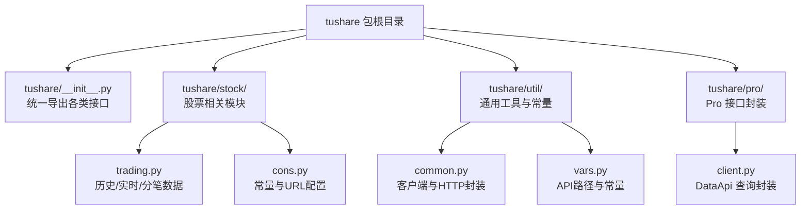
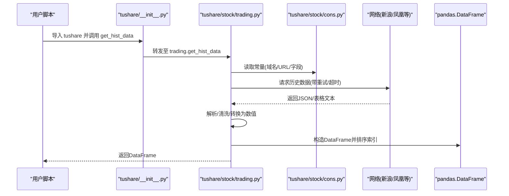
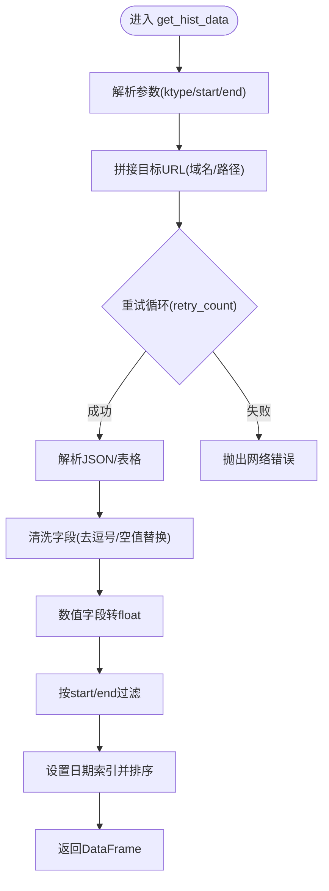
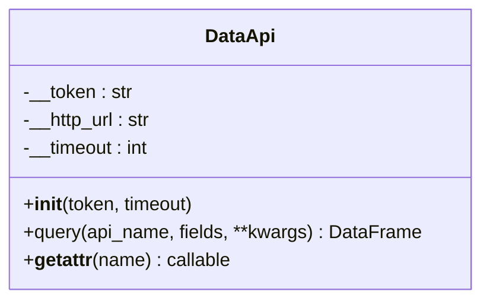
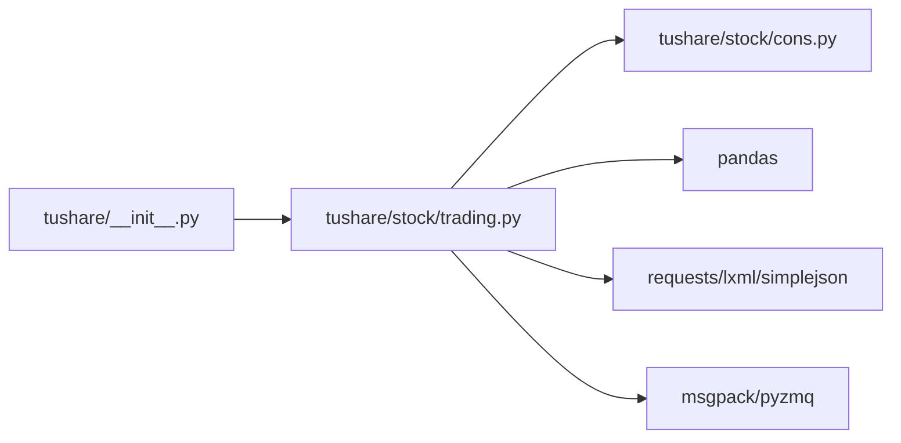

# 快速开始

<cite>
**本文引用的文件**
- [README.md](file://README.md)
- [setup.py](file://setup.py)
- [requirements.txt](file://requirements.txt)
- [tushare/__init__.py](file://tushare/__init__.py)
- [tushare/stock/trading.py](file://tushare/stock/trading.py)
- [tushare/stock/cons.py](file://tushare/stock/cons.py)
- [tushare/util/common.py](file://tushare/util/common.py)
- [tushare/util/vars.py](file://tushare/util/vars.py)
- [tushare/pro/client.py](file://tushare/pro/client.py)
- [test/trading_test.py](file://test/trading_test.py)
- [test/bar_test.py](file://test/bar_test.py)
- [test/billboard_test.py](file://test/billboard_test.py)
- [whats_new.md](file://whats_new.md)
</cite>

## 目录
1. [简介](#简介)
2. [项目结构](#项目结构)
3. [核心组件](#核心组件)
4. [架构总览](#架构总览)
5. [详细组件分析](#详细组件分析)
6. [依赖分析](#依赖分析)
7. [性能注意事项](#性能注意事项)
8. [故障排查指南](#故障排查指南)
9. [结论](#结论)
10. [附录](#附录)

## 简介
本指南面向首次接触 TuShare 的用户，帮助你在最短时间内完成安装、配置与基础使用，掌握获取股票历史数据、实时行情、分笔数据等核心能力，并提供一个可直接运行的完整工作示例，让你快速上手。

TuShare 是一个面向中国金融市场数据的实用工具，覆盖数据采集、清洗与存储，接口简洁、响应迅速，适合量化分析师与学习者进行数据获取与分析。

## 项目结构
TuShare 采用模块化组织，核心入口位于包级导出，按业务域划分子模块（如股票交易、宏观数据、指数、期货等），并通过统一的 __init__.py 将常用接口暴露给用户。

图表来源
- [tushare/__init__.py](file://tushare/__init__.py)
- [tushare/stock/trading.py](file://tushare/stock/trading.py)
- [tushare/stock/cons.py](file://tushare/stock/cons.py)
- [tushare/util/common.py](file://tushare/util/common.py)
- [tushare/util/vars.py](file://tushare/util/vars.py)
- [tushare/pro/client.py](file://tushare/pro/client.py)

章节来源
- [tushare/__init__.py](file://tushare/__init__.py)
- [README.md](file://README.md)

## 核心组件
- 统一入口与导出
  - 包级 __init__.py 将交易、基本面、宏观、分类、新闻、参考、Shibor、Pro 接口等集中导出，便于用户直接 import tushare 使用。
- 核心数据接口
  - 历史数据：get_hist_data、get_h_data（复权）
  - 实时行情：get_realtime_quotes
  - 分笔数据：get_tick_data
  - 日线/分钟线：bar、get_k_data
  - 当日汇总：get_today_all、get_day_all
- 常量与URL
  - trading.py 通过 cons.py 提供数据源域名、分页、字段、URL模板等常量，保证接口稳定与可维护。
- Pro 接口
  - pro_api、pro_bar 由 tushare.pro.client.DataApi 封装，支持基于 Token 的认证与查询。

章节来源
- [tushare/__init__.py](file://tushare/__init__.py)
- [tushare/stock/trading.py](file://tushare/stock/trading.py)
- [tushare/stock/cons.py](file://tushare/stock/cons.py)
- [tushare/pro/client.py](file://tushare/pro/client.py)

## 架构总览
下面以“获取历史行情”的典型流程为例，展示从用户调用到数据返回的关键步骤与模块交互。

图表来源
- [tushare/__init__.py](file://tushare/__init__.py)
- [tushare/stock/trading.py](file://tushare/stock/trading.py)
- [tushare/stock/cons.py](file://tushare/stock/cons.py)

## 详细组件分析

### 安装与升级
- 支持多种安装方式
  - pip 安装与升级
  - 源码安装
  - 访问 PyPI 下载安装
- 升级建议
  - 使用 pip --upgrade 保持版本更新

章节来源
- [README.md](file://README.md)
- [setup.py](file://setup.py)

### Python 环境与核心依赖
- Python 版本
  - 支持 Python 2.6/2.7/3.2/3.3/3.4/3.5 及后续版本
- 核心依赖
  - pandas、requests、lxml、simplejson、msgpack、pyzmq
  - 额外可选：beautifulsoup4、bs4（requirements.txt）

章节来源
- [setup.py](file://setup.py)
- [requirements.txt](file://requirements.txt)

### 基础配置
- 设置 Token（Pro 接口）
  - 使用 get_token/set_token 管理认证令牌
- 常用数据接口一览
  - 历史日线：get_hist_data、get_h_data（复权）
  - 实时行情：get_realtime_quotes
  - 分笔数据：get_tick_data
  - 日线/分钟线：bar、get_k_data
  - 当日汇总：get_today_all、get_day_all

章节来源
- [tushare/__init__.py](file://tushare/__init__.py)
- [tushare/util/upass.py](file://tushare/util/upass.py)

### 第一个完整工作示例（可直接运行）
以下示例展示了从导入库、获取数据、基础处理到简单分析的完整流程，你可以直接复制到脚本中运行：

- 步骤
  - 导入库：import tushare as ts
  - 获取历史数据：ts.get_hist_data('600848')
  - 获取复权数据：ts.get_h_data('002337', autype='hfq')
  - 获取当日行情：ts.get_today_all()
  - 获取分笔数据：ts.get_tick_data('600848', date='2014-01-09')
  - 获取实时行情：ts.get_realtime_quotes('000581')

- 输出说明
  - 历史/复权数据：返回包含日期索引与 OHLCV、均线、成交量均量、换手率等字段的 DataFrame
  - 当日行情：返回包含代码、名称、涨跌幅、现价、开盘价、最高价、最低价、成交量、换手率等字段的 DataFrame
  - 分笔数据：返回包含成交时间、成交价格、价格变动、成交手、成交金额、买卖类型等字段的 DataFrame
  - 实时行情：返回包含名称、开盘价、昨收、现价、最高、最低、买入价、卖出价、成交量、成交金额等字段的 DataFrame

- 示例参考
  - README 中的示例与输出格式可作为预期结果对照

章节来源
- [README.md](file://README.md)
- [tushare/stock/trading.py](file://tushare/stock/trading.py)

### 关键接口与实现要点

#### 历史/复权数据接口
- get_hist_data
  - 支持日线、周线、月线、分钟线（5/15/30/60）
  - 自动处理数值字段类型转换与缺失值
  - 支持起止日期过滤
- get_h_data
  - 前复权/后复权/不复权
  - 建议限定时间范围以提升性能

图表来源
- [tushare/stock/trading.py](file://tushare/stock/trading.py)
- [tushare/stock/cons.py](file://tushare/stock/cons.py)

章节来源
- [tushare/stock/trading.py](file://tushare/stock/trading.py)
- [tushare/stock/cons.py](file://tushare/stock/cons.py)

#### 实时行情接口
- get_realtime_quotes
  - 支持单只或多只股票批量获取
  - 字段丰富，包含买卖盘深度与时间戳

章节来源
- [tushare/stock/trading.py](file://tushare/stock/trading.py)

#### 分笔数据接口
- get_tick_data
  - 支持多数据源（新浪/腾讯/网易）
  - 返回逐笔成交明细

章节来源
- [tushare/stock/trading.py](file://tushare/stock/trading.py)

#### 日线/分钟线接口
- bar、get_k_data
  - 通用行情接口，支持股票/指数/期货/基金等
  - 支持复权行情

章节来源
- [tushare/stock/trading.py](file://tushare/stock/trading.py)

### Pro 接口（可选）
- DataApi
  - 基于 Token 的认证与查询
  - 统一返回 DataFrame，字段与数据项由接口定义

图表来源
- [tushare/pro/client.py](file://tushare/pro/client.py)

章节来源
- [tushare/pro/client.py](file://tushare/pro/client.py)

## 依赖分析
- 包级导出
  - tushare/__init__.py 将交易、基本面、宏观、分类、新闻、参考、Shibor、Pro、工具等接口集中导出，简化用户调用
- 运行时依赖
  - pandas：数据结构与处理
  - requests/lxml/simplejson：网络请求与解析
  - msgpack/pyzmq：高性能序列化与通信（部分场景）
- 常量与URL
  - trading.py 通过 cons.py 统一管理域名、分页、字段、URL 模板，降低耦合度

图表来源
- [tushare/__init__.py](file://tushare/__init__.py)
- [tushare/stock/trading.py](file://tushare/stock/trading.py)
- [tushare/stock/cons.py](file://tushare/stock/cons.py)
- [setup.py](file://setup.py)

章节来源
- [tushare/__init__.py](file://tushare/__init__.py)
- [setup.py](file://setup.py)

## 性能注意事项
- 合理设置时间范围
  - 历史/复权数据建议限定 start/end，避免一次性拉取过长时间导致性能下降
- 控制并发与频率
  - 批量获取实时行情时，注意不要超过接口建议的单次数量上限
- 使用缓存与本地存储
  - 获取到数据后及时保存为 CSV/Excel/JSON 或写入数据库，减少重复抓取

## 故障排查指南
- 网络错误
  - 现象：抛出网络错误提示
  - 处理：检查网络连接；适当增加重试次数与暂停间隔
- 数据为空
  - 现象：返回空 DataFrame
  - 处理：确认日期区间、代码是否正确；检查目标站点可用性
- 字段类型异常
  - 现象：数值字段显示为字符串
  - 处理：确认数据清洗逻辑已执行；必要时手动转换为数值类型
- Pro 接口认证失败
  - 现象：返回认证错误
  - 处理：检查 Token 是否有效；确认网络可达 API 地址

章节来源
- [tushare/stock/trading.py](file://tushare/stock/trading.py)
- [tushare/pro/client.py](file://tushare/pro/client.py)

## 结论
通过本快速开始指南，你已经完成了 TuShare 的安装与基础配置，掌握了历史数据、复权数据、实时行情、分笔数据与日线/分钟线等核心接口的使用方法，并具备了第一个完整工作示例的实践能力。建议在实际项目中结合缓存与本地存储策略，进一步提升数据获取与分析效率。

## 附录
- 学习路径建议
  - 第一步：安装与依赖准备
  - 第二步：导入库并尝试历史/实时/分笔接口
  - 第三步：保存数据到本地并进行基础统计
  - 第四步：探索 Pro 接口与更丰富的数据维度
- 变更与新特性
  - 可参考版本变更记录，了解新增接口与修复内容

章节来源
- [whats_new.md](file://whats_new.md)