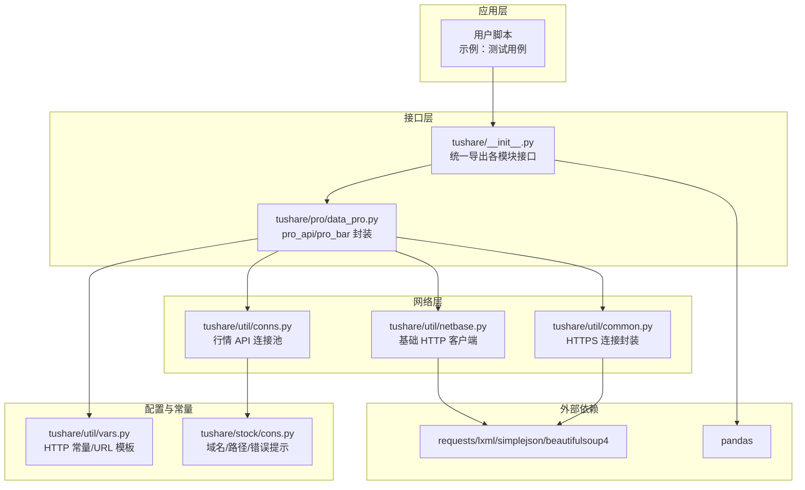
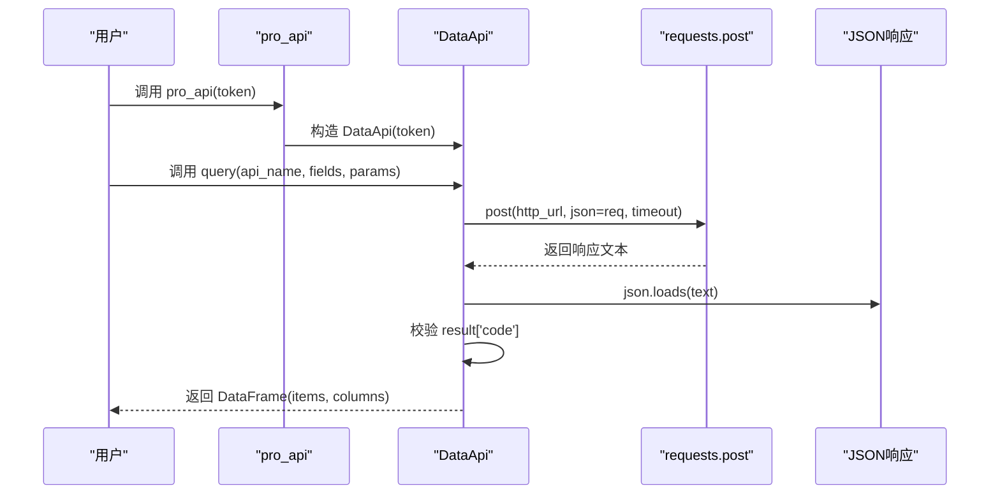
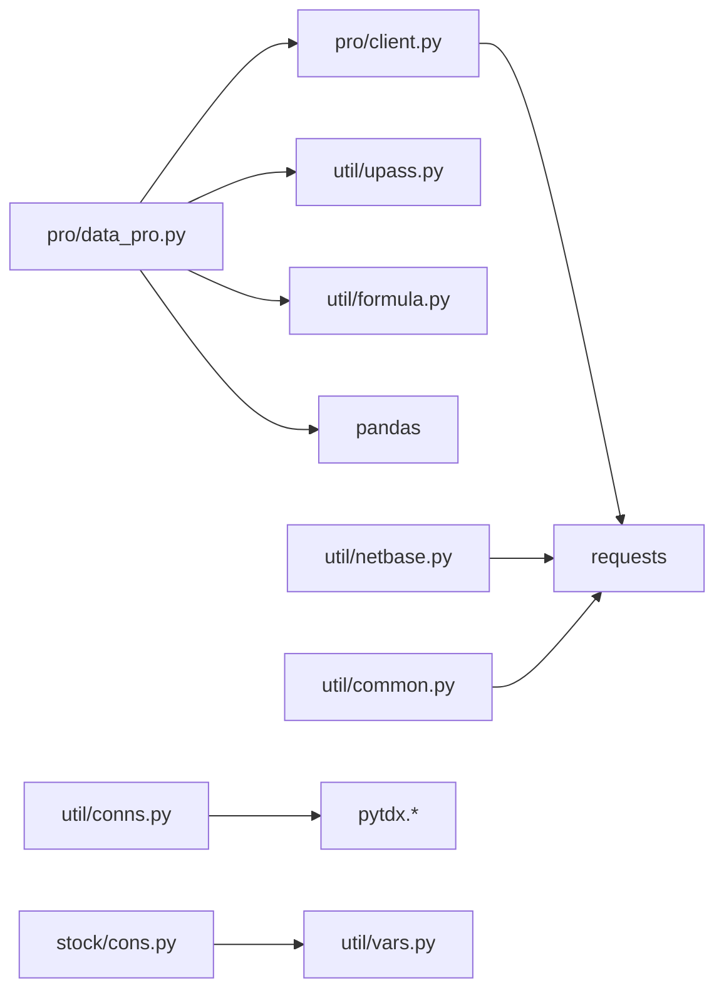
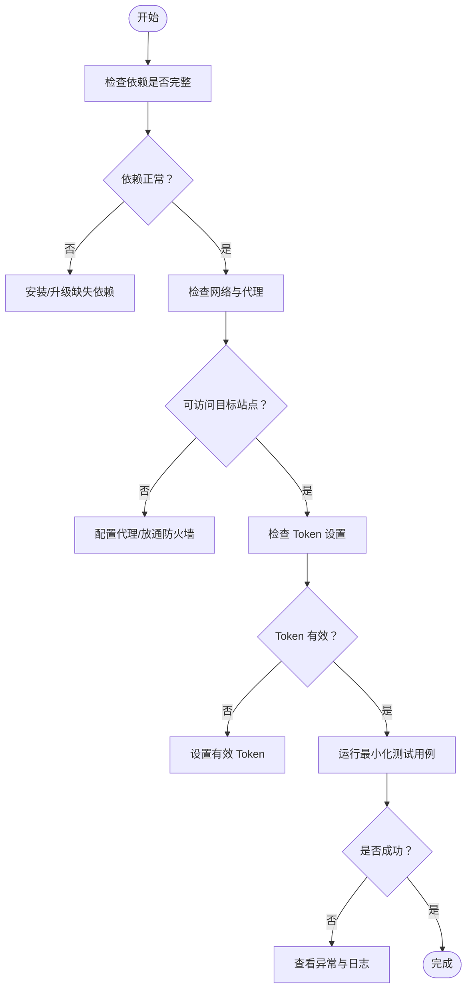

# 常见问题

<cite>
**本文引用的文件**
- [README.md](file://README.md)
- [requirements.txt](file://requirements.txt)
- [setup.py](file://setup.py)
- [tushare/__init__.py](file://tushare/__init__.py)
- [tushare/pro/client.py](file://tushare/pro/client.py)
- [tushare/pro/data_pro.py](file://tushare/pro/data_pro.py)
- [tushare/util/netbase.py](file://tushare/util/netbase.py)
- [tushare/util/common.py](file://tushare/util/common.py)
- [tushare/util/conns.py](file://tushare/util/conns.py)
- [tushare/util/vars.py](file://tushare/util/vars.py)
- [tushare/stock/cons.py](file://tushare/stock/cons.py)
- [test/trading_test.py](file://test/trading_test.py)
- [test/fund_test.py](file://test/fund_test.py)
</cite>

## 目录
1. [简介](#简介)
2. [项目结构](#项目结构)
3. [核心组件](#核心组件)
4. [架构总览](#架构总览)
5. [详细组件分析](#详细组件分析)
6. [依赖关系分析](#依赖关系分析)
7. [性能考量](#性能考量)
8. [故障排查指南](#故障排查指南)
9. [结论](#结论)
10. [附录](#附录)

## 简介
本常见问题解答面向使用 TuShare 的用户，聚焦于安装、网络连接、数据获取失败、数据格式等典型问题，提供症状、可能原因与解决步骤，并给出错误代码与异常信息的解读，帮助快速定位与解决问题。同时提供预防性建议与最佳实践，降低问题发生概率。

## 项目结构
TuShare 采用模块化组织方式，围绕“数据采集—清洗加工—数据存储”的流程，提供股票、期货、基金、宏观、指数、新闻等多类数据接口；Pro 版通过 Token 认证访问官方数据接口；底层网络访问由 requests、lxml、beautifulsoup 等库支撑。

图表来源
- [tushare/__init__.py](file://tushare/__init__.py)
- [tushare/pro/data_pro.py](file://tushare/pro/data_pro.py)
- [tushare/util/netbase.py](file://tushare/util/netbase.py)
- [tushare/util/common.py](file://tushare/util/common.py)
- [tushare/util/conns.py](file://tushare/util/conns.py)
- [tushare/util/vars.py](file://tushare/util/vars.py)
- [tushare/stock/cons.py](file://tushare/stock/cons.py)

章节来源
- [README.md](file://README.md)
- [requirements.txt](file://requirements.txt)
- [setup.py](file://setup.py)
- [tushare/__init__.py](file://tushare/__init__.py)

## 核心组件
- 统一入口与导出：通过模块入口集中导出各类数据接口，便于用户按需导入与使用。
- Pro 接口封装：提供 pro_api 与 pro_bar，负责 Token 校验、请求发送、结果解析与复权处理。
- 网络访问层：基于 requests 的 HTTP 客户端封装，支持超时控制与 JSON 解析。
- 行情连接管理：通过 pytdx 提供的 TdxHq_API/TdxExHq_API 连接行情服务器，具备重试机制与错误提示。
- 错误与常量：集中定义 HTTP 状态码、URL 模板、错误提示信息，便于统一处理与排查。

章节来源
- [tushare/__init__.py](file://tushare/__init__.py)
- [tushare/pro/data_pro.py](file://tushare/pro/data_pro.py)
- [tushare/pro/client.py](file://tushare/pro/client.py)
- [tushare/util/netbase.py](file://tushare/util/netbase.py)
- [tushare/util/common.py](file://tushare/util/common.py)
- [tushare/util/conns.py](file://tushare/util/conns.py)
- [tushare/util/vars.py](file://tushare/util/vars.py)
- [tushare/stock/cons.py](file://tushare/stock/cons.py)

## 架构总览
下图展示 Pro 数据接口从初始化到请求发送、结果解析的关键流程。

图表来源
- [tushare/pro/data_pro.py](file://tushare/pro/data_pro.py)
- [tushare/pro/client.py](file://tushare/pro/client.py)

## 详细组件分析

### 安装与依赖问题
- 症状
  - 安装失败、依赖缺失、版本冲突导致运行时报错。
- 可能原因
  - 缺少 pandas、requests、lxml、simplejson、beautifulsoup4 等核心依赖。
  - Python 版本不兼容或依赖版本过低。
- 解决步骤
  - 使用 pip 安装：确保 pip 已升级至最新版本，再执行安装命令。
  - 指定依赖版本：根据 requirements.txt 或 setup.py 中的版本要求安装。
  - 清理缓存：若仍失败，清理 pip 缓存后重试。
- 预防建议
  - 在虚拟环境中安装，避免全局依赖污染。
  - 使用与项目兼容的 Python 版本。
  - 定期升级依赖，保持版本一致性。

章节来源
- [README.md](file://README.md)
- [requirements.txt](file://requirements.txt)
- [setup.py](file://setup.py)

### 网络连接问题（防火墙/代理）
- 症状
  - 请求超时、无法连接、返回非 200 状态码。
- 可能原因
  - 本地网络策略限制访问目标域名。
  - 未配置代理或代理不可用。
- 解决步骤
  - 检查网络连通性，尝试访问目标站点。
  - 若使用代理，确保 requests 能正确读取系统代理配置。
  - 对于 Pro 接口，确认请求地址与超时设置合理。
- 预防建议
  - 在开发环境预先验证网络策略与代理配置。
  - 为网络请求设置合理的超时与重试策略。

章节来源
- [tushare/pro/client.py](file://tushare/pro/client.py)
- [tushare/util/netbase.py](file://tushare/util/netbase.py)
- [tushare/util/common.py](file://tushare/util/common.py)

### 数据获取失败（API 限制/Token 过期）
- 症状
  - 抛出异常，提示初始化失败或返回错误信息。
- 可能原因
  - 未设置有效 Token 或 Token 已过期。
  - 接口返回非成功状态码，抛出异常。
- 解决步骤
  - 使用 set_token 设置有效凭证，或在 pro_api 中传入 token。
  - 检查接口返回的错误信息，确认参数与权限。
  - 对于网络不稳定场景，适当增加重试次数。
- 预防建议
  - 在脚本启动时显式设置 Token 并进行有效性校验。
  - 对关键接口调用添加异常捕获与重试逻辑。

章节来源
- [tushare/pro/data_pro.py](file://tushare/pro/data_pro.py)
- [tushare/pro/client.py](file://tushare/pro/client.py)
- [tushare/util/vars.py](file://tushare/util/vars.py)
- [tushare/stock/cons.py](file://tushare/stock/cons.py)

### 数据格式问题（编码/日期格式）
- 症状
  - 读取 CSV 出现乱码、日期列解析异常、数值列类型不符。
- 可能原因
  - 文件编码与读取编码不一致。
  - 日期字段格式与预期不符。
- 解决步骤
  - 明确数据源编码，使用正确编码读取文件。
  - 对日期列进行显式转换，确保格式统一。
  - 对数值列进行类型转换，保证后续计算精度。
- 预防建议
  - 在数据入库前统一做清洗与类型转换。
  - 使用 pandas 的 dtype 参数与 parse_dates 参数明确数据类型。

章节来源
- [tushare/util/common.py](file://tushare/util/common.py)
- [tushare/util/vars.py](file://tushare/util/vars.py)

### 行情连接失败（重试/错误提示）
- 症状
  - 连接行情服务器失败，提示网络错误。
- 可能原因
  - 服务器 IP 不可用或端口受限。
  - 连接未建立即抛出异常。
- 解决步骤
  - 使用内置重试机制，多次尝试连接。
  - 检查服务器地址与端口配置是否正确。
  - 确认本地网络策略允许访问对应端口。
- 预防建议
  - 在生产环境配置备用服务器地址。
  - 对连接失败进行日志记录与告警。

章节来源
- [tushare/util/conns.py](file://tushare/util/conns.py)
- [tushare/stock/cons.py](file://tushare/stock/cons.py)

## 依赖关系分析
- 外部依赖
  - pandas：数据结构与处理。
  - requests：HTTP 请求。
  - lxml/simplejson/beautifulsoup4：解析 HTML/JSON。
  - msgpack/pyzmq：安装依赖（setup.py）。
- 内部依赖
  - pro/data_pro 依赖 util/upass（Token 管理）、util/formula（技术指标）。
  - util/netbase/common/conns 依赖 requests、pytdx。
  - stock/cons 与 util/vars 提供常量与 URL 模板。

图表来源
- [tushare/pro/data_pro.py](file://tushare/pro/data_pro.py)
- [tushare/pro/client.py](file://tushare/pro/client.py)
- [tushare/util/netbase.py](file://tushare/util/netbase.py)
- [tushare/util/common.py](file://tushare/util/common.py)
- [tushare/util/conns.py](file://tushare/util/conns.py)
- [tushare/util/vars.py](file://tushare/util/vars.py)
- [tushare/stock/cons.py](file://tushare/stock/cons.py)

章节来源
- [requirements.txt](file://requirements.txt)
- [setup.py](file://setup.py)
- [tushare/pro/data_pro.py](file://tushare/pro/data_pro.py)
- [tushare/pro/client.py](file://tushare/pro/client.py)
- [tushare/util/netbase.py](file://tushare/util/netbase.py)
- [tushare/util/common.py](file://tushare/util/common.py)
- [tushare/util/conns.py](file://tushare/util/conns.py)
- [tushare/util/vars.py](file://tushare/util/vars.py)
- [tushare/stock/cons.py](file://tushare/stock/cons.py)

## 性能考量
- 网络请求
  - 合理设置超时与重试次数，避免长时间阻塞。
  - 批量请求时注意并发与限流，防止被目标服务拒绝。
- 数据处理
  - 使用 pandas 的向量化操作，避免逐行迭代。
  - 对日期与数值列进行类型优化，减少内存占用。
- 连接管理
  - 行情连接应复用而非频繁创建销毁，降低握手开销。

## 故障排查指南

### 错误代码与异常信息对照
- HTTP 状态码
  - 200：请求成功（正常返回）。
  - 401：未授权/鉴权失败（Token 无效或过期）。
- 自定义错误
  - pro_api 初始化失败：检查 Token 是否设置且有效。
  - 网络连接失败：检查网络、代理与服务器地址。
  - 行情连接失败：检查服务器 IP、端口与本地网络策略。

章节来源
- [tushare/util/vars.py](file://tushare/util/vars.py)
- [tushare/stock/cons.py](file://tushare/stock/cons.py)
- [tushare/pro/client.py](file://tushare/pro/client.py)

### 常见异常与处理
- Token 未设置或无效
  - 症状：初始化 pro_api 抛出异常。
  - 处理：使用 set_token 设置有效凭证，或在 pro_api 中传入 token。
- 网络超时/连接失败
  - 症状：请求抛出异常或返回非 200。
  - 处理：检查网络与代理，调整超时与重试策略。
- 行情连接失败
  - 症状：连接服务器报错。
  - 处理：使用重试机制与备用服务器地址。

章节来源
- [tushare/pro/data_pro.py](file://tushare/pro/data_pro.py)
- [tushare/util/conns.py](file://tushare/util/conns.py)
- [tushare/stock/cons.py](file://tushare/stock/cons.py)

### 快速诊断流程

## 结论
通过明确安装依赖、网络配置、Token 管理与数据格式处理等关键环节，可显著降低使用 TuShare 时的常见问题。建议在开发与生产环境中遵循本文提供的最佳实践，结合重试与日志机制，提升稳定性与可维护性。

## 附录

### 示例用例参考
- 测试用例展示了如何调用历史行情、实时行情、复权数据等接口，便于快速验证环境与接口可用性。

章节来源
- [test/trading_test.py](file://test/trading_test.py)
- [test/fund_test.py](file://test/fund_test.py)