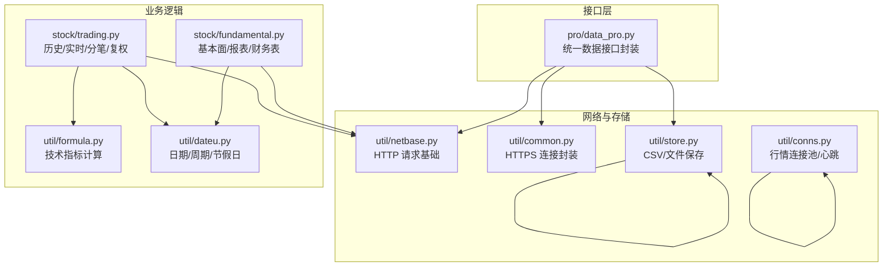
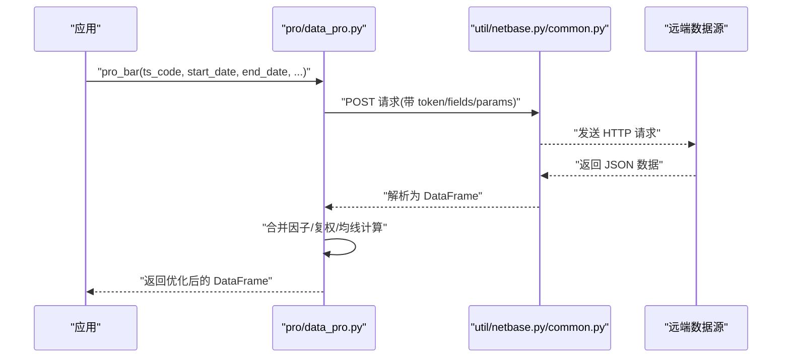
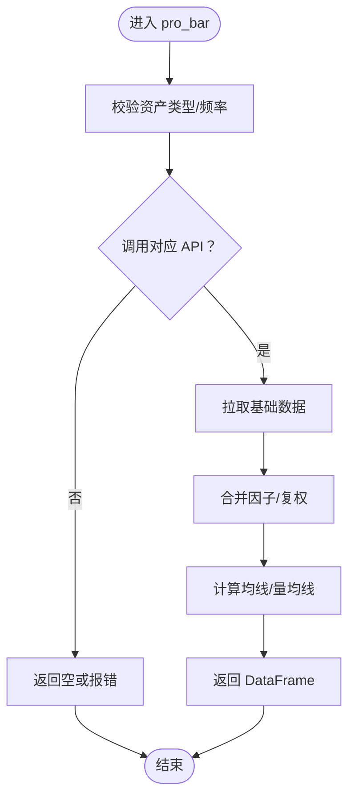
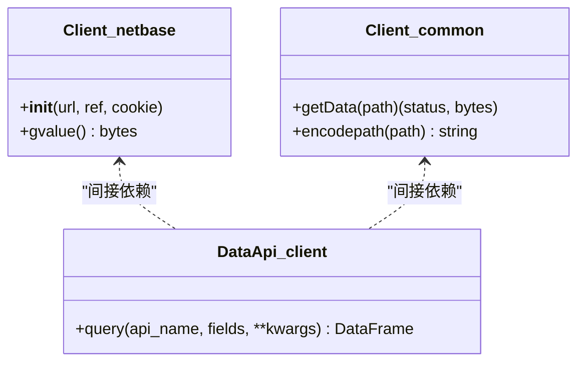
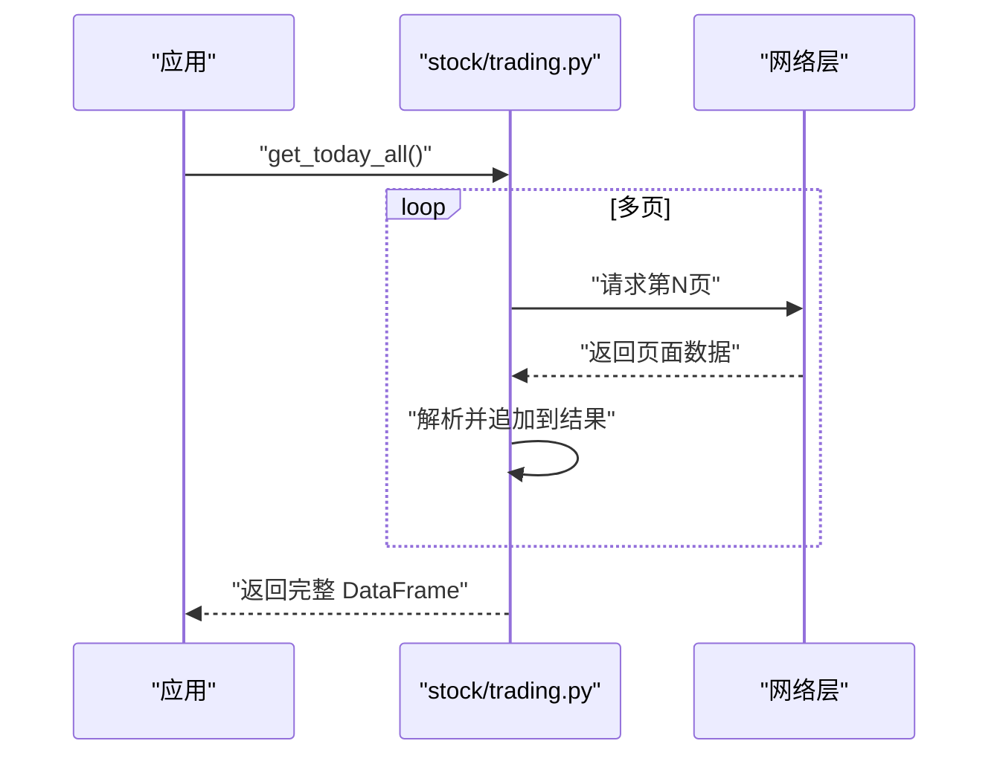
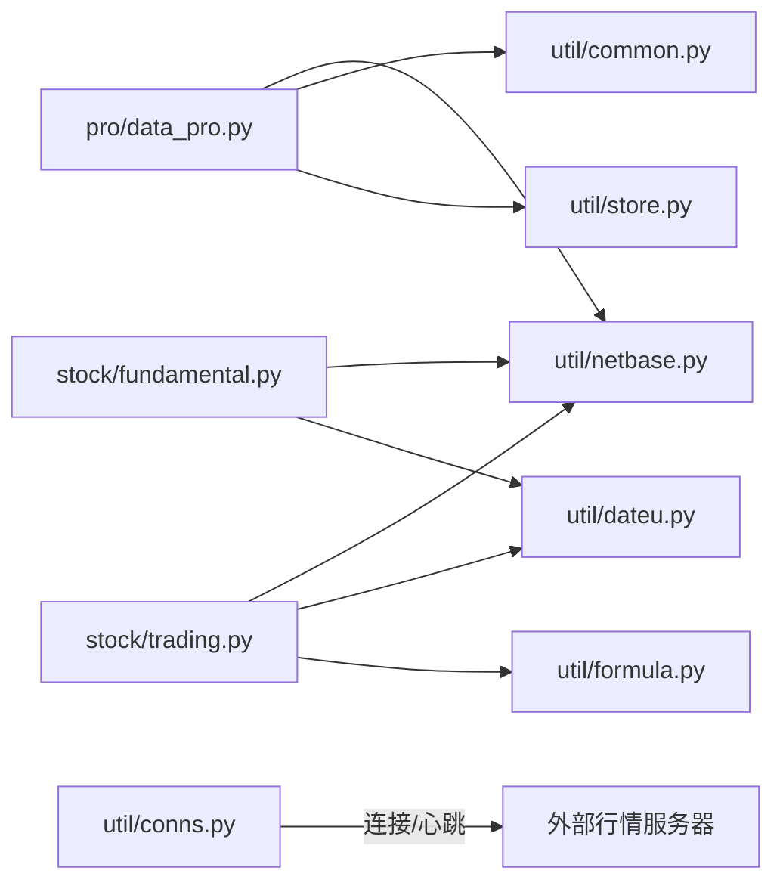

# 性能优化

<cite>
**本文引用的文件**
- [README.md](file://README.md)
- [client.py](file://tushare/pro/client.py)
- [data_pro.py](file://tushare/pro/data_pro.py)
- [netbase.py](file://tushare/util/netbase.py)
- [conns.py](file://tushare/util/conns.py)
- [store.py](file://tushare/util/store.py)
- [common.py](file://tushare/util/common.py)
- [trading.py](file://tushare/stock/trading.py)
- [fundamental.py](file://tushare/stock/fundamental.py)
- [dateu.py](file://tushare/util/dateu.py)
- [formula.py](file://tushare/util/formula.py)
</cite>

## 目录
1. [简介](#简介)
2. [项目结构](#项目结构)
3. [核心组件](#核心组件)
4. [架构总览](#架构总览)
5. [详细组件分析](#详细组件分析)
6. [依赖分析](#依赖分析)
7. [性能考量](#性能考量)
8. [故障排查指南](#故障排查指南)
9. [结论](#结论)
10. [附录](#附录)

## 简介
本指南面向使用 TuShare 的用户与开发者，聚焦于数据获取、内存使用、网络连接与存储层面的性能优化策略，并结合仓库现有实现给出可操作的建议与流程图示。内容涵盖：
- 数据获取优化：批量请求、并发控制、重试与超时策略
- 内存优化：分块处理、及时释放、避免泄漏
- 网络优化：连接复用、超时与重试配置
- 存储优化：CSV/文件 I/O、路径与目录管理
- 性能监控与指标：如何评估与持续改进
- 实战案例：基于仓库接口的优化前后对比思路

## 项目结构
TuShare 采用按功能域划分的模块化组织方式，核心数据获取与处理分布在 stock、pro、util 等子包中，接口层通过 pro/data_pro.py 提供统一入口，底层网络与存储分别由 util 下的模块负责。

图表来源
- [data_pro.py:1-158](file://tushare/pro/data_pro.py#L1-L158)
- [netbase.py:1-29](file://tushare/util/netbase.py#L1-L29)
- [common.py:1-86](file://tushare/util/common.py#L1-L86)
- [store.py:1-44](file://tushare/util/store.py#L1-L44)
- [conns.py:1-61](file://tushare/util/conns.py#L1-L61)
- [trading.py:1-800](file://tushare/stock/trading.py#L1-L800)
- [fundamental.py:1-520](file://tushare/stock/fundamental.py#L1-L520)
- [formula.py:1-262](file://tushare/util/formula.py#L1-L262)
- [dateu.py:1-129](file://tushare/util/dateu.py#L1-L129)

章节来源
- [README.md:1-411](file://README.md#L1-L411)
- [data_pro.py:1-158](file://tushare/pro/data_pro.py#L1-L158)

## 核心组件
- 接口封装层：pro/data_pro.py 提供统一的 pro_bar 等接口，内部根据资产类型与频率选择对应 API，并支持复权、均线、因子等扩展字段的拼接与计算。
- 网络访问层：util/netbase.py 与 util/common.py 分别提供 HTTP/HTTPS 请求基础与连接封装；stock/trading.py 与 stock/fundamental.py 使用 urllib/requests 进行数据抓取。
- 存储层：util/store.py 提供 CSV 文件保存能力；文件路径与目录不存在时自动创建。
- 连接池与心跳：util/conns.py 通过 pytdx 提供行情连接池与心跳检测，降低频繁连接成本。
- 计算与日期：util/formula.py 提供多种技术指标计算；util/dateu.py 提供日期与周期辅助。

章节来源
- [data_pro.py:21-140](file://tushare/pro/data_pro.py#L21-L140)
- [netbase.py:9-28](file://tushare/util/netbase.py#L9-L28)
- [common.py:18-85](file://tushare/util/common.py#L18-L85)
- [store.py:14-44](file://tushare/util/store.py#L14-L44)
- [conns.py:14-61](file://tushare/util/conns.py#L14-L61)
- [formula.py:8-262](file://tushare/util/formula.py#L8-L262)
- [dateu.py:8-129](file://tushare/util/dateu.py#L8-L129)

## 架构总览
下面以 pro_bar 为例展示典型数据流：应用调用 -> 接口封装 -> 网络请求 -> 数据解析 -> 指标计算/复权 -> 返回 DataFrame。

图表来源
- [data_pro.py:34-140](file://tushare/pro/data_pro.py#L34-L140)
- [client.py:32-48](file://tushare/pro/client.py#L32-L48)
- [netbase.py:26-28](file://tushare/util/netbase.py#L26-L28)
- [common.py:68-85](file://tushare/util/common.py#L68-L85)

## 详细组件分析

### 组件A：Pro 数据接口封装（data_pro.py）
- 功能要点
  - 统一初始化 token 与 API 对象
  - 根据资产类型与频率选择对应接口（日线/周线/月线/数字货币）
  - 支持复权因子合并、换手率/量比等因子拼接、均线计算
  - 内置重试机制与异常处理
- 性能相关
  - 通过参数化字段与频率减少冗余数据传输
  - 在 Python 层进行合并与计算，避免多次网络往返
  - 复权与均线计算使用 pandas/numpy 向量化操作，提高吞吐

图表来源
- [data_pro.py:34-140](file://tushare/pro/data_pro.py#L34-L140)

章节来源
- [data_pro.py:21-140](file://tushare/pro/data_pro.py#L21-L140)

### 组件B：网络请求与重试（netbase.py、common.py、client.py）
- 关键点
  - 设置 keep-alive、User-Agent、Cookie 等头部，提升稳定性
  - 统一 timeout 控制，避免阻塞
  - requests/urllib 两种方式并存，注意超时与异常捕获
- 优化建议
  - 在高频场景下引入连接池（如 HTTPAdapter），减少 TCP/TLS 建链开销
  - 将重试次数与退避策略参数化，避免雪崩效应
  - 对于批量请求，尽量合并为单次请求或使用服务端支持的批量接口

图表来源
- [netbase.py:9-28](file://tushare/util/netbase.py#L9-L28)
- [common.py:18-85](file://tushare/util/common.py#L18-L85)
- [client.py:17-52](file://tushare/pro/client.py#L17-L52)

章节来源
- [netbase.py:9-28](file://tushare/util/netbase.py#L9-L28)
- [common.py:18-85](file://tushare/util/common.py#L18-L85)
- [client.py:17-52](file://tushare/pro/client.py#L17-L52)

### 组件C：批量数据获取与分页（trading.py）
- 关键点
  - get_hist_data/get_k_data 支持批量历史数据获取
  - get_today_all 通过多页解析聚合数据
  - 复权数据按季度分段抓取，避免单次数据过大
- 性能相关
  - 使用 pause 参数控制请求间隔，缓解服务端压力
  - 复权因子与历史行情分段抓取，降低内存峰值
  - 对于大批量数据，建议分批写入磁盘或数据库，避免长时间持有大 DataFrame

图表来源
- [trading.py:305-321](file://tushare/stock/trading.py#L305-L321)

章节来源
- [trading.py:305-321](file://tushare/stock/trading.py#L305-L321)
- [trading.py:397-510](file://tushare/stock/trading.py#L397-L510)

### 组件D：存储与文件 I/O（store.py）
- 关键点
  - 保存为 CSV，自动创建目录
  - 输入校验与错误提示
- 性能相关
  - 大文件建议分块写入，避免一次性写入导致内存抖动
  - 指定合适的编码与分隔符，减少 I/O 字节开销
  - 对于高频写入，考虑异步写入或队列缓冲

章节来源
- [store.py:14-44](file://tushare/util/store.py#L14-L44)

### 组件E：连接池与心跳（conns.py）
- 关键点
  - 通过 pytdx 建立行情连接，启用 heartbeat
  - 多连接复用，降低建链成本
- 性能相关
  - 合理设置 retry_count，避免瞬时失败导致重试风暴
  - 使用连接池时注意资源释放，避免句柄泄露

章节来源
- [conns.py:14-61](file://tushare/util/conns.py#L14-L61)

### 组件F：技术指标与计算（formula.py）
- 关键点
  - 提供 MA、EMA、ATR、RSI 等常用指标
  - 基于 pandas/numpy 向量化，适合大规模时间序列
- 性能相关
  - 指标计算尽量在单个 DataFrame 上完成，减少中间对象
  - 对于长序列，优先使用 rolling/ewm 等原生方法，避免显式循环

章节来源
- [formula.py:8-262](file://tushare/util/formula.py#L8-L262)

## 依赖分析
- 接口层依赖网络与存储模块，形成清晰的职责边界
- 业务层（trading/fundamental）依赖日期与公式模块，支撑数据清洗与计算
- 连接池模块独立于业务层，便于在高频场景下复用

图表来源
- [data_pro.py:1-158](file://tushare/pro/data_pro.py#L1-L158)
- [trading.py:1-800](file://tushare/stock/trading.py#L1-L800)
- [fundamental.py:1-520](file://tushare/stock/fundamental.py#L1-L520)
- [netbase.py:1-29](file://tushare/util/netbase.py#L1-L29)
- [common.py:1-86](file://tushare/util/common.py#L1-L86)
- [store.py:1-44](file://tushare/util/store.py#L1-L44)
- [dateu.py:1-129](file://tushare/util/dateu.py#L1-L129)
- [formula.py:1-262](file://tushare/util/formula.py#L1-L262)
- [conns.py:1-61](file://tushare/util/conns.py#L1-L61)

章节来源
- [data_pro.py:1-158](file://tushare/pro/data_pro.py#L1-L158)
- [trading.py:1-800](file://tushare/stock/trading.py#L1-L800)
- [fundamental.py:1-520](file://tushare/stock/fundamental.py#L1-L520)

## 性能考量

### 数据获取优化
- 批量请求
  - 使用 pro_bar 的字段与频率参数，仅拉取所需列与周期，减少带宽与解析成本
  - 对于历史数据，按季度或年份分段拉取，避免单次超大数据集
- 并发控制
  - 在业务层（如 get_hist_data）通过 pause 控制请求间隔，避免触发限流
  - 对于多标的场景，建议使用连接池与合理的并发度，避免服务端过载
- 重试与超时
  - 统一设置 timeout，避免长时间阻塞
  - 将 retry_count 参数化，结合退避策略，避免雪崩

章节来源
- [data_pro.py:34-140](file://tushare/pro/data_pro.py#L34-L140)
- [trading.py:32-100](file://tushare/stock/trading.py#L32-L100)
- [client.py:22-48](file://tushare/pro/client.py#L22-L48)

### 内存使用优化
- 分块处理
  - 对于大批量 CSV 或网页表格，采用分页/分块读取，逐步拼接
  - 在 pandas 中使用 chunksize 或迭代器，避免一次性加载
- 及时释放
  - 大对象使用完成后及时 del，必要时调用垃圾回收
  - 对于只读数据，尽量保持不可变视图，减少复制
- 防范泄漏
  - 确保连接与文件句柄在 finally/with 块中释放
  - 对外部连接（如 HTTPSConnection）确保 close

章节来源
- [trading.py:305-321](file://tushare/stock/trading.py#L305-L321)
- [common.py:25-27](file://tushare/util/common.py#L25-L27)
- [store.py:14-44](file://tushare/util/store.py#L14-L44)

### 网络连接优化
- 连接池
  - 在 requests 中使用 HTTPAdapter + PoolManager，复用连接
  - 对于高频行情，结合 conns.py 的心跳机制，维持稳定连接
- 超时与重试
  - 将 timeout 与 retry_count 明确配置，避免全局默认值带来的不确定性
- 重试策略
  - 指数退避 + 抖动，避免同时重试放大网络压力

章节来源
- [conns.py:14-61](file://tushare/util/conns.py#L14-L61)
- [client.py:22-48](file://tushare/pro/client.py#L22-L48)
- [netbase.py:16-28](file://tushare/util/netbase.py#L16-L28)

### 存储性能优化
- CSV 文件处理
  - 指定 dtype 与列名，减少解析成本
  - 分块写入，避免大对象驻留内存
- 文件 I/O
  - 使用缓冲与合适的编码（UTF-8/GBK 已在代码中体现），减少 I/O 次数
- 目录管理
  - 自动创建目录，避免因路径缺失导致的异常与重试

章节来源
- [store.py:24-44](file://tushare/util/store.py#L24-L44)
- [fundamental.py:48-59](file://tushare/stock/fundamental.py#L48-L59)

### 性能监控与指标
- 指标建议
  - 响应时间（p50/p95）、错误率、重试次数、连接池命中率
  - 内存占用峰值、GC 次数与耗时
  - I/O 吞吐（字节数/秒）、文件写入延迟
- 工具建议
  - 使用 cProfile/Py-Spy 进行 CPU 分析
  - 使用 memory_profiler 观察内存曲线
  - 使用 pytest-benchmark 或自定义计时器测量关键路径

（本节为通用指导，无需特定文件引用）

### 实战案例与对比思路
- 案例目标：获取某股票多周期数据并计算均线，对比优化前后的吞吐与延迟
- 优化前
  - 单线程逐周期请求，逐个拼接 DataFrame
  - 不设置超时与重试，遇到网络波动直接失败
  - 直接写入 CSV，未做分块
- 优化后
  - 使用 pro_bar 的字段与频率参数，减少数据体积
  - 设置合理 timeout 与 retry_count，指数退避
  - 分块写入 CSV，及时释放中间对象
  - 使用连接池与请求间隔控制，避免触发限流
- 对比维度
  - 总耗时、平均响应时间、失败率、内存峰值、CPU 占用

（本节为通用指导，无需特定文件引用）

## 故障排查指南
- 网络异常
  - 检查 timeout 与 retry_count 设置是否合理
  - 观察是否存在频繁重试导致的雪崩
- 数据为空
  - 核对日期范围与资产类型，确认服务端返回结构
  - 对于分页场景，检查最后一页判断逻辑
- 内存不足
  - 分块处理与及时释放，避免长时间持有大对象
  - 关注 pandas 的副本与视图行为，减少不必要的复制
- 连接问题
  - 确认 keep-alive 与 User-Agent 设置
  - 对外部连接确保 close，避免句柄泄漏

章节来源
- [trading.py:67-100](file://tushare/stock/trading.py#L67-L100)
- [trading.py:135-187](file://tushare/stock/trading.py#L135-L187)
- [common.py:25-27](file://tushare/util/common.py#L25-L27)
- [netbase.py:16-28](file://tushare/util/netbase.py#L16-L28)

## 结论
通过对接口封装、网络请求、存储与计算模块的系统性优化，可在保证稳定性的同时显著提升数据获取效率与系统整体性能。建议在生产环境中：
- 明确超时与重试策略，结合指数退避
- 使用连接池与请求间隔控制，避免服务端限流
- 采用分块处理与及时释放，降低内存峰值
- 建立完善的监控指标，持续评估与改进

（本节为总结，无需特定文件引用）

## 附录
- 快速定位文件
  - 接口封装：[data_pro.py:21-140](file://tushare/pro/data_pro.py#L21-L140)
  - 网络请求：[netbase.py:9-28](file://tushare/util/netbase.py#L9-L28)、[common.py:18-85](file://tushare/util/common.py#L18-L85)、[client.py:17-52](file://tushare/pro/client.py#L17-L52)
  - 批量获取：[trading.py:305-321](file://tushare/stock/trading.py#L305-L321)
  - 存储：[store.py:14-44](file://tushare/util/store.py#L14-L44)
  - 连接池：[conns.py:14-61](file://tushare/util/conns.py#L14-L61)
  - 计算：[formula.py:8-262](file://tushare/util/formula.py#L8-L262)
  - 日期：[dateu.py:8-129](file://tushare/util/dateu.py#L8-L129)

（本节为索引，无需特定文件引用）