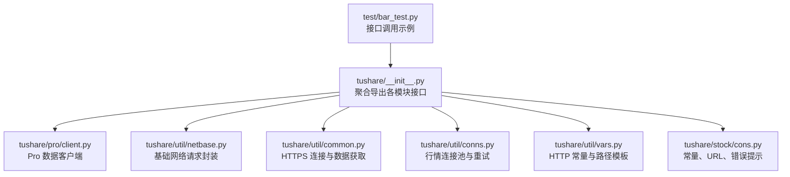
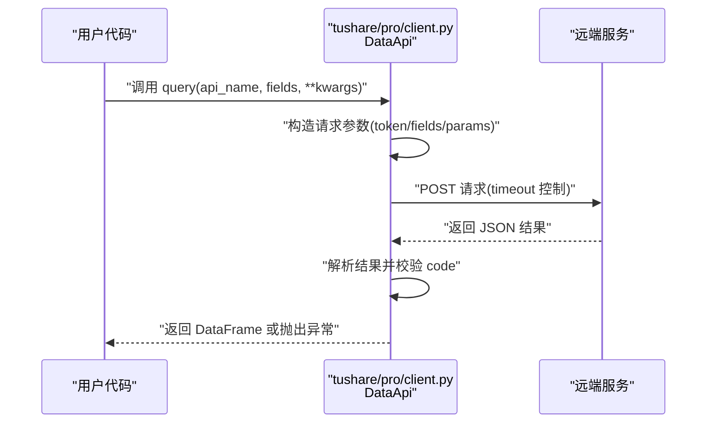
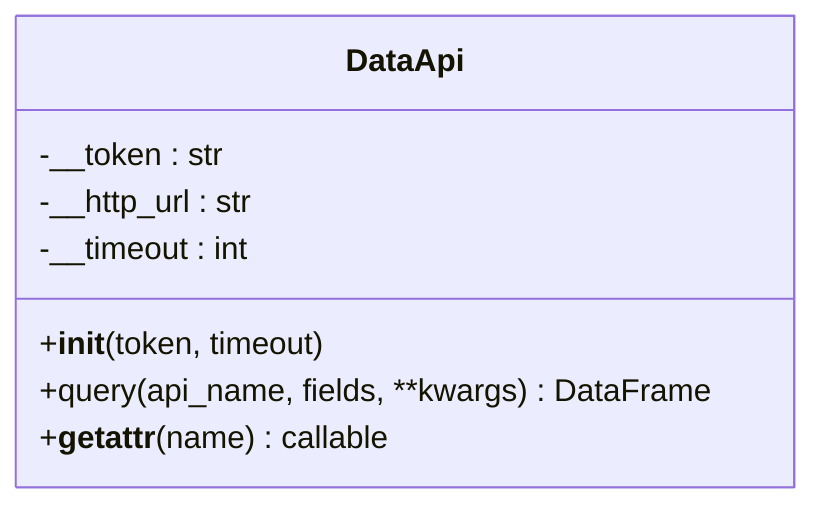
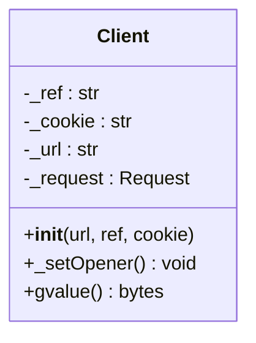
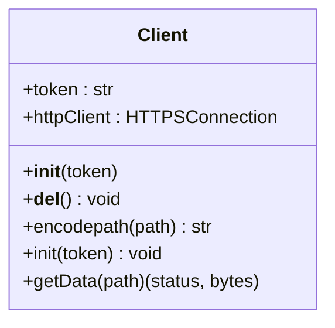
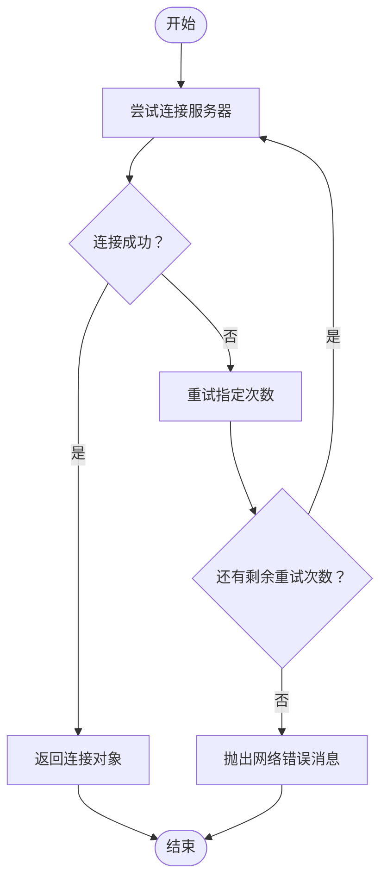
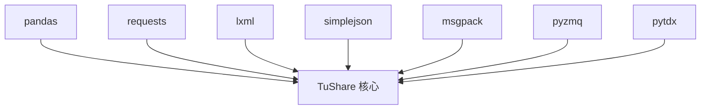

# 故障排除

<cite>
**本文引用的文件**
- [README.md](file://README.md)
- [setup.py](file://setup.py)
- [requirements.txt](file://requirements.txt)
- [tushare/__init__.py](file://tushare/__init__.py)
- [tushare/pro/client.py](file://tushare/pro/client.py)
- [tushare/util/netbase.py](file://tushare/util/netbase.py)
- [tushare/util/common.py](file://tushare/util/common.py)
- [tushare/util/conns.py](file://tushare/util/conns.py)
- [tushare/util/vars.py](file://tushare/util/vars.py)
- [tushare/stock/cons.py](file://tushare/stock/cons.py)
- [test/bar_test.py](file://test/bar_test.py)
</cite>

## 目录
1. [简介](#简介)
2. [项目结构](#项目结构)
3. [核心组件](#核心组件)
4. [架构总览](#架构总览)
5. [详细组件分析](#详细组件分析)
6. [依赖分析](#依赖分析)
7. [性能考虑](#性能考虑)
8. [故障排除指南](#故障排除指南)
9. [结论](#结论)
10. [附录](#附录)

## 简介
本指南面向使用 TuShare 的用户，聚焦于常见问题的诊断与解决，涵盖安装问题、网络连接异常、数据获取失败、错误码与异常信息解读、调试技巧（日志、抓包、性能分析）、性能优化建议以及社区支持渠道。内容基于仓库中的实际实现与文档进行整理，帮助用户快速定位并解决问题。

## 项目结构
TuShare 采用按功能域分层的组织方式：顶层入口导出各类数据接口；pro 子模块提供 Pro 数据接口；util 子模块封装网络与连接管理；stock 子模块定义常量与错误提示；test 目录包含单元测试样例。

图表来源
- [tushare/__init__.py](file://tushare/__init__.py)
- [tushare/pro/client.py](file://tushare/pro/client.py)
- [tushare/util/netbase.py](file://tushare/util/netbase.py)
- [tushare/util/common.py](file://tushare/util/common.py)
- [tushare/util/conns.py](file://tushare/util/conns.py)
- [tushare/util/vars.py](file://tushare/util/vars.py)
- [tushare/stock/cons.py](file://tushare/stock/cons.py)
- [test/bar_test.py](file://test/bar_test.py)

章节来源
- [README.md](file://README.md)
- [tushare/__init__.py](file://tushare/__init__.py)

## 核心组件
- 入口聚合导出：顶层模块集中导出股票、宏观、分类、新闻、参考、Shibor、Pro 接口、期货、基金、互联网、交易器等模块接口，便于统一导入使用。
- Pro 数据接口：提供基于 Token 的认证与请求封装，统一处理返回码与异常。
- 网络与连接：
  - 基础网络请求封装：支持超时控制与请求头设置。
  - HTTPS 连接封装：负责与服务端建立连接、参数编码、状态码判断与异常抛出。
  - 行情连接池：提供连接建立、心跳、重试与关闭流程，统一错误提示。
- 常量与错误提示：集中定义 HTTP 常量、URL 模板、错误消息提示，便于全局复用与一致性处理。

章节来源
- [tushare/__init__.py](file://tushare/__init__.py)
- [tushare/pro/client.py](file://tushare/pro/client.py)
- [tushare/util/netbase.py](file://tushare/util/netbase.py)
- [tushare/util/common.py](file://tushare/util/common.py)
- [tushare/util/conns.py](file://tushare/util/conns.py)
- [tushare/util/vars.py](file://tushare/util/vars.py)
- [tushare/stock/cons.py](file://tushare/stock/cons.py)

## 架构总览
下图展示从用户调用到数据返回的关键路径，包括 Pro 认证、网络请求、状态码校验与异常抛出。

图表来源
- [tushare/pro/client.py](file://tushare/pro/client.py)

## 详细组件分析

### 组件A：Pro 数据接口（DataApi）
- 功能要点
  - 初始化时接收 Token 并设置超时。
  - query 方法组装参数并发起 POST 请求，解析返回的 JSON。
  - 校验返回码，非成功状态抛出异常，异常信息来自 msg 字段。
  - 将数据字段与条目映射为 DataFrame 返回。
- 关键行为
  - 异常处理：当 result['code'] 不等于 0 时，直接抛出 result['msg']。
  - 超时控制：请求超时由 timeout 参数传入并生效。
- 使用建议
  - 确保 Token 设置正确且有效。
  - 对于大批量请求，合理设置超时与重试策略。

图表来源
- [tushare/pro/client.py](file://tushare/pro/client.py)

章节来源
- [tushare/pro/client.py](file://tushare/pro/client.py)

### 组件B：基础网络请求封装（Client）
- 功能要点
  - 设置请求头（UA、Referer、Cookie 等），默认超时控制。
  - 打开 URL 并读取响应内容。
- 关键行为
  - 超时控制：timeout 参数传入并生效。
  - 异常传播：底层异常会向上抛出，便于上层捕获与处理。
- 使用建议
  - 在网络不稳定场景下适当增大超时或增加重试。
  - 如需自定义 UA 或 Cookie，可通过初始化参数传入。

图表来源
- [tushare/util/netbase.py](file://tushare/util/netbase.py)

章节来源
- [tushare/util/netbase.py](file://tushare/util/netbase.py)

### 组件C：HTTPS 连接与数据获取（Client）
- 功能要点
  - 建立 HTTPS 连接，设置 Authorization 头。
  - 对路径进行编码处理，避免非法字符导致请求失败。
  - 读取响应状态码与内容，必要时进行编码转换。
  - 捕获异常并向上抛出，便于上层统一处理。
- 关键行为
  - 编码处理：对路径中的特殊字符进行编码。
  - 状态码判断：根据状态码决定是否抛出异常。
- 使用建议
  - 确认网络可达与证书可用。
  - 对于 CSV 类接口，注意编码转换逻辑。

图表来源
- [tushare/util/common.py](file://tushare/util/common.py)

章节来源
- [tushare/util/common.py](file://tushare/util/common.py)

### 组件D：行情连接池与重试（get_apis/close_apis）
- 功能要点
  - 提供连接建立、心跳、重试与关闭流程。
  - 统一错误提示：连接失败时抛出网络错误消息。
- 关键行为
  - 重试机制：多次尝试连接，失败则抛出网络错误。
  - 资源释放：显式断开连接，避免资源泄露。
- 使用建议
  - 在批量数据获取前后，确保正确关闭连接。
  - 网络波动时适当增加重试次数。

图表来源
- [tushare/util/conns.py](file://tushare/util/conns.py)
- [tushare/stock/cons.py](file://tushare/stock/cons.py)

章节来源
- [tushare/util/conns.py](file://tushare/util/conns.py)
- [tushare/stock/cons.py](file://tushare/stock/cons.py)

### 组件E：常量与错误提示（vars/cons）
- 功能要点
  - 定义 HTTP 常量、URL 模板、错误消息提示等。
  - 提供输入校验与错误提示逻辑。
- 关键行为
  - 错误提示：如 TOKEN 缺失、网络错误、日期格式错误等。
  - 输入校验：对年份、季度、周期等参数进行合法性检查。
- 使用建议
  - 严格遵循参数格式要求，避免因输入错误导致异常。
  - 参考错误提示信息完善调用参数。

章节来源
- [tushare/util/vars.py](file://tushare/util/vars.py)
- [tushare/stock/cons.py](file://tushare/stock/cons.py)

## 依赖分析
- 安装依赖
  - setup.py 明确声明 pandas、requests、lxml、simplejson、msgpack、pyzmq 等依赖。
  - requirements.txt 声明 pandas、requests、lxml、simplejson、beautifulsoup4 等依赖。
- 运行时依赖
  - 网络库：requests 用于 HTTP 请求。
  - 解析库：lxml、simplejson 用于解析网页与 JSON。
  - 数据库序列化：msgpack 用于高效序列化。
  - 金融数据行情：pytdx 用于连接行情服务器。
- 依赖关系可视化

图表来源
- [setup.py](file://setup.py)
- [requirements.txt](file://requirements.txt)

章节来源
- [setup.py](file://setup.py)
- [requirements.txt](file://requirements.txt)

## 性能考虑
- 数据获取效率
  - 合理设置时间范围：避免一次性请求过长区间，降低网络与解析压力。
  - 分批请求：对大批量数据采用分页或分时间段拉取。
- 内存使用优化
  - 及时释放连接与断开行情连接，避免句柄泄漏。
  - 对大数据集进行流式处理或分块写入，减少峰值内存占用。
- 并发处理
  - 使用连接池与多线程/进程并发请求时，注意服务端限流与自身超时设置。
  - 对于行情接口，合理安排心跳与重试间隔，避免频繁重连。
- I/O 与解析
  - 优先选择高效的数据格式（如 msgpack）进行序列化与反序列化。
  - 对解析库（lxml/soup）的使用应避免重复解析，尽量缓存中间结果。

## 故障排除指南

### 一、安装问题
- 症状
  - 安装失败、依赖冲突、版本不兼容。
- 诊断步骤
  - 检查 Python 版本与依赖版本是否满足要求。
  - 查看依赖清单：setup.py 与 requirements.txt。
- 解决方案
  - 使用虚拟环境隔离依赖。
  - 升级 pip 并清理缓存后重试安装。
  - 按 requirements.txt 顺序安装依赖，避免版本冲突。

章节来源
- [setup.py](file://setup.py)
- [requirements.txt](file://requirements.txt)

### 二、网络连接问题
- 症状
  - 请求超时、无法连接、连接被拒绝。
- 诊断步骤
  - 检查代理与防火墙设置。
  - 使用 ping/trace 等工具验证网络连通性。
  - 观察超时参数与重试策略是否合理。
- 解决方案
  - 增大超时时间或增加重试次数。
  - 使用稳定网络或更换 DNS。
  - 对于行情接口，确认服务器地址与端口配置。

章节来源
- [tushare/util/netbase.py](file://tushare/util/netbase.py)
- [tushare/util/conns.py](file://tushare/util/conns.py)
- [tushare/stock/cons.py](file://tushare/stock/cons.py)

### 三、数据获取失败
- 症状
  - 返回空数据、状态码异常、解析失败。
- 诊断步骤
  - 检查 Token 是否正确与有效。
  - 校验请求参数（时间范围、代码格式等）。
  - 观察返回码与异常信息。
- 解决方案
  - 重新设置 Token 并确保有效期。
  - 调整参数范围与格式，参考错误提示完善输入。
  - 对于 HTTPS 接口，确认证书与编码转换逻辑。

章节来源
- [tushare/pro/client.py](file://tushare/pro/client.py)
- [tushare/util/common.py](file://tushare/util/common.py)
- [tushare/util/vars.py](file://tushare/util/vars.py)
- [tushare/stock/cons.py](file://tushare/stock/cons.py)

### 四、错误码与异常信息
- 常见错误提示
  - 网络错误：如“获取失败，请检查网络”。
  - 输入错误：如“日期输入错误”、“top 参数错误”、“周期输入有误”。
  - 认证错误：如“请设置 tushare pro 的 token 凭证码”。
- 定位方法
  - 在调用处捕获异常并打印异常信息。
  - 根据错误提示核对参数与网络状态。
- 处理建议
  - 对于认证类错误，先完成 Token 设置再重试。
  - 对于输入类错误，严格遵循参数格式与范围。

章节来源
- [tushare/stock/cons.py](file://tushare/stock/cons.py)
- [tushare/util/vars.py](file://tushare/util/vars.py)

### 五、调试技巧与工具
- 日志分析
  - 在调用前输出关键参数（如 Token、时间范围、代码）。
  - 捕获异常并记录异常类型与消息。
- 网络抓包
  - 使用抓包工具观察请求与响应，确认请求头、URL 与参数。
- 性能分析
  - 使用计时器测量请求耗时，识别瓶颈。
  - 对批量请求进行分段与并发对比，评估吞吐。

章节来源
- [test/bar_test.py](file://test/bar_test.py)

### 六、社区支持与反馈
- 官方与社区渠道
  - 官网与 Pro 站点：用于获取最新接口与文档。
  - 微信公众号“挖地兔”：获取最新使用文档与资讯。
  - QQ 群：多群可供选择，建议加入活跃群组获取支持。
- 反馈方式
  - 通过官方渠道提交问题，附带环境信息、错误日志与最小复现步骤。

章节来源
- [README.md](file://README.md)

## 结论
通过理解 TuShare 的核心组件与网络交互机制，结合本文提供的诊断流程、调试技巧与优化建议，用户可以快速定位并解决安装、网络与数据获取方面的常见问题。建议在生产环境中配合完善的日志与监控体系，持续优化请求策略与资源管理，以获得更稳定与高效的使用体验。

## 附录
- 快速检查清单
  - 依赖版本是否满足要求？
  - Token 是否正确设置且有效？
  - 网络是否可连通？超时与重试是否合理？
  - 请求参数是否符合格式与范围？
  - 是否正确释放连接与断开行情连接？