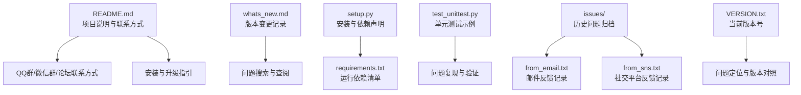
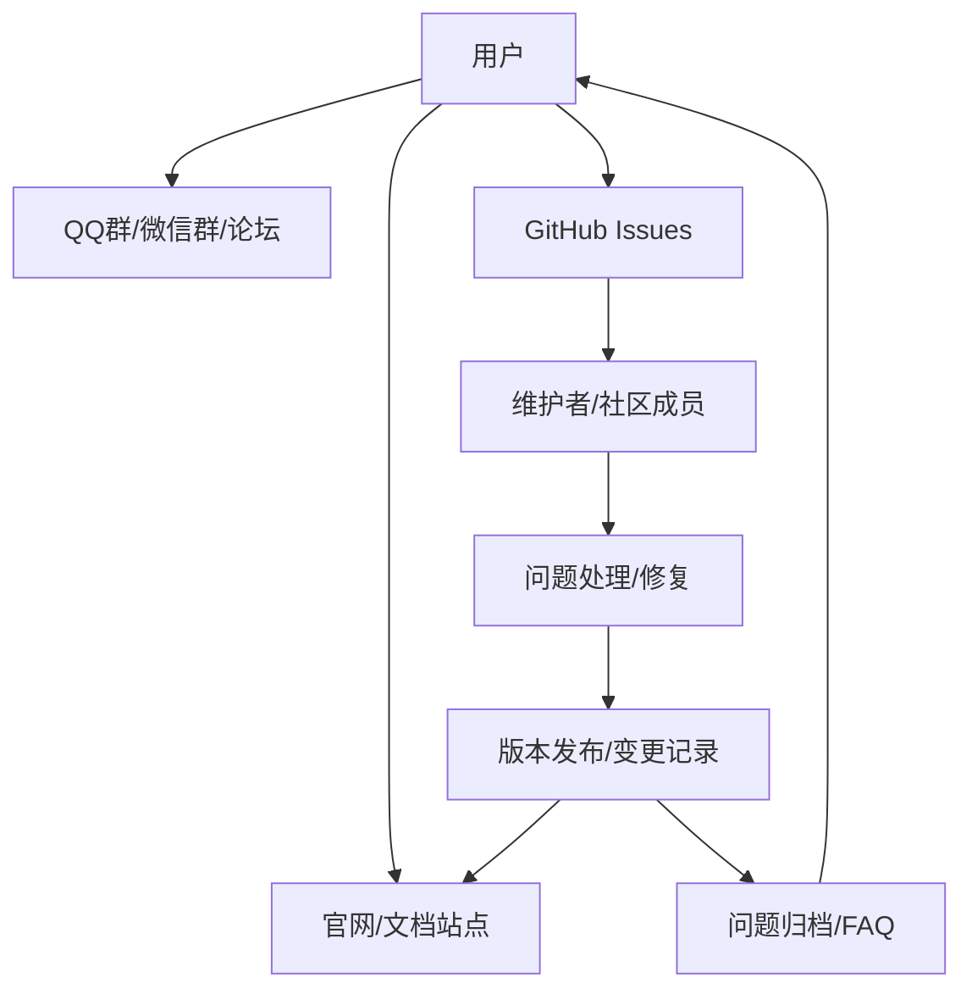
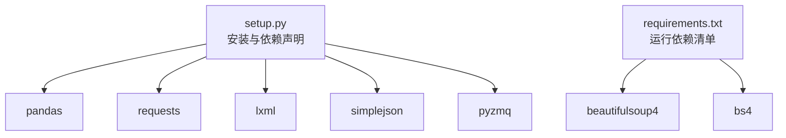
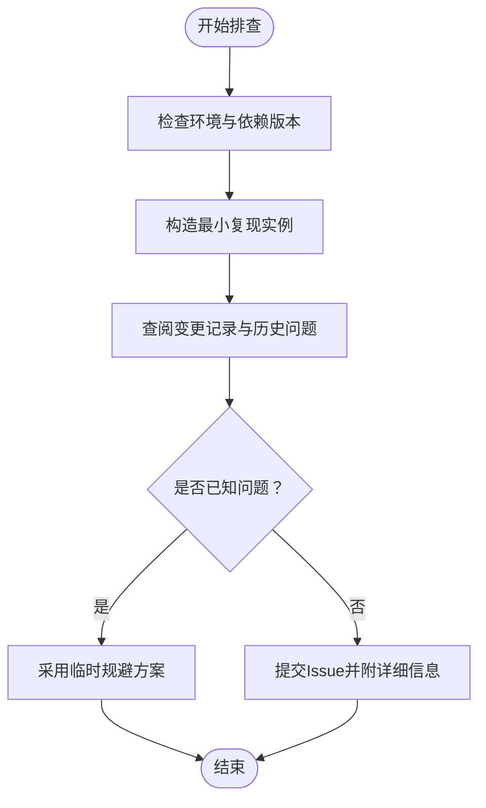

# 社区支持

<cite>
**本文引用的文件**
- [README.md](file://README.md)
- [whats_new.md](file://whats_new.md)
- [setup.py](file://setup.py)
- [requirements.txt](file://requirements.txt)
- [test_unittest.py](file://test_unittest.py)
- [VERSION.txt](file://tushare/VERSION.txt)
- [from_email.txt](file://issues/from_email.txt)
- [from_sns.txt](file://issues/from_sns.txt)
</cite>

## 目录
1. [简介](#简介)
2. [项目结构](#项目结构)
3. [核心组件](#核心组件)
4. [架构总览](#架构总览)
5. [详细组件分析](#详细组件分析)
6. [依赖分析](#依赖分析)
7. [性能考虑](#性能考虑)
8. [故障排查指南](#故障排查指南)
9. [结论](#结论)
10. [附录](#附录)

## 简介
本指南面向TuShare用户与贡献者，旨在帮助您高效获取技术支持、参与社区交流、正确提交问题反馈，并通过既有资源自助解决问题。内容涵盖：
- GitHub Issues 提交流程与模板使用建议
- 问题描述技巧、日志与环境信息收集要点
- 社区交流平台（QQ群、微信群、论坛）的使用规范
- 问题搜索与查阅方法
- 贡献方式（代码、文档、问题反馈）
- 社区行为准则与交流礼仪

## 项目结构
仓库包含用户文档、变更记录、安装与依赖配置、单元测试样例以及历史问题归档等，便于用户与贡献者定位信息与参与协作。

图表来源
- [README.md](file://README.md)
- [whats_new.md](file://whats_new.md)
- [setup.py](file://setup.py)
- [requirements.txt](file://requirements.txt)
- [test_unittest.py](file://test_unittest.py)
- [from_email.txt](file://issues/from_email.txt)
- [from_sns.txt](file://issues/from_sns.txt)
- [VERSION.txt](file://tushare/VERSION.txt)

章节来源
- [README.md](file://README.md)
- [whats_new.md](file://whats_new.md)
- [setup.py](file://setup.py)
- [requirements.txt](file://requirements.txt)
- [test_unittest.py](file://test_unittest.py)
- [from_email.txt](file://issues/from_email.txt)
- [from_sns.txt](file://issues/from_sns.txt)
- [VERSION.txt](file://tushare/VERSION.txt)

## 核心组件
- 项目说明与联系方式：包含官方文档入口、Pro版官网链接、微信公众号、QQ群等联系方式，便于用户获取帮助与参与交流。
- 变更记录：whats_new.md记录版本迭代与问题修复，有助于用户核对自身问题是否已在新版本中解决。
- 安装与依赖：setup.py与requirements.txt明确安装方式与运行依赖，确保问题复现环境一致。
- 单元测试：test_unittest.py提供API测试示例，可用于问题复现与最小化重现集构建。
- 历史问题归档：issues/目录下的邮件与社交平台记录，展示常见问题类型与处理思路，便于自助检索。

章节来源
- [README.md](file://README.md)
- [whats_new.md](file://whats_new.md)
- [setup.py](file://setup.py)
- [requirements.txt](file://requirements.txt)
- [test_unittest.py](file://test_unittest.py)
- [from_email.txt](file://issues/from_email.txt)
- [from_sns.txt](file://issues/from_sns.txt)

## 架构总览
以下图示化展示用户与社区支持体系的关键交互路径：从问题发现到反馈、处理与知识沉淀。

图表来源
- [README.md](file://README.md)
- [whats_new.md](file://whats_new.md)

## 详细组件分析

### GitHub Issues 提交流程与模板使用
- 提交入口：通过项目主页提供的官方文档入口或官网链接进入GitHub仓库，点击 Issues 并新建 Issue。
- 模板使用建议（基于仓库现有信息提炼）：
  - 标题：简洁明确地概括问题现象
  - 描述：包含问题背景、期望行为与实际行为对比
  - 复现步骤：最小可复现实例（可参考单元测试样例结构）
  - 环境信息：Python版本、操作系统、依赖版本、TuShare版本
  - 日志与截图：错误堆栈、网络请求异常、数据异常等
  - 相关链接：相关Issue编号、PR、文档页面等
- 优先级与标签：根据问题类型选择合适的标签（如 bug、enhancement、question），以便维护者快速识别与分流。

章节来源
- [README.md](file://README.md)
- [test_unittest.py](file://test_unittest.py)
- [VERSION.txt](file://tushare/VERSION.txt)

### 社区交流平台与使用规范
- QQ群：提供多个群组，包括付费高级用户群与免费群，适合实时交流与求助；建议在群内遵守发言规范，避免刷屏与无关链接。
- 微信群：通过公众号“挖地兔”获取更多信息，注意遵守微信群规则。
- 论坛讨论：README中提供官网与文档站点链接，可在对应板块进行讨论与提问。
- 使用规范：
  - 提问前先搜索已有讨论与FAQ
  - 提供清晰的上下文与必要截图
  - 尊重他人，避免人身攻击与无效争论
  - 遵守各平台的群规与社区规则

章节来源
- [README.md](file://README.md)

### 如何有效提问与收集信息
- 问题描述技巧：
  - 明确问题现象与触发条件
  - 说明期望结果与实际结果差异
  - 提供最小可复现实例（参考单元测试结构）
- 日志与环境信息：
  - Python版本、操作系统、依赖版本（参考安装与依赖声明）
  - TuShare版本（参考版本文件）
  - 网络环境与代理设置（如适用）
- 数据与接口异常：
  - 提供具体接口名称、参数与返回结构
  - 若涉及数据缺失或异常，提供样本数据片段与字段说明

章节来源
- [setup.py](file://setup.py)
- [requirements.txt](file://requirements.txt)
- [VERSION.txt](file://tushare/VERSION.txt)
- [test_unittest.py](file://test_unittest.py)

### 问题搜索与查阅方法
- 版本变更记录：通过变更记录核对问题是否已在新版本修复，减少重复反馈。
- 历史问题归档：邮件与社交平台反馈记录展示了常见问题类型与处理思路，便于自助检索。
- 官方文档：通过官网与文档站点查找接口说明与使用示例，确认调用方式与参数约束。

章节来源
- [whats_new.md](file://whats_new.md)
- [from_email.txt](file://issues/from_email.txt)
- [from_sns.txt](file://issues/from_sns.txt)
- [README.md](file://README.md)

### 贡献方式
- 代码贡献：遵循仓库现有风格与测试规范，提交Pull Request前确保通过单元测试与依赖一致性。
- 文档改进：完善README、变更记录与接口文档，提升可读性与准确性。
- 问题反馈：按上述流程提交Issue，提供充分信息与最小复现，协助维护者快速定位与修复。

章节来源
- [test_unittest.py](file://test_unittest.py)
- [setup.py](file://setup.py)
- [requirements.txt](file://requirements.txt)

### 社区行为准则与交流礼仪
- 尊重与包容：尊重不同观点与技术水平，避免人身攻击与歧视性言论。
- 事实与证据：基于事实与日志进行讨论，避免主观臆断。
- 适度与有序：控制发言频率与长度，保持讨论主题聚焦。
- 遵守规则：严格遵守各平台的群规与社区规则，维护良好交流环境。

章节来源
- [README.md](file://README.md)

## 依赖分析
- 运行依赖：pandas、requests、lxml、simplejson、beautifulsoup4等，确保问题复现环境与线上一致。
- 安装方式：支持pip安装与源码安装，升级时使用pip升级命令。
- 依赖版本：通过安装脚本与依赖文件明确最低版本要求，便于定位兼容性问题。

图表来源
- [setup.py](file://setup.py)
- [requirements.txt](file://requirements.txt)

章节来源
- [setup.py](file://setup.py)
- [requirements.txt](file://requirements.txt)

## 性能考虑
- 依赖版本与兼容性：确保依赖版本满足最低要求，避免因版本过低导致的性能退化或异常。
- 接口调用频率：合理控制请求频率，避免对数据源造成过大压力。
- 数据处理：在本地进行必要的数据缓存与索引优化，减少重复计算与网络开销。

## 故障排查指南
- 环境一致性：使用与仓库一致的Python与依赖版本，避免环境差异导致的不可复现问题。
- 最小复现实例：参考单元测试样例，构造最小可复现实例，缩小问题范围。
- 版本对照：核对当前版本与变更记录，确认问题是否已在新版本修复。
- 历史问题检索：通过邮件与社交平台反馈记录，查找类似问题的处理方案与临时规避措施。

图表来源
- [VERSION.txt](file://tushare/VERSION.txt)
- [whats_new.md](file://whats_new.md)
- [from_email.txt](file://issues/from_email.txt)
- [from_sns.txt](file://issues/from_sns.txt)
- [test_unittest.py](file://test_unittest.py)

章节来源
- [VERSION.txt](file://tushare/VERSION.txt)
- [whats_new.md](file://whats_new.md)
- [from_email.txt](file://issues/from_email.txt)
- [from_sns.txt](file://issues/from_sns.txt)
- [test_unittest.py](file://test_unittest.py)

## 结论
通过本指南，您可以：
- 快速定位并参与社区支持渠道
- 正确提交问题反馈，提高处理效率
- 自主检索历史问题与变更记录，降低重复问题发生
- 以规范的方式贡献代码与文档，共同建设健康的技术社区

## 附录
- 官方文档与官网入口：README中提供文档站点与Pro版官网链接，便于查阅最新接口与使用说明。
- 版本号：当前版本可通过版本文件确认，便于问题定位与升级决策。

章节来源
- [README.md](file://README.md)
- [VERSION.txt](file://tushare/VERSION.txt)