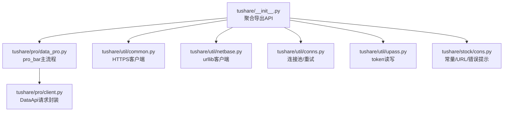
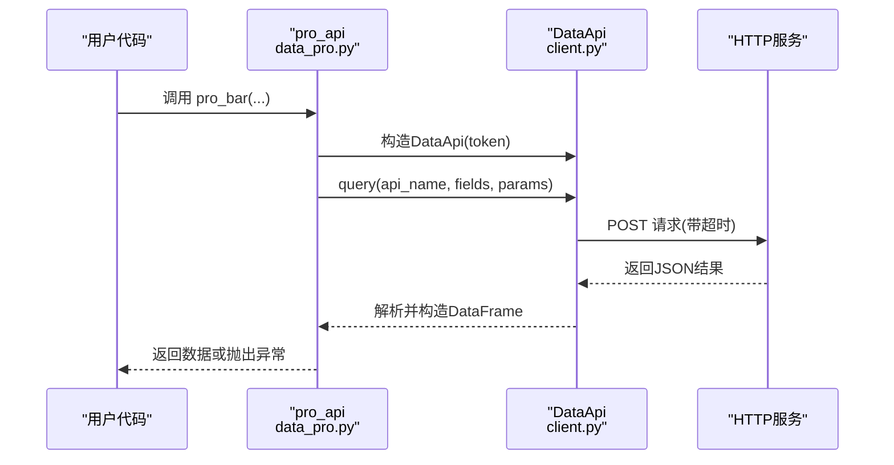
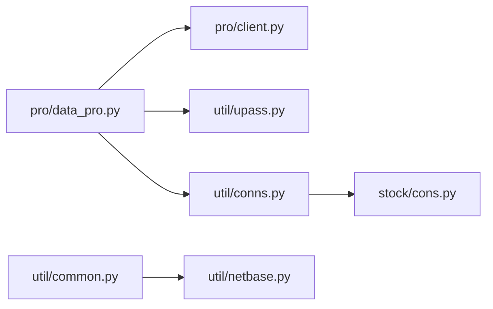
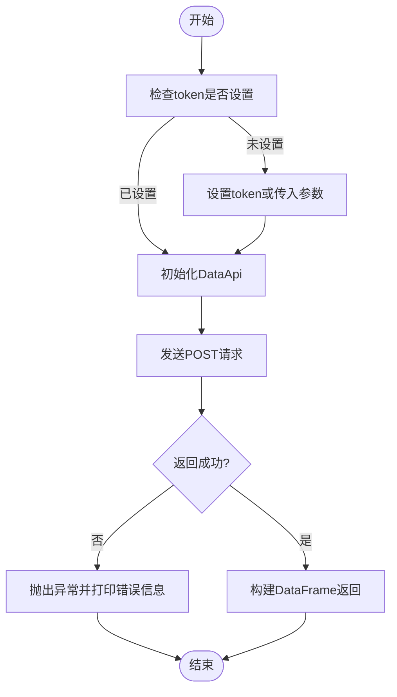
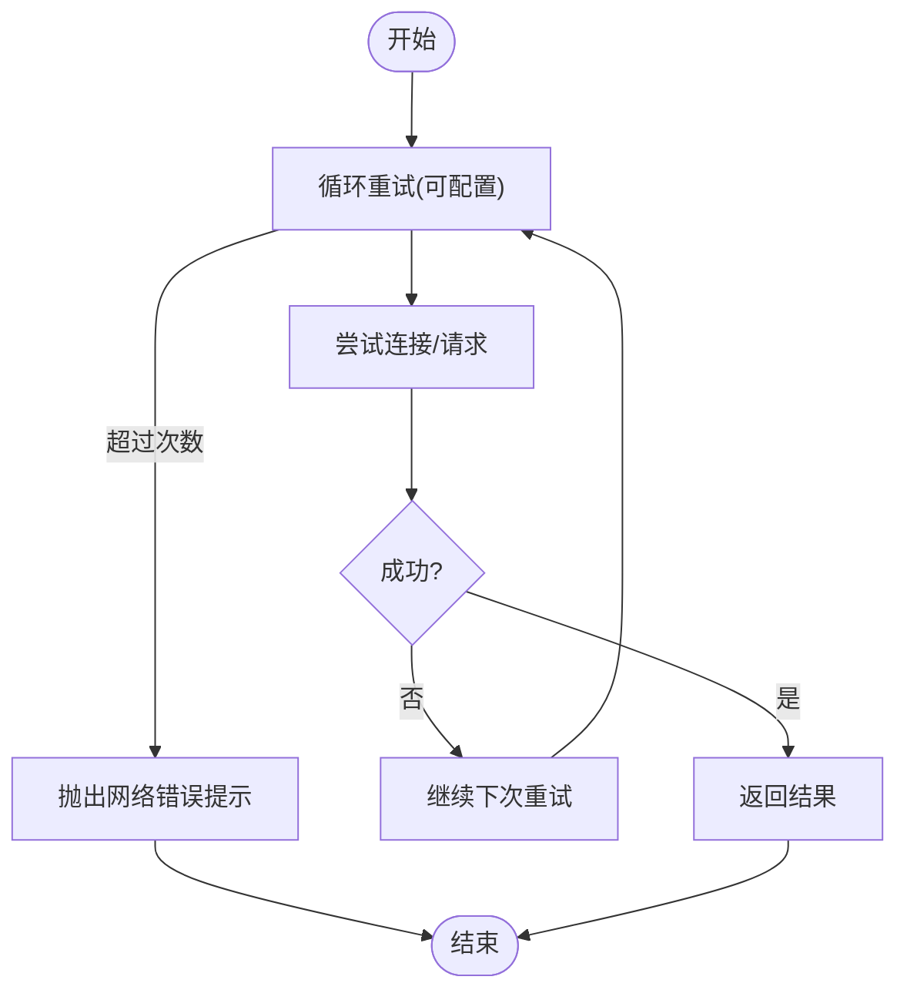

# 调试技巧

<cite>
**本文引用的文件**
- [README.md](file://README.md)
- [tushare/__init__.py](file://tushare/__init__.py)
- [tushare/util/common.py](file://tushare/util/common.py)
- [tushare/util/netbase.py](file://tushare/util/netbase.py)
- [tushare/pro/client.py](file://tushare/pro/client.py)
- [tushare/pro/data_pro.py](file://tushare/pro/data_pro.py)
- [tushare/util/conns.py](file://tushare/util/conns.py)
- [tushare/util/upass.py](file://tushare/util/upass.py)
- [tushare/stock/cons.py](file://tushare/stock/cons.py)
- [test/bar_test.py](file://test/bar_test.py)
- [test/test_unittest.py](file://test/test_unittest.py)
</cite>

## 目录
1. [简介](#简介)
2. [项目结构](#项目结构)
3. [核心组件](#核心组件)
4. [架构总览](#架构总览)
5. [组件详解与调试要点](#组件详解与调试要点)
6. [依赖关系分析](#依赖关系分析)
7. [性能分析与监控建议](#性能分析与监控建议)
8. [故障排查与调试流程](#故障排查与调试流程)
9. [结论](#结论)
10. [附录](#附录)

## 简介
本指南面向TuShare开发者与高级用户，聚焦于调试技巧与工具使用，帮助快速定位问题、分析性能瓶颈，并形成系统化的调试思维。内容涵盖：
- 日志与输出控制：如何启用详细输出、识别关键提示信息
- 网络抓包与请求分析：curl、浏览器开发者工具、Wireshark等
- Python调试工具：pdb、logging、traceback等
- 性能分析：内存、执行时间、网络延迟
- 实战案例与排障流程：从现象到根因的闭环

## 项目结构
TuShare采用按功能域分层的组织方式：顶层入口聚合各模块API，数据获取通过util层封装HTTP客户端与连接管理，Pro版通过独立client与data_pro协调认证与请求。

图示来源
- [tushare/__init__.py:1-140](file://tushare/__init__.py#L1-L140)
- [tushare/pro/data_pro.py:1-158](file://tushare/pro/data_pro.py#L1-L158)
- [tushare/pro/client.py:1-52](file://tushare/pro/client.py#L1-L52)
- [tushare/util/common.py:1-86](file://tushare/util/common.py#L1-L86)
- [tushare/util/netbase.py:1-29](file://tushare/util/netbase.py#L1-L29)
- [tushare/util/conns.py:1-61](file://tushare/util/conns.py#L1-L61)
- [tushare/util/upass.py:1-62](file://tushare/util/upass.py#L1-L62)
- [tushare/stock/cons.py:1-453](file://tushare/stock/cons.py#L1-L453)

章节来源
- [tushare/__init__.py:1-140](file://tushare/__init__.py#L1-L140)
- [README.md:1-411](file://README.md#L1-L411)

## 核心组件
- 入口聚合：顶层模块统一导出各类API，便于用户按需调用
- Pro数据接口：DataApi负责POST请求、超时控制与错误抛出
- 通用网络客户端：util层提供基于urllib与HTTPSConnection的客户端封装
- 连接与重试：conns模块封装连接获取与断开，内置重试逻辑
- 认证与凭证：upass模块负责token持久化与读取
- 常量与提示：cons集中定义URL、字段、错误提示与控制台输出

章节来源
- [tushare/__init__.py:1-140](file://tushare/__init__.py#L1-L140)
- [tushare/pro/client.py:1-52](file://tushare/pro/client.py#L1-L52)
- [tushare/util/common.py:1-86](file://tushare/util/common.py#L1-L86)
- [tushare/util/netbase.py:1-29](file://tushare/util/netbase.py#L1-L29)
- [tushare/util/conns.py:1-61](file://tushare/util/conns.py#L1-L61)
- [tushare/util/upass.py:1-62](file://tushare/util/upass.py#L1-L62)
- [tushare/stock/cons.py:1-453](file://tushare/stock/cons.py#L1-L453)

## 架构总览
下面以“获取日线行情（pro_bar）”为例，展示从入口到网络请求的关键调用链与错误处理位置。

图示来源
- [tushare/pro/data_pro.py:21-158](file://tushare/pro/data_pro.py#L21-L158)
- [tushare/pro/client.py:17-52](file://tushare/pro/client.py#L17-L52)

## 组件详解与调试要点

### 1) 入口与API聚合
- 作用：统一导出股票、基金、期货、宏观、工具等模块的API，便于用户直接调用
- 调试要点：
  - 若导入报错，优先检查模块路径与依赖是否正确
  - 使用最小复现样例验证API可用性（参考测试文件）

章节来源
- [tushare/__init__.py:1-140](file://tushare/__init__.py#L1-L140)
- [test/bar_test.py:16-18](file://test/bar_test.py#L16-L18)
- [test/test_unittest.py:15-17](file://test/test_unittest.py#L15-L17)

### 2) Pro数据接口（DataApi）
- 关键点：
  - 使用requests发送POST请求，携带token与参数
  - 对返回结果进行校验，非成功状态抛出异常
  - 支持超时配置，避免阻塞
- 调试建议：
  - 打印请求参数与返回状态，定位认证与参数问题
  - 捕获异常并打印result['msg']，结合错误码定位业务错误
  - 调整timeout参数观察网络波动影响

章节来源
- [tushare/pro/client.py:17-52](file://tushare/pro/client.py#L17-L52)

### 3) 通用网络客户端（util层）
- util/common.py：基于HTTPSConnection的客户端，支持Authorization头与路径编码
- util/netbase.py：基于urllib的客户端，设置UA与Cookie，统一超时
- 调试建议：
  - 在网络层增加请求日志（URL、headers、超时），便于抓包核对
  - 遇到编码问题时，检查路径编码逻辑与字符集转换

章节来源
- [tushare/util/common.py:18-86](file://tushare/util/common.py#L18-L86)
- [tushare/util/netbase.py:9-29](file://tushare/util/netbase.py#L9-L29)

### 4) 连接与重试（conns）
- 功能：获取与断开连接，内置重试机制；失败时抛出网络错误提示
- 调试建议：
  - 观察重试次数与间隔，评估网络稳定性
  - 出错时确认服务器IP与端口配置是否正确

章节来源
- [tushare/util/conns.py:14-61](file://tushare/util/conns.py#L14-L61)
- [tushare/stock/cons.py:354-356](file://tushare/stock/cons.py#L354-L356)

### 5) 认证与凭证（upass）
- 功能：token持久化与读取；broker信息管理
- 调试建议：
  - 确认token文件存在且可读
  - Pro版接口初始化失败时，优先检查token是否设置

章节来源
- [tushare/util/upass.py:16-31](file://tushare/util/upass.py#L16-L31)
- [tushare/pro/data_pro.py:21-31](file://tushare/pro/data_pro.py#L21-L31)
- [tushare/stock/cons.py:200-201](file://tushare/stock/cons.py#L200-L201)

### 6) 常量与提示（cons）
- 功能：集中管理URL、字段、错误提示与控制台输出
- 调试建议：
  - 关注控制台输出提示，如“正在获取数据”“请检查网络”
  - 参数校验失败会抛出明确错误信息，便于快速定位

章节来源
- [tushare/stock/cons.py:190-196](file://tushare/stock/cons.py#L190-L196)
- [tushare/stock/cons.py:359-374](file://tushare/stock/cons.py#L359-L374)

## 依赖关系分析
- 模块内聚与耦合：
  - pro/data_pro依赖pro/client进行HTTP请求
  - util层为多处数据获取提供通用网络能力
  - conns与cons共同支撑连接与参数校验
- 外部依赖：
  - requests（Pro接口）
  - pandas（数据结构）
  - pytdx（行情连接，用于conns）

图示来源
- [tushare/pro/data_pro.py:1-158](file://tushare/pro/data_pro.py#L1-L158)
- [tushare/pro/client.py:1-52](file://tushare/pro/client.py#L1-L52)
- [tushare/util/common.py:1-86](file://tushare/util/common.py#L1-L86)
- [tushare/util/netbase.py:1-29](file://tushare/util/netbase.py#L1-L29)
- [tushare/util/conns.py:1-61](file://tushare/util/conns.py#L1-L61)
- [tushare/util/upass.py:1-62](file://tushare/util/upass.py#L1-L62)
- [tushare/stock/cons.py:1-453](file://tushare/stock/cons.py#L1-L453)

## 性能分析与监控建议
- 执行时间测量
  - 使用计时器包装API调用，对比不同参数组合的耗时
  - 关注retry_count与timeout对整体耗时的影响
- 内存使用监控
  - 对大数据量返回（如日线、分钟线）进行采样与分块处理
  - 及时释放DataFrame引用，避免内存峰值
- 网络延迟分析
  - 使用curl/Wireshark抓包，核对请求头、URL与响应时间
  - 结合DataApi的超时设置，评估网络抖动对成功率的影响
- 日志与输出
  - 利用控制台输出提示定位进度与异常
  - 在关键路径添加日志（参数、状态码、耗时），便于回溯

## 故障排查与调试流程

### 流程一：Pro接口初始化失败
- 现象：初始化时报错，提示token缺失
- 排查步骤：
  - 确认是否已设置token（参考凭证读取逻辑）
  - 检查token文件是否存在与可读
  - 尝试显式传入token参数
- 相关位置
  - [tushare/util/upass.py:23-31](file://tushare/util/upass.py#L23-L31)
  - [tushare/pro/data_pro.py:21-31](file://tushare/pro/data_pro.py#L21-L31)

图示来源
- [tushare/util/upass.py:23-31](file://tushare/util/upass.py#L23-L31)
- [tushare/pro/data_pro.py:21-48](file://tushare/pro/data_pro.py#L21-L48)
- [tushare/pro/client.py:32-48](file://tushare/pro/client.py#L32-L48)

### 流程二：网络不稳定导致失败
- 现象：偶发超时或连接失败
- 排查步骤：
  - 增加重试次数与超时时间
  - 使用curl/Wireshark抓包，核对请求与响应
  - 检查服务器IP与端口配置
- 相关位置
  - [tushare/util/conns.py:14-23](file://tushare/util/conns.py#L14-L23)
  - [tushare/stock/cons.py:354-356](file://tushare/stock/cons.py#L354-L356)
  - [tushare/pro/client.py:22-30](file://tushare/pro/client.py#L22-L30)

图示来源
- [tushare/util/conns.py:14-23](file://tushare/util/conns.py#L14-L23)
- [tushare/stock/cons.py:195](file://tushare/stock/cons.py#L195)

### 流程三：参数校验失败
- 现象：输入参数类型或取值不符合要求
- 排查步骤：
  - 检查日期格式、频率、资产类型等参数
  - 关注控制台提示与异常信息
- 相关位置
  - [tushare/stock/cons.py:375-387](file://tushare/stock/cons.py#L375-L387)
  - [tushare/pro/data_pro.py:68-70](file://tushare/pro/data_pro.py#L68-L70)

## 结论
通过将调试关注点聚焦于“入口聚合—网络请求—连接与重试—认证与提示”四个维度，可以快速定位问题根因。配合抓包与日志，能够有效提升诊断效率与稳定性。建议在生产环境中固定超时与重试策略，并在关键路径埋点日志，形成可追溯的可观测体系。

## 附录

### A. 常见问题与定位清单
- Pro初始化失败：检查token设置与文件权限
- 网络超时/失败：增大重试次数与超时，抓包核对请求
- 参数错误：对照参数校验规则，修正输入
- 控制台提示：关注“正在获取数据”“请检查网络”等提示

### B. 实战案例参考
- 使用单元测试最小复现：参考测试文件中的调用方式
- 抓包与核对：使用curl或浏览器开发者工具抓取请求与响应
- 异常捕获：在业务层捕获异常并打印错误信息，辅助定位

章节来源
- [test/bar_test.py:16-18](file://test/bar_test.py#L16-L18)
- [test/test_unittest.py:15-17](file://test/test_unittest.py#L15-L17)