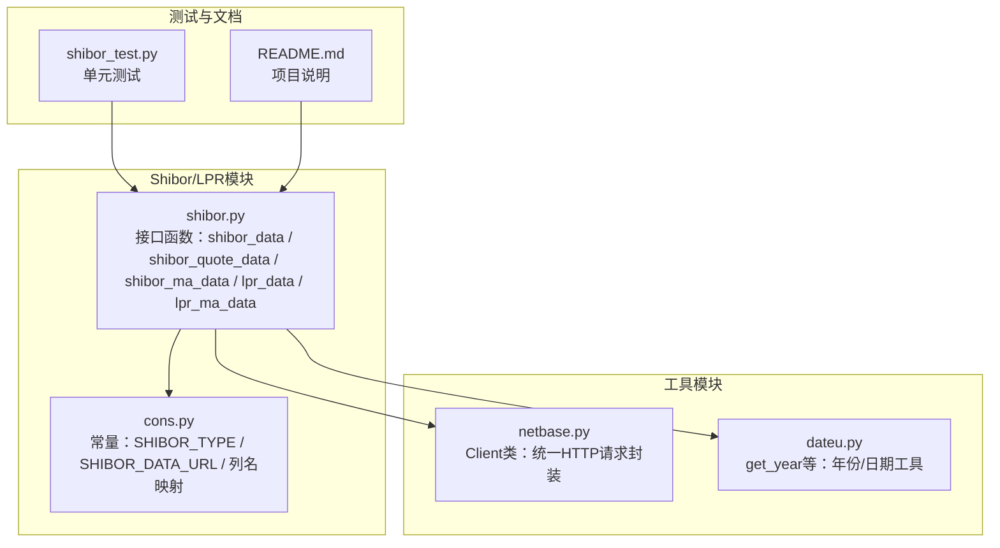
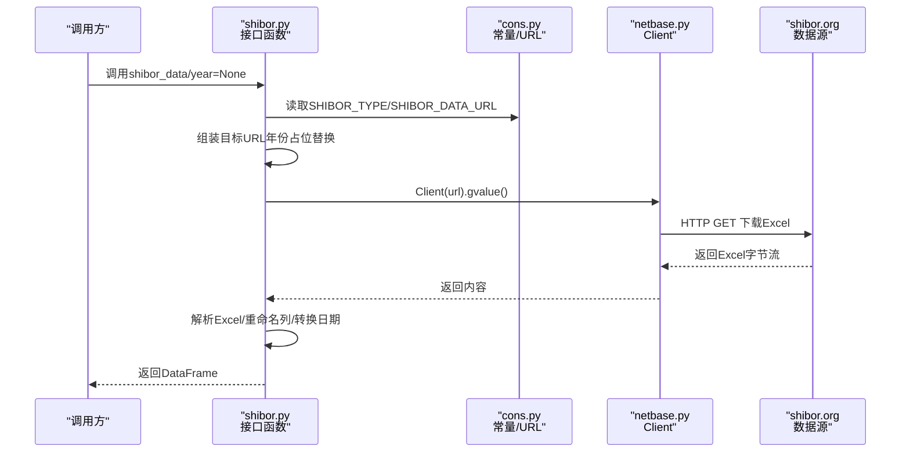
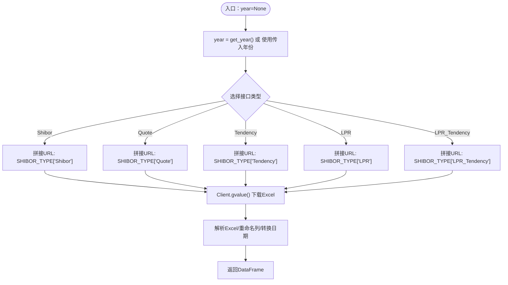
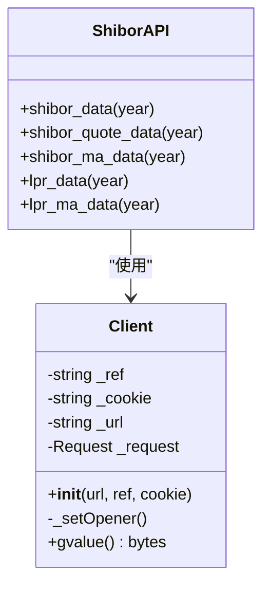
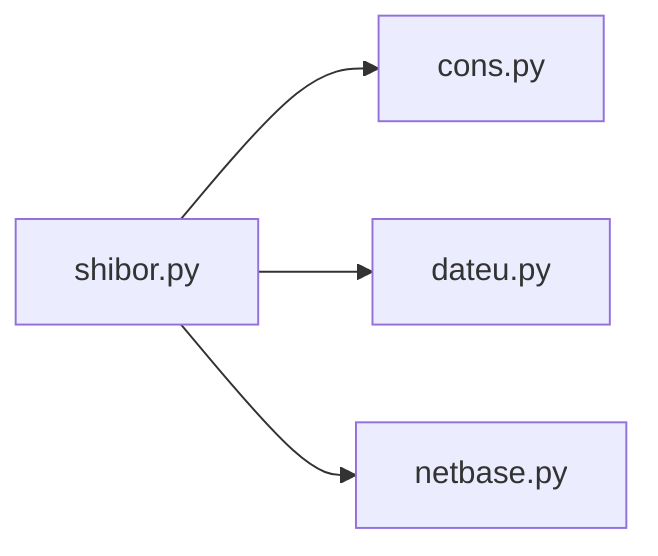

# Shibor/LPR数据API

<cite>
**本文引用的文件**
- [shibor.py](file://tushare/stock/shibor.py)
- [cons.py](file://tushare/stock/cons.py)
- [netbase.py](file://tushare/util/netbase.py)
- [dateu.py](file://tushare/util/dateu.py)
- [shibor_test.py](file://test/shibor_test.py)
- [macro.py](file://tushare/stock/macro.py)
- [macro_vars.py](file://tushare/stock/macro_vars.py)
- [README.md](file://README.md)
</cite>

## 目录
1. [简介](#简介)
2. [项目结构](#项目结构)
3. [核心组件](#核心组件)
4. [架构总览](#架构总览)
5. [详细组件分析](#详细组件分析)
6. [依赖关系分析](#依赖关系分析)
7. [性能考量](#性能考量)
8. [故障排查指南](#故障排查指南)
9. [结论](#结论)
10. [附录](#附录)

## 简介
本文件为 TuShare 项目中“银行间拆借利率（Shibor）与贷款市场报价利率（LPR）”数据API的权威参考文档。内容涵盖：
- 接口能力与参数说明
- 数据字段与返回格式
- 报价机制、期限结构、发布频率与市场意义（概念性说明）
- 形成机制、报价行制度、调整周期与货币政策传导作用（概念性说明）
- 实际应用示例（利率曲线构建、流动性监测、货币政策分析）
- 风险管理与定价模型要点（概念性说明）

## 项目结构
Shibor/LPR相关代码位于 tushare/stock/shibor.py，配合通用常量与网络请求工具：
- 数据接口：tushare/stock/shibor.py
- 常量与URL配置：tushare/stock/cons.py
- 网络请求封装：tushare/util/netbase.py
- 日期工具：tushare/util/dateu.py
- 测试用例：test/shibor_test.py
- 宏观经济接口（可作为LPR背景数据补充）：tushare/stock/macro.py、tushare/stock/macro_vars.py
- 项目说明：README.md

**图表来源**
- [shibor.py:16-207](file://tushare/stock/shibor.py#L16-L207)
- [cons.py:97-169](file://tushare/stock/cons.py#L97-L169)
- [netbase.py:9-29](file://tushare/util/netbase.py#L9-L29)
- [dateu.py:31-35](file://tushare/util/dateu.py#L31-L35)
- [shibor_test.py:6-31](file://test/shibor_test.py#L6-L31)
- [README.md:1-411](file://README.md#L1-L411)

**章节来源**
- [shibor.py:16-207](file://tushare/stock/shibor.py#L16-L207)
- [cons.py:97-169](file://tushare/stock/cons.py#L97-L169)
- [netbase.py:9-29](file://tushare/util/netbase.py#L9-L29)
- [dateu.py:31-35](file://tushare/util/dateu.py#L31-L35)
- [shibor_test.py:6-31](file://test/shibor_test.py#L6-L31)
- [README.md:1-411](file://README.md#L1-L411)

## 核心组件
- 接口函数
  - shibor_data(year=None)：获取Shibor历史日频数据（ON/1W/2W/1M/3M/6M/9M/1Y）
  - shibor_quote_data(year=None)：获取Shibor银行报价数据（含买入/卖出价）
  - shibor_ma_data(year=None)：获取Shibor均线数据（5/10/20日）
  - lpr_data(year=None)：获取LPR历史数据（1年期）
  - lpr_ma_data(year=None)：获取LPR均线数据（5/10/20日）
- 关键常量
  - SHIBOR_TYPE：接口类型映射（Shibor/Quote/Tendency/LPR/LPR_Tendency）
  - SHIBOR_DATA_URL：数据下载模板URL
  - 列名映射：SHIBOR_COLS、SHIBOR_Q_COLS、QUOTE_COLS、SHIBOR_MA_COLS、LPR_COLS、LPR_MA_COLS
- 网络与日期
  - Client：统一HTTP请求封装
  - get_year：默认年份获取

**章节来源**
- [shibor.py:16-207](file://tushare/stock/shibor.py#L16-L207)
- [cons.py:97-169](file://tushare/stock/cons.py#L97-L169)
- [netbase.py:9-29](file://tushare/util/netbase.py#L9-L29)
- [dateu.py:31-35](file://tushare/util/dateu.py#L31-L35)

## 架构总览
Shibor/LPR数据API采用“接口函数 + 常量配置 + 网络请求封装”的分层设计。接口函数负责参数处理与URL拼接，调用Client发起HTTP请求，解析Excel并标准化列名与日期格式。

**图表来源**
- [shibor.py:35-53](file://tushare/stock/shibor.py#L35-L53)
- [cons.py:97-100](file://tushare/stock/cons.py#L97-L100)
- [netbase.py:26-28](file://tushare/util/netbase.py#L26-L28)

## 详细组件分析

### 接口函数与数据字段
- shibor_data(year=None)
  - 功能：获取Shibor日频数据
  - 默认年份：当前年份
  - 返回列：date + 各期限（ON/1W/2W/1M/3M/6M/9M/1Y）
  - 数据来源：SHIBOR_TYPE['Shibor'] + SHIBOR_DATA_URL
- shibor_quote_data(year=None)
  - 功能：获取银行报价数据（买入/卖出）
  - 返回列：date/bank + 各期限买入/卖出价
- shibor_ma_data(year=None)
  - 功能：获取Shibor均线（5/10/20日）
  - 返回列：date + 各期限均线
- lpr_data(year=None)
  - 功能：获取LPR日频数据（1年期）
  - 返回列：date + 1Y
- lpr_ma_data(year=None)
  - 功能：获取LPR均线（5/10/20日）
  - 返回列：date + 1Y_5/1Y_10/1Y_20

**图表来源**
- [shibor.py:16-207](file://tushare/stock/shibor.py#L16-L207)
- [cons.py:97-100](file://tushare/stock/cons.py#L97-L100)
- [dateu.py:31-35](file://tushare/util/dateu.py#L31-L35)

**章节来源**
- [shibor.py:16-207](file://tushare/stock/shibor.py#L16-L207)
- [cons.py:97-169](file://tushare/stock/cons.py#L97-L169)

### 类与依赖关系

**图表来源**
- [netbase.py:9-29](file://tushare/util/netbase.py#L9-L29)
- [shibor.py:16-207](file://tushare/stock/shibor.py#L16-L207)

**章节来源**
- [netbase.py:9-29](file://tushare/util/netbase.py#L9-L29)
- [shibor.py:16-207](file://tushare/stock/shibor.py#L16-L207)

### 数据字段定义
- Shibor日频：date, ON, 1W, 2W, 1M, 3M, 6M, 9M, 1Y
- Shibor报价：date, bank, ON_B/ON_A, 1W_B/1W_A, …, 1Y_B/1Y_A
- Shibor均线：date + 各期限5/10/20日均线
- LPR日频：date, 1Y
- LPR均线：date, 1Y_5, 1Y_10, 1Y_20

**章节来源**
- [cons.py:135-169](file://tushare/stock/cons.py#L135-L169)

### 错误处理与健壮性
- 异常捕获：各接口函数内部使用 try/except 包裹网络请求与解析逻辑，失败时返回 None
- 建议：调用方应判断返回值非空后再进行后续分析

**章节来源**
- [shibor.py:38-53](file://tushare/stock/shibor.py#L38-L53)
- [shibor.py:87-103](file://tushare/stock/shibor.py#L87-L103)
- [shibor.py:120-135](file://tushare/stock/shibor.py#L120-L135)
- [shibor.py:153-168](file://tushare/stock/shibor.py#L153-L168)
- [shibor.py:188-203](file://tushare/stock/shibor.py#L188-L203)

### 测试用例
- 测试覆盖：shibor_data、shibor_quote_data、shibor_ma_data、lpr_data、lpr_ma_data
- 年份参数：示例中使用固定年份（如2014），便于回测与验证

**章节来源**
- [shibor_test.py:6-31](file://test/shibor_test.py#L6-L31)

## 依赖关系分析
- shibor.py 依赖
  - tushare.stock.cons：常量与URL模板
  - tushare.util.dateu：默认年份获取
  - tushare.util.netbase.Client：HTTP请求
- 数据字段映射来自 cons.py 的列名常量

**图表来源**
- [shibor.py:11-13](file://tushare/stock/shibor.py#L11-L13)
- [cons.py:97-169](file://tushare/stock/cons.py#L97-L169)
- [dateu.py:31-35](file://tushare/util/dateu.py#L31-L35)
- [netbase.py:9-29](file://tushare/util/netbase.py#L9-L29)

**章节来源**
- [shibor.py:11-13](file://tushare/stock/shibor.py#L11-L13)
- [cons.py:97-169](file://tushare/stock/cons.py#L97-L169)
- [dateu.py:31-35](file://tushare/util/dateu.py#L31-L35)
- [netbase.py:9-29](file://tushare/util/netbase.py#L9-L29)

## 性能考量
- 请求超时：Client内部设置超时，避免长时间阻塞
- 数据规模：按年下载Excel，建议按需指定年份以减少带宽与解析开销
- 日期转换：统一转换为datetime64[D]，便于后续时间序列分析

**章节来源**
- [netbase.py:26-28](file://tushare/util/netbase.py#L26-L28)
- [shibor.py:47-51](file://tushare/stock/shibor.py#L47-L51)
- [shibor.py:97-101](file://tushare/stock/shibor.py#L97-L101)
- [shibor.py:129-133](file://tushare/stock/shibor.py#L129-L133)
- [shibor.py:162-166](file://tushare/stock/shibor.py#L162-L166)
- [shibor.py:198-202](file://tushare/stock/shibor.py#L198-L202)

## 故障排查指南
- 网络异常
  - 现象：返回None
  - 排查：确认网络连通；检查URL拼接是否正确；适当增大超时
- Excel解析异常
  - 现象：解析失败或列名不匹配
  - 排查：确认返回内容为Excel；核对列名映射；检查日期列转换逻辑
- 年份参数
  - 现象：输入非法导致异常
  - 排查：确保year为有效年份；默认使用当前年份

**章节来源**
- [shibor.py:38-53](file://tushare/stock/shibor.py#L38-L53)
- [shibor.py:87-103](file://tushare/stock/shibor.py#L87-L103)
- [shibor.py:120-135](file://tushare/stock/shibor.py#L120-L135)
- [shibor.py:153-168](file://tushare/stock/shibor.py#L153-L168)
- [shibor.py:188-203](file://tushare/stock/shibor.py#L188-L203)

## 结论
- 本API提供Shibor与LPR的日频历史数据及其均线，适合作为流动性与政策分析的基础数据源
- 接口简洁、依赖清晰，建议结合TuShare其他模块（如宏观数据）进行综合研究
- 实务中应关注数据可用性与网络稳定性，并在调用端做好空值与异常处理

## 附录

### 实际应用示例（概念性说明）
- 利率曲线构建
  - 使用Shibor多期限序列（ON/1W/1M/3M/6M/1Y）构建即期曲线，观察期限利差变化
- 流动性监测
  - 对比Shibor与银行间存款类金融机构超额准备金率，评估市场流动性松紧
- 货币政策分析
  - 结合LPR与MLF操作、OMO等公开市场操作，观察政策意图传导路径
- 风险管理与定价
  - 将Shibor/LPR作为折现率基准，用于债券估值、贷款定价与衍生品定价

### 相关模块与背景数据
- 宏观经济接口（可作为LPR背景数据补充）
  - 存款准备金率、货币供应量、贷款市场报价利率等
- 项目说明
  - 项目定位、安装与升级方式、快速开始示例

**章节来源**
- [macro.py:241-292](file://tushare/stock/macro.py#L241-L292)
- [macro_vars.py:1-25](file://tushare/stock/macro_vars.py#L1-L25)
- [README.md:30-42](file://README.md#L30-L42)
- [README.md:43-105](file://README.md#L43-L105)