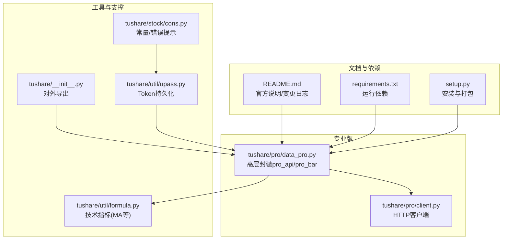
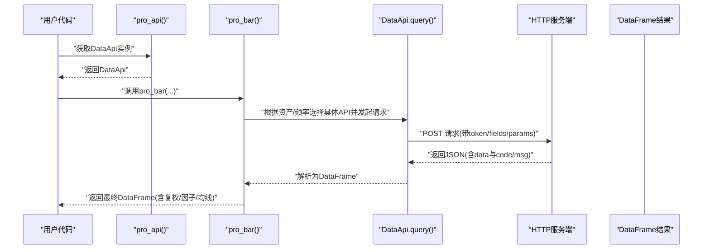
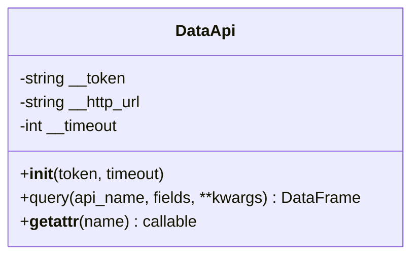
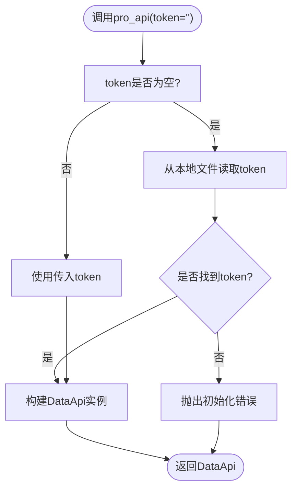
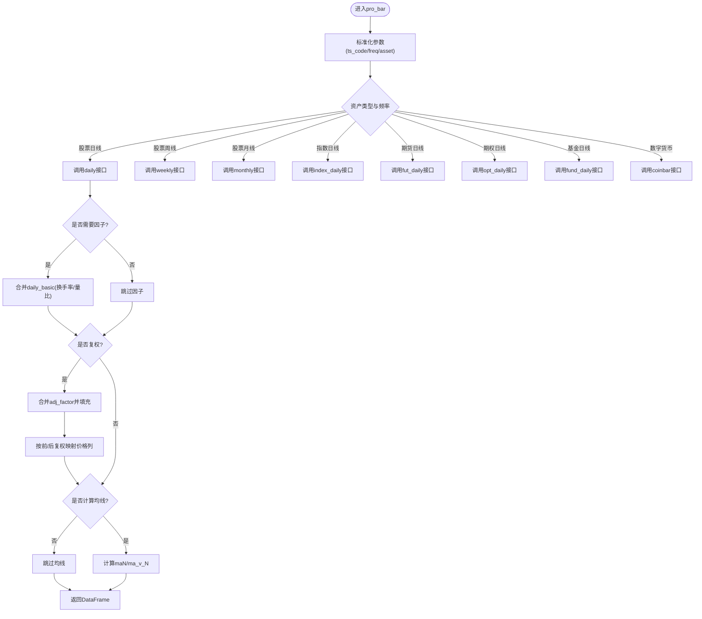
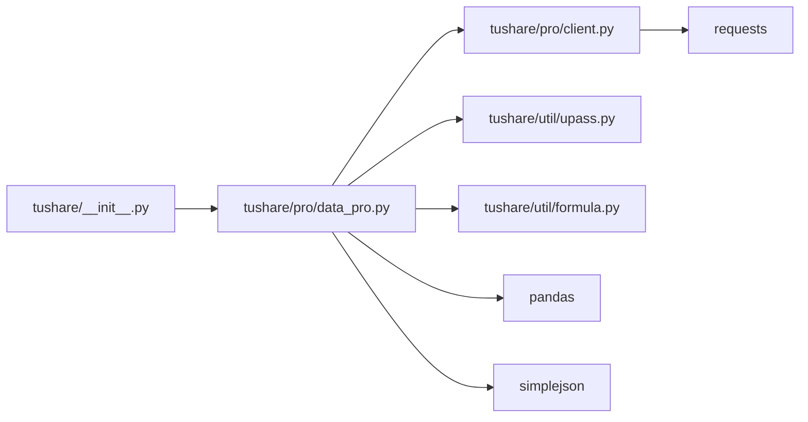

# 专业版API

<cite>
**本文引用的文件**
- [README.md](file://README.md)
- [requirements.txt](file://requirements.txt)
- [setup.py](file://setup.py)
- [tushare/pro/client.py](file://tushare/pro/client.py)
- [tushare/pro/data_pro.py](file://tushare/pro/data_pro.py)
- [tushare/util/upass.py](file://tushare/util/upass.py)
- [tushare/util/formula.py](file://tushare/util/formula.py)
- [tushare/stock/cons.py](file://tushare/stock/cons.py)
- [tushare/__init__.py](file://tushare/__init__.py)
- [test/bar_test.py](file://test/bar_test.py)
</cite>

## 目录
1. [简介](#简介)
2. [项目结构](#项目结构)
3. [核心组件](#核心组件)
4. [架构总览](#架构总览)
5. [详细组件分析](#详细组件分析)
6. [依赖分析](#依赖分析)
7. [性能考量](#性能考量)
8. [故障排查指南](#故障排查指南)
9. [结论](#结论)
10. [附录](#附录)

## 简介
本文件面向TuShare专业版API（Pro），聚焦通用行情接口pro_bar()的使用方法与实现细节，涵盖初始化配置、参数设置、数据获取流程、Token认证与权限、使用限制、复权处理、因子数据、批量查询、与普通版API的差异与优势、错误处理、性能优化与最佳实践等内容。目标是帮助用户高效、安全、稳定地使用专业版数据接口。

## 项目结构
- 专业版核心位于tushare/pro目录：
  - client.py：封装HTTP客户端，负责与Pro服务端交互，统一请求与响应解析。
  - data_pro.py：提供pro_api()与pro_bar()等高层封装，内置资产类型、频率映射、复权与技术指标计算逻辑。
- 工具与支撑：
  - util/upass.py：Token持久化与读取，便于本地缓存Pro Token。
  - util/formula.py：常用技术指标（如MA）的实现，供pro_bar()计算均线使用。
  - stock/cons.py：常量与消息提示，包含TOKEN文件名、错误提示等。
  - __init__.py：对外导出pro_api与pro_bar等接口，便于直接import tushare as ts后使用。
- 文档与依赖：
  - README.md：官方说明与变更日志，包含Pro版特性与接口说明。
  - requirements.txt/setup.py：运行依赖与安装说明。

**图表来源**
- [tushare/pro/client.py:17-52](file://tushare/pro/client.py#L17-L52)
- [tushare/pro/data_pro.py:21-158](file://tushare/pro/data_pro.py#L21-L158)
- [tushare/util/upass.py:16-31](file://tushare/util/upass.py#L16-L31)
- [tushare/util/formula.py:12-13](file://tushare/util/formula.py#L12-L13)
- [tushare/stock/cons.py:200-201](file://tushare/stock/cons.py#L200-L201)
- [tushare/__init__.py:82-82](file://tushare/__init__.py#L82-L82)
- [README.md:4-4](file://README.md#L4-L4)
- [requirements.txt:1-6](file://requirements.txt#L1-L6)
- [setup.py:65-74](file://setup.py#L65-L74)

**章节来源**
- [README.md:4-4](file://README.md#L4-L4)
- [requirements.txt:1-6](file://requirements.txt#L1-L6)
- [setup.py:65-74](file://setup.py#L65-L74)

## 核心组件
- DataApi类（HTTP客户端）
  - 负责构造请求体、发送POST请求、解析JSON响应、抛出业务异常。
  - 提供query方法与动态属性代理，支持按api_name动态调用。
- pro_api函数
  - 优先从本地读取Token；若未设置则抛出初始化错误。
  - 返回DataApi实例，作为后续调用的会话对象。
- pro_bar函数
  - 通用行情入口，支持股票/ETF/期货/期权/基金/指数/数字货币等多资产类型。
  - 支持日线/周线/月线/分钟线、复权（前复权/后复权）、技术指标（均线）、因子数据（换手率/量比）。
  - 内置重试机制与异常捕获，失败时返回None并打印错误。

**章节来源**
- [tushare/pro/client.py:17-52](file://tushare/pro/client.py#L17-L52)
- [tushare/pro/data_pro.py:21-31](file://tushare/pro/data_pro.py#L21-L31)
- [tushare/pro/data_pro.py:34-140](file://tushare/pro/data_pro.py#L34-L140)

## 架构总览
下面以序列图展示pro_bar()的典型调用链路，从用户侧到服务端的请求与响应流程。

**图表来源**
- [tushare/pro/data_pro.py:34-140](file://tushare/pro/data_pro.py#L34-L140)
- [tushare/pro/client.py:32-48](file://tushare/pro/client.py#L32-L48)

## 详细组件分析

### DataApi类（HTTP客户端）
- 关键点
  - 私有token与超时配置，确保每次请求携带认证信息。
  - 统一请求体结构：api_name、token、params、fields。
  - 响应解析：校验code，非0则抛出异常；成功时提取fields与items构建DataFrame。
  - 动态属性代理：通过__getattr__将任意名称路由到query，简化调用。

**图表来源**
- [tushare/pro/client.py:17-52](file://tushare/pro/client.py#L17-L52)

**章节来源**
- [tushare/pro/client.py:17-52](file://tushare/pro/client.py#L17-L52)

### pro_api与Token管理
- Token来源
  - 若未显式传入token，自动从用户主目录下的固定文件读取。
  - 未找到Token时，打印提示并抛出初始化错误。
- Token持久化
  - set_token将token写入用户主目录文件，get_token读取。
  - 错误提示来自常量定义，引导用户前往官网注册申请。

**图表来源**
- [tushare/pro/data_pro.py:21-31](file://tushare/pro/data_pro.py#L21-L31)
- [tushare/util/upass.py:16-31](file://tushare/util/upass.py#L16-L31)
- [tushare/stock/cons.py:200-201](file://tushare/stock/cons.py#L200-L201)

**章节来源**
- [tushare/pro/data_pro.py:21-31](file://tushare/pro/data_pro.py#L21-L31)
- [tushare/util/upass.py:16-31](file://tushare/util/upass.py#L16-L31)
- [tushare/stock/cons.py:200-201](file://tushare/stock/cons.py#L200-L201)

### pro_bar：通用行情接口
- 支持资产类型与频率
  - 资产：E（股票/ETF）、I（指数）、FT（期货）、O（期权）、FD（基金）、C（数字货币）。
  - 频率：D/W/M（日/周/月），以及分钟级（5/15/30/60）。
- 参数要点
  - ts_code：证券代码，大小写与数字货币场景有区分处理。
  - start_date/end_date：日期范围，建议限定在合理区间以提升性能。
  - freq/asset/exchange/contract_type：控制API选择与市场参数。
  - adj：None/前复权/后复权；复权因子来自adj_factor接口。
  - ma：均线列表，基于MA函数计算并格式化。
  - factors：['tor','vr']，返回换手率与量比因子。
  - retry_count：网络异常时的重试次数。
- 数据处理流程
  - 根据asset与freq选择对应API（如daily/weekly/monthly/index_daily/fut_daily/opt_daily/fund_daily/coinbar）。
  - 复权：合并adj_factor，填充缺失值，按前/后复权公式映射价格列。
  - 技术指标：使用MA函数计算maN与ma_v_N。
  - 因子：按需合并daily_basic中的turnover_rate与volume_ratio。
- 异常与重试
  - 内层循环retry_count次，捕获异常并返回None；最终抛出IO错误。

**图表来源**
- [tushare/pro/data_pro.py:34-140](file://tushare/pro/data_pro.py#L34-L140)
- [tushare/util/formula.py:12-13](file://tushare/util/formula.py#L12-L13)

**章节来源**
- [tushare/pro/data_pro.py:34-140](file://tushare/pro/data_pro.py#L34-L140)
- [tushare/util/formula.py:12-13](file://tushare/util/formula.py#L12-L13)

### 与普通版API的差异与优势
- 接口能力
  - Pro版提供通用行情接口pro_bar，统一支持股票、指数、期货、期权、基金、数字货币等多资产类型与多频率。
  - 普通版主要通过get_hist_data等函数获取基础行情，复权与因子支持相对有限。
- 使用体验
  - Pro版通过DataApi集中处理认证与请求，接口更清晰、扩展性更强。
  - Pro版支持复权、因子与均线等增强功能，适合量化研究与策略开发。
- 安全与权限
  - Pro版要求有效的Token进行认证，普通版通常无需Token。
  - Pro版具备更严格的权限与配额管理，适合商业与专业用户。

**章节来源**
- [README.md:198-200](file://README.md#L198-L200)
- [README.md:205-206](file://README.md#L205-L206)
- [README.md:213-214](file://README.md#L213-L214)

## 依赖分析
- 运行依赖
  - pandas、requests、simplejson等，用于数据结构、HTTP请求与JSON解析。
- 安装与打包
  - setup.py声明安装依赖与分类器，便于pip安装与升级。
- 导出接口
  - __init__.py对外导出pro_api与pro_bar，便于用户直接import tushare as ts后使用。

**图表来源**
- [tushare/__init__.py:82-82](file://tushare/__init__.py#L82-L82)
- [tushare/pro/data_pro.py:9-11](file://tushare/pro/data_pro.py#L9-L11)
- [tushare/pro/client.py:11-14](file://tushare/pro/client.py#L11-L14)
- [requirements.txt:1-6](file://requirements.txt#L1-L6)
- [setup.py:65-74](file://setup.py#L65-L74)

**章节来源**
- [requirements.txt:1-6](file://requirements.txt#L1-L6)
- [setup.py:65-74](file://setup.py#L65-L74)
- [tushare/__init__.py:82-82](file://tushare/__init__.py#L82-L82)

## 性能考量
- 合理设置日期范围
  - 建议明确start_date与end_date，避免过大范围导致请求耗时与内存占用。
- 控制资产与频率
  - 对于高频数据（分钟线）与多资产组合，建议分批查询并缓存结果。
- 复权与因子计算
  - 复权与因子合并会引入额外的DataFrame操作，建议在必要时开启，避免不必要的计算。
- 重试策略
  - retry_count默认值为3，可根据网络状况调整；频繁失败可能与服务端限流或Token配额有关。
- 输出与存储
  - 将结果保存为本地文件（CSV/Excel/Parquet）以便后续分析与回测。

[本节为通用性能建议，不直接分析特定文件]

## 故障排查指南
- Token相关
  - 未设置Token：初始化pro_api时抛出错误，提示前往官网注册申请。
  - Token文件不存在：get_token打印提示并返回None，需先set_token写入。
- 网络与请求
  - HTTP请求超时或服务端异常：DataApi在解析响应时校验code，非0抛出异常；pro_bar内部捕获并返回None。
  - 重试失败：达到retry_count上限后抛出IO错误。
- 参数错误
  - 资产类型/频率不匹配：确保asset与freq符合预期，数字货币场景注意大小写与频率映射。
- 结果为空
  - 查询范围过大或无数据：缩小日期范围或检查ts_code是否正确。

**章节来源**
- [tushare/pro/data_pro.py:21-31](file://tushare/pro/data_pro.py#L21-L31)
- [tushare/util/upass.py:23-31](file://tushare/util/upass.py#L23-L31)
- [tushare/pro/client.py:42-43](file://tushare/pro/client.py#L42-L43)
- [tushare/pro/data_pro.py:135-140](file://tushare/pro/data_pro.py#L135-L140)

## 结论
专业版API通过DataApi与pro_bar实现了统一、灵活且功能丰富的行情数据获取能力。结合Token认证、复权处理、因子与均线计算，能够满足量化研究与策略开发的多样化需求。建议用户在使用前完成Token配置与权限确认，合理设置查询参数与重试策略，并将结果本地化存储以便进一步分析。

[本节为总结性内容，不直接分析特定文件]

## 附录

### 使用示例与最佳实践
- 初始化与Token配置
  - 通过set_token持久化Token，或在调用pro_api时传入token。
  - 使用pro_api()获取DataApi实例，再调用pro_bar()进行数据查询。
- 常见查询模式
  - 股票日线：指定asset='E'，freq='D'，可选adj='qfq'/'hfq'与ma=[5,10,20]。
  - 指数日线：指定asset='I'，freq='D'。
  - 期货/期权/基金：分别指定asset='FT'/'O'/'FD'，并提供exchange等参数。
  - 数字货币：指定asset='C'，并根据交易所选择exchange与频率映射。
- 复权与因子
  - 复权：adj参数启用，系统自动合并adj_factor并按前/后复权映射价格列。
  - 因子：factors=['tor','vr']返回换手率与量比，按需选择。
- 批量查询
  - 对多个ts_code或不同日期范围进行循环查询，注意控制并发与重试次数。
- 错误处理
  - 捕获异常并记录日志，必要时重试或降级处理；对于IO错误，检查网络与Token配额。

**章节来源**
- [tushare/pro/data_pro.py:34-140](file://tushare/pro/data_pro.py#L34-L140)
- [tushare/util/upass.py:16-31](file://tushare/util/upass.py#L16-L31)
- [test/bar_test.py:16-18](file://test/bar_test.py#L16-L18)