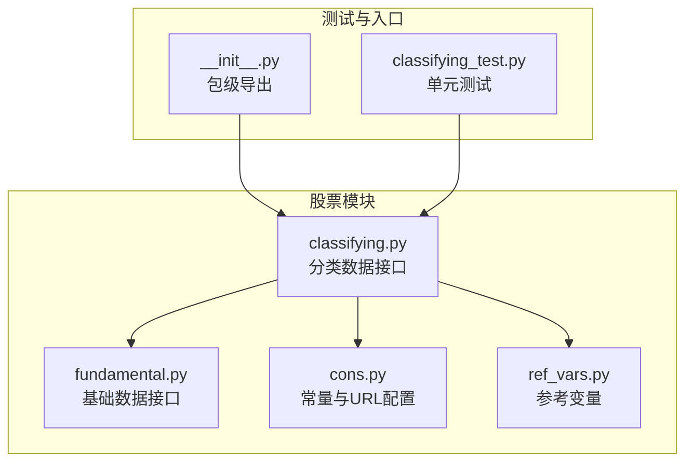
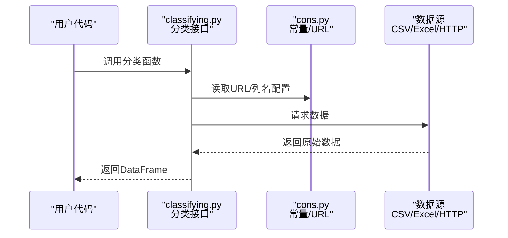
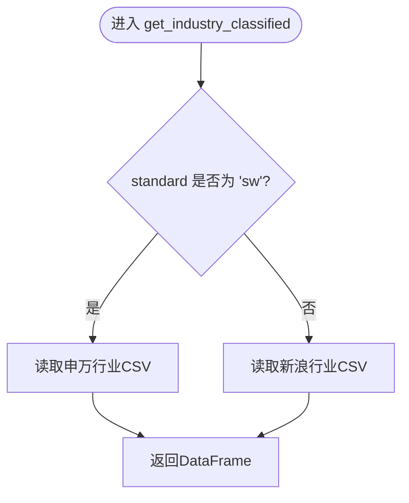
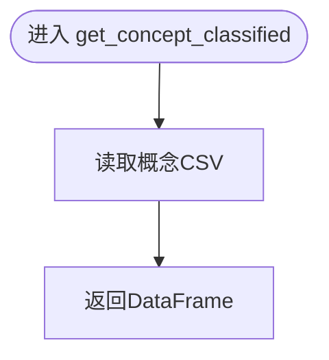
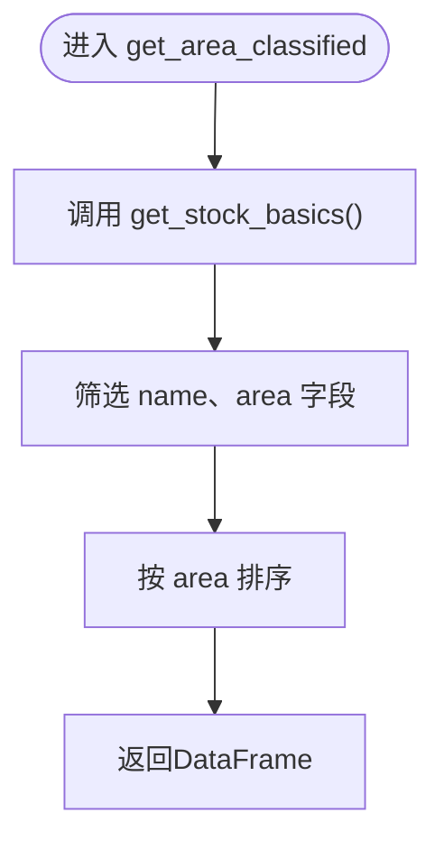
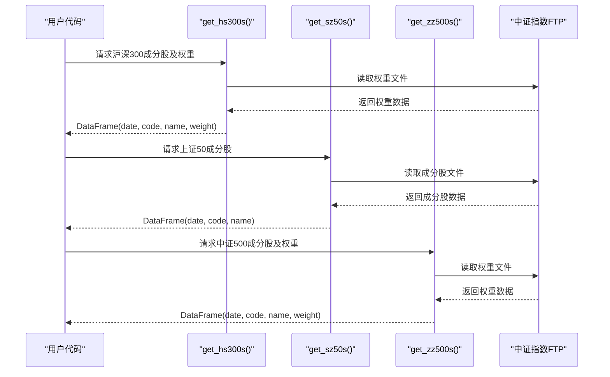
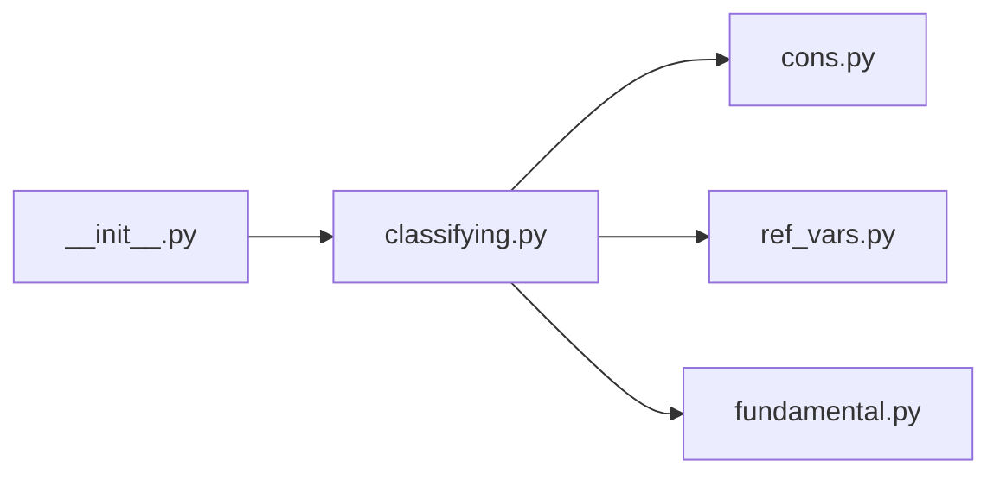

# 分类数据API

<cite>
**本文档引用的文件**
- [classifying.py](file://tushare/stock/classifying.py)
- [cons.py](file://tushare/stock/cons.py)
- [ref_vars.py](file://tushare/stock/ref_vars.py)
- [fundamental.py](file://tushare/stock/fundamental.py)
- [classifying_test.py](file://test/classifying_test.py)
- [__init__.py](file://tushare/__init__.py)
- [README.md](file://README.md)
</cite>

## 目录
1. [简介](#简介)
2. [项目结构](#项目结构)
3. [核心组件](#核心组件)
4. [架构总览](#架构总览)
5. [详细组件分析](#详细组件分析)
6. [依赖关系分析](#依赖关系分析)
7. [性能考量](#性能考量)
8. [故障排查指南](#故障排查指南)
9. [结论](#结论)
10. [附录](#附录)

## 简介
本文件为 TuShare 分类数据 API 的全面参考文档，涵盖行业分类、概念分类、地域分类、指数成分股等分类数据的获取接口。文档详细说明各类分类标准的定义、调整机制与使用方法，并提供行业分析、概念轮动、地域配置等实际应用场景的代码示例路径。同时解释分类数据在投资组合构建、风险管理和资产配置中的重要作用，并给出更新频率与准确性验证的实用指导。

## 项目结构
TuShare 将分类数据封装在股票模块的分类子模块中，通过统一入口导出，便于用户直接调用。核心文件包括：
- 分类数据接口实现：tushare/stock/classifying.py
- 常量与URL配置：tushare/stock/cons.py
- 参考变量与表格列名：tushare/stock/ref_vars.py
- 基础数据获取（用于地域/基础信息）：tushare/stock/fundamental.py
- 测试用例：test/classifying_test.py
- 包级导出：tushare/__init__.py

图表来源
- [classifying.py:1-359](file://tushare/stock/classifying.py#L1-L359)
- [cons.py:1-453](file://tushare/stock/cons.py#L1-L453)
- [ref_vars.py:1-54](file://tushare/stock/ref_vars.py#L1-L54)
- [fundamental.py:1-200](file://tushare/stock/fundamental.py#L1-L200)
- [classifying_test.py:1-51](file://test/classifying_test.py#L1-L51)
- [__init__.py:40-47](file://tushare/__init__.py#L40-L47)

章节来源
- [classifying.py:1-359](file://tushare/stock/classifying.py#L1-L359)
- [cons.py:1-453](file://tushare/stock/cons.py#L1-L453)
- [ref_vars.py:1-54](file://tushare/stock/ref_vars.py#L1-L54)
- [fundamental.py:1-200](file://tushare/stock/fundamental.py#L1-L200)
- [classifying_test.py:1-51](file://test/classifying_test.py#L1-L51)
- [__init__.py:40-47](file://tushare/__init__.py#L40-L47)

## 核心组件
- 行业分类：支持新浪行业与申万行业两种标准，返回股票代码、名称与行业名称。
- 概念分类：返回股票代码、名称与概念名称。
- 地域分类：基于基础数据中的地区字段，返回股票代码、名称与地区。
- 指数成分股：获取沪深300、上证50、中证500的当前成分股及权重。
- 特殊板块：创业板、中小板、ST股票、终止上市、暂停上市等。

章节来源
- [classifying.py:27-359](file://tushare/stock/classifying.py#L27-L359)
- [cons.py:71-76](file://tushare/stock/cons.py#L71-L76)
- [cons.py:112-114](file://tushare/stock/cons.py#L112-L114)
- [ref_vars.py:20-31](file://tushare/stock/ref_vars.py#L20-L31)

## 架构总览
分类数据API的调用流程如下：
- 用户通过包级导出的函数调用分类接口。
- 接口根据配置常量拼接URL，读取CSV或Excel数据，或通过客户端请求解析JSON。
- 返回标准化的DataFrame，包含股票代码、名称以及分类字段。

图表来源
- [classifying.py:27-359](file://tushare/stock/classifying.py#L27-L359)
- [cons.py:71-76](file://tushare/stock/cons.py#L71-L76)
- [cons.py:112-114](file://tushare/stock/cons.py#L112-L114)

## 详细组件分析

### 行业分类接口
- 函数：get_industry_classified(standard='sina')
- 参数：
  - standard：'sina' 或 'sw'
- 返回：DataFrame，包含 code、name、c_name（行业名称）
- 数据来源：
  - 新浪行业：读取行业CSV文件
  - 申万行业：读取申万行业CSV文件
- 使用建议：
  - 标准选择：若需与市场主流一致，优先使用 'sina'；若需与Wind/中证口径一致，使用 'sw'

图表来源
- [classifying.py:27-59](file://tushare/stock/classifying.py#L27-L59)
- [cons.py:75](file://tushare/stock/cons.py#L75)

章节来源
- [classifying.py:27-59](file://tushare/stock/classifying.py#L27-L59)
- [cons.py:75](file://tushare/stock/cons.py#L75)

### 概念分类接口
- 函数：get_concept_classified()
- 返回：DataFrame，包含 code、name、c_name（概念名称）
- 数据来源：读取概念CSV文件
- 扩展：get_concepts() 可获取概念板块行情数据（概念、涨跌、涨跌家数等）

图表来源
- [classifying.py:62-74](file://tushare/stock/classifying.py#L62-L74)
- [cons.py:75](file://tushare/stock/cons.py#L75)

章节来源
- [classifying.py:62-74](file://tushare/stock/classifying.py#L62-L74)
- [classifying.py:93-115](file://tushare/stock/classifying.py#L93-L115)

### 地域分类接口
- 函数：get_area_classified()
- 返回：DataFrame，包含 code、name、area（地区）
- 数据来源：基于基础数据 get_stock_basics() 中的地区字段

图表来源
- [classifying.py:118-132](file://tushare/stock/classifying.py#L118-L132)
- [fundamental.py:22-59](file://tushare/stock/fundamental.py#L22-L59)

章节来源
- [classifying.py:118-132](file://tushare/stock/classifying.py#L118-L132)
- [fundamental.py:22-59](file://tushare/stock/fundamental.py#L22-L59)

### 指数成分股接口
- 沪深300：get_hs300s()
  - 返回：date、code、name、weight（权重）
  - 数据来源：中证指数FTP的权重文件
- 上证50：get_sz50s()
  - 返回：date、code、name
  - 数据来源：中证指数FTP的成分股文件
- 中证500：get_zz500s()
  - 返回：date、code、name、weight（权重）
  - 数据来源：中证指数FTP的权重文件

图表来源
- [classifying.py:233-292](file://tushare/stock/classifying.py#L233-L292)
- [cons.py:112-114](file://tushare/stock/cons.py#L112-L114)

章节来源
- [classifying.py:233-292](file://tushare/stock/classifying.py#L233-L292)
- [cons.py:112-114](file://tushare/stock/cons.py#L112-L114)

### 特殊板块接口
- 创业板：get_gem_classified()
- 中小板：get_sme_classified()
- ST股票：get_st_classified()
- 终止上市：get_terminated()
- 暂停上市：get_suspended()

这些接口基于基础数据进行筛选，返回 code、name。

章节来源
- [classifying.py:135-348](file://tushare/stock/classifying.py#L135-L348)
- [fundamental.py:22-59](file://tushare/stock/fundamental.py#L22-L59)
- [ref_vars.py:20-31](file://tushare/stock/ref_vars.py#L20-L31)

## 依赖关系分析
- classifying.py 依赖：
  - tushare.stock.cons：常量与URL配置（如 TSDATA_CLASS、HS300_CLASSIFY_URL_FTP 等）
  - tushare.stock.ref_vars：参考变量（如终止/暂停上市相关URL）
  - tushare.stock.fundamental：基础数据接口（如 get_stock_basics）
  - pandas：数据处理
  - urllib/requests：网络请求
- 包级导出：通过 tushare/__init__.py 将分类接口导出，供用户直接使用

图表来源
- [classifying.py:11-19](file://tushare/stock/classifying.py#L11-L19)
- [cons.py:1-453](file://tushare/stock/cons.py#L1-L453)
- [ref_vars.py:1-54](file://tushare/stock/ref_vars.py#L1-L54)
- [fundamental.py:1-200](file://tushare/stock/fundamental.py#L1-L200)
- [__init__.py:40-47](file://tushare/__init__.py#L40-L47)

章节来源
- [classifying.py:11-19](file://tushare/stock/classifying.py#L11-L19)
- [cons.py:1-453](file://tushare/stock/cons.py#L1-L453)
- [ref_vars.py:1-54](file://tushare/stock/ref_vars.py#L1-L54)
- [fundamental.py:1-200](file://tushare/stock/fundamental.py#L1-L200)
- [__init__.py:40-47](file://tushare/__init__.py#L40-L47)

## 性能考量
- 网络请求：分类数据多来自CSV/Excel或HTTP接口，建议：
  - 控制并发请求，避免频繁调用导致限流
  - 对于批量数据，尽量缓存结果并在合理周期内复用
- 数据解析：pandas读取CSV/Excel时注意内存占用，建议按需读取列或分批处理
- 错误重试：内部存在重试逻辑，但应结合业务场景设置合理的超时与重试次数

[本节为通用性能建议，不直接分析具体文件]

## 故障排查指南
- 网络错误：若出现网络异常，检查URL是否正确、代理设置、DNS解析
- 数据为空：确认数据源是否可用，CSV/Excel文件是否存在，索引列名是否匹配
- 编码问题：确保读取文本时使用正确的编码（如GBK），避免乱码
- 权重缺失：指数成分股权重可能在特定日期不存在，需检查日期参数

章节来源
- [classifying.py:185-231](file://tushare/stock/classifying.py#L185-L231)
- [cons.py:195](file://tushare/stock/cons.py#L195)

## 结论
TuShare 分类数据API提供了覆盖行业、概念、地域、指数成分股及特殊板块的完整分类体系。通过标准化的DataFrame输出，用户可在投资组合构建、风险管理和资产配置中灵活应用。建议结合数据源的更新频率与准确性，建立定期校验与缓存策略，以提升数据质量与系统稳定性。

[本节为总结性内容，不直接分析具体文件]

## 附录

### 实际应用场景与示例路径
以下为常见应用场景的代码示例路径（不直接展示代码内容）：
- 行业分析：获取行业分类数据，按行业统计涨跌家数、成交额等
  - 示例路径：[classifying_test.py:18](file://test/classifying_test.py#L18)
- 概念轮动：获取概念分类数据，跟踪热点概念板块表现
  - 示例路径：[classifying_test.py:21](file://test/classifying_test.py#L21)
- 地域配置：获取地域分类数据，按区域进行资产配置
  - 示例路径：[classifying_test.py:24](file://test/classifying_test.py#L24)
- 指数成分股：获取沪深300/上证50/中证500成分股及权重，构建基准对比
  - 示例路径：[classifying_test.py:36](file://test/classifying_test.py#L36), [classifying_test.py:39](file://test/classifying_test.py#L39), [classifying_test.py:42](file://test/classifying_test.py#L42)

章节来源
- [classifying_test.py:18-42](file://test/classifying_test.py#L18-L42)

### 分类数据更新频率与准确性验证
- 更新频率：指数成分股权重通常在每月最后一个交易日或定期调整日更新；行业/概念/地域分类数据由数据源定期维护，建议关注官方公告
- 准确性验证：
  - 对比不同标准（如新浪 vs 申万）下的行业分类一致性
  - 校验指数成分股与权重文件的日期一致性
  - 对比历史数据的连续性，发现异常波动或缺失

[本节为通用指导，不直接分析具体文件]