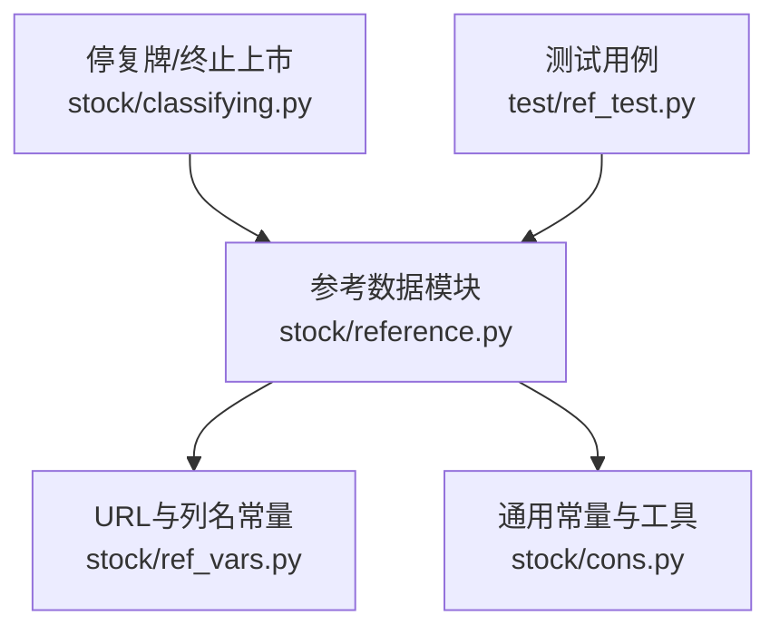
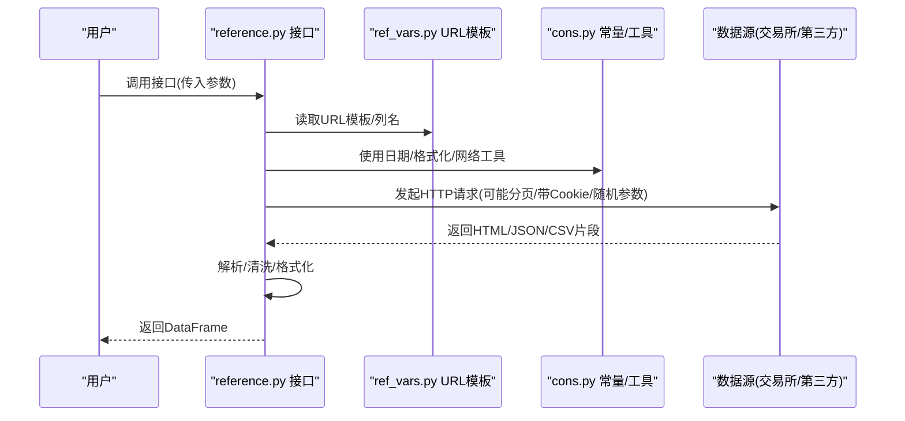
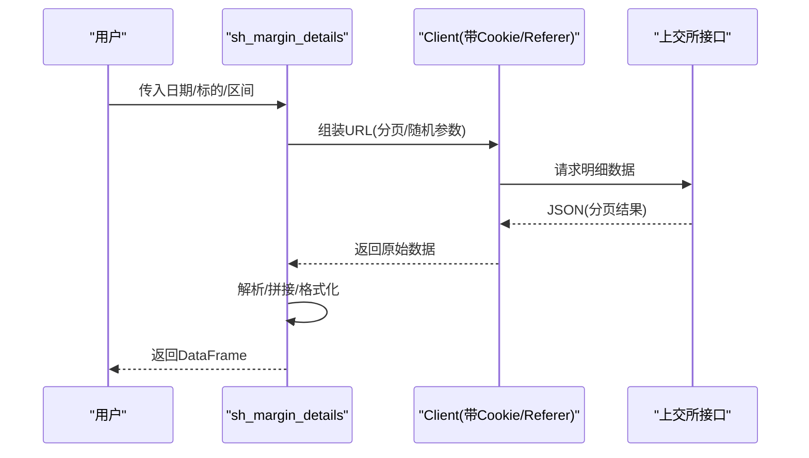
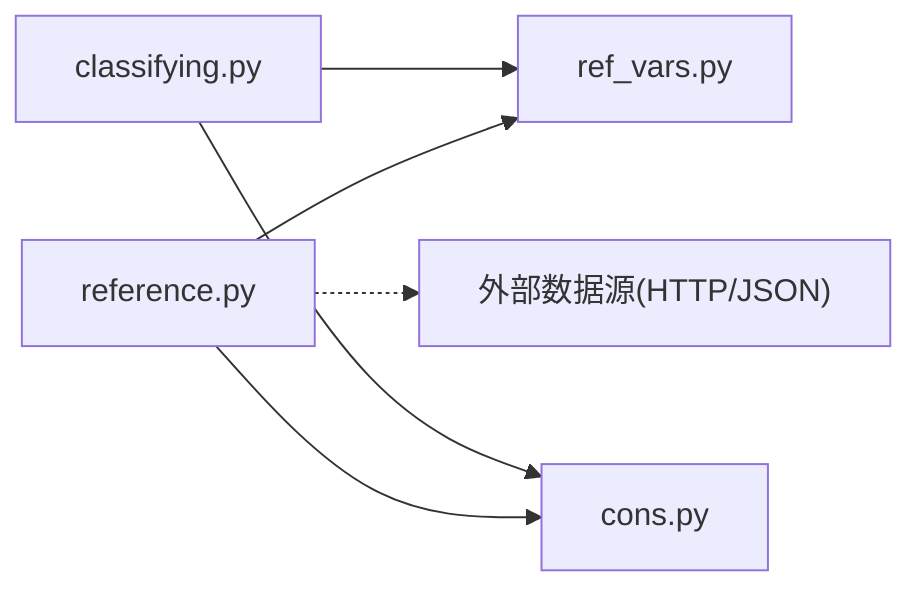

# 参考数据API

<cite>
**本文引用的文件**
- [reference.py](file://tushare/stock/reference.py)
- [ref_vars.py](file://tushare/stock/ref_vars.py)
- [cons.py](file://tushare/stock/cons.py)
- [classifying.py](file://tushare/stock/classifying.py)
- [ref_test.py](file://test/ref_test.py)
- [README.md](file://README.md)
</cite>

## 目录
1. [简介](#简介)
2. [项目结构](#项目结构)
3. [核心组件](#核心组件)
4. [架构总览](#架构总览)
5. [详细组件分析](#详细组件分析)
6. [依赖关系分析](#依赖关系分析)
7. [性能考量](#性能考量)
8. [故障排查指南](#故障排查指南)
9. [结论](#结论)
10. [附录](#附录)

## 简介
本文件面向TuShare参考数据API，系统化梳理融资融券、限售解禁、新股发行、停复牌与终止上市、股票质押与增发、沪深港通资金流等参考信息的接口与使用方式。文档不仅给出各接口的参数、返回字段与典型用法，还解释业务含义、统计口径、使用价值，并结合投资决策场景提供应用示例，帮助用户正确理解与使用这些辅助信息。

## 项目结构
- 参考数据主入口位于 stock/reference.py，封装了多类参考数据接口。
- 常量与URL模板集中于 stock/ref_vars.py 与 stock/cons.py。
- 停复牌与终止上市数据由 stock/classifying.py 提供。
- 测试样例位于 test/ref_test.py，便于验证接口行为。

图表来源
- [reference.py:1-120](file://tushare/stock/reference.py#L1-L120)
- [ref_vars.py:1-54](file://tushare/stock/ref_vars.py#L1-L54)
- [cons.py:1-120](file://tushare/stock/cons.py#L1-L120)
- [classifying.py:294-348](file://tushare/stock/classifying.py#L294-L348)
- [ref_test.py:1-57](file://test/ref_test.py#L1-L57)

章节来源
- [reference.py:1-120](file://tushare/stock/reference.py#L1-L120)
- [ref_vars.py:1-54](file://tushare/stock/ref_vars.py#L1-L54)
- [cons.py:1-120](file://tushare/stock/cons.py#L1-L120)
- [classifying.py:294-348](file://tushare/stock/classifying.py#L294-L348)
- [ref_test.py:1-57](file://test/ref_test.py#L1-L57)

## 核心组件
- 融资融券数据
  - 上交所融资融券汇总与明细：sh_margins、sh_margin_details
  - 深交所融资融券汇总与明细：sz_margins、sz_margin_details
  - 统一维度：信用交易日期、融资买入额、融资余额、融券卖出量、融券余量、融券余量金额、融资融券余额等
- 限售解禁数据：xsg_data
  - 字段：解禁日期、解禁数量（万股）、占总盘比率
- 新股发行数据：new_stocks
  - 字段：上网发行日期、上市日期、发行数量、发行价格、发行市盈率、个人申购上限、募集资金、网上中签率等
- 可转债申购列表：new_cbonds
  - 字段：债券代码/名称、对应股票代码/名称、申购代码、发行总额、最新市场价格、转股价格、首日收盘价、上网发行/上市日期、中签率、打新收益率、每中一股收益
- 停复牌与终止上市：get_suspended、get_terminated
  - 字段：股票代码、名称、上市日期、终止/暂停日期
- 股票质押与增发：stock_pledged、pledged_detail、stock_issuance
  - 质押：质押次数、无限售/限售股质押数量、总股本、质押比例
  - 增发：类型、数量、增发价格、最近收盘价、增发/上市日期、锁定期、当前溢价
- 沪深港通资金流：moneyflow_hsgt
  - 字段：日期、港股通(沪)/港股通(深)、沪港通/深港通、北向/南向资金流入
- 基金持股：fund_holdings
  - 字段：报告日期、基金家数、与上期对比、基金持股数、持股市值、占流通盘比率
- 利润分配与业绩预告：profit_data、forecast_data、profit_divis
  - 分红送转：预案公告、送转总数、派现、股权登记日、除权除息日、事件进程、公告日期
  - 业绩预告：业绩变动类型、上年同期EPS、变动范围
- 十大股东与十大流通股东：top10_holders
  - 字段：报告期、合计持股、变动、占流通比；个人股东明细：名称、持股、占比、股份性质、状态
- 融资融券标的与可充抵保证金证券：margin_target、margin_offset、margin_zsl
  - 标的：是否为融资/融券标的
  - 可充抵：可充抵保证金证券清单
  - 折算率：不同券商的折算比例

章节来源
- [reference.py:262-460](file://tushare/stock/reference.py#L262-L460)
- [reference.py:537-820](file://tushare/stock/reference.py#L537-L820)
- [reference.py:901-1082](file://tushare/stock/reference.py#L901-L1082)
- [classifying.py:294-348](file://tushare/stock/classifying.py#L294-L348)
- [ref_vars.py:32-54](file://tushare/stock/ref_vars.py#L32-L54)
- [cons.py:118-126](file://tushare/stock/cons.py#L118-L126)

## 架构总览
参考数据API围绕“数据源解析/抓取—结构化处理—统一返回”的流程组织，主要依赖如下：
- 数据源：上交所、深交所、东方财富、同花顺/Choice等第三方站点
- 工具库：pandas进行表格解析与数据清洗，lxml/requests进行网页抓取，json解析接口返回
- 常量与URL模板：集中于ref_vars.py与cons.py，便于维护与扩展
- 控制流：重试机制、分页抓取、日期范围校验、格式化输出

图表来源
- [reference.py:537-616](file://tushare/stock/reference.py#L537-L616)
- [ref_vars.py:14-21](file://tushare/stock/ref_vars.py#L14-L21)
- [cons.py:19-45](file://tushare/stock/cons.py#L19-L45)

章节来源
- [reference.py:537-616](file://tushare/stock/reference.py#L537-L616)
- [ref_vars.py:14-21](file://tushare/stock/ref_vars.py#L14-L21)
- [cons.py:19-45](file://tushare/stock/cons.py#L19-L45)

## 详细组件分析

### 融资融券（上交所）
- 接口：sh_margins、sh_margin_details
- 关键点
  - 日期参数支持区间查询；明细支持按日期或标的代码过滤
  - 使用Client携带Cookie与Referer，构造分页参数
  - 对返回JSON进行分页拆解，统一列名并格式化日期
- 应用示例
  - 资金流向分析：对比融资买入额与融券卖出量变化，识别杠杆资金活跃度
  - 流动性评估：观察融资余额与融券余量，判断市场情绪与潜在抛压
  - 风险监控：关注融资融券余额异常增长，结合股价走势进行风险提示

图表来源
- [reference.py:618-710](file://tushare/stock/reference.py#L618-L710)
- [ref_vars.py:14-19](file://tushare/stock/ref_vars.py#L14-L19)
- [cons.py:19-33](file://tushare/stock/cons.py#L19-L33)

章节来源
- [reference.py:537-710](file://tushare/stock/reference.py#L537-L710)
- [ref_vars.py:14-19](file://tushare/stock/ref_vars.py#L14-L19)
- [cons.py:19-33](file://tushare/stock/cons.py#L19-L33)

### 融资融券（深交所）
- 接口：sz_margins、sz_margin_details
- 关键点
  - 深市按工作日逐日抓取，支持日期范围不超过一年的限制提示
  - 明细接口按日期抓取，返回标准化列名
- 应用示例
  - 与上交所数据联动，观察跨市场资金流向差异
  - 将融券余量与个股换手率结合，识别潜在做空压力

章节来源
- [reference.py:712-820](file://tushare/stock/reference.py#L712-L820)
- [ref_vars.py:17-18](file://tushare/stock/ref_vars.py#L17-L18)
- [cons.py:19-33](file://tushare/stock/cons.py#L19-L33)

### 限售解禁
- 接口：xsg_data
- 关键点
  - 默认取当前年月，返回解禁日期、解禁数量与占总盘比率
  - 数据来源于东方财富接口，字段映射与格式化处理
- 应用示例
  - 流通压力评估：筛选未来3个月解禁规模较大的股票，结合估值进行风险提示
  - 资金流向分析：解禁前后股价异动与成交量变化，辅助择时策略

章节来源
- [reference.py:262-312](file://tushare/stock/reference.py#L262-L312)
- [ref_vars.py](file://tushare/stock/ref_vars.py#L6)
- [cons.py:19-45](file://tushare/stock/cons.py#L19-L45)

### 新股发行与可转债
- 接口：new_stocks、new_cbonds
- 关键点
  - 新股：包含上网发行日期、上市日期、发行数量、发行价格、PE、申购上限、募集资金、中签率等
  - 可转债：包含债券/股票代码、发行总额、最新市价、转股价格、首日收盘价、发行/上市日期、中签率、打新收益率、每中一股收益
- 应用示例
  - 打新策略：筛选高性价比可转债与次新股，结合中签率与首日预期收益构建组合
  - 流动性评估：关注发行规模与网下配售情况，判断上市初期流动性

章节来源
- [reference.py:393-535](file://tushare/stock/reference.py#L393-L535)
- [ref_vars.py:12-13](file://tushare/stock/ref_vars.py#L12-L13)
- [cons.py:19-45](file://tushare/stock/cons.py#L19-L45)

### 停复牌与终止上市
- 接口：get_suspended、get_terminated
- 关键点
  - 通过上交所接口获取暂停/终止上市股票列表，统一列名
- 应用示例
  - 风控：剔除已停牌/终止股票，避免无效持仓
  - 事件驱动：复牌后短期异动跟踪，结合公告解读进行交易

章节来源
- [classifying.py:294-348](file://tushare/stock/classifying.py#L294-L348)
- [ref_vars.py:20-21](file://tushare/stock/ref_vars.py#L20-L21)
- [cons.py:19-33](file://tushare/stock/cons.py#L19-L33)

### 股票质押与增发
- 接口：stock_pledged、pledged_detail、stock_issuance
- 关键点
  - 质押：统计质押次数、无限售/限售股质押数量、总股本、质押比例
  - 增发：筛选区间内增发，计算当前溢价
- 应用示例
  - 信用风险：关注质押比例异常上升与解质押窗口，评估爆仓风险
  - 估值影响：增发价格与当前价格差距反映市场对未来预期

章节来源
- [reference.py:974-1082](file://tushare/stock/reference.py#L974-L1082)
- [cons.py:122-126](file://tushare/stock/cons.py#L122-L126)

### 沪深港通资金流
- 接口：moneyflow_hsgt
- 关键点
  - 返回单位为百万元，列名标准化为日期、港股通(沪)/深、沪港通/深港通、北向/南向
- 应用示例
  - 资金流向分析：北向资金连续净流入/流出作为趋势信号之一
  - 风险监控：北向大幅减仓配合市场下跌，需警惕系统性风险

章节来源
- [reference.py:874-899](file://tushare/stock/reference.py#L874-L899)
- [ref_vars.py:50-54](file://tushare/stock/ref_vars.py#L50-L54)
- [cons.py:19-33](file://tushare/stock/cons.py#L19-L33)

### 基金持股
- 接口：fund_holdings
- 关键点
  - 按季度报告，返回报告日期、基金家数、持股数、持股市值、占流通盘比率等
- 应用示例
  - 资金流向：观察基金加仓/减仓方向，结合行业轮动策略
  - 流动性评估：关注基金集中度与持股市值变化，判断短期抛压

章节来源
- [reference.py:313-391](file://tushare/stock/reference.py#L313-L391)
- [ref_vars.py:37-41](file://tushare/stock/ref_vars.py#L37-L41)
- [cons.py:19-45](file://tushare/stock/cons.py#L19-L45)

### 利润分配与业绩预告
- 接口：profit_data、profit_divis、forecast_data
- 关键点
  - 利润分配：预案公告、送转总数、派现、登记日、除权除息日、事件进程、公告日期
  - 业绩预告：业绩变动类型、上年同期EPS、变动范围
- 应用示例
  - 估值影响：高送转预期提升市场关注度，但需结合盈利质量判断
  - 交易信号：业绩预告超预期/低于预期作为短期交易依据之一

章节来源
- [reference.py:27-116](file://tushare/stock/reference.py#L27-L116)
- [reference.py:155-203](file://tushare/stock/reference.py#L155-L203)
- [reference.py:204-261](file://tushare/stock/reference.py#L204-L261)
- [ref_vars.py:3-4](file://tushare/stock/ref_vars.py#L3-L4)
- [cons.py:53-54](file://tushare/stock/cons.py#L53-L54)

### 十大股东与十大流通股东
- 接口：top10_holders
- 关键点
  - 支持按报告期筛选，返回合计与个人明细
- 应用示例
  - 资金流向：机构动向与股价表现的关联分析
  - 风险监控：大股东减持窗口期的风险提示

章节来源
- [reference.py:823-871](file://tushare/stock/reference.py#L823-L871)
- [ref_vars.py:22-31](file://tushare/stock/ref_vars.py#L22-L31)
- [cons.py:19-33](file://tushare/stock/cons.py#L19-L33)

### 融资融券标的与可充抵保证金证券
- 接口：margin_target、margin_offset、margin_zsl
- 关键点
  - 标的：融资/融券标的范围
  - 可充抵：可充抵保证金证券清单
  - 折算率：不同券商折算比例
- 应用示例
  - 交易成本：选择折算率较高标的，降低维持成本
  - 风控：优先选择Margin Target范围内的股票，减少交易限制

章节来源
- [reference.py:930-1047](file://tushare/stock/reference.py#L930-L1047)
- [cons.py:120-126](file://tushare/stock/cons.py#L120-L126)

## 依赖关系分析
- 模块耦合
  - reference.py 依赖 ref_vars.py 的URL模板与列名定义，依赖 cons.py 的域名/页面/格式化等常量
  - classifying.py 与 reference.py 在停复牌/终止上市数据上互补
- 外部依赖
  - 上交所/深交所接口、东方财富、第三方数据站点
  - pandas、lxml、json、urllib/requests
- 潜在风险
  - 第三方站点变更导致接口失效
  - 分页/反爬策略变化，需完善重试与随机参数

图表来源
- [reference.py:1-120](file://tushare/stock/reference.py#L1-L120)
- [ref_vars.py:1-54](file://tushare/stock/ref_vars.py#L1-L54)
- [cons.py:1-120](file://tushare/stock/cons.py#L1-L120)
- [classifying.py:294-348](file://tushare/stock/classifying.py#L294-L348)

章节来源
- [reference.py:1-120](file://tushare/stock/reference.py#L1-L120)
- [ref_vars.py:1-54](file://tushare/stock/ref_vars.py#L1-L54)
- [cons.py:1-120](file://tushare/stock/cons.py#L1-L120)
- [classifying.py:294-348](file://tushare/stock/classifying.py#L294-L348)

## 性能考量
- 分页抓取与重试
  - 多数接口采用分页抓取，建议合理设置 retry_count 与 pause，避免触发风控
- 日期范围控制
  - 深市融资融券明确一年范围限制，建议按周/月分批拉取
- 数据清洗与格式化
  - 数值字段统一格式化与单位转换，注意缺失值处理
- 缓存与增量
  - 建议本地缓存关键参考表（如停复牌、标的、折算率），按天增量更新

## 故障排查指南
- 网络错误
  - 现象：抛出网络错误提示
  - 处理：增大 retry_count，适当提高 pause；检查代理/防火墙
- 日期输入错误
  - 现象：输入格式或范围不合法
  - 处理：遵循YYYY-MM-DD格式，确保 start ≤ end
- 深市数据为空
  - 现象：返回空DataFrame
  - 处理：确认日期非节假日且在允许范围内；检查目标日期是否有披露
- 第三方站点变更
  - 现象：解析失败或字段错位
  - 处理：核对URL模板与列名映射，必要时更新

章节来源
- [cons.py:193-199](file://tushare/stock/cons.py#L193-L199)
- [reference.py:740-756](file://tushare/stock/reference.py#L740-L756)
- [ref_test.py:1-57](file://test/ref_test.py#L1-L57)

## 结论
参考数据API为投资研究与风控提供了丰富的辅助信息。建议将融资融券、限售解禁、停复牌/终止上市、股票质押与增发、沪深港通资金流等数据纳入日常监控体系，结合股价与成交量进行交叉验证，形成更稳健的投资决策支持。同时，注意数据滞后性与第三方接口稳定性，建立完善的重试与缓存机制。

## 附录
- 快速上手
  - 安装与升级：参考项目自述文件中的安装与升级说明
  - 示例：参考测试用例中的调用方式，逐步验证各接口返回字段与数据范围

章节来源
- [README.md:30-42](file://README.md#L30-L42)
- [ref_test.py:19-53](file://test/ref_test.py#L19-L53)