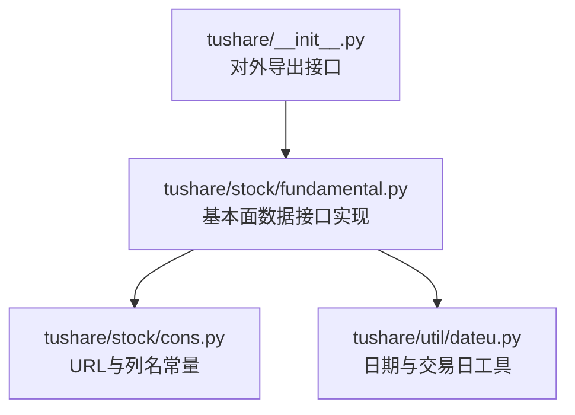
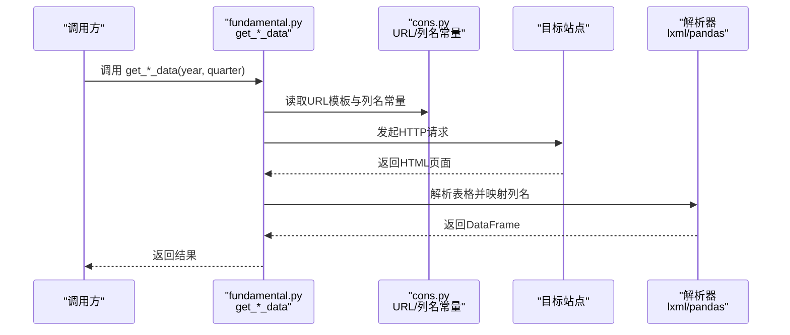
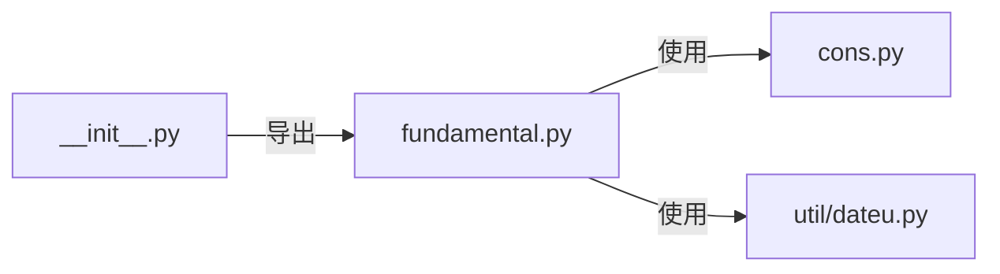

# 基本面数据API

<cite>
**本文引用的文件**
- [tushare\stock\fundamental.py](file://tushare/stock/fundamental.py)
- [tushare\stock\cons.py](file://tushare/stock/cons.py)
- [tushare\util\dateu.py](file://tushare/util/dateu.py)
- [tushare\__init__.py](file://tushare/__init__.py)
- [README.md](file://README.md)
</cite>

## 目录
1. [简介](#简介)
2. [项目结构](#项目结构)
3. [核心组件](#核心组件)
4. [架构总览](#架构总览)
5. [详细组件分析](#详细组件分析)
6. [依赖关系分析](#依赖关系分析)
7. [性能考量](#性能考量)
8. [故障排查指南](#故障排查指南)
9. [结论](#结论)
10. [附录](#附录)

## 简介
本文件为 TuShare 基本面数据 API 的权威参考文档，聚焦财务报表与多项财务指标的获取接口，涵盖以下核心函数：
- get_stock_basics：获取沪深上市公司基础信息
- get_report_data：获取业绩报表数据
- get_profit_data：获取盈利能力数据
- get_operation_data：获取营运能力数据
- get_growth_data：获取成长能力数据
- get_debtpaying_data：获取偿债能力数据
- get_cashflow_data：获取现金流量数据
- get_balance_sheet / get_profit_statement / get_cash_flow：按股票代码获取历史报表

文档将系统阐述各函数的功能、参数、返回格式，并结合实际应用场景给出数据清洗、指标计算与趋势分析的实践建议；同时解释财务数据的时间维度、合并报表处理等专业概念。

## 项目结构
TuShare 将基本面数据接口集中于 stock 子包下的 fundamental.py 文件，并通过全局入口 __init__.py 对外暴露。常量与URL模板定义在 stock/cons.py，日期工具在 util/dateu.py。

图表来源
- [tushare\__init__.py](file://tushare/__init__.py)
- [tushare\stock\fundamental.py](file://tushare/stock/fundamental.py)
- [tushare\stock\cons.py](file://tushare/stock/cons.py)
- [tushare\util\dateu.py](file://tushare/util/dateu.py)

章节来源
- [tushare\__init__.py](file://tushare/__init__.py)
- [tushare\stock\fundamental.py](file://tushare/stock/fundamental.py)
- [tushare\stock\cons.py](file://tushare/stock/cons.py)
- [tushare\util\dateu.py](file://tushare/util/dateu.py)

## 核心组件
- get_stock_basics(date=None)
  - 功能：获取沪深上市公司基本情况
  - 参数：date（YYYY-MM-DD，默认为上一个交易日）
  - 返回：DataFrame，包含代码、名称、细分行业、地区、市盈率、流通股本、总股本、总资产、流动资产、固定资产、公积金、每股公积金、每股收益、每股净资产、市净率、上市日期等字段
  - 时间限制：仅能提供 2016-08-09 之后的历史数据
- get_report_data(year, quarter)
  - 功能：获取业绩报表数据
  - 参数：year（年）、quarter（1、2、3、4）
  - 返回：DataFrame，包含代码、名称、每股收益、每股收益同比、每股净资产、净资产收益率、每股现金流量、净利润、净利润同比、分配方案、发布日期等字段
- get_profit_data(year, quarter)
  - 功能：获取盈利能力数据
  - 返回：DataFrame，包含代码、名称、净资产收益率、净利率、毛利率、净利润、每股收益、营业收入、每股主营业务收入等字段
- get_operation_data(year, quarter)
  - 功能：获取营运能力数据
  - 返回：DataFrame，包含代码、名称、应收账款周转率、应收账款周转天数、存货周转率、存货周转天数、流动资产周转率、流动资产周转天数等字段
- get_growth_data(year, quarter)
  - 功能：获取成长能力数据
  - 返回：DataFrame，包含代码、名称、主营业务收入增长率、净利润增长率、净资产增长率、总资产增长率、每股收益增长率、股东权益增长率等字段
- get_debtpaying_data(year, quarter)
  - 功能：获取偿债能力数据
  - 返回：DataFrame，包含代码、名称、流动比率、速动比率、现金比率、利息支付倍数、股东权益比率、股东权益增长率等字段
- get_cashflow_data(year, quarter)
  - 功能：获取现金流量数据
  - 返回：DataFrame，包含代码、名称、经营现金净流量对销售收入比率、资产的经营现金流量回报率、经营现金净流量与净利润的比率、经营现金净流量对负债比率、现金流量比率等字段
- get_balance_sheet(code) / get_profit_statement(code) / get_cash_flow(code)
  - 功能：按股票代码获取历史所有时期的资产负债表、利润表、现金流表
  - 参数：code（股票代码）
  - 返回：DataFrame，列名为中文，数量较多，建议保存到本地查看

章节来源
- [tushare\stock\fundamental.py](file://tushare/stock/fundamental.py)
- [tushare\stock\cons.py](file://tushare/stock/cons.py)

## 架构总览
基本面数据接口采用“参数校验 -> 请求构造 -> 网络抓取 -> HTML解析 -> 结果拼接”的流程，统一通过 cons.py 中的 URL 模板与列名常量进行数据映射。

图表来源
- [tushare\stock\fundamental.py](file://tushare/stock/fundamental.py)
- [tushare\stock\cons.py](file://tushare/stock/cons.py)

## 详细组件分析

### get_stock_basics(date=None)
- 功能要点
  - 日期参数默认取上一个交易日
  - 数据来源为远程CSV文件，内部会将日期转换为指定格式
  - 对早于 2016-08-09 的日期直接返回 None
  - 返回值以 code 为索引的 DataFrame
- 参数与返回
  - 参数：date（YYYY-MM-DD）
  - 返回：DataFrame（字段见“核心组件”小节）
- 使用建议
  - 若需跨期对比，建议固定 date 或使用 last_tddate() 获取最近交易日
  - 注意数据时效性与完整性，必要时进行缺失值处理

章节来源
- [tushare\stock\fundamental.py](file://tushare/stock/fundamental.py)
- [tushare\util\dateu.py](file://tushare/util/dateu.py)

### get_report_data(year, quarter)
- 功能要点
  - 支持分页抓取，自动识别下一页并递归拉取
  - 列名映射至 REPORT_COLS
  - 末尾会将 code 格式化为6位字符串
- 参数与返回
  - 参数：year（整数）、quarter（1、2、3、4）
  - 返回：DataFrame（字段见“核心组件”小节）
- 错误处理
  - 网络异常时抛出 NETWORK_URL_ERROR_MSG 提示

章节来源
- [tushare\stock\fundamental.py](file://tushare/stock/fundamental.py)
- [tushare\stock\cons.py](file://tushare/stock/cons.py)

### get_profit_data(year, quarter)
- 功能要点
  - 列名映射至 PROFIT_COLS
  - 分页抓取逻辑与 get_report_data 类似
- 参数与返回
  - 参数：year（整数）、quarter（1、2、3、4）
  - 返回：DataFrame（字段见“核心组件”小节）

章节来源
- [tushare\stock\fundamental.py](file://tushare/stock/fundamental.py)
- [tushare\stock\cons.py](file://tushare/stock/cons.py)

### get_operation_data(year, quarter)
- 功能要点
  - 列名映射至 OPERATION_COLS
- 参数与返回
  - 参数：year（整数）、quarter（1、2、3、4）
  - 返回：DataFrame（字段见“核心组件”小节）

章节来源
- [tushare\stock\fundamental.py](file://tushare/stock/fundamental.py)
- [tushare\stock\cons.py](file://tushare/stock/cons.py)

### get_growth_data(year, quarter)
- 功能要点
  - 列名映射至 GROWTH_COLS
- 参数与返回
  - 参数：year（整数）、quarter（1、2、3、4）
  - 返回：DataFrame（字段见“核心组件”小节）

章节来源
- [tushare\stock\fundamental.py](file://tushare/stock/fundamental.py)
- [tushare\stock\cons.py](file://tushare/stock/cons.py)

### get_debtpaying_data(year, quarter)
- 功能要点
  - 列名映射至 DEBTPAYING_COLS
- 参数与返回
  - 参数：year（整数）、quarter（1、2、3、4）
  - 返回：DataFrame（字段见“核心组件”小节）

章节来源
- [tushare\stock\fundamental.py](file://tushare/stock/fundamental.py)
- [tushare\stock\cons.py](file://tushare/stock/cons.py)

### get_cashflow_data(year, quarter)
- 功能要点
  - 列名映射至 CASHFLOW_COLS
- 参数与返回
  - 参数：year（整数）、quarter（1、2、3、4）
  - 返回：DataFrame（字段见“核心组件”小节）

章节来源
- [tushare\stock\fundamental.py](file://tushare/stock/fundamental.py)
- [tushare\stock\cons.py](file://tushare/stock/cons.py)

### 报表级接口：get_balance_sheet / get_profit_statement / get_cash_flow
- 功能要点
  - 以股票代码为参数，获取该股票历史所有时期的资产负债表、利润表、现金流表
  - 返回 DataFrame，列名为中文，数量较多，建议保存到本地查看
- 参数与返回
  - 参数：code（股票代码）
  - 返回：DataFrame（字段为中文列名）

章节来源
- [tushare\stock\fundamental.py](file://tushare/stock/fundamental.py)

## 依赖关系分析
- 接口依赖
  - fundamental.py 依赖 cons.py 提供的 URL 模板与列名常量
  - fundamental.py 依赖 util/dateu.py 提供的 last_tddate 等日期工具
  - 全局入口 __init__.py 将基本面接口对外导出
- 数据流耦合
  - 所有 get_*_data 函数共享相同的分页抓取与解析模式，耦合度低、内聚性强
  - 返回值均为 DataFrame，便于后续统一处理

图表来源
- [tushare\stock\fundamental.py](file://tushare/stock/fundamental.py)
- [tushare\stock\cons.py](file://tushare/stock/cons.py)
- [tushare\util\dateu.py](file://tushare/util/dateu.py)
- [tushare\__init__.py](file://tushare/__init__.py)

章节来源
- [tushare\stock\fundamental.py](file://tushare/stock/fundamental.py)
- [tushare\stock\cons.py](file://tushare/stock/cons.py)
- [tushare\util\dateu.py](file://tushare/util/dateu.py)
- [tushare\__init__.py](file://tushare/__init__.py)

## 性能考量
- 网络与分页
  - 各 get_*_data 函数采用分页抓取，需遍历多页，整体耗时与季度跨度和页大小相关
  - 建议控制并发与重试次数，避免对目标站点造成过大压力
- 数据规模
  - 返回 DataFrame 通常包含数百至上千行，建议按需筛选列与行，减少内存占用
- 缓存策略
  - 对高频查询的季度数据可考虑本地缓存 CSV，提升二次访问速度

## 故障排查指南
- 网络错误
  - 现象：抛出 NETWORK_URL_ERROR_MSG
  - 处理：检查网络连接、重试机制、适当增大超时时间
- 输入参数错误
  - 现象：抛出 DATE_CHK_MSG 或 DATE_CHK_Q_MSG
  - 处理：确保 year ≥ 1989，quarter ∈ {1,2,3,4}
- 日期越界
  - 现象：get_stock_basics 在早于 2016-08-09 的日期返回 None
  - 处理：使用 last_tddate() 获取最近交易日或调整 date 至允许范围内
- 数据解析异常
  - 现象：HTML 页面结构变化导致解析失败
  - 处理：检查 cons.py 中的 URL 与列名映射是否匹配，必要时更新解析逻辑

章节来源
- [tushare\stock\fundamental.py](file://tushare/stock/fundamental.py)
- [tushare\stock\cons.py](file://tushare/stock/cons.py)
- [tushare\util\dateu.py](file://tushare/util/dateu.py)

## 结论
TuShare 的基本面数据 API 以清晰的函数职责与统一的解析流程，提供了覆盖财务报表与多项财务指标的便捷接口。通过合理的时间维度选择、参数校验与错误处理，可高效完成财务数据的采集、清洗与分析任务。建议在生产环境中结合缓存与限流策略，确保稳定与合规使用。

## 附录

### 实际应用示例（步骤说明）
- 财务指标计算
  - 从 get_profit_data 获取 ROE、净利率、毛利率等，结合 get_report_data 的 EPS、净利润等进行复合指标计算
- 数据清洗
  - 对缺失值进行填充或剔除；对字符串型数值进行数值化处理；统一单位（如万元、百万元）
- 趋势分析
  - 使用 get_profit_data、get_operation_data、get_growth_data 等按季度拼接同一公司多期数据，绘制趋势图
- 时间维度与报表处理
  - 季度数据以年+季度为维度；若需年报，可结合 get_balance_sheet / get_profit_statement / get_cash_flow 获取历史报表，注意合并报表与单体报表差异

### 专业概念说明
- 时间维度
  - 季报：按季度（1、2、3、4）组织；可通过 util/dateu.py 的 get_q_date 生成季度末日期
- 合并报表
  - 本库返回数据通常为合并报表口径；若需单体报表，可使用 get_balance_sheet / get_profit_statement / get_cash_flow 获取历史报表并自行判断

章节来源
- [tushare\util\dateu.py](file://tushare/util/dateu.py)
- [tushare\stock\fundamental.py](file://tushare/stock/fundamental.py)