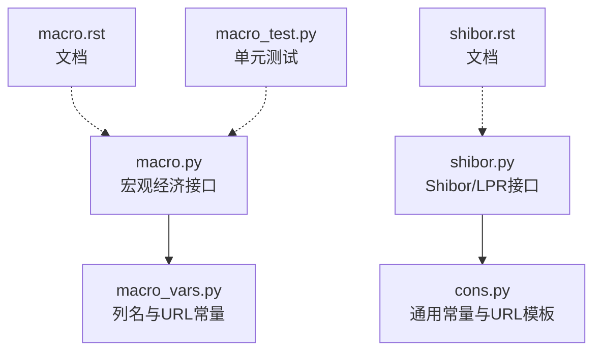
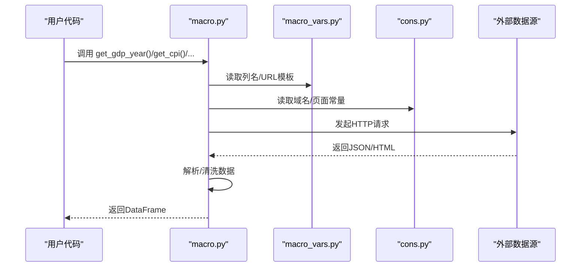
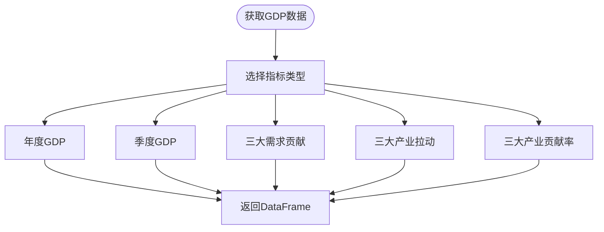
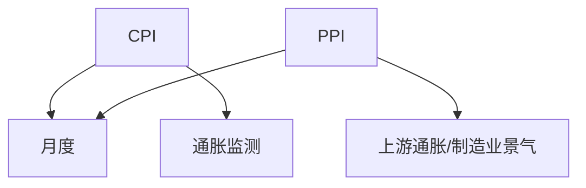
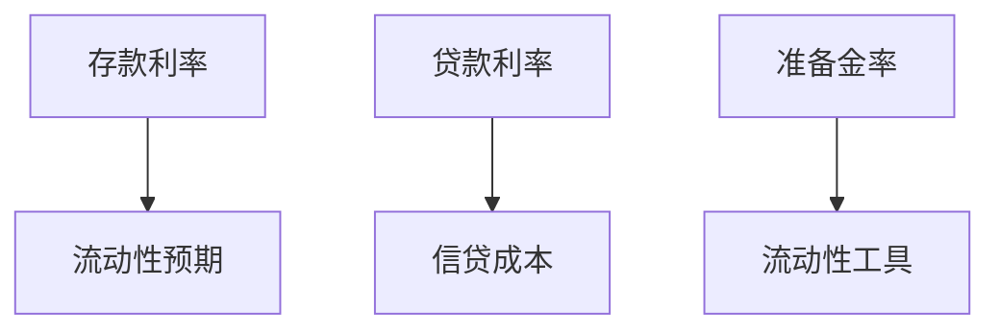
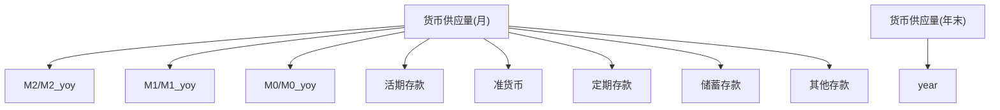
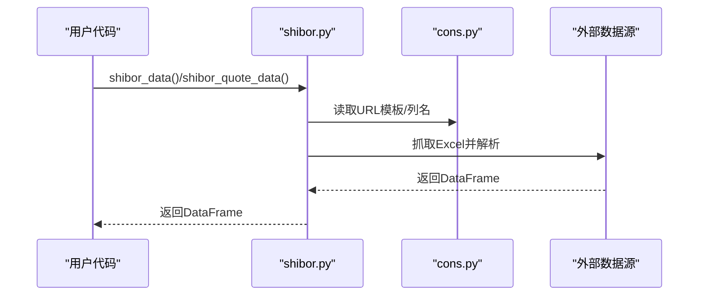
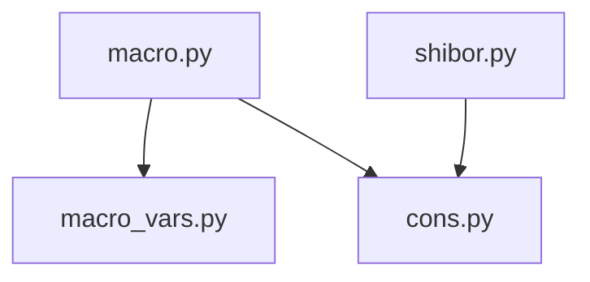

# 宏观经济API

<cite>
**本文引用的文件**
- [macro.py](file://tushare/stock/macro.py)
- [macro_vars.py](file://tushare/stock/macro_vars.py)
- [shibor.py](file://tushare/stock/shibor.py)
- [cons.py](file://tushare/stock/cons.py)
- [macro.rst](file://docs/macro.rst)
- [shibor.rst](file://docs/shibor.rst)
- [macro_test.py](file://test/macro_test.py)
- [README.md](file://README.md)
</cite>

## 目录
1. [简介](#简介)
2. [项目结构](#项目结构)
3. [核心组件](#核心组件)
4. [架构总览](#架构总览)
5. [详细组件分析](#详细组件分析)
6. [依赖关系分析](#依赖关系分析)
7. [性能考量](#性能考量)
8. [故障排查指南](#故障排查指南)
9. [结论](#结论)
10. [附录](#附录)

## 简介
本文件为 TuShare 宏观经济API的权威参考文档，覆盖GDP、CPI、PPI、存贷款利率、货币供应量、Shibor/LPR等关键宏观经济指标的接口说明、字段含义、统计口径、发布周期与使用场景，并结合实际应用给出经济周期判断、政策影响分析与市场预测思路，帮助用户正确理解与使用宏观经济数据。

## 项目结构
TuShare 的宏观经济API主要位于 tushare/stock 目录下，核心文件包括：
- 宏观经济主接口：tushare/stock/macro.py
- 宏观变量与URL常量：tushare/stock/macro_vars.py
- 银行间拆放利率（Shibor/LPR）：tushare/stock/shibor.py
- 通用常量与URL模板：tushare/stock/cons.py
- 文档：docs/macro.rst、docs/shibor.rst
- 测试：test/macro_test.py

图表来源
- [macro.py:1-422](file://tushare/stock/macro.py#L1-L422)
- [macro_vars.py:1-25](file://tushare/stock/macro_vars.py#L1-L25)
- [shibor.py:1-207](file://tushare/stock/shibor.py#L1-L207)
- [cons.py:1-453](file://tushare/stock/cons.py#L1-L453)

章节来源
- [macro.py:1-422](file://tushare/stock/macro.py#L1-L422)
- [macro_vars.py:1-25](file://tushare/stock/macro_vars.py#L1-L25)
- [shibor.py:1-207](file://tushare/stock/shibor.py#L1-L207)
- [cons.py:1-453](file://tushare/stock/cons.py#L1-L453)
- [macro.rst:1-483](file://docs/macro.rst#L1-L483)
- [shibor.rst:1-255](file://docs/shibor.rst#L1-L255)
- [macro_test.py:1-50](file://test/macro_test.py#L1-L50)

## 核心组件
- 宏观经济接口模块（macro.py）
  - 提供GDP（年度/季度/三大需求贡献/拉动/贡献率）、CPI、PPI、存贷款利率、存款准备金率、货币供应量（月度/年末余额）、黄金与外汇储备等接口。
  - 返回结构统一为pandas DataFrame，列名由macro_vars.py定义。
- 银行间拆放利率模块（shibor.py）
  - 提供Shibor拆放利率、报价数据、均值数据；以及LPR及其均值数据。
  - 统一使用cons.py中的URL模板与列名常量。
- 变量与URL常量（macro_vars.py、cons.py）
  - 定义列名、URL模板、域名、页面路径等，确保接口稳定与可维护。

章节来源
- [macro.py:23-422](file://tushare/stock/macro.py#L23-L422)
- [macro_vars.py:6-19](file://tushare/stock/macro_vars.py#L6-L19)
- [shibor.py:16-207](file://tushare/stock/shibor.py#L16-L207)
- [cons.py:19-45](file://tushare/stock/cons.py#L19-L45)

## 架构总览
宏观API采用“接口函数 + 常量定义”的分层设计：
- 接口层：macro.py、shibor.py
- 常量层：macro_vars.py、cons.py
- 数据层：通过新浪/上清所等外部数据源抓取JSON/Excel，解析为DataFrame

图表来源
- [macro.py:23-55](file://tushare/stock/macro.py#L23-L55)
- [macro_vars.py:6-19](file://tushare/stock/macro_vars.py#L6-L19)
- [cons.py:19-45](file://tushare/stock/cons.py#L19-L45)

## 详细组件分析

### GDP系列指标
- 年度GDP（get_gdp_year）
  - 字段：year、gdp、pc_gdp、gnp、pi、si、industry、cons_industry、ti、trans_industry、lbdy
  - 统计口径：按三次产业核算，单位为亿元；人均GDP单位为元
  - 发布周期：年度
  - 使用场景：长期经济增长趋势分析、三次产业结构变化
- 季度GDP（get_gdp_quarter）
  - 字段：quarter、gdp、gdp_yoy、pi、pi_yoy、si、si_yoy、ti、ti_yoy
  - 统计口径：季度GDP及三大产业增加值同比
  - 发布周期：季度
  - 使用场景：短期经济景气度、季度GDP同比
- 三大需求对GDP贡献（get_gdp_for）
  - 字段：year、end_for、for_rate、asset_for、asset_rate、goods_for、goods_rate
  - 统计口径：最终消费支出、资本形成总额、货物和服务净出口对GDP的贡献率与拉动
  - 发布周期：年度
  - 使用场景：需求结构分析、内需与外需对增长的贡献
- 三大产业对GDP拉动（get_gdp_pull）
  - 字段：year、gdp_yoy、pi、si、industry、ti
  - 统计口径：三大产业对GDP同比增长的拉动
  - 发布周期：年度
  - 使用场景：产业结构对增长的拉动作用
- 三大产业贡献率（get_gdp_contrib）
  - 字段：year、gdp_yoy、pi、si、industry、ti
  - 统计口径：三大产业占GDP的贡献率
  - 发布周期：年度
  - 使用场景：产业结构占比变化、服务业主导性判断

图表来源
- [macro.py:23-177](file://tushare/stock/macro.py#L23-L177)
- [macro_vars.py:7-11](file://tushare/stock/macro_vars.py#L7-L11)

章节来源
- [macro.py:23-177](file://tushare/stock/macro.py#L23-L177)
- [macro_vars.py:7-11](file://tushare/stock/macro_vars.py#L7-L11)
- [macro.rst:215-407](file://docs/macro.rst#L215-L407)

### 价格指数
- 居民消费价格指数（CPI，get_cpi）
  - 字段：month、cpi
  - 统计口径：以当月与上年同月对比的CPI指数
  - 发布周期：月度
  - 使用场景：通胀监测、货币政策影响评估
- 工业品出厂价格指数（PPI，get_ppi）
  - 字段：month、ppiip、ppi、qm、rmi、pi、cg、food、clothing、roeu、dcg
  - 统计口径：工业品出厂价格、生产资料、生活资料及细分品类
  - 发布周期：月度
  - 使用场景：上游通胀、制造业景气度

图表来源
- [macro.py:179-238](file://tushare/stock/macro.py#L179-L238)
- [macro_vars.py:12-13](file://tushare/stock/macro_vars.py#L12-L13)
- [macro.rst:409-482](file://docs/macro.rst#L409-L482)

章节来源
- [macro.py:179-238](file://tushare/stock/macro.py#L179-L238)
- [macro_vars.py:12-13](file://tushare/stock/macro_vars.py#L12-L13)
- [macro.rst:409-482](file://docs/macro.rst#L409-L482)

### 利率与准备金
- 存款利率（get_deposit_rate）
  - 字段：date、deposit_type、rate
  - 使用场景：流动性预期、银行净息差压力
- 贷款利率（get_loan_rate）
  - 字段：date、loan_type、rate
  - 使用场景：信贷成本、企业投资意愿
- 存款准备金率（get_rrr）
  - 字段：date、before、now、changed
  - 使用场景：货币政策工具箱、流动性释放/回笼

图表来源
- [macro.py:241-320](file://tushare/stock/macro.py#L241-L320)
- [macro_vars.py:14-16](file://tushare/stock/macro_vars.py#L14-L16)
- [macro.rst:24-126](file://docs/macro.rst#L24-L126)

章节来源
- [macro.py:241-320](file://tushare/stock/macro.py#L241-L320)
- [macro_vars.py:14-16](file://tushare/stock/macro_vars.py#L14-L16)
- [macro.rst:24-126](file://docs/macro.rst#L24-L126)

### 货币供应量
- 货币供应量（月度，get_money_supply）
  - 字段：month、m2/m2_yoy、m1/m1_yoy、m0/m0_yoy、cd/cd_yoy、qm/qm_yoy、ftd/ftd_yoy、sd/sd_yoy、rests/rests_yoy
  - 使用场景：广义/狭义货币增长、M1与M2剪刀差、流动性松紧
- 货币供应量（年末余额，get_money_supply_bal）
  - 字段：year、m2、m1、m0、cd、qm、ftd、sd、rests
  - 使用场景：年末存量对比、结构变化

图表来源
- [macro.py:323-394](file://tushare/stock/macro.py#L323-L394)
- [macro_vars.py:17-18](file://tushare/stock/macro_vars.py#L17-L18)
- [macro.rst:127-213](file://docs/macro.rst#L127-L213)

章节来源
- [macro.py:323-394](file://tushare/stock/macro.py#L323-L394)
- [macro_vars.py:17-18](file://tushare/stock/macro_vars.py#L17-L18)
- [macro.rst:127-213](file://docs/macro.rst#L127-L213)

### 黄金与外汇储备
- get_gold_and_foreign_reserves
  - 字段：month、gold、foreign_reserves
  - 使用场景：国际收支、汇率预期、政策信号

章节来源
- [macro.py:397-421](file://tushare/stock/macro.py#L397-L421)
- [macro_vars.py:19](file://tushare/stock/macro_vars.py#L19)
- [macro.rst:397-482](file://docs/macro.rst#L397-L482)

### 银行间拆放利率（Shibor/LPR）
- Shibor拆放利率（shibor_data）
  - 字段：date、ON、1W、2W、1M、3M、6M、9M、1Y
  - 使用场景：银行间流动性、短端定价中枢
- 银行报价（shibor_quote_data）
  - 字段：date、bank、各期限Bid/Ask
  - 使用场景：报价分层、流动性分层
- Shibor均值（shibor_ma_data）
  - 字段：date、各期限5/10/20日均值
  - 使用场景：平滑短期扰动、观察趋势
- LPR（lpr_data）
  - 字段：date、1Y
  - 使用场景：贷款基准、银行定价锚
- LPR均值（lpr_ma_data）
  - 字段：date、1Y_5/10/20
  - 使用场景：政策意图、预期管理

图表来源
- [shibor.py:16-207](file://tushare/stock/shibor.py#L16-L207)
- [cons.py:98-142](file://tushare/stock/cons.py#L98-L142)

章节来源
- [shibor.py:16-207](file://tushare/stock/shibor.py#L16-L207)
- [cons.py:98-142](file://tushare/stock/cons.py#L98-L142)
- [shibor.rst:23-254](file://docs/shibor.rst#L23-L254)

## 依赖关系分析
- macro.py 依赖 macro_vars.py（列名与URL模板）与 cons.py（Python版本与编码处理）
- shibor.py 依赖 cons.py（URL模板、列名常量）
- 所有接口均通过HTTP抓取外部数据，解析为DataFrame返回

图表来源
- [macro.py:15-16](file://tushare/stock/macro.py#L15-L16)
- [macro_vars.py:1-25](file://tushare/stock/macro_vars.py#L1-L25)
- [shibor.py:9-14](file://tushare/stock/shibor.py#L9-L14)
- [cons.py:19-45](file://tushare/stock/cons.py#L19-L45)

章节来源
- [macro.py:15-16](file://tushare/stock/macro.py#L15-L16)
- [macro_vars.py:1-25](file://tushare/stock/macro_vars.py#L1-L25)
- [shibor.py:9-14](file://tushare/stock/shibor.py#L9-L14)
- [cons.py:19-45](file://tushare/stock/cons.py#L19-L45)

## 性能考量
- 请求超时控制：接口内部设置超时，避免长时间阻塞
- 编码处理：根据Python版本自动选择解码方式，保证跨版本兼容
- 数据清洗：对缺失值进行替换与类型转换，减少下游处理成本
- 建议
  - 批量获取时注意并发与重试策略
  - 对高频数据建议本地缓存与增量更新
  - 注意网络波动与外部数据源可用性

章节来源
- [macro.py:17-20](file://tushare/stock/macro.py#L17-L20)
- [macro.py:46-47](file://tushare/stock/macro.py#L46-L47)
- [shibor.py:38-53](file://tushare/stock/shibor.py#L38-L53)

## 故障排查指南
- 网络异常
  - 现象：请求超时或无法获取数据
  - 处理：检查网络连接、代理设置；适当增加超时或重试
- 编码问题
  - 现象：中文乱码
  - 处理：确认Python版本与编码设置；接口已做兼容处理
- 数据为空
  - 现象：返回空DataFrame
  - 处理：确认参数（如年份、季度）是否合法；检查外部数据源状态
- 列名不一致
  - 现象：列名与预期不符
  - 处理：核对macro_vars.py与cons.py中的列名定义

章节来源
- [macro.py:17-20](file://tushare/stock/macro.py#L17-L20)
- [macro_test.py:9-46](file://test/macro_test.py#L9-L46)

## 结论
TuShare 的宏观经济API以简洁的接口封装了关键经济指标，涵盖GDP、CPI/PPI、存贷款利率、准备金率、货币供应量、Shibor/LPR等，适合用于经济周期判断、政策影响分析与市场预测。建议结合多指标联动分析，并关注数据发布节奏与口径变化，以提升分析准确性与前瞻性。

## 附录

### 实际应用示例（概念性）
- 经济周期判断
  - 使用季度GDP同比与CPI/PPI趋势，识别扩张/滞胀/通缩阶段
  - 关注M1/M2剪刀差与准备金率变化，判断流动性松紧
- 政策影响分析
  - 存贷款基准利率与LPR变化对信贷成本与企业投资的影响
  - 准备金率调整对银行体系流动性的影响
- 市场预测
  - CPI与PPI联动预测通胀路径，辅助货币政策预期
  - 货币供应量增长与结构变化，辅助资产配置策略

### 数据质量与注意事项
- 数据时效性：注意月度/季度数据的发布滞后
- 统计口径：不同指标可能存在统计范围差异，需保持口径一致
- 外部依赖：接口依赖外部数据源稳定性，必要时增加降级与缓存策略

章节来源
- [macro.rst:14-22](file://docs/macro.rst#L14-L22)
- [shibor.rst:14-21](file://docs/shibor.rst#L14-L21)
- [README.md:1-411](file://README.md#L1-L411)